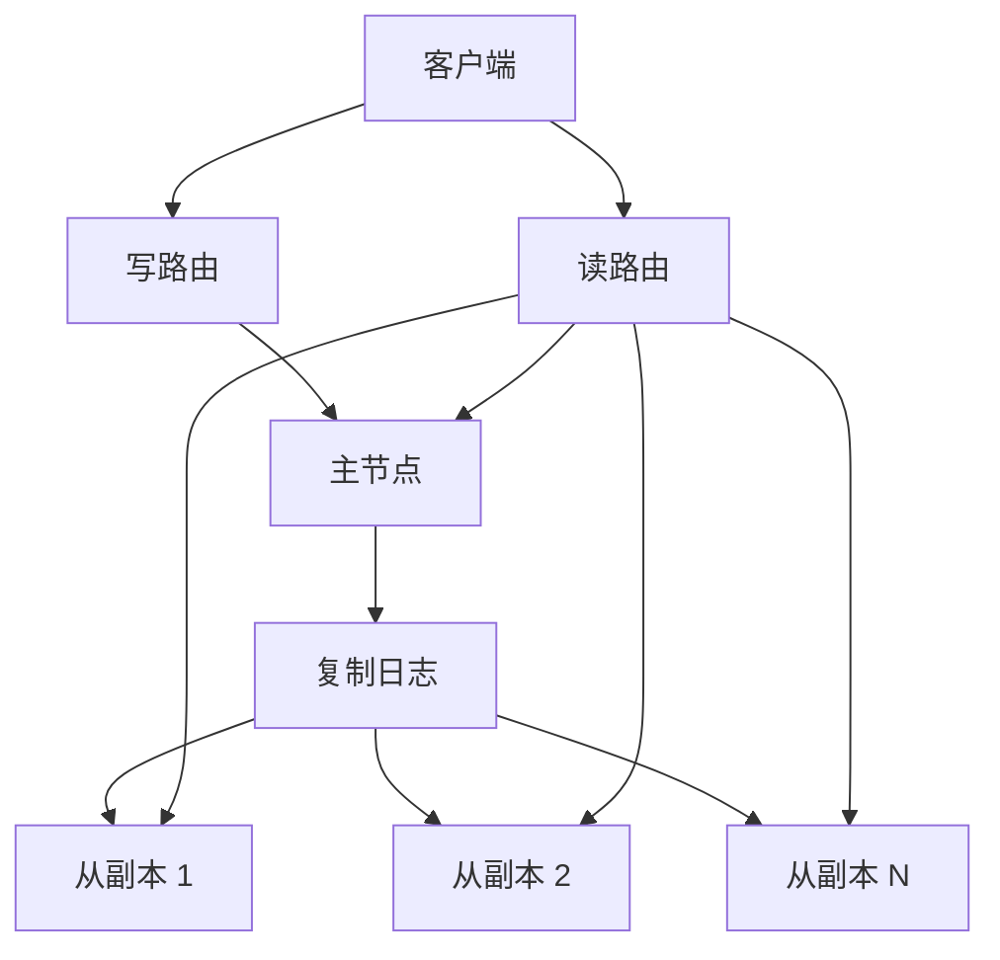
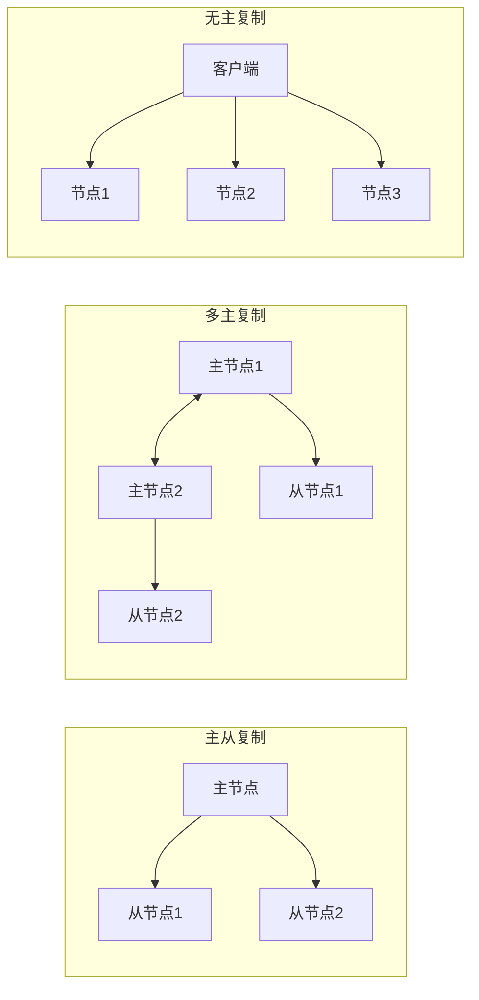

---
title: 分布式复制
date: 2022-06-11 10:40:10
categories:
  - 分布式
  - 分布式协同
tags:
  - 分布式
  - 协同
  - 复制
  - 主从
  - 多主
  - 无主
permalink: /pages/5fa6f4cf/
---

# 分布式复制

**复制主要指通过网络在多台机器上保存相同数据的副本**。

复制数据，可能出于各种各样的原因：

- **提高可用性** - 当部分组件出现位障，系统依然可以继续工作，系统依然可以继续工作。
- **降低访问延迟** - 使数据在地理位置上更接近用户。
- **提高读吞吐量** - 扩展至多台机器以同时提供数据访问服务。

复制的模式有以下几种：

- **主从复制** - **所有的写入操作都发送到主节点**，由主节点负责将数据更改事件发送到从节点。每个从节点都可以接收读请求，但内容可能是过期值。
- **多主复制** - **系统存在多个主节点，每个都可以接收写请求**，客户端将写请求发送到其中的一个主节点上，由该主节点负责将数据更改事件同步到其他主节点和自己的从节点。
- **无主复制** - **系统中不存在主节点，每一个节点都能接受客户端的写请求**。接受写请求的副本不会将数据变更同步到其他的副本。此外，**读取时从多个节点上并行读取，以此检测和纠正某些过期数据**。

此外，复制还需要考虑以下问题：

- **同步还是异步**
- **如何处理失败的副本**
- **如何保证数据一致**

## 特性

分布式复制具备以下核心特性：

| 特性 | 说明 |
| --- | --- |
| **高可用性** | 数据存在多个副本，部分节点故障时系统仍可对外提供服务 |
| **容错性** | 单副本损坏可通过其他副本恢复，避免数据丢失 |
| **读扩展性** | 读请求可分散到多个从节点，提升读吞吐量 |
| **地理就近** | 副本可部署在不同数据中心，使用户就近访问，降低延迟 |
| **最终一致性** | 异步复制下，副本间存在短暂不一致，但最终会收敛到一致状态 |
| **复制滞后容忍** | 通过写后读、单调读、前缀一致读等机制缓解复制滞后带来的用户体验问题 |

## 原理

### 复制的基本模型



### 三种复制模式对比



| 模式 | 写入方式 | 冲突处理 | 适用场景 | 典型系统 |
| --- | --- | --- | --- | --- |
| **主从复制** | 所有写请求经由主节点 | 无冲突（单点写入） | 读多写少、强一致性要求 | `MySQL`、`PostgreSQL`、`MongoDB` |
| **多主复制** | 多个主节点均可写入 | 需冲突检测与解决 | 多数据中心、离线协作 | `MySQL`（外部工具）、`CouchDB` |
| **无主复制** | 客户端直接写多副本 | 基于 `Quorum` 和版本号 | 高可用、高写入吞吐 | `Cassandra`、`Dynamo`、`Riak` |

## 主从复制

如何确保所有副本之间的数据是一致的？

对于每一次数据写入，所有副本都需要随之更新；否则，某些副本将出现数据不一致。

最常见的解决方案就是**主从复制**，其原理如下：

主从复制模式中只有一个主副本（或称为主节点） ，其余称为从副本（或称为从节点）。

1. 所有的写请求只能发送给主副本，主副本首先将新数据写入本地存储。

2. 然后，主副本将数据更改作为复制的日志或更新流发送给所有从副本。每个从副本获得更新数据之后将其应用到本地，且严格保持与主副本相同的写入顺序。

3. 读请求既可以在主副本上，也可以在从副本上执行。

再次强调，**只有主副本才可以接受写请求**：从客户端的角度来看，从副本都是只读的。如果由于某种原因，例如与主节点之间的网络中断而导致主节点无法连接，主从复制方案就会影响所有的写入操作。


支持主从复制的系统：

- 数据库：MySql、PostgreSQL（9.0 版本后）、MongoDB 等
- 消息队列：Kafka、RabbitMQ 等

### 同步复制与异步复制


通常情况下，复制速度会非常快。但是，系统其实并没有保证一定会在多长时间内完成复制。有些情况下，从节点可能落后主节点几分钟甚至更长时间，例如，由于从节点刚从故障中恢复，或者系统已经接近最大设计上限，或者节点之间的网络出现问题。

- **同步复制的优点**：一旦向用户确认，从节点可以明确保证完成了与主节点的更新同步，数据已经处于最新版本。万一主节点发生故障，总是可以在从节点继续访问最新数据。
- **同步复制的缺点**：如果同步的从节点无法完成确认（例如由于从节点发生崩溃，或者网络故障，或任何其他原因），写入就不能视为成功。主节点会阻塞其后所有的写操作，直到同步副本确认完成。

因此，**把所有从节点都配置为同步复制有些不切实际**。因为这样的话，任何一个同步节点的中断都会导致整个系统更新停滞不前。实际应用中，推荐的同步模式（也是很多数据库的选择）是：**只要有一个从节点或半数以上的从节点同步成功，就视为同步，直接返回结果；剩下的节点都通过异步方式同步**。万一同步的从节点变得不可用或性能下降，则将另一个异步的从节点提升为同步模式。这样可以保证至少有两个节点（即主节点和一个同步从节点）拥有最新的数据副本。这种配置有时也称为**半同步**。

主从复制还经常会被配置为全异步模式。

- **异步复制的优点**：不管从节点上数据多么滞后，主节点总是可以继续响应写请求，系统的吞吐性能更好。
- **异步复制的缺点**：如果主节点发生故障且不可恢复，则所有尚未复制到从节点的写请求都会丢失。这意味着即使向客户端确认了写操作，却无法保证数据的持久化。

### 配置新的从节点

当如果出现以下情况时，如需要增加副本数以提高容错能力，或者替换失败的副本，就需要考虑增加新的从节点。但如何确保新的从节点和主节点保持数据一致呢？

简单地将数据文件从一个节点复制到另一个节点通常是不够的。主要是因为客户端仍在不断向数据库写入新数据，数据始终处于不断变化之中，因此常规的文件拷贝方式将会导致不同节点上呈现出不同时间点的数据。

另一种思路是：考虑锁定数据库（使其不可写）来使磁盘上的文件保持一致，但这会违反高可用的设计目标。在不停机、数据服务不中断的前提下，也有一种可行性复制方案，其主要操作步骤如下：

1. 在某个时间点对主节点的数据副本产生一个一致性快照，这样避免长时间锁定整个数据库。目前大多数数据库都支持此功能，快照也是系统备份所必需的。而在某些情况下，可能需要第三方工具，如 MySQL 的 innobackupex。
2. 将此快照拷贝到新的从节点。
3. 从节点连接到主节点并请求快照点之后所发生的数据更改日志。因为在第一步创建快照时，快照与系统复制日志的某个确定位置相关联，这个位置信息在不同的系统有不同的称呼，如 PostgreSQL 将其称为“ log sequence number” （日志序列号），而 MySQL 将其称为“ binlog coordinates ” 。
4. 获得日志之后，从节点来应用这些快照点之后所有数据变更，这个过程称之为追赶。接下来，它可以继续处理主节点上新的数据变化。井重复步骤 1 ～步骤 4 。

在不同系统中，建立新的从副本具体操作步骤可能有所不同。

### 处理节点失效

系统中的任何节点都可能因故障或者计划内的维护（例如重启节点以安装内核安全补丁）而导致中断甚至停机。如果能够在不停机的情况下重启某个节点，这会对运维带来巨大的便利。我们的目标是，尽管个别节点会出现中断，但要保持系统总体的持续运行，并尽可能减小节点中断带来的影响。

如何通过主从复制技术来实现系统高可用呢？

#### 从节点失效：追赶式恢复

从节点的本地磁盘上都保存了副本收到的数据变更日志。如果从节点发生崩溃，然后顺利重启，或者主从节点之间的网络发生暂时中断（闪断），则恢复比较容易，根据副本的复制日志，从节点可以知道在发生故障之前所处理的最后一笔事务，然后连接到主节点，并请求自那笔事务之后中断期间内所有的数据变更。在收到这些数据变更日志之后，将其应用到本地来追赶主节点。之后就和正常情况一样持续接收来自主节点数据流的变化。

#### 主节点失效：节点切换

选择某个从节点将其提升为主节点；客户端也需要更新，这样之后的写请求会发送给新的主节点，然后其他从节点要接受来自新的主节点上的变更数据，这一过程称之为切换。

故障切换可以手动进行，例如通知管理员主节点发生失效，采取必要的步骤来创建新的主节点；或者以自动方式进行。自动切换的步骤通常如下：

1. **确认主节点失效**。有很多种出错可能性，很难准确检测出问题的原因，所以大多数系统都采用了基于超时的机制：节点间频繁地互相发生发送心跳悄息，如果发现某一个节点在一段比较长时间内（例如 30s ）没有响应，即认为该节点发生失效。
2. **选举新的主节点**。可以通过选举的方式（超过多数的节点达成共识）来选举新的主节点，或者由之前选定的某控制节点来指定新的主节点。候选节点最好与原主节点的数据差异最小，这样可以最小化数据丢失的风险。让所有节点同意新的主节点是个典型的共识问题。
3. **重新配置系统使新主节点生效**。客户端现在需要将写请求发送给新的主节点。如果原主节点之后重新上线，可能仍然自认为是主节点，而没有意识到其他节点已经达成共识迫使其下台。这时系统要确保原主节点降级为从节点，并认可新的主节点。

上述切换过程依然充满了很多变数：

- 如果使用了异步复制，且失效之前，新的主节点并未收到原主节点的所有数据；在选举之后，原主节点很快又重新上线并加入到集群，接下来的写操作会发生什么？新的主节点很可能会收到冲突的写请求，这是因为原主节点未意识的角色变化，还会尝试同步其他从节点，但其中的一个现在已经接管成为现任主节点。常见的解决方案是，原主节点上未完成复制的写请求就此丢弃，但这可能会违背数据更新持久化的承诺。
- 如果在数据库之外有其他系统依赖于数据库的内容并在一起协同使用，丢弃数据的方案就特别危险。例如，在 GitHub 的一个事故中，某个数据并非完全同步的 MySQL 从节点被提升为主副本，数据库使用了自增计数器将主键分配给新创建的行，但是因为新的主节点计数器落后于原主节点（ 即二者并非完全同步），它重新使用了已被原主节点分配出去的某些主键，而恰好这些主键已被外部 Redis 所引用，结果出现 MySQL 和 Redis 之间的不一致，最后导致了某些私有数据被错误地泄露给了其他用户。
- 在某些故障情况下，可能会发生两个节点同时－都自认为是主节点。这种情况被称为**脑裂**，它非常危险：两个主节点都可能接受写请求，并且没有很好解决冲突的办法，最后数据可能会丢失或者破坏。作为一种安全应急方案，有些系统会采取措施来强制关闭其中一个节点。然而，如果设计或者实现考虑不周，可能会出现两个节点都被关闭的情况。
- 如何设置合适的超时来检测主节点失效呢？ 主节点失效后，超时时间设置得越长也意味着总体恢复时间就越长。但如果超时设置太短，可能会导致很多不必要的切换。例如，突发的负载峰值会导致节点的响应时间变长甚至超肘，或者由于网络故障导致延迟增加。如果系统此时已经处于高负载压力或网络已经出现严重拥塞，不必要的切换操作只会使总体情况变得更糟。

### 复制日志的实现

#### 基于语句的复制

最简单的情况，主节点记录所执行的每个写请求（操作语句）井将该操作语句作为日志发送给从节点。对于关系数据库，这意味着每个 INSERT 、UPDATE 或 DELETE 语句都会转发给从节点，并且每个从节点都会分析井执行这些 SQU 吾句，如同它们是来自客户端那样。

听起来很合理也不复杂，但这种复制方式有一些不适用的场景：

- 任何调用非确定性函数的语句，如 `NOW()` 获取当前时间，或 `RAND()` 获取一个随机数等，可能会在不同的副本上产生不同的值。
- 如果语句中使用了自增列，或者依赖于数据库的现有数据（例如，`UPDATE ... WHERE <某些条件>`），则所有副本必须按照完全相同的顺序执行，否则可能会带来不同的结果。进而，如果有多个同时并发执行的事务时，会有很大的限制。
- 有副作用的语句（例如，触发器、存储过程、用户定义的函数等），可能会在每个副本上产生不同的副作用。

有可能采取一些特殊措施来解决这些问题，例如，主节点可以在记录操作语句时将非确定性函数替换为执行之后的确定的结果，这样所有节点直接使用相同的结果值。但是，这里面存在太多边界条件需要考虑，因此目前通常首选的是其他复制实现方案。

MySQL 5.1 版本之前采用基于操作语句的复制。现在由于逻辑紧凑，依然在用，但是默认情况下，如果语句中存在一些不确定性操作，则 MySQL 会切换到基于行的复制（稍后讨论）。VoltDB 使用基于语句的复制，它通过事务级别的确定性来保证复制的安全。

#### 基于预写日志（WAL）传输

通常每个写操作都是以追加写的方式写入到日志中：

- 对于日志结构存储引擎，日志是主要的存储方式。日志段在后台压缩井支持垃圾回收。
- 对于采用覆写磁盘的 BTree 结构，每次修改会预先写入日志，如系统发生崩溃，通过索引更新的方式迅速恢复到此前一致状态。

不管哪种情况，所有对数据库写入的字节序列都被记入日志。因此可以使用完全相同的日志在另一个节点上构建副本：除了将日志写入磁盘之外，主节点还可以通过网络将其发送给从节点。

PostgreSQL 、Oracle 以及其他系统等支持这种复制方式。其主要缺点是日志描述的数据结果非常底层：一个 WAL 包含了哪些磁盘块的哪些字节发生改变，诸如此类的细节。这使得复制方案和存储引擎紧密耦合。如果数据库的存储格式从一个版本改为另一个版本，那么系统通常无能支持主从节点上运行不同版本的软件。

看起来这似乎只是个有关实现方面的小细节，但可能对运营产生巨大的影响。如果复制协议允许从节点的软件版本比主节点更新，则可以实现数据库软件的不停机升级：首先升级从节点，然后执行主节点切换，使升级后的从节点成为新的主节点。相反，复制协议如果要求版本必须严格一致（例如 WALf 专输），那么就势必以停机为代价。

#### 基于行的逻辑日志复制

如果复制和存储引擎采用不同的日志格式，这样复制与存储的逻辑就可以剥离。这种复制日志称为逻辑日志，以区分物理存储引擎的数据表示。

关系数据库的逻辑日志通常是指一系列记录来描述数据表行级别的写请求：

- 对于行插入，日志包含所有相关列的新值。
- 对于行删除，日志里有足够的信息来唯一标识已删除的行，通常是靠主键，但如果表上没有定义主键，就需要记录所有列的旧值。
- 对于行更新，日志包含足够的信息来唯一标识更新的行，以及所有列的新值（或至少包含所有已更新列的新值）。

如果一条事务涉及多行的修改，则会产生多个这样的日志记录，并在后面跟着一条记录，指出该事务已经提交。MySQL 的二进制日志 binlog （当配置为基于行的复制时）使用该方式。

由于逻辑日志与存储引擎逻辑解耦，因此可以更容易地保持向后兼容，从而使主从节点能够运行不同版本的软件甚至是不同的存储引擎。

对于外部应用程序来说，逻辑日志格式也更容易解析。

#### 基于触发器的复制

在某些情况下，我们可能需要更高的灵活性。例如，只想复制数据的一部分，或者想从一种数据库复制到另一种数据库，或者需要订制、管理冲突解决逻辑，则需要将复制控制交给应用程序层。

有一些工具，可以通过读取数据库日志让应用程序获取数据变更。另一种方法则是借助许多关系数据库都支持的功能：触发器和存储过程。

触发器支持注册自己的应用层代码，使得当数据库系统发生数据更改（写事务）时自动执行上述自定义代码。通过触发器技术，可以将数据更改记录到一个单独的表中，然后外部处理逻辑访问该表，实施必要的自定义应用层逻辑，例如将数据更改复制到另一个系统。Oracle 的 Databus 和 Postgres 的 Bucardo 就是这种技术的典型代表。基于触发器的复制通常比其他复制方式开销更高，也比数据库内置复制更容易出错，或者暴露一些限制。然而，其高度灵活性仍有用武之地。

## 复制滞后问题

主从复制要求所有写请求都经由主节点，而任何副本只能接受只读查询。对于读操作密集的负载（如 Web ），这是一个不错的选择：创建多个从副本，将读请求分发给这些从副本，从而减轻主节点负载井允许读取请求就近满足。

在这种扩展体系下，只需添加更多的从副本，就可以提高读请求的服务吞吐量。但是，这种方法实际上只能用于异步复制，如果试图同步复制所有的从副本，则单个节点故障或网络中断将使整个系统无法写入。而且节点越多，发生故障的概率越高，所以完全同步的配置现实中反而非常不可靠。

不幸的是，如果一个应用正好从一个异步的从节点读取数据，而该副本落后于主节点，则应用可能会读到过期的信息。这会导致数据库中出现明显的不一致：由于并非所有的写入都反映在从副本上，如果同时对主节点和从节点发起相同的查询，可能会得到不同的结果。经过一段时间之后，从节点最终会赶上并与主节点数据保持一致。这种效应也被称为**最终一致性**。

### 写后读一致性

许多应用让用户提交一些数据，接下来查看他们自己所提交的内容。例如客户数据库中的记录，亦或者是讨论主题的评论等。提交新数据须发送到主节点，但是当用户读取数据时，数据可能来自从节点。这对于读多写少的场景是个非常合适的方案。

然而对于异步复制存在这样一个问题，如图所示，用户在写入不久即查看数据，则新数据可能尚未到达从节点。对用户来讲，看起来似乎是刚刚提交的数据丢失了，显然用户不会高兴。


对于这种情况，我们需要读写一致性。该机制保证如果用户重新加载页面，他们总能看到自己最近提交的更新。但对其他用户则没有任何保证，这些用户的更新可能会在稍后才能刷新看到。如何实现呢？有以下几种可行性方案：

- **如果用户访问可能会被修改的内容，从主节点读取； 否则，在从节点读取**。这背后就要求有一些方法在实际执行查询之前，就已经知道内容是否可能会被修改。例如，社交网络上的用户首页信息通常只能由所有者编辑，而其他人无法编辑。因此，这就形成一个简单的规则：总是从主节点读取用户自己的首页配置文件，而在从节点读取其他用户的配置文件。
- **如果应用的大部分内容都可能被所有用户修改**，那么上述方法将不太有效，它会导致大部分内容都必须经由主节点，这就丧失了读操作的扩展性。此时需要其他方案来判断是否从主节点读取。例如，跟踪最近更新的时间，如果更新后一分钟之内，则总是在主节点读取；井监控从节点的复制滞后程度，避免从那些滞后时间超过一分钟的从节点读取。
- 客户端还可以记住最近更新时的时间戳，井附带在读请求中，据此信息，系统可以确保对该用户提供读服务时都应该至少包含了该时间戳的更新。如果不够新，要么交由另一个副本来处理，要么等待直到副本接收到了最近的更新。时间戳可以是逻辑时间戳（例如用来指示写入顺序的日志序列号）或实际系统时钟（在这种情况下，时钟同步又称为一个关键点）。
- 如果副本分布在多数据中心（例如考虑与用户的地理接近，以及高可用性），情况会更复杂些。必须先把请求路由到主节点所在的数据中心（该数据中心可能离用户很远）。

如果同一用户可能会从多个设备访问数据，情况会更加复杂。此时，要提供跨设备的写后读一致性，即如果用户在某设备上输入了一些信息然后在另一台设备商查看，也应该看到刚刚所输入的内容。在这种情况下，还有一些需要考虑的问题：

- 记住用户上次更新时间戳的方法实现起来会比较困难，因为在一台设备上运行的代码完全无法知道在其他设备上发生了什么。此时，元数据必须做到全局共享。
- 如果副本分布在多数据中心，无法保证来自不同设备的连接经过路由之后都到达同一个数据中心。例如，用户的台式计算机使用了家庭宽带连接，而移动设备则使用蜂窝数据网络，不同设备的网络连接线路可能完全不同。如果方案要求必须从主节点读取，则首先需要想办毡确保将来自不同设备的请求路由到同一个数据中心。

### 单调读

假定用户从不同副本进行了多次读取，如图所示，用户刷新一个网页，读请求可能被随机路由到某个从节点。用户 2345 先后在两个从节点上执行了两次完全相同的查询（先是少量滞后的节点，然后是滞后很大的从节点），则很有可能出现以下情况。第一个查询返回了最近用户 1234 所添加的评论，但第二个查询因为滞后的原因，还没有收到更新因而返回结果是空。用户看到了最新内容之后又读到了过期的内容，好像时间被回拨，此时需要单调读一致性。


单调读一致性可以确保不会发生这种异常。这是一个比强一致性弱，但比最终一致性强的保证。当读取数据时，单调读保证，如果某个用户依次进行多次读取，则他绝不会看到回攘现象，即在读取较新值之后又发生读旧值的情况。

实现单调读的一种方式是，确保每个用户总是从固定的同一副本执行读取（而不同的用户可以从不同的副本读取）。例如，基于用户 ID 的哈希的方怯而不是随机选择副本。但如果该副本发生失效，则用户的查询必须重新路由到另一个副本。

### 前缀一致读

前缀一致读：对于一系列按照某个顺序发生的写请求，那么读取这些内容时也会按照当时写入的顺序。

如果数据库总是以相同的顺序写入，则读取总是看到一致的序列，不会发生这种反常。然而，在许多分布式数据库中，不同的分区独立运行，因此不存在全局写入顺序。这就导致当用户从数据库中读数据时，可能会看到数据库的某部分旧值和另一部分新值。


一个解决方案是确保任何具有因果顺序关系的写入都交给一个分区来完成，但该方案真实实现效率会大打折扣。现在有一些新的算法来显式地追踪事件因果关系。

### 复制滞后的解决方案

使用最终一致性系统时，最好事先就思考这样的问题：如果复制延迟增加到几分钟甚至几小时，那么应用层的行为会是什么样子？如果这种情况不可接受，那么在设计系统肘，就要考虑提供一个更强的一致性保证，比如写后读； 如果系统设计时假定是同步复制，但最终它事实上成为了异步复制，就可能会导致灾难性后果。

在应用层可以提供比底层数据库更强有力的保证。例如只在主节点上进行特定类型的读取，而代价则是，应用层代码中处理这些问题通常会非常复杂，且容易出错。

如果应用程序开发人员不必担心这么多底层的复制问题，而是假定数据库在“做正确的事情”，情况就变得很简单。而这也是事务存在的原因，事务是数据库提供更强保证的一种方式。

单节点上支持事务已经非常成熟。然而，在转向分布式数据库（即支持复制和分区）的过程中，有许多系统却选择放弃支持事务，并声称事务在性能与可用性方面代价过高，所以选择了最终一致性。

## 多主复制

主从复制方法较为常见，但存在一个明显的缺点：系统只有一个主节点，而所有写入都必须经由主节点。如果由于某种原因，例如与主节点之间的网络中断而导致主节点无法连接，主从复制方案就会影响所有的写入操作。

对主从复制模型进行自然的扩展，则可以配置多个主节点，每个主节点都可以接受写操作，后面复制的流程类似：处理写的每个主节点都必须将该数据更改转发到所有其他节点。这就是多主节点（ 也称为主－主，或主动／主动）复制。此时，每个主节点还同时扮演其他主节点的从节点。

### 适用场景

在一个数据中心内部使用多主节点基本没有太大意义，其复杂性已经超过所能带来的好处。

但是，以下场景这种配置则是合理的：

- 多数据中心
- 离线客户端操作
- 协作编辑

#### 多数据中心

为了容忍整个数据中心级别故障或者更接近用户，可以把数据库的副本横跨多个数据中心。而如果使用常规的基于主从的复制模型，主节点势必只能放在其中的某一个数据中心，而所有写请求都必须经过该数据中心。

有了多主节点复制模型，则可以在每个数据中心都配置主节点。在每个数据中心内，采用常规的主从复制方案；而在数据中心之间，由各个数据中心的主节点来负责同其他数据中心的主节点进行数据的交换、更新。


部署单主节点的主从复制方案与多主复制方案之间的差异

- **性能**：对于主从复制，每个写请求都必须经由广域网传送至主节点所在的数据中心。这会大大增加写入延迟，井基本偏离了采用多数据中心的初衷（即就近访问）。而在多主节点模型中，每个写操作都可以在本地数据中心快速响应，然后采用异步复制方式将变化同步到其他数据中心。因此，对上层应用有效屏蔽了数据中心之间的网络延迟，使得终端用户所体验到的性能更好。
- **容忍数据中心失效**：对于主从复制，如果主节点所在的数据中心发生故障，必须切换至另一个数据中心，将其中的一个从节点被提升为主节点。在多主节点模型中，每个数据中心则可以独立于其他数据中心继续运行，发生故障的数据中心在恢复之后更新到最新状态。
- **容忍网络问题**：数据中心之间的通信通常经由广域网，它往往不如数据中心内的本地网络可靠。对于主从复制模型，由于写请求是同步操作，对数据中心之间的网络性能和稳定性等更加依赖。多主节点模型则通常采用异步复制，可以更好地容忍此类问题，例如临时网络闪断不会妨碍写请求最终成功。

有些数据库己内嵌支持了多主复制，但有些则借助外部工具来实现，例如 MySQL 的 Tungsten Replicator，PostgreSQL BDR 以及 Oracle GoldenGate。

多主复制的缺点：不同的数据中心可能会同时修改相同的数据，因而必须解决潜在的写冲突。

#### 离线客户端操作

另一种多主复制比较适合的场景是，应用在与网络断开后还需要继续工作。在离线状态下进行的任何更改，会在设备下次上线时，与服务器一级其他设备同步。

这种情况下，每个设备都有一个充当主节点的本地数据库（用来接受写请求），然后在所有设备之间采用异步方式同步这些多主节点上的副本，同步滞后可能是几小时或者数天，具体时间取决于设备何时可以再次联网。

从架构层面来看，上述设置基本上等同于数据中心之间的多主复制，只不过是个极端情况，即一个设备就是数据中心，而且它们之间的网络连接非常不可靠。多个设备同步日历的例子表明，多主节点可以得到想要的结果，但中间过程依然有很多的未知数。

有一些工具可以使多主配置更为容易，如 CouchDB 就是为这种操作模式而设计的。

#### 协作编辑

实时协作编辑应用程序允许多个用户同时编辑文档。例如，Etherpad 和 Google Docs 允许多人同时编辑文本文档或电子表格。

我们通常不会将协作编辑完全等价于数据库复制问题，但二者确实有很多相似之处。当一个用户编辑文档时· ，所做的更改会立即应用到本地副本（ Web 浏览器或客户端应用程序），然后异步复制到服务器以及编辑同一文档的其他用户。

如果要确保不会发生编辑冲突，则应用程序必须先将文档锁定，然后才能对其进行编辑。如果另一个用户想要编辑同一个文档，首先必须等到第一个用户提交修改并释放锁。这种协作模式相当于主从复制模型下在主节点上执行事务操作。

为了加快协作编辑的效率，可编辑的粒度需要非常小。例如，单个按键甚至是全程无锁。然而另一方面，也会面临所有多主复制都存在的挑战，即如何解决冲突。

### 处理写冲突

多主复制的最大问题是可能发生写冲突。

例如，两个用户同时编辑 Wiki 页面，如图所示。用户 1 将页面的标题从 A 更改为 B，与此同时用户 2 将标题从 A 更改为 C。每个用户的更改都成功地提交到本地主节点。但是，当更改被异步复制到对方时，会发现存在冲突。注意：正常情况下的主从复制不会出现这种情况。


#### 同步与异步冲突检测

如果是主从复制数据库，第二个写请求要么会被阻塞直到第一个写完成，要么被中止（用户必须重试） 。然而在多主节点的复制模型下，这两个写请求都是成功的，井且只能在稍后的时间点上才能异步检测到冲突，那时再要求用户层来解决冲突为时已晚。

理论上，也可以做到同步冲突检测，即等待写请求完成对所有副本的同步，然后再通知用户写入成功。但是，这样做将会失去多主节点的主要优势：允许每个主节点独立接受写请求。如果确实想要同步方式冲突检测，或许应该考虑采用单主节点的主从复制模型。

#### 避免冲突

处理冲突最理想的策略是避免发生冲突，即如果应用层可以保证对特定记录的写请求总是通过同一个主节点，这样就不会发生写冲突。现实中，由于不少多主节点复制模型所实现的冲突解决方案存在瑕疵，因此，避免冲突反而成为大家普遍推荐的首选方案。

但是，有时可能需要改变事先指定的主节点，例如由于该数据中心发生故障，不得不将流量重新路由到其他数据中心，或者是因为用户已经漫游到另一个位置，因而更靠近新数据中心。此时，冲突避免方式不再有效，必须有措施来处理同时写入冲突的可能性。

#### 收敛于一致状态

对于主从复制模型，数据更新符合顺序性原则，即如果同一个字段有多个更新，则最后一个写操作将决定该字段的最终值。

对于多主节点复制模型，由于不存在这样的写入顺序，所以最终值也会变得不确定。

实现收敛的冲突解决有以下可能的方式：

- 给每个写入分配唯一的 ID ，例如，一个时间戳，一个足够长的随机数，一个 UUID 或者一个基于键－值的哈希，挑选最高 ID 的写入作为胜利者，并将其他写入丢弃。如果基于时间戳，这种技术被称为最后写入者获胜。虽然这种方法很流行，但是很容易造成数据丢失。
- 为每个副本分配一个唯一的 ID ，井制定规则，例如序号高的副本写入始终优先于序号低的副本。这种方法也可能会导致数据丢失。
- 以某种方式将这些值合并在一起。例如，按字母顺序排序，然后拼接在一起。
- 利用预定义好的格式来记录和保留冲突相关的所有信息，然后依靠应用层的逻辑，事后解决冲突（可能会提示用户） 。

#### 自定义冲突解决逻辑

解决冲突最合适的方式可能还是依靠应用层，所以大多数多主节点复制模型都有工具来让用户编写应用代码来解决冲突。可以在写入时或在读取时执行这些代码逻辑：

- **在写入时执行**：只要数据库系统在复制变更日志时检测到冲突，就会调用应用层的冲突处理程序。
- **在读取时执行**：当检测到冲突时，所有冲突写入值都会暂时保存下来。下一次读取数据时，会将数据的多个版本读返回给应用层。应用层可能会提示用户或自动解决冲突，井将最后的结果返回到数据库。

注意，冲突解决通常用于单个行或文档，而不是整个事务。因此，如果有一个原子事务包含多个不同写请求，每个写请求仍然是分开考虑来解决冲突。

### 拓扑结构

如果存在两个以上的主节点，则存在多种可能的复制拓扑结构。


最常见的拓扑结构是全部-至-全部，每个主节点将其写入同步到其他所有主节点。而其他一些拓扑结构也有普遍使用，例如，默认情况下 MySQL 只支持环形拓扑结构，其中的每个节点接收来自前序节点的写入，并将这些写入（加上自己的写入）转发给后序节点。另一种流行的拓扑是星形结构：一个指定的根节点将写入转发给所有其他节点。星形拓扑还可以推广到树状结构。

在环形和星形拓扑中，写请求需要通过多个节点才能到达所有的副本，即中间节点需要转发从其他节点收到的数据变更。为防止无限循环，**每个节点需要赋予一个唯一的标识符，在复制日志中的每个写请求都标记了已通过的节点标识符。如果某个节点收到了包含自身标识符的数据更改，表明该请求已经被处理过，因此会忽略此变更请求，避免重复转发**。

**环形和星形拓扑的问题是，如果某一个节点发生了故障，在修复之前，会影响其他节点之间复制日志的转发。**可以采用重新配置拓扑结构的方法暂时排除掉故障节点。在大多数部署中，这种重新配置必须手动完成。而对于链接更密集的拓扑（如全部到全部），消息可以沿着不同的路径传播，避免了单点故障，因而有更好的容错性。

但另一方面，全链接拓扑也存在一些自身的问题。主要是存在某些网络链路比其他链路更快的情况（例如由于不同网络拥塞），从而导致复制日志之间的覆盖。

如下图所示，客户端 A 向主节点 1 的表中首先插入一行，然后客户端 B 在主节点 3 上对行记录进行更新。而在主节点 2 上，由于网络原因可能出现意外的写日志复制顺序，例如它先接收到了主节点 3 的更新日志，之后才接收到主节点 1 的插入日志。


这里涉及到一个因果关系问题，类似于在前面“前缀一致读”所看到的：更新操作一定是依赖于先前完成的插入，因此我们要确保所有节点上一定先接收插入日志，然后再处理更新。在每笔写日志里简单地添加时间戳还不够，主要因为无法确保时钟完全同步，因而无法在主节点 2 上正确地排序所收到日志。

为了使得日志消息正确有序，可以使用一种称为版本向量的技术，稍后将讨论这种技术（参见“检测并发写入”）。需要指出，冲突检测技术在许多多主节点复制系统中的实现还不够完善。

## 无主复制

单主节点和多主节点复制，都是基于这样一种核心思路，即客户端先向某个节点（主节点）发送写请求，然后数据库系统负责将写请求复制到其他副本。由主节点决定写操作的顺序，从节点按照相同的顺序来应用主节点所发送的写日志。

一些数据存储系统则采用了不同的设计思路：选择放弃主节点，允许任何副本直接接受来自客户端的写请求。对于某些无主节点系统实现，客户端直接将其写请求发送到多副本，而在其他一些实现中，由一个协调者节点代表客户端进行写人，但与主节点的数据库不同，协调者井不负责写入顺序的维护。

### 节点失效时写入数据库

假设一个三副本数据库，其中一个副本当前不可用。在基于主节点复制模型下，如果要继续处理写操作，则需要执行切换操作。

对于无主节点配置，则不存在这样的切换操作。用户将写请求并行发送到三个副本，有两个可用副本接受写请求，而不可用的副本无法处理该写请求。如果假定三个副本中有两个成功确认写操作，用户收到两个确认的回复之后，即可认为写入成功。客户完全可以忽略其中一个副本无法写入的情况。


失效的节点之后重新上线，而客户端又开始从中读取内容。由于节点失效期间发生的任何写入在该节点上都尚未同步，因此读取可能会得到过期的数据。

为了解决这个问题，当一个客户端从数据库中读取数据时，它不是向一个副本发送请求，而是并行地发送到多个副本。客户端可能会得到不同节点的不同响应，包括某些节点的新值和某些节点的旧值。可以采用版本号技术确定哪个值更新（参见后面的“检测并发写入”）。

#### 读修复与反熵

复制模型应确保所有数据最终复制到所有的副本。当一个失效的节点重新上线之后，如何赶上中间错过的那些写请求呢？

有以下两种机制：

- **读修复** - 当客户端井行读取多个副本时，可以检测到过期的返回值。然后将新值写入到过期的副本中。这种方法主要适合那些被频繁读取的场景。
- **反熵** - 利用后台进程不断查找副本间的数据差异，将任何缺少的数据从一个副本复制到另一个副本。与基于主节点复制的复制日志不同，反熵过程并不保证以特定的顺序复制写入，并且会引入明显的同步滞后。

#### 读写 quorum

我们知道，成功的写操作要求三个副本中至少两个完成，这意味着至多有一个副本可能包含旧值。因此，在读取时需要至少向两个副本发起读请求，通过版本号可以确定一定至少有一个包含新值。如果第三个副本出现停机或响应缓慢，则读取仍可以继续并返回最新值。

把上述道理推广到一般情况，**如果有 n 个副本，写入需要 w 个节点确认，读取必须至少查询 r 个节点，则只要 w + r > n，读取的节点中一定会包含最新值**。例如在前面的例子中，n = 3，w = 2，r = 2。满足上述这些 r、w 值的读/写操作称之为法定票数读或法定票数写。也可以认为 r 和 w 是用于判定读、写是否有效的最低票数。

参数 n、w 和 r 通常是可配置的，一个常见的选择是设置 n 为某奇数，w = r = (n + 1) / 2（向上舍入）。也可以根据自己的需求灵活调整这些配置。例如，对于读多写少的负载，设置 w = n 和 r = 1 比较合适，这样读取速度更快，但是一个失效的节点就会使得数据库所有写入因无法完成 quorum 而失败。

### quorum 一致性的局限性

通常，设定 r 和 w 为简单多数（多于 n / 2）节点，即可确保 w + r > n，且同时容忍多达 n / 2 个节点故障。但是，**quorum 不一定非得是多数，读和写的节点集中有一个重叠的节点才是最关键的**。

也可以将 w 和 r 设置为较小的数字，从而让 w + r <= n。此时，读取和写入操作仍会被发送到 n 个节点，但只需等待更少的节点回应即可返回。

由于 w 和 r 配置的节点数较小，读取请求当中可能恰好没有包含新值的节点，因此最终可能会返回一个过期的旧值。好的一方面是，这种配置可以获得更低的延迟和更高的可用性，例如网络中断，许多副本变得无法访问，相比而言有更高的概率继续处理读取和写入。只有当可用的副本数已经低于 w 或 r 时，数据库才会变得无法读/写，即处于不可用状态。

即使在 w + r > n 的情况下，也可能存在返回旧值的边界条件。这主要取决于具体实现，可能的情况包括：

- 如果采用了 sloppy quorum（参阅后面的“宽松的 quorum 与数据回传”），写操作的 w 节点和读取的 r 节点可能完全不同，因此无法保证读写请求一定存在重叠的节点。
- 如果两个写操作同时发生，则无法明确先后顺序。这种情况下，唯一安全的解决方案是合并并发写入（参见前面的“处理写冲突”）。如果根据时间戳挑选胜者，则由于时钟偏差问题，某些写入可能会被错误地抛弃。
- 如果写操作与读操作同时发生，写操作可能仅在一部分副本上完成。此时，读取时返回旧值还是新值存在不确定性。
- 如果某些副本上已经写入成功，而其他一些副本发生写入失败（例如磁盘已满），且总的成功副本数少于 w，那些已成功的副本上不会做回滚。这意味着尽管这样的写操作被视为失败，后续的读操作仍可能返回新值。
- 如果具有新值的节点后来发生失效，但恢复数据来自某个旧值，则总的新值副本数会低于 w，这就打破了之前的判定条件。
- 即使一切工作正常，也会出现一些边界情况，如一致性与共识中所介绍的“可线性化与 quorum”。

建议最好不要把参数 w 和 r 视为绝对的保证，而是一种灵活可调的读取新值的概率。

这里通常无法得到前面的“复制滞后问题”中所罗列的一致性保证，包括写后读、单调读、前缀一致读等，因此前面讨论种种异常同样会发生在这里。如果确实需要更强的保证，需要考虑事务与共识问题。

#### 宽松的 quorum 与数据回传

quorum 并不总如期待的那样提供高容错能力。一个网络中断可以很容易切断一个客户端到多数数据库节点的连接。尽管这些集群节点是活着的，而且其他客户端也确实可以正常连接，但是对于断掉连接的客户端来讲，情况无疑等价于集群整体失效。这种情况下，很可能无法满足最低的 w 和 r 所要求的节点数，因此导致客户端无法满足 quorum 要求。

在一个大规模集群中（节点数远大于 n 个），客户可能在网络中断期间还能连接到某些数据库节点，但这些节点又不是能够满足数据仲裁的那些节点。此时，我们是否应该接受该写请求，只是将它们暂时写入一些可访问的节点中？（这些节点并不在 n 个节点集合中）。

这种方案称之为宽松的仲裁：写入和读取仍然需要 w 和 r 个成功的响应，但包含了那些并不在先前指定的 n 个节点。一旦网络问题得到解决，临时节点需要把接收到的写入全部发送到原始主节点上。这就是所谓的数据回传。

可以看出，sloppy quorum 对于提高写入可用性特别有用：要有任何 w 个节点可用，数据库就可以接受新的写入。然而这意味着，即使满足 w + r > n，也不能保证在读取某个键时，一定能读到最新值，因为新值可能被临时写入 n 之外的某些节点且尚未回传过来。

### 检测并发写

无主复制数据库允许多个客户端对相同的主键同时发起写操作，即使采用严格的 quorum 机制也可能会发生写冲突。这与多主复制类似，此外，由于读时修复或者数据回传也会导致并发写冲突。

一个核心问题是，由于网络延迟不稳定或者局部失效，请求在不同的节点上可能会呈现不同的顺序。如图所示，对于包含三个节点的数据系统，客户端 A 和 B 同时向主键 X 发起写请求：


- 节点 1 收到来自客户端 A 的写请求，但由于节点失效，没有收到客户端 B 的写请求。
- 节点 2 首先收到 A 的写请求，然后是 B 的写请求。
- 节点 3 首先收到 B 的写请求，然后是 A 的写请求。

如果节点每当收到新的写请求时就简单地覆盖原有的主键，那么这些节点将永久无法达成一致。我们知道副本应该收敛于相同的内容，这样才能达成最终一致。但如何才能做到呢？如果不想丢失数据，必须了解很多关于数据库内部冲突处理的机制。

我们已经在前面的“处理写冲突”简要介绍了一些解决冲突的技巧，现在我们来更详细地探讨这个问题。

#### 最后写入者获胜（丢弃并发写入）

一种实现最终收敛的方法是，每个副本总是保存最新值，允许覆盖并丢弃旧值。那么，假定每个写请求都最终同步到所有副本，只要我们有一个明确的方法来确定哪一个写入是最新的，则副本可以最终收敛到相同的值。

这个想法其实有些争议，关键点在于前面所提到关于如何定义“最新”。不过即使无法确定写请求的“自然顺序”，我们可以强制对其排序。例如，为每个写请求附加一个时间戳，然后选择最新即最大的时间戳，丢弃较早时间戳的写入。这个冲突解决算法被称为最后写入者获胜（last write wins，LWW)。

LWW 可以实现最终收敛的目标，但是以牺牲数据持久性为代价。如果同一个主键有多个并发写，即使这些并发写都向客户端报告成功，但最后只有一个写入值会存活下来，其他的将被系统默默丢弃。在一些场景如缓存系统，覆盖写是可以接受的。如果覆盖、丢失数据不可接受，则 LWW 并不是解决冲突很好的选择。

要确保 LWW 安全无副作用的唯一方法是，只写入一次然后写入值视为不可变，这样就避免了对同一个主键的并发写。例如，Cassandra 的一个推荐使用方法就是采用 UUID 作为主键，这样每个写操作都针对的不同的、系统唯一的主键。

#### Happens-before 关系和并发

如果 B 知道 A，或者依赖于 A，或者以某种方式在 A 基础上构建，则称操作 A 在操作 B 之前发生。这是定义何为并发的关键。事实上，我们也可以简单地说，如果两个操作都不在另一个之前发生，那么操作是并发的。

因此，对于两个操作 A 和 B，一共存在三种可能性，我们需要的是一个算法来判定两个操作是否并发。如果一个操作发生在另一个操作之前，则后面的操作可以覆盖较早的操作。如果属于并发，就需要解决潜在的冲突问题。

#### 确定前后关系

我们来看一个确定操作并发性的算法，即两个操作究竟属于并发还是一个发生在另一个之前。简单起见，我们先从只有一个副本的数据库开始。

下图的例子是两个客户端同时向购物车添加商品。初始时购物车为空。然后两个客户端向数据库共发出五次写入操作：


1. 客户端 1 首先将牛奶加入购物车。这是第一次写入该主键的值，服务器保存成功然后分配版本 1，服务器将值与版本号一起返回给该客户端 1。
2. 客户端 2 将鸡蛋加入购物车，此时它并不知道客户端 1 已添加了牛奶，而是认为鸡蛋是购物车中的唯一物品。服务器为此写入并分配版本 2，然后将鸡蛋和牛奶存储为两个单独的值，最后将这两个值与版本号 2 返回给客户端 2。
3. 客户端 1 也并不意识上述步骤 2，想要将面粉加入购物车，且以为购物车的内容应该是[牛奶，面粉]，将此值与版本号 1 一起发送到服务器。服务器可以从版本号中知道[牛奶，面粉]的新值要取代先前值[牛奶]，但值[鸡蛋]则是新的并发操作。因此，服务器将版本 3 分配给[牛奶，面粉]并覆盖版本 1 的[牛奶]，同时保留版本 2 的值[鸡蛋]，将二者同时返回给客户端 1。
4. 客户端 2 想要加入火腿，也不知道客户端 1 刚刚加了面粉。其在最后一个响应中从服务器收到的两个值是[牛奶]和[蛋]，现在合并这些值，并添加火腿形成一个新的值[鸡蛋，牛奶，火腿]。它将该值与前一个版本号 2 一起发送到服务器。服务器检测到版本 2 会覆盖[鸡蛋]，但与[牛奶，面粉]是同时发生，所以设置为版本 4 并将所有这些值发送给客户端 2。
5. 最后，客户端 1 想要加培根。它以前在版本 3 中从服务器接收[牛奶,面粉]和[鸡蛋]，所以合并这些值，添加培根，并将最终值[牛奶，面粉，鸡蛋，培根]连同版本号 3 来覆盖[牛奶，面粉]，但与[鸡蛋，牛奶，火腿]并发，所以服务器会保留这些并发值。

上面操作之间的数据流可以通过下图展示。箭头表示某个操作发生在另一个操作之前，即后面的操作“知道”或是“依赖”于前面的操作。在这个例子中，因为总有另一个操作同时进行，所以每个客户端都没有时时刻刻和服务器上的数据保持同步。但是，新版本值最终会覆盖旧值，且不会发生已写入值的丢失。


服务器判断操作是否并发的依据主要依靠对比版本号，而并不需要解释新旧值本身。算法的工作流程如下：

- 服务器为每个主键维护一个版本号，每当主键新值写入时递增版本号，并将新版本号与写入的值一起保存。
- 当客户端读取主键时，服务器将返回所有（未被覆盖的）当前值以及最新的版本号。且要求写之前，客户必须先发送读请求。
- 客户端写主键，写请求必须包含之前读到的版本号、读到的值和新值合并后的集合。写请求的响应可以像读操作一样，会返回所有当前值，这样就可以像购物车例子那样一步步链接起多个写入的值。
- 当服务器收到带有特定版本号的写入时，覆盖该版本号或更低版本的所有值（因为知道这些值已经被合并到新传入的值集合中），但必须保存更高版本号的所有值（因为这些值与当前的写操作属于并发）。

#### 合并同时写入的值

一个简单的合并方法是基于版本号或时间戳来选择最后一个值，但这意味着会丢失部分数据。所以，需要在程序中额外做一些工作。在应用代码中合并非常复杂且容易出错，因此可以设计一些专门的数据结构来自动执行合并。例如，Riak 支持成为 CRDT 一系列数据结构，以合理的方式高效自动合并，包括支持删除标记。

#### 版本矢量

使用单个版本号来捕获操作间的依赖关系，当多个副本同时接受写入时，这是不够的。因此我们需要为每个副本和每个主键均定义一个版本号。每个副本在处理写入时增加自己的版本号，并且跟踪从其他副本看到的版本号。通过这些信息来指示要覆盖哪些值，该保留哪些并发值。

所有副本的版本号集合成为版本矢量。

## 应用场景

分布式复制在以下场景中应用广泛：

- **数据库高可用** - `MySQL` 主从复制实现读写分离和故障切换，主库故障时从库提升为主库，保证业务连续性。
- **多数据中心容灾** - 银行、金融系统在多个城市部署数据中心，数据跨机房复制，实现异地灾备。
- **读扩展** - 内容平台（新闻、视频）读请求远多于写请求，通过增加只读副本分担读压力。
- **离线同步** - 移动端应用在断网时本地写入，联网后与服务端同步，采用多主复制模型。如 `CouchDB`。
- **实时协作** - `Google Docs`、`Etherpad` 等多人实时编辑，底层采用类似多主复制的机制同步编辑操作。
- **消息队列镜像** - `RabbitMQ` 镜像队列将消息复制到多个节点，保证消息不丢失。

## 最佳实践

### 案例一：MySQL 主从复制搭建与读写分离

`MySQL` 主从复制是最常见的高可用和读写分离方案。

**（1）主库配置（my.cnf）**

```ini
[mysqld]
# 唯一标识，主从不能相同
server-id = 1
# 开启 binlog，使用行模式
log_bin = mysql-bin
binlog_format = ROW
binlog_row_image = MINIMAL
# 需要同步的数据库（可选）
binlog_do_db = order_db
# 忽略同步的数据库
binlog_ignore_db = mysql,information_schema,performance_schema
# 半同步复制插件（可选）
plugin_load = "rpl_semi_sync_master=semisync_master.so"
rpl_semi_sync_master_enabled = 1
rpl_semi_sync_master_timeout = 3000
```

**（2）从库配置（my.cnf）**

```ini
[mysqld]
# 唯一标识，必须与主库不同
server-id = 2
# 开启 relay log
relay_log = mysql-relay-bin
# 只读模式，防止误写
read_only = 1
# 半同步复制插件
plugin_load = "rpl_semi_sync_slave=semisync_slave.so"
rpl_semi_sync_slave_enabled = 1
```

**（3）创建复制账号并初始化同步**

```sql
-- 主库执行：创建复制账号
CREATE USER 'repl'@'%' IDENTIFIED BY 'Repl@123456';
GRANT REPLICATION SLAVE ON *.* TO 'repl'@'%';
FLUSH PRIVILEGES;

-- 主库执行：查看 binlog 位置
SHOW MASTER STATUS;
-- 记录 File 和 Position 的值，如 mysql-bin.000003 | 154

-- 从库执行：配置主库信息
CHANGE REPLICATION SOURCE TO
    SOURCE_HOST='192.168.1.100',
    SOURCE_PORT=3306,
    SOURCE_USER='repl',
    SOURCE_PASSWORD='Repl@123456',
    SOURCE_LOG_FILE='mysql-bin.000003',
    SOURCE_LOG_POS=154,
    SOURCE_AUTO_POSITION=0;  -- 使用 GTID 时设为 1

-- 从库执行：启动复制
START REPLICA;  -- MySQL 8.0+ 使用 START REPLICA（旧版为 START SLAVE）

-- 查看复制状态
SHOW REPLICA STATUS\G
```

**（4）Java 读写分离实现（基于 ShardingSphere-JDBC）**

```yaml
spring:
  shardingsphere:
    datasource:
      names: master,slave0,slave1
      master:
        type: com.zaxxer.hikari.HikariDataSource
        driver-class-name: com.mysql.cj.jdbc.Driver
        jdbc-url: jdbc:mysql://192.168.1.100:3306/order_db?useSSL=false
        username: root
        password: root
      slave0:
        type: com.zaxxer.hikari.HikariDataSource
        driver-class-name: com.mysql.cj.jdbc.Driver
        jdbc-url: jdbc:mysql://192.168.1.101:3306/order_db?useSSL=false
        username: root
        password: root
      slave1:
        type: com.zaxxer.hikari.HikariDataSource
        driver-class-name: com.mysql.cj.jdbc.Driver
        jdbc-url: jdbc:mysql://192.168.1.102:3306/order_db?useSSL=false
        username: root
        password: root
    rules:
      readwrite-splitting:
        data-sources:
          readwrite_ds:
            write-data-source-name: master
            read-data-source-names: slave0,slave1
            load-balancer-name: round_robin
        load-balancers:
          round_robin:
            type: ROUND_ROBIN
    props:
      sql-show: true
```

```java
import org.springframework.stereotype.Service;
import org.springframework.transaction.annotation.Transactional;

@Service
public class OrderService {

    private final OrderMapper orderMapper;

    public OrderService(OrderMapper orderMapper) {
        this.orderMapper = orderMapper;
    }

    // 写操作自动路由到主库
    @Transactional
    public void createOrder(Order order) {
        orderMapper.insert(order);
    }

    // 读操作自动路由到从库（轮询）
    // 若方法内有写操作，读也会走主库（同事务内）
    public Order getOrder(Long orderId) {
        return orderMapper.selectById(orderId);
    }
}
```

> **说明**：`ShardingSphere` 基于事务和 `SQL` 类型自动路由：写操作和事务内的读操作走主库，事务外的读操作走从库。负载均衡支持轮询和随机两种策略。

### 案例二：PostgreSQL 流复制与故障切换

`PostgreSQL` 支持基于流复制（`Streaming Replication`）的主从架构，结合 `Patroni` 可实现自动故障切换。

**（1）主库配置（postgresql.conf）**

```ini
# WAL 流复制
wal_level = replica
max_wal_senders = 10
wal_keep_size = 1024  # MB，保留的 WAL 大小
hot_standby = on

# 同步复制（可选，至少 1 个同步从库）
synchronous_standby_names = 'FIRST 1 (slave1)'
```

**（2）从库配置（recovery.conf 或 standby.signal + postgresql.conf）**

```ini
# PostgreSQL 12+ 使用 standby.signal 文件
# primary_conninfo 配置在 postgresql.conf 中
primary_conninfo = 'host=192.168.1.100 port=5432 user=repl password=Repl@123456'
hot_standby = on
```

**（3）Patroni 自动故障切换配置（patroni.yml）**

```yaml
scope: pg-cluster
name: node1

restapi:
  listen: 0.0.0.0:8008
  connect_address: 192.168.1.100:8008

etcd:
  hosts: 192.168.1.200:2379

bootstrap:
  dcs:
    ttl: 30
    loop_wait: 10
    retry_timeout: 20
    maximum_lag_on_failover: 1048576  # bytes
    postgresql:
      use_pg_rewind: true
      parameters:
        wal_level: replica
        hot_standby: "on"
        max_wal_senders: 10
        max_replication_slots: 10

postgresql:
  listen: 0.0.0.0:5432
  connect_address: 192.168.1.100:5432
  data_dir: /var/lib/postgresql/data
  bin_dir: /usr/lib/postgresql/14/bin
  authentication:
    replication:
      username: repl
      password: Repl@123456
    superuser:
      username: postgres
      password: Postgres@123
  parameters:
    archive_mode: "on"
    archive_command: "mkdir -p /archive && test ! -f /archive/%f && cp %p /archive/%f"

tags:
    nofailover: false
    noloadbalance: false
    clonefrom: false
    nosync: false
```

> **说明**：`Patroni` 基于 `etcd`（`Raft` 共识算法）实现 `Leader` 选举，主库故障时自动选举一个从库提升为新主库，并通过 `VIP` 或 `HAProxy` 对外提供统一访问入口。

### 案例三：Cassandra 多数据中心无主复制

`Cassandra` 采用无主复制模型，天然支持多数据中心部署，每个数据中心可独立配置副本数和复制策略。

**（1）Keyspace 配置多数据中心复制**

```sql
-- 创建 Keyspace，配置两个数据中心的副本数
-- DC1: 主数据中心 3 副本，DC2: 灾备数据中心 2 副本
CREATE KEYSTORE IF NOT EXISTS order_store
WITH replication = {
  'class': 'NetworkTopologyStrategy',
  'DC1': 3,
  'DC2': 2
}
AND durable_writes = true;

-- 查看复制策略
DESCRIBE KEYSPACE order_store;
```

**（2）一致性级别选择**

```java
import com.datastax.oss.driver.api.core.ConsistencyLevel;
import com.datastax.oss.driver.api.core.CqlSession;
import com.datastax.oss.driver.api.core.cql.*;

public class CassandraReplicationExample {

    public static void main(String[] args) {
        try (CqlSession session = CqlSession.builder().build()) {

            // 写入：使用 LOCAL_QUORUM，保证本地数据中心多数节点写入成功
            // 避免跨数据中心延迟，同时保证强一致性
            PreparedStatement insertStmt = session.prepare(
                "INSERT INTO order_store.orders (order_id, user_id, amount) VALUES (?, ?, ?)"
            );
            BoundStatement boundInsert = insertStmt.bind()
                .setUuid(0, java.util.UUID.randomUUID())
                .setLong(1, 1001L)
                .setBigDecimal(2, new java.math.BigDecimal("99.99"))
                .setConsistencyLevel(ConsistencyLevel.LOCAL_QUORUM);
            session.execute(boundInsert);

            // 读取：使用 LOCAL_ONE，优先从本地数据中心单节点读取，延迟最低
            PreparedStatement selectStmt = session.prepare(
                "SELECT * FROM order_store.orders WHERE order_id = ?"
            );
            BoundStatement boundSelect = selectStmt.bind()
                .setUuid(0, java.util.UUID.randomUUID())
                .setConsistencyLevel(ConsistencyLevel.LOCAL_ONE);
            ResultSet rs = session.execute(boundSelect);
            rs.forEach(row -> System.out.println(row.getFormattedContents()));
        }
    }
}
```

**（3）`cassandra-rackdc.properties` 数据中心配置**

```properties
# 节点 DC1 数据中心，RAC1 机架
dc=DC1
rack=RAC1

# 节点 DC2 数据中心，RAC1 机架（灾备中心）
# dc=DC2
# rack=RAC1
```

> **说明**：`NetworkTopologyStrategy` 保证每个数据中心的副本分布在不同的机架（`rack`）上，避免单机架故障导致多个副本同时丢失。`LOCAL_QUORUM` 一致性级别只需本地数据中心的多数节点确认，避免跨数据中心网络延迟。

## 常见问题

### 问题一：MySQL 主从复制延迟过大

**问题描述**

`MySQL` 主从架构中，从库数据延迟主库数秒甚至数分钟，导致读写分离后读到旧数据，业务出现异常。

**原因分析**

1. **大事务**：主库执行耗时较长的事务（如批量更新百万行），从库回放需要同样长的时间。
2. **DDL 操作**：`ALTER TABLE` 等操作在从库上执行时会阻塞后续事务的回放。
3. **从库硬件性能差**：从库 `CPU`、内存、磁盘 `I/O` 不如主库。
4. **单线程回放**：`MySQL 5.6` 及之前版本从库 `SQL` 线程单线程回放，无法利用多核。
5. **网络带宽不足**：主从之间网络延迟高或带宽不够，`binlog` 传输慢。

**解决方案**

1. **开启并行复制（`MySQL 5.7+`）**：

```ini
# 从库 my.cnf
# 基于 GROUP_COMMIT 的并行复制
slave_parallel_type = LOGICAL_CLOCK
slave_parallel_workers = 16
slave_pending_jobs_size_max = 1073741824
slave_preserve_commit_order = ON
```

2. **避免大事务，拆分批量操作**：

```java
// 不推荐：一次性更新百万行
@Update("UPDATE t_order SET status = 1 WHERE status = 0")
void updateAllOrders();

// 推荐：分批处理
@Update("UPDATE t_order SET status = 1 WHERE status = 0 LIMIT 1000")
int updateBatch();

public void batchUpdate() {
    int total = 0;
    int batch;
    do {
        batch = orderMapper.updateBatch();
        total += batch;
        // 控制频率，避免主库压力过大
        try { Thread.sleep(100); } catch (InterruptedException ignored) {}
    } while (batch > 0 && total < 100000);
}
```

3. **监控复制延迟并告警**：

```sql
-- 查看复制延迟（Seconds_Behind_Master）
SHOW REPLICA STATUS\G

-- MySQL 8.0+ 可使用 performance_schema 精确监控
SELECT * FROM performance_schema.replication_applier_status_by_worker;
```

### 问题二：多主复制写冲突导致数据丢失

**问题描述**

基于 `MySQL` 双主复制的架构中，两个主库同时更新同一条记录，导致后更新的记录覆盖先更新的记录，数据丢失。

**原因分析**

多主复制下，不同主库可同时接收写请求。当两个主库同时修改同一行数据时，复制日志到达对方后，基于 `Last Write Wins`（`LWW`）策略，后到达的更新会覆盖先到达的，但"后到达"不等于"后修改"，导致数据丢失。

**解决方案**

1. **避免冲突**：不同主库负责不同的数据分区（基于业务规则分片），保证同一行数据只在一个主库上修改。

2. **使用版本号或时间戳检测冲突**：

```sql
-- 表结构增加版本号字段
ALTER TABLE t_order ADD COLUMN version INT DEFAULT 0;

-- 更新时使用乐观锁
UPDATE t_order
SET status = 1, version = version + 1
WHERE order_id = 10086 AND version = 0;
-- 若返回 affected rows = 0，说明已被其他节点修改，需重试
```

3. **使用专门的冲突解决工具**，如 `Galera Cluster` 实现了同步多主复制，自动检测和解决冲突：

```ini
# Galera Cluster 配置（my.cnf）
[mysqld]
binlog_format = ROW
default_storage_engine = InnoDB
innodb_autoinc_lock_mode = 2

# Galera 配置
wsrep_on = ON
wsrep_provider = /usr/lib/galera/libgalera_smm.so
wsrep_cluster_address = "gcomm://node1,node2,node3"
wsrep_cluster_name = my_cluster
wsrep_node_name = node1
wsrep_node_address = 192.168.1.100
wsrep_sst_method = rsync
```

> **说明**：`Galera Cluster` 通过认证复制（`Certification-based Replication`）在全局范围内对事务排序，冲突事务会被回滚，保证所有节点数据一致。

### 问题三：Cassandra 读写不一致

**问题描述**

`Cassandra` 集群中写入数据后立即读取，偶尔读到旧值或空值。

**原因分析**

`Cassandra` 采用无主复制，写入和读取基于 `Quorum`。当 `w + r <= n` 时，读写节点集合可能没有交集，无法保证读到最新值。即使 `w + r > n`，在以下情况仍可能返回旧值：

1. **读修复延迟**：后台的反熵（`Anti-Entropy`）修复未及时同步过期副本。
2. **网络分区**：部分节点不可达，实际可用节点数低于 `Quorum` 要求。
3. **时钟偏差**：基于 `LWW` 的冲突解决依赖时间戳，时钟不同步会导致错误覆盖。

**解决方案**

1. **使用强一致性级别**：

```java
// 对于需要强一致性的关键操作，使用 ALL 或 QUORUM
// 写入使用 ALL，保证所有副本都写入成功
BoundStatement write = stmt.bind()
    .setConsistencyLevel(ConsistencyLevel.ALL);

// 读取使用 QUORUM + 写入 ALL，保证一定读到最新值
BoundStatement read = stmt.bind()
    .setConsistencyLevel(ConsistencyLevel.QUORUM);
```

2. **启用读修复**，`Cassandra` 默认在读时自动检测和修复过期副本：

```java
// 强制读修复（读取所有副本，返回最新值的同时修复过期副本）
SimpleStatement stmt = SimpleStatement.builder(
    "SELECT * FROM orders WHERE order_id = ?"
).setConsistencyLevel(ConsistencyLevel.ALL)
 .setSerialConsistencyLevel(ConsistencyLevel.SERIAL)
 .build();
```

3. **定期执行节点修复，同步不一致数据**：

```bash
# 定期执行 repair（建议每周一次）
nodetool repair -pr order_store  # -pr 仅修复主范围

# 使用增量修复（适合大集群）
nodetool incr_repair
```

4. **使用 `Hinted Handoff` 机制**，节点暂时不可达时，写入请求暂存在协调节点，待目标节点恢复后重放：

```yaml
# cassandra.yaml
hinted_handoff_enabled: true
max_hint_window_in_ms: 10800000  # 3 小时
```

## 参考资料

- [《数据密集型应用系统设计》](https://book.douban.com/subject/30329536/) - 这可能是目前最好的分布式存储书籍，强力推荐【进阶】
- [MySQL 复制官方文档](https://dev.mysql.com/doc/refman/8.0/en/replication.html)
- [PostgreSQL 流复制文档](https://www.postgresql.org/docs/current/warm-standby.html)
- [Cassandra 复制文档](https://cassandra.apache.org/doc/latest/architecture/dynamo.html)
- [Patroni 官方文档](https://patroni.readthedocs.io/)
