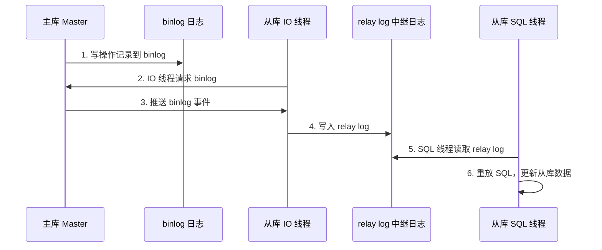

---
title: 读写分离基本原理
date: 2022-04-14 11:36:23
order: 02
categories:
  - 分布式
  - 分布式存储
tags:
  - 分布式
  - 分布式存储
  - 读写分离
permalink: /pages/bb6419cc/
---

# 读写分离基本原理

**读写分离的基本原理是：主服务器用来处理写操作以及实时性要求比较高的读操作，而从服务器用来处理读操作**。

## 简介

在现代互联网应用中，数据库往往是系统最先出现的性能瓶颈。单台数据库服务器既要处理写请求（INSERT/UPDATE/DELETE），又要处理读请求（SELECT），在高并发场景下容易出现锁竞争、连接数耗尽、响应变慢等问题。而实际业务中，绝大多数系统的读写比例都非常悬殊（通常读远多于写，比例可达 10:1 甚至更高）。

`读写分离`（Read/Write Splitting）正是针对这一现象提出的一种数据库架构优化方案：通过将数据库部署为主从集群，主库（Master）负责写操作和强实时性读操作，从库（Slave）负责一般读操作，从而将读写流量在物理层面分离，使得读请求可以由多个从库并行承担。

读写分离本质上是一种「数据复制 + 流量分发」的方案。它解决了单库并发能力不足、锁竞争严重、可用性低的问题，是数据库水平扩展的入门手段，也是后续分库分表、多活架构的基础。

## 为何要读写分离

- **有效减少锁竞争** - 主服务器只负责写，从服务器只负责读，能够有效的避免由数据更新导致的行锁竞争，使得整个系统的查询性能得到极大的改善。
- **提高查询吞吐量** - 通过一主多从的配置方式，可以将查询请求均匀的分散到多个数据副本，能够进一步的提升系统的处理能力。
- **提升数据库可用性** - 使用多主多从的方式，不但能够提升系统的吞吐量，还能够提升数据库的可用性，可以达到在任何一个数据库宕机，甚至磁盘物理损坏的情况下仍然不影响系统的正常运行。

## 读写分离的特性

| 特性           | 说明                                                                 |
| -------------- | -------------------------------------------------------------------- |
| **读写流量分离** | 写请求路由至主库，读请求路由至从库，从物理上避免读写锁竞争            |
| **读可扩展**   | 通过增加从库节点线性扩展读吞吐量（一主一从、一主多从、多主多从）     |
| **数据复制**   | 主库通过 binlog 将数据异步/半同步复制到从库，保证数据最终一致         |
| **高可用**     | 主库故障时可以从从库中选举新的主库，避免单点故障导致整个系统不可用    |
| **对业务透明** | 通过中间件（如 ShardingSphere、Mycat）方案，业务代码无需感知读写分离 |
| **存在延迟**   | 由于主从复制是异步的，从库数据相对主库存在一定延迟，可能读到旧数据    |

## 读写分离的原理

读写分离的实现是根据 SQL 语义分析，将读操作和写操作分别路由至主库与从库。


读写分离的基本实现是：


- 数据库服务器搭建主从集群，一主一从、一主多从都可以。
- 数据库主机负责读写操作，从机只负责读操作。
- 数据库主机通过复制将数据同步到从机，每台数据库服务器都存储了全量数据。
- 业务服务器将写操作发给数据库主机，将读操作发给数据库从机。
- 主机会记录请求的二进制日志，然后推送给从库，从库解析并执行日志中的请求，完成主从复制。这意味着：复制过程存在时延，这段时间内，主从数据可能不一致。

### 主从复制流程

`MySQL` 主从复制的核心流程如下：



1. **Master 写入 binlog**：主库在事务提交时，会将变更写入二进制日志（`binlog`）。
2. **Slave IO 线程拉取**：从库的 IO 线程连接主库，请求从指定位置开始读取 binlog。
3. **写入 relay log**：主库将 binlog 事件发送给从库，从库 IO 线程将其写入中继日志（`relay log`）。
4. **SQL 线程重放**：从库的 SQL 线程读取 relay log，并在从库上重放，使从库数据与主库保持一致。

### 分发机制

数据库读写分离后，一个 SQL 请求具体分发到哪个数据库节点？一般有两种分发方式：

- **客户端分发** - 基于程序代码，自行控制数据分发到哪个数据库节点。程序中建立多个数据库的连接，根据一定的算法，选择合适的连接去发起 SQL 请求。这种方式也被称为客户端中间件，代表有：`jdbc-sharding`。
- **中间件代理分发** - 独立一套系统出来，实现读写操作分离和数据库服务器连接的管理。中间件对业务服务器提供 SQL 兼容的协议，业务服务器无须自己进行读写分离。对于业务服务器来说，访问中间件和访问数据库没有区别。代表有：`Mycat`。

## 读写分离的问题

读写分离存在两个核心问题：**数据一致性**和**分发机制**。

### 主从延迟导致读到脏数据

由于主从复制是异步的，从库的数据会滞后于主库。对于强实时性要求的场景（如：下单后立即查询订单），如果读请求被路由到从库，可能读不到刚刚写入的数据。

### 分发机制选择

客户端分发与中间件代理分发各有优劣，需要根据团队规模、运维能力、性能要求综合选择（详见下方「最佳实践」）。

## 应用场景

读写分离适用于「读多写少」且对数据一致性要求不是极其严格的场景：

- **电商系统** - 商品详情、商品列表等读多写少的场景，主库写入商品信息后由多个从库承担海量读请求。
- **内容管理系统（CMS）** - 文章、新闻等内容发布后，读请求远多于写请求。
- **社交系统** - 用户主页、动态信息流等读请求密集的场景。
- **报表与统计系统** - 报表查询走从库，避免复杂的统计 SQL 影响主库的在线交易。
- **后台管理系统的查询** - 后台批量查询、数据导出走从库，避免冲击主库。

## 最佳实践

### 案例 1：基于 ShardingSphere-JDBC 实现读写分离

`ShardingSphere-JDBC` 是客户端层的轻量级方案，无需额外部署中间件，适合中小型项目。

**Maven 依赖：**

```xml
<dependency>
    <groupId>org.apache.shardingsphere</groupId>
    <artifactId>shardingsphere-jdbc-core-spring-boot-starter</artifactId>
    <version>5.4.1</version>
</dependency>
```

**application.yml 配置：**

```yaml
spring:
  shardingsphere:
    datasource:
      names: master,slave0,slave1
      master:
        type: com.zaxxer.hikari.HikariDataSource
        driver-class-name: com.mysql.cj.jdbc.Driver
        jdbc-url: jdbc:mysql://192.168.1.10:3306/demo
        username: root
        password: root
      slave0:
        type: com.zaxxer.hikari.HikariDataSource
        driver-class-name: com.mysql.cj.jdbc.Driver
        jdbc-url: jdbc:mysql://192.168.1.11:3306/demo
        username: root
        password: root
      slave1:
        type: com.zaxxer.hikari.HikariDataSource
        driver-class-name: com.mysql.cj.jdbc.Driver
        jdbc-url: jdbc:mysql://192.168.1.12:3306/demo
        username: root
        password: root
    rules:
      readwrite-splitting:
        data-sources:
          readwrite_ds:
            write-data-source-name: master
            read-data-source-names: slave0,slave1
            load-balancer-name: round_robin
        load-balancers:
          round_robin:
            type: ROUND_ROBIN
    props:
      sql-show: true
```

**Service 层使用 `@Transactional` 强制走主库（避免主从延迟读到旧数据）：**

```java
import org.springframework.stereotype.Service;
import org.springframework.transaction.annotation.Transactional;
import org.springframework.transaction.annotation.Propagation;

@Service
public class OrderService {

    private final OrderMapper orderMapper;

    public OrderService(OrderMapper orderMapper) {
        this.orderMapper = orderMapper;
    }

    /**
     * 下单后立即查询订单：使用 HintManager 强制走主库
     */
    @Transactional(propagation = Propagation.REQUIRED, readOnly = false)
    public Order createAndQuery(Long userId, String productCode) {
        Order order = new Order();
        order.setUserId(userId);
        order.setProductCode(productCode);
        orderMapper.insert(order);

        // 写操作完成后立即读，通过 HintManager 强制路由到主库，避免主从延迟
        return orderMapper.selectById(order.getId());
    }
}
```

**使用 `HintManager` 强制走主库：**

```java
import org.apache.shardingsphere.infra.hint.HintManager;

public Order readFromMaster(Long orderId) {
    try (HintManager hintManager = HintManager.getInstance()) {
        hintManager.addTableShardingValue("t_order", "master");
        // 标记本次查询走主库
        hintManager.setMasterRouteOnly();
        return orderMapper.selectById(orderId);
    }
}
```

### 案例 2：基于 Spring AOP + 自定义注解实现读写分离

在不引入 ShardingSphere 的场景下，可以通过 `AbstractRoutingDataSource` + AOP 自定义注解实现读写分离。

**动态数据源路由：**

```java
import org.springframework.jdbc.datasource.lookup.AbstractRoutingDataSource;

public class DynamicDataSource extends AbstractRoutingDataSource {

    public static final ThreadLocal<String> CONTEXT_HOLDER = new ThreadLocal<>();

    @Override
    protected Object determineCurrentLookupKey() {
        return CONTEXT_HOLDER.get();
    }

    public static void setDataSource(String key) {
        CONTEXT_HOLDER.set(key);
    }

    public static void clear() {
        CONTEXT_HOLDER.remove();
    }
}
```

**自定义注解 `@Master`：**

```java
import java.lang.annotation.ElementType;
import java.lang.annotation.Retention;
import java.lang.annotation.RetentionPolicy;
import java.lang.annotation.Target;

@Target({ElementType.METHOD, ElementType.TYPE})
@Retention(RetentionPolicy.RUNTIME)
public @interface Master {
}
```

**AOP 切面：**

```java
import org.aspectj.lang.ProceedingJoinPoint;
import org.aspectj.lang.annotation.Around;
import org.aspectj.lang.annotation.Aspect;
import org.springframework.stereotype.Component;

@Aspect
@Component
public class DataSourceAspect {

    @Around("@annotation(master)")
    public Object around(ProceedingJoinPoint point, Master master) throws Throwable {
        try {
            DynamicDataSource.setDataSource("master");
            return point.proceed();
        } finally {
            DynamicDataSource.clear();
        }
    }

    @Around("@annotation(transactional)")
    public Object aroundTransactional(ProceedingJoinPoint point,
                                      org.springframework.transaction.annotation.Transactional transactional) throws Throwable {
        try {
            // 写事务默认走主库
            if (!transactional.readOnly()) {
                DynamicDataSource.setDataSource("master");
            }
            return point.proceed();
        } finally {
            DynamicDataSource.clear();
        }
    }
}
```

**Service 使用示例：**

```java
import org.springframework.stereotype.Service;
import org.springframework.transaction.annotation.Transactional;

@Service
public class UserService {

    private final UserMapper userMapper;

    public UserService(UserMapper userMapper) {
        this.userMapper = userMapper;
    }

    @Transactional
    public void createUser(User user) {
        userMapper.insert(user);
    }

    // 默认走从库
    public User getUser(Long id) {
        return userMapper.selectById(id);
    }

    // 强制走主库，适用于写后立即读的场景
    @Master
    public User getUserFromMaster(Long id) {
        return userMapper.selectById(id);
    }
}
```

### 案例 3：MySQL 半同步复制配置

默认的异步复制在主库故障时可能丢失数据，半同步复制（`semi-sync`）可以提升数据安全性。

**主库配置（my.cnf）：**

```ini
[mysqld]
# 开启半同步复制插件
plugin-load = "rpl_semi_sync_master=semisync_master.so"
rpl_semi_sync_master_enabled = 1
# 等待从库 ACK 的超时时间（毫秒），超时后降级为异步复制
rpl_semi_sync_master_timeout = 3000
# 至少有 N 个从库 ACK 才返回
rpl_semi_sync_master_wait_for_slave_count = 1
```

**从库配置（my.cnf）：**

```ini
[mysqld]
plugin-load = "rpl_semi_sync_slave=semisync_slave.so"
rpl_semi_sync_slave_enabled = 1
```

**主库授权复制账号并查看状态：**

```sql
-- 主库创建复制账号
CREATE USER 'repl'@'192.168.1.%' IDENTIFIED BY 'Repl@123456';
GRANT REPLICATION SLAVE ON *.* TO 'repl'@'192.168.1.%';
FLUSH PRIVILEGES;

-- 查看半同步状态
SHOW VARIABLES LIKE 'rpl_semi_sync_master_status';
SHOW STATUS LIKE 'Rpl_semi_sync_master_yes_tx';
```

**从库配置主从关系：**

```sql
CHANGE REPLICATION SOURCE TO
    SOURCE_HOST = '192.168.1.10',
    SOURCE_PORT = 3306,
    SOURCE_USER = 'repl',
    SOURCE_PASSWORD = 'Repl@123456',
    SOURCE_AUTO_POSITION = 1;

START REPLICA;

-- 查看复制状态
SHOW REPLICA STATUS\G
```

## 常见问题

### 问题 1：主从延迟过大导致业务异常

**问题描述**：用户下单后立即跳转到订单列表页，却看不到刚刚创建的订单；或者修改密码后立即登录提示密码错误。

**原因分析**：

- 主从复制是异步的，从库的 SQL 线程重放 binlog 需要时间。
- 大事务（如批量 UPDATE 几十万行）会导致 binlog 体积大，从库重放耗时长。
- 从库负载过高（如执行复杂报表 SQL）导致 SQL 线程被阻塞。
- 网络抖动导致 binlog 传输延迟。

**解决方案**：

1. **强制走主库** - 对强实时性场景，写后立即读的请求强制路由到主库（使用 `HintManager` 或 `@Master` 注解）。
2. **优化大事务** - 将大批量操作拆分为小批次，避免单个事务过大。
3. **从库并行复制** - MySQL 5.7+ 支持基于组提交的并行复制（`slave_parallel_workers`），可显著降低延迟。

```ini
# 从库开启并行复制
slave_parallel_type = LOGICAL_CLOCK
slave_parallel_workers = 8
binlog_transaction_dependency_tracking = WRITESET
```

4. **半同步复制** - 对数据安全性要求高的场景，使用半同步复制减少数据丢失风险。

### 问题 2：从库连接数耗尽

**问题描述**：高峰期从库报错 `Too many connections`，导致读请求失败。

**原因分析**：

- 应用连接池配置过大，多个应用实例共用一个从库时连接数叠加。
- 长事务或慢查询占用连接不释放。
- 从库数量不足，无法承载读流量。

**解决方案**：

1. **合理配置连接池** - 根据从库的 `max_connections` 合理规划应用连接池大小。

```yaml
spring:
  datasource:
    hikari:
      maximum-pool-size: 20
      minimum-idle: 5
      connection-timeout: 30000
      idle-timeout: 600000
      max-lifetime: 1800000
```

2. **横向扩展从库** - 增加从库节点，配合负载均衡策略（如轮询、随机）分摊读流量。
3. **慢查询治理** - 开启慢查询日志，定期优化慢 SQL。

```sql
-- 查看慢查询是否开启
SHOW VARIABLES LIKE 'slow_query_log%';
-- 设置慢查询阈值为 1 秒
SET GLOBAL long_query_time = 1;
SET GLOBAL slow_query_log = 'ON';
```

### 问题 3：主库故障切换后数据不一致

**问题描述**：主库宕机后将从库提升为新主库，但部分已提交的事务在新主库上不存在，导致数据丢失。

**原因分析**：

- 异步复制场景下，主库提交事务后未等 binlog 同步到从库就宕机，从库提升为主库后丢失这部分数据。
- 脑裂问题：主库假死，多个从库同时被提升为主库，导致数据冲突。

**解决方案**：

1. **使用 MHA / Orchestrator 等高可用管理工具** - 自动化故障切换，避免人工误操作。

```bash
# MHA 在线切换命令示例
masterha_master_switch --conf=/etc/mha/app1.cnf --master_state=alive --new_master_host=192.168.1.11 --orig_master_is_new_slave
```

2. **开启半同步复制 +无损半同步** - MySQL 5.7+ 的无损半同步（`AFTER_SYNC`）保证主库提交的事务一定已同步到至少一个从库。

```ini
# 主库：事务提交后再同步到从库，避免丢失已提交事务
rpl_semi_sync_master_wait_point = AFTER_SYNC
```

3. **配置 binlog 丢失保护** - 主库使用 `sync_binlog = 1` 保证每次提交都刷盘，避免宕机丢 binlog。

```ini
[mysqld]
sync_binlog = 1
innodb_flush_log_at_trx_commit = 1
```

## 参考资料

- [后端存储实战课](https://time.geekbang.org/column/intro/100046801)
- [ShardingSphere 官方文档](https://shardingsphere.apache.org/document/current/cn/overview/)
- [MySQL 官方文档 - Replication](https://dev.mysql.com/doc/refman/8.0/en/replication.html)
- [MySQL 半同步复制](https://dev.mysql.com/doc/refman/8.0/en/replication-semisync.html)
- [MHA - MySQL 高可用管理工具](https://github.com/yoshinorim/mha4mysql-manager)
