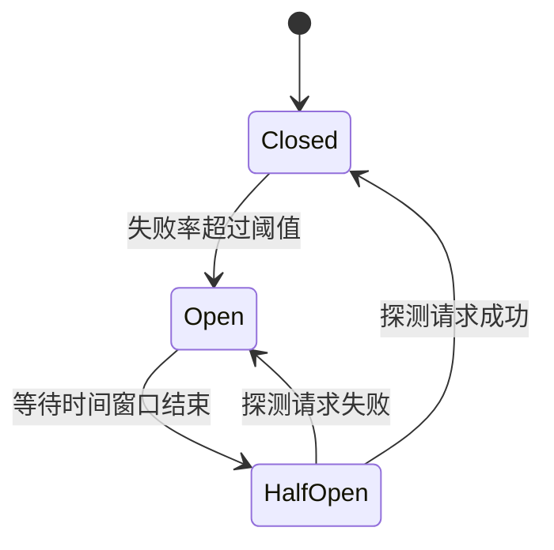

---
title: 服务容错
date: 2022-04-20 17:27:42
categories:
  - 分布式
  - 分布式治理
tags:
  - 分布式
  - 治理
  - 服务治理
  - 监控
  - APM
  - 链路追踪
permalink: /pages/846b4586/
---

# 服务容错

## 简介

在分布式系统中，服务之间通过网络进行远程调用，而网络本身的不可靠性、服务节点的故障、依赖资源的瓶颈等因素，都可能导致服务调用失败。如果缺少容错机制，一次局部的故障可能会沿着调用链向上传播，引发请求堆积、资源耗尽，最终演变为整个系统的雪崩。

服务容错的目标是在故障发生时，通过**限流**、**降级**、**熔断**、**隔离**、**重试**等手段，控制故障的影响范围，保障系统在部分组件异常的情况下仍能对外提供核心服务，提升系统的弹性和可用性。

服务容错是服务治理的核心能力之一，与监控、链路追踪共同构成分布式系统的高可用保障体系。一个完善的服务容错方案需要在“快速失败”与“尽力恢复”之间取得平衡，既避免故障扩散，又尽可能保证业务正确性。

## 特性

服务容错机制具备以下核心特性：

| 特性 | 说明 |
| --- | --- |
| **故障隔离** | 通过线程池或信号量隔离，避免单一依赖故障耗尽整个应用的资源 |
| **快速失败** | 故障发生时立即返回，避免长时间等待造成请求堆积 |
| **自动恢复** | 故障恢复后，熔断器自动进入半开状态试探，逐步恢复调用 |
| **降级保底** | 在不可用时返回兜底数据或默认逻辑，保证业务流程不中断 |
| **流量控制** | 通过限流保护后端服务，防止突发流量压垮系统 |
| **可配置性** | 支持按服务、方法、参数维度配置不同的容错策略 |
| **可观测性** | 与监控告警集成，实时感知熔断、限流等状态变化 |

## 原理

### 雪崩效应与容错的必要性

在微服务调用链中，如果服务 D 出现故障，会导致服务 C 的请求线程被阻塞，进而服务 C 的线程池被耗尽，最终服务 B、服务 A 也相继不可用。这就是典型的**雪崩效应**：


容错机制的核心思想是**在故障扩散的路径上设置“防火墙”**，通过熔断、隔离、限流等手段阻断故障的传播。

### 断路器状态机原理

断路器是服务容错的核心组件，其状态机包含三个状态：



- **Closed（关闭）**：正常状态，所有请求放行。同时统计最近时间窗口内的调用成功率/失败率。
- **Open（打开）**：当失败率达到阈值时进入此状态，所有请求直接快速失败，不再发起远程调用，给下游服务恢复的时间。
- **HalfOpen（半开）**：等待一段时间后，放行少量探测请求。如果探测成功，说明下游已恢复，回到 Closed；如果失败，则重新进入 Open。

### 限流算法原理

常见的限流算法包括：

- **计数器算法**：在固定时间窗口内累加请求数，超过阈值则拒绝。缺点是存在临界点突发流量问题。
- **滑动窗口算法**：将时间窗口划分为更细的格子，滑动统计，平滑了临界问题。
- **漏桶算法**：请求如水滴进入漏桶，桶以恒定速率漏水。超过桶容量的请求被丢弃，实现匀速消费。
- **令牌桶算法**：以恒定速率向桶中放入令牌，请求需要拿到令牌才能通过。允许一定程度的突发流量。

### 线程隔离与信号量隔离

- **线程池隔离**：为每个依赖服务分配独立线程池，调用在独立线程中执行。优点是隔离性强、支持异步超时；缺点是线程切换开销大。
- **信号量隔离**：通过信号量限制并发数，调用在当前线程中同步执行。优点是轻量、无线程切换开销；缺点是不支持异步超时。

## 故障分类

从故障影响范围维度来看，分布式系统的故障可以分为三类：

- **集群故障**：根据业务量大小而定，集群规模从几台到甚至上万台都有可能。一旦某些代码出现 bug，可能整个集群都会发生故障，不能提供对外提供服务。
- **机房故障**：现在大多数互联网公司为了保证业务的高可用性，往往业务部署在不止一个机房。然而现实中，某机房的光缆因为道路施工被挖断，导致整个机房脱网的事情，也是时有发生的。并且这种事情往往容易上热搜。
- **单机故障**：集群中的个别机器出现故障，这种情况往往对全局没有太大影响，但会导致调用到故障机器上的请求都失败，影响整个系统的成功率。

### 集群故障应对处理

一般而言，集群故障的产生原因不外乎有两种：

- 一种是代码 bug 所导致，比如说某一段 Java 代码不断地分配大对象，但没有及时回收导致 JVM OOM 退出；
- 另一种是流量突刺，短时间突然而至的大量请求超出了系统的承载能力。

应付集群故障的思路，主要是采用**流量控制**，主要手段有：**限流**、**降级**、**熔断**。

### 机房故障应对处理

单机房脱网的事情，多半是因为一些不可抗因素，如：机房失火、光缆被挖断等等。有句老话叫：不要把鸡蛋都放在一个篮子里。同理，不要把业务都部署在一个机房中，一旦机房出事，那就彻底完蛋了。所以，很多互联网公司的业务都采用多机房部署。如果要追求更高的可靠性，可以采用同城多活部署，甚至异地多活部署。

多机房部署的好处显而易见，即提高了系统的可用性，但是这种架构引入了其他的问题：如何保证不同机房数据的一致性，如何切换多机房的流量，等等。

针对流量切换问题，一般有两种手段：

- **基于 DNS 解析的流量切换**，一般是通过把请求访问域名解析的 VIP 从一个 IDC 切换到另外一个 IDC。
- **基于 RPC 分组的流量切换**，对于一个服务来说，如果是部署在多个 IDC 的话，一般每个 IDC 就是一个分组。假如一个 IDC 出现故障，那么原先路由到这个分组的流量，就可以通过向配置中心下发命令，把原先路由到这个分组的流量全部切换到别的分组，这样的话就可以切换故障 IDC 的流量了。

### 单机故障应对处理

对于大规模集群来说，出现单机故障的概率是很高的。当出现单机故障时，需要有一定的自动化处理手段。

处理单机故障一个有效的办法就是自动重启。具体来讲，你可以设置一个阈值，比如以某个接口的平均耗时为准，当监控单机上某个接口的平均耗时超过一定阈值时，就认为这台机器有问题，这个时候就需要把有问题的机器从线上集群中摘除掉，然后在重启服务后，重新加入到集群中。

## 容错策略

服务调用并不总是一定成功的，前面我讲过，可能因为服务提供者节点自身宕机、进程异常退出或者服务消费者与提供者之间的网络出现故障等原因。对于服务调用失败的情况，需要有手段自动恢复，来保证调用成功。

常用的手段主要有以下几种：

- **故障转移（FailOver）**：当出现失败，重试其它服务器。通常用于读操作，但重试会带来更长延迟。这种策略要求服务调用的操作必须是幂等的，也就是说无论调用多少次，只要是同一个调用，返回的结果都是相同的，一般适合服务调用是读请求的场景。
- **快速失败（FailFast）**：只发起一次调用，失败立即报错。通常用于非幂等性的写操作，比如新增记录。实际在业务执行时，一般非核心业务的调用，会采用快速失败策略，调用失败后一般就记录下失败日志就返回了。
- **安全失败（Failsafe）**：出现异常时，直接忽略。通常用于写入审计日志等操作。
- **静默失败（Failsilent）**：如果大量的请求需要等到超时（或者长时间处理后）才宣告失败，很容易由于某个远程服务的请求堆积而消耗大量的线程、内存、网络等资源，进而影响到整个系统的稳定。面对这种情况，一种合理的失败策略是当请求失败后，就默认服务提供者一定时间内无法再对外提供服务，不再向它分配请求流量，将错误隔离开来，避免对系统其他部分产生影响，此即为沉默失败策略。
- **故障恢复（FailBack）**：就是服务消费者调用失败或者超时后，不再重试，而是根据失败的详细信息，来决定后续的执行策略。比如对于非幂等的调用场景，如果调用失败后，不能简单地重试，而是应该查询服务端的状态，看调用到底是否实际生效，如果已经生效了就不能再重试了；如果没有生效可以再发起一次调用。通常用于消息通知操作。
- **并行调用（Forking）**：并行调用多个服务器，只要一个成功即返回。通常用于实时性要求较高的读操作，但需要浪费更多服务资源。
- **广播调用（Broadcast）**：广播调用所有提供者，逐个调用，任意一台报错则报错。通常用于通知所有提供者更新缓存或日志等本地资源信息。

## 容错设计模式

### 断路器模式

断路器的基本思路是很简单的，就是通过代理（断路器对象）来一对一地（一个远程服务对应一个断路器对象）接管服务调用者的远程请求。断路器会持续监控并统计服务返回的成功、失败、超时、拒绝等各种结果，当出现故障（失败、超时、拒绝）的次数达到断路器的阈值时，它状态就自动变为“OPEN”，后续此断路器代理的远程访问都将直接返回调用失败，而不会发出真正的远程服务请求。通过断路器对远程服务的熔断，避免因持续的失败或拒绝而消耗资源，因持续的超时而堆积请求，最终的目的就是避免雪崩效应的出现。由此可见，断路器本质是一种快速失败策略的实现方式。

### 舱壁隔离模式

舱壁隔离模式是常用的实现服务隔离的设计模式，舱壁这个词是来自造船业的舶来品，它原本的意思是设计舰船时，要在每个区域设计独立的水密舱室，一旦某个舱室进水，也只是影响这个舱室中的货物，而不至于让整艘舰艇沉没。这种思想就很符合容错策略中失败静默策略。

Hystrix 就采用舱壁隔离模式来实现线程隔离。

### 重试模式

故障转移和故障恢复策略都需要对服务进行重复调用，差别是这些重复调用有可能是同步的，也可能是后台异步进行；有可能会重复调用同一个服务，也可能会调用到服务的其他副本。无论具体是通过怎样的方式调用、调用的服务实例是否相同，都可以归结为重试设计模式的应用范畴。重试模式适合解决系统中的瞬时故障，简单的说就是有可能自己恢复（Resilient，称为自愈，也叫做回弹性）的临时性失灵，网络抖动、服务的临时过载（典型的如返回了 503 Bad Gateway 错误）这些都属于瞬时故障。

## 应用场景

- **电商大促场景**：双 11、618 等大促活动期间，核心交易链路（下单、支付）流量激增，需要通过限流保护后端，通过降级关闭非核心功能（如推荐、评论），保证交易主流程可用。
- **第三方依赖不可控场景**：业务依赖外部支付、短信、地图等第三方服务，当第三方服务抖动或故障时，通过熔断避免拖垮自身应用，通过降级返回兜底结果。
- **多机房容灾场景**：单机房故障时，通过流量切换将请求路由到健康机房，结合自动重试保证调用成功率。
- **依赖服务慢调用场景**：某个下游服务出现慢调用，通过超时控制 + 线程隔离，避免慢调用耗尽调用方的线程资源。
- **灰度发布与回滚场景**：新版本服务出现异常时，通过熔断快速切断对新版本的调用，回退到老版本，降低发布风险。

## 最佳实践

### 案例 1：使用 Resilience4j 实现熔断与降级

Resilience4j 是 Hystrix 的现代替代方案，基于函数式编程，轻量且无依赖。下面演示如何在 Spring Boot 中使用 Resilience4j 实现熔断和降级。

**Maven 依赖：**

```xml
<dependency>
    <groupId>io.github.resilience4j</groupId>
    <artifactId>resilience4j-spring-boot2</artifactId>
    <version>2.1.0</version>
</dependency>
<dependency>
    <groupId>org.springframework.boot</groupId>
    <artifactId>spring-boot-starter-aop</artifactId>
</dependency>
```

**application.yml 配置：**

```yaml
resilience4j:
  circuitbreaker:
    instances:
      paymentService:
        register-health-indicator: true
        sliding-window-type: COUNT_BASED
        sliding-window-size: 100              # 滑动窗口大小
        minimum-number-of-calls: 20           # 最小调用数才计算失败率
        failure-rate-threshold: 50            # 失败率阈值 50%
        wait-duration-in-open-state: 30s      # 熔断开启后等待时间
        permitted-number-of-calls-in-half-open-state: 5
        automatic-transition-from-open-to-half-open-enabled: true
  ratelimiter:
    instances:
      paymentService:
        limit-for-period: 100                 # 每个周期允许 100 次请求
        limit-refresh-period: 1s
        timeout-duration: 0
```

**业务代码使用注解：**

```java
import io.github.resilience4j.circuitbreaker.annotation.CircuitBreaker;
import io.github.resilience4j.ratelimiter.annotation.RateLimiter;
import org.springframework.stereotype.Service;

@Service
public class PaymentClient {

    /**
     * 调用支付服务，失败时执行 fallback 方法
     */
    @CircuitBreaker(name = "paymentService", fallbackMethod = "paymentFallback")
    @RateLimiter(name = "paymentService", fallbackMethod = "paymentFallback")
    public PaymentResult callPayment(PaymentRequest request) {
        // 实际调用远程支付服务
        return doRemoteCall(request);
    }

    /**
     * 降级方法：签名必须与原方法一致（追加异常参数）
     */
    private PaymentResult paymentFallback(PaymentRequest request, Throwable t) {
        // 返回兜底结果，记录日志
        return PaymentResult.fail("支付服务暂时不可用，请稍后重试");
    }
}
```

### 案例 2：使用 Sentinel 实现限流与热点参数控制

Sentinel 是阿里巴巴开源的流量治理组件，支持流控、熔断降级、系统负载保护、热点参数限流等。

**Maven 依赖：**

```xml
<dependency>
    <groupId>com.alibaba.csp</groupId>
    <artifactId>sentinel-annotation-aspectj</artifactId>
    <version>1.8.6</version>
</dependency>
<dependency>
    <groupId>com.alibaba.csp</groupId>
    <artifactId>sentinel-transport-simple-http</artifactId>
    <version>1.8.6</version>
</dependency>
```

**配置 Sentinel Dashboard 地址：**

```bash
# JVM 启动参数
-Dcsp.sentinel.dashboard.server=127.0.0.1:8080
-Dproject.name=order-service
```

**业务代码使用注解：**

```java
import com.alibaba.csp.sentinel.annotation.SentinelResource;
import com.alibaba.csp.sentinel.slots.block.BlockException;
import org.springframework.stereotype.Service;

@Service
public class OrderService {

    /**
     * 资源名 orderCreate，QPS 超过阈值时执行 blockHandler
     */
    @SentinelResource(value = "orderCreate",
            blockHandler = "orderCreateBlockHandler",
            fallback = "orderCreateFallback")
    public OrderResult createOrder(OrderRequest request) {
        return doCreateOrder(request);
    }

    /**
     * 限流降级：被 Sentinel 流控规则拦截时调用
     */
    public OrderResult orderCreateBlockHandler(OrderRequest request, BlockException ex) {
        return OrderResult.fail("系统繁忙，请稍后重试");
    }

    /**
     * 异常降级：业务抛出异常时调用
     */
    public OrderResult orderCreateFallback(OrderRequest request, Throwable t) {
        return OrderResult.fail("下单失败：" + t.getMessage());
    }
}
```

**热点参数限流**：在 Sentinel Dashboard 中对资源 `orderCreate` 配置热点参数规则，限制同一 `userId` 的 QPS：

```java
import com.alibaba.csp.sentinel.annotation.SentinelResource;
import com.alibaba.csp.sentinel.slots.block.BlockException;

@SentinelResource(value = "queryOrder",
        blockHandler = "queryOrderBlockHandler")
public OrderResult queryOrder(String userId, String orderId) {
    return doQueryOrder(userId, orderId);
}

// 在 Dashboard 配置：参数索引 0（userId），单值 QPS 阈值 10
// 例外项：VIP 用户 userId=vip123 允许 QPS 100
```

### 案例 3：使用 Spring Retry 实现自动重试

对于网络抖动等瞬时故障，重试是最直接有效的容错手段。Spring Retry 提供了声明式的重试能力。

**Maven 依赖：**

```xml
<dependency>
    <groupId>org.springframework.retry</groupId>
    <artifactId>spring-retry</artifactId>
</dependency>
<dependency>
    <groupId>org.springframework</groupId>
    <artifactId>spring-aspects</artifactId>
</dependency>
```

**启用重试并使用注解：**

```java
import org.springframework.retry.annotation.Backoff;
import org.springframework.retry.annotation.Recover;
import org.springframework.retry.annotation.Retryable;
import org.springframework.stereotype.Service;

@Service
public class InventoryClient {

    /**
     * 遇到指定异常时重试
     * - maxAttempts: 最大尝试次数（含首次）
     * - backoff: 退避策略，初始 1s，倍数 2，最大 10s
     */
    @Retryable(
        retryFor = {java.net.SocketTimeoutException.class, org.springframework.web.client.ResourceAccessException.class},
        maxAttempts = 3,
        backoff = @Backoff(delay = 1000, multiplier = 2.0, maxDelay = 10000)
    )
    public Inventory queryInventory(String skuId) {
        // 远程调用库存服务
        return doRemoteQuery(skuId);
    }

    /**
     * 重试耗尽后的兜底方法
     * 签名要求：与原方法相同参数 + Throwable 参数
     */
    @Recover
    public Inventory queryInventoryFallback(Throwable t, String skuId) {
        // 返回默认库存，避免影响下单流程
        return Inventory.defaultZero(skuId);
    }
}
```

**启用类配置：**

```java
import org.springframework.retry.annotation.EnableRetry;
import org.springframework.context.annotation.Configuration;

@Configuration
@EnableRetry
public class RetryConfig {
}
```

## 常见问题

### 问题 1：重试导致请求量放大，引发后端服务雪崩

**问题描述**：为提高接口成功率配置了重试机制（如重试 3 次），结果在后端服务出现短暂故障时，重试请求在短时间内激增到原来的 3 倍，反而把后端服务彻底压垮，加速了雪崩。

**原因分析**：
- 重试次数设置过高，且未配合退避（Backoff）策略，导致瞬时重试请求堆积。
- 对非幂等接口（如扣款、下单）也开启了重试，导致重复扣款等业务问题。
- 未配合熔断机制，在下游持续故障时仍不断重试。
- 重试对所有异常类型生效，包括不可恢复的异常（如 4xx 错误）。

**解决方案**：

1. **仅对幂等接口和瞬时故障重试**，并配合指数退避：

```java
@Retryable(
    retryFor = {java.net.SocketTimeoutException.class},  // 仅对超时重试
    noRetryFor = {IllegalArgumentException.class},        // 业务异常不重试
    maxAttempts = 3,
    backoff = @Backoff(delay = 1000, multiplier = 2.0, maxDelay = 10000)  // 指数退避
)
public OrderResult createOrder(OrderRequest request) {
    // 注意：createOrder 必须保证幂等性（如通过 requestId 去重）
    return doCreateOrder(request);
}
```

2. **配合熔断器使用**，在下游持续故障时停止重试：

```java
@CircuitBreaker(name = "orderService", fallbackMethod = "fallback")
@Retryable(maxAttempts = 3, backoff = @Backoff(delay = 1000))
public OrderResult callOrder(OrderRequest request) {
    return doRemoteCall(request);
}
```

3. **对非幂等接口采用“重试前查询”策略**：

```java
public PaymentResult pay(PaymentRequest request) {
    try {
        return doPay(request);
    } catch (SocketTimeoutException e) {
        // 超时后先查询支付状态，避免重复扣款
        PaymentStatus status = queryPaymentStatus(request.getRequestId());
        if (status.isSuccess()) {
            return PaymentResult.alreadyPaid(status.getPaymentId());
        }
        // 确认未成功后再重试
        return doPay(request);
    }
}
```

### 问题 2：Hystrix 线程池隔离导致性能下降

**问题描述**：接入 Hystrix 后，发现应用 CPU 占用升高、接口响应时间变长，线程切换开销明显，且部分接口出现 `HystrixTimeoutException`。

**原因分析**：
- Hystrix 默认对每个命令使用独立线程池，线程创建和切换有开销。
- 线程池大小配置过小，导致请求排队等待，触发超时。
- 对本身很快的本地调用或缓存读取也使用了线程隔离，得不偿失。
- 上下文传递（如 `ThreadLocal` 中的用户信息）在跨线程时丢失。

**解决方案**：

1. **对快速、非网络的调用使用信号量隔离**，避免线程切换：

```java
import com.netflix.hystrix.HystrixCommand;
import com.netflix.hystrix.HystrixCommandGroupKey;
import com.netflix.hystrix.HystrixCommandProperties;

public class CacheGetCommand extends HystrixCommand<String> {

    private final CacheClient cache;

    public CacheGetCommand(CacheClient cache) {
        super(Setter.withGroupKey(HystrixCommandGroupKey.Factory.asKey("CacheGroup"))
                .andCommandPropertiesDefaults(
                        HystrixCommandProperties.Setter()
                                .withExecutionIsolationStrategy(
                                        HystrixCommandProperties.ExecutionIsolationStrategy.SEMAPHORE)
                                .withExecutionIsolationSemaphoreMaxConcurrentRequests(100)));
        this.cache = cache;
    }

    @Override
    protected String run() {
        return cache.get("key");
    }

    @Override
    protected String getFallback() {
        return null;
    }
}
```

2. **合理设置线程池大小**，按 `QPS × 平均耗时` 估算：

```java
HystrixThreadPoolProperties.Setter()
    .withCoreSize(20)             // 核心线程数
    .withMaxQueueSize(-1)         // 使用 SynchronousQueue
    .withQueueSizeRejectionThreshold(5);
```

3. **迁移到 Resilience4j**，Hystrix 已停止维护，Resilience4j 基于函数式接口，无线程切换开销：

```java
// Resilience4j 默认基于函数式调用，不创建额外线程
@CircuitBreaker(name = "orderService", fallbackMethod = "fallback")
public OrderResult callOrder(OrderRequest request) {
    return doRemoteCall(request);
}
```

4. **解决 ThreadLocal 上下文丢失问题**，使用可传递的 ThreadLocal 或装饰器：

```java
import com.netflix.hystrix.strategy.concurrency.HystrixRequestContext;
import com.netflix.hystrix.strategy.concurrency.HystrixConcurrencyStrategy;

public class RequestContextHystrixConcurrencyStrategy extends HystrixConcurrencyStrategy {
    @Override
    public <T> Callable<T> wrapCallable(Callable<T> callable) {
        // 在主线程捕获上下文，在子线程恢复
        return new RequestContextHolderCallable<>(callable, UserContext.getContext());
    }
}
```

### 问题 3：熔断器一直处于 Open 状态无法恢复

**问题描述**：下游服务故障后，熔断器打开，但下游服务恢复后，熔断器长时间无法回到 Closed 状态，导致服务持续不可用。

**原因分析**：
- `wait-duration-in-open-state` 设置过长，半开探测间隔过久。
- 半开状态下放行的探测请求数量太少（如只放行 1 个），单次失败就重新打开，导致恢复困难。
- 半开探测请求仍然失败，说明下游服务并未真正恢复，或探测请求本身有问题。
- 缺少对熔断状态的监控告警，运维人员无法及时介入。

**解决方案**：

1. **合理配置半开状态参数**，给予足够的探测机会：

```yaml
resilience4j:
  circuitbreaker:
    instances:
      paymentService:
        wait-duration-in-open-state: 15s           # Open 状态等待时间
        permitted-number-of-calls-in-half-open-state: 10  # 半开状态放行请求数
        failure-rate-threshold: 50
        slow-call-rate-threshold: 60
        slow-call-duration-threshold: 3s
```

2. **监控熔断器状态变化**，及时告警：

```java
import io.github.resilience4j.circuitbreaker.CircuitBreaker;
import io.github.resilience4j.circuitbreaker.event.CircuitBreakerOnStateTransitionEvent;
import org.springframework.context.event.EventListener;
import org.springframework.stereotype.Component;

@Component
public class CircuitBreakerMonitor {

    @EventListener
    public void onStateTransition(CircuitBreakerOnStateTransitionEvent event) {
        CircuitBreaker.State from = event.getStateTransition().getFromState();
        CircuitBreaker.State to = event.getStateTransition().getToState();
        String name = event.getCircuitBreakerName();
        // 发送告警
        AlertManager.send(String.format("熔断器[%s]状态从 %s 变为 %s", name, from, to));
    }
}
```

3. **半开探测请求使用独立的健康检查端点**，避免业务请求本身的复杂性导致探测失败：

```java
@CircuitBreaker(name = "paymentService", fallbackMethod = "fallback")
public PaymentResult callPayment(PaymentRequest request) {
    return doRemoteCall(request);
}

// 单独的健康探测方法，不依赖复杂业务参数
public boolean healthCheck() {
    try {
        return restTemplate.getForObject("http://payment/actuator/health", Health.class)
                .getStatus() == Health.Status.UP;
    } catch (Exception e) {
        return false;
    }
}
```

## 参考资料

- [从 0 开始学微服务](https://time.geekbang.org/column/intro/100014401)
- [凤凰架构之服务容错](http://icyfenix.cn/distribution/traffic-management/failure.html)
