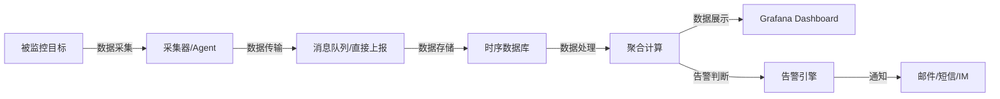

---
title: 服务监控
date: 2022-04-19 20:02:48
order: 01
categories:
  - 分布式
  - 分布式治理
tags:
  - DevOps
  - 监控
permalink: /pages/ccc58405/
---

# 服务监控

## 简介

当服务消费者与服务提供者之间建立了通信，作为管理者需要通过监控手段来观察服务是否正常，调用是否成功。服务监控是很复杂的，在微服务架构下，一次用户调用会因为服务化拆分后，变成多个不同服务之间的相互调用，这也就需要对拆分后的每个服务都监控起来。

服务监控是分布式系统可观测性的核心组成部分。它通过持续采集、存储、分析和展示系统运行时的各项指标数据，帮助运维和开发人员了解系统的实时状态，及时发现并定位问题，从而保证业务持续稳定运行。一个完善的监控体系通常涵盖基础设施、中间件、应用、业务等多个层级，形成从底向上的全栈监控能力。

在现代云原生架构下，服务规模动辄成百上千，单纯依赖人工巡检已经不可行，必须借助自动化的监控平台来完成故障发现、告警通知、根因分析等工作。监控与链路追踪、日志系统共同构成了系统的可观测性体系，三者相辅相成，是保障分布式系统高可用的基石。

## 特性

一个优秀的服务监控系统应具备以下核心特性：

| 特性 | 说明 |
| --- | --- |
| **实时性** | 能够秒级采集和展示监控数据，保证故障被快速感知 |
| **全面性** | 覆盖基础层、中间层、应用层、业务层、客户端等多个维度 |
| **可扩展性** | 支持横向扩展，能够应对大规模集群的海量指标数据 |
| **高可用性** | 监控系统自身的可用性要高于被监控系统，避免监控单点故障 |
| **灵活告警** | 支持多级别、多渠道的告警策略，能够精准降噪，避免告警风暴 |
| **可视化** | 提供丰富的 Dashboard 和图表，直观展示系统运行状态 |
| **开放性** | 提供标准 API 和数据协议（如 OpenMetrics），便于对接其他系统 |

## 原理

### 监控系统总体架构

一个典型的监控系统由数据采集、数据传输、数据存储、数据处理、数据展示、告警通知几个核心模块组成，其工作流程如下：



### Pull 与 Pull 模型

监控数据的采集方式主要有两种：

- **Pull 模型（拉取式）**：监控服务器主动去目标实例拉取指标数据。以 Prometheus 为代表。优点是服务器可以控制采集频率、目标范围，便于服务发现和负载均衡；缺点是对内网连通性有要求，不适合短生命周期任务。
- **Push 模型（推送式）**：被监控目标主动将指标推送到监控服务器。以 InfluxDB Telegraf、StatsD 为代表。优点是适用于短生命周期任务、跨网络环境；缺点是需在客户端配置推送地址，可能造成推送风暴。

### 时序数据存储原理

监控数据本质上是时间序列数据（Time Series Data），每一条数据由 `metric name + labels + timestamp + value` 组成。时序数据库（TSDB）针对这类数据做了专门优化：

- **写入优化**：采用 LSM-Tree 类似的结构，批量写入、顺序落盘，支撑高并发写入。
- **查询优化**：按时间分片建立索引，支持按时间范围和标签快速过滤。
- **降采样**：对历史数据进行聚合降采样（如 1 分钟 → 10 分钟 → 1 小时），降低长期存储成本。
- **保留策略**：支持按时间自动过期清理数据。

### 告警引擎原理

告警引擎的核心是基于规则的数据匹配与状态机管理：

1. **规则定义**：用户通过 PromQL 或类似表达式定义告警条件（如 `cpu_usage > 0.8 for 5m`）。
2. **周期评估**：告警引擎周期性（如每 15 秒）对规则进行求值。
3. **状态机管理**：告警具有 `inactive`、`pending`、`firing` 三种状态，避免瞬时抖动造成误报。
4. **告警路由**：根据告警标签路由到不同的接收器（Receiver），支持分组、抑制、静默等高级策略。

## 监控的意义

- **发现问题**：当系统出现问题或故障，监控系统应根据监控对象的数据异常，及时发现问题，触发告警。
- **定位问题**：监控系统的告警提示，通常应该指明问题的影响范围（如某机器 IP、某机房），触发故障的内容（数据库、MQ 或某服务的某监控数据异常），触发时间等等。有了这些必要的信息，有利于工程师分析问题时缩小排查范围，更快找到问题原因。
- **解决问题**：一旦分析清楚故障的原因后，就需要根据故障的重要度、紧急程度、影响范围等要素，去决定应该如何应对故障。
- **总结问题**：如果发生了重大故障后，需要对故障进行复盘，总结故障的原因和应对故障时的措施，思考在事前有没有更好的防范手段；在事后的应对故障的处理有没有改进的空间。

## 监控目标

- **对系统不间断实时监控**：实际上是对系统不间断的实时监控(这就是监控)
- **实时反馈系统当前状态**：我们监控某个硬件、或者某个系统，都是需要能实时看到当前系统的状态，是正常、异常、或者故障
- **保证服务的可靠性、安全性**：我们监控的目的就是要保证系统、服务、业务正常运行
- **保证业务持续稳定运行**：如果我们的监控做得很完善，即使出现故障，能第一时间接收到故障告警，在第一时间处理解决，从而保证业务持续性的稳定运行。

## 监控方法

- **明确监控对象**：根据业务和系统的实际需要，明确需要监控的对象。
- **确定性能基准指标**：确定了监控对象，接下来，要确定该监控对象的性能基准。如：CPU 使用率、吞吐量等。
- **定义告警阈值**：监控对象什么情况是正常的，什么情况是异常的，什么情况是有故障的？
- **故障处理流程**：当监控对象达到告警阈值时，应如何应对？触发怎样的告警？有没有自动化处理机制，如弹性扩容等？有没有熔断、降级等？

## 监控流程

一旦明确了要监控的对象，接下就是考虑如何监控。

完整的监控流程主要包括以下环节：采集、传输、存储、分析、展示、告警、处理。


### 数据采集

通常有两种数据收集方式：

- **服务主动上报**：这种处理方式通过在业务代码或者服务框架里加入数据收集代码逻辑，在每一次服务调用完成后，主动上报服务的调用信息。这种方式在链路跟踪中较为常见，主流的技术方案有：Zipkin。
- **代理收集**：这种处理方式通过服务调用后把调用的详细信息记录到本地日志文件中，然后再通过代理去解析本地日志文件，然后再上报服务的调用信息。主流的技术方案有：ELK、Flume。

### 数据传输

数据传输最常用的方式有两种：

- **UDP 传输**：这种处理方式是数据处理单元提供服务器的请求地址，数据采集后通过 UDP 协议与服务器建立连接，然后把数据发送过去。
- **Kafka 传输**：这种处理方式是数据采集后发送到指定的 Topic，然后数据处理单元再订阅对应的 Topic，就可以从 Kafka 消息队列中读取到对应的数据。由于 Kafka 有非常高的吞吐能力，所以很适合作为大数据量的缓冲池。

### 数据存储

上报的监控数据需要存储，不同监控系统选择的存储非常多样化。比较常见的有：

- 时序数据库：InfluxDB（如：Prometheus）
- 列式数据库：OpenTSDB 用 Hbase 存储所有时序（无须采样）的数据，来构建一个分布式、可伸缩的时间序列数据库。它支持秒级数据采集，支持永久存储，可以做容量规划，并很容易地接入到现有的告警系统里。
- SQL 数据库：Zabbix 使用关系型数据库 Mysql 存储数据。
- 搜索引擎数据库：ELK 使用 Elasticsearch 存储数据，以倒排索引的数据结构存储，需要查询的时候，根据索引来查询。

### 数据处理

数据处理是对收集来的原始数据进行聚合计算并存储。数据聚合通常有两个维度：

- **接口维度聚合**：这个维度是把实时收到的数据按照接口名维度实时聚合在一起，这样就可以得到每个接口的每秒请求量、平均耗时、成功率等信息。
- **机器维度聚合**：这个维度是把实时收到的数据按照调用的节点维度聚合在一起，这样就可以从单机维度去查看每个接口的实时请求量、平均耗时等信息。

### 数据展示

数据展示是把处理后的数据以 Dashboard 的方式展示给用户。数据展示有多种方式，比如曲线图、饼状图、格子图展示等。

### 监控告警

监控告警的形式很多，如：电话告警、邮件告警、短信告警、IM 告警等。

此外，告警需要根据甄别故障的影响范围，以确定故障级别，如：重要度、紧急度等。根据故障的级别，通知需要介入的人员，快速响应处理。

## 监控对象

服务监控一定是通过观察数据来量化分析，所以首先要明确需要监控什么。

一般来说，服务监控数据有以下分类：

- **基础层监控**：
  - **CPU**：CPU 利用率、用户态利用率、内核态利用率、单核平均负载
  - **内存**：内存使用量、内存剩余量
  - **磁盘**：磁盘使用量、磁盘使用率
  - **网络**：网络流量、丢包数、错包数、连接数等。
  - **温度**
  - **电压**
  - 等等
- **中间层监控**
  - **数据库**
    - **Mysql**：集群健康状况、磁盘使用率、连接数、慢日志等
    - **Redis**：集群健康状况、内存使用量、CPU 使用率、内存使用率、连接数、对象数、慢日志等
    - **Elasticsearch**：集群健康状况、CPU 使用率、内存使用率
    - **MongoDB**：集群健康状况、
    - 等等
  - **中间件**
    - **MQ**：QPS、消息成功数、消息失败数、传输耗时、消息堆积量
    - **任务调度**
    - 等等
- **应用层监控**：接口监控、访问服务、SQL、内存使用率、响应时间、TPS、QPS 等。
- **业务监控**：核心指标、登录、登出、下单、支付等。
- **客户端监控**：性能、返回码、地域、运营商、版本、系统等。

## 监控维度

一般来说，要从多个维度来对业务进行监控，具体来讲可以包括下面几个维度：

- **全局维度**。从整体角度监控对象的的请求量、平均耗时以及错误率，全局维度的监控一般是为了让你对监控对象的调用情况有个整体了解。
- **机房维度**。一般为了业务的高可用性，服务通常部署在不止一个机房，因为不同机房地域的不同，同一个监控对象的各种指标可能会相差很大，所以需要深入到机房内部去了解。
- **单机维度**。即便是在同一个机房内部，可能由于采购年份和批次的不同，位于不同机器上的同一个监控对象的各种指标也会有很大差异。一般来说，新采购的机器通常由于成本更低，配置也更高，在同等请求量的情况下，可能表现出较大的性能差异，因此也需要从单机维度去监控同一个对象。
- **时间维度**。同一个监控对象，在每天的同一时刻各种指标通常也不会一样，这种差异要么是由业务变更导致，要么是运营活动导致。为了了解监控对象各种指标的变化，通常需要与一天前、一周前、一个月前，甚至三个月前做比较。
- **核心维度**。业务上一般会依据重要性程度对监控对象进行分级，最简单的是分成核心业务和非核心业务。核心业务和非核心业务在部署上必须隔离，分开监控，这样才能对核心业务做重点保障。

## 监控技术

- ELK 的技术栈比较成熟，应用范围也比较广，除了可用作监控系统外，还可以用作日志查询和分析。
- Graphite 是基于时间序列数据库存储的监控系统，并且提供了功能强大的各种聚合函数比如 sum、average、top5 等可用于监控分析，而且对外提供了 API 也可以接入其他图形化监控系统如 Grafana。
- TICK 的核心在于其时间序列数据库 InfluxDB 的存储功能强大，且支持类似 SQL 语言的复杂数据处理操作。
- Prometheus 的独特之处在于它采用了拉数据的方式，对业务影响较小，同时也采用了时间序列数据库存储，而且支持独有的 PromQL 查询语言，功能强大而且简洁。
- **OpenTSDB** 用 Hbase 存储所有时序（无须采样）的数据，来构建一个分布式、可伸缩的时间序列数据库。它支持秒级数据采集，支持永久存储，可以做容量规划，并很容易地接入到现有的告警系统里。OpenTSDB 可以从大规模的集群（包括集群中的网络设备、操作系统、应用程序）中获取相应的采集指标，并进行存储、索引和服务，从而使这些数据更容易让人理解，如 Web 化、图形化等。
- **Zabbix** 是一个分布式监控系统，支持多种采集方式和采集客户端，有专用的 Agent 代理，也支持 SNMP、IPMI、JMX、Telnet、SSH 等多种协议，它将采集到的数据存放到数据库，然后对其进行分析整理，达到条件触发告警。其灵活的扩展性和丰富的功能是其他监控系统所不能比的。相对来说，它的总体功能做的非常优秀。

## 应用场景

- **基础设施监控**：对服务器 CPU、内存、磁盘、网络等硬件资源进行监控，保障底层资源充足。
- **中间件监控**：对 MySQL、Redis、Kafka、Elasticsearch 等中间件的运行状态、性能指标进行监控，防止中间件成为系统瓶颈。
- **应用性能监控（APM）**：监控应用接口的 QPS、响应时间、错误率等，及时感知应用层异常。
- **业务指标监控**：对核心业务指标（如订单量、支付成功率、注册用户数）进行实时监控，保障业务连续性。
- **容器与 Kubernetes 监控**：对 Pod、容器、Node 的资源使用和生命周期事件进行监控，支撑云原生运维。
- **全链路压测监控**：在压测期间对全链路关键指标进行实时观测，快速定位性能瓶颈。

## 最佳实践

### 案例 1：使用 Prometheus + Grafana 监控 Spring Boot 应用

通过 `micrometer-registry-prometheus` 将 Spring Boot Actuator 暴露的指标转换为 Prometheus 可抓取格式，再由 Grafana 进行可视化展示。

**Maven 依赖：**

```xml
<dependency>
    <groupId>org.springframework.boot</groupId>
    <artifactId>spring-boot-starter-actuator</artifactId>
</dependency>
<dependency>
    <groupId>io.micrometer</groupId>
    <artifactId>micrometer-registry-prometheus</artifactId>
</dependency>
```

**application.yml 配置：**

```yaml
management:
  endpoints:
    web:
      exposure:
        include: prometheus,health,info,metrics
  metrics:
    tags:
      application: order-service
    distribution:
      percentiles-histogram:
        http.server.requests: true
```

**Prometheus 抓取配置 `prometheus.yml`：**

```yaml
scrape_configs:
  - job_name: 'order-service'
    metrics_path: '/actuator/prometheus'
    scrape_interval: 15s
    static_configs:
      - targets: ['192.168.1.10:8080']
        labels:
          env: 'prod'
          idc: 'bj'
```

启动应用后，访问 `http://localhost:8080/actuator/prometheus` 即可看到 Prometheus 格式的指标输出，Prometheus 会定期拉取并在 Grafana 中配置数据源后即可绘制监控大盘。

### 案例 2：使用 Micrometer 自定义业务指标

除了框架默认暴露的 JVM、HTTP 指标外，业务侧常常需要自定义监控指标，例如统计下单成功次数。

```java
import io.micrometer.core.instrument.Counter;
import io.micrometer.core.instrument.MeterRegistry;
import org.springframework.stereotype.Service;

@Service
public class OrderService {

    private final Counter orderSuccessCounter;
    private final Counter orderFailCounter;

    public OrderService(MeterRegistry meterRegistry) {
        this.orderSuccessCounter = Counter.builder("order.create.total")
                .tag("result", "success")
                .description("Total successful order creation count")
                .register(meterRegistry);

        this.orderFailCounter = Counter.builder("order.create.total")
                .tag("result", "fail")
                .description("Total failed order creation count")
                .register(meterRegistry);
    }

    public boolean createOrder(OrderRequest request) {
        try {
            // 业务逻辑...
            orderSuccessCounter.increment();
            return true;
        } catch (Exception e) {
            orderFailCounter.increment();
            throw e;
        }
    }
}
```

在 Grafana 中使用 PromQL `sum(rate(order_create_total{result="success"}[5m])) by (result)` 即可统计每分钟下单成功数。

### 案例 3：基于 Alertmanager 配置多级告警

通过 Alertmanager 实现告警分组、抑制与多渠道通知。

**Prometheus 告警规则 `rules.yml`：**

```yaml
groups:
  - name: service-alerts
    rules:
      - alert: HighCpuUsage
        expr: 100 - (avg by(instance) (rate(node_cpu_seconds_total{mode="idle"}[5m])) * 100) > 80
        for: 5m
        labels:
          severity: warning
        annotations:
          summary: "CPU usage is high on {{ $labels.instance }}"
          description: "CPU usage is {{ $value }}%, threshold is 80%."

      - alert: ServiceDown
        expr: up{job="order-service"} == 0
        for: 1m
        labels:
          severity: critical
        annotations:
          summary: "Service {{ $labels.instance }} is down"
          description: "order-service has been down for more than 1 minute."
```

**Alertmanager 配置 `alertmanager.yml`：**

```yaml
route:
  group_by: ['alertname', 'cluster', 'service']
  group_wait: 30s
  group_interval: 5m
  repeat_interval: 3h
  receiver: 'default'
  routes:
    - match:
        severity: critical
      receiver: 'oncall-phone'
    - match:
        severity: warning
      receiver: 'oncall-im'

receivers:
  - name: 'default'
    email_configs:
      - to: 'ops@example.com'
  - name: 'oncall-im'
    webhook_configs:
      - url: 'https://oapi.dingtalk.com/robot/send?access_token=xxx'
  - name: 'oncall-phone'
    webhook_configs:
      - url: 'https://sms.example.com/api/alert'
```

上述配置实现了：critical 级别告警通过电话/短信通知，warning 级别通过钉钉通知，告警按规则名和服务分组，避免告警风暴。

## 常见问题

### 问题 1：Prometheus 抓取目标显示 DOWN

**问题描述**：在 Prometheus Web UI 的 Targets 页面中，某个 job 下的目标状态显示为 `DOWN`，错误信息为 `context deadline exceeded`。

**原因分析**：
- 目标服务未启动，或端口未对外开放。
- 网络防火墙或安全组规则阻止了 Prometheus 服务器到目标实例的网络访问。
- 目标服务的 `/actuator/prometheus` 端点未暴露或被安全策略拦截。
- 目标服务响应过慢，超过 `scrape_timeout`。

**解决方案**：

1. 在 Prometheus 服务器上手动验证连通性：

```bash
curl http://192.168.1.10:8080/actuator/prometheus
```

2. 检查 `application.yml` 是否正确暴露端点：

```yaml
management:
  endpoints:
    web:
      exposure:
        include: prometheus,health
```

3. 调整 `prometheus.yml` 中的超时时间：

```yaml
scrape_configs:
  - job_name: 'order-service'
    scrape_interval: 15s
    scrape_timeout: 10s   # 默认 10s，可根据实际情况调大
    metrics_path: '/actuator/prometheus'
    static_configs:
      - targets: ['192.168.1.10:8080']
```

4. 检查防火墙规则，确保 Prometheus 服务器到目标端口网络通畅。

### 问题 2：告警风暴导致接收人疲劳

**问题描述**：系统出现故障时，短时间内收到成百上千条告警短信和邮件，导致重要告警被淹没，运维人员无法快速识别真正需要处理的问题。

**原因分析**：
- 告警规则未进行分组（group_by）配置，每条告警单独发送。
- 未配置告警抑制（inhibition），导致同一故障引发的上游告警和下游告警同时发出。
- 告警阈值设置不合理，存在抖动导致告警频繁触发和恢复。
- 缺少告警静默（silence）机制。

**解决方案**：

1. 在 Alertmanager 中配置告警分组：

```yaml
route:
  group_by: ['alertname', 'cluster', 'service']
  group_wait: 30s        # 首次告警等待 30s 收集同组告警
  group_interval: 5m     # 同组告警下次发送间隔
  repeat_interval: 4h    # 重复告警间隔
  receiver: 'default'
```

2. 配置告警抑制规则，例如当集群宕机时不再发送该集群内的服务告警：

```yaml
inhibit_rules:
  - source_match:
      alertname: 'ClusterDown'
    target_match_re:
      alertname: 'ServiceDown|HighCpuUsage|HighMemoryUsage'
    equal: ['cluster']
```

3. 对抖动型指标使用 `for` 子句或 `avg_over_time` 平滑处理：

```yaml
- alert: HighCpuUsage
  expr: avg_over_time(cpu_usage[5m]) > 80
  for: 5m
```

4. 通过 Alertmanager API 临时静默非核心告警：

```bash
curl -X POST http://alertmanager:9093/api/v2/silences \
  -H 'Content-Type: application/json' \
  -d '{
    "matchers": [{"name": "service", "value": "test-service", "isRegex": false}],
    "startsAt": "2026-07-21T10:00:00Z",
    "endsAt": "2026-07-21T12:00:00Z",
    "createdBy": "ops",
    "comment": "维护期间静默测试服务告警"
  }'
```

### 问题 3：监控系统自身成为性能瓶颈

**问题描述**：接入监控后，业务应用的 CPU、内存占用明显升高，部分接口响应时间变长；Prometheus 服务器自身负载很高，查询响应缓慢。

**原因分析**：
- 应用侧暴露的指标基数（cardinality）过高，例如在指标 label 中加入了用户 ID、订单 ID 等高基数维度，导致指标数量爆炸。
- Prometheus 单机存储数据量过大，未做分片或远程存储。
- 查询语句不合理，对大量时间序列进行聚合运算。
- 采集频率过高，对业务服务和 Prometheus 都造成压力。

**解决方案**：

1. **避免高基数 label**：不要将用户 ID、订单号、URL（含参数）等作为 label：

```java
// 错误示例：会导致指标爆炸
Counter.builder("http.requests")
    .tag("userId", String.valueOf(userId))  // 千万级用户，灾难性
    .register(meterRegistry);

// 正确示例：使用低基数的维度
Counter.builder("http.requests")
    .tag("method", "GET")
    .tag("status", "200")
    .tag("uri", "/api/orders")  // 不含路径参数
    .register(meterRegistry);
```

2. **合理设置采集间隔**：一般业务指标 15~30s 采集一次即可，无需更精细：

```yaml
scrape_configs:
  - job_name: 'order-service'
    scrape_interval: 30s
    scrape_timeout: 10s
```

3. **使用远程存储分摊压力**：当单机 Prometheus 数据量超过 2TB 或查询变慢时，接入远程存储：

```yaml
remote_write:
  - url: "http://thanos-receive:19291/api/v1/receive"
    queue_config:
      max_samples_per_send: 5000
      capacity: 10000

remote_read:
  - url: "http://thanos-query:9091/api/v1/read"
```

4. **通过 Thanos 或 VictoriaMetrics 实现长期存储和横向扩展**，将历史数据下沉到对象存储（如 S3），Query 节点无状态可水平扩展。

## 参考资料

- [从 0 开始学微服务](https://time.geekbang.org/column/intro/100014401)
- [RPC 实战与核心原理](https://time.geekbang.org/column/intro/100046201)
- [微服务架构核心 20 讲](https://time.geekbang.org/course/intro/100003901)
- [一篇文章全面了解监控知识体系](https://zhuanlan.zhihu.com/p/26369145)
- [Prometheus 官方文档](https://prometheus.io/docs/introduction/overview/)
- [Grafana 官方文档](https://grafana.com/docs/)
- [Micrometer 官方文档](https://micrometer.io/docs)
- [凤凰架构-可观测性](http://icyfenix.cn/distribution/observability/)
