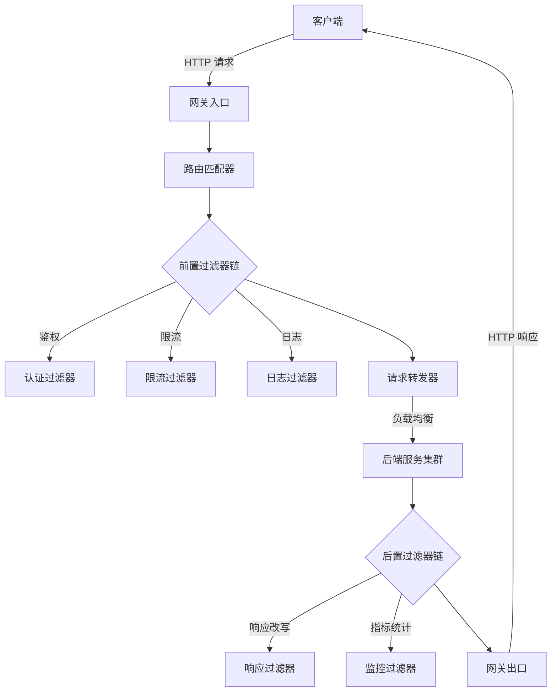
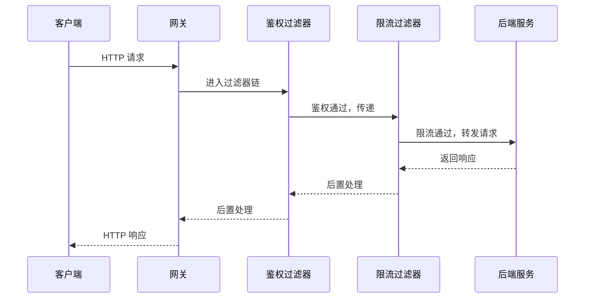

---
title: 网关
date: 2026-01-16 23:45:57
categories:
  - 分布式
  - 分布式治理
tags:
  - 分布式
  - 治理
  - 网关
permalink: /pages/cb75b609/
---

# 网关

## 什么是网关

网关的首要职责就是：作为统一的出口，对外提供服务；将外部访问网关地址的流量，根据适当的规则路由到内部集群中正确的服务节点之上。因此，微服务中的网关，也常被称为"服务网关"或"API 网关"。

网关首先应该是个路由器，在满足此前提的基础上，网关还可以根据需要作为流量过滤器来使用，提供某些额外的可选的功能。网关常见的能力如下：

- **动态路由**：根据请求路由到对应的服务上去，如果服务不可用还会有重试机制
- **负载均衡**：多服务器提供同一种服务，网关会从配置中心拉取各服务注册信息，然后将请求负载均衡风阀到这些服务器进行处理
- **流量控制**：限制并发请求的流量，避免内部系统受到冲击
- **安全认证**：网关对相关权限验证、脱敏和流量清洗、签名和黑名单功能
- **熔断降级**：当服务不可用或者访问量过大，网关可以将请求做降级，将流量打到其他服务器或者做其他处理，提示用户暂时不可用
- **灰度发布**：先进行小部分服务器升级，通过网关将少量的服务路由到已升级的服务器用来测试服务是否正常，大部分请求依旧在老版本服务器上处理
- **日志服务**：服务访问情况监控和统计报表，请求的吞吐量、并发数、流量监控、性能监控和日常告警等

简单来说：

> 网关 = 路由器（基础职能） + 过滤器（可选职能）

### 为什么需要网关

在微服务架构兴起之前，传统单体应用通常只有一个入口，客户端直接访问应用即可。但随着业务规模扩大，单体应用被拆分为多个微服务，由此带来了一系列问题：

- **入口分散**：每个微服务都有独立的地址和端口，客户端需要维护大量服务地址，耦合严重。
- **跨域问题**：浏览器同源策略限制了前端直接访问多个不同端口的服务。
- **安全管控难**：认证、鉴权、限流等横切逻辑散落在各个服务中，难以统一管理。
- **协议异构**：内部服务可能使用不同的协议（如 gRPC、Thrift、HTTP），客户端难以适配。

网关应运而生，它作为**整个分布式系统的唯一入口**，屏蔽了内部微服务的复杂性，对外提供统一的访问入口。客户端只需与网关通信，由网关将请求路由到内部具体的服务。这种设计模式也被称为 `Backend For Frontend`（BFF）的一种实现。

### 网关与负载均衡器的区别

网关与负载均衡器（如 Nginx、LVS）常被混淆，但二者有本质区别：

| 比较项     | 负载均衡器           | API 网关                       |
| ---------- | -------------------- | ------------------------------ |
| 工作层级   | 主要在网络层/传输层  | 主要在应用层                   |
| 核心功能   | 流量分发             | 路由 + 过滤（认证、限流等）    |
| 业务感知   | 不感知业务           | 深度感知业务                   |
| 协议支持   | 通用 TCP/UDP/HTTP    | 通常专注 HTTP/HTTPS            |
| 编程扩展   | 弱（依赖配置）       | 强（支持自定义过滤器/插件）    |
| 典型代表   | LVS、Nginx、HAProxy  | Spring Cloud Gateway、Zuul、Kong |

## 网关的特性

现代 API 网关通常具备以下核心特性：

| 特性       | 说明                                                                         |
| ---------- | ---------------------------------------------------------------------------- |
| 统一入口   | 所有外部请求经由网关进入内部系统，屏蔽内部服务细节                           |
| 动态路由   | 支持运行时动态配置路由规则，无需重启即可生效                                 |
| 过滤器机制 | 提供前置/后置过滤器链，支持业务方自定义扩展                                  |
| 服务发现   | 集成服务注册中心（如 Nacos、Eureka），自动感知服务实例上下线                |
| 协议转换   | 支持外部 HTTP 请求与内部 RPC（如 Dubbo、gRPC）之间的协议转换                |
| 安全防护   | 统一鉴权、签名校验、黑白名单、防 CSRF/XSS 等                                 |
| 流量治理   | 限流、熔断、降级、灰度发布等流量控制能力                                     |
| 可观测性   | 请求日志、调用链追踪、指标监控、告警                                         |

## 网关的原理

### 整体架构

API 网关的核心架构通常包含以下几个部分：



### 工作流程

网关处理一次请求的完整流程如下：

1. **请求接收**：网关接收到客户端的 HTTP 请求。
2. **路由匹配**：根据请求的 URL、Header、Method 等信息，匹配路由规则，确定目标服务。
3. **前置过滤**：依次执行前置过滤器链（如鉴权、限流、日志记录、参数校验）。
4. **负载均衡**：从服务注册中心获取目标服务的可用实例列表，根据负载均衡算法选出一个实例。
5. **请求转发**：将请求转发到选中的后端服务实例（支持协议转换，如 HTTP → gRPC）。
6. **后置过滤**：后端服务返回响应后，依次执行后置过滤器链（如响应改写、指标统计、错误处理）。
7. **响应返回**：将最终响应返回给客户端。

### 路由原理

网关的路由通常基于 **谓词（Predicate）+ 过滤器（Filter）** 模型：

- **谓词**：匹配条件，如 `Path=/api/user/**`、`Header=X-Request-Id, \d+`、`Method=GET` 等。多个谓词可通过 `And`、`Or` 组合。
- **过滤器**：对匹配到的请求执行的处理逻辑，分为 `前置（Pre）` 和 `后置（Post）` 两类。

以 Spring Cloud Gateway 为例，路由配置如下：

```yaml
spring:
  cloud:
    gateway:
      routes:
        - id: user-service
          uri: lb://user-service
          predicates:
            - Path=/api/user/**
            - Method=GET,POST
            - Header=X-Request-Source, mobile|web
          filters:
            - StripPrefix=1
            - name: RequestRateLimiter
              args:
                redis-rate-limiter.replenishRate: 10
                redis-rate-limiter.burstCapacity: 20
```

### 过滤器链原理

过滤器链是网关扩展性的核心。过滤器通常实现统一接口，按优先级顺序执行。以 Spring Cloud Gateway 为例：

```java
public interface GlobalFilter extends Ordered {
    Mono<Void> filter(ServerWebExchange exchange, GatewayFilterChain chain);
}
```

执行模型采用 **责任链模式**：每个过滤器在处理完成后，决定是否调用 `chain.filter(exchange)` 将请求传递给下一个过滤器，或者直接短路返回响应。



## 网关的应用场景

### 微服务统一入口

微服务架构下，系统被拆分为数十甚至上百个服务。网关作为统一入口，屏蔽内部服务拓扑，客户端只需记住网关地址。

### 认证鉴权集中化

将 JWT 校验、OAuth2 令牌校验等鉴权逻辑从各业务服务下沉到网关，业务服务无需重复实现，只需关注业务逻辑。

### 灰度发布

通过网关路由规则，将少量请求（如按用户 ID 取模、按 Header 标识）路由到新版本实例，验证通过后再逐步扩大流量比例，实现平滑升级。

### 协议转换

移动端 App 通常使用 HTTP/HTTPS 通信，而内部微服务可能使用 gRPC、Dubbo 等高性能 RPC 协议。网关负责协议转换，使外部客户端无需感知内部协议。

### API 聚合

客户端一次操作可能需要调用多个后端服务（如订单页需要订单、用户、商品信息）。网关可聚合多个后端服务的响应，减少客户端请求次数。

### 流量治理

在网关层统一实施限流、熔断、降级策略，保护后端服务不被突发流量打垮。

## 网关的最佳实践

### 案例一：Spring Cloud Gateway 实现统一鉴权网关

**场景**：微服务系统中，所有对外接口都需要校验 JWT 令牌，将鉴权逻辑统一收敛到网关层。

**实现步骤**：

1. 引入 Spring Cloud Gateway 依赖
2. 自定义全局过滤器实现 JWT 校验
3. 配置路由规则，将需要鉴权的路径指向下游服务

`pom.xml` 依赖：

```xml
<dependencies>
    <dependency>
        <groupId>org.springframework.cloud</groupId>
        <artifactId>spring-cloud-starter-gateway</artifactId>
    </dependency>
    <dependency>
        <groupId>com.alibaba.cloud</groupId>
        <artifactId>spring-cloud-starter-alibaba-nacos-discovery</artifactId>
    </dependency>
    <dependency>
        <groupId>io.jsonwebtoken</groupId>
        <artifactId>jjwt-api</artifactId>
        <version>0.11.5</version>
    </dependency>
    <dependency>
        <groupId>io.jsonwebtoken</groupId>
        <artifactId>jjwt-impl</artifactId>
        <version>0.11.5</version>
        <scope>runtime</scope>
    </dependency>
    <dependency>
        <groupId>io.jsonwebtoken</groupId>
        <artifactId>jjwt-jackson</artifactId>
        <version>0.11.5</version>
        <scope>runtime</scope>
    </dependency>
</dependencies>
```

JWT 校验过滤器：

```java
import io.jsonwebtoken.Claims;
import io.jsonwebtoken.Jws;
import io.jsonwebtoken.Jwts;
import io.jsonwebtoken.security.Keys;
import org.springframework.cloud.gateway.filter.GatewayFilterChain;
import org.springframework.cloud.gateway.filter.GlobalFilter;
import org.springframework.core.Ordered;
import org.springframework.http.HttpHeaders;
import org.springframework.http.HttpStatus;
import org.springframework.http.server.reactive.ServerHttpRequest;
import org.springframework.stereotype.Component;
import org.springframework.web.server.ServerWebExchange;
import reactor.core.publisher.Mono;

import javax.crypto.SecretKey;
import java.nio.charset.StandardCharsets;

@Component
public class JwtAuthFilter implements GlobalFilter, Ordered {

    private static final String SECRET = "this-is-a-secret-key-for-jwt-signing-must-be-long-enough";
    private static final SecretKey KEY = Keys.hmacShaKeyFor(SECRET.getBytes(StandardCharsets.UTF_8));

    /** 白名单路径，无需鉴权 */
    private static final String[] WHITE_LIST = {"/api/auth/login", "/api/auth/register"};

    @Override
    public Mono<Void> filter(ServerWebExchange exchange, GatewayFilterChain chain) {
        ServerHttpRequest request = exchange.getRequest();
        String path = request.getURI().getPath();

        // 白名单放行
        for (String white : WHITE_LIST) {
            if (path.startsWith(white)) {
                return chain.filter(exchange);
            }
        }

        // 获取 Authorization 头
        String authHeader = request.getHeaders().getFirst(HttpHeaders.AUTHORIZATION);
        if (authHeader == null || !authHeader.startsWith("Bearer ")) {
            return unauthorized(exchange, "缺少认证令牌");
        }

        String token = authHeader.substring(7);
        try {
            Jws<Claims> claimsJws = Jwts.parserBuilder()
                .setSigningKey(KEY)
                .build()
                .parseClaimsJws(token);
            Claims claims = claimsJws.getBody();

            // 将用户信息透传到下游服务
            ServerHttpRequest mutatedRequest = request.mutate()
                .header("X-User-Id", claims.getSubject())
                .header("X-User-Role", claims.get("role", String.class))
                .build();
            return chain.filter(exchange.mutate().request(mutatedRequest).build());
        } catch (Exception e) {
            return unauthorized(exchange, "令牌无效或已过期");
        }
    }

    private Mono<Void> unauthorized(ServerWebExchange exchange, String message) {
        exchange.getResponse().setStatusCode(HttpStatus.UNAUTHORIZED);
        return exchange.getResponse().setComplete();
    }

    @Override
    public int getOrder() {
        // 最高优先级，确保鉴权最先执行
        return Ordered.HIGHEST_PRECEDENCE;
    }
}
```

`application.yml` 路由配置：

```yaml
server:
  port: 8080

spring:
  application:
    name: api-gateway
  cloud:
    nacos:
      discovery:
        server-addr: 127.0.0.1:8848
    gateway:
      discovery:
        locator:
          enabled: true
          lower-case-service-id: true
      routes:
        - id: user-service
          uri: lb://user-service
          predicates:
            - Path=/api/user/**
          filters:
            - StripPrefix=1
        - id: order-service
          uri: lb://order-service
          predicates:
            - Path=/api/order/**
          filters:
            - StripPrefix=1
```

**说明**：该方案将 JWT 校验逻辑收敛到网关层，下游业务服务无需重复实现。通过 `request.mutate()` 将解析出的用户信息以 Header 形式透传，下游服务直接读取即可。

### 案例二：基于网关的灰度发布

**场景**：用户服务升级到 v2 版本，希望先让 10% 的流量访问新版本验证稳定性。

**实现**：通过自定义过滤器，根据请求标识（如用户 ID 哈希或 Header 标记）路由到不同版本的服务实例。

```java
import org.springframework.cloud.gateway.filter.GatewayFilterChain;
import org.springframework.cloud.gateway.filter.GlobalFilter;
import org.springframework.core.Ordered;
import org.springframework.http.server.reactive.ServerHttpRequest;
import org.springframework.stereotype.Component;
import org.springframework.web.server.ServerWebExchange;
import reactor.core.publisher.Mono;

import java.util.List;
import java.util.concurrent.ThreadLocalRandom;

@Component
public class GrayReleaseFilter implements GlobalFilter, Ordered {

    @Override
    public Mono<Void> filter(ServerWebExchange exchange, GatewayFilterChain chain) {
        ServerHttpRequest request = exchange.getRequest();

        // 方式一：通过 Header 强制指定灰度版本（用于测试）
        String grayHeader = request.getHeaders().getFirst("X-Gray-Version");
        if ("v2".equals(grayHeader)) {
            // 将流量路由到 v2 版本的服务实例
            // 需要配合服务注册中心的元数据，通过 LoadBalancer 客户端筛选实例
            exchange.getAttributes().put("gray-version", "v2");
            return chain.filter(exchange);
        }

        // 方式二：按比例灰度，10% 流量进入 v2
        if (ThreadLocalRandom.current().nextInt(100) < 10) {
            exchange.getAttributes().put("gray-version", "v2");
        } else {
            exchange.getAttributes().put("gray-version", "v1");
        }

        return chain.filter(exchange);
    }

    @Override
    public int getOrder() {
        return Ordered.HIGHEST_PRECEDENCE + 10;
    }
}
```

配合 Spring Cloud LoadBalancer 的实例筛选：

```java
import org.springframework.cloud.client.ServiceInstance;
import org.springframework.cloud.loadbalancer.core.ReactorServiceInstanceLoadBalancer;
import org.springframework.cloud.loadbalancer.core.ServiceInstanceListSupplier;
import org.springframework.cloud.loadbalancer.support.LoadBalancerClientFactory;
import org.springframework.stereotype.Component;
import reactor.core.publisher.Flux;
import reactor.core.publisher.Mono;

import java.util.List;
import java.util.Map;
import java.util.concurrent.ThreadLocalRandom;
import java.util.stream.Collectors;

@Component
public class GrayLoadBalancer implements ReactorServiceInstanceLoadBalancer {

    private final String serviceId;
    private final ServiceInstanceListSupplier supplier;

    public GrayLoadBalancer(String serviceId, ServiceInstanceListSupplier supplier) {
        this.serviceId = serviceId;
        this.supplier = supplier;
    }

    @Override
    public Mono<Response<ServiceInstance>> choose(Request request) {
        return supplier.get(request).next()
            .flatMap(instances -> {
                // 从请求上下文中获取灰度版本标识
                String grayVersion = (String) request.getContext().get("gray-version");

                List<ServiceInstance> filtered = instances.stream()
                    .filter(instance -> {
                        Map<String, String> metadata = instance.getMetadata();
                        String version = metadata.get("version");
                        return grayVersion == null || grayVersion.equals(version);
                    })
                    .collect(Collectors.toList());

                if (filtered.isEmpty()) {
                    filtered = instances;
                }

                ServiceInstance selected = filtered.get(
                    ThreadLocalRandom.current().nextInt(filtered.size()));
                return Mono.just(new DefaultResponse(selected));
            });
    }
}
```

**说明**：灰度发布通过网关统一控制，业务服务无感知。`v2` 实例在注册中心需携带 `version=v2` 元数据。灰度比例可动态调整，无需重启服务。

### 案例三：网关层限流保护后端服务

**场景**：秒杀活动期间，订单接口可能面临瞬时高并发，需要在网关层对 `/api/order/**` 路径实施限流，保护后端订单服务。

**实现**：基于 Spring Cloud Gateway 内置的 `RequestRateLimiter` 过滤器，结合 Redis 实现分布式令牌桶限流。

`application.yml` 配置：

```yaml
spring:
  cloud:
    gateway:
      routes:
        - id: order-service
          uri: lb://order-service
          predicates:
            - Path=/api/order/**
          filters:
            - StripPrefix=1
            - name: RequestRateLimiter
              args:
                # 令牌桶每秒填充速率（即允许的 QPS）
                redis-rate-limiter.replenishRate: 100
                # 令牌桶容量（允许的瞬时突发量）
                redis-rate-limiter.burstCapacity: 200
                # 每个请求消耗的令牌数
                redis-rate-limiter.requestedTokens: 1
                # 限流 key 解析器，按用户 ID 限流
                key-resolver: "#{@userKeyResolver}"
  data:
    redis:
      host: 127.0.0.1
      port: 6379
```

自定义 KeyResolver，按用户 ID 限流：

```java
import org.springframework.cloud.gateway.filter.ratelimit.KeyResolver;
import org.springframework.context.annotation.Bean;
import org.springframework.context.annotation.Configuration;
import org.springframework.http.server.reactive.ServerHttpRequest;
import reactor.core.publisher.Mono;

@Configuration
public class RateLimiterConfig {

    /**
     * 按用户 ID 限流
     */
    @Bean
    public KeyResolver userKeyResolver() {
        return exchange -> {
            ServerHttpRequest request = exchange.getRequest();
            String userId = request.getHeaders().getFirst("X-User-Id");
            if (userId == null || userId.isEmpty()) {
                // 未登录用户按 IP 限流
                userId = request.getRemoteAddress() != null
                    ? request.getRemoteAddress().getAddress().getHostAddress()
                    : "anonymous";
            }
            return Mono.just(userId);
        };
    }

    /**
     * 按 API 路径限流
     */
    @Bean
    public KeyResolver apiKeyResolver() {
        return exchange -> Mono.just(exchange.getRequest().getURI().getPath());
    }

    /**
     * 按 IP 限流
     */
    @Bean
    public KeyResolver ipKeyResolver() {
        return exchange -> {
            String ip = exchange.getRequest().getHeaders().getFirst("X-Forwarded-For");
            if (ip == null) {
                ip = exchange.getRequest().getRemoteAddress() != null
                    ? exchange.getRequest().getRemoteAddress().getAddress().getHostAddress()
                    : "unknown";
            }
            return Mono.just(ip);
        };
    }
}
```

**说明**：`RequestRateLimiter` 底层基于 Redis + Lua 实现令牌桶算法，保证在分布式多实例网关下限流计数准确。当请求被限流时，网关返回 `429 Too Many Requests` 状态码。可以根据业务需要选择不同的 `KeyResolver` 实现按用户、按接口、按 IP 等维度的限流。

## 网关的常见问题

### 问题一：网关成为系统单点故障

**问题描述**：网关作为所有外部流量的唯一入口，一旦网关宕机，整个系统对外不可用。

**原因分析**：单实例部署的网关没有冗余，硬件故障、进程崩溃、OOM 等任何问题都会导致入口不可用。

**解决方案**：采用 **高可用集群部署**，通常配合负载均衡器实现。

```
客户端 -> SLB/F5 -> [网关实例1, 网关实例2, 网关实例N] -> 后端服务
```

具体措施：

1. **多实例部署**：至少部署 2 个以上网关实例，无状态设计（Session 等状态外置到 Redis）。
2. **前置负载均衡**：使用 Nginx、HAProxy 或云厂商 SLB 作为网关前置，健康检查自动剔除故障实例。
3. **优雅停机**：网关下线时，先拒绝新请求并等待已有请求处理完成，再关闭进程。

Nginx 前置配置示例：

```nginx
upstream gateway_cluster {
    # 健康检查：每 5 秒检测一次，失败 2 次剔除，恢复 1 次重新加入
    check interval=5000 rise=1 fall=2 timeout=3000 type=http;
    check_http_send "HEAD /actuator/health HTTP/1.0\r\n\r\n";
    check_http_expect_alive http_2xx http_3xx;

    server 192.168.1.10:8080 max_fails=2 fail_timeout=10s;
    server 192.168.1.11:8080 max_fails=2 fail_timeout=10s;
    server 192.168.1.12:8080 max_fails=2 fail_timeout=10s;
}

server {
    listen 80;
    server_name api.example.com;

    location / {
        proxy_pass http://gateway_cluster;
        proxy_set_header Host $host;
        proxy_set_header X-Real-IP $remote_addr;
        proxy_set_header X-Forwarded-For $proxy_add_x_forwarded_for;
        proxy_connect_timeout 5s;
        proxy_read_timeout 60s;
    }
}
```

### 问题二：网关性能瓶颈

**问题描述**：随着流量增长，网关 CPU 或内存使用率居高不下，响应延迟明显增加，成为整个系统的性能瓶颈。

**原因分析**：

- 网关层承担了过多业务逻辑（如复杂的参数校验、数据转换）。
- 过滤器链过长，每个请求经过大量过滤器处理。
- 使用阻塞式 I/O 模型，线程数有限，高并发下线程耗尽。
- 日志同步写入，磁盘 I/O 阻塞请求线程。

**解决方案**：

1. **选择异步非阻塞框架**：如 Spring Cloud Gateway（基于 Netty + Reactor）、Zuul 2.x，相比传统同步阻塞模型，能以少量线程支撑高并发。
2. **精简过滤器**：将非必要的逻辑（如复杂校验）下沉到业务服务，网关只保留必要的横切逻辑。
3. **日志异步化**：使用异步日志框架（如 Log4j2 AsyncLogger），避免磁盘 I/O 阻塞。

```java
// log4j2.xml 异步日志配置
<Configuration status="WARN">
    <Appenders>
        <Async name="Async">
            <AppenderRef ref="RollingFile"/>
        </Async>
        <RollingFile name="RollingFile"
                     fileName="logs/gateway.log"
                     filePattern="logs/gateway-%d{yyyy-MM-dd}-%i.log.gz">
            <PatternLayout pattern="%d{HH:mm:ss.SSS} [%t] %-5level %logger{36} - %msg%n"/>
            <Policies>
                <TimeBasedTriggeringPolicy/>
                <SizeBasedTriggeringPolicy size="100 MB"/>
            </Policies>
        </RollingFile>
    </Appenders>
    <Loggers>
        <Root level="info">
            <AppenderRef ref="Async"/>
        </Root>
    </Loggers>
</Configuration>
```

4. **监控与调优**：通过 Prometheus + Grafana 监控网关的 QPS、响应时间、线程池使用率等指标，及时发现瓶颈。

### 问题三：网关路由配置变更不生效

**问题描述**：修改了路由配置后，部分请求仍按旧路由规则转发，需要重启网关才生效。

**原因分析**：

- 路由配置写在 `application.yml` 中，属于静态配置，Spring Cloud Gateway 默认在启动时加载，运行时不会自动刷新。
- 配置中心（如 Nacos）的配置已更新，但网关未监听配置变更事件。

**解决方案**：启用 **动态路由**，结合配置中心实现路由规则的热更新。

```java
import com.fasterxml.jackson.core.type.TypeReference;
import com.fasterxml.jackson.databind.ObjectMapper;
import org.springframework.cloud.gateway.event.RefreshRoutesEvent;
import org.springframework.cloud.gateway.route.RouteDefinition;
import org.springframework.cloud.gateway.route.RouteDefinitionLocator;
import org.springframework.cloud.gateway.route.RouteDefinitionWriter;
import org.springframework.context.ApplicationEventPublisher;
import org.springframework.data.redis.core.StringRedisTemplate;
import org.springframework.stereotype.Component;
import reactor.core.publisher.Flux;
import reactor.core.publisher.Mono;

import java.util.List;

@Component
public class RedisRouteDefinitionRepository implements RouteDefinitionLocator, RouteDefinitionWriter {

    private static final String ROUTE_KEY = "gateway:routes";
    private final StringRedisTemplate redisTemplate;
    private final RouteDefinitionWriter routeDefinitionWriter;
    private final ApplicationEventPublisher publisher;
    private final ObjectMapper objectMapper = new ObjectMapper();

    public RedisRouteDefinitionRepository(StringRedisTemplate redisTemplate,
                                          RouteDefinitionWriter routeDefinitionWriter,
                                          ApplicationEventPublisher publisher) {
        this.redisTemplate = redisTemplate;
        this.routeDefinitionWriter = routeDefinitionWriter;
        this.publisher = publisher;
    }

    /**
     * 从 Redis 加载所有路由定义
     */
    @Override
    public Flux<RouteDefinition> getRouteDefinitions() {
        List<String> routes = redisTemplate.opsForList().range(ROUTE_KEY, 0, -1);
        if (routes == null || routes.isEmpty()) {
            return Flux.empty();
        }
        try {
            List<RouteDefinition> definitions = objectMapper.readValue(
                routes.toString(), new TypeReference<List<RouteDefinition>>() {});
            return Flux.fromIterable(definitions);
        } catch (Exception e) {
            return Flux.error(e);
        }
    }

    /**
     * 保存路由定义并触发刷新
     */
    public void save(RouteDefinition route) {
        try {
            String json = objectMapper.writeValueAsString(route);
            redisTemplate.opsForList().rightPush(ROUTE_KEY, json);
            // 发布刷新事件，让网关重新加载路由
            publisher.publishEvent(new RefreshRoutesEvent(this));
        } catch (Exception e) {
            throw new RuntimeException("保存路由失败", e);
        }
    }

    /**
     * 删除路由定义并触发刷新
     */
    public void delete(String routeId) {
        List<String> routes = redisTemplate.opsForList().range(ROUTE_KEY, 0, -1);
        if (routes != null) {
            routes.removeIf(json -> {
                try {
                    RouteDefinition def = objectMapper.readValue(json, RouteDefinition.class);
                    return routeId.equals(def.getId());
                } catch (Exception e) {
                    return false;
                }
            });
            redisTemplate.delete(ROUTE_KEY);
            for (String json : routes) {
                redisTemplate.opsForList().rightPush(ROUTE_KEY, json);
            }
        }
        publisher.publishEvent(new RefreshRoutesEvent(this));
    }

    @Override
    public Mono<Void> save(Mono<RouteDefinition> route) {
        return route.flatMap(r -> {
            save(r);
            return Mono.empty();
        });
    }

    @Override
    public Mono<Void> delete(Mono<String> routeId) {
        return routeId.doOnNext(this::delete).then();
    }
}
```

**说明**：将路由定义存储在 Redis 中，通过发布 `RefreshRoutesEvent` 事件触发网关重新加载路由。配合管理后台，运维人员可以在不重启网关的情况下动态增删改路由规则。

## 主流网关对比

| 网关产品               | 语言   | 核心特点                                       | 适用场景                       |
| ---------------------- | ------ | ---------------------------------------------- | ------------------------------ |
| **Spring Cloud Gateway** | Java   | 基于 Reactor 异步非阻塞，与 Spring 生态深度集成 | Spring Cloud 微服务体系        |
| **Zuul 2.x**           | Java   | 基于 Netty 异步，Netflix 开源                  | Netflix 生态体系               |
| **Kong**               | Lua    | 基于 OpenResty，插件生态丰富                   | 多语言微服务体系、API 管理     |
| **APISIX**             | Lua    | 动态路由、高性能、插件化                       | 云原生场景、对性能要求高       |
| **Nginx + Lua**        | C/Lua  | 高性能、灵活扩展                              | 对性能极致要求、自定义场景     |
| **Traefik**            | Go     | 自动服务发现、云原生友好                       | Kubernetes 环境                |

## 参考资料

- [Spring Cloud Gateway 官方文档](https://docs.spring.io/spring-cloud-gateway/docs/current/reference/html/)
- [微服务网关：如何解决微服务架构下的统一入口问题](https://www.cnblogs.com/sam-uncle/p/11244808.html)
- [API 网关选型](https://www.infoq.cn/article/api-gateway-selection)
- [Spring Cloud Gateway 动态路由实现](https://blog.csdn.net/zhengzhaoyang/article/details/108970652)
- [Kong 官方文档](https://docs.konghq.com/)
- [Apache APISIX 官方文档](https://apisix.apache.org/zh/docs/)
- [《微服务架构设计模式》](https://book.douban.com/subject/35492856/)
