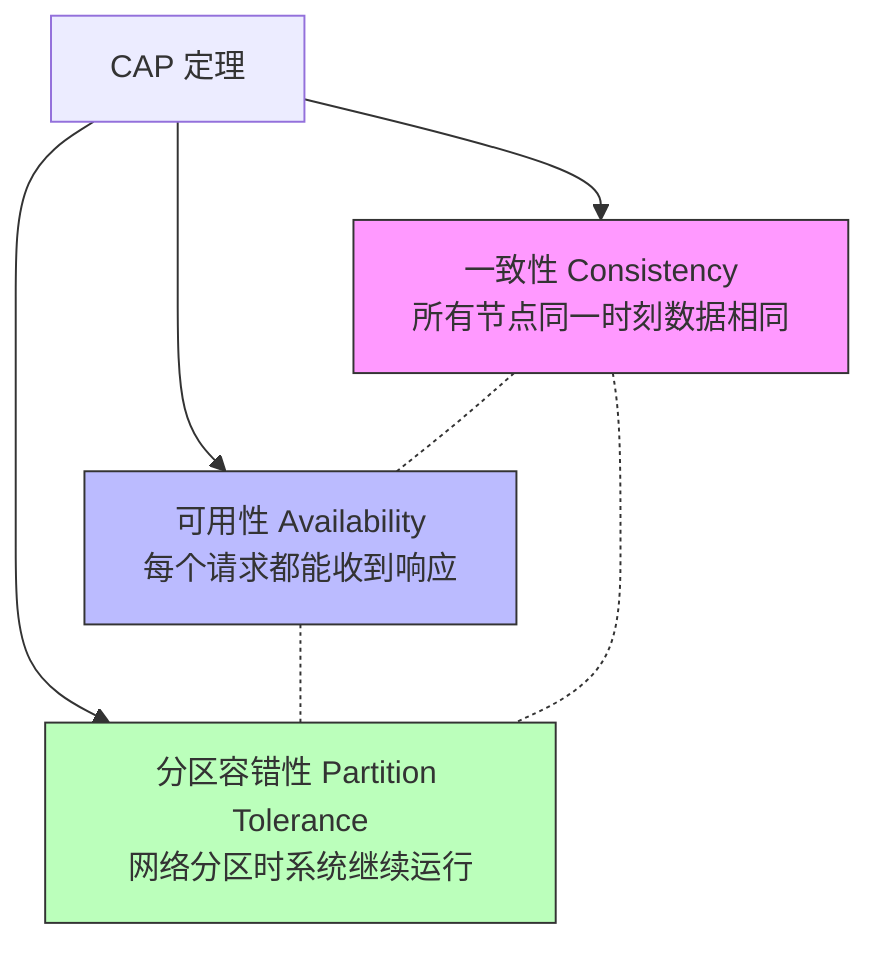
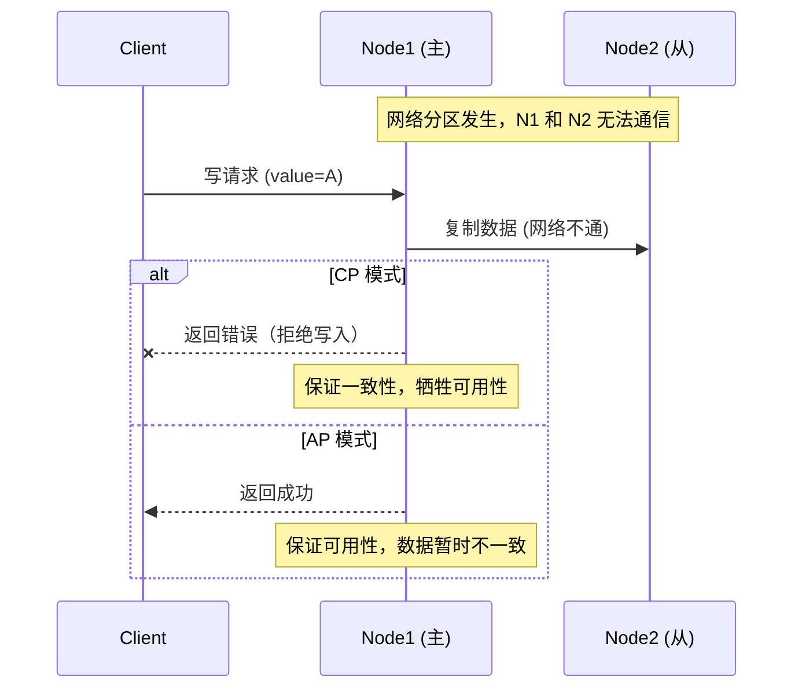

---
title: CAP 和 BASE
date: 2021-11-08 08:15:33
categories:
  - 分布式
  - 分布式理论
tags:
  - 分布式
  - 一致性
  - ACID
  - CAP
  - BASE
permalink: /pages/7856a20a/
---

# CAP 和 BASE

## 简介

在分布式系统中，数据通常会被复制到多个节点上以提高可用性和性能。然而，当网络发生分区（节点之间无法通信）时，系统就面临一个根本性的抉择：是优先保证数据一致性（C），还是优先保证服务可用性（A）？这就是 **CAP 定理** 所揭示的核心矛盾。

CAP 定理由 Eric Brewer 于 1998 年提出，并在 2002 年由 Seth Gilbert 和 Nancy Lynch 正式证明。它指出：一个分布式系统不可能同时满足一致性（Consistency）、可用性（Availability）和分区容错性（Partition Tolerance）这三个特性，最多只能同时满足其中两个。

由于在分布式系统中网络分区是不可避免的客观事实，因此实际的权衡往往发生在 **AP** 和 **CP** 之间。**BASE 定理** 是对 CAP 中 AP 方向的进一步实践指导，它通过牺牲强一致性来换取高可用性，最终达到一致状态。BASE 是电商、社交等互联网场景中广泛采用的架构原则。

## 一致性

一致性（Consistency）指的是**多个数据副本是否能保持一致**的特性。

在一致性的条件下，分布式系统在执行写操作成功后，如果所有用户都能够读取到最新的值，该系统就被认为具有强一致性。

数据一致性又可以分为以下几点：

- **强一致性** - 数据更新操作结果和操作响应总是一致的，即操作响应通知更新失败，那么数据一定没有被更新，而不是处于不确定状态。
- **弱一致性** - 系统在写入数据成功后，不承诺立即能读到最新的值，也不承诺什么时候能读到，但是过一段时间之后用户可以看到更新后的值。那么用户读不到最新数据的这段时间被称为“不一致窗口时间”。
- **最终一致性** - 最终一致性作为弱一致性中的特例，强调的是所有数据副本，在经过一段时间的同步后，最终能够到达一致的状态，不需要实时保证系统数据的强一致性。

## ACID

ACID 是数据库事务正确执行的四个基本要素的单词缩写：

- **原子性（Atomicity）**
  - 原子是指不可分解为更小粒度的东西。事务的原子性意味着：**事务中的所有操作要么全部成功，要么全部失败**。
  - 回滚可以用日志来实现，日志记录着事务所执行的修改操作，在回滚时反向执行这些修改操作即可。
- **一致性（Consistency）**
  - 数据库在事务执行前后都保持一致性状态。
  - 在一致性状态下，所有事务对一个数据的读取结果都是相同的。
- **隔离性（Isolation）**
  - 同时运行的事务互不干扰。换句话说，一个事务所做的修改在最终提交以前，对其它事务是不可见的。
- **持久性（Durability）**
  - 一旦事务提交，则其所做的修改将会永远保存到数据库中。即使系统发生崩溃，事务执行的结果也不能丢失。
  - 可以通过数据库备份和恢复来实现，在系统发生奔溃时，使用备份的数据库进行数据恢复。

一个支持事务（Transaction）的数据库系统，必需要具有这四种特性，否则在事务过程（Transaction processing）当中无法保证数据的正确性。

- 只有满足一致性，事务的执行结果才是正确的。
- 在无并发的情况下，事务串行执行，隔离性一定能够满足。此时只要能满足原子性，就一定能满足一致性。
- 在并发的情况下，多个事务并行执行，事务不仅要满足原子性，还需要满足隔离性，才能满足一致性。
- 事务满足持久化是为了能应对系统崩溃的情况。

## CAP 定理

### CAP 简介

1998 年，Brewer 提出了分布式系统领域大名鼎鼎的 CAP 定理。

CAP 定理提出：分布式系统有三个指标，这三个指标不能同时做到：

- **一致性（Consistency）** - 在任何给定时间，网络中的所有节点都具有完全相同（最近）的值。
- **可用性（Availability）** - 对网络的每个请求都会返回响应，但不能保证返回的数据是最新的。
- **分区容错性（Partition Tolerance）** - 即使任意数量的节点出现故障，网络仍会继续运行。

CAP 就是取 Consistency、Availability、Partition Tolerance 的首字母而命名。


在分布式系统中，分区容错性是一个既定的事实：因为分布式系统总会出现各种各样的问题，如由于网络原因而导致节点失联；发生机器故障；机器重启或升级等等。因此，**CAP 定理实际上是要在可用性（A）和一致性（C）之间做权衡**。

### AP 模式

对网络的每个请求都会收到响应，即使由于网络分区（故障节点）而无法保证数据一定是最新的。

选择 **AP 模式**，偏向于保证服务的高可用性。用户访问系统的时候，都能得到响应数据，不会出现响应错误；但是，当出现分区故障时，相同的读操作，访问不同的节点，得到响应数据可能不一样。


### CP 模式

如果由于网络分区（故障节点）而无法保证特定信息是最新的，则系统将返回错误或超时。

选择 **CP 模式**，一旦因为消息丢失、延迟过高发生了网络分区，就会影响用户的体验和业务的可用性。因为为了防止数据不一致，系统将拒绝新数据的写入。


### CAP 定理的应用

CAP 定理在分布式系统设计中，可以被应用与哪些方面？

一个最具代表性的问题是：服务注册中心应该选择 AP 还是 CP？

在微服务架构下，服务注册和服务发现机制中主要有三种角色：

- **服务提供者**（RPC Server / Provider）
- **服务消费者**（RPC Client / Consumer）
- **服务注册中心**（Registry）

**注册中心**负责协调服务注册和服务发现，显然它是核心中的核心。主流的注册中心有很多，如：ZooKeeper、Nacos、Eureka、Consul、etcd 等。在针对注册中心进行技术选型时，其 CAP 设计也是一个比较的维度。

- CP 模型代表：ZooKeeper、etcd。系统强调数据的一致性，当数据一致性无法保证时（如：正在选举主节点），系统拒绝请求。
- AP 模型代表：Nacos、Eureka。系统强调可用性，牺牲一定的一致性（即服务节点上的数据不保证是最新的），来保证整体服务可用。

对于服务注册中心而言，即使不同节点保存的服务注册信息存在差异，也不会造成灾难性的后果，仅仅是信息滞后而已。但是，如果为了追求数据一致性，使得服务发现短时间内不可用，负面影响更严重。所以，对于服务注册中心而言，可用性比一致性更重要，一般应该选择 AP 模型。

### CAP 定理的误导

CAP 定理在分布式系统领域大名鼎鼎，以至于被很多人视为了真理。然而，CAP 定理真的正确吗？

网络分区是一种故障，不管喜欢还是不喜欢，它都可能发生，所以无法选择或逃避分区的问题。在网络正常的时候，系统可以同时保证一致性（线性化）和可用性。而一旦发生了网络故障，必须要么选择一致性，要么选择可用性。因此，对 CAP 更准确的理解应该是：**当发生网络分区（P）的情况下，可用性（A）和一致性（C）二者只能选其一**。

CAP 定理所描述的模型实际上局限性很大，它只考虑了一种一致性模型和一种故障（网络分区故障），而没有考虑网络延迟、节点失效等情况。因此，它对于指导一个具体的分布式系统设计来说，没有太大的实际价值。

值得一提的是，在 CAP 定理提出十二年之后，其提出者也发表了一篇文章 [**CAP Twelve Years Later: How the “Rules” Have Changed**](https://www.infoq.com/articles/cap-twelve-years-later-how-the-rules-have-changed/)，来阐述 CAP 定理的局限性。

## BASE 定理

BASE 是 **`基本可用（Basically Available）`**、**`软状态（Soft State）`** 和 **`最终一致性（Eventually Consistent）`** 三个短语的缩写。BASE 定理是对 CAP 定理中可用性（A）和一致性（C）权衡的结果。

BASE 定理的核心思想是：即使无法做到强一致性，但每个应用都可以根据自身业务特点，采用适当的方式来使系统达到最终一致性。

- **基本可用（Basically Available）** - 分布式系统在出现故障的时候，**保证核心可用，允许损失部分可用性**。例如，电商在做促销时，为了保证购物系统的稳定性，部分消费者可能会被引导到一个降级的页面。
- **软状态（Soft State）** - 指允许系统中的数据存在中间状态，并认为该中间状态不会影响系统整体可用性，即**允许系统不同节点的数据副本之间进行同步的过程存在延时**。
- **最终一致性（Eventually Consistent）** - 强调的是所有数据副本，**在经过一段时间的同步后，最终能够到达一致的状态**，不需要实时保证系统数据的强一致性。

## BASE vs. ACID

BASE 定理的**核心思想**是：即使无法做到强一致性，但每个应用都可以根据自身业务特点，采用适当的方式来使系统达到最终一致性。

ACID 要求强一致性，通常运用在传统的数据库系统上。而 BASE 要求最终一致性，通过**牺牲强一致性来达到可用性**，通常运用在大型分布式系统中。


在实际的分布式场景中，不同业务单元和组件对一致性的要求是不同的，因此 ACID 和 BASE 往往会结合在一起使用。

## CAP 与 BASE 的特性对比

| 特性 | CAP 定理 | BASE 定理 |
| :--- | :--- | :--- |
| **关注点** | 分布式系统的理论边界 | 分布式系统的工程实践 |
| **一致性要求** | 强一致性（线性一致性） | 最终一致性 |
| **可用性要求** | 每个请求都必须得到响应（非错误响应） | 基本可用（允许损失部分可用性） |
| **适用场景** | 理论分析、架构选型参考 | 互联网大规模分布式系统 |
| **与 ACID 关系** | 与 ACID 的强一致性对立 | 是 ACID 的权衡妥协 |

### 一致性级别

| 级别 | 说明 | 典型场景 |
| :--- | :--- | :--- |
| **强一致性** | 写操作完成后，任何后续读都能读到最新值 | 银行转账、分布式锁 |
| **顺序一致性** | 所有节点看到的操作顺序一致，但不一定实时 | ZooKeeper 读 |
| **因果一致性** | 有因果关系的事件保持顺序 | 社交网络消息 |
| **读己之写** | 客户端能读到自己写的最新值 | 用户个人资料修改 |
| **最终一致性** | 副本最终会收敛到一致状态 | DNS、CDN、缓存 |

## CAP 原理详解

### CAP 三要素



### 网络分区时的抉择



### CAP 的常见误区

1. **"三选二"是误导**：并非始终在三者中选择两个。网络分区是偶发故障，分区未发生时系统可以同时满足 C 和 A
2. **C 不等于 ACID 的 C**：CAP 的 C 是线性一致性，ACID 的 C 是业务约束一致性
3. **A 不等于高可用**：CAP 的 A 要求每个非故障节点都能返回响应，并非系统的整体可用性
4. **分区不是常态**：大部分时间系统都正常运行，CAP 只在分区发生时才有意义

## 应用场景

### CP 模式适用场景

- **金融交易系统**：资金操作必须保证强一致性，宁可拒绝服务也不能数据不一致
- **分布式锁服务**：锁的状态必须全局一致，否则会导致并发问题
- **配置中心**：关键配置变更需要立即对所有节点生效
- **分布式数据库主键生成**：必须保证唯一性
- **代表产品**：ZooKeeper、etcd、HBase、MongoDB（默认）

### AP 模式适用场景

- **社交网络动态**：短暂的延迟不一致可接受
- **商品评论与点赞**：数据最终一致即可
- **搜索引擎索引**：索引更新可以有延迟
- **CDN 内容分发**：各节点内容最终一致
- **代表产品**：Cassandra、DynamoDB、Eureka、Nacos（AP 模式）

### BASE 适用场景

- **电商订单系统**：允许短时间内的状态不一致
- **用户行为日志**：最终一致即可
- **缓存更新**：允许缓存与数据库短暂不一致

## 最佳实践

### 案例 1：服务注册中心的 AP 选型（Nacos）

服务注册中心应优先选择 AP 模式，因为注册信息短暂不一致不会造成严重后果，但服务发现不可用影响严重：

```yaml
# Nacos 配置 - AP 模式（默认）
spring:
  cloud:
    nacos:
      discovery:
        server-addr: 127.0.0.1:8848
        namespace: public
        # AP 模式：临时实例，客户端心跳上报
        ephemeral: true
        # 心跳间隔（秒）
        heart-beat-interval: 5
        # 心跳超时时间（秒）
        heart-beat-timeout: 15
```

```java
import com.alibaba.cloud.nacos.registry.NacosAutoServiceRegistration;
import org.springframework.beans.factory.annotation.Autowired;
import org.springframework.web.bind.annotation.PostMapping;
import org.springframework.web.bind.annotation.RestController;

@RestController
public class ServiceRegistryController {

    @Autowired
    private NacosAutoServiceRegistration nacosAutoServiceRegistration;

    /**
     * 主动下线服务，配合 AP 模式实现优雅停机
     */
    @PostMapping("/deregister")
    public String deregister() {
        nacosAutoServiceRegistration.stop();
        return "服务已下线";
    }

    /**
     * 重新注册服务
     */
    @PostMapping("/register")
    public String register() {
        nacosAutoServiceRegistration.start();
        return "服务已注册";
    }
}
```

### 案例 2：最终一致性的订单状态同步（消息队列）

使用 RocketMQ 事务消息实现跨服务的最终一致性：

```java
import org.apache.rocketmq.spring.core.RocketMQTemplate;
import org.springframework.messaging.support.MessageBuilder;
import org.springframework.stereotype.Service;
import javax.annotation.Resource;

@Service
public class OrderFinalConsistencyService {

    @Resource
    private RocketMQTemplate rocketMQTemplate;
    @Resource
    private OrderRepository orderRepository;
    @Resource
    private LocalTransactionLogRepository txLogRepository;

    /**
     * 发送事务消息：先发送半消息，执行本地事务，再提交或回滚
     */
    public void createOrderFinalConsistency(OrderRequest request) {
        // 1. 发送半消息
        rocketMQTemplate.sendMessageInTransaction(
                "order-tx-topic",
                MessageBuilder.withPayload(request).build(),
                request
        );
    }

    /**
     * 执行本地事务（由 RocketMQ 回调）
     */
    public boolean executeLocalTransaction(OrderRequest request) {
        try {
            // 记录事务日志（用于回查）
            txLogRepository.save(new TransactionLog(request.getRequestId(), "EXECUTING"));

            // 执行本地事务：创建订单
            orderRepository.save(buildOrder(request));

            // 更新事务日志状态
            txLogRepository.updateStatus(request.getRequestId(), "COMMIT");
            return true;
        } catch (Exception e) {
            txLogRepository.updateStatus(request.getRequestId(), "ROLLBACK");
            return false;
        }
    }

    /**
     * 事务回查（由 RocketMQ 在半消息超时未确认时调用）
     */
    public boolean checkLocalTransaction(String requestId) {
        TransactionLog log = txLogRepository.findById(requestId);
        if (log == null) {
            return false;
        }
        return "COMMIT".equals(log.getStatus());
    }
}
```

RocketMQ 配置：

```yaml
rocketmq:
  name-server: 127.0.0.1:9876
  producer:
    group: order-producer-group
    send-message-timeout: 3000
    retry-times-when-send-failed: 3
    retry-times-when-send-async-failed: 3
  consumer:
    order-topic:
      group: order-consumer-group
      consume-mode: concurrently
      consume-thread-max: 20
```

### 案例 3：CP 场景的分布式配置（etcd）

使用 etcd 作为配置中心，保证配置变更的强一致性：

```java
import io.etcd.jetcd.ByteSequence;
import io.etcd.jetcd.Client;
import io.etcd.jetcd.KV;
import io.etcd.jetcd.kv.GetResponse;
import io.etcd.jetcd.watch.WatchEvent;
import javax.annotation.Resource;
import java.nio.charset.StandardCharsets;
import java.util.concurrent.CompletableFuture;

public class EtcdConfigService {

    @Resource
    private Client etcdClient;

    /**
     * 写入配置（强一致性，基于 Raft 共识）
     */
    public void putConfig(String key, String value) throws Exception {
        KV kvClient = etcdClient.getKVClient();
        kvClient.put(
                ByteSequence.from(key, StandardCharsets.UTF_8),
                ByteSequence.from(value, StandardCharsets.UTF_8)
        ).get();
    }

    /**
     * 读取配置（默认从 Leader 读，保证强一致性）
     */
    public String getConfig(String key) throws Exception {
        KV kvClient = etcdClient.getKVClient();
        CompletableFuture<GetResponse> future = kvClient.get(
                ByteSequence.from(key, StandardCharsets.UTF_8)
        );
        GetResponse response = future.get();
        if (response.getCount() > 0) {
            return response.getKvs().get(0).getValue().toString(StandardCharsets.UTF_8);
        }
        return null;
    }

    /**
     * 监听配置变更
     */
    public void watchConfig(String key, java.util.function.Consumer<String> onChange) {
        etcdClient.getWatchClient().watch(
                ByteSequence.from(key, StandardCharsets.UTF_8),
                response -> {
                    for (WatchEvent event : response.getEvents()) {
                        switch (event.getEventType()) {
                            case PUT:
                                String newValue = event.getKeyValue().getValue()
                                        .toString(StandardCharsets.UTF_8);
                                onChange.accept(newValue);
                                break;
                            case DELETE:
                                onChange.accept(null);
                                break;
                        }
                    }
                }
        );
    }
}
```

## 常见问题

### 问题 1：误用 CAP 导致数据不一致

**问题描述**：系统中使用 ZooKeeper 作为服务注册中心，开发者在 Leader 选举期间发起大量写请求，导致大量请求失败，系统不可用。

**原因分析**：
1. ZooKeeper 是 CP 系统，在 Leader 选举期间会拒绝写请求
2. 将注册中心误用为高可用的配置存储，期望它像 AP 系统一样始终可写
3. 未考虑 ZooKeeper 的特性，写入频率过高

**解决方案**：

```java
import org.apache.curator.framework.CuratorFramework;
import org.apache.curator.retry.ExponentialBackoffRetry;
import javax.annotation.Resource;

public class ZkConfigWriter {

    @Resource
    private CuratorFramework curatorFramework;

    /**
     * 带重试和降级的 ZK 写入
     */
    public void safeWrite(String path, String value) {
        int maxRetry = 3;
        int retryCount = 0;

        while (retryCount < maxRetry) {
            try {
                if (curatorFramework.checkExists().forPath(path) == null) {
                    curatorFramework.create().creatingParentsIfNeeded().forPath(path, value.getBytes());
                } else {
                    curatorFramework.setData().forPath(path, value.getBytes());
                }
                return; // 写入成功
            } catch (Exception e) {
                retryCount++;
                if (retryCount >= maxRetry) {
                    // 降级：写入本地缓存，后续补偿同步
                    localCacheManager.put(path, value);
                    pendingSyncQueue.offer(path);
                    log.warn("ZK 写入失败，已降级到本地缓存: {}", path, e);
                    return;
                }
                try {
                    Thread.sleep(1000L * retryCount); // 指数退避
                } catch (InterruptedException ie) {
                    Thread.currentThread().interrupt();
                    return;
                }
            }
        }
    }
}
```

### 问题 2：最终一致性的不一致窗口过长

**问题描述**：使用最终一致性方案后，用户在更新数据后立即读取，发现读到的还是旧数据，导致用户体验差。

**原因分析**：
1. 异步同步延迟过大
2. 没有实现"读己之写"一致性
3. 缓存过期时间设置不合理

**解决方案**：实现读己之写一致性：

```java
import org.springframework.data.redis.core.StringRedisTemplate;
import org.springframework.stereotype.Component;
import javax.annotation.Resource;
import java.util.UUID;
import java.util.concurrent.TimeUnit;

@Component
public class ReadYourWriteCache {

    @Resource
    private StringRedisTemplate redisTemplate;

    /**
     * 方案 1：写操作后短暂标记，读操作优先读主库
     */
    public void writeWithStickySession(String userId, String key, String value) {
        // 写入主库
        masterRepository.update(key, value);
        // 在 Redis 中标记用户在一段时间内应读主库
        String stickyKey = "sticky:" + userId;
        redisTemplate.opsForValue().set(stickyKey, "master", 3, TimeUnit.SECONDS);
        // 更新缓存
        redisTemplate.opsForValue().set(key, value, 1, TimeUnit.HOURS);
    }

    public String readWithStickySession(String userId, String key) {
        String stickyKey = "sticky:" + userId;
        String sticky = redisTemplate.opsForValue().get(stickyKey);
        if ("master".equals(sticky)) {
            // 用户刚写过，直接读主库
            return masterRepository.read(key);
        }
        // 正常读从库或缓存
        String value = redisTemplate.opsForValue().get(key);
        if (value == null) {
            value = slaveRepository.read(key);
            if (value != null) {
                redisTemplate.opsForValue().set(key, value, 1, TimeUnit.HOURS);
            }
        }
        return value;
    }

    /**
     * 方案 2：使用版本号确保读到最新版本
     */
    public String readWithVersion(String key, long expectedVersion) {
        int maxRetry = 3;
        for (int i = 0; i < maxRetry; i++) {
            CacheEntry entry = cacheRepository.getWithVersion(key);
            if (entry != null && entry.getVersion() >= expectedVersion) {
                return entry.getValue();
            }
            try {
                Thread.sleep(100L * (i + 1)); // 递增等待
            } catch (InterruptedException e) {
                Thread.currentThread().interrupt();
                break;
            }
        }
        // 重试后仍未读到，回源主库
        return masterRepository.read(key);
    }
}
```

### 问题 3：分布式系统中过度追求强一致性

**问题描述**：在用户点赞、评论等非核心场景中，使用强一致性方案（如两阶段提交），导致系统性能急剧下降，吞吐量降低 80%。

**原因分析**：
1. 没有区分业务场景对一致性的要求
2. 对强一致性的代价（性能、可用性）认识不足
3. 过度设计，将简单问题复杂化

**解决方案**：根据业务场景分级设计一致性策略：

```java
import org.springframework.stereotype.Service;
import javax.annotation.Resource;

@Service
public class ConsistencyStrategyService {

    @Resource
    private StrongConsistencyService strongService;
    @Resource
    private FinalConsistencyService finalService;

    /**
     * 根据业务类型选择合适的一致性策略
     */
    public void process(BusinessRequest request) {
        ConsistencyLevel level = request.getConsistencyLevel();

        switch (level) {
            case STRONG:
                // 资金、库存等核心场景：使用强一致性（TCC 或 Seata）
                strongService.processWithTCC(request);
                break;
            case READ_YOUR_WRITE:
                // 用户资料修改：读己之写一致性
                finalService.processWithReadYourWrite(request);
                break;
            case EVENTUAL:
                // 点赞、评论等非核心场景：最终一致性（消息队列异步）
                finalService.processAsync(request);
                break;
            default:
                throw new IllegalArgumentException("未知的一致性级别: " + level);
        }
    }

    public enum ConsistencyLevel {
        STRONG,            // 强一致性：银行转账
        READ_YOUR_WRITE,   // 读己之写：用户资料
        EVENTUAL           // 最终一致性：点赞评论
    }
}
```

## 参考资料

- [**Brewer’s Conjecture and the Feasibility of Consistent, Available, Partition-Tolerant Web Services**](https://www.comp.nus.edu.sg/~gilbert/pubs/BrewersConjecture-SigAct.pdf)，[**解读**](https://juejin.cn/post/6844903936718012430) - 经典的 CAP 定理，即：在一个分布式系统中，当发生网络分区时，那么强一致性和可用性只能二选一。
- [**CAP Twelve Years Later: How the “Rules” Have Changed**](https://www.infoq.com/articles/cap-twelve-years-later-how-the-rules-have-changed/), [**解读**](https://www.zhihu.com/question/64778723/answer/224266038) - CAP 定理的新解读，并阐述 CAP 定理的一些常见误区。
- [**BASE: An Acid Alternative**](https://www.semanticscholar.org/paper/BASE%3A-An-Acid-Alternative-Pritchett/2e72e6c022dd33115304ecfcb6dad7ea609534a4)，[**译文**](https://www.cnblogs.com/savorboard/p/base-an-acid-alternative.html) - BASE 定理是对 CAP 中一致性和可用性的权衡，提出采用适当的方式来使系统达到最终一致性。
