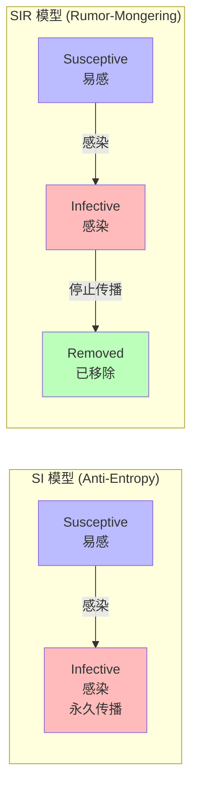

---
title: 分布式算法 Gossip
date: 2021-07-13 09:18:41
categories:
  - 分布式
  - 分布式理论
tags:
  - 分布式
  - 算法
  - Gossip
permalink: /pages/4b266574/
---

# 分布式算法 Gossip

## 简介

Gossip 也叫 Epidemic Protocol （流行病协议），这个协议基于**最终一致性**以及**去中心化**设计思想。主要用于**分布式节点之间进行信息交换和数据同步**，这种场景的一个最大特点就是组成的网络的节点都是对等节点，是非结构化网络（去中心化）。

Gossip 协议最早是在 1987 年发表在 ACM 上的论文 《Epidemic Algorithms for Replicated Database Maintenance》中被提出，其理论基础来源于流行病学的数学模型，这种场景的一个最大特点就是组成的网络的节点都是去中心化的对等节点，在信息同步过程中不能保证某个时刻所有节点都收到消息，但是理论上最终所有节点都会收到消息，实现最终一致性协议。

Gossip 协议是集群中节点相互通信的内部通信技术。 Gossip 是一种高效、轻量级、可靠的节点间广播协议，用于传播数据。它是去中心化的、"流行病"的、容错的和点对点通信协议。

## Gossip 的特性

| 特性 | 说明 |
| :--- | :--- |
| **去中心化** | 不依赖任何中心节点，所有节点对等，任一节点可发起消息传播 |
| **最终一致性** | 不保证某一时刻所有节点数据一致，但最终会收敛到一致状态 |
| **可扩展性** | 节点可动态增减，新节点最终会与其他节点状态一致 |
| **容错性** | 任何节点的宕机或重启都不影响消息传播 |
| **收敛速度快** | 消息以指数级速度传播，传播速度达到 O(log N) |
| **实现简单** | 算法过程简单，代码实现几乎没有太多复杂性 |

## Gossip 的原理

### 核心思想

Gossip 协议的核心思想类似于**病毒传播**或**八卦传播**：一个节点（"感染者"）周期性地随机选择少量邻居节点，将信息传递给它们；收到信息的节点也变为"感染者"，继续向其他节点传播。经过多轮传播，信息最终扩散到整个网络。

### 传播模型

Gossip 协议基于流行病学的两种数学模型：



### 执行流程

```mermaid
sequenceDiagram
    participant S as Seed (种子节点)
    participant A as Node A
    participant B as Node B
    participant C as Node C
    participant D as Node D

    Note over S: 周期 1：种子节点发起传播
    S->>A: 传递消息 (fanout=3)
    S->>B: 传递消息
    S->>C: 传递消息

    Note over A,B,C: 周期 2：被感染节点继续传播
    A->>D: 传递消息
    B->>D: 传递消息 (可能重复)
    C->>D: 传递消息 (可能重复)

    Note over D: 周期 3：所有节点已收到消息
    Note over S,D: 收敛完成，达到最终一致
```

### 收敛分析

在 N 个节点、fanout 为 f 的网络中，消息传播到所有节点所需的轮数约为 `O(log_f(N))`。

| 节点数 N | fanout=3 所需轮数 | fanout=5 所需轮数 |
| :---: | :---: | :---: |
| 10 | ~3 | ~2 |
| 100 | ~5 | ~3 |
| 1,000 | ~7 | ~5 |
| 10,000 | ~9 | ~6 |

### 关键参数

| 参数 | 说明 | 建议值 |
| :--- | :--- | :--- |
| **Fanout（扇出）** | 每轮传播联系的节点数 | 3-5 |
| **周期（Round）** | 传播间隔时间 | 1 秒 |
| **协议类型** | Push / Pull / Push-Pull | Push-Pull（收敛最快） |

## Gossip 的应用场景

在 Cassandra 中，节点间使用 Gossip 协议交换信息，因此所有节点都可以快速了解集群中的所有其他节点。

Consul 使用名为 SERF 的 Gossip 协议有两个作用：

- 发现新节点和宕机的节点
- 可靠且快速的事件广播，用于选举 Leader 等

其他典型应用场景：

- **集群成员管理**：如 Cassandra、Redis Cluster 的节点发现与状态同步
- **故障检测**：Consul、Serf 通过 Gossip 检测节点宕机
- **数据复制**：Cassandra、DynamoDB 使用 Gossip 进行数据副本同步
- **配置分发**：将配置变更传播到集群所有节点
- **区块链网络**：以太坊等区块链使用 Gossip 传播交易和区块

## Gossip 的执行过程

Gossip 协议在概念上非常简单，代码也非常简单。它们背后的基本思想是：一个节点想要与网络中的其他节点共享一些信息。然后周期性地从节点集中随机选择一个节点并交换信息。接收信息的节点做同样的事情。信息定期发送到 N 个目标，N 称为扇出（`Fanout`）。

- **循环**：传播信息的回合数
- **扇出**：一个节点在每个循环中闲聊的节点数。当一个节点想要广播一条消息时，它从系统中随机选择 t 个节点并将消息发送给它们。

**Gossip 协议的执行过程**：

Gossip 过程是由种子节点发起，当一个种子节点有状态需要更新到网络中的其他节点时，它会随机的选择周围几个节点散播消息，收到消息的节点也会重复该过程，直至最终网络中所有的节点都收到了消息。这个过程可能需要一定的时间，由于不能保证某个时刻所有节点都收到消息，但是理论上最终所有节点都会收到消息，因此它是一个最终一致性协议。

**为了表述清楚，我们先做一些前提设定**

- **种子节点**周期性的散播消息，把周期限定为 1 秒
- 被感染节点随机选择 N 个邻接节点（fan-out）散播消息，这里把 fan-out 设置为 3，每次最多往 3 个节点散播。
- 节点只接收消息不反馈结果。
- 每次散播消息都选择**尚未发送过的节点**进行散播
- 收到消息的节点不再往发送节点散播，比如 A -> B，那么 B 进行散播的时候，不再发给 A。

注意：Gossip 过程是异步的，也就是说发消息的节点不会关注对方是否收到，即不等待响应；不管对方有没有收到，它都会每隔 1 秒向周围节点发消息。**异步是它的优点，而消息冗余则是它的缺点**。

Goosip 协议的信息传播和扩散通常需要由种子节点发起。整个传播过程可能需要一定的时间，由于不能保证某个时刻所有节点都收到消息，但是理论上最终所有节点都会收到消息，因此它是一个**最终一致性**协议。


## Gossip 类型

Gossip 有两种类型：

- **Anti-Entropy(反熵)**：以固定的概率传播所有的数据。Anti-Entropy 是 SI model，节点只有两种状态，Suspective 和 Infective，叫做 simple epidemics。
- **Rumor-Mongering(谣言传播)**：仅传播新到达的数据。Rumor-Mongering 是 SIR model，节点有三种状态，Suspective，Infective 和 Removed，叫做 complex epidemics。

熵是物理学上的一个概念，代表杂乱无章，而反熵就是在杂乱无章中寻求一致。本质上，**反熵是一种通过异步修复实现最终一致性的方法**。反熵指的是集群中的节点，每隔段时间就随机选择某个其他节点，然后通过互相交换自己的所有数据来消除两者之间的差异，实现数据的最终一致性。由于消息会不断反复的交换，因此消息数量是非常庞大的，无限制的（unbounded），这对一个系统来说是一个巨大的开销。所以，**反熵不适合动态变化或节点数比较多的分布式环境**。

谣言传播模型指的是当一个节点有了新数据后，这个节点变成活跃状态，并周期性地联系其他节点向其发送新数据，直到所有的节点都存储了该新数据。在谣言传播模型下，消息可以发送得更频繁，因为消息只包含最新 update，体积更小。而且，一个谣言消息在某个时间点之后会被标记为 removed，并且不再被传播，因此，谣言传播模型下，系统有一定的概率会不一致。而由于，谣言传播模型下某个时间点之后消息不再传播，因此消息是有限的，系统开销小。

一般来说，为了在通信代价和可靠性之间取得折中，需要将这两种方法结合使用。

**Gossip 中的通信模式**

在 Gossip 协议下，网络中两个节点之间有三种通信方式:

- **Push** - 节点 A 将数据 (key,value,version) 及对应的版本号推送给 B 节点，B 节点更新 A 中比自己新的数据
- **Pull** - A 仅将数据 key, version 推送给 B，B 将本地比 A 新的数据（Key, value, version）推送给 A，A 更新本地
- **Push/Pull** - 与 Pull 类似，只是多了一步，A 再将本地比 B 新的数据推送给 B，B 则更新本地

如果把两个节点数据同步一次定义为一个周期，则在一个周期内，Push 需通信 1 次，Pull 需 2 次，Push/Pull 则需 3 次。虽然消息数增加了，但从效果上来讲，Push/Pull 最好，理论上一个周期内可以使两个节点完全一致。直观上，Push/Pull 的收敛速度也是最快的。

## Gossip 的特点

### Gossip 的优点

- **扩展性**：网络可以允许节点的任意增加和减少，新增加的节点的状态最终会与其他节点一致。
- **容错**：网络中任何节点的宕机和重启都不会影响 Gossip 消息的传播，Gossip 协议具有天然的分布式系统容错特性。
- **去中心化**：Gossip 协议不要求任何中心节点，所有节点都可以是对等的，任何一个节点无需知道整个网络状况，只要网络是连通的，任意一个节点就可以把消息散播到全网。
- **一致性收敛**：Gossip 协议中的消息会以一传十、十传百一样的指数级速度在网络中快速传播，因此系统状态的不一致可以在很快的时间内收敛到一致。消息传播速度达到了 logN。
- **简单**：Gossip 协议的过程极其简单，实现起来几乎没有太多复杂性。

### Gossip 的缺陷

分布式网络中，没有一种完美的解决方案，Gossip 协议跟其他协议一样，也有一些不可避免的缺陷，主要是两个：

- **消息的延迟**：由于 Gossip 协议中，节点只会随机向少数几个节点发送消息，消息最终是通过多个轮次的散播而到达全网的，因此使用 Gossip 协议会造成不可避免的消息延迟。不适合用在对实时性要求较高的场景下。
- **消息冗余**：Gossip 协议规定，节点会定期随机选择周围节点发送消息，而收到消息的节点也会重复该步骤，因此就不可避免的存在消息重复发送给同一节点的情况，造成了消息的冗余，同时也增加了收到消息的节点的处理压力。而且，由于是定期发送，因此，即使收到了消息的节点还会反复收到重复消息，加重了消息的冗余。

## 最佳实践

### 案例 1：基于 Gossip 的集群成员管理

实现一个简单的 Gossip 集群成员管理服务，用于节点状态同步和故障检测：

```java
import java.net.InetSocketAddress;
import java.util.*;
import java.util.concurrent.*;

/**
 * 基于 Gossip 协议的集群成员管理
 */
public class GossipMemberManager {

    private final String nodeId;
    private final InetSocketAddress address;
    private final Map<String, MemberInfo> members = new ConcurrentHashMap<>();
    private final ScheduledExecutorService scheduler = Executors.newScheduledThreadPool(2);
    private final int fanout = 3;
    private final long gossipIntervalMs = 1000;
    private final long failureTimeoutMs = 5000;

    public GossipMemberManager(String nodeId, InetSocketAddress address, List<InetSocketAddress> seedNodes) {
        this.nodeId = nodeId;
        this.address = address;
        // 初始化本地节点信息
        this.members.put(nodeId, new MemberInfo(nodeId, address, System.currentTimeMillis(), MemberState.ALIVE));
        // 添加种子节点
        for (InetSocketAddress seed : seedNodes) {
            String seedId = seed.toString();
            this.members.put(seedId, new MemberInfo(seedId, seed, System.currentTimeMillis(), MemberState.ALIVE));
        }
    }

    /**
     * 启动 Gossip 协议
     */
    public void start() {
        // 定期 Gossip 传播
        scheduler.scheduleAtFixedRate(this::gossip, 0, gossipIntervalMs, TimeUnit.MILLISECONDS);
        // 定期故障检测
        scheduler.scheduleAtFixedRate(this::detectFailures, gossipIntervalMs, gossipIntervalMs, TimeUnit.MILLISECONDS);
    }

    /**
     * Gossip 传播：随机选择 fanout 个节点，交换成员信息
     */
    private void gossip() {
        List<MemberInfo> aliveMembers = members.values().stream()
                .filter(m -> m.state == MemberState.ALIVE && !m.nodeId.equals(this.nodeId))
                .collect(Collectors.toList());

        Collections.shuffle(aliveMembers);
        List<MemberInfo> targets = aliveMembers.subList(0, Math.min(fanout, aliveMembers.size()));

        for (MemberInfo target : targets) {
            sendGossipMessage(target.address, getLocalState());
        }
    }

    /**
     * 接收 Gossip 消息，合并状态
     */
    public void receiveGossipMessage(List<MemberInfo> remoteMembers) {
        for (MemberInfo remote : remoteMembers) {
            MemberInfo local = members.get(remote.nodeId);
            if (local == null || remote.heartbeat > local.heartbeat) {
                members.put(remote.nodeId, remote);
            }
        }
    }

    /**
     * 发送心跳更新本地节点
     */
    private void updateHeartbeat() {
        MemberInfo local = members.get(nodeId);
        local.heartbeat = System.currentTimeMillis();
    }

    /**
     * 故障检测：心跳超时标记为 DOWN
     */
    private void detectFailures() {
        updateHeartbeat();
        long now = System.currentTimeMillis();
        for (MemberInfo member : members.values()) {
            if (!member.nodeId.equals(this.nodeId) && member.state == MemberState.ALIVE) {
                if (now - member.heartbeat > failureTimeoutMs) {
                    member.state = MemberState.DOWN;
                    log.warn("节点 {} 心跳超时，标记为 DOWN", member.nodeId);
                }
            }
        }
    }

    private List<MemberInfo> getLocalState() {
        return new ArrayList<>(members.values());
    }

    public enum MemberState { ALIVE, DOWN, SUSPECT }

    public static class MemberInfo {
        public String nodeId;
        public InetSocketAddress address;
        public long heartbeat;
        public MemberState state;

        public MemberInfo(String nodeId, InetSocketAddress address, long heartbeat, MemberState state) {
            this.nodeId = nodeId;
            this.address = address;
            this.heartbeat = heartbeat;
            this.state = state;
        }
    }
}
```

### 案例 2：Redis Cluster 的 Gossip 配置

Redis Cluster 使用 Gossip 协议进行集群节点发现和故障检测。以下是生产环境的配置实践：

```properties
# redis.conf - Redis Cluster 配置
# 启用集群模式
cluster-enabled yes
# 集群配置文件名（自动生成）
cluster-config-file nodes-6379.conf
# 节点超时时间（毫秒），影响故障检测速度
cluster-node-timeout 15000
# 集群总线端口（默认为客户端端口 + 10000）
cluster-announce-port 6379
cluster-announce-bus-port 16379
# 故障迁移相关配置
cluster-require-full-coverage no
cluster-migration-barrier 1
# 开启 AOF 持久化
appendonly yes
appendfsync everysec
# 当副本与主节点断开连接超过此时间，副本拒绝服务
repl-diskless-sync yes
```

使用 redis-cli 管理集群：

```bash
# 创建集群（3 主 3 从）
redis-cli --cluster create \
  192.168.1.101:6379 192.168.1.102:6379 192.168.1.103:6379 \
  192.168.1.104:6379 192.168.1.105:6379 192.168.1.106:6379 \
  --cluster-replicas 1

# 查看集群节点信息
redis-cli -c cluster nodes

# 查看集群状态
redis-cli -c cluster info
```

### 案例 3：Consul 的 Gossip 配置

Consul 使用两套 Gossip 协议（LAN 和 WAN）：

```hcl
# consul.hcl - Consul Agent 配置
datacenter = "dc1"
data_dir = "/opt/consul"
server = true
bootstrap_expect = 3

# LAN Gossip 配置（数据中心内）
bind_addr = "192.168.1.10"
client_addr = "0.0.0.0"

# Gossip 加密（LAN）
encrypt = "cg8StVXbQJ0gPvMd9o7yrg=="

# WAN Gossip 配置（跨数据中心）
retry_join_wan = ["192.168.2.10", "192.168.3.10"]

# 性能调优
raft_protocol = 3
performance {
  raft_multiplier = 1
}

# 故障检测参数
acl = {
  enabled = true
  default_policy = "deny"
}
```

## 常见问题

### 问题 1：Gossip 消息冗余导致带宽消耗过大

**问题描述**：在 1000+ 节点的大规模集群中，Gossip 协议产生的消息冗余导致网络带宽被大量占用，影响了正常业务流量。

**原因分析**：
1. Fanout 设置过大，每轮传播联系过多节点
2. Gossip 周期过短，消息发送过于频繁
3. Anti-Entropy 模式下持续传播全量数据
4. 消息体过大，包含不必要的信息

**解决方案**：

```java
import java.util.*;
import java.util.concurrent.*;

/**
 * 优化的 Gossip 实现：消息压缩、增量同步、动态 fanout
 */
public class OptimizedGossipService {

    // 动态调整 fanout：根据集群规模和负载自适应
    private int dynamicFanout(int clusterSize, double networkLoad) {
        // 基础 fanout
        int baseFanout = 3;
        // 网络负载高时降低 fanout
        if (networkLoad > 0.7) {
            return Math.max(1, baseFanout - 1);
        }
        // 大集群时适当增加 fanout
        if (clusterSize > 500) {
            return baseFanout + 1;
        }
        return baseFanout;
    }

    // 增量同步：只传播变更的摘要
    public GossipDigest calculateDigest(Map<String, MemberInfo> members) {
        GossipDigest digest = new GossipDigest();
        for (MemberInfo member : members.values()) {
            // 只包含 nodeId 和 heartbeat 版本号，不包含完整数据
            digest.add(member.nodeId, member.heartbeat);
        }
        return digest;
    }

    // 基于摘要的差异同步
    public List<MemberInfo> diffSync(GossipDigest remoteDigest, Map<String, MemberInfo> localMembers) {
        List<MemberInfo> toSend = new ArrayList<>();
        for (MemberInfo local : localMembers.values()) {
            Long remoteHeartbeat = remoteDigest.get(local.nodeId);
            // 本地比远程新，需要发送
            if (remoteHeartbeat == null || local.heartbeat > remoteHeartbeat) {
                toSend.add(local);
            }
        }
        return toSend;
    }

    // 消息合并：将多个小消息合并为一个批次
    public byte[] compressMessages(List<MemberInfo> messages) {
        // 使用 Protobuf 序列化 + GZIP 压缩
        GossipMessageBatch batch = GossipMessageBatch.newBuilder()
                .addAllMembers(messages.stream()
                        .map(this::toProtoMember)
                        .collect(Collectors.toList()))
                .build();
        return compress(batch.toByteArray());
    }

    private byte[] compress(byte[] data) {
        // GZIP 压缩实现
        java.io.ByteArrayOutputStream bos = new java.io.ByteArrayOutputStream();
        try (java.util.zip.GZIPOutputStream gzip = new java.util.zip.GZIPOutputStream(bos)) {
            gzip.write(data);
        } catch (java.io.IOException e) {
            throw new RuntimeException("压缩失败", e);
        }
        return bos.toByteArray();
    }
}
```

### 问题 2：Gossip 协议在节点频繁加入退出时收敛慢

**问题描述**：在动态环境下（如容器化部署，节点频繁创建销毁），Gossip 协议收敛速度变慢，集群状态长时间不一致。

**原因分析**：
1. 节点频繁加入退出，每次变化都需要重新收敛
2. DOWN 节点信息未及时清理，占用带宽
3. Gossip 消息中包含过多过期节点信息

**解决方案**：

```java
import java.util.*;
import java.util.concurrent.*;

public class DynamicClusterGossip {

    private final Map<String, MemberInfo> members = new ConcurrentHashMap<>();
    private final long quarantinePeriodMs = 30000; // 隔离期 30 秒
    private final long removalPeriodMs = 300000;   // 移除期 5 分钟

    /**
     * 处理节点状态变更
     */
    public void handleMemberChange(MemberInfo member) {
        String nodeId = member.nodeId;
        MemberState oldState = Optional.ofNullable(members.get(nodeId))
                .map(m -> m.state)
                .orElse(null);

        if (member.state == MemberState.DOWN) {
            // 节点宕机：进入隔离期，不立即移除
            member.downTimestamp = System.currentTimeMillis();
            members.put(nodeId, member);
            log.info("节点 {} 进入隔离期", nodeId);
        } else if (member.state == MemberState.ALIVE) {
            // 节点恢复：清除隔离状态
            members.put(nodeId, member);
            log.info("节点 {} 恢复", nodeId);
        }
    }

    /**
     * 定期清理过期节点
     */
    public void cleanupStaleMembers() {
        long now = System.currentTimeMillis();
        Iterator<Map.Entry<String, MemberInfo>> it = members.entrySet().iterator();
        while (it.hasNext()) {
            Map.Entry<String, MemberInfo> entry = it.next();
            MemberInfo member = entry.getValue();
            if (member.state == MemberState.DOWN) {
                long downDuration = now - member.downTimestamp;
                if (downDuration > removalPeriodMs) {
                    it.remove();
                    log.info("节点 {} 已超过移除期，从成员列表移除", member.nodeId);
                }
            }
        }
    }

    /**
     * 构造 Gossip 消息时过滤隔离期节点
     */
    public List<MemberInfo> buildGossipMessage() {
        long now = System.currentTimeMillis();
        List<MemberInfo> message = new ArrayList<>();
        for (MemberInfo member : members.values()) {
            if (member.state == MemberState.ALIVE) {
                message.add(member);
            } else if (member.state == MemberState.DOWN) {
                // 隔离期内仍然传播 DOWN 消息，但不传播其详细数据
                if (now - member.downTimestamp < quarantinePeriodMs) {
                    message.add(MemberInfo.downSummary(member.nodeId));
                }
            }
        }
        return message;
    }
}
```

### 问题 3：Gossip 在低带宽网络中消息风暴

**问题描述**：在跨地域的低带宽网络中，Gossip 协议产生大量小消息，导致网络拥塞，消息延迟严重。

**原因分析**：
1. 每轮 Gossip 都发送完整的成员状态
2. 消息未进行批量和压缩
3. 跨地域网络的 Gossip 频率与局域网相同

**解决方案**：

```java
/**
 * 针对低带宽网络的 Gossip 优化
 */
public class LowBandwidthGossip {

    // 根据网络环境调整参数
    private GossipConfig getConfig(NetworkType networkType) {
        switch (networkType) {
            case LAN:
                return new GossipConfig(1000, 3, 5000); // 1秒周期, fanout=3, 超时5秒
            case WAN:
                return new GossipConfig(5000, 2, 30000); // 5秒周期, fanout=2, 超时30秒
            case LOW_BANDWIDTH:
                return new GossipConfig(10000, 1, 60000); // 10秒周期, fanout=1, 超时60秒
            default:
                return new GossipConfig(1000, 3, 5000);
        }
    }

    // 批量发送 + 压缩
    public void sendBatchedGossip(List<MemberInfo> changes, InetSocketAddress target) {
        if (changes.isEmpty()) {
            return;
        }
        // 按大小分批，每批不超过 4KB
        List<List<MemberInfo>> batches = partitionBySize(changes, 4 * 1024);
        for (List<MemberInfo> batch : batches) {
            byte[] data = serializeAndCompress(batch);
            sendOverUdp(target, data);
        }
    }

    private List<List<MemberInfo>> partitionBySize(List<MemberInfo> changes, int maxSizeBytes) {
        List<List<MemberInfo>> batches = new ArrayList<>();
        List<MemberInfo> currentBatch = new ArrayList<>();
        int currentSize = 0;
        for (MemberInfo info : changes) {
            int infoSize = estimateSize(info);
            if (currentSize + infoSize > maxSizeBytes && !currentBatch.isEmpty()) {
                batches.add(currentBatch);
                currentBatch = new ArrayList<>();
                currentSize = 0;
            }
            currentBatch.add(info);
            currentSize += infoSize;
        }
        if (!currentBatch.isEmpty()) {
            batches.add(currentBatch);
        }
        return batches;
    }

    public enum NetworkType { LAN, WAN, LOW_BANDWIDTH }

    public static class GossipConfig {
        public final long intervalMs;
        public final int fanout;
        public final long timeoutMs;
        public GossipConfig(long intervalMs, int fanout, long timeoutMs) {
            this.intervalMs = intervalMs;
            this.fanout = fanout;
            this.timeoutMs = timeoutMs;
        }
    }
}
```

## 参考资料

- [Epidemic Algorithms for Replicated Database Maintenance](http://bitsavers.trailing-edge.com/pdf/xerox/parc/techReports/CSL-89-1_Epidemic_Algorithms_for_Replicated_Database_Maintenance.pdf)
- [P2P 网络核心技术：Gossip 协议](https://zhuanlan.zhihu.com/p/41228196)
- [INTRODUCTION TO GOSSIP](https://managementfromscratch.wordpress.com/2016/04/01/introduction-to-gossip/)
- [Goosip 协议仿真动画](https://flopezluis.github.io/gossip-simulator/)
