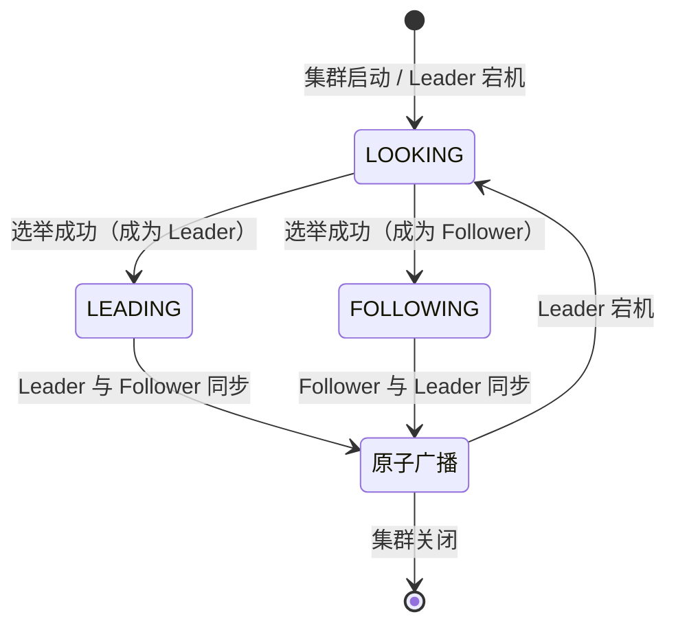
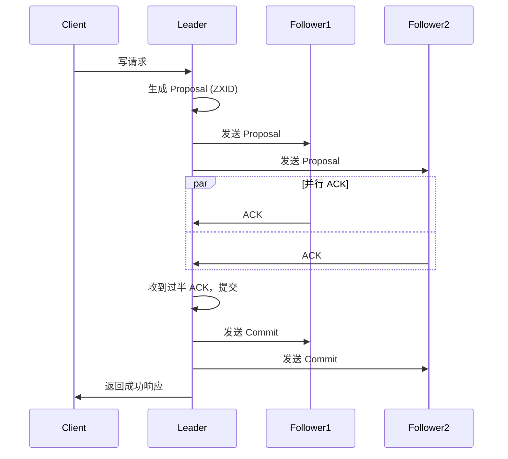

---
title: ZAB 协议
date: 2024-04-28 16:41:07
categories:
  - 分布式
  - 分布式理论
tags:
  - 分布式
  - 算法
  - 共识
  - ZAB
permalink: /pages/6f4382d3/
---

# ZAB 协议

> ZooKeeper 并没有直接采用 Paxos 算法，而是采用了名为 ZAB 的一致性协议。**_ZAB 协议不是 Paxos 算法_**，只是比较类似，二者在操作上并不相同。Multi-Paxos 实现的是一系列值的共识，不关心最终达成共识的值是什么，不关心各值的顺序。而 ZooKeeper 需要确保操作的顺序性。
>
> ZAB 协议是 Zookeeper 专门设计的一种**支持故障恢复的原子广播协议**。
>
> ZAB 协议是 ZooKeeper 的数据一致性和高可用解决方案。

## 简介

ZAB（ZooKeeper Atomic Broadcast）协议是 Yahoo 公司为 Apache ZooKeeper 专门设计的一种**支持故障恢复的原子广播协议**。它解决了分布式系统中的两个核心问题：

1. **数据一致性**：保证所有节点的数据副本最终一致，且操作按照顺序应用。
2. **高可用性**：在 Leader 节点故障时，能够快速选举出新的 Leader，恢复服务。

ZAB 协议与 Paxos 算法类似，但并非 Paxos 的简单实现。Paxos 关注的是单个值的共识，而 ZAB 关注的是一系列操作的顺序广播。ZAB 协议的核心思想是**"一切以领导者为准"**，通过强领导者模型和严格的顺序提交日志来保证操作的顺序性。

ZAB 协议定义了两个可以**无限循环**的流程：

- **`选举 Leader`** - 用于故障恢复，从而保证高可用。
- **`原子广播`** - 用于主从同步，从而保证数据一致性。

ZAB 协议的工作流程如下：



## 特性

ZAB 协议具有以下核心特性：

| 特性 | 说明 |
| --- | --- |
| **原子广播** | 所有写请求通过 Leader 原子广播给 Follower，保证所有节点的数据一致 |
| **顺序一致性** | 保证操作的全局顺序性，先发起的写操作先应用 |
| **主备模式** | 采用一主多从架构，Leader 处理所有写请求 |
| **快速故障恢复** | Leader 故障后，通过快速选举在秒级内恢复服务 |
| **过半机制** | 只需半数以上节点存活即可正常工作 |
| **ZXID 单调递增** | 使用 64 位 ZXID 标识事务，保证全局有序 |

### ZXID 结构

ZXID 是 ZAB 协议的核心概念，用于标识每个事务：

```
ZXID (64位)
┌─────────────────┬─────────────────┐
│   epoch (32位)   │ counter (32位)   │
└─────────────────┴─────────────────┘
```

- **epoch**：Leader 的纪元，每次选举新 Leader 时递增，用于区分不同的 Leader 周期
- **counter**：当前 epoch 内的事务序号，每次事务递增，epoch 变化时重置

这种设计保证了 ZXID 的全局单调递增性，从而保证了事务的顺序性。

### ZAB 与 Paxos、Raft 对比

| 对比维度 | ZAB | Multi-Paxos | Raft |
| --- | --- | --- | --- |
| **设计目标** | 主备同步、顺序广播 | 通用共识 | 易理解的共识 |
| **Leader 模型** | 强 Leader | 弱 Leader | 强 Leader |
| **日志顺序** | 严格保证 | 不保证 | 严格保证 |
| **选举方式** | 快速选举（基于 ZXID 和 myid） | Basic Paxos | 随机超时 |
| **同步方式** | 原子广播 | 两阶段提交 | AppendEntries |
| **典型实现** | ZooKeeper | Chubby | etcd、Consul |

## 选举 Leader

### 故障恢复

ZooKeeper 集群采用一主（称为 Leader）多从（称为 Follower）模式，主从节点通过副本机制保证数据一致。

- **如果 Follower 节点挂了** - ZooKeeper 集群中的每个节点都会单独在内存中维护自身的状态，并且各节点之间都保持着通讯，**只要集群中有半数机器能够正常工作，那么整个集群就可以正常提供服务**。
- **如果 Leader 节点挂了** - 如果 Leader 节点挂了，系统就不能正常工作了。此时，需要通过 ZAB 协议的选举 Leader 机制来进行故障恢复。

ZAB 协议的选举 Leader 机制简单来说，就是：基于过半选举机制产生新的 Leader，之后其他机器将从新的 Leader 上同步状态，当有过半机器完成状态同步后，就退出选举 Leader 模式，进入原子广播模式。

### 术语

- **myid** - 每个 Zookeeper 服务器，都需要在数据文件夹下创建一个名为 myid 的文件，该文件包含整个 Zookeeper 集群唯一的 ID（整数）。
- **zxid** - 类似于 RDBMS 中的事务 ID，用于标识一次更新操作的 Proposal ID。为了保证顺序性，该 zxid 必须单调递增。因此 Zookeeper 使用一个 64 位的数来表示，高 32 位是 Leader 的 epoch，从 1 开始，每次选出新的 Leader，epoch 加一。低 32 位为该 epoch 内的序号，每次 epoch 变化，都将低 32 位的序号重置。这样保证了 zxid 的全局递增性。

### 服务器状态

- **_LOOKING_** - 不确定 Leader 状态。该状态下的服务器认为当前集群中没有 Leader，会发起 Leader 选举
- **_FOLLOWING_** - 跟随者状态。表明当前服务器角色是 Follower，并且它知道 Leader 是谁
- **_LEADING_** - 领导者状态。表明当前服务器角色是 Leader，它会维护与 Follower 间的心跳
- **_OBSERVING_** - 观察者状态。表明当前服务器角色是 Observer，与 Folower 唯一的不同在于不参与选举，也不参与集群写操作时的投票

### 选票数据结构

每个服务器在进行领导选举时，会发送如下关键信息

- **_logicClock_** - 每个服务器会维护一个自增的整数，名为 logicClock，它表示这是该服务器发起的第多少轮投票
- **_state_** - 当前服务器的状态
- **_self_id_** - 当前服务器的 myid
- **_self_zxid_** - 当前服务器上所保存的数据的最大 zxid
- **_vote_id_** - 被推举的服务器的 myid
- **_vote_zxid_** - 被推举的服务器上所保存的数据的最大 zxid

### 投票流程

（1）**自增选举轮次** - Zookeeper 规定所有有效的投票都必须在同一轮次中。每个服务器在开始新一轮投票时，会先对自己维护的 logicClock 进行自增操作。

（2）**初始化选票** - 每个服务器在广播自己的选票前，会将自己的投票箱清空。该投票箱记录了所收到的选票。例：服务器 2 投票给服务器 3，服务器 3 投票给服务器 1，则服务器 1 的投票箱为(2, 3), (3, 1), (1, 1)。票箱中只会记录每一投票者的最后一票，如投票者更新自己的选票，则其它服务器收到该新选票后会在自己票箱中更新该服务器的选票。

（3）**发送初始化选票** - 每个服务器最开始都是通过广播把票投给自己。

（4）**接收外部投票** - 服务器会尝试从其它服务器获取投票，并记入自己的投票箱内。如果无法获取任何外部投票，则会确认自己是否与集群中其它服务器保持着有效连接。如果是，则再次发送自己的投票；如果否，则马上与之建立连接。

（5）**判断选举轮次** - 收到外部投票后，首先会根据投票信息中所包含的 logicClock 来进行不同处理

- 外部投票的 logicClock 大于自己的 logicClock。说明该服务器的选举轮次落后于其它服务器的选举轮次，立即清空自己的投票箱并将自己的 logicClock 更新为收到的 logicClock，然后再对比自己之前的投票与收到的投票以确定是否需要变更自己的投票，最终再次将自己的投票广播出去。
- 外部投票的 logicClock 小于自己的 logicClock。当前服务器直接忽略该投票，继续处理下一个投票。
- 外部投票的 logickClock 与自己的相等。当时进行选票 PK。

（6）**选票 PK** - 选票 PK 是基于`(self_id, self_zxid)` 与 `(vote_id, vote_zxid)` 的对比

- 外部投票的 logicClock 大于自己的 logicClock，则将自己的 logicClock 及自己的选票的 logicClock 变更为收到的 logicClock
- 若 logicClock 一致，则对比二者的 vote_zxid，若外部投票的 vote_zxid 比较大，则将自己的票中的 vote_zxid 与 vote_myid 更新为收到的票中的 vote_zxid 与 vote_myid 并广播出去，另外将收到的票及自己更新后的票放入自己的票箱。如果票箱内已存在(self_myid, self_zxid)相同的选票，则直接覆盖
- 若二者 vote_zxid 一致，则比较二者的 vote_myid，若外部投票的 vote_myid 比较大，则将自己的票中的 vote_myid 更新为收到的票中的 vote_myid 并广播出去，另外将收到的票及自己更新后的票放入自己的票箱

（7）**统计选票** - 如果已经确定有过半服务器认可了自己的投票（可能是更新后的投票），则终止投票。否则继续接收其它服务器的投票。

（8）**更新服务器状态** - 投票终止后，服务器开始更新自身状态。若过半的票投给了自己，则将自己的服务器状态更新为 LEADING，否则将自己的状态更新为 FOLLOWING

通过以上流程分析，我们不难看出：要使 Leader 获得多数 Server 的支持，则 **ZooKeeper 集群节点数必须是奇数。且存活的节点数目不得少于 `N + 1`** 。

每个 Server 启动后都会重复以上流程。在恢复模式下，如果是刚从崩溃状态恢复的或者刚启动的 server 还会从磁盘快照中恢复数据和会话信息，zk 会记录事务日志并定期进行快照，方便在恢复时进行状态恢复。

## 原子广播（Atomic Broadcast）

**ZooKeeper 通过副本机制来实现高可用**。

那么，ZooKeeper 是如何实现副本机制的呢？答案是：ZAB 协议的原子广播。


ZAB 协议的原子广播要求：

**_所有的写请求都会被转发给 Leader，Leader 会以原子广播的方式通知 Follow。当半数以上的 Follow 已经更新状态持久化后，Leader 才会提交这个更新，然后客户端才会收到一个更新成功的响应_**。这有些类似数据库中的两阶段提交协议。

在整个消息的广播过程中，Leader 服务器会每个事务请求生成对应的 Proposal，并为其分配一个全局唯一的递增的事务 ID(ZXID)，之后再对其进行广播。

> ZAB 是通过“一切以领导者为准”的强领导者模型和严格按照顺序提交日志，来实现操作的顺序性的，这一点和 Raft 是一样的。

### 原子广播流程

ZAB 的原子广播类似两阶段提交，其流程如下：



ZAB 原子广播的关键点：

1. **Leader 生成 Proposal**：Leader 为每个写请求生成唯一的 Proposal，并分配全局递增的 ZXID
2. **Follower 写入日志**：Follower 收到 Proposal 后，先写入本地事务日志，再回复 ACK
3. **Leader 提交**：Leader 收到过半 Follower 的 ACK 后，提交事务
4. **通知提交**：Leader 向所有 Follower 发送 Commit 消息，Follower 应用到内存数据

### ZAB 的两种模式

ZAB 协议运行时处于两种模式之一：

- **恢复模式（Recovery）**：集群启动或 Leader 崩溃后进入此模式，进行 Leader 选举和数据同步
- **广播模式（Broadcast）**：Leader 选举完成且数据同步完成后进入此模式，正常处理客户端请求

## 应用场景

ZAB 协议作为 ZooKeeper 的核心一致性协议，其应用场景与 ZooKeeper 高度一致：

### 1. 分布式协调服务

ZooKeeper 是最经典的分布式协调服务，广泛应用于：

- **Hadoop**：NameNode 的高可用切换、ResourceManager 的主备选举
- **HBase**：Master 选举、RegionServer 注册和心跳
- **Kafka (旧版)**：Broker 注册、Topic 配置管理、消费者组协调（2.8+ 引入 KRaft 逐步替代）
- **Flink**：JobManager 的主备选举

### 2. 分布式锁

利用 ZooKeeper 的临时节点和顺序节点实现分布式锁：

- **独占锁**：通过创建临时节点实现
- **共享锁**：通过顺序节点实现读写锁
- **公平锁**：通过顺序节点实现公平排队

### 3. 配置管理

利用 ZooKeeper 的 Watcher 机制实现分布式配置的动态更新：

- **Dubbo**：注册中心实现服务注册与发现
- **Solr**：SolrCloud 使用 ZooKeeper 管理集群配置
- **Apollo**：配置中心部分场景使用 ZooKeeper

### 4. Leader 选举

在主备架构的系统中，使用 ZooKeeper 实现 Leader 选举：

- **数据库主备切换**：MySQL、PostgreSQL 的主备切换
- **服务主备切换**：各类 Master 节点的高可用

### 5. 命名服务

利用 ZooKeeper 的顺序节点生成全局唯一 ID：

- **分布式 ID 生成**：替代数据库自增 ID
- **资源命名**：分布式任务分配

## 最佳实践

### 案例 1：基于 ZooKeeper 实现分布式锁

以下示例展示如何使用 ZooKeeper（ZAB 协议）实现可重入的分布式锁：

```java
import org.apache.zookeeper.*;
import org.apache.zookeeper.data.Stat;

import java.io.IOException;
import java.util.Collections;
import java.util.List;
import java.util.concurrent.CountDownLatch;
import java.util.concurrent.TimeUnit;

/**
 * 基于 ZooKeeper 实现的公平分布式锁
 * 利用临时顺序节点实现锁的公平获取和释放
 */
public class ZkDistributedLock implements Watcher {

    private final ZooKeeper zk;
    private final String lockPath;
    private String currentNodePath;
    private String watchNodePath;
    private final CountDownLatch connectedLatch = new CountDownLatch(1);

    /**
     * 初始化分布式锁
     *
     * @param zkServers ZooKeeper 集群地址
     * @param lockPath  锁的根路径，如 /locks/order-lock
     */
    public ZkDistributedLock(String zkServers, String lockPath)
            throws IOException, InterruptedException, KeeperException {
        this.lockPath = lockPath;
        this.zk = new ZooKeeper(zkServers, 30000, this);
        connectedLatch.await();

        // 确保锁的根节点存在
        Stat stat = zk.exists(lockPath, false);
        if (stat == null) {
            zk.create(lockPath, new byte[0],
                ZooDefs.Ids.OPEN_ACL_UNSAFE, CreateMode.PERSISTENT);
        }
    }

    /**
     * 获取锁（阻塞）
     */
    public boolean lock() throws KeeperException, InterruptedException {
        // 1. 创建临时顺序节点
        currentNodePath = zk.create(
            lockPath + "/lock-",
            Thread.currentThread().getName().getBytes(),
            ZooDefs.Ids.OPEN_ACL_UNSAFE,
            CreateMode.EPHEMERAL_SEQUENTIAL
        );
        System.out.println("[" + Thread.currentThread().getName()
            + "] 创建锁节点: " + currentNodePath);

        // 2. 尝试获取锁
        return tryLock();
    }

    /**
     * 尝试获取锁
     */
    private boolean tryLock() throws KeeperException, InterruptedException {
        // 获取所有子节点并排序
        List<String> children = zk.getChildren(lockPath, false);
        Collections.sort(children);

        // 当前节点是否是序号最小的
        String currentNodeSeq = currentNodePath.substring(lockPath.length() + 1);
        int currentIndex = children.indexOf(currentNodeSeq);

        if (currentIndex == 0) {
            // 是第一个节点，获取锁成功
            System.out.println("[" + Thread.currentThread().getName()
                + "] 获取锁成功");
            return true;
        }

        // 不是第一个节点，监听前一个节点
        String watchNodeSeq = children.get(currentIndex - 1);
        watchNodePath = lockPath + "/" + watchNodeSeq;

        // 使用 Watcher 监听前一个节点的删除事件
        CountDownLatch waitLatch = new CountDownLatch(1);
        Stat stat = zk.exists(watchNodePath, event -> {
            if (event.getType() == Event.EventType.NodeDeleted) {
                waitLatch.countDown();
            }
        });

        if (stat == null) {
            // 前一个节点已删除，重新尝试
            return tryLock();
        }

        System.out.println("[" + Thread.currentThread().getName()
            + "] 等待锁，监听节点: " + watchNodePath);
        // 阻塞等待前一个节点释放
        waitLatch.await();
        System.out.println("[" + Thread.currentThread().getName()
            + "] 获取锁成功");
        return true;
    }

    /**
     * 释放锁
     */
    public void unlock() throws KeeperException, InterruptedException {
        if (currentNodePath != null) {
            zk.delete(currentNodePath, -1);
            System.out.println("[" + Thread.currentThread().getName()
                + "] 释放锁: " + currentNodePath);
            currentNodePath = null;
        }
    }

    /**
     * 使用锁执行操作
     */
    public void executeWithLock(Runnable task) throws Exception {
        try {
            lock();
            task.run();
        } finally {
            unlock();
        }
    }

    @Override
    public void process(WatchedEvent event) {
        if (event.getState() == Event.KeeperState.SyncConnected) {
            connectedLatch.countDown();
        }
    }

    public void close() throws InterruptedException {
        zk.close();
    }

    public static void main(String[] args) throws Exception {
        String zkServers = "zookeeper-node1:2181,zookeeper-node2:2181,zookeeper-node3:2181";

        // 模拟多个客户端竞争锁
        for (int i = 0; i < 3; i++) {
            final int clientId = i;
            new Thread(() -> {
                try {
                    ZkDistributedLock lock = new ZkDistributedLock(
                        zkServers, "/locks/order-123");
                    lock.executeWithLock(() -> {
                        System.out.println("[Client-" + clientId
                            + "] 执行临界区操作...");
                        try {
                            TimeUnit.SECONDS.sleep(2);
                        } catch (InterruptedException e) {
                            Thread.currentThread().interrupt();
                        }
                    });
                    lock.close();
                } catch (Exception e) {
                    e.printStackTrace();
                }
            }, "Client-" + i).start();
        }
    }
}
```

Maven 依赖：

```xml
<dependencies>
    <dependency>
        <groupId>org.apache.zookeeper</groupId>
        <artifactId>zookeeper</artifactId>
        <version>3.8.1</version>
    </dependency>
</dependencies>
```

### 案例 2：ZooKeeper 集群部署与配置

以下是一个生产级 ZooKeeper 集群的完整配置示例：

```properties
# zoo.cfg - 生产环境配置

# 基本时间单元（毫秒），用于心跳和超时
tickTime=2000

# Leader 与 Follower 初始连接时的超时时间（tickTime 的倍数）
initLimit=10

# Leader 与 Follower 同步时的超时时间（tickTime 的倍数）
syncLimit=5

# 数据存储目录
dataDir=/data/zookeeper/data

# 事务日志目录（建议与数据目录分开，使用独立磁盘）
dataLogDir=/data/zookeeper/logs

# 客户端连接端口
clientPort=2181

# 最大客户端连接数
maxClientCnxns=200

# 集群节点配置
# server.<myid>=<host>:<quorum-port>:<election-port>
server.1=zookeeper-node1:2888:3888
server.2=zookeeper-node2:2888:3888
server.3=zookeeper-node3:2888:3888
server.4=zookeeper-node4:2888:3888
server.5=zookeeper-node5:2888:3888

# 自动清理事务日志和快照
autopurge.snapRetainCount=5
autopurge.purgeInterval=1

# 快照大小阈值（字节），超过后触发快照
# 默认为 1GB
snapCount=1000000

# 全局唯一会话 ID
# (可选) 集群中所有节点使用相同配置
# 4lw.commands.whitelist=stat,ruok,conf,isro,srvr,mntr

# 监控 Prometheus 指标
metricsProvider.className=org.apache.zookeeper.metrics.prometheus.PrometheusMetricsProvider
metricsProvider.httpPort=7000
metricsProvider.exportJvmInfo=true

# 审计日志
audit.enable=true
```

Kubernetes 部署配置：

```yaml
# zookeeper-statefulset.yaml
apiVersion: apps/v1
kind: StatefulSet
metadata:
  name: zookeeper
  namespace: middleware
spec:
  serviceName: zookeeper-headless
  replicas: 3
  selector:
    matchLabels:
      app: zookeeper
  template:
    metadata:
      labels:
        app: zookeeper
    spec:
      containers:
        - name: zookeeper
          image: zookeeper:3.8.1
          ports:
            - containerPort: 2181
              name: client
            - containerPort: 2888
              name: quorum
            - containerPort: 3888
              name: election
          env:
            - name: ZOO_MY_ID
              valueFrom:
                fieldRef:
                  fieldPath: metadata.name
            - name: ZOO_SERVERS
              value: "server.1=zookeeper-0.zookeeper-headless:2888:3888;server.2=zookeeper-1.zookeeper-headless:2888:3888;server.3=zookeeper-2.zookeeper-headless:2888:3888"
          volumeMounts:
            - name: data
              mountPath: /data
            - name: logs
              mountPath: /datalog
          resources:
            requests:
              memory: "1Gi"
              cpu: "500m"
            limits:
              memory: "2Gi"
              cpu: "1000m"
          livenessProbe:
            exec:
              command: ["sh", "-c", "echo ruok | nc localhost 2181 | grep imok"]
            initialDelaySeconds: 30
            periodSeconds: 10
          readinessProbe:
            exec:
              command: ["sh", "-c", "echo ruok | nc localhost 2181 | grep imok"]
            initialDelaySeconds: 10
            periodSeconds: 5
  volumeClaimTemplates:
    - metadata:
        name: data
      spec:
        accessModes: ["ReadWriteOnce"]
        storageClassName: fast-ssd
        resources:
          requests:
            storage: 20Gi
    - metadata:
        name: logs
      spec:
        accessModes: ["ReadWriteOnce"]
        storageClassName: fast-ssd
        resources:
          requests:
            storage: 10Gi

---
apiVersion: v1
kind: Service
metadata:
  name: zookeeper-headless
  namespace: middleware
spec:
  clusterIP: None
  selector:
    app: zookeeper
  ports:
    - port: 2181
      name: client
    - port: 2888
      name: quorum
    - port: 3888
      name: election
```

### 案例 3：使用 Curator 实现 Leader 选举

```java
import org.apache.curator.framework.CuratorFramework;
import org.apache.curator.framework.CuratorFrameworkFactory;
import org.apache.curator.framework.recipes.leader.*;
import org.apache.curator.retry.ExponentialBackoffRetry;

import java.util.concurrent.CountDownLatch;
import java.util.concurrent.TimeUnit;

/**
 * 基于 Curator 的 Leader 选举实现
 * 利用 ZAB 协议保证选举的一致性
 */
public class ZkLeaderElection {

    private static final String ZK_CONNECT_STRING =
        "zookeeper-node1:2181,zookeeper-node2:2181,zookeeper-node3:2181";
    private static final String ELECTION_PATH = "/leader-election/master";

    public static void main(String[] args) throws Exception {
        int participantCount = 3;
        CountDownLatch latch = new CountDownLatch(participantCount);

        for (int i = 0; i < participantCount; i++) {
            final String participantId = "participant-" + i;

            CuratorFramework client = CuratorFrameworkFactory.builder()
                .connectString(ZK_CONNECT_STRING)
                .sessionTimeoutMs(5000)
                .connectionTimeoutMs(3000)
                .retryPolicy(new ExponentialBackoffRetry(1000, 3))
                .build();
            client.start();

            LeaderSelectorListener listener = new LeaderSelectorListenerAdapter() {
                @Override
                public void takeLeadership(CuratorFramework client) throws Exception {
                    System.out.println("[" + participantId + "] 我成为了 Leader！");

                    // Leader 执行业务逻辑
                    try {
                        // 模拟 Leader 工作
                        for (int j = 0; j < 10; j++) {
                            System.out.println("[" + participantId
                                + "] 执行 Leader 任务 #" + j);
                            TimeUnit.SECONDS.sleep(2);
                        }
                    } finally {
                        System.out.println("[" + participantId + "] 释放 Leader 身份");
                    }
                }
            };

            LeaderSelector selector = new LeaderSelector(client, ELECTION_PATH, listener);
            selector.autoRequeue(); // 失去 Leadership 后自动重新排队
            selector.start();

            System.out.println("[" + participantId + "] 已加入选举");
        }

        latch.await(60, TimeUnit.SECONDS);
    }
}
```

Curator Leader 选举的 Maven 依赖：

```xml
<dependencies>
    <dependency>
        <groupId>org.apache.curator</groupId>
        <artifactId>curator-framework</artifactId>
        <version>5.5.0</version>
    </dependency>
    <dependency>
        <groupId>org.apache.curator</groupId>
        <artifactId>curator-recipes</artifactId>
        <version>5.5.0</version>
    </dependency>
</dependencies>
```

## 常见问题

### 问题 1：ZooKeeper 集群节点数为偶数

**问题描述**：将 ZooKeeper 集群部署为 4 个节点（偶数），期望提高容错能力，但实际上 4 节点的容错能力和 3 节点一样。

**原因分析**：

ZooKeeper 使用过半机制（Quorum），N 个节点的集群需要 `N/2 + 1` 个节点存活才能正常工作：

| 节点数 | 多数派 | 容忍故障数 |
| --- | --- | --- |
| 3 | 2 | 1 |
| 4 | 3 | 1 |
| 5 | 3 | 2 |
| 6 | 4 | 2 |
| 7 | 4 | 3 |

可以看到，4 节点的容忍故障数和 3 节点一样（都是 1），6 节点和 5 节点一样（都是 2）。因此偶数节点不能提高容错能力，反而增加了写入成本。

**解决方案**：ZooKeeper 集群节点数应该配置为**奇数**。

```java
/**
 * ZooKeeper 集群节点数规划工具
 */
public class ZkClusterPlanner {

    /**
     * 计算不同节点数的容错能力
     */
    public static void analyzeClusterSize(int nodeCount) {
        int majority = nodeCount / 2 + 1;
        int faultTolerance = nodeCount - majority;

        System.out.println("节点数: " + nodeCount);
        System.out.println("  多数派: " + majority);
        System.out.println("  容忍故障数: " + faultTolerance);
        System.out.println("  写入性能: " + nodeCount + " 个节点确认 (较低)");

        if (nodeCount % 2 == 0) {
            System.out.println("  警告: 偶数节点不能提高容错能力，建议使用 "
                + (nodeCount - 1) + " 或 " + (nodeCount + 1) + " 个节点");
        }
    }

    public static void main(String[] args) {
        System.out.println("=== ZooKeeper 集群节点数规划 ===\n");

        for (int n = 3; n <= 9; n++) {
            analyzeClusterSize(n);
            System.out.println();
        }

        System.out.println("=== 推荐配置 ===");
        System.out.println("| 节点数 | 容忍故障 | 适用场景          |");
        System.out.println("|--------|----------|-------------------|");
        System.out.println("| 3      | 1        | 开发/测试环境      |");
        System.out.println("| 5      | 2        | 生产环境（推荐）   |");
        System.out.println("| 7      | 3        | 大规模生产环境     |");
    }
}
```

### 问题 2：事务日志和数据快照磁盘 IO 瓶颈

**问题描述**：ZooKeeper 在高写入场景下性能下降，出现写入延迟增大、请求超时的问题。

**原因分析**：

ZooKeeper 的事务日志写入是同步的（保证数据不丢失），如果事务日志和数据快照放在同一磁盘上，快照生成时的 IO 操作会影响事务日志的写入性能。

**解决方案**：将事务日志和数据快照分别放在不同的磁盘上。

```java
/**
 * ZooKeeper 磁盘配置建议
 */
public class ZkDiskConfig {

    public static void main(String[] args) {
        System.out.println("=== ZooKeeper 磁盘配置建议 ===\n");

        System.out.println("1. 事务日志 (dataLogDir): 使用独立的高速磁盘");
        System.out.println("   - 建议使用 SSD");
        System.out.println("   - 事务日志是顺序写入，SSD 能显著提升性能");
        System.out.println("   - 配置示例: dataLogDir=/data/zookeeper-logs (SSD)\n");

        System.out.println("2. 数据快照 (dataDir): 可以使用普通磁盘");
        System.out.println("   - 快照是随机写入，对磁盘要求不高");
        System.out.println("   - 配置示例: dataDir=/data/zookeeper-data (HDD)\n");

        System.out.println("3. JVM 内存配置:");
        System.out.println("   - 堆内存建议 2GB-8GB（不要过大，影响 GC）");
        System.out.println("   - 示例: JVMFLAGS=\"-Xmx4g -Xms4g\"\n");

        System.out.println("4. 快照频率配置:");
        System.out.println("   - snapCount: 控制快照触发的事务数量");
        System.out.println("   - 默认 100000，可根据写入量调整");
        System.out.println("   - 过低会导致频繁快照，过高会导致恢复慢\n");

        // 配置示例
        System.out.println("=== 生产环境配置示例 ===");
        System.out.println("# zoo.cfg");
        System.out.println("dataDir=/data/zookeeper/data          # 数据快照 (HDD)");
        System.out.println("dataLogDir=/data/zookeeper/logs       # 事务日志 (SSD)");
        System.out.println("snapCount=500000                      # 每 50W 事务做一次快照");
        System.out.println("autopurge.snapRetainCount=5           # 保留 5 个快照");
        System.out.println("autopurge.purgeInterval=1             # 每小时自动清理");
    }
}
```

### 问题 3：Session 过期导致的假死问题

**问题描述**：客户端长时间 GC 或网络抖动导致 ZooKeeper Session 过期，客户端的临时节点被删除，但客户端本身仍在运行，导致业务逻辑异常（如持有的分布式锁被释放）。

**原因分析**：

ZooKeeper 的临时节点生命周期与 Session 绑定。当 Session 过期时：
1. 该 Session 创建的所有临时节点被自动删除
2. 基于临时节点实现的分布式锁被自动释放
3. 如果客户端此时仍在执行临界区操作，可能导致并发问题

**解决方案**：实现 Session 重连机制和锁的续约（如 Curator 的 `ConnectionStateListener`）。

```java
import org.apache.curator.framework.*;
import org.apache.curator.framework.state.*;
import org.apache.curator.retry.ExponentialBackoffRetry;
import org.apache.curator.framework.recipes.locks.InterProcessMutex;

import java.util.concurrent.TimeUnit;
import java.util.concurrent.atomic.AtomicBoolean;

/**
 * 解决 ZooKeeper Session 过期导致的假死问题
 * 通过连接状态监听和锁续约机制保证安全
 */
public class ZkSessionSafeLock {

    private final CuratorFramework client;
    private final InterProcessMutex lock;
    private final AtomicBoolean isHoldingLock = new AtomicBoolean(false);
    private final String lockPath;

    public ZkSessionSafeLock(String zkServers, String lockPath) {
        this.lockPath = lockPath;
        this.client = CuratorFrameworkFactory.builder()
            .connectString(zkServers)
            .sessionTimeoutMs(30000)     // Session 超时 30 秒
            .connectionTimeoutMs(5000)   // 连接超时 5 秒
            .retryPolicy(new ExponentialBackoffRetry(1000, 3, 10000))
            .build();

        // 添加连接状态监听器
        client.getConnectionStateListenable().addListener((client, newState) -> {
            handleConnectionState(newState);
        });

        this.lock = new InterProcessMutex(client, lockPath);
    }

    /**
     * 处理连接状态变化
     */
    private void handleConnectionState(ConnectionState newState) {
        switch (newState) {
            case CONNECTED:
                System.out.println("[Session] 连接已建立");
                break;
            case RECONNECTED:
                System.out.println("[Session] 连接已恢复");
                // 连接恢复后检查锁是否还有效
                verifyLockOwnership();
                break;
            case SUSPENDED:
                System.out.println("[Session] 连接已挂起，可能发生网络分区");
                // 标记锁可能失效
                isHoldingLock.set(false);
                break;
            case LOST:
                System.out.println("[Session] 连接已丢失，Session 可能已过期！");
                // Session 过期，锁一定已失效
                isHoldingLock.set(false);
                // 通知业务层停止临界区操作
                onLockLost();
                break;
            case READ_ONLY:
                System.out.println("[Session] 进入只读模式");
                break;
        }
    }

    /**
     * 验证锁的所有权
     */
    private void verifyLockOwnership() {
        try {
            if (lock.isAcquiredInThisProcess()) {
                System.out.println("[Session] 锁仍然有效");
                isHoldingLock.set(true);
            } else {
                System.out.println("[Session] 锁已丢失，需要重新获取");
                isHoldingLock.set(false);
            }
        } catch (Exception e) {
            isHoldingLock.set(false);
        }
    }

    /**
     * 锁丢失时的回调（由业务层实现）
     */
    private void onLockLost() {
        System.err.println("[Session] 警告：分布式锁已丢失！");
        System.err.println("[Session] 请停止临界区操作，避免数据不一致");
        // 实际应用中，这里应该：
        // 1. 停止当前正在执行的临界区操作
        // 2. 记录日志，便于后续排查
        // 3. 触发告警
        // 4. 等待重新获取锁后恢复操作
    }

    /**
     * 安全地获取锁并执行操作
     */
    public void executeWithLockSafely(Runnable task, long timeout, TimeUnit unit) throws Exception {
        try {
            // 获取锁
            if (lock.acquire(timeout, unit)) {
                isHoldingLock.set(true);
                System.out.println("[Lock] 获取锁成功: " + lockPath);

                // 执行业务逻辑前再次确认锁状态
                if (isHoldingLock.get()) {
                    task.run();
                } else {
                    throw new IllegalStateException("锁在获取后立即失效");
                }
            } else {
                throw new IllegalStateException("获取锁超时");
            }
        } finally {
            if (isHoldingLock.get()) {
                try {
                    lock.release();
                    System.out.println("[Lock] 释放锁: " + lockPath);
                } finally {
                    isHoldingLock.set(false);
                }
            }
        }
    }

    public void start() {
        client.start();
    }

    public void close() {
        client.close();
    }

    public static void main(String[] args) throws Exception {
        ZkSessionSafeLock safeLock = new ZkSessionSafeLock(
            "zookeeper-node1:2181,zookeeper-node2:2181,zookeeper-node3:2181",
            "/locks/critical-operation"
        );

        safeLock.start();

        // 模拟长时间运行的业务
        safeLock.executeWithLockSafely(() -> {
            System.out.println("执行临界区操作...");
            try {
                // 模拟长时间操作，期间可能发生 Session 过期
                for (int i = 0; i < 10; i++) {
                    System.out.println("操作进度: " + (i + 1) + "/10");
                    TimeUnit.SECONDS.sleep(5);
                }
            } catch (InterruptedException e) {
                Thread.currentThread().interrupt();
            }
        }, 10, TimeUnit.SECONDS);

        safeLock.close();
    }
}
```

# 参考资料

- [**A Simple Totally Ordered Broadcast Protocol**](https://diyhpl.us/~bryan/papers2/distributed/distributed-systems/zab.totally-ordered-broadcast-protocol.2008.pdf) - 概述 ZooKeeper 的全序广播协议（Zab）
- [ZooKeeper 简介及核心概念](https://github.com/heibaiying/BigData-Notes/blob/master/notes/Zookeeper%E7%AE%80%E4%BB%8B%E5%8F%8A%E6%A0%B8%E5%BF%83%E6%A6%82%E5%BF%B5.md)
- [详解分布式协调服务 ZooKeeper](https://draveness.me/zookeeper-chubby)
- [Introduction to Apache ZooKeeper](https://www.slideshare.net/sauravhaloi/introduction-to-apache-zookeeper)
