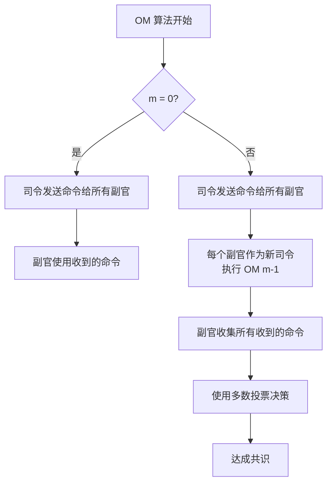
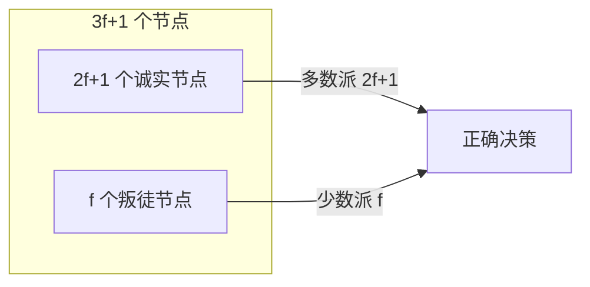

---
title: 拜占庭将军问题
date: 2021-11-08 08:15:33
categories:
  - 分布式
  - 分布式理论
tags:
  - 分布式
  - 共识
permalink: /pages/37ccfbdd/
---

# 拜占庭将军问题

> 拜占庭将军问题是由[莱斯利·兰波特](https://zh.wikipedia.org/wiki/莱斯利·兰波特)在其同名论文中提出的[分布式对等网络](https://zh.wikipedia.org/wiki/对等网络)通信容错问题。其实是借拜占庭将军的例子，抛出了分布式共识性问题，并探讨和论证了解决的方法。
>
> 在[分布式计算](https://zh.wikipedia.org/wiki/分布式計算)中，不同的节点通过通讯交换信息达成共识而按照同一套协作策略行动。但有时候，系统中的节点可能出错而发送错误的信息，用于传递信息的通讯网络也可能导致信息损坏，使得网络中不同的成员关于全体协作的策略得出不同结论，从而破坏系统一致性。拜占庭将军问题被认为是容错性问题中最难的问题类型之一。

## 问题描述

一群拜占庭将军各领一支军队共同围困一座城市。

为了简化问题，军队的行动策略只有两种：**进攻**（Attack，后面简称 A）或 **撤退**（Retreat，后面简称 R）。如果这些军队不是统一进攻或撤退，就可能因兵力不足导致失败。因此，**将军们通过投票来达成一致策略：同进或同退**。

因为将军们分别在城市的不同方位，所以他们只能**通过信使互相联系**。在投票过程中，**每位将军都将自己的投票信息（A 或 R）通知其他所有将军**，这样一来每位将军根据自己的投票和其他所有将军送来的信息就可以分析出共同的投票结果而决定行动策略。

这个抽象模型的问题在于：**将军中可能存在叛徒，他们不仅会发出误导性投票，还可能选择性地发送投票信息**。

由于将军之间需要通过信使通讯，叛变将军可能通过伪造信件来以其他将军的身份发送假投票。而即使在保证所有将军忠诚的情况下，也不能排除信使被敌人截杀，甚至被敌人间谍替换等情况。因此很难通过保证人员可靠性及通讯可靠性来解决问题。

假使那些忠诚（或是没有出错）的将军仍然能通过多数决定来决定他们的战略，便称达到了拜占庭容错。在此，票都会有一个默认值，若消息（票）没有被收到，则使用此默认值来投票。

上述的故事可以映射到分布式系统中，_将军代表分布式系统中的节点；信使代表通信系统；叛徒代表故障或异常_。


## 特性

拜占庭将军问题具有以下关键特性：

| 特性 | 说明 |
| --- | --- |
| **拜占庭容错** | 系统能够容忍节点发送错误信息、伪造身份等恶意行为 |
| **共识达成** | 忠诚节点能够就同一决策达成一致 |
| **容错上限** | 容忍 `f` 个叛徒节点需要至少 `3f + 1` 个总节点 |
| **口头协议** | 消息不可伪造，但无法追溯消息来源 |
| **书面协议** | 消息带有签名，可追溯来源且不可伪造 |
| **多数派原则** | 通过多数表决来决策，容忍少数节点的恶意行为 |

### 拜占庭故障 vs 非拜占庭故障

| 对比维度 | 拜占庭故障 | 非拜占庭故障（崩溃故障） |
| --- | --- | --- |
| **故障类型** | 节点可能发送任意错误信息 | 节点只能崩溃或停止响应 |
| **恶意行为** | 可伪造数据、选择性转发 | 不会有恶意行为 |
| **容错算法** | PBFT、PoW、PoS | Paxos、Raft、ZAB |
| **节点要求** | `3f + 1` 个节点容忍 `f` 个故障 | `2f + 1` 个节点容忍 `f` 个故障 |
| **适用场景** | 区块链、金融系统 | 分布式数据库、协调服务 |

## 问题分析

> 兰伯特针对拜占庭将军问题，给出了两个解决方案：口头协议和书面协议。
>
> 本文介绍一下口头协议。

在口头协议中，拜占庭将军问题被简化为**将军 - 副官**模型，其核心规则如下：

- 忠诚的副官遵守同一命令。
- 若将军是忠诚的，所有忠诚的副官都执行他的命令。
- **如果叛徒人数为 m，将军人数不能少于 3m + 1** ，那么拜占庭将军问题就能解决了。——关于这个公式，可以不必深究，如果对推导过程感兴趣，可以参考论文。

**示例一、叛徒人数为 1，将军人数为 3**


这个示例中，将军人数不满足 3m + 1，无法保证忠诚的副官都执行将军的命令。

**示例二、叛徒人数为 1，将军人数为 4**


这个示例中，将军人数满足 3m + 1，无论是副官中有叛徒，还是将军是叛徒，都能保证忠诚的副官执行将军的命令。

## 原理

### 口头协议（Oral Messages）

口头协议基于以下假设：

1. 消息在传输过程中不会被篡改（即消息完整性）
2. 消息的接收者知道消息的发送者是谁
3. 消息的缺失可以被检测到

口头协议的核心算法（OM 算法）通过**多轮消息交换**来达成共识：



**OM(m) 算法流程**：

1. **OM(0)**：司令直接将命令发送给所有副官，副官执行收到的命令
2. **OM(m)**：司令将命令发送给所有副官；每个副官将收到的命令作为新的司令命令，执行 OM(m-1)；经过 m+1 轮后，副官对所有收到的命令进行多数投票

### 书面协议（Signed Messages）

书面协议在口头协议基础上增加了**数字签名**：

1. 消息不可伪造（签名不可伪造）
2. 任何伪造消息的行为都能被检测
3. 消息的来源可以被追溯

书面协议的优势：只需 `m + 2` 个将军就能容忍 `m` 个叛徒（比口头协议的 `3m + 1` 少得多）。

### 容错能力的数学证明

为什么口头协议需要 `3f + 1` 个节点才能容忍 `f` 个叛徒？

核心思路：在 `3f + 1` 个节点中，至多 `f` 个叛徒，至少 `2f + 1` 个诚实节点。需要从 `3f + 1` 个节点中收集信息，其中诚实节点的信息 `2f + 1` 条占多数，可以覆盖叛徒的 `f` 条错误信息。



## 应用场景

拜占庭容错（BFT）算法在需要容忍恶意节点的场景中广泛应用：

### 1. 区块链

- **Bitcoin**：使用 PoW（工作量证明）解决拜占庭将军问题，实现去中心化共识
- **Ethereum**：使用 PoW（过渡阶段）和 PoS（权益证明）实现共识
- **Hyperledger Fabric**：使用 PBFT（实用拜占庭容错）实现许可链的共识
- **Libra/Diem**：使用 LibraBFT（HotStuff 的变体）实现共识

### 2. 分布式金融系统

- **跨机构支付系统**：多个金融机构之间需要在不完全信任的情况下达成一致
- **清算结算系统**：多方参与的金融结算需要 BFT 保证

### 3. 容错计算

- **航空航天系统**：飞机飞行控制系统使用多副本 BFT 机制
- **核电站控制**：关键控制系统使用 BFT 防止传感器故障
- **自动驾驶**：多传感器数据融合使用 BFT 思想

### 4. 云计算和分布式存储

- **Apache Cassandra**：部分场景使用 BFT 思想处理数据冲突
- **RapidChain**：分片区块链使用 BFT 共识

### 5. 去中心化应用

- **去中心化投票系统**：防止选票篡改
- **去中心化存储**：Filecoin 使用 BFT 共识
- **去中心化身份**：DID 系统使用 BFT 保证身份不可伪造

## 最佳实践

### 案例 1：PBFT 算法的 Java 实现

PBFT（Practical Byzantine Fault Tolerance）是最经典的拜占庭容错算法之一，适用于许可链场景：

```java
import java.util.*;
import java.util.concurrent.*;
import java.util.concurrent.atomic.AtomicInteger;

/**
 * PBFT (实用拜占庭容错) 算法核心流程模拟
 *
 * PBFT 三阶段协议：
 * 1. Pre-Prepare: Leader 发起提案
 * 2. Prepare: 节点广播 Prepare 消息
 * 3. Commit: 节点广播 Commit 消息并执行
 */
public class PBFTExample {

    // 节点总数 (3f + 1)
    private static final int TOTAL_NODES = 4;
    // 最大容错节点数 f
    private static final int MAX_FAULTY = 1;
    // 当前视图编号
    private final AtomicInteger viewNumber = new AtomicInteger(0);
    // 节点列表
    private final List<PBFTNode> nodes;

    public PBFTExample() {
        this.nodes = new ArrayList<>();
        for (int i = 0; i < TOTAL_NODES; i++) {
            this.nodes.add(new PBFTNode(i, this));
        }
    }

    /**
     * PBFT 节点
     */
    public static class PBFTNode {
        private final int nodeId;
        private final PBFTExample cluster;
        private boolean isLeader;
        // Prepare 消息收集
        private final Map<Long, Set<Integer>> prepareMessages = new ConcurrentHashMap<>();
        // Commit 消息收集
        private final Map<Long, Set<Integer>> commitMessages = new ConcurrentHashMap<>();
        // 已执行的请求
        private final Set<Long> executedRequests = ConcurrentHashMap.newKeySet();

        public PBFTNode(int nodeId, PBFTExample cluster) {
            this.nodeId = nodeId;
            this.cluster = cluster;
            // node 0 为初始 Leader
            this.isLeader = (nodeId == 0);
        }

        /**
         * 处理客户端请求（Leader 调用）
         */
        public void handleClientRequest(long sequenceNumber, String request) {
            if (!isLeader) {
                System.out.println("[Node " + nodeId + "] 非 Leader 节点，拒绝请求");
                return;
            }

            System.out.println("\n[Node " + nodeId + " (Leader)] 收到客户端请求 #"
                + sequenceNumber + ": " + request);

            // === 阶段 1: Pre-Prepare ===
            System.out.println("[Node " + nodeId + "] 阶段 1 - Pre-Prepare: 广播提案");
            for (PBFTNode node : cluster.nodes) {
                if (node.nodeId != this.nodeId) {
                    node.receivePrePrepare(sequenceNumber, request, nodeId);
                }
            }
        }

        /**
         * 接收 Pre-Prepare 消息
         */
        public void receivePrePrepare(long seqNum, String request, int leaderId) {
            System.out.println("[Node " + nodeId + "] 阶段 1 - 收到 Pre-Prepare: #"
                + seqNum + " from Leader " + leaderId);

            // === 阶段 2: Prepare ===
            // 广播 Prepare 消息给所有节点
            System.out.println("[Node " + nodeId + "] 阶段 2 - 广播 Prepare 消息");
            for (PBFTNode node : cluster.nodes) {
                node.receivePrepare(seqNum, nodeId);
            }
        }

        /**
         * 接收 Prepare 消息
         */
        public void receivePrepare(long seqNum, int fromNodeId) {
            Set<Integer> senders = prepareMessages.computeIfAbsent(
                seqNum, k -> ConcurrentHashMap.newKeySet());
            senders.add(fromNodeId);

            // 需要 2f 个 Prepare 消息（加上自己共 2f+1）
            int requiredPrepare = 2 * MAX_FAULTY;
            if (senders.size() >= requiredPrepare && !commitMessages.containsKey(seqNum)) {
                System.out.println("[Node " + nodeId + "] 阶段 2 - 收集到 "
                    + senders.size() + " 个 Prepare 消息，进入 Commit 阶段");

                // === 阶段 3: Commit ===
                System.out.println("[Node " + nodeId + "] 阶段 3 - 广播 Commit 消息");
                for (PBFTNode node : cluster.nodes) {
                    node.receiveCommit(seqNum, nodeId);
                }
            }
        }

        /**
         * 接收 Commit 消息
         */
        public void receiveCommit(long seqNum, int fromNodeId) {
            Set<Integer> senders = commitMessages.computeIfAbsent(
                seqNum, k -> ConcurrentHashMap.newKeySet());
            senders.add(fromNodeId);

            // 需要 2f+1 个 Commit 消息（包括自己）
            int requiredCommit = 2 * MAX_FAULTY + 1;
            if (senders.size() >= requiredCommit && !executedRequests.contains(seqNum)) {
                executedRequests.add(seqNum);
                System.out.println("[Node " + nodeId + "] 阶段 3 - 收集到 "
                    + senders.size() + " 个 Commit 消息，执行请求 #" + seqNum);
            }
        }

        public int getNodeId() { return nodeId; }
    }

    /**
     * 模拟拜占庭节点（发送错误消息）
     */
    public static class ByzantineNode extends PBFTNode {
        public ByzantineNode(int nodeId, PBFTExample cluster) {
            super(nodeId, cluster);
        }

        @Override
        public void receivePrePrepare(long seqNum, String request, int leaderId) {
            System.out.println("[Node " + getNodeId() + " (叛徒)] 收到 Pre-Prepare，但发送错误消息！");
            // 向不同节点发送不同的 Prepare 消息
            // 这就是拜占庭节点的恶意行为
        }
    }

    public static void main(String[] args) {
        PBFTExample pbft = new PBFTExample();
        System.out.println("=== PBFT 共识算法演示 ===");
        System.out.println("节点数: " + TOTAL_NODES + " (容忍 " + MAX_FAULTY + " 个拜占庭节点)");
        System.out.println("需要 2f+1 = " + (2 * MAX_FAULTY + 1) + " 个节点达成共识\n");

        // Leader 处理客户端请求
        pbft.nodes.get(0).handleClientRequest(1, "TRANSFER 100 from A to B");

        // 结论：即使有 1 个叛徒节点，PBFT 仍能正确达成共识
        System.out.println("\n=== 结论 ===");
        System.out.println("PBFT 在 " + TOTAL_NODES + " 个节点中容忍 "
            + MAX_FAULTY + " 个拜占庭节点");
        System.out.println("通过三阶段协议保证一致性");
    }
}
```

### 案例 2：数字签名验证实现

书面协议依赖数字签名，以下是基于 RSA 的签名验证实现：

```java
import java.security.*;
import java.security.spec.*;
import javax.crypto.*;
import javax.crypto.spec.*;
import java.util.Base64;

/**
 * 数字签名工具类
 * 用于拜占庭将军问题的书面协议
 * 保证消息的不可伪造性和可追溯性
 */
public class DigitalSignatureUtil {

    /**
     * 生成 RSA 密钥对
     */
    public static KeyPair generateKeyPair() throws NoSuchAlgorithmException {
        KeyPairGenerator keyGen = KeyPairGenerator.getInstance("RSA");
        keyGen.initialize(2048);
        return keyGen.generateKeyPair();
    }

    /**
     * 对消息进行签名
     *
     * @param privateKey 私钥
     * @param message    待签名消息
     * @return 签名（Base64 编码）
     */
    public static String sign(PrivateKey privateKey, String message)
            throws Exception {
        Signature signature = Signature.getInstance("SHA256withRSA");
        signature.initSign(privateKey);
        signature.update(message.getBytes());
        byte[] signatureBytes = signature.sign();
        return Base64.getEncoder().encodeToString(signatureBytes);
    }

    /**
     * 验证签名
     *
     * @param publicKey  公钥
     * @param message    原始消息
     * @param signatureStr 签名（Base64 编码）
     * @return 验证是否通过
     */
    public static boolean verify(PublicKey publicKey, String message, String signatureStr)
            throws Exception {
        Signature signature = Signature.getInstance("SHA256withRSA");
        signature.initVerify(publicKey);
        signature.update(message.getBytes());
        byte[] signatureBytes = Base64.getDecoder().decode(signatureStr);
        return signature.verify(signatureBytes);
    }

    /**
     * 模拟拜占庭将军问题的书面协议
     */
    public static void main(String[] args) throws Exception {
        System.out.println("=== 拜占庭将军问题 - 书面协议演示 ===\n");

        // 1. 为每个将军生成密钥对
        int generalCount = 4;
        Map<Integer, KeyPair> keyPairs = new HashMap<>();
        Map<Integer, PublicKey> publicKeys = new HashMap<>();

        for (int i = 1; i <= generalCount; i++) {
            KeyPair kp = generateKeyPair();
            keyPairs.put(i, kp);
            publicKeys.put(i, kp.getPublic());
        }

        // 2. 司令发送带签名的命令
        int commander = 1;
        String command = "ATTACK";
        PrivateKey commanderPrivateKey = keyPairs.get(commander).getPrivate();
        String signature = sign(commanderPrivateKey, command);

        System.out.println("司令 (将军 " + commander + ") 发送命令: " + command);
        System.out.println("签名: " + signature.substring(0, 30) + "...\n");

        // 3. 副官验证签名
        for (int i = 2; i <= generalCount; i++) {
            PublicKey commanderPublicKey = publicKeys.get(commander);
            boolean isValid = verify(commanderPublicKey, command, signature);
            System.out.println("将军 " + i + " 验证签名结果: " + (isValid ? "有效" : "无效"));
        }

        // 4. 模拟叛徒篡改消息
        System.out.println("\n--- 模拟叛徒篡改消息 ---");
        String tamperedCommand = "RETREAT";
        boolean isValid = verify(publicKeys.get(commander), tamperedCommand, signature);
        System.out.println("篡改后的命令: " + tamperedCommand);
        System.out.println("验证结果: " + (isValid ? "有效（危险！）" : "无效（签名验证拦截了篡改）"));

        // 5. 模拟叛徒伪造签名
        System.out.println("\n--- 模拟叛徒伪造签名 ---");
        KeyPair fakeKeyPair = generateKeyPair();
        String fakeSignature = sign(fakeKeyPair.getPrivate(), command);
        System.out.println("叛徒使用伪造的私钥签名");
        boolean fakeValid = verify(publicKeys.get(commander), command, fakeSignature);
        System.out.println("验证结果: " + (fakeValid ? "有效（危险！）" : "无效（签名验证拦截了伪造）"));

        System.out.println("\n=== 结论 ===");
        System.out.println("书面协议通过数字签名保证了消息的不可伪造性和可追溯性");
        System.out.println("相比口头协议，书面协议只需 m + 2 个将军即可容忍 m 个叛徒");
    }
}
```

### 案例 3：PoW（工作量证明）简化实现

PoW 是 Bitcoin 解决拜占庭将军问题的方案，通过算力竞争来达成共识：

```java
import java.security.MessageDigest;
import java.util.concurrent.atomic.AtomicLong;

/**
 * PoW (Proof of Work) 工作量证明简化实现
 * Bitcoin 使用 PoW 解决拜占庭将军问题
 *
 * 核心思想：通过计算哈希难题来竞争记账权
 * 算力越强的节点越有可能先解出难题，成为区块产生者
 */
public class ProofOfWork {

    // 难度目标：哈希前缀的零的数量
    private final int difficulty;
    // 区块数据
    private final String blockData;
    // 随机数
    private final AtomicLong nonce = new AtomicLong(0);

    public ProofOfWork(String blockData, int difficulty) {
        this.blockData = blockData;
        this.difficulty = difficulty;
    }

    /**
     * 计算 SHA-256 哈希
     */
    public static String calculateHash(String data, long nonce) {
        try {
            MessageDigest digest = MessageDigest.getInstance("SHA-256");
            String input = data + nonce;
            byte[] hash = digest.digest(input.getBytes());
            StringBuilder hexString = new StringBuilder();
            for (byte b : hash) {
                String hex = Integer.toHexString(0xff & b);
                if (hex.length() == 1) hexString.append('0');
                hexString.append(hex);
            }
            return hexString.toString();
        } catch (Exception e) {
            throw new RuntimeException(e);
        }
    }

    /**
     * 检查哈希是否满足难度要求
     */
    public boolean isValidHash(String hash) {
        String target = new String(new char[difficulty]).replace('\0', '0');
        return hash.substring(0, difficulty).equals(target);
    }

    /**
     * 挖矿（寻找满足条件的 nonce）
     */
    public MiningResult mine() {
        String target = new String(new char[difficulty]).replace('\0', '0');
        System.out.println("开始挖矿，难度: " + difficulty + " (哈希前 " + difficulty + " 位为 0)");
        System.out.println("目标: " + target + "...");

        long startTime = System.currentTimeMillis();

        while (true) {
            long currentNonce = nonce.getAndIncrement();
            String hash = calculateHash(blockData, currentNonce);

            if (isValidHash(hash)) {
                long elapsed = System.currentTimeMillis() - startTime;
                System.out.println("挖矿成功！");
                System.out.println("Nonce: " + currentNonce);
                System.out.println("Hash: " + hash);
                System.out.println("耗时: " + elapsed + "ms, 尝试次数: " + currentNonce);
                return new MiningResult(currentNonce, hash, elapsed);
            }

            // 进度显示
            if (currentNonce % 100000 == 0) {
                System.out.println("已尝试 " + currentNonce + " 次...");
            }
        }
    }

    /**
     * 挖矿结果
     */
    public static class MiningResult {
        public final long nonce;
        public final String hash;
        public final long elapsedMs;

        public MiningResult(long nonce, String hash, long elapsedMs) {
            this.nonce = nonce;
            this.hash = hash;
            this.elapsedMs = elapsedMs;
        }
    }

    public static void main(String[] args) {
        // 模拟一个区块
        String blockData = "Block#1|From:Alice|To:Bob|Amount:100|PrevHash:0000abc...";
        int difficulty = 4; // 4 个前导零

        ProofOfWork pow = new ProofOfWork(blockData, difficulty);
        MiningResult result = pow.mine();

        System.out.println("\n=== PoW 如何解决拜占庭将军问题 ===");
        System.out.println("1. 所有节点竞争解哈希难题");
        System.out.println("2. 最先解出的节点获得记账权，相当于成为'司令'");
        System.out.println("3. 其他节点验证答案的正确性（非常快速）");
        System.out.println("4. 最长链规则：节点总是选择最长的有效链");
        System.out.println("5. 篡改历史需要重新计算所有后续区块，成本极高");
        System.out.println("\n验证区块: " + pow.isValidHash(result.hash));
    }
}
```

## 常见问题

### 问题 1：拜占庭节点过多导致共识失败

**问题描述**：在 PBFT 系统中，如果拜占庭节点数量超过 `f`（即总节点数不足 `3f + 1`），共识算法将无法正常工作。

**原因分析**：

PBFT 需要 `2f + 1` 个诚实节点的消息才能达成共识。如果拜占庭节点超过 `f` 个：
- 诚实节点不足 `2f + 1` 个
- 拜占庭节点可以向不同节点发送不同消息，导致无法达成一致
- 系统可能产生分叉或停止运行

**解决方案**：确保节点数量满足 `3f + 1`，并实现动态成员管理。

```java
import java.util.*;

/**
 * 拜占庭容错能力验证工具
 */
public class BFTCapacityChecker {

    /**
     * 验证集群配置是否满足 BFT 要求
     *
     * @param totalNodes     总节点数
     * @param expectedFaulty 预期容忍的拜占庭节点数
     * @return 验证结果
     */
    public static BFTResult validate(int totalNodes, int expectedFaulty) {
        int requiredNodes = 3 * expectedFaulty + 1;
        int honestNodes = totalNodes - expectedFaulty;
        int requiredHonest = 2 * expectedFaulty + 1;

        boolean isSufficient = totalNodes >= requiredNodes;
        boolean hasEnoughHonest = honestNodes >= requiredHonest;

        return new BFTResult(totalNodes, expectedFaulty, requiredNodes,
            honestNodes, requiredHonest, isSufficient && hasEnoughHonest);
    }

    public static class BFTResult {
        public final int totalNodes;
        public final int expectedFaulty;
        public final int requiredNodes;
        public final int honestNodes;
        public final int requiredHonest;
        public final boolean isValid;

        public BFTResult(int totalNodes, int expectedFaulty, int requiredNodes,
                         int honestNodes, int requiredHonest, boolean isValid) {
            this.totalNodes = totalNodes;
            this.expectedFaulty = expectedFaulty;
            this.requiredNodes = requiredNodes;
            this.honestNodes = honestNodes;
            this.requiredHonest = requiredHonest;
            this.isValid = isValid;
        }

        public void print() {
            System.out.println("总节点数: " + totalNodes);
            System.out.println("预期容忍拜占庭节点: " + expectedFaulty);
            System.out.println("所需最少节点数: " + requiredNodes + " (3f+1)");
            System.out.println("诚实节点数: " + honestNodes);
            System.out.println("所需最少诚实节点: " + requiredHonest + " (2f+1)");
            System.out.println("验证结果: " + (isValid ? "通过" : "不通过"));
            if (!isValid) {
                System.out.println("建议: 增加 " + (requiredNodes - totalNodes)
                    + " 个节点，或降低容忍度");
            }
        }
    }

    public static void main(String[] args) {
        System.out.println("=== 拜占庭容错能力验证 ===\n");

        // 正确配置
        System.out.println("--- 配置 1: 4 节点容忍 1 个拜占庭节点 ---");
        BFTResult r1 = validate(4, 1);
        r1.print();

        System.out.println("\n--- 配置 2: 7 节点容忍 2 个拜占庭节点 ---");
        BFTResult r2 = validate(7, 2);
        r2.print();

        // 错误配置
        System.out.println("\n--- 配置 3: 3 节点容忍 1 个拜占庭节点（不足） ---");
        BFTResult r3 = validate(3, 1);
        r3.print();

        System.out.println("\n--- 配置 4: 10 节点容忍 4 个拜占庭节点（不足） ---");
        BFTResult r4 = validate(10, 4);
        r4.print();

        System.out.println("\n=== 推荐配置表 ===");
        System.out.println("| 拜占庭节点数 f | 最少节点数 3f+1 | 实际部署建议 |");
        System.out.println("|----------------|-----------------|--------------|");
        System.out.println("| 1              | 4               | 4            |");
        System.out.println("| 2              | 7               | 7            |");
        System.out.println("| 3              | 10              | 10           |");
        System.out.println("| 5              | 16              | 16           |");
    }
}
```

### 问题 2：PBFT 在大规模节点下的通信开销

**问题描述**：PBFT 算法的通信复杂度为 O(n²)，当节点数量增加时，消息交换的开销急剧增长，导致系统性能下降。

**原因分析**：

PBFT 的三阶段协议中：
- Pre-Prepare：Leader 向所有节点广播，复杂度 O(n)
- Prepare：每个节点向所有节点广播，复杂度 O(n²)
- Commit：每个节点向所有节点广播，复杂度 O(n²)

总通信复杂度为 O(n²)，这在节点数超过 100 时会成为瓶颈。

**解决方案**：使用优化后的 BFT 算法，如 HotStuff（O(n) 复杂度）。

```java
/**
 * BFT 算法通信复杂度对比
 */
public class BFTComplexityComparison {

    /**
     * 计算 PBFT 的消息数量
     */
    public static int calculatePBFTMessages(int nodeCount) {
        // Pre-Prepare: n-1 (Leader 广播)
        // Prepare: n * (n-1) (每个节点广播给其他所有节点)
        // Commit: n * (n-1)
        return (nodeCount - 1) + 2 * nodeCount * (nodeCount - 1);
    }

    /**
     * 计算 HotStuff 的消息数量
     * HotStuff 使用线性通信模式，通过 pacemaker 和聚合签名
     */
    public static int calculateHotStuffMessages(int nodeCount) {
        // HotStuff 每轮通信为 O(n)
        // 4 轮通信，每轮 n 条消息
        return 4 * nodeCount;
    }

    public static void main(String[] args) {
        System.out.println("=== BFT 算法通信复杂度对比 ===\n");
        System.out.println("| 节点数 | PBFT 消息数 (O(n²)) | HotStuff 消息数 (O(n)) | 倍数 |");
        System.out.println("|--------|---------------------|------------------------|------|");

        int[] nodeCounts = {4, 7, 10, 20, 50, 100, 200, 500};
        for (int n : nodeCounts) {
            int pbft = calculatePBFTMessages(n);
            int hotstuff = calculateHotStuffMessages(n);
            double ratio = (double) pbft / hotstuff;
            System.out.printf("| %-6d | %-19d | %-22d | %.1f |%n",
                n, pbft, hotstuff, ratio);
        }

        System.out.println("\n=== 优化建议 ===");
        System.out.println("1. 小规模集群 (n <= 20): PBFT 性能足够");
        System.out.println("2. 中等规模 (20 < n <= 100): 考虑使用聚合签名优化");
        System.out.println("3. 大规模集群 (n > 100): 使用 HotStuff 或 DiemBFT");
        System.out.println("4. 超大规模 (n > 1000): 使用分片 + BFT");
    }
}
```

### 问题 3：Sybil 攻击（女巫攻击）

**问题描述**：在开放式网络中，攻击者可以创建大量虚假节点，使拜占庭节点数量超过 `f`，从而破坏共识。

**原因分析**：

拜占庭容错算法假设节点身份是已知的，但在开放式网络（如区块链）中：
1. 创建新节点成本极低
2. 攻击者可以创建大量虚假节点
3. 虚假节点占总节点比例超过 `1/3` 时，共识被破坏

**解决方案**：通过 PoW、PoS 或身份认证机制提高节点准入成本。

```java
import java.util.*;
import java.util.concurrent.*;

/**
 * Sybil 攻击防护演示
 * 对比无防护和有防护的共识系统
 */
public class SybilAttackDefense {

    /**
     * 无防护的共识系统（易受 Sybil 攻击）
     */
    public static class UnprotectedConsensus {
        private final Set<String> nodes = new HashSet<>();

        public void addNode(String nodeId) {
            nodes.add(nodeId);
        }

        public boolean reachConsensus(int faultyNodes) {
            int total = nodes.size();
            int honest = total - faultyNodes;
            // 需要诚实节点占 2/3 以上
            return honest > total * 2 / 3;
        }
    }

    /**
     * 使用 PoW 防护的共识系统
     */
    public static class PoWProtectedConsensus {
        // 节点 -> 算力
        private final Map<String, Double> nodeHashPower = new HashMap<>();

        public void addNode(String nodeId, double hashPower) {
            nodeHashPower.put(nodeId, hashPower);
        }

        /**
         * 基于 PoW 的共识：攻击者需要控制 51% 的算力
         */
        public boolean reachConsensus(double attackerHashPower) {
            double totalHashPower = nodeHashPower.values().stream()
                .mapToDouble(Double::doubleValue).sum();
            double honestHashPower = totalHashPower - attackerHashPower;
            // 诚实算力需要超过 50%
            return honestHashPower > totalHashPower * 0.5;
        }
    }

    /**
     * 使用 PoS 防护的共识系统
     */
    public static class PoSProtectedConsensus {
        // 节点 -> 质押代币数
        private final Map<String, Double> nodeStakes = new HashMap<>();

        public void addNode(String nodeId, double stake) {
            nodeStakes.put(nodeId, stake);
        }

        /**
         * 基于 PoS 的共识：攻击者需要控制 1/3 的质押代币
         */
        public boolean reachConsensus(double attackerStake) {
            double totalStake = nodeStakes.values().stream()
                .mapToDouble(Double::doubleValue).sum();
            double honestStake = totalStake - attackerStake;
            // BFT 风格 PoS：诚实质押需要超过 2/3
            return honestStake > totalStake * 2 / 3;
        }
    }

    public static void main(String[] args) {
        System.out.println("=== Sybil 攻击防护对比 ===\n");

        // 1. 无防护系统
        System.out.println("--- 1. 无防护系统 ---");
        UnprotectedConsensus unprotected = new UnprotectedConsensus();
        // 正常节点
        for (int i = 1; i <= 10; i++) {
            unprotected.addNode("honest-" + i);
        }
        System.out.println("正常状态 (10 诚实, 0 攻击): "
            + (unprotected.reachConsensus(0) ? "安全" : "不安全"));

        // Sybil 攻击：创建 30 个虚假节点
        for (int i = 1; i <= 30; i++) {
            unprotected.addNode("sybil-" + i);
        }
        System.out.println("Sybil 攻击后 (10 诚实, 30 攻击): "
            + (unprotected.reachConsensus(30) ? "安全" : "不安全 (被攻破!)"));

        // 2. PoW 防护系统
        System.out.println("\n--- 2. PoW 防护系统 ---");
        PoWProtectedConsensus powSystem = new PoWProtectedConsensus();
        // 诚实节点各有 100 TH/s 算力
        for (int i = 1; i <= 10; i++) {
            powSystem.addNode("miner-" + i, 100.0);
        }
        // 攻击者只有 500 TH/s（不足 51%）
        System.out.println("攻击者算力 500 (总 1000): "
            + (powSystem.reachConsensus(500) ? "安全" : "不安全"));
        // 攻击者有 600 TH/s（超过 51%）
        System.out.println("攻击者算力 600 (总 1000): "
            + (powSystem.reachConsensus(600) ? "安全" : "不安全 (51%攻击!)"));

        // 3. PoS 防护系统
        System.out.println("\n--- 3. PoS 防护系统 ---");
        PoSProtectedConsensus posSystem = new PoSProtectedConsensus();
        // 诚实节点各质押 1000 代币
        for (int i = 1; i <= 10; i++) {
            posSystem.addNode("validator-" + i, 1000.0);
        }
        // 攻击者持有 5000 代币（不足 1/3）
        System.out.println("攻击者质押 5000 (总 15000): "
            + (posSystem.reachConsensus(5000) ? "安全" : "不安全"));
        // 攻击者持有 6000 代币（超过 1/3）
        System.out.println("攻击者质押 6000 (总 16000): "
            + (posSystem.reachConsensus(6000) ? "安全" : "不安全 (BFT被攻破!)"));

        System.out.println("\n=== 防护方案对比 ===");
        System.out.println("| 方案     | 准入成本      | 攻击成本      | 适用场景         |");
        System.out.println("|----------|---------------|---------------|------------------|");
        System.out.println("| 无防护   | 无            | 极低          | 不适用           |");
        System.out.println("| PoW      | 算力硬件成本   | 51% 算力      | 公链 (Bitcoin)   |");
        System.out.println("| PoS      | 质押代币成本   | 1/3 质押代币  | 公链 (Ethereum)  |");
        System.out.println("| 身份认证 | 实名认证成本   | 身份获取成本  | 联盟链 (Fabric)  |");
    }
}
```

## 参考资料

- [Wiki - 拜占庭将军问题](https://zh.wikipedia.org/wiki/%E6%8B%9C%E5%8D%A0%E5%BA%AD%E5%B0%86%E5%86%9B%E9%97%AE%E9%A2%98)
- [拜占庭将军问题视频讲解](https://www.bilibili.com/video/av78588312/) - 李永乐老师讲解的通俗易懂
- [The Byzantine Generals Problem](https://lamport.azurewebsites.net/pubs/byz.pdf)
