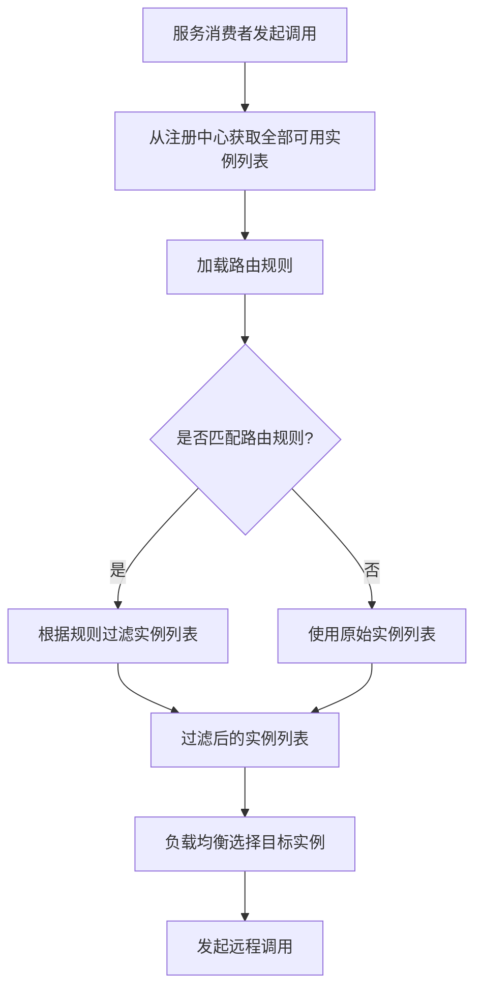
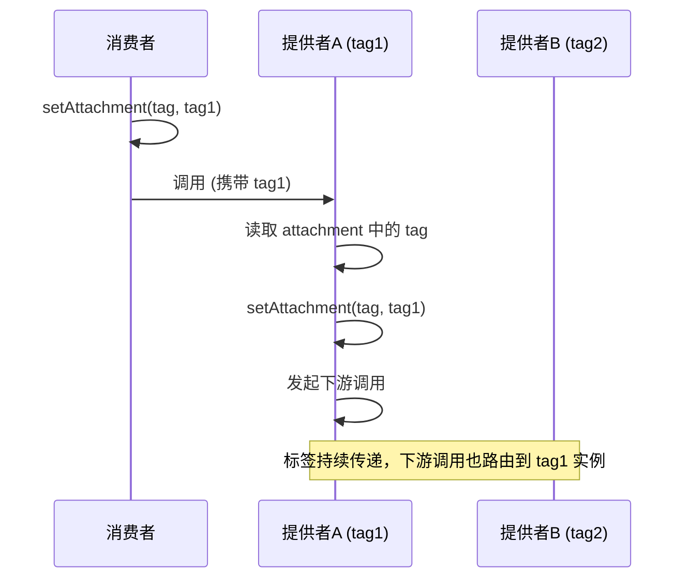

---
title: 服务路由
date: 2022-04-19 15:54:25
categories:
  - 分布式
  - 分布式调度
tags:
  - 分布式
  - 服务治理
  - 调度
  - 路由
permalink: /pages/ec1dfb62/
---

# 服务路由

## 简介

**服务路由**（Service Routing）是指在微服务调用过程中，通过一组预定义的规则，从注册中心返回的可用服务实例列表中筛选出符合特定条件的实例子集，再将请求分发给这些实例的过程。它是服务治理中连接"服务发现"和"负载均衡"的关键环节。

在简单的微服务架构中，服务消费者获取到所有可用的服务提供者实例后，直接通过负载均衡算法选择一个实例调用即可。但随着业务规模的扩大和部署架构的复杂化，往往需要对流量进行更精细化的控制，例如：

- **流量隔离** - 将测试环境的流量与生产环境隔离，避免相互影响。
- **灰度发布** - 新版本先面向小部分用户开放，验证无误后再全量发布。
- **同机房优先** - 优先调用同机房的服务实例，降低跨机房调用的网络延迟。
- **读写分离** - 将读请求和写请求路由到不同的实例分组，提升整体性能。

服务路由与负载均衡的关系是：路由负责"筛选"出符合条件的实例集合，负载均衡负责从该集合中"选择"一个具体的实例。路由是负载均衡的前置步骤，二者协同完成服务调用的目标节点决策。

## 特性

服务路由具有以下核心特性：

| 特性 | 说明 |
| :--- | :--- |
| **规则化** | 通过条件表达式、标签、脚本等规则定义路由逻辑，支持灵活配置 |
| **动态生效** | 路由规则可动态下发和修改，无需重启应用即可生效 |
| **多维度匹配** | 支持基于消费者、提供者、方法、参数等多维度进行路由匹配 |
| **流量隔离** | 将不同特征的流量路由到不同实例分组，实现流量隔离 |
| **优先级控制** | 支持多条路由规则的优先级配置，规则按优先级顺序匹配 |
| **故障容错** | 路由规则匹配失败或无可用实例时，可降级到默认路由策略 |

常见路由类型对比：

| 路由类型 | 配置方式 | 灵活性 | 适用场景 |
| :--- | :--- | :--- | :--- |
| **条件路由** | 条件表达式 | 中等 | IP 过滤、读写分离、机房隔离 |
| **标签路由** | 标签分组 | 中等 | 灰度发布、蓝绿发布、A/B 测试 |
| **脚本路由** | 脚本语言 | 高 | 复杂的动态路由逻辑 |
| **自定义路由** | 编码实现 | 最高 | 框架内置路由无法满足的特殊需求 |

## 什么是服务路由

**服务路由**是指通过一定的规则从集群中选择合适的节点。

负载均衡的作用和服务路由的功能看上去很近似，二者有什么区别呢？

负载均衡的目标是提供服务分发而不是解决路由问题，常见的静态、动态负载均衡算法也无法实现精细化的路由管理，但是负载均衡也可以简单看做是路由方案的一种。

## 原理

服务路由的核心原理是：**在服务消费者发起调用前，对注册中心返回的全部可用实例列表进行过滤，筛选出符合路由规则的实例子集，再交给负载均衡器选择最终的目标实例**。

其处理流程如下图所示：



### 路由规则的执行时机

路由规则的执行时机有两种：

- **启动时执行**（非 runtime） - 路由规则在服务消费者初始化时执行一次，之后使用缓存的过滤结果。优点是性能好，缺点是无法感知实例的动态变化。
- **每次调用时执行**（runtime） - 路由规则在每次服务调用时都重新执行。优点是能实时反映实例变化，缺点是有额外的计算开销。

```yaml
# Dubbo 路由规则示例
---
scope: service
force: true
# runtime 为 true 表示每次调用都重新执行路由规则
runtime: true
enabled: true
key: org.apache.dubbo.samples.api.DemoService
conditions:
  - method=sayHello => address=*:20880
```

### 路由链的执行顺序

当存在多条路由规则时，它们会组成一条**路由链**（Router Chain），按优先级顺序依次执行。前一条路由的输出作为后一条路由的输入，最终得到经过所有路由规则过滤后的实例列表：


### 标签路由的传递机制

标签路由通过 `RpcContext` 的 `attachment` 机制传递请求标签，标签在一次完整的远程调用链中会持续传递，从而实现跨服务的标签路由：



## 应用场景

服务路由通常用于以下场景，目的在于实现流量隔离：

- **分组调用**：一般来讲，为了保证服务的高可用性，实现异地多活的需求，一个服务往往不止部署在一个数据中心，而且出于节省成本等考虑，有些业务可能不仅在私有机房部署，还会采用公有云部署，甚至采用多家公有云部署。服务节点也会按照不同的数据中心分成不同的分组，这时对于服务消费者来说，选择哪一个分组调用，就必须有相应的路由规则。
- **蓝绿发布**：蓝绿发布场景中，一共有两套服务群组：一套是提供旧版功能的服务群组，标记为**绿色**；另一套是提供新版功能的服务群组，标记为**蓝色**。两套服务群组都是功能完善的，并且正在运行的系统，只是服务版本和访问流量不同。新版群组（蓝色）通常是为了做内部测试、验收，不对外部用户暴露。
  - 如果新版群组（蓝色）运行稳定，并测试、验收通过后，则通过服务路由、负载均衡等手段逐步将外部用户流量导向新版群组（蓝色）。
  - 如果新版群组（蓝色）运行不稳定，或测试、验收不通过，则排查、解决问题后，再继续测试、验收。
- **灰度发布**：灰度发布（又名金丝雀发布）是指在黑与白之间，能够平滑过渡的一种发布方式。在其上可以进行 A/B 测试，即让一部分用户使用特性 A，一部分用户使用特性 B：如果用户对 B 没有什么反对意见，那么逐步扩大发布范围，直到把所有用户都迁移到 B 上面来。灰度发布可以保证整体系统的稳定，在初始灰度的时候就可以发现、调整问题，以保证其影响度。要支持灰度发布，就要求服务能够根据一定的规则，将流量隔离。
- **流量切换**：在业务线上运行过程中，经常会遇到一些不可抗力因素导致业务故障，比如某个机房的光缆被挖断，或者发生着火等事故导致整个机房的服务都不可用。这个时候就需要按照某个指令，能够把原来调用这个机房服务的流量切换到其他正常的机房。
- **线下测试联调**：线下测试时，可能会缺少相应环境。可以将测试应用注册到线上，然后开启路由规则，在本地进行测试。
- **读写分离**。对于大多数互联网业务来说都是读多写少，所以在进行服务部署的时候，可以把读写分开部署，所有写接口可以部署在一起，而读接口部署在另外的节点上。

## 最佳实践

### 案例 1：基于 Dubbo 标签路由实现灰度发布

灰度发布是服务路由最典型的应用场景。下面演示如何使用 `Dubbo` 的标签路由，将指定用户的流量路由到新版本实例。

**（1）服务提供者打标**

新版本实例通过启动参数打上 `gray` 标签：

```bash
# 启动新版本实例，打上 gray 标签
java -Ddubbo.provider.tag=gray -jar user-service-v2.jar
```

或通过 XML 配置打标：

```xml
<dubbo:provider tag="gray"/>
```

**（2）服务消费者根据用户特征设置标签**

```java
import org.apache.dubbo.common.constants.CommonConstants;
import org.apache.dubbo.rpc.RpcContext;
import org.springframework.web.bind.annotation.GetMapping;
import org.springframework.web.bind.annotation.RequestHeader;
import org.springframework.web.bind.annotation.RestController;

@RestController
public class OrderController {

    @GetMapping("/create")
    public String createOrder(@RequestHeader(value = "X-User-Id", required = false) String userId) {
        // 根据 userId 判断是否为灰度用户（例如：userId 尾号为 1 的用户）
        if (isGrayUser(userId)) {
            // 设置请求标签，路由到 gray 分组的实例
            RpcContext.getClientAttachment().setAttachment(CommonConstants.TAG_KEY, "gray");
        }
        // 发起远程调用，会根据标签路由到对应分组的实例
        return userService.getUser(userId);
    }

    private boolean isGrayUser(String userId) {
        if (userId == null || userId.isEmpty()) {
            return false;
        }
        // 简单示例：userId 尾号为 1 的用户走灰度
        int lastDigit = Integer.parseInt(userId.substring(userId.length() - 1));
        return lastDigit == 1;
    }
}
```

**（3）动态下发标签路由规则**

通过 Dubbo Admin 控制台或配置中心下发标签路由规则：

```yaml
---
  force: false
  runtime: true
  enabled: true
  key: user-service
  tags:
    - name: gray
      addresses: ["192.168.1.101:20880", "192.168.1.102:20880"]
    - name: stable
      addresses: ["192.168.1.201:20880", "192.168.1.202:20880"]
```

### 案例 2：基于条件路由实现同机房优先调用

在多机房部署场景下，跨机房调用会增加网络延迟，应优先调用同机房的服务实例。通过条件路由可以实现这一目标。

**（1）服务提供者注册机房信息**

```yaml
# 机房 A 的服务提供者配置
dubbo:
  provider:
    # 注册到注册中心的参数，携带机房信息
    parameters:
      zone: zone-a
```

**（2）服务消费者配置同机房优先路由规则**

```yaml
# 消费者也标记自己的机房
dubbo:
  consumer:
    parameters:
      zone: zone-a
```

通过配置中心下发条件路由规则：

```yaml
---
scope: service
force: false
runtime: true
enabled: true
key: org.example.UserService
conditions:
  # 消费者机房为 zone-a 时，优先调用 zone-a 的提供者
  - zone=zone-a => zone=zone-a
  # 消费者机房为 zone-b 时，优先调用 zone-b 的提供者
  - zone=zone-b => zone=zone-b
```

**（3）结合降级策略**

当同机房没有可用实例时，应允许跨机房调用（`force: false`）：

```java
import org.apache.dubbo.config.annotation.DubboReference;
import org.springframework.web.bind.annotation.RestController;

@RestController
public class UserController {

    // check=false 表示启动时不检查提供者是否可用
    @DubboReference(check = false)
    private UserService userService;

    public String getUser(String id) {
        try {
            return userService.getUser(id);
        } catch (Exception e) {
            // 同机房调用失败，降级到跨机房调用或其他兜底逻辑
            return "用户信息暂时不可用";
        }
    }
}
```

### 案例 3：基于条件路由实现读写分离

对于读多写少的业务，将读请求和写请求路由到不同的实例分组，可以提升整体性能。

**（1）部署读写分离的实例分组**

- **写实例组**（IP: 172.22.3.97, 172.22.3.98） - 处理增删改请求
- **读实例组**（IP: 172.22.3.94, 172.22.3.95, 172.22.3.96） - 处理查询请求

**（2）下发读写分离路由规则**

```yaml
---
scope: service
force: true
runtime: true
enabled: true
key: org.example.ProductService
conditions:
  # 以 find/list/get/is 开头的方法路由到读实例组
  - method=find*,list*,get*,is* => host=172.22.3.94,172.22.3.95,172.22.3.96
  # 其他方法（增删改）路由到写实例组
  - method!=find*,list*,get*,is* => host=172.22.3.97,172.22.3.98
```

**（3）服务接口定义**

```java
public interface ProductService {
    // 读方法
    Product findById(Long id);
    List<Product> listProducts(int page, int size);
    Product getByName(String name);
    boolean isInStock(Long productId);

    // 写方法
    Product addProduct(Product product);
    Product updateProduct(Product product);
    void deleteProduct(Long id);
}
```

> 读写分离路由规则会根据方法名的前缀自动匹配，将读请求路由到读实例组，写请求路由到写实例组，无需修改业务代码。

## 常见问题

### 问题 1：标签路由失效，灰度流量未按预期路由

**问题描述**：配置了标签路由规则，但灰度用户的请求仍然被路由到了非灰度实例，灰度发布效果不符合预期。

**原因分析**：

1. 服务消费者未正确设置请求标签，或者标签在调用链中丢失。
2. 标签路由规则的 `force` 配置为 `false`，当灰度实例不可用时，请求被降级路由到了非灰度实例。
3. 服务提供者的标签未正确注册到注册中心。

**解决方案**：

- 确认服务提供者的标签已正确注册。可以通过注册中心的管理控制台查看实例的标签信息。
- 检查消费者是否正确设置了标签。建议使用 Dubbo 的 `RpcContext` 在调用入口设置标签：

```java
import org.apache.dubbo.common.constants.CommonConstants;
import org.apache.dubbo.rpc.RpcContext;
import org.springframework.web.servlet.HandlerInterceptor;

import javax.servlet.http.HttpServletRequest;
import javax.servlet.http.HttpServletResponse;

public class GrayRouteInterceptor implements HandlerInterceptor {

    @Override
    public boolean preHandle(HttpServletRequest request, HttpServletResponse response, Object handler) {
        String grayHeader = request.getHeader("X-Gray");
        if ("true".equals(grayHeader)) {
            // 在请求入口设置标签，整个调用链都会传递
            RpcContext.getClientAttachment().setAttachment(CommonConstants.TAG_KEY, "gray");
        }
        return true;
    }
}
```

- 如果要求灰度流量严格路由到灰度实例，不允许降级，将 `force` 设置为 `true`：

```yaml
---
  force: true
  runtime: true
  enabled: true
  key: user-service
  tags:
    - name: gray
      addresses: ["192.168.1.101:20880"]
```

### 问题 2：条件路由规则过于复杂导致性能下降

**问题描述**：服务调用链路中配置了大量条件路由规则，每次调用都需要执行所有规则，导致服务调用的延迟明显增加。

**原因分析**：

1. 路由规则的 `runtime` 设置为 `true`，每次调用都重新执行路由计算，规则越多计算开销越大。
2. 路由规则中使用了复杂的正则表达式或多层嵌套条件，匹配效率低。
3. 没有合理利用路由规则的优先级，导致不必要的规则也被执行。

**解决方案**：

- 对于不常变化的路由规则，将 `runtime` 设置为 `false`，在服务初始化时执行一次即可：

```yaml
---
scope: service
force: false
runtime: false
enabled: true
key: org.example.UserService
conditions:
  - => host=172.22.3.94,172.22.3.95,172.22.3.96
```

- 简化路由规则，避免过度使用正则表达式。对于复杂的路由逻辑，考虑使用标签路由替代条件路由：

```java
import org.apache.dubbo.rpc.cluster.router.mesh.route.MeshAppRuleListener;

// 自定义路由规则缓存，避免每次调用都解析规则
public class RuleCache {
    private volatile List<Rule> cachedRules;
    private final MeshAppRuleListener listener;

    public RuleCache() {
        this.listener = rule -> {
            // 规则变更时更新缓存
            cachedRules = parseRules(rule);
        };
    }

    private List<Rule> parseRules(String rule) {
        // 解析规则逻辑
        return Collections.emptyList();
    }
}
```

- 合理设置路由规则的优先级，将高频匹配的规则放在前面，一旦匹配成功就跳过后续规则。

### 问题 3：路由规则动态下发后未生效

**问题描述**：在配置中心修改了路由规则，但服务消费者仍然使用旧的路由规则，新的规则没有生效。

**原因分析**：

1. 服务消费者没有订阅路由规则的变更通知，无法感知规则的变化。
2. 配置中心与注册中心的数据同步存在延迟。
3. 服务消费者本地缓存的路由规则没有及时刷新。

**解决方案**：

- 确认消费者已正确订阅路由规则变更。以 Dubbo 为例，路由规则通过 ZooKeeper 或 Nacos 的配置变更监听机制实现动态下发：

```java
import org.apache.dubbo.config.ReferenceConfig;
import org.apache.dubbo.config.bootstrap.DubboBootstrap;

// 确保 DubboBootstrap 已初始化，并订阅了配置变更
ReferenceConfig<UserService> reference = new ReferenceConfig<>();
reference.setInterface(UserService.class);

DubboBootstrap.getInstance()
    .application("consumer-app")
    .registry(registryConfig)
    .reference(reference)
    .start();
```

- 检查配置中心的推送是否成功。可以通过配置中心的管理控制台查看规则的推送状态和订阅者列表。
- 如果紧急需要生效，可以重启服务消费者应用，强制重新加载路由规则：

```java
import org.apache.dubbo.rpc.cluster.RouterChain;
import org.apache.dubbo.rpc.model.ApplicationModel;

// 编程方式刷新路由规则（仅作紧急手段）
public void refreshRouterRules() {
    ApplicationModel.defaultModel()
        .getApplicationServiceRepository()
        .getServices()
        .forEach(service -> {
            RouterChain<?> chain = service.getRouterChain();
            if (chain != null) {
                chain.refreshRouter();
            }
        });
}
```

## 服务路由的规则

### 条件路由

**条件路由是基于条件表达式的路由规则**。各个 RPC 框架的条件路由表达式各不相同。

我们不妨参考一下 Dubbo 的条件路由。Dubbo 的条件路由有两种配置粒度，如下：

- **应用粒度**

  ```yaml
  # app1的消费者只能消费所有端口为20880的服务实例
  # app2的消费者只能消费所有端口为20881的服务实例
  ---
  scope: application
  force: true
  runtime: true
  enabled: true
  key: governance-conditionrouter-consumer
  conditions:
    - application=app1 => address=*:20880
    - application=app2 => address=*:20881
  ```

- **服务粒度**

  ```yaml
  # DemoService的sayHello方法只能消费所有端口为20880的服务实例
  # DemoService的sayHi方法只能消费所有端口为20881的服务实例
  ---
  scope: service
  force: true
  runtime: true
  enabled: true
  key: org.apache.dubbo.samples.governance.api.DemoService
  conditions:
    - method=sayHello => address=*:20880
    - method=sayHi => address=*:20881
  ```

> 其中，`conditions` 定义具体的路由规则内容。`conditions` 部分是规则的主体，由 1 到任意多条规则组成。详见：[Dubbo 路由规则](https://dubbo.apache.org/zh/docs/v2.7/user/examples/routing-rule/)

Dubbo 的条件路由规则由两个条件组成，分别用于对服务消费者和提供者进行匹配。条件路由规则的格式如下：

```
[服务消费者匹配条件] => [服务提供者匹配条件]
```

- 服务消费者匹配条件：所有参数和消费者的 URL 进行对比，当消费者满足匹配条件时，对该消费者执行后面的过滤规则。
- 服务提供者匹配条件：所有参数和提供者的 URL 进行对比，消费者最终只拿到过滤后的地址列表。

`condition://` 代表了这是一段用条件表达式编写的路由规则，下面是一个条件路由规则示例：

```
host = 10.20.153.10 => host = 10.20.153.11
```

该条规则表示 IP 为 `10.20.153.10` 的服务消费者**只可**调用 IP 为 `10.20.153.11` 机器上的服务，不可调用其他机器上的服务。

下面列举一些 Dubbo 条件路由的典型应用场景：

- 如果服务消费者的匹配条件为空，就表示**所有的服务消费者都可以访问**，就像下面的表达式一样。

```
=> host != 10.20.153.11
```

- 如果服务提供者的过滤条件为空，就表示**禁止所有的服务消费者访问**，就像下面的表达式一样。

```
host = 10.20.153.10 =>
```

- **排除某个服务节点**

```
=> host != 172.22.3.91
```

- **白名单**

```bash
register.ip != 10.20.153.10,10.20.153.11 =>
```

- **黑名单**

```
register.ip = 10.20.153.10,10.20.153.11 =>
```

- **只暴露部分机器节点**

```
=> host = 172.22.3.1*,172.22.3.2*
```

- **为重要应用提供额外的机器节点**

```
application != kylin => host != 172.22.3.95,172.22.3.96
```

- **读写分离**

```
method = find*,list*,get*,is* => host = 172.22.3.94,172.22.3.95,172.22.3.96
method != find*,list*,get*,is* => host = 172.22.3.97,172.22.3.98
```

- **前后台分离**

```
application = bops => host = 172.22.3.91,172.22.3.92,172.22.3.93
application != bops => host = 172.22.3.94,172.22.3.95,172.22.3.96
```

- **隔离不同机房网段**

```
host != 172.22.3.* => host != 172.22.3.*
```

- 提供者与消费者部署在同集群内，**本机只访问本机的服务**

```
=> host = $host
```

### 标签路由

**标签路由**通过将某一个或多个服务的提供者划分到同一个分组，约束流量只在指定分组中流转，从而实现流量隔离的目的，可以作为蓝绿发布、灰度发布等场景的能力基础。

标签主要是指对服务提供者的分组，目前有两种方式可以完成实例分组，分别是**动态规则打标**和**静态规则打标**。一般，动态规则优先级比静态规则更高，当两种规则同时存在且出现冲突时，将以动态规则为准。

以 Dubbo 的标签路由用法为例

（1）**动态规则打标**，可随时在**服务治理控制台**下发标签归组规则

```yaml
# governance-tagrouter-provider应用增加了两个标签分组tag1和tag2
# tag1包含一个实例 127.0.0.1:20880
# tag2包含一个实例 127.0.0.1:20881
---
  force: false
  runtime: true
  enabled: true
  key: governance-tagrouter-provider
  tags:
    - name: tag1
      addresses: ["127.0.0.1:20880"]
    - name: tag2
      addresses: ["127.0.0.1:20881"]
 ...
```

（2）**静态规则打标**

```xml
<dubbo:provider tag="tag1"/>
```

or

```xml
<dubbo:service tag="tag1"/>
```

or

```bash
java -jar xxx-provider.jar -Ddubbo.provider.tag={the tag you want, may come from OS ENV}
```

（3）**服务消费者指定标签路由**

```java
RpcContext.getContext().setAttachment(Constants.REQUEST_TAG_KEY,"tag1");
```

请求标签的作用域为每一次 invocation，使用 `attachment` 来传递请求标签，注意保存在 `attachment` 中的值将会在一次完整的远程调用中持续传递，得益于这样的特性，我们只需要在起始调用时，通过一行代码的设置，达到标签的持续传递。

### 脚本路由

**脚本路由**是基于脚本语言的路由规则，常用的脚本语言比如 JavaScript、Groovy、JRuby 等。

```
"script://0.0.0.0/com.foo.BarService?category=routers&dynamic=false&rule=" + URL.encode("（function route(invokers) { ... } (invokers)）")
```

这里面 `script://` 就代表了这是一段脚本语言编写的路由规则，具体规则定义在脚本语言的 route 方法实现里，比如下面这段用 JavaScript 编写的 route() 方法表达的意思是，只有 IP 为 `10.20.153.10` 的服务消费者可以发起服务调用。

```javascript
function route(invokers){
  var result = new java.util.ArrayList(invokers.size());
  for(i =0; i < invokers.size(); i ++){
    if("10.20.153.10".equals(invokers.get(i).getUrl().getHost())){
       result.add(invokers.get(i));
    }
  }
  return result;
 } (invokers)）;
```

## 路由规则获取方式

路由规则的获取方式主要有三种：

- **本地静态配置**：顾名思义就是路由规则存储在服务消费者本地上。服务消费者发起调用时，从本地固定位置读取路由规则，然后按照路由规则选取一个服务节点发起调用。
- **配置中心管理**：这种方式下，所有的服务消费者都从配置中心获取路由规则，由配置中心来统一管理。
- **注册中心动态下发**：这种方式下，一般是运维人员或者开发人员，通过服务治理平台修改路由规则，服务治理平台调用配置中心接口，把修改后的路由规则持久化到配置中心。因为服务消费者订阅了路由规则的变更，于是就会从配置中心获取最新的路由规则，按照最新的路由规则来执行。

一般来讲，**服务路由最好是存储在配置中心**，由配置中心来统一管理。这样的话，所有的服务消费者就不需要在本地管理服务路由，因为大部分的服务消费者并不关心服务路由的问题，或者说也不需要去了解其中的细节。通过配置中心，统一给各个服务消费者下发统一的服务路由，节省了沟通和管理成本。

但也不排除某些服务消费者有特定的需求，需要定制自己的路由规则，这个时候就适合通过本地配置来定制。

而动态下发可以理解为一种高级功能，它能够动态地修改路由规则，在某些业务场景下十分有用。比如某个数据中心存在问题，需要把调用这个数据中心的服务消费者都切换到其他数据中心，这时就可以通过动态下发的方式，向配置中心下发一条路由规则，将所有调用这个数据中心的请求都迁移到别的地方。

## 参考资料

- [从 0 开始学微服务](https://time.geekbang.org/column/intro/100014401)
- [RPC 实战与核心原理](https://time.geekbang.org/column/intro/100046201)
- [微服务架构核心 20 讲](https://time.geekbang.org/course/intro/100003901)
- [Dubbo 路由规则官方文档](https://cn.dubbo.apache.org/zh-cn/overview/mannual/java-sdk/advanced-features-and-usage/service/routing-rule/)
- [Dubbo 标签路由](https://cn.dubbo.apache.org/zh-cn/overview/mannual/java-sdk/advanced-features-and-usage/service/tag-rule/)
- [Spring Cloud Gateway 官方文档](https://docs.spring.io/spring-cloud-gateway/docs/current/reference/html/)
