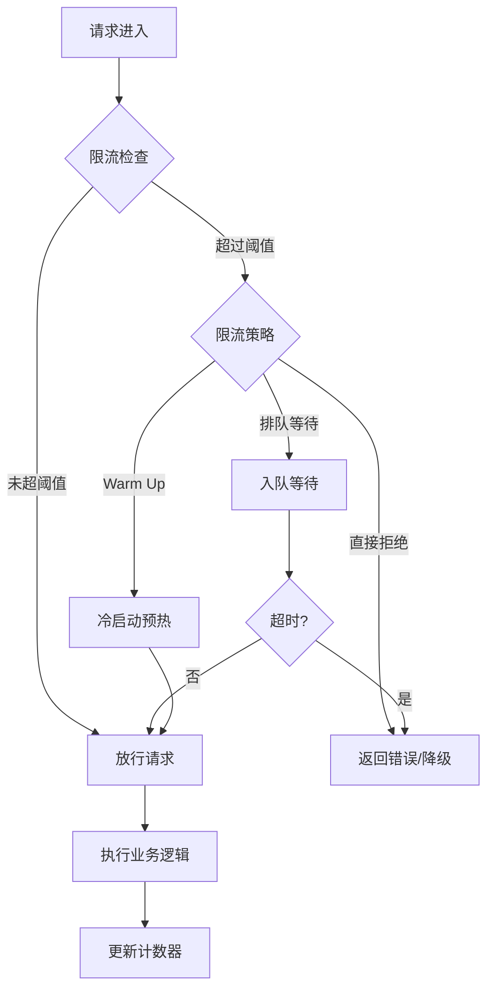
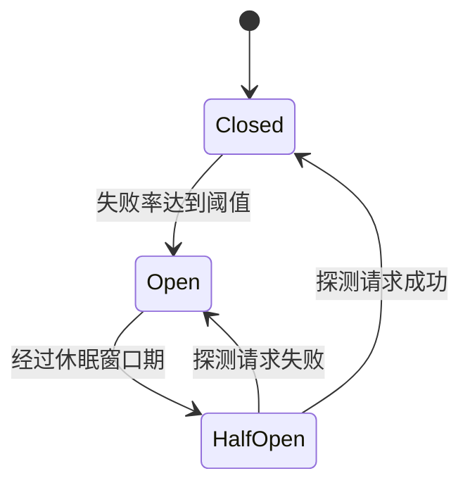
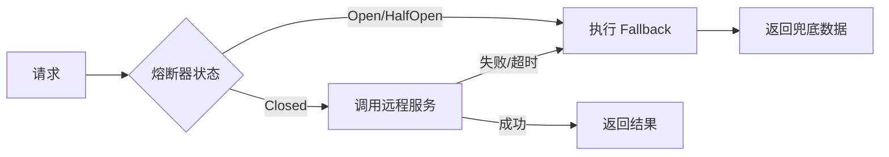

---
title: 流量控制
date: 2020-01-20 11:06:00
categories:
  - 分布式
  - 分布式调度
tags:
  - 分布式
  - 服务治理
  - 调度
  - 流量控制
  - 限流
  - 熔断
  - 降级
permalink: /pages/19f2cbb4/
---

# 流量控制

> 在高并发场景下，为了应对瞬时海量请求的压力，保障系统的平稳运行，必须预估系统的流量阈值，通过限流规则阻断处理不过来的请求。

## 流量控制简介

### 什么是流量控制

流量控制（Flow Control），根据流量、并发线程数、响应时间等指标，把随机到来的流量调整成合适的形状，即流量塑形。避免应用被瞬时的流量高峰冲垮，从而保障应用的高可用性。

### 为什么需要流量控制

复杂的分布式系统架构中的应用程序往往具有数十个依赖项，每个依赖项都会不可避免地在某个时刻失败。 如果主机应用程序未与这些外部故障隔离开来，则可能会被波及。

例如，对于依赖于 30 个服务的应用程序，假设每个服务的正常运行时间为 99.99％，则可以期望：

> 99.99<sup>30</sup> = 99.7％ 的正常运行时间
>
> 10 亿个请求中的 0.3％= 3,000,000 个失败
>
> 即使所有依赖项都具有出色的正常运行时间，每月也会有 2 个小时以上的停机时间。
>
> 然而，现实情况一般比这种估量情况更糟糕。

---

当一切正常时，整体系统如下所示：


图片来自 [Hystrix Wiki](https://github.com/Netflix/Hystrix/wiki)

在分布式系统架构下，这些强依赖的子服务稳定与否对系统的影响非常大。但是，依赖的子服务可能有很多不可控问题：如网络连接、资源繁忙、服务宕机等。例如：下图中有一个 QPS 为 50 的依赖服务 I 出现不可用，但是其他依赖服务是可用的。


图片来自 [Hystrix Wiki](https://github.com/Netflix/Hystrix/wiki)

当流量很大的情况下，某个依赖的阻塞，会导致上游服务请求被阻塞。当这种级联故障愈演愈烈，就可能造成整个线上服务不可用的雪崩效应，如下图。这种情况若持续恶化，如果上游服务本身还被其他服务所依赖，就可能出现多米洛骨牌效应，导致多个服务都无法正常工作。


图片来自 [Hystrix Wiki](https://github.com/Netflix/Hystrix/wiki)

### 流量控制有哪些保护机制

流量控制常见的手段就是限流、熔断、降级。

#### 什么是降级？

**降级**是保障服务能够稳定运行的一种保护方式：面对突增的流量，牺牲一些吞吐量以换取系统的稳定。常见的降级实现方式有：开关降级、限流降级、熔断降级。

#### 什么是限流？

限流一般针对下游服务，当上游流量较大时，避免被上游服务的请求撑爆。

**限流**就是限制系统的输入和输出流量，以达到保护系统的目的。一般来说系统的吞吐量是可以被测算的，为了保证系统的稳定运行，一旦达到的需要限制的阈值，就需要限制流量并采取一些措施以完成限制流量的目的。比如：延迟处理，拒绝处理，或者部分拒绝处理等等。

限流规则包含三个部分：时间粒度，接口粒度，最大限流值。限流规则设置是否合理直接影响到限流是否合理有效。

#### 什么是熔断？

熔断一般针对上游服务，当下游服务超时/异常较多时，避免被下游服务拖垮。

当调用链路中某个资源出现不稳定，例如，超时异常比例升高的时候，则对这个资源的调用进行限制，并让请求快速失败，避免影响到其它的资源，最终产生雪崩的效果。

熔断尽最大的可能去完成所有的请求，容忍一些失败，熔断也能自动恢复。熔断的常见策略有：

- 在每秒请求异常数超过多少时触发熔断降级
- 在每秒请求异常错误率超过多少时触发熔断降级
- 在每秒请求平均耗时超过多少时触发熔断降级

### 流量控制有哪些衡量指标

流量控制有以下几个角度：

- 流量指标，例如 QPS、并发线程数等。
- 资源的调用关系，例如资源的调用链路，资源和资源之间的关系，调用来源等。
- 控制效果，例如排队等待、直接拒绝、Warm Up（预热）等。

## 流量控制的特性

流量控制系统具备以下核心特性：

| 特性       | 说明                                                                 |
| ---------- | -------------------------------------------------------------------- |
| 多维度限流 | 支持 QPS、并发线程数、调用关系等多维度限流                           |
| 动态规则   | 限流规则可动态调整，无需重启应用                                     |
| 多种算法   | 支持固定窗口、滑动窗口、漏桶、令牌桶等多种限流算法                   |
| 实时监控   | 实时采集流量指标，支持可视化监控和告警                               |
| 自动恢复   | 熔断后自动探测下游服务恢复情况，自动从半开状态恢复                   |
| 降级兜底   | 限流或熔断触发后，提供 fallback 逻辑，保证用户体验                  |
| 链路统计   | 支持按调用链路统计资源访问情况，定位瓶颈                             |
| 集群限流   | 支持基于集中存储（如 Redis）的集群级限流，避免单机限流不均匀         |

## 流量控制的原理

### 限流原理

限流的核心是**在一定时间窗口内，对资源的访问进行计数和控制**。其工作流程如下：



### 熔断原理

熔断器（Circuit Breaker）借鉴了电路中保险丝的原理，当下游服务故障率达到阈值时，自动"跳闸"切断请求，防止级联故障。



三种状态说明：

| 状态     | 说明                                                     |
| -------- | -------------------------------------------------------- |
| Closed   | 正常状态，所有请求放行，持续统计失败率                   |
| Open     | 熔断状态，所有请求被快速拒绝，直接执行 fallback          |
| HalfOpen | 半开状态，放行少量探测请求，根据结果决定恢复或继续熔断   |

### 降级原理

降级是在系统压力过大时，主动放弃部分非核心功能，保证核心功能可用的策略。降级分为：

- **主动降级**：通过开关手动触发，如大促期间关闭推荐、评论等功能。
- **自动降级**：由限流或熔断自动触发，调用预设的 fallback 逻辑。



## 限流算法

限流的本质是：在一定的时间范围内，限制某一个资源被访问的频率。如何去限制流量，就需要采用一定的策略，即限流算法。常见的限流算法有：固定窗口限流算法、滑动窗口限流算法、漏桶限流算法、令牌桶限流算法。

下面，将对这几种算法进行一一介绍。

### 固定窗口限流算法

#### 固定窗口限流算法的原理

固定窗口限流算法的**基本策略**是：

1. 设置一个固定时间窗口，以及这个固定时间窗口内的最大请求数；
2. 为每个固定时间窗口设置一个计数器，用于统计请求数；
3. 一旦请求数超过最大请求数，则请求会被拦截。


#### 固定窗口限流算法的利弊

固定窗口限流算法的**优点**是：实现简单。

固定窗口限流算法的**缺点**是：存在**临界问题**。所谓临界问题，是指：流量分别集中在一个固定时间窗口的尾部和一个固定时间窗口的头部。举例来说，假设限流规则为每分钟不超过 100 次请求。在第一个时间窗口中，起初没有任何请求，在最后 1 s，收到 100 次请求，由于没有达到阈值，所有请求都通过；在第二个时间窗口中，第 1 秒就收到 100 次请求，而后续没有任何请求。虽然，这两个时间窗口内的流量都符合限流要求，但是在两个时间窗口临界的这 2s 内，实际上有 200 次请求，显然是超过预期吞吐量的，存在压垮系统的可能。


#### 固定窗口限流算法的实现

:::details Java 版本的固定窗口限流算法

```java
import java.util.concurrent.TimeUnit;
import java.util.concurrent.atomic.AtomicLong;

public class SlidingWindowRateLimiter implements RateLimiter {

    /**
     * 允许的最大请求数
     */
    private final long maxPermits;

    /**
     * 窗口期时长
     */
    private long periodMillis;

    /**
     * 分片窗口期时长
     */
    private final long shardPeriodMillis;

    /**
     * 窗口期截止时间
     */
    private long lastPeriodMillis;

    /**
     * 分片窗口数
     */
    private final int shardNum;

    /**
     * 请求总计数
     */
    private final AtomicLong totalCount = new AtomicLong(0);

    /**
     * 分片窗口计数列表
     */
    private final List<AtomicLong> countList = new LinkedList<>();

    public SlidingWindowRateLimiter(long qps, int shardNum) {
        this(qps, 1000, TimeUnit.MILLISECONDS, shardNum);
    }

    public SlidingWindowRateLimiter(long maxPermits, long period, TimeUnit timeUnit, int shardNum) {
        this.maxPermits = maxPermits;
        this.periodMillis = timeUnit.toMillis(period);
        this.lastPeriodMillis = System.currentTimeMillis();
        this.shardPeriodMillis = timeUnit.toMillis(period) / shardNum;
        this.shardNum = shardNum;
        for (int i = 0; i < shardNum; i++) {
            countList.add(new AtomicLong(0));
        }
    }

    @Override
    public synchronized boolean tryAcquire(int permits) {
        long now = System.currentTimeMillis();
        if (now > lastPeriodMillis) {
            for (int shardId = 0; shardId < shardNum; shardId++) {
                long shardCount = countList.get(shardId).get();
                totalCount.addAndGet(-shardCount);
                countList.set(shardId, new AtomicLong(0));
                lastPeriodMillis += shardPeriodMillis;
            }
        }
        int shardId = (int) (now % periodMillis / shardPeriodMillis);
        if (totalCount.get() + permits <= maxPermits) {
            countList.get(shardId).addAndGet(permits);
            totalCount.addAndGet(permits);
            return true;
        } else {
            return false;
        }
    }

}
```

:::

### 滑动窗口限流算法

#### 滑动窗口限流算法的原理

滑动窗口限流算法是对固定窗口限流算法的改进，解决了临界问题。

滑动窗口限流算法的**基本策略**是：

- 将固定时间窗口分片为多个子窗口，每个子窗口的访问次数独立统计；
- 当请求时间大于当前子窗口的最大时间时，则将当前子窗口废弃，并将计时窗口向前滑动，并将下一个子窗口置为当前窗口。
- 要保证所有子窗口的统计数之和不能超过阈值。

滑动窗口限流算法就是针对固定窗口限流算法的更细粒度的控制，分片越多，则限流越精准。


#### 滑动窗口限流算法的利弊

滑动窗口限流算法的**优点**是：在滑动窗口限流算法中，临界位置的突发请求都会被算到时间窗口内，因此可以解决计数器算法的临界问题。

滑动窗口限流算法的**缺点**是：

- **额外的内存开销** - 滑动时间窗口限流算法的时间窗口是持续滑动的，并且除了需要一个计数器来记录时间窗口内接口请求次数之外，还需要记录在时间窗口内每个接口请求到达的时间点，所以存在额外的内存开销。
- **限流的控制粒度受限于窗口分片粒度** - 滑动窗口限流算法，**只能在选定的时间粒度上限流，对选定时间粒度内的更加细粒度的访问频率不做限制**。但是，由于每个分片窗口都有额外的内存开销，所以也并不是分片数越多越好的。

#### 滑动窗口限流算法的实现

:::details Java 版本的滑动窗口限流算法

```java
import java.util.LinkedList;
import java.util.List;
import java.util.concurrent.TimeUnit;
import java.util.concurrent.atomic.AtomicLong;

public class SlidingWindowRateLimiter implements RateLimiter {

    /**
     * 允许的最大请求数
     */
    private final long maxPermits;

    /**
     * 窗口期时长
     */
    private final long periodMillis;

    /**
     * 分片窗口期时长
     */
    private final long shardPeriodMillis;

    /**
     * 窗口期截止时间
     */
    private long lastPeriodMillis;

    /**
     * 分片窗口数
     */
    private final int shardNum;

    /**
     * 请求总计数
     */
    private final AtomicLong totalCount = new AtomicLong(0);

    /**
     * 分片窗口计数列表
     */
    private final List<AtomicLong> countList = new LinkedList<>();

    public SlidingWindowRateLimiter(long qps, int shardNum) {
        this(qps, 1000, TimeUnit.MILLISECONDS, shardNum);
    }

    public SlidingWindowRateLimiter(long maxPermits, long period, TimeUnit timeUnit, int shardNum) {
        this.maxPermits = maxPermits;
        this.periodMillis = timeUnit.toMillis(period);
        this.lastPeriodMillis = System.currentTimeMillis();
        this.shardPeriodMillis = timeUnit.toMillis(period) / shardNum;
        this.shardNum = shardNum;
        for (int i = 0; i < shardNum; i++) {
            countList.add(new AtomicLong(0));
        }
    }

    @Override
    public synchronized boolean tryAcquire(int permits) {
        long now = System.currentTimeMillis();
        if (now > lastPeriodMillis) {
            for (int shardId = 0; shardId < shardNum; shardId++) {
                long shardCount = countList.get(shardId).get();
                totalCount.addAndGet(-shardCount);
                countList.set(shardId, new AtomicLong(0));
                lastPeriodMillis += shardPeriodMillis;
            }
        }
        int shardId = (int) (now % periodMillis / shardPeriodMillis);
        if (totalCount.get() + permits <= maxPermits) {
            countList.get(shardId).addAndGet(permits);
            totalCount.addAndGet(permits);
            return true;
        } else {
            return false;
        }
    }

}
```

:::

### 漏桶限流算法

#### 漏桶限流算法的原理

漏桶限流算法的**基本策略**是：

- 水（请求）以任意速率由入口进入到漏桶中；
- 水以固定的速率由出口出水（请求通过）；
- 漏桶的容量是固定的，如果水的流入速率大于流出速率，最终会导致漏桶中的水溢出（这意味着请求拒绝）。


#### 漏桶限流算法的利弊

漏桶限流算法的**优点**是：**流量速率固定**——即无论流量多大，即便是突发的大流量，处理请求的速度始终是固定的。

漏桶限流算法的**缺点**是：不能灵活的调整流量。例如：一个集群通过增减节点的方式，弹性伸缩了其吞吐能力，漏桶限流算法无法随之调整。

**漏桶策略适用于间隔性突发流量且流量不用即时处理的场景**。

#### 漏桶限流算法的实现

:::details Java 版本的漏桶限流算法

```java
import java.util.concurrent.atomic.AtomicLong;

public class LeakyBucketRateLimiter implements RateLimiter {

    /**
     * QPS
     */
    private final int qps;

    /**
     * 桶的容量
     */
    private final long capacity;

    /**
     * 计算的起始时间
     */
    private long beginTimeMillis;

    /**
     * 桶中当前的水量
     */
    private final AtomicLong waterNum = new AtomicLong(0);

    public LeakyBucketRateLimiter(int qps, int capacity) {
        this.qps = qps;
        this.capacity = capacity;
    }

    @Override
    public synchronized boolean tryAcquire(int permits) {

        // 如果桶中没有水，直接通过
        if (waterNum.get() == 0) {
            beginTimeMillis = System.currentTimeMillis();
            waterNum.addAndGet(permits);
            return true;
        }

        // 计算水量
        long leakedWaterNum = ((System.currentTimeMillis() - beginTimeMillis) / 1000) * qps;
        long currentWaterNum = waterNum.get() - leakedWaterNum;
        waterNum.set(Math.max(0, currentWaterNum));

        // 重置时间
        beginTimeMillis = System.currentTimeMillis();

        if (waterNum.get() + permits < capacity) {
            waterNum.addAndGet(permits);
            return true;
        } else {
            return false;
        }
    }

}
```

:::

### 令牌桶限流算法

#### 令牌桶限流算法的原理


令牌桶算法的**原理**：

1. 接口限制 T 秒内最大访问次数为 N，则每隔 T/N 秒会放一个 token 到桶中
2. 桶内最多存放 M 个 token，如果 token 到达时令牌桶已经满了，那么这个 token 就会被丢弃
3. 接口请求会先从令牌桶中取 token，拿到 token 则处理接口请求，拿不到 token 则进行限流处理

#### 令牌桶限流算法的利弊

因为令牌桶存放了很多令牌，那么大量的突发请求会被执行，但是它不会出现临界问题，在令牌用完之后，令牌是以一个恒定的速率添加到令牌桶中的，因此不能再次发送大量突发请求。

规定固定容量的桶，token 以固定速度往桶内填充，当桶满时 token 不会被继续放入，每过来一个请求把 token 从桶中移除，如果桶中没有 token 不能请求。

**令牌桶算法适用于有突发特性的流量，且流量需要即时处理的场景**。

#### 令牌桶限流算法的实现

:::details Java 实现令牌桶算法

```java
import java.util.concurrent.atomic.AtomicLong;

/**
 * 令牌桶限流算法
 *
 * @author <a href="mailto:forbreak@163.com">Zhang Peng</a>
 * @date 2024-01-18
 */
public class TokenBucketRateLimiter implements RateLimiter {

    /**
     * QPS
     */
    private final long qps;

    /**
     * 桶的容量
     */
    private final long capacity;

    /**
     * 上一次令牌发放时间
     */
    private long endTimeMillis;

    /**
     * 桶中当前的令牌数量
     */
    private final AtomicLong tokenNum = new AtomicLong(0);

    public TokenBucketRateLimiter(long qps, long capacity) {
        this.qps = qps;
        this.capacity = capacity;
        this.endTimeMillis = System.currentTimeMillis();
    }

    @Override
    public synchronized boolean tryAcquire(int permits) {

        long now = System.currentTimeMillis();
        long gap = now - endTimeMillis;

        // 计算令牌数
        long newTokenNum = (gap * qps / 1000);
        long currentTokenNum = tokenNum.get() + newTokenNum;
        tokenNum.set(Math.min(capacity, currentTokenNum));

        if (tokenNum.get() < permits) {
            return false;
        } else {
            tokenNum.addAndGet(-permits);
            endTimeMillis = now;
            return true;
        }
    }

}
```

:::

> **扩展**
>
> Guava 的 RateLimiter 工具类就是基于令牌桶算法实现，其源码分析可以参考：[RateLimiter 基于漏桶算法，但它参考了令牌桶算法](https://blog.csdn.net/forezp/article/details/100060686)

### 限流算法测试

:::details 限流算法测试

```java
import cn.hutool.core.thread.ThreadUtil;
import cn.hutool.core.util.RandomUtil;
import lombok.extern.slf4j.Slf4j;

import java.util.concurrent.CountDownLatch;
import java.util.concurrent.ExecutorService;
import java.util.concurrent.TimeUnit;
import java.util.concurrent.atomic.AtomicInteger;

@Slf4j
public class RateLimiterDemo {

    public static void main(String[] args) {

        // ============================================================================

        int qps = 20;

        System.out.println("======================= 固定时间窗口限流算法 =======================");
        FixedWindowRateLimiter fixedWindowRateLimiter = new FixedWindowRateLimiter(qps);
        testRateLimit(fixedWindowRateLimiter, qps);

        System.out.println("======================= 滑动时间窗口限流算法 =======================");
        SlidingWindowRateLimiter slidingWindowRateLimiter = new SlidingWindowRateLimiter(qps, 10);
        testRateLimit(slidingWindowRateLimiter, qps);

        System.out.println("======================= 漏桶限流算法 =======================");
        LeakyBucketRateLimiter leakyBucketRateLimiter = new LeakyBucketRateLimiter(qps, 100);
        testRateLimit(leakyBucketRateLimiter, qps);

        System.out.println("======================= 令牌桶限流算法 =======================");
        TokenBucketRateLimiter tokenBucketRateLimiter = new TokenBucketRateLimiter(qps, 100);
        testRateLimit(tokenBucketRateLimiter, qps);
    }

    private static void testRateLimit(RateLimiter rateLimiter, int qps) {

        AtomicInteger okNum = new AtomicInteger(0);
        AtomicInteger limitNum = new AtomicInteger(0);
        ExecutorService executorService = ThreadUtil.newFixedExecutor(10, "限流测试", true);
        long beginTime = System.currentTimeMillis();

        int threadNum = 4;
        final CountDownLatch latch = new CountDownLatch(threadNum);
        for (int i = 0; i < threadNum; i++) {
            executorService.submit(() -> {
                try {
                    batchRequest(rateLimiter, okNum, limitNum, 1000);
                } catch (Exception e) {
                    log.error("发生异常！", e);
                } finally {
                    latch.countDown();
                }
            });
        }

        try {
            latch.await(10, TimeUnit.SECONDS);
            long endTime = System.currentTimeMillis();
            long gap = endTime - beginTime;
            log.info("限流 QPS: {} -> 实际结果：耗时 {} ms，{} 次请求成功，{} 次请求被限流，实际 QPS: {}",
                qps, gap, okNum.get(), limitNum.get(), okNum.get() * 1000 / gap);
            if (okNum.get() == qps) {
                log.info("限流符合预期");
            }
        } catch (Exception e) {
            log.error("发生异常！", e);
        } finally {
            executorService.shutdown();
        }
    }

    private static void batchRequest(RateLimiter rateLimiter, AtomicInteger okNum, AtomicInteger limitNum, int num)
        throws InterruptedException {
        for (int j = 0; j < num; j++) {
            if (rateLimiter.tryAcquire(1)) {
                log.info("请求成功");
                okNum.getAndIncrement();
            } else {
                log.info("请求限流");
                limitNum.getAndIncrement();
            }
            TimeUnit.MILLISECONDS.sleep(RandomUtil.randomInt(0, 10));
        }
    }

}
```

:::

## 限流框架 - Hystrix

Hystrix 是由 Netflix 开源，用于处理分布式系统的延迟和容错的一个开源组件。在分布式系统里，许多依赖不可避免的会调用失败，比如超时、异常等。Hystrix 采用**断路器模式**来实现服务间的彼此隔离，从而避免级联故障，以提高分布式系统整体的弹性。

“断路器”本身是一种开关装置，当某个服务单元发生故障之后，通过断路器的故障监控（类似熔断保险丝），**向调用方返回一个符合预期的、可处理的备选响应（FallBack），而不是长时间的等待或者抛出调用方无法处理的异常**，这样就保证了服务调用方的线程不会被长时间、不必要地占用，从而避免了故障在分布式系统中的蔓延，乃至雪崩。

Hystrix 官方已宣布**不再发布新版本**。但是，Hystrix 的断路器设计理念，有非常高的学习价值。

如果使用 Hystrix 对每个基础依赖服务进行过载保护，则整个系统架构将会类似下图所示，每个依赖项彼此隔离，受到延迟时发生饱和的资源的被限制访问，并包含 fallback 逻辑（用于降级处理），该逻辑决定了在依赖项中发生任何类型的故障时做出对应的处理。


### Hystrix 原理

如下图所示，Hystrix 的工作流程大致可以分为 9 个步骤。


**（一）构建一个 HystrixCommand 或 HystrixObservableCommand 对象**

Hystrix 进行资源隔离，其实是提供了一个抽象，叫做**命令模式**。这也是 Hystrix 最基本的**资源隔离技术**。

在使用 Hystrix 的过程中，会对依赖服务的调用请求封装成命令对象，Hystrix 对 命令对象抽象了两个抽象类：`HystrixCommand` 和 `HystrixObservableCommand` 。

- `HystrixCommand` 表示的命令对象会返回一个唯一返回值。
- `HystrixObservableCommand` 表示的命令对象会返回多个返回值。

```java
HystrixCommand command = new HystrixCommand(arg1, arg2);
HystrixObservableCommand command = new HystrixObservableCommand(arg1, arg2);
```

**（二）执行命令**

Hystrix 中共有 4 种方式执行命令，如下所示：

| 执行方式                                                                                                                        | 说明                                                                                                                             | 可用对象                   |
| :------------------------------------------------------------------------------------------------------------------------------ | :------------------------------------------------------------------------------------------------------------------------------- | :------------------------- |
| [`execute()`](<http://netflix.github.io/Hystrix/javadoc/com/netflix/hystrix/HystrixCommand.html#execute()>)                     | 阻塞式同步执行，返回依赖服务的单一返回结果（或者抛出异常）                                                                       | `HystrixCommand`           |
| [`queue()`](<http://netflix.github.io/Hystrix/javadoc/com/netflix/hystrix/HystrixCommand.html#queue()>)                         | 异步执行，通过 `Future` 返回依赖服务的单一返回结果（或者抛出异常）                                                               | `HystrixCommand`           |
| [`observe()`](<http://netflix.github.io/Hystrix/javadoc/com/netflix/hystrix/HystrixObservableCommand.html#observe()>)           | 基于 Rxjava 的 Observable 方式，返回通过 Observable 表示的依赖服务返回结果。代调用代码先执行 (Hot Obserable)                     | `HystrixObservableCommand` |
| [`toObservable()`](<http://netflix.github.io/Hystrix/javadoc/com/netflix/hystrix/HystrixObservableCommand.html#toObservable()>) | 基于 Rxjava 的 Observable 方式，返回通过 Observable 表示的依赖服务返回结果。执行代码等到真正订阅的时候才会执行 (cold observable) | `HystrixObservableCommand` |

这四种命令中，`exeucte()`、`queue()`、`observe()` 的表示其实是通过 `toObservable()` 实现的，其转换关系如下图所示：


`HystrixCommand` 执行方式

```java
K value   = command.execute();
// 等价语句：
K value = command.execute().queue().get();

Future<K> fValue  = command.queue();
//等价语句：
Future<K> fValue = command.toObservable().toBlocking().toFuture();

Observable<K> ohValue = command.observe(); //hot observable，立刻订阅，命令立刻执行
//等价语句：
Observable<K> ohValue = command.toObservable().subscribe(subject);

// 上述执行最终实现还是基于 toObservable()
Observable<K> ocValue = command.toObservable(); //cold observable，延后订阅，订阅发生后，执行才真正执行
```

**（三）是否缓存**

如果当前命令对象启用了请求缓存，并且请求的响应存在于缓存中，则缓存的响应会立刻以 `Observable` 的形式返回。

**（四）是否开启断路器**

如果第三步没有缓存没有命中，则判断一下当前断路器的断路状态是否打开。如果断路器状态为打开状态，则 Hystrix 将不会执行此 Command 命令，直接执行步骤 8 调用 Fallback；

如果断路器状态是关闭，则执行步骤 5 检查是否有足够的资源运行 Command 命令

**（五）信号量、线程池是否拒绝**

当您执行该命令时，Hystrix 会检查断路器以查看电路是否打开。

如果电路开路（或“跳闸”），则 Hystrix 将不会执行该命令，而是将流程路由到 (8) 获取回退。

如果电路闭合，则流程前进至 (5) 以检查是否有可用容量来运行命令。

如果当前要执行的 Command 命令 先关连的线程池 和队列（或者信号量）资源已经满了，Hystrix 将不会运行 Command 命令，直接执行 **步骤 8 **的 Fallback 降级处理；如果未满，表示有剩余的资源执行 Command 命令，则执行**步骤 6**

**（六）`construct()` 或 `run()`**

当经过**步骤 5** 判断，有足够的资源执行 Command 命令时，本步骤将调用 Command 命令运行方法，基于不同类型的 Command，有如下两种两种运行方式：

| 运行方式                               | 说明                                                                     |
| :------------------------------------- | :----------------------------------------------------------------------- |
| `HystrixCommand.run()`                 | 返回一个处理结果或者抛出一个异常                                         |
| `HystrixObservableCommand.construct()` | 返回一个 Observable 表示的结果（可能多个），或者 基于`onError`的错误通知 |

如果`run()` 或者`construct()`方法 的`真实执行时间`超过了 Command 设置的`超时时间阈值`, 则**当前则执行线程**（或者是独立的定时器线程）将会抛出`TimeoutException`。抛出超时异常 TimeoutException，后，将执行**步骤 8 **的 Fallback 降级处理。即使`run()`或者`construct()`执行没有被取消或中断，最终能够处理返回结果，但在降级处理逻辑中，将会抛弃`run()`或`construct()`方法的返回结果，而返回 Fallback 降级处理结果。

> **注意事项**
> 需要注意的是，Hystrix 无法强制 将正在运行的线程停止掉--Hystrix 能够做的最好的方式就是在 JVM 中抛出一个`InterruptedException`。如果 Hystrix 包装的工作不抛出中断异常`InterruptedException`, 则在 Hystrix 线程池中的线程将会继续执行，尽管`调用的客户端`已经接收到了`TimeoutException`。这种方式会使 Hystrix 的线程池处于饱和状态。大部分的 Java Http Client 开源库并不会解析 `InterruptedException`。所以确认 HTTP client 相关的连接和读/写相关的超时时间设置。
> 如果 Command 命令没有抛出任何异常，并且有返回结果，则 Hystrix 将会在做完日志记录和统计之后会将结果返回。 如果是通过`run()`方式运行，则返回一个`Obserable`对象，包含一个唯一值，并且发送一个`onCompleted`通知；如果是通过`consturct()`方式运行 ，则返回一个`Observable 对象`。

**（七）健康检查**

Hystrix 会统计 Command 命令执行执行过程中的**成功数**、**失败数**、**拒绝数**和**超时数**, 将这些信息记录到**断路器 (Circuit Breaker) **中。断路器将上述统计按照**时间窗**的形式记录到一个定长数组中。断路器根据时间窗内的统计数据去判定请求什么时候可以被熔断，熔断后，在接下来一段恢复周期内，相同的请求过来后会直接被熔断。当再次校验，如果健康监测通过后，熔断开关将会被关闭。

**（八）获取 Fallback**

当以下场景出现后，Hystrix 将会尝试触发 `Fallback`:

> - 步骤 6 Command 执行时抛出了任何异常；
> - 步骤 4 断路器已经被打开
> - 步骤 5 执行命令的线程池、队列或者信号量资源已满
> - 命令执行的时间超过阈值

**（九）返回结果**

如果 Hystrix 命令对象执行成功，将会返回结果，或者以`Observable`形式包装的结果。根据**步骤 2 **的 command 调用方式，返回的`Observable` 会按照如下图说是的转换关系进行返回：


- `execute()` — 用和 `.queue()` 相同的方式获取 `Future`，然后调用 `Future` 的 `get()` 以获取 `Observable` 的单个值。
- `queue()` —将 `Observable` 转换为 `BlockingObservable`，以便可以将其转换为 `Future` 并返回。
- `watch()` —订阅 `Observable` 并开始执行命令的流程； 返回一个 `Observable`，当订阅该 `Observable` 时，它会重新通知。
- `toObservable()` —返回不变的 `Observable`； 必须订阅它才能真正开始执行命令的流程。

### 断路器工作原理


1. 断路器时间窗内的请求数是否超过了**请求数断路器生效阈值**`circuitBreaker.requestVolumeThreshold`，如果超过了阈值，则将会触发断路，断路状态为**开启**
   例如，如果当前阈值设置的是`20`，则当时间窗内统计的请求数共计 19 个，即使 19 个全部失败了，都不会触发断路器。
2. 并且请求错误率超过了**请求错误率阈值**`errorThresholdPercentage`
3. 如果两个都满足，则将断路器由**关闭**迁移到**开启**
4. 如果断路器开启，则后续的所有相同请求将会被断路掉；
5. 直到过了**沉睡时间窗**`sleepWindowInMilliseconds`后，再发起请求时，允许其通过（此时的状态为**半开起状态**）。如果请求失败了，则保持断路器状态为**开启**状态，并更新**沉睡时间窗**。如果请求成功了，则将断路器状态改为**关闭**状态；

核心的逻辑如下：

```java
@Override
public void onNext(HealthCounts hc) {
    // check if we are past the statisticalWindowVolumeThreshold
    if (hc.getTotalRequests() < properties.circuitBreakerRequestVolumeThreshold().get()) {
        // we are not past the minimum volume threshold for the stat window,
        // so no change to circuit status.
        // if it was CLOSED, it stays CLOSED
        // if it was half-open, we need to wait for a successful command execution
        // if it was open, we need to wait for sleep window to elapse
    } else {
        if (hc.getErrorPercentage() < properties.circuitBreakerErrorThresholdPercentage().get()) {
            //we are not past the minimum error threshold for the stat window,
            // so no change to circuit status.
            // if it was CLOSED, it stays CLOSED
            // if it was half-open, we need to wait for a successful command execution
            // if it was open, we need to wait for sleep window to elapse
        } else {
            // our failure rate is too high, we need to set the state to OPEN
            if (status.compareAndSet(Status.CLOSED, Status.OPEN)) {
                circuitOpened.set(System.currentTimeMillis());
            }
        }
    }
}
```

## 限流框架 - Sentinel

> [Sentinel](https://github.com/alibaba/Sentinel) 是阿里巴巴开源的面向分布式服务架构的流量控制组件，以流量为切入点，从**流量控制、熔断降级、系统负载保护**等多个维度来保护服务的稳定性。

### Sentinel 特性

Sentinel 具有以下核心特性：

- **丰富的应用场景**：承接了阿里巴巴近 10 年的双十一大促流量的核心场景，如秒杀、消息削峰填谷、集群流量控制等。
- **完备的实时监控**：提供控制台，可以实时监控应用和服务节点的流量、熔断、降级情况。
- **广泛的开源生态**：与 Spring Cloud、Dubbo、gRPC 等主流框架无缝集成。
- **完善的 SPI 扩展点**：可以通过 SPI 机制自定义规则存储、数据源、传输等。

### Sentinel 核心概念

| 概念          | 说明                                                         |
| ------------- | ------------------------------------------------------------ |
| Resource      | 资源，可以是接口、方法、代码块，是 Sentinel 保护的对象       |
| Rule          | 规则，围绕 Resource 设定的流量控制、熔断降级等规则           |
| Slot Chain    | 槽链，每个请求经过一系列处理槽，完成统计、规则检查等         |
| Context       | 上下文，代表一次调用的入口，持有调用链路信息                 |
| Node          | 节点，用于统计数据，如 QPS、响应时间、线程数等               |

### Sentinel 工作原理

Sentinel 的核心是 `ProcessorSlotChain`（处理槽链），请求依次经过各个 Slot 完成统计和规则检查：


### Sentinel 使用示例

`pom.xml` 依赖：

```xml
<dependencies>
    <dependency>
        <groupId>com.alibaba.csp</groupId>
        <artifactId>sentinel-core</artifactId>
        <version>1.8.6</version>
    </dependency>
    <dependency>
        <groupId>com.alibaba.csp</groupId>
        <artifactId>sentinel-annotation-aspectj</artifactId>
        <version>1.8.6</version>
    </dependency>
    <dependency>
        <groupId>com.alibaba.csp</groupId>
        <artifactId>sentinel-transport-simple-http</artifactId>
        <version>1.8.6</version>
    </dependency>
</dependencies>
```

基于注解的限流与降级：

```java
import com.alibaba.csp.sentinel.annotation.SentinelResource;
import com.alibaba.csp.sentinel.slots.block.BlockException;
import org.springframework.stereotype.Service;

@Service
public class OrderService {

    /**
     * 创建订单
     * - blockHandler 处理限流/熔断
     * - fallback 处理业务异常
     */
    @SentinelResource(value = "createOrder",
        blockHandler = "createOrderBlockHandler",
        fallback = "createOrderFallback")
    public String createOrder(String userId, String productId) {
        // 模拟业务逻辑
        if ("error".equals(productId)) {
            throw new RuntimeException("商品不存在");
        }
        return "订单创建成功: user=" + userId + ", product=" + productId;
    }

    /**
     * 限流/熔断处理方法（方法签名需与原方法一致，最后加 BlockException 参数）
     */
    public String createOrderBlockHandler(String userId, String productId, BlockException ex) {
        return "系统繁忙，请稍后重试";
    }

    /**
     * 降级处理方法（方法签名需与原方法一致，最后加 Throwable 参数）
     */
    public String createOrderFallback(String userId, String productId, Throwable ex) {
        return "订单创建失败，已降级处理: " + ex.getMessage();
    }
}
```

编程式限流配置：

```java
import com.alibaba.csp.sentinel.Entry;
import com.alibaba.csp.sentinel.SphU;
import com.alibaba.csp.sentinel.slots.block.BlockException;
import com.alibaba.csp.sentinel.slots.block.RuleConstant;
import com.alibaba.csp.sentinel.slots.block.flow.FlowRule;
import com.alibaba.csp.sentinel.slots.block.flow.FlowRuleManager;

import java.util.ArrayList;
import java.util.List;

public class SentinelFlowRuleDemo {

    public static void main(String[] args) {
        initFlowRules();

        for (int i = 0; i < 20; i++) {
            try (Entry entry = SphU.entry("helloSentinel")) {
                System.out.println("第 " + (i + 1) + " 次请求成功");
            } catch (BlockException e) {
                System.out.println("第 " + (i + 1) + " 次请求被限流: " + e.getClass().getSimpleName());
            }
        }
    }

    private static void initFlowRules() {
        List<FlowRule> rules = new ArrayList<>();

        // QPS 限流规则：每秒最多 10 个请求
        FlowRule qpsRule = new FlowRule();
        qpsRule.setResource("helloSentinel");
        qpsRule.setGrade(RuleConstant.FLOW_GRADE_QPS);
        qpsRule.setCount(10);
        rules.add(qpsRule);

        // 并发线程数限流规则：最多 5 个并发线程
        FlowRule threadRule = new FlowRule();
        threadRule.setResource("helloSentinel");
        threadRule.setGrade(RuleConstant.FLOW_GRADE_THREAD);
        threadRule.setCount(5);
        rules.add(threadRule);

        FlowRuleManager.loadRules(rules);
    }
}
```

## 流量控制的应用场景

### 秒杀活动限流

秒杀活动期间，瞬时流量可能是平时的数十倍。通过限流保护后端服务不被冲垮，超出阈值的请求快速拒绝并提示用户稍后重试。

### API 网关流量控制

在 API 网关层对不同接口、不同调用方设置差异化的限流规则，保护后端微服务。

### 依赖服务故障隔离

当下游依赖服务出现超时或异常时，通过熔断快速失败，避免线程池被耗尽，防止故障蔓延。

### 大促期间降级保核心

双十一等大促期间，主动降级非核心功能（如评论、推荐），将资源集中保障核心交易链路。

### 消息队列消费限流

消费者从消息队列拉取消息时，通过限流控制消费速率，避免消费者被大量消息压垮。

## 流量控制的最佳实践

### 案例一：基于 Sentinel 实现 Spring Cloud 接口限流

**场景**：电商系统的商品详情接口在秒杀期间面临高并发访问，需要实施 QPS 限流，超限请求返回降级数据。

`pom.xml` 依赖：

```xml
<dependencies>
    <dependency>
        <groupId>com.alibaba.cloud</groupId>
        <artifactId>spring-cloud-starter-alibaba-sentinel</artifactId>
    </dependency>
    <dependency>
        <groupId>org.springframework.boot</groupId>
        <artifactId>spring-boot-starter-web</artifactId>
    </dependency>
</dependencies>
```

`application.yml` 配置：

```yaml
server:
  port: 8080

spring:
  application:
    name: product-service
  cloud:
    sentinel:
      transport:
        dashboard: 127.0.0.1:8858   # Sentinel 控制台地址
        port: 8719                    # 客户端与控制台通信端口
      eager: true                     # 立即与控制台建立连接
```

接口实现：

```java
import com.alibaba.csp.sentinel.annotation.SentinelResource;
import com.alibaba.csp.sentinel.slots.block.BlockException;
import org.springframework.web.bind.annotation.GetMapping;
import org.springframework.web.bind.annotation.PathVariable;
import org.springframework.web.bind.annotation.RequestMapping;
import org.springframework.web.bind.annotation.RestController;

import java.util.HashMap;
import java.util.Map;

@RestController
@RequestMapping("/api/product")
public class ProductController {

    /**
     * 商品详情接口
     */
    @GetMapping("/{productId}")
    @SentinelResource(value = "getProductDetail",
        blockHandler = "getProductDetailBlockHandler",
        fallback = "getProductDetailFallback")
    public Map<String, Object> getProductDetail(@PathVariable String productId) {
        // 模拟业务逻辑
        if ("0".equals(productId)) {
            throw new IllegalArgumentException("商品不存在");
        }
        Map<String, Object> result = new HashMap<>();
        result.put("productId", productId);
        result.put("name", "iPhone 15 Pro");
        result.put("price", 7999);
        result.put("stock", 100);
        return result;
    }

    /**
     * 限流降级方法
     */
    public Map<String, Object> getProductDetailBlockHandler(String productId, BlockException ex) {
        Map<String, Object> result = new HashMap<>();
        result.put("code", "RATE_LIMITED");
        result.put("message", "当前访问人数过多，请稍后重试");
        result.put("productId", productId);
        return result;
    }

    /**
     * 异常降级方法
     */
    public Map<String, Object> getProductDetailFallback(String productId, Throwable ex) {
        Map<String, Object> result = new HashMap<>();
        result.put("code", "DEGRADED");
        result.put("message", "服务暂时不可用，已降级处理");
        result.put("productId", productId);
        return result;
    }
}
```

通过 Sentinel 控制台动态配置限流规则：

```java
import com.alibaba.csp.sentinel.slots.block.RuleConstant;
import com.alibaba.csp.sentinel.slots.block.flow.FlowRule;
import com.alibaba.csp.sentinel.slots.block.flow.FlowRuleManager;
import org.springframework.boot.ApplicationArguments;
import org.springframework.boot.ApplicationRunner;
import org.springframework.stereotype.Component;

import java.util.ArrayList;
import java.util.List;

@Component
public class FlowRuleInitializer implements ApplicationRunner {

    @Override
    public void run(ApplicationArguments args) {
        List<FlowRule> rules = new ArrayList<>();

        // 商品详情接口：QPS 限流，阈值 100
        FlowRule rule = new FlowRule();
        rule.setResource("getProductDetail");
        rule.setGrade(RuleConstant.FLOW_GRADE_QPS);
        rule.setCount(100);
        // 限流行为：直接拒绝
        rule.setControlBehavior(RuleConstant.CONTROL_BEHAVIOR_DEFAULT);
        rules.add(rule);

        FlowRuleManager.loadRules(rules);
    }
}
```

**说明**：`@SentinelResource` 注解标记的资源会被 Sentinel 自动监控。`blockHandler` 处理限流/熔断被拒绝的情况，`fallback` 处理业务异常的降级。限流规则可以通过控制台动态推送，无需重启应用。

### 案例二：基于 Resilience4j 实现熔断降级

**场景**：订单服务调用远程的库存服务，库存服务不稳定时需要熔断，避免订单服务被拖垮。

> Resilience4j 是受 Netflix Hystrix 启发的轻量级容错库，专为 Java 8 和函数式编程设计。Hystrix 已停止维护，Resilience4j 是官方推荐的替代方案。

`pom.xml` 依赖：

```xml
<dependencies>
    <dependency>
        <groupId>io.github.resilience4j</groupId>
        <artifactId>resilience4j-spring-boot2</artifactId>
        <version>2.1.0</version>
    </dependency>
    <dependency>
        <groupId>io.github.resilience4j</groupId>
        <artifactId>resilience4j-reactor</artifactId>
        <version>2.1.0</version>
    </dependency>
    <dependency>
        <groupId>org.springframework.boot</groupId>
        <artifactId>spring-boot-starter-aop</artifactId>
    </dependency>
    <dependency>
        <groupId>org.springframework.boot</groupId>
        <artifactId>spring-boot-starter-web</artifactId>
    </dependency>
</dependencies>
```

`application.yml` 熔断器配置：

```yaml
resilience4j:
  circuitbreaker:
    configs:
      default:
        # 失败率阈值（百分比），超过则打开熔断器
        failure-rate-threshold: 50
        # 慢调用阈值（秒），超过则视为慢调用
        slow-call-duration-threshold: 3s
        # 慢调用率阈值（百分比），超过则打开熔断器
        slow-call-rate-threshold: 60
        # 半开状态允许的请求数
        permitted-number-of-calls-in-half-open-state: 5
        # 滑动窗口大小（请求数）
        sliding-window-size: 20
        # 滑动窗口类型：COUNT_BASED 或 TIME_BASED
        sliding-window-type: COUNT_BASED
        # 计算失败率所需的最小请求数
        minimum-number-of-calls: 10
        # 熔断器从打开到半开的等待时间
        wait-duration-in-open-state: 10s
        # 自动从打开转为半开
        automatic-transition-from-open-to-half-open-enabled: true
        # 哪些异常视为失败
        record-exceptions:
          - java.io.IOException
          - java.util.concurrent.TimeoutException
    instances:
      inventoryService:
        base-config: default
  # 重试配置
  retry:
    instances:
      inventoryService:
        max-attempts: 3
        wait-duration: 1s
```

使用注解的熔断降级：

```java
import io.github.resilience4j.circuitbreaker.annotation.CircuitBreaker;
import io.github.resilience4j.retry.annotation.Retry;
import org.springframework.stereotype.Service;
import org.springframework.web.client.RestTemplate;

@Service
public class InventoryClient {

    private final RestTemplate restTemplate = new RestTemplate();

    /**
     * 调用库存服务，配置熔断和重试
     */
    @CircuitBreaker(name = "inventoryService", fallbackMethod = "fallbackGetStock")
    @Retry(name = "inventoryService", fallbackMethod = "fallbackGetStock")
    public int getStock(String productId) {
        String url = "http://inventory-service/api/stock/" + productId;
        return restTemplate.getForObject(url, Integer.class);
    }

    /**
     * 熔断/重试降级方法（参数和返回值需与原方法一致，最后加 Throwable 参数）
     */
    public int fallbackGetStock(String productId, Throwable ex) {
        // 返回默认库存值，保证订单流程继续
        return 0;
    }
}
```

**说明**：当库存服务连续失败或响应过慢达到阈值时，熔断器打开，后续请求直接走 `fallbackMethod`，不再调用远程服务。经过 `wait-duration-in-open-state` 后自动进入半开状态，放行少量请求探测恢复情况。

### 案例三：基于 Redis + Lua 实现分布式集群限流

**场景**：微服务集群部署多个实例，单机限流无法控制整体 QPS，需要基于 Redis 实现集群级限流。

限流 Lua 脚本 `cluster_rate_limit.lua`：

```lua
local key = KEYS[1]
local permits = tonumber(ARGV[1])
local capacity = tonumber(ARGV[2])
local refillRate = tonumber(ARGV[3])  -- 每秒填充的令牌数
local nowMillis = tonumber(ARGV[4])

-- 获取当前令牌数和上次更新时间
local lastTokens = tonumber(redis.call("hget", key, "tokens"))
local lastRefillMillis = tonumber(redis.call("hget", key, "last_refill"))

if lastTokens == nil then
    lastTokens = capacity
end
if lastRefillMillis == nil then
    lastRefillMillis = nowMillis
end

-- 计算新增的令牌数
local elapsed = math.max(0, nowMillis - lastRefillMillis)
local newTokens = math.min(capacity, lastTokens + (elapsed * refillRate / 1000))

if newTokens < permits then
    -- 令牌不足，拒绝
    return 0
else
    -- 消耗令牌
    local remaining = newTokens - permits
    redis.call("hset", key, "tokens", remaining)
    redis.call("hset", key, "last_refill", nowMillis)
    -- 设置过期时间，避免无用 key 堆积
    redis.call("expire", key, 60)
    return 1
end
```

Java 调用实现：

```java
import org.springframework.data.redis.core.StringRedisTemplate;
import org.springframework.data.redis.core.script.DefaultRedisScript;
import org.springframework.stereotype.Component;

import java.util.Collections;
import java.util.List;

@Component
public class ClusterRateLimiter {

    private final StringRedisTemplate redisTemplate;
    private final DefaultRedisScript<Long> script;

    public ClusterRateLimiter(StringRedisTemplate redisTemplate) {
        this.redisTemplate = redisTemplate;
        this.script = new DefaultRedisScript<>();
        this.script.setLocation(new org.springframework.core.io.ClassPathResource("lua/cluster_rate_limit.lua"));
        this.script.setResultType(Long.class);
    }

    /**
     * 尝试获取令牌
     *
     * @param resourceKey 资源标识
     * @param permits     请求的令牌数
     * @param capacity    令牌桶容量
     * @param refillRate  令牌填充速率（个/秒）
     * @return true=通过 false=限流
     */
    public boolean tryAcquire(String resourceKey, int permits, int capacity, int refillRate) {
        String key = "rate_limit:" + resourceKey;
        long now = System.currentTimeMillis();
        List<String> keys = Collections.singletonList(key);
        Long result = redisTemplate.execute(script, keys,
            String.valueOf(permits),
            String.valueOf(capacity),
            String.valueOf(refillRate),
            String.valueOf(now));
        return result != null && result == 1L;
    }
}
```

使用示例：

```java
import org.springframework.web.bind.annotation.GetMapping;
import org.springframework.web.bind.annotation.RestController;

@RestController
public class ApiController {

    private final ClusterRateLimiter rateLimiter;

    public ApiController(ClusterRateLimiter rateLimiter) {
        this.rateLimiter = rateLimiter;
    }

    @GetMapping("/api/data")
    public String getData() {
        // 集群级限流：QPS 100，桶容量 200（允许短时突发）
        if (!rateLimiter.tryAcquire("api_data", 1, 200, 100)) {
            return "请求过于频繁，请稍后重试";
        }
        return "请求成功";
    }
}
```

**说明**：基于 Redis + Lua 的令牌桶算法保证原子性，所有实例共享 Redis 上的令牌桶，实现集群级精准限流。相比单机限流，集群限流能准确控制整体流量，但引入了 Redis 网络开销。

## 流量控制的常见问题

### 问题一：限流阈值设置不合理导致误杀正常请求

**问题描述**：接口设置了 QPS 限流，但日常流量高峰期频繁出现限流，正常用户请求被拒绝。

**原因分析**：

1. **阈值设置过低**：未充分评估业务高峰期的真实流量，阈值低于实际峰值。
2. **未区分接口重要性**：核心接口和非核心接口使用相同限流策略。
3. **冷启动问题**：系统刚启动时资源未预热（如 JVM 未预热、缓存未加载），低 QPS 下响应也慢。

**解决方案**：

1. **基于压测数据设定阈值**：通过压力测试确定接口的最大承载能力，阈值设置为最大承载能力的 70-80%。

```java
// Sentinel 冷启动（Warm Up）规则
FlowRule warmUpRule = new FlowRule();
warmUpRule.setResource("getProductDetail");
warmUpRule.setGrade(RuleConstant.FLOW_GRADE_QPS);
warmUpRule.setCount(1000);  // 最终阈值
// 冷启动模式：系统刚开始时只允许低 QPS，随着时间推移逐渐提升到设定阈值
warmUpRule.setControlBehavior(RuleConstant.CONTROL_BEHAVIOR_WARM_UP);
warmUpRule.setWarmUpPeriodSec(30);  // 预热时长 30 秒
```

2. **分级限流策略**：为不同重要性的接口设置不同的限流阈值。

```java
// 核心交易接口：高阈值
FlowRule coreRule = new FlowRule();
coreRule.setResource("createOrder");
coreRule.setGrade(RuleConstant.FLOW_GRADE_QPS);
coreRule.setCount(5000);

// 查询接口：中阈值
FlowRule queryRule = new FlowRule();
queryRule.setResource("queryOrder");
queryRule.setGrade(RuleConstant.FLOW_GRADE_QPS);
queryRule.setCount(2000);

// 非核心接口：低阈值
FlowRule nonCoreRule = new FlowRule();
nonCoreRule.setResource("getRecommendation");
nonCoreRule.setGrade(RuleConstant.FLOW_GRADE_QPS);
nonCoreRule.setCount(500);
```

3. **使用排队等待而非直接拒绝**：对可容忍延迟的请求使用排队等待策略，平滑流量。

```java
FlowRule rule = new FlowRule();
rule.setResource("getProductDetail");
rule.setGrade(RuleConstant.FLOW_GRADE_QPS);
rule.setCount(1000);
// 排队等待：超出的请求进入队列，而非直接拒绝
rule.setControlBehavior(RuleConstant.CONTROL_BEHAVIOR_RATE_LIMITER);
rule.setMaxQueueingTimeMs(2000);  // 最大排队等待时间 2 秒
```

### 问题二：熔断器频繁在开闭之间震荡

**问题描述**：下游服务偶发性超时，导致熔断器反复打开和关闭，服务稳定性未得到改善。

**原因分析**：

1. **熔断窗口过小**：统计窗口内请求数太少，少量失败就触发熔断。
2. **恢复探测过快**：半开状态放行请求过早，下游服务尚未恢复又被打回。
3. **失败率阈值过低**：阈值过低导致偶发失败就触发熔断。

**解决方案**：

1. **合理设置统计窗口和最小请求数**：确保统计样本足够，避免偶发失败误触发。

```yaml
# Resilience4j 配置
resilience4j:
  circuitbreaker:
    instances:
      downstreamService:
        sliding-window-size: 100           # 滑动窗口 100 个请求
        minimum-number-of-calls: 20        # 至少 20 个请求才计算失败率
        failure-rate-threshold: 60         # 失败率 60% 才熔断
        wait-duration-in-open-state: 30s   # 熔断后等待 30 秒再探测
        permitted-number-of-calls-in-half-open-state: 10  # 半开状态放行 10 个请求
```

2. **配合重试机制**：偶发超时先重试，多次重试失败再熔断。

```java
@CircuitBreaker(name = "downstreamService", fallbackMethod = "fallback")
@Retry(name = "downstreamService", fallbackMethod = "fallback")
public String callDownstream() {
    // 业务调用
}
```

3. **区分慢调用和错误调用**：慢调用不一定代表服务不可用，可设置单独的慢调用熔断策略。

```yaml
resilience4j:
  circuitbreaker:
    instances:
      downstreamService:
        slow-call-duration-threshold: 5s    # 超过 5 秒视为慢调用
        slow-call-rate-threshold: 80        # 慢调用率超过 80% 才熔断
        failure-rate-threshold: 50          # 失败率超过 50% 才熔断
```

### 问题三：单机限流在集群环境下不生效

**问题描述**：应用部署了 5 个实例，每个实例配置了 QPS=200 的限流，但数据库仍被打满（总 QPS 达到 1000）。

**原因分析**：单机限流只控制单实例的 QPS，5 个实例的总 QPS = 5 × 200 = 1000，远超数据库承受能力。单机限流无法感知集群整体的流量情况。

**解决方案**：改为**集群限流**，将限流计数集中存储到 Redis 等共享存储中。

```java
// 基于 Redis + Lua 的集群限流（完整实现见最佳实践案例三）
@Component
public class ClusterRateLimiter {

    public boolean tryAcquire(String resource, int permits, int totalQps, int capacity) {
        // 所有实例共享 Redis 上的令牌桶
        // totalQps 为集群总 QPS 阈值，而非单机 QPS
        return doAcquireFromRedis(resource, permits, totalQps, capacity);
    }
}

// 使用：集群总 QPS 设为 200，而非每台 200
@RestController
public class OrderController {

    @GetMapping("/api/order")
    public String createOrder() {
        if (!rateLimiter.tryAcquire("createOrder", 1, 200, 400)) {
            return "系统繁忙";
        }
        // 处理订单
        return "成功";
    }
}
```

**对比说明**：

| 限流方式   | 计数位置   | 优点                 | 缺点                         |
| ---------- | ---------- | -------------------- | ---------------------------- |
| 单机限流   | 本地内存   | 性能高，无网络开销   | 无法控制集群整体 QPS         |
| 集群限流   | Redis/DB   | 精准控制集群整体 QPS | 有网络开销，依赖存储可用性   |

对于核心资源（如数据库连接），推荐使用集群限流；对于单机资源（如 CPU），可使用单机限流。

## 参考资料

### Guava RateLimiter

Guava 是 Google 开源的 Java 类库，提供了一个工具类 `RateLimiter`，它基于令牌桶算法实现了本地限流器。

:::details RateLimiter 限流示例

```java
// 限流器流速：2 个请求/秒
RateLimiter limiter = RateLimiter.create(2.0);
// 执行任务的线程池
ExecutorService es = Executors.newFixedThreadPool(1);
// 记录上一次执行时间
prev = System.nanoTime();
// 测试执行 20 次
for (int i = 0; i < 20; i++) {
    // 限流器限流
    limiter.acquire();
    // 提交任务异步执行
    es.execute(() -> {
        long cur = System.nanoTime();
        // 打印时间间隔：毫秒
        System.out.println((cur - prev) / 1000000);
        prev = cur;
    });
}

// 输出结果：
// ...
// 500
// 499
// 500
// 499
```

:::

### Redis + Lua

如果想要针对分布式系统资源进行限流，则必须具备两个要素：

1. 对于资源的访问统计，必须是所有分布式节点都可以共享访问的数据存储；并且，由于在高并发场景下，读写访问统计数据会很频繁，该数据存储必须有很高的读写性能。
2. 访问统计、限流计算都以原子操作方式进行。

满足以上要素的一种简单解决方案是，采用 Redis + Lua 来实现，原因在于：

- Redis 数据库的读写性能极高；
- Redis 支持以原子操作的方式执行 Lua 脚本。

#### Redis + Lua 实现的固定窗口限流算法

Redis + Lua 实现的固定窗口限流算法实现思路：

- 根据实际需要，将当前时间格式化为天（`yyyyMMdd`）、时（`yyyyMMddHH`）、分（`yyyyMMddHHmm`）、秒（`yyyyMMddHHmmss`），并作为 Redis 的 String 类型 Key。该 Key 可以视为一个固定时间窗口，其中的 value 用于统计访问量；
- 用于代表不同粒度的时间窗口按需设置过期时间；
- 一旦达到窗口的限流阈值时，请求被限流；否则请求通过。

:::details Redis + Lua 实现的固定窗口限流算法

下面的代码片段模拟通过一个大小为 1 分钟的固定时间窗口进行限流，阈值为 100，过期时间 60s。

限流脚本 `fixed_window_rate_limit.lua` 代码：

```lua
-- 缓存 Key
local key = KEYS[1]
-- 访问请求数
local permits = tonumber(ARGV[1])
-- 过期时间
local seconds = tonumber(ARGV[2])
-- 限流阈值
local limit = tonumber(ARGV[3])

-- 获取统计值
local count = tonumber(redis.call('GET', key) or "0")

if count + permits > limit then
    -- 触发限流
    return 0
else
    redis.call('INCRBY', key, permits)
    redis.call('EXPIRE', key, seconds)
    return count + permits
end
```

调用 lua 的实际限流代码：

```java
import cn.hutool.core.collection.CollectionUtil;
import cn.hutool.core.io.FileUtil;
import cn.hutool.core.io.resource.ResourceUtil;
import cn.hutool.core.util.RandomUtil;
import cn.hutool.core.util.StrUtil;
import redis.clients.jedis.Jedis;
import redis.clients.jedis.exceptions.JedisConnectionException;

import java.nio.charset.StandardCharsets;
import java.util.Collections;
import java.util.List;
import java.util.concurrent.TimeUnit;

public class RedisFixedWindowRateLimiter implements RateLimiter {

    private static final String REDIS_HOST = "localhost";

    private static final int REDIS_PORT = 6379;

    private static final Jedis JEDIS;

    public static final String SCRIPT;

    static {
        // Jedis 有多种构造方法，这里选用最简单的一种情况
        JEDIS = new Jedis(REDIS_HOST, REDIS_PORT);

        // 触发 ping 命令
        try {
            JEDIS.ping();
            System.out.println("jedis 连接成功");
        } catch (JedisConnectionException e) {
            e.printStackTrace();
        }

        SCRIPT = FileUtil.readString(ResourceUtil.getResource("scripts/fixed_window_rate_limit.lua"),
            StandardCharsets.UTF_8);
    }

    private final long maxPermits;
    private final long periodSeconds;
    private final String key;

    public RedisFixedWindowRateLimiter(long qps, String key) {
        this(qps * 60, 60, TimeUnit.SECONDS, key);
    }

    public RedisFixedWindowRateLimiter(long maxPermits, long period, TimeUnit timeUnit, String key) {
        this.maxPermits = maxPermits;
        this.periodSeconds = timeUnit.toSeconds(period);
        this.key = key;
    }

    @Override
    public boolean tryAcquire(int permits) {
        List<String> keys = Collections.singletonList(key);
        List<String> args = CollectionUtil.newLinkedList(String.valueOf(permits), String.valueOf(periodSeconds),
            String.valueOf(maxPermits));
        Object eval = JEDIS.eval(SCRIPT, keys, args);
        long value = (long) eval;
        return value != -1;
    }

    public static void main(String[] args) throws InterruptedException {

        int qps = 20;
        RateLimiter jedisFixedWindowRateLimiter = new RedisFixedWindowRateLimiter(qps, "rate:limit:20240122210000");

        // 模拟在一分钟内，不断收到请求，限流是否有效
        int seconds = 60;
        long okNum = 0L;
        long total = 0L;
        long beginTime = System.currentTimeMillis();
        int num = RandomUtil.randomInt(qps, 100);
        for (int second = 0; second < seconds; second++) {
            for (int i = 0; i < num; i++) {
                total++;
                if (jedisFixedWindowRateLimiter.tryAcquire(1)) {
                    okNum++;
                    System.out.println("请求成功");
                } else {
                    System.out.println("请求限流");
                }
            }
            TimeUnit.SECONDS.sleep(1);
        }
        long endTime = System.currentTimeMillis();
        long time = (endTime - beginTime) / 1000;
        System.out.println(StrUtil.format("请求通过数：{}，总请求数：{}，实际 QPS：{}", okNum, total, okNum / time));
    }

}
```

:::

#### Redis + Lua 实现的令牌桶限流算法

:::details Redis + Lua 实现的令牌桶限流算法

限流脚本 `token_bucket_rate_limit.lua` 代码：

```lua
local tokenKey = KEYS[1]
local timeKey = KEYS[2]

-- 申请令牌数
local permits = tonumber(ARGV[1])
-- QPS
local qps = tonumber(ARGV[2])
-- 桶的容量
local capacity = tonumber(ARGV[3])
-- 当前时间（单位：毫秒）
local nowMillis = tonumber(ARGV[4])
-- 填满令牌桶所需要的时间
local fillTime = capacity / qps
local ttl = math.min(capacity, math.floor(fillTime * 2))

local currentTokenNum = tonumber(redis.call("GET", tokenKey))
if currentTokenNum == nil then
    currentTokenNum = capacity
end

local endTimeMillis = tonumber(redis.call("GET", timeKey))
if endTimeMillis == nil then
    endTimeMillis = 0
end

local gap = nowMillis - endTimeMillis
local newTokenNum = math.max(0, gap * qps / 1000)
local currentTokenNum = math.min(capacity, currentTokenNum + newTokenNum)

if currentTokenNum < permits then
    -- 请求拒绝
    return -1
else
    -- 请求通过
    local finalTokenNum = currentTokenNum - permits
    redis.call("SETEX", tokenKey, ttl, finalTokenNum)
    redis.call("SETEX", timeKey, ttl, nowMillis)
    return finalTokenNum
end
```

调用 lua 的实际限流代码：

```java
package io.github.dunwu.distributed.ratelimit;

import cn.hutool.core.collection.CollectionUtil;
import cn.hutool.core.io.FileUtil;
import cn.hutool.core.io.resource.ResourceUtil;
import cn.hutool.core.util.RandomUtil;
import cn.hutool.core.util.StrUtil;
import redis.clients.jedis.Jedis;
import redis.clients.jedis.exceptions.JedisConnectionException;

import java.nio.charset.StandardCharsets;
import java.util.List;
import java.util.concurrent.TimeUnit;

/**
 * 基于 Redis + Lua 实现的令牌桶限流算法
 *
 * @author <a href="mailto:forbreak@163.com">Zhang Peng</a>
 * @date 2024-01-23
 */
public class RedisTokenBucketRateLimiter implements RateLimiter {

    private static final String REDIS_HOST = "localhost";

    private static final int REDIS_PORT = 6379;

    private static final Jedis JEDIS;

    public static final String SCRIPT;

    static {
        // Jedis 有多种构造方法，这里选用最简单的一种情况
        JEDIS = new Jedis(REDIS_HOST, REDIS_PORT);

        // 触发 ping 命令
        try {
            JEDIS.ping();
            System.out.println("jedis 连接成功");
        } catch (JedisConnectionException e) {
            e.printStackTrace();
        }

        SCRIPT = FileUtil.readString(ResourceUtil.getResource("scripts/token_bucket_rate_limit.lua"),
            StandardCharsets.UTF_8);
    }

    private final long qps;
    private final long capacity;
    private final String tokenKey;
    private final String timeKey;

    public RedisTokenBucketRateLimiter(long qps, long capacity, String tokenKey, String timeKey) {
        this.qps = qps;
        this.capacity = capacity;
        this.tokenKey = tokenKey;
        this.timeKey = timeKey;
    }

    @Override
    public boolean tryAcquire(int permits) {
        long now = System.currentTimeMillis();
        List<String> keys = CollectionUtil.newLinkedList(tokenKey, timeKey);
        List<String> args = CollectionUtil.newLinkedList(String.valueOf(permits), String.valueOf(qps),
            String.valueOf(capacity), String.valueOf(now));
        Object eval = JEDIS.eval(SCRIPT, keys, args);
        long value = (long) eval;
        return value != -1;
    }

    public static void main(String[] args) throws InterruptedException {

        int qps = 20;
        int bucket = 100;
        RedisTokenBucketRateLimiter redisTokenBucketRateLimiter =
            new RedisTokenBucketRateLimiter(qps, bucket, "token:rate:limit", "token:rate:limit:time");

        // 先将令牌桶预热令牌申请完，后续才能真实反映限流 QPS
        redisTokenBucketRateLimiter.tryAcquire(bucket);
        TimeUnit.SECONDS.sleep(1);

        // 模拟在一分钟内，不断收到请求，限流是否有效
        int seconds = 60;
        long okNum = 0L;
        long total = 0L;
        long beginTime = System.currentTimeMillis();
        for (int second = 0; second < seconds; second++) {
            int num = RandomUtil.randomInt(qps, 100);
            for (int i = 0; i < num; i++) {
                total++;
                if (redisTokenBucketRateLimiter.tryAcquire(1)) {
                    okNum++;
                    System.out.println("请求成功");
                } else {
                    System.out.println("请求限流");
                }
            }
            TimeUnit.SECONDS.sleep(1);
        }
        long endTime = System.currentTimeMillis();
        long time = (endTime - beginTime) / 1000;
        System.out.println(StrUtil.format("请求通过数：{}，总请求数：{}，实际 QPS：{}", okNum, total, okNum / time));
    }

}
```

:::

## 参考资料

- [Hystrix Wiki](https://github.com/Netflix/Hystrix/wiki)
- [《大型网站技术架构：核心原理与案例分析》](https://item.jd.com/11322972.html)
- [谈谈限流算法的几种实现](https://www.jianshu.com/p/76cc8ba5ca91)
- [如何限流？在工作中是怎么做的？说一下具体的实现？](https://github.com/doocs/advanced-java/blob/master/docs/high-concurrency/huifer-how-to-limit-current.md)
- [浅析限流算法](https://gongfukangee.github.io/2019/04/04/Limit/)
- [RateLimiter 基于漏桶算法，但它参考了令牌桶算法](https://blog.csdn.net/forezp/article/details/100060686)
