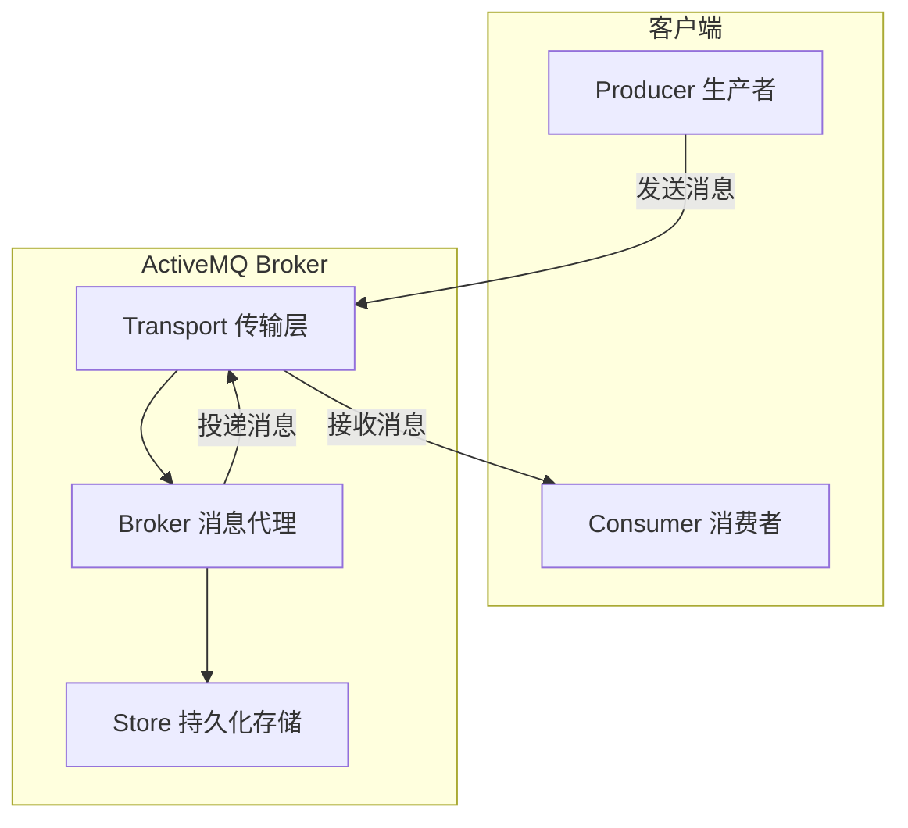

# ActiveMQ 快速入门

## 简介

`ActiveMQ` 是 Apache 软件基金会旗下的一个开源消息中间件，由 Java 语言编写。它完全支持 JMS（Java Message Service）规范，提供了企业级的消息传递能力，是早期 Java 生态中最流行的消息中间件之一。

ActiveMQ 主要解决分布式系统中的异步通信、应用解耦、流量削峰、可靠传输等问题。通过引入消息中间件，生产者无需等待消费者处理完毕即可返回，提升了系统的响应速度；同时，生产者和消费者之间的耦合度大大降低，各自可以独立演进和扩展。

ActiveMQ 支持多种语言客户端（Java、C/C++、.NET、Python、Ruby 等），支持多种传输协议（OpenWire、STOMP、MQTT、AMQP 等），既可以作为点对点模型的消息队列使用，也可以作为发布/订阅模型的消息主题使用。它还支持持久化存储（KahaDB、JDBC、LevelDB 等）、消息事务、消息确认机制等企业级特性。

## JMS 基本概念

`JMS` 即 **Java 消息服务（Java Message Service）API**，是一个 Java 平台中关于面向消息中间件的 API。它用于在两个应用程序之间，或分布式系统中发送消息，进行异步通信。Java 消息服务是一个与具体平台无关的 API，绝大多数 MOM 提供商都对 JMS 提供支持。

### 消息模型

JMS 有两种消息模型：

- Point-to-Point(P2P)
- Publish/Subscribe(Pub/Sub)

#### P2P 的特点


在点对点的消息系统中，消息分发给一个单独的使用者。点对点消息往往与队列 `javax.jms.Queue` 相关联。

每个消息只有一个消费者（Consumer）(即一旦被消费，消息就不再在消息队列中)。

发送者和接收者之间在时间上没有依赖性，也就是说当发送者发送了消息之后，不管接收者有没有正在运行，它不会影响到消息被发送到队列。

接收者在成功接收消息之后需向队列应答成功。

如果你希望发送的每个消息都应该被成功处理的话，那么你需要 P2P 模式。

#### Pub/Sub 的特点


发布/订阅消息系统支持一个事件驱动模型，消息生产者和消费者都参与消息的传递。生产者发布事件，而使用者订阅感兴趣的事件，并使用事件。该类型消息一般与特定的主题 `javax.jms.Topic` 关联。

每个消息可以有多个消费者。

发布者和订阅者之间有时间上的依赖性。针对某个主题（Topic）的订阅者，它必须创建一个订阅者之后，才能消费发布者的消息，而且为了消费消息，订阅者必须保持运行的状态。

为了缓和这样严格的时间相关性，JMS 允许订阅者创建一个可持久化的订阅。这样，即使订阅者没有被激活（运行），它也能接收到发布者的消息。

如果你希望发送的消息可以不被做任何处理、或者被一个消息者处理、或者可以被多个消费者处理的话，那么可以采用 Pub/Sub 模型。

### JMS 编程模型


#### ConnectionFactory

创建 `Connection` 对象的工厂，针对两种不同的 jms 消息模型，分别有 `QueueConnectionFactory` 和`TopicConnectionFactory` 两种。可以通过 JNDI 来查找 `ConnectionFactory` 对象。

#### Connection

`Connection` 表示在客户端和 JMS 系统之间建立的链接（对 TCP/IP socket 的包装）。`Connection` 可以产生一个或多个`Session`。跟 `ConnectionFactory` 一样，`Connection` 也有两种类型：`QueueConnection` 和 `TopicConnection`。

#### Destination

`Destination` 是一个包装了消息目标标识符的被管对象。消息目标是指消息发布和接收的地点，或者是队列 `Queue` ，或者是主题 `Topic` 。JMS 管理员创建这些对象，然后用户通过 JNDI 发现它们。和连接工厂一样，管理员可以创建两种类型的目标，点对点模型的 `Queue`，以及发布者/订阅者模型的 `Topic`。

#### Session

`Session` 表示一个单线程的上下文，用于发送和接收消息。由于会话是单线程的，所以消息是连续的，就是说消息是按照发送的顺序一个一个接收的。会话的好处是它支持事务。如果用户选择了事务支持，会话上下文将保存一组消息，直到事务被提交才发送这些消息。在提交事务之前，用户可以使用回滚操作取消这些消息。一个会话允许用户创建消息，生产者来发送消息，消费者来接收消息。同样，`Session` 也分 `QueueSession` 和 `TopicSession`。

#### MessageConsumer

`MessageConsumer` 由 `Session` 创建，并用于将消息发送到 `Destination`。消费者可以同步地（阻塞模式），或（非阻塞）接收 `Queue` 和 `Topic` 类型的消息。同样，消息生产者分两种类型：`QueueSender` 和`TopicPublisher`。

#### MessageProducer

`MessageProducer` 由 `Session` 创建，用于接收被发送到 `Destination` 的消息。`MessageProducer` 有两种类型：`QueueReceiver` 和 `TopicSubscriber`。可分别通过 `session` 的 `createReceiver(Queue)` 或 `createSubscriber(Topic)` 来创建。当然，也可以 `session` 的 `creatDurableSubscriber` 方法来创建持久化的订阅者。

#### Message

是在消费者和生产者之间传送的对象，也就是说从一个应用程序传送到另一个应用程序。一个消息有三个主要部分：

- 消息头（必须）：包含用于识别和为消息寻找路由的操作设置。
- 一组消息属性（可选）：包含额外的属性，支持其他提供者和用户的兼容。可以创建定制的字段和过滤器（消息选择器）。
- 一个消息体（可选）：允许用户创建五种类型的消息（文本消息，映射消息，字节消息，流消息和对象消息）。

消息接口非常灵活，并提供了许多方式来定制消息的内容。

| Common            | Point-to-Point              | Publish-Subscribe      |
| ----------------- | --------------------------- | ---------------------- |
| ConnectionFactory | QueueConnectionFactory      | TopicConnectionFactory |
| Connection        | QueueConnection             | TopicConnection        |
| Destination       | Queue                       | Topic                  |
| Session           | QueueSession                | TopicSession           |
| MessageProducer   | QueueSender                 | TopicPublisher         |
| MessageSender     | QueueReceiver, QueueBrowser | TopicSubscriber        |

## 安装

**安装条件**

JDK1.7 及以上版本

本地配置了 **JAVA_HOME** 环境变量。

**下载**

支持 Windows/Unix/Linux/Cygwin

[ActiveMQ 官方下载地址](http://activemq.apache.org/download.html)

**Windows 下运行**

（1）解压压缩包到本地；

（2）打开控制台，进入安装目录的 `bin` 目录下；

```
cd [activemq_install_dir]
```

（3）执行 `activemq start` 来启动 ActiveMQ

```
bin\activemq start
```

**测试安装是否成功**

（1）ActiveMQ 默认监听端口为 61616

```
netstat -an|find “61616”
```

（2）访问 <http://127.0.0.1:8161/admin/>

（3）输入用户名、密码

```
Login: admin
Passwort: admin
```

（4）点击导航栏的 Queues 菜单

（5）添加一个队列（queue）

## 项目中的应用

**引入依赖**

```xml
<dependency>
  <groupId>org.apache.activemq</groupId>
  <artifactId>activemq-all</artifactId>
  <version>5.14.1</version>
</dependency>
```

**Sender.java**

```java
public class Sender {
    private static final int SEND_NUMBER = 4;

    public static void main(String[] args) {
        // ConnectionFactory ：连接工厂，JMS 用它创建连接
        ConnectionFactory connectionFactory;
        // Connection ：JMS 客户端到JMS Provider 的连接
        Connection connection = null;
        // Session： 一个发送或接收消息的线程
        Session session;
        // Destination ：消息的目的地;消息发送给谁.
        Destination destination;
        // MessageProducer：消息发送者
        MessageProducer producer;
        // TextMessage message;
        // 构造ConnectionFactory实例对象，此处采用ActiveMq的实现jar
        connectionFactory = new ActiveMQConnectionFactory(
                ActiveMQConnection.DEFAULT_USER,
                ActiveMQConnection.DEFAULT_PASSWORD,
                "tcp://localhost:61616");
        try {
            // 构造从工厂得到连接对象
            connection = connectionFactory.createConnection();
            // 启动
            connection.start();
            // 获取操作连接
            session = connection.createSession(Boolean.TRUE,
                    Session.AUTO_ACKNOWLEDGE);
            // 获取session注意参数值xingbo.xu-queue是一个服务器的queue，须在在ActiveMq的console配置
            destination = session.createQueue("FirstQueue");
            // 得到消息生成者【发送者】
            producer = session.createProducer(destination);
            // 设置不持久化，此处学习，实际根据项目决定
            producer.setDeliveryMode(DeliveryMode.NON_PERSISTENT);
            // 构造消息，此处写死，项目就是参数，或者方法获取
            sendMessage(session, producer);
            session.commit();
        } catch (Exception e) {
            e.printStackTrace();
        } finally {
            try {
                if (null != connection)
                    connection.close();
            } catch (Throwable ignore) {
            }
        }
    }

    public static void sendMessage(Session session, MessageProducer producer)
            throws Exception {
        for (int i = 1; i <= SEND_NUMBER; i++) {
            TextMessage message = session
                    .createTextMessage("ActiveMq 发送的消息" + i);
            // 发送消息到目的地方
            System.out.println("发送消息：" + "ActiveMq 发送的消息" + i);
            producer.send(message);
        }
    }
}
```

**Receiver.java**

```java
public class Receiver {
    public static void main(String[] args) {
        // ConnectionFactory ：连接工厂，JMS 用它创建连接
        ConnectionFactory connectionFactory;
        // Connection ：JMS 客户端到JMS Provider 的连接
        Connection connection = null;
        // Session： 一个发送或接收消息的线程
        Session session;
        // Destination ：消息的目的地;消息发送给谁.
        Destination destination;
        // 消费者，消息接收者
        MessageConsumer consumer;
        connectionFactory = new ActiveMQConnectionFactory(
                ActiveMQConnection.DEFAULT_USER,
                ActiveMQConnection.DEFAULT_PASSWORD,
                "tcp://localhost:61616");
        try {
            // 构造从工厂得到连接对象
            connection = connectionFactory.createConnection();
            // 启动
            connection.start();
            // 获取操作连接
            session = connection.createSession(Boolean.FALSE,
                    Session.AUTO_ACKNOWLEDGE);
            // 获取session注意参数值xingbo.xu-queue是一个服务器的queue，须在在ActiveMq的console配置
            destination = session.createQueue("FirstQueue");
            consumer = session.createConsumer(destination);
            while (true) {
                //设置接收者接收消息的时间，为了便于测试，这里谁定为100s
                TextMessage message = (TextMessage) consumer.receive(100000);
                if (null != message) {
                    System.out.println("收到消息" + message.getText());
                } else {
                    break;
                }
            }
        } catch (Exception e) {
            e.printStackTrace();
        } finally {
            try {
                if (null != connection)
                    connection.close();
            } catch (Throwable ignore) {
            }
        }
    }
}
```

**运行**

先运行 Receiver.java 进行消息监听，再运行 Send.java 发送消息。

**输出**

Send 的输出内容

```
发送消息：Activemq 发送消息0
发送消息：Activemq 发送消息1
发送消息：Activemq 发送消息2
发送消息：Activemq 发送消息3
```

Receiver 的输出内容

```
收到消息ActiveMQ 发送消息0
收到消息ActiveMQ 发送消息1
收到消息ActiveMQ 发送消息2
收到消息ActiveMQ 发送消息3
```

## 特性

ActiveMQ 作为成熟的消息中间件，具有以下核心特性：

| 特性类别 | 说明 |
| --- | --- |
| **JMS 规范** | 完全实现 JMS 1.1 规范，支持 JMS 客户端 API |
| **多协议支持** | 支持 OpenWire、STOMP、MQTT、AMQP、WS 协议 |
| **多语言客户端** | 支持 Java、C、C++、C#、Ruby、Perl、Python、PHP 等语言 |
| **消息模型** | 支持 P2P（点对点）和 Pub/Sub（发布订阅）两种模型 |
| **持久化** | 支持 KahaDB、LevelDB、JDBC 等多种持久化方式 |
| **高可用** | 支持主备（Master/Slave）模式，实现故障切换 |
| **集群** | 支持 Network of Brousters 集群模式，实现消息路由 |
| **事务** | 支持本地事务和 XA 事务 |
| **消息确认** | 支持自动确认、客户端确认、DUPS_OK 确认等机制 |
| **消息过滤** | 支持基于 SQL92 语法的消息选择器 |
| **消息转换** | 支持消息格式转换，适应异构系统 |
| **REST API** | 提供消息收发的 REST 接口 |
| **JMX 监控** | 通过 JMX 提供监控管理能力 |

## 原理

### ActiveMQ 架构

ActiveMQ 的核心架构由以下几个部分组成：



### 消息流转原理

ActiveMQ 的消息流转主要经历以下阶段：

1. **生产者发送消息**：生产者通过 `MessageProducer` 将消息发送到 `Destination`（Queue 或 Topic）。
2. **Broker 接收消息**：Broker 接收到消息后，根据消息模型将其路由到对应的 Queue 或 Topic。
3. **持久化存储**：如果消息是持久化的，Broker 会先将消息写入持久化存储（如 KahaDB），写入成功后再向生产者返回确认。
4. **消费者拉取消息**：消费者通过 `MessageConsumer` 从 Queue 或 Topic 中拉取消息。
5. **消息确认**：消费者处理完消息后，根据确认模式向 Broker 发送确认。Broker 收到确认后，才会将消息从存储中删除。

### 持久化原理

ActiveMQ 默认使用 `KahaDB` 作为持久化存储。KahaDB 是一个基于文件的、面向消息的持久化引擎，具有以下特点：

- **日志结构存储**：消息以追加方式写入日志文件，避免随机写，提升性能。
- **索引机制**：通过 BTree 索引快速定位消息。
- **数据恢复**：重启时通过重放日志恢复内存状态。

### 主备切换原理

ActiveMQ 的主备切换基于共享存储或复制机制：

- **共享存储**：多个 Broker 共享同一个存储介质（如共享文件系统、JDBC 数据库）。同一时刻只有一个 Broker（Master）可以访问存储，当 Master 宕机时，Slave 获取存储锁并升级为 Master。
- **复制机制**：Master 将消息实时复制到 Slave，当 Master 宕机时，Slave 接管服务。复制模式无需共享存储，但会引入复制延迟。

## 应用场景

ActiveMQ 适用于以下典型场景：

- **异步处理**：如用户注册后异步发送邮件、短信通知，提升接口响应速度。
- **应用解耦**：如订单系统与库存系统、物流系统解耦，订单系统发送消息后立即返回，下游系统按需消费。
- **流量削峰**：在秒杀、抢购等高并发场景中，通过消息队列缓冲请求，保护下游系统。
- **日志收集**：作为日志收集管道，将分散的日志聚合后统一处理。
- **事件驱动架构**：在微服务架构中作为事件总线，实现服务间的事件通知。
- **跨系统数据同步**：在异构系统间同步数据，如 MySQL 到 Elasticsearch 的数据同步。

## 最佳实践

### 案例一：Spring Boot 整合 ActiveMQ 实现异步邮件发送

引入依赖：

```xml
<dependency>
    <groupId>org.springframework.boot</groupId>
    <artifactId>spring-boot-starter-activemq</artifactId>
</dependency>
```

配置 `application.yml`：

```yaml
spring:
  activemq:
    broker-url: tcp://localhost:61616
    user: admin
    password: admin
  jms:
    pub-sub-domain: false  # false 表示使用 Queue，true 表示使用 Topic
    template:
      default-destination: mail.queue
```

生产者服务：

```java
import org.springframework.jms.core.JmsTemplate;
import org.springframework.stereotype.Service;

@Service
public class MailProducer {

    private final JmsTemplate jmsTemplate;

    public MailProducer(JmsTemplate jmsTemplate) {
        this.jmsTemplate = jmsTemplate;
    }

    public void sendMail(String to, String subject, String content) {
        MailMessage mailMessage = new MailMessage(to, subject, content);
        jmsTemplate.convertAndSend("mail.queue", mailMessage);
        System.out.println("邮件消息已发送至队列: " + mailMessage);
    }
}
```

消费者监听：

```java
import org.springframework.jms.annotation.JmsListener;
import org.springframework.stereotype.Component;

@Component
public class MailConsumer {

    @JmsListener(destination = "mail.queue")
    public void receiveMail(MailMessage mailMessage) {
        System.out.println("收到邮件消息，开始发送邮件: " + mailMessage);
        // 实际发送邮件逻辑
        sendMail(mailMessage);
    }

    private void sendMail(MailMessage mailMessage) {
        // 调用邮件发送服务
    }
}
```

`MailMessage` 实体：

```java
import java.io.Serializable;

public class MailMessage implements Serializable {

    private String to;
    private String subject;
    private String content;

    public MailMessage(String to, String subject, String content) {
        this.to = to;
        this.subject = subject;
        this.content = content;
    }

    // 省略 getter/setter
}
```

### 案例二：使用 Topic 实现发布订阅

当一条消息需要被多个消费者处理时，使用 Topic 模式：

```java
import org.apache.activemq.ActiveMQConnectionFactory;

import javax.jms.Connection;
import javax.jms.ConnectionFactory;
import javax.jms.DeliveryMode;
import javax.jms.MessageProducer;
import javax.jms.Session;
import javax.jms.TextMessage;
import javax.jms.Topic;

public class TopicPublisher {

    public static void main(String[] args) throws Exception {
        ConnectionFactory connectionFactory =
            new ActiveMQConnectionFactory("tcp://localhost:61616");
        Connection connection = connectionFactory.createConnection();
        connection.start();

        Session session = connection.createSession(false, Session.AUTO_ACKNOWLEDGE);
        Topic topic = session.createTopic("news.topic");

        MessageProducer producer = session.createProducer(topic);
        producer.setDeliveryMode(DeliveryMode.PERSISTENT);

        for (int i = 0; i < 10; i++) {
            TextMessage message = session.createTextMessage("新闻消息 " + i);
            producer.send(message);
            System.out.println("已发布: " + message.getText());
        }

        session.close();
        connection.close();
    }
}
```

### 案例三：配置 ActiveMQ 主备集群

使用共享存储的主备配置示例，`activemq.xml`：

```xml
<beans>
  <broker xmlns="http://activemq.apache.org/schema/core"
          brokerName="localhost"
          dataDirectory="${activemq.data}">

    <persistenceAdapter>
      <!-- 共享存储目录，多个 Broker 指向同一目录 -->
      <kahaDB directory="/shared/storage/kahadb"/>
    </persistenceAdapter>

    <transportConnectors>
      <transportConnector name="openwire"
                          uri="tcp://0.0.0.0:61616?maximumConnections=1000"/>
    </transportConnectors>
  </broker>
</beans>
```

> 说明：多个 Broker 实例配置相同的共享存储目录，同一时刻只有一个 Broker 能获取到存储锁成为 Master，其他成为 Slave。当 Master 宕机时，Slave 会自动获取锁并升级为 Master，实现高可用。

## 常见问题

### 问题一：消息积压导致内存溢出

**问题描述**：生产者发送消息速度快于消费者处理速度，导致大量消息堆积在 Broker 内存中，最终引发 OOM（Out Of Memory）。

**原因分析**：ActiveMQ 默认会将消息加载到内存中以提升投递速度。当消息积压量超过内存限制时，就会发生 OOM。默认的内存限制是 Broker 堆内存的一定比例。

**解决方案**：

1. 配置 `memoryLimit` 限制 Destination 的内存使用量：

```xml
<systemUsage>
  <systemUsage>
    <memoryUsage>
      <memoryUsage limit="1 gb"/>
    </memoryUsage>
    <storeUsage>
      <storeUsage limit="10 gb"/>
    </storeUsage>
    <tempUsage>
      <tempUsage limit="5 gb"/>
    </tempUsage>
  </systemUsage>
</systemUsage>
```

2. 配置消息满后的策略（如转为持久化或拒绝接收）：

```xml
<policyEntry topic=">" producerFlowControl="true"
             memoryLimit="100mb"
             optimalPrefetch="1">
  <pendingMessageLimitStrategy>
    <constantPendingMessageLimitStrategy limit="1000"/>
  </pendingMessageLimitStrategy>
</policyEntry>
```

3. 提升消费者消费能力：增加消费者数量、优化消费逻辑。

### 问题二：消费者接收消息重复

**问题描述**：消费者偶尔会收到重复的消息，导致业务数据异常。

**原因分析**：
- 使用 `AUTO_ACKNOWLEDGE` 确认模式时，消费者在处理消息过程中崩溃，Broker 未收到确认，重启后重新投递。
- 网络抖动导致确认消息丢失。
- 主备切换时，Slave 尚未完全同步所有确认状态。

**解决方案**：

1. 在消费者端实现幂等性处理。使用消息的唯一 ID（`JMSMessageID`）进行去重：

```java
import javax.jms.Message;
import javax.jms.MessageListener;
import javax.jms.TextMessage;
import java.util.Collections;
import java.util.HashSet;
import java.util.Set;

public class IdempotentConsumer implements MessageListener {

    // 生产环境应使用 Redis 等分布式缓存替代本地 Set
    private final Set<String> processedMessageIds =
        Collections.synchronizedSet(new HashSet<>());

    @Override
    public void onMessage(Message message) {
        try {
            String messageId = message.getJMSMessageID();
            if (processedMessageIds.contains(messageId)) {
                System.out.println("重复消息，忽略: " + messageId);
                return;
            }
            // 处理消息
            TextMessage textMessage = (TextMessage) message;
            System.out.println("处理消息: " + textMessage.getText());

            processedMessageIds.add(messageId);
        } catch (Exception e) {
            e.printStackTrace();
        }
    }
}
```

2. 使用 `CLIENT_ACKNOWLEDGE` 模式，确保处理完消息后再确认。

### 问题三：ActiveMQ 连接超时或断开

**问题描述**：客户端连接 ActiveMQ 时报连接超时，或运行一段时间后连接自动断开。

**原因分析**：
- ActiveMQ 服务未启动或端口被占用。
- 防火墙阻止了 61616 端口。
- 客户端长时间空闲，Broker 主动关闭空闲连接。
- 网络不稳定导致连接中断。

**解决方案**：

1. 检查 ActiveMQ 服务状态和端口：

```bash
# 检查 ActiveMQ 进程
ps -ef | grep activemq

# 检查 61616 端口是否被监听
netstat -an | grep 61616
```

2. 调整连接超时和心跳参数：

```java
import org.apache.activemq.ActiveMQConnectionFactory;

ActiveMQConnectionFactory factory = new ActiveMQConnectionFactory(
    "tcp://localhost:61616?wireFormat.maxInactivityDuration=30000"
);
// maxInactivityDuration 表示最大不活动时间（毫秒），超过该时间无数据传输则发送心跳
```

3. 在 `activemq.xml` 中配置 Transport 的超时参数：

```xml
<transportConnectors>
  <transportConnector name="openwire"
                      uri="tcp://0.0.0.0:61616?wireFormat.maxInactivityDuration=30000&amp;connectionTimeout=60000"/>
</transportConnectors>
```

4. 使用连接池（如 `PooledConnectionFactory`）管理连接，实现自动重连：

```java
import org.apache.activemq.pool.PooledConnectionFactory;

PooledConnectionFactory pooledFactory = new PooledConnectionFactory();
pooledFactory.setConnectionFactory(new ActiveMQConnectionFactory("tcp://localhost:61616"));
pooledFactory.setMaxConnections(10);
pooledFactory.setIdleTimeout(30000);  // 空闲连接超时时间
```

## 资源

- **官方**
  - [ActiveMQ 官网](http://activemq.apache.org/)
  - [ActiveMQ 官方文档](http://activemq.apache.org/documentation.html)
  - [ActiveMQ Github](https://github.com/apache/activemq)
- **教程**
  - [oracle 官方的 jms 介绍](https://docs.oracle.com/cd/E19575-01/819-3669/6n5sg7cgq/index.html)
  - [ActiveMQ in Action](https://www.manning.com/books/activemq-in-action)
- **文章**
  - [ActiveMQ 消息中间件详解](https://www.cnblogs.com/yangyongjie/p/11257927.html)
