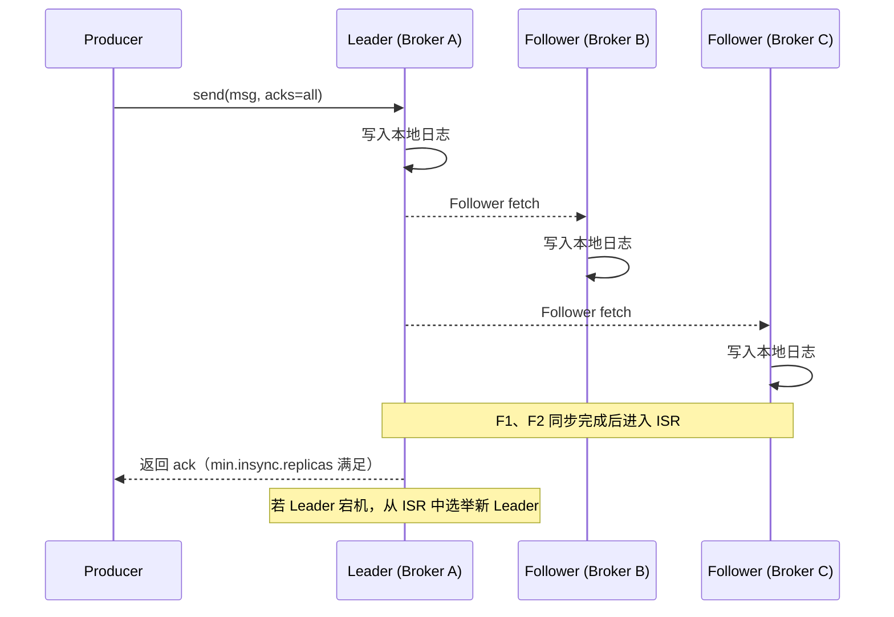
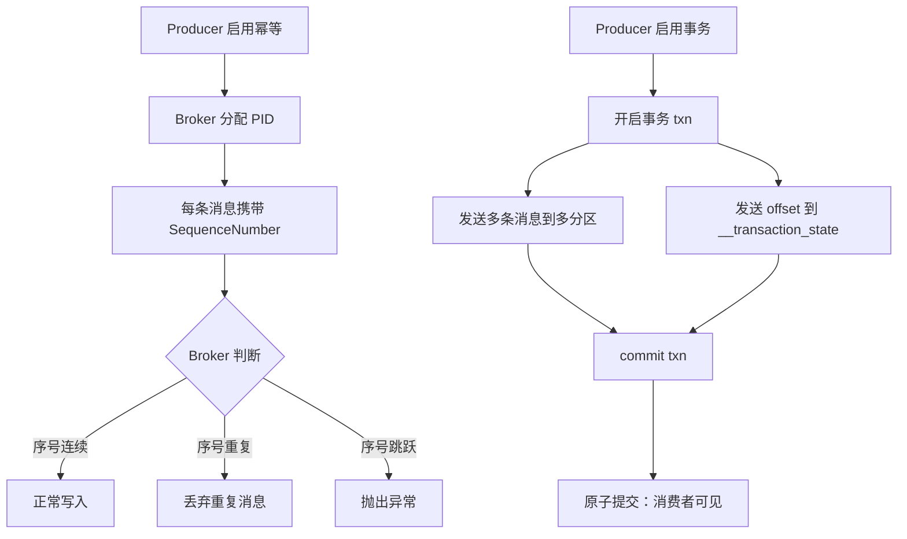

---
icon: logos:kafka-icon
title: Kafka 可靠传输
date: 2021-04-14 15:05:34
categories:
  - 分布式
  - 分布式通信
  - MQ
  - Kafka
tags:
  - 分布式
  - 通信
  - MQ
  - Kafka
permalink: /pages/df6965b2/
---

# Kafka 可靠传输

## 简介

可靠传输是任何消息中间件的核心命题。在分布式系统中，网络抖动、节点宕机、磁盘故障、进程崩溃是常态，如何在这样不可靠的环境下保证消息「不丢失、不重复、有序」地从一个系统可靠地传递到另一个系统，是 Kafka 设计与运维的核心目标。

Kafka 通过「分区多副本 + ISR 同步机制 + 生产者确认（acks） + 消费者位移提交」的组合，在不同层面提供了可调节的可靠性保证。它并不追求绝对的「Exactly-Once」（这是分布式系统的理论难题），而是提供清晰的语义边界：**默认 At-Least-Once，配合幂等生产者（Idempotent Producer）和事务（Transaction）可实现 Exactly-Once**。

理解 Kafka 可靠传输的关键，是明白「可靠性是一个可配置的权衡」——可靠性越高，吞吐和延迟代价越大。本文从生产、存储、消费三个阶段剖析可靠性机制，并给出工程实践中的配置建议。

## 特性

Kafka 可靠传输涉及的核心机制如下：

| 机制 | 层级 | 说明 |
| --- | --- | --- |
| 多副本（Replication） | Broker | 每个 Partition 多副本冗余，Leader 挂掉自动选举 |
| ISR（同步副本集合） | Broker | 仅与 Leader 差距在阈值内的副本才属于 ISR，参与「已提交」判定 |
| `acks` 确认 | Producer | `0`/`1`/`all` 三档，控制消息「已提交」的强度 |
| 幂等生产者 | Producer | `enable.idempotence=true`，避免重试导致重复 |
| 事务 | Producer | 跨分区原子写入，实现 Exactly-Once |
| 自动重试 | Producer | 可重试错误自动重发，瞬时故障透明恢复 |
| 位移提交 | Consumer | 手动/自动提交 offset，决定消费语义 |
| Unclean Leader 选举 | Broker | 是否允许落后副本当 Leader，可用性 vs 一致性权衡 |

## 原理

### 可靠性三阶段模型

Kafka 的可靠性贯穿消息生命周期的三个阶段：

```mermaid
flowchart LR
    P[生产阶段<br/>Producer -> Broker] --> S[存储阶段<br/>Broker 副本同步]
    S --> C[消费阶段<br/>Broker -> Consumer]
    P -.acks=all.- .-> S
    S -.ISR 同步.- .-> C
    C -.offset 提交.- .-> P
```

### 副本与 ISR 机制

Kafka 的可靠性根基是分区多副本。每个 Partition 有一个 Leader 和多个 Follower，所有读写都经过 Leader，Follower 主动拉取同步：



**关键参数关系**：

- `replication.factor` ≥ 3：副本总数，决定容错能力；
- `min.insync.replicas` ≥ 2：最小同步副本数，决定「已提交」强度；
- `acks=all` + `min.insync.replicas=2`：消息至少写入 2 个副本才算提交；
- `unclean.leader.election.enable=false`：禁止落后副本当选 Leader，避免数据丢失。

### 幂等与事务原理



## 消息不丢失

如何保证消息的可靠性传输，或者说，如何保证消息不丢失？这对于任何 MQ 都是核心问题。

一条消息从生产到消费，可以划分三个阶段：


- **生产阶段**：Producer 创建消息，并通过网络发送给 Broker。
- **存储阶段**：Broker 收到消息并存储，如果是集群，还要同步副本给其他 Broker。
- **消费阶段**：Consumer 向 Broker 请求消息，Broker 通过网络传输给 Consumer。

这三个阶段都可能丢失数据，所以要保证消息丢失，就需要任意一环都保证可靠。

### 存储阶段

存储阶段指的是 Kafka Server，也就是 Broker 如何保证消息不丢失。

一句话概括，**Kafka 只对“已提交”的消息（committed message）做有限度的持久化保证**。

上面的话可以解读为：

- **已提交**：**只有当消息被写入分区的若干同步副本时，才被认为是已提交的**。为什么是若干个 Broker 呢？这取决于你对“已提交”的定义。你可以选择只要 Leader 成功保存该消息就算是已提交，也可以是令所有 Broker 都成功保存该消息才算是已提交。
- **持久化**：Kafka 的数据存储在磁盘上，所以只要写入成功，天然就是持久化的。
- **只要还有一个副本是存活的，那么已提交的消息就不会丢失**。
- **消费者只能读取已提交的消息**。

#### 副本机制

**Kafka 的副本机制是 kafka 可靠性保证的核心**。

Kafka 的主题被分为多个分区，分区是基本的数据块。每个分区可以有多个副本，有一个是 Leader（主副本），其他是 Follower（从副本）。所有数据都直接发送给 Leader，或者直接从 Leader 读取事件。Follower 只需要与 Leader 保持同步，并及时复制最新的数据。当 Leader 宕机时，从 Follower 中选举一个成为新的 Leader。

Broker 有 3 个配置参数会影响 Kafka 消息存储的可靠性。

#### 副本数

**`replication.factor` 的作用是设置每个分区的副本数**。`replication.factor` 是主题级别配置； `default.replication.factor` 是 broker 级别配置。

副本数越多，数据可靠性越高；但由于副本数增多，也会增加同步副本的开销，可能会降低集群的可用性。一般，建议设为 3，这也是 Kafka 的默认值。

#### 不完全的选主

`unclean.leader.election.enable` 用于控制是否支持不同步的副本参与选举 Leader。`unclean.leader.election.enable` 是 broker 级别（实际上是集群范围内）配置，默认值为 true。

- 如果设为 true，代表着**允许不同步的副本成为主副本**（即不完全的选举），那么将**面临丢失消息的风险**；
- 如果设为 false，就要**等待原先的主副本重新上线**，从而降低了可用性。

#### 最少同步副本

**`min.insync.replicas` 控制的是消息至少要被写入到多少个副本才算是“已提交”**。`min.insync.replicas` 是主题级别和 broker 级别配置。

尽管可以为一个主题配置 3 个副本，但还是可能会出现只有一个同步副本的情况。如果这个同步副本变为不可用，则必须在可用性和数据一致性之间做出选择。Kafka 中，消息只有被写入到所有的同步副本之后才被认为是已提交的。但如果只有一个同步副本，那么在这个副本不可用时，则数据就会丢失。

如果要确保已经提交的数据被已写入不止一个副本，就需要把最小同步副本的设置为大一点的值。

> 注意：要确保 `replication.factor` > `min.insync.replicas`。如果两者相等，那么只要有一个副本挂机，整个分区就无法正常工作了。我们不仅要改善消息的持久性，防止数据丢失，还要在不降低可用性的基础上完成。推荐设置成 `replication.factor = min.insync.replicas + 1`。

### 生产阶段

在生产消息阶段，消息队列一般通过请求确认机制，来保证消息的可靠传递，Kafka 也不例外。

[Kafka 生产](Kafka_生产) 中提到了，Kafka 有三种发送方式：同步、异步、异步回调。

同步方式能保证消息不丢失，但性能太差；异步方式发送消息，通常会立即返回，但消息可能丢失。

解决生产者丢失消息的方案：

生产者使用异步回调方式 `producer.send(msg, callback)` 发送消息。callback（回调）能准确地告诉你消息是否真的提交成功了。一旦出现消息提交失败的情况，你就可以有针对性地进行处理。

- 如果是因为那些瞬时错误，那么仅仅让 Producer 重试就可以了；
- 如果是消息不合格造成的，那么可以调整消息格式后再次发送。

然后，需要基于以下几点来保证 Kafka 生产者的可靠性：

#### ACK

生产者可选的确认模式有三种：`acks=0`、`acks=1`、`acks=all`。

- `acks=0`、`acks=1` 都有丢失数据的风险。

- `acks=all` 意味着会等待所有同步副本都收到消息。再结合 `min.insync.replicas` ，就可以决定在得到确认响应前，至少有多少副本能够收到消息。

这是最保险的做法，但也会降低吞吐量。

#### 重试

如果 broker 返回的错误可以通过**重试**来解决，生产者会自动处理这些错误。

- **可重试错误**，如：`LEADER_NOT_AVAILABLE`，主副本不可用，可能过一段时间，集群就会选举出新的主副本，重试可以解决问题。
- **不可重试错误**，如：`INVALID_CONFIG`，即使重试，也无法改变配置选项，重试没有意义。

需要注意的是：有时可能因为网络问题导致没有收到确认，但实际上消息已经写入成功。生产者会认为出现临时故障，重试发送消息，这样就会出现重复记录。所以，尽可能在业务上保证幂等性。

设置 `retries` 为一个较大的值。这里的 `retries` 同样是 Producer 的参数，对应前面提到的 Producer 自动重试。当出现网络的瞬时抖动时，消息发送可能会失败，此时配置了 retries > 0 的 Producer 能够自动重试消息发送，避免消息丢失。

#### 错误处理

开发者需要自行处理的错误：

- 不可重试的 broker 错误，如消息大小错误、认证错误等；
- 消息发送前发生的错误，如序列化错误；
- 生产者达到重试次数上限或消息占用的内存达到上限时发生的错误。

### 消费阶段

前文已经提到，**消费者只能读取已提交的消息**。这就保证了消费者接收到消息时已经具备了数据一致性。

消费者唯一要做的是确保哪些消息是已经读取过的，哪些是没有读取过的（通过提交偏移量给 Broker 来确认）。如果消费者提交了偏移量却未能处理完消息，那么就有可能造成消息丢失，这也是消费者丢失消息的主要原因。


#### 消费者的可靠性配置

- `group.id` - 如果希望消费者可以看到主题的所有消息，那么需要为它们设置唯一的 `group.id`。
- `auto.offset.reset` - 有两个选项：
  - `earliest` - 消费者会从分区的开始位置读取数据
  - `latest` - 消费者会从分区末尾位置读取数据
- `enable.auto.commit` - 消费者自动提交偏移量。如果设为 true，处理流程更简单，但无法保证重复处理消息。
- `auto.commit.interval.ms` - 自动提交的频率，默认为每 5 秒提交一次。

#### 显示提交偏移量

> 如果 `enable.auto.commit` 设为 true，即自动提交，就无需考虑提交偏移量的问题。

如果选择显示提交偏移量，需要考虑以下问题：

- 必须在处理完消息后再发送确认（提交偏移量），不要收到消息立即确认。
- 提交频率是性能和重复消息数之间的权衡
- 分区再均衡
- 消费可能需要重试机制
- 超时处理
- 消费者可能需要维护消费状态，如：处理完消息后，记录在数据库中。
- 幂等性设计
  - 写数据库：根据主键判断记录是否存在
  - 写 Redis：set 操作天然具有幂等性
  - 复杂的逻辑处理，则可以在消息中加入全局 ID

## 重复消息

在 MQTT 协议中，给出了三种传递消息时能够提供的服务质量标准，这三种服务质量从低到高依次是：

- **At most once**：至多一次。消息在传递时，最多会被送达一次。换一个说法就是，没什么消息可靠性保证，允许丢消息。一般都是一些对消息可靠性要求不太高的监控场景使用，比如每分钟上报一次机房温度数据，可以接受数据少量丢失。
- **At least once**: 至少一次。消息在传递时，至少会被送达一次。也就是说，不允许丢消息，但是允许有少量重复消息出现。
- **Exactly once**：恰好一次。消息在传递时，只会被送达一次，不允许丢失也不允许重复，这个是最高的等级。

绝大部分消息队列提供的服务质量都是 At least once，包括 RocketMQ、RabbitMQ 和 Kafka 都是这样。也就是说，消息队列很难保证消息不重复。

一般解决重复消息的办法是，在消费端，**保证消费消息的操作具备幂等性**。

常用的实现幂等操作的方法：

### 利用数据库的唯一约束实现幂等

关系型数据库可以使用 `INSERT IF NOT EXIST` 语句防止重复；Redis 可以使用 `SETNX` 命令来防止重复；其他数据库只要支持类似语义，也是一个道理。

### 为更新的数据设置前置条件

如果满足条件就更新数据，否则拒绝更新数据，在更新数据的时候，同时变更前置条件中需要判断的数据。这样，重复执行这个操作时，由于第一次更新数据的时候已经变更了前置条件中需要判断的数据，不满足前置条件，则不会重复执行更新数据操作。

但是，如果我们要更新的数据不是数值，或者我们要做一个比较复杂的更新操作怎么办？用什么作为前置判断条件呢？更加通用的方法是，给数据增加一个版本号属性，每次更数据前，比较当前数据的版本号是否和消息中的版本号一致，如果不一致就拒绝更新数据，更新数据的同时将版本号 +1，一样可以实现幂等更新。

### 记录并检查操作

还有一种通用性最强，适用范围最广的实现幂等性方法：记录并检查操作，也称为“Token 机制或者 GUID（全局唯一 ID）机制”，实现的思路特别简单：在执行数据更新操作之前，先检查一下是否执行过这个更新操作。

具体的实现方法是，在发送消息时，给每条消息指定一个全局唯一的 ID，消费时，先根据这个 ID 检查这条消息是否有被消费过，如果没有消费过，才更新数据，然后将消费状态置为已消费。

需要注意的是，“检查消费状态，然后更新数据并且设置消费状态”中，三个操作必须作为一组操作保证原子性，才能真正实现幂等，否则就会出现 Bug。这一组操作可以通过分布式事务或分布式锁来保证其原子性。

## 消息的有序性

某些场景下，可能会要求按序发送消息。

### 方案一、单 Partition

Kafka 每一个 Partition 只能隶属于消费者群组中的一个 Consumer，换句话说，每个 Partition 只能被一个 Consumer 消费。所以，如果 Topic 是单 Partition，自然是有序的。

方案分析

优点：简单粗暴。开发者什么也不用做。

缺点：**Kafka 基于 Partition 实现其高并发**能力，如果使用单 Partition，会严重限制 Kafka 的吞吐量。

结论：作为分布式消息引擎，限制并发能力，显然等同于自废武功，所以，这个方案几乎是不可接受的。

### 方案二、同一个 key 的消息发送给指定 Partition

（1）生产者端显示指定 key 发往一个指定的 Partition，就可以保证同一个 key 在这个 Partition 中是有序的。

（2）接下来，消费者端为每个 key 设定一个缓存队列，然后让一个独立线程负责消费指定 key 的队列，这就保证了消费消息也是有序的。

## 消息积压

先修复消费者，然后停掉当前所有消费者。

新建 Topic，扩大分区，以提高并发处理能力。

创建临时消费者程序，并部署在多节点上，扩大消费处理能力。

最后处理完积压消息后，恢复原先部署架构。

## 验证系统可靠性

建议从 3 个层面验证系统的可靠性：

- **配置验证**
- **应用验证**
  - 客户端和服务器断开连接
  - 选举
  - 依次重启 broker
  - 依次重启生产者
  - 依次重启消费者
- **监控可靠性**
  - 对于生产者来说，最重要的两个指标是消息的 `error-rate` 和 `retry-rate`。如果这两个指标上升，说明系统出了问题。
  - 对于消费者来说，最重要的指标是 `consumer-lag`，该指标表明了消费者的处理速度与最近提交到分区里的偏移量之间还有多少差距。

## 最佳实践

生产者

1. 不要使用 `producer.send(msg)`，而要使用 `producer.send(msg, callback)`。记住，一定要使用带有回调通知的 `send` 方法。
2. 设置 `acks = all`。`acks` 是 Producer 的一个参数，代表了你对“已提交”消息的定义。如果设置成 all，则表明所有副本 Broker 都要接收到消息，该消息才算是“已提交”。这是最高等级的“已提交”定义。
3. 设置 `retries` 为一个较大的值。这里的 retries 同样是 Producer 的参数，对应前面提到的 Producer 自动重试。当出现网络的瞬时抖动时，消息发送可能会失败，此时配置了 `retries > 0` 的 Producer 能够自动重试消息发送，避免消息丢失。

服务器（Kafka Broker）

1. 设置 `unclean.leader.election.enable = false。`这是 Broker 端的参数，它控制的是哪些 Broker 有资格竞选分区的 Leader。如果一个 Broker 落后原先的 Leader 太多，那么它一旦成为新的 Leader，必然会造成消息的丢失。故一般都要将该参数设置成 false，即不允许这种情况的发生。
2. 设置 `replication.factor` >= 3。这也是 Broker 端的参数。其实这里想表述的是，最好将消息多保存几份，毕竟目前防止消息丢失的主要机制就是冗余。
3. 设置 `min.insync.replicas` > 1。这依然是 Broker 端参数，控制的是消息至少要被写入到多少个副本才算是“已提交”。设置成大于 1 可以提升消息持久性。在实际环境中千万不要使用默认值 1。
4. 确保 `replication.factor` > `min.insync.replicas`。如果两者相等，那么只要有一个副本挂机，整个分区就无法正常工作了。我们不仅要改善消息的持久性，防止数据丢失，还要在不降低可用性的基础上完成。推荐设置成 `replication.factor = min.insync.replicas + 1`。

消费者

1. 确保消息消费完成再提交。Consumer 端有个参数 `enable.auto.commit`，最好把它设置成 false，并采用手动提交位移的方式。就像前面说的，这对于单 Consumer 多线程处理的场景而言是至关重要的。

### 案例一：金融级可靠生产（acks=all + 幂等 + 重试）

**场景**：支付系统发送交易流水到 Kafka，要求绝不丢消息，且允许少量重试但不可重复。

```java
import org.apache.kafka.clients.producer.*;
import java.util.Properties;

public class ReliablePaymentProducer {
    public static void main(String[] args) {
        Properties props = new Properties();
        props.put(ProducerConfig.BOOTSTRAP_SERVERS_CONFIG, "broker1:9092,broker2:9092,broker3:9092");
        // 最高可靠性：所有 ISR 副本确认
        props.put(ProducerConfig.ACKS_CONFIG, "all");
        // 启用幂等，避免重试导致重复（要求 acks=all，retries>0，max.in.flight<5）
        props.put(ProducerConfig.ENABLE_IDEMPOTENCE_CONFIG, "true");
        props.put(ProducerConfig.MAX_IN_FLIGHT_REQUESTS_PER_CONNECTION, "5");
        // 重试次数调大，覆盖瞬时故障
        props.put(ProducerConfig.RETRIES_CONFIG, "2147483647");
        props.put(ProducerConfig.DELIVERY_TIMEOUT_MS_CONFIG, "120000");
        // 批量与延迟，平衡吞吐与延迟
        props.put(ProducerConfig.BATCH_SIZE_CONFIG, "16384");
        props.put(ProducerConfig.LINGER_MS_CONFIG, "10");
        props.put(ProducerConfig.KEY_SERIALIZER_CLASS_CONFIG,
                "org.apache.kafka.common.serialization.StringSerializer");
        props.put(ProducerConfig.VALUE_SERIALIZER_CLASS_CONFIG,
                "org.apache.kafka.common.serialization.StringSerializer");

        try (KafkaProducer<String, String> producer = new KafkaProducer<>(props)) {
            for (int i = 0; i < 1000; i++) {
                String txId = "TX" + i;
                String payload = "{\"txId\":\"" + txId + "\",\"amount\":100.00}";
                ProducerRecord<String, String> record =
                        new ProducerRecord<>("payment-stream", txId, payload);
                // 必须使用带回调的 send
                producer.send(record, (metadata, e) -> {
                    if (e != null) {
                        // 落库到本地补偿表，由对账任务重发
                        System.err.println("发送失败，需补偿: " + txId + ", " + e.getMessage());
                    } else {
                        System.out.printf("成功: partition=%d, offset=%d%n",
                                metadata.partition(), metadata.offset());
                    }
                });
            }
            producer.flush();
        }
    }
}
```

**说明**：`enable.idempotence=true` + `acks=all` + `retries=MAX` 是金融场景的「黄金组合」，配合本地补偿表可应对极端故障。

### 案例二：消费者手动提交 + 幂等消费

**场景**：订单消费端需保证「处理成功才提交 offset」，且重复消费不产生副作用。

```java
import org.apache.kafka.clients.consumer.*;
import java.time.Duration;
import java.util.Collections;
import java.util.Properties;

public class IdempotentConsumer {
    public static void main(String[] args) {
        Properties props = new Properties();
        props.put(ConsumerConfig.BOOTSTRAP_SERVERS_CONFIG, "broker1:9092,broker2:9092");
        props.put(ConsumerConfig.GROUP_ID_CONFIG, "order-consumer-group");
        // 关闭自动提交
        props.put(ConsumerConfig.ENABLE_AUTO_COMMIT_CONFIG, "false");
        props.put(ConsumerConfig.AUTO_OFFSET_RESET_CONFIG, "earliest");
        props.put(ConsumerConfig.MAX_POLL_RECORDS_CONFIG, "100");
        props.put(ConsumerConfig.MAX_POLL_INTERVAL_MS_CONFIG, "300000");
        props.put(ConsumerConfig.KEY_DESERIALIZER_CLASS_CONFIG,
                "org.apache.kafka.common.serialization.StringDeserializer");
        props.put(ConsumerConfig.VALUE_DESERIALIZER_CLASS_CONFIG,
                "org.apache.kafka.common.serialization.StringDeserializer");

        try (KafkaConsumer<String, String> consumer = new KafkaConsumer<>(props)) {
            consumer.subscribe(Collections.singletonList("payment-stream"));
            while (true) {
                ConsumerRecords<String, String> records = consumer.poll(Duration.ofMillis(1000));
                for (ConsumerRecord<String, String> record : records) {
                    try {
                        // 幂等消费：用 txId 作为唯一键，插入前检查
                        processWithIdempotent(record.key(), record.value());
                    } catch (Exception e) {
                        // 处理失败不提交，下次重试
                        System.err.println("处理失败，将重试: " + record.key() + ", " + e.getMessage());
                        // 跳出，不提交该批，让整批重投
                        break;
                    }
                }
                // 批处理成功后再同步提交
                consumer.commitSync();
            }
        }
    }

    /**
     * 幂等处理：基于数据库唯一索引或 Redis SETNX
     */
    private static void processWithIdempotent(String txId, String payload) {
        // 伪示例：INSERT INTO consumed_tx(tx_id) VALUES(?) ON DUPLICATE KEY UPDATE ...
        // 若插入成功说明首次处理；若冲突则说明已处理过，直接返回
        System.out.println("处理交易: " + txId);
    }
}
```

**说明**：`enable.auto.commit=false` + 业务处理成功后 `commitSync()` 是「至少一次」语义的标准实现；幂等性由业务层用唯一键保证。

### 案例三：事务消息实现 Exactly-Once

**场景**：流处理应用「消费 -> 处理 -> 生产」链路要求端到端 Exactly-Once。

```java
import org.apache.kafka.clients.consumer.*;
import org.apache.kafka.clients.producer.*;
import org.apache.kafka.common.errors.ProducerFencedException;
import java.time.Duration;
import java.util.Collections;
import java.util.Properties;

public class TransactionalProcessor {
    public static void main(String[] args) {
        // Producer 配置：启用事务
        Properties prodProps = new Properties();
        prodProps.put(ProducerConfig.BOOTSTRAP_SERVERS_CONFIG, "broker1:9092");
        prodProps.put(ProducerConfig.TRANSACTIONAL_ID_CONFIG, "processor-tx-1");
        prodProps.put(ProducerConfig.ENABLE_IDEMPOTENCE_CONFIG, "true");
        prodProps.put(ProducerConfig.KEY_SERIALIZER_CLASS_CONFIG,
                "org.apache.kafka.common.serialization.StringSerializer");
        prodProps.put(ProducerConfig.VALUE_SERIALIZER_CLASS_CONFIG,
                "org.apache.kafka.common.serialization.StringSerializer");

        KafkaProducer<String, String> producer = new KafkaProducer<>(prodProps);
        // 初始化事务
        producer.initTransactions();

        // Consumer 配置：关闭自动提交，使用事务提交 offset
        Properties consProps = new Properties();
        consProps.put(ConsumerConfig.BOOTSTRAP_SERVERS_CONFIG, "broker1:9092");
        consProps.put(ConsumerConfig.GROUP_ID_CONFIG, "processor-group");
        consProps.put(ConsumerConfig.ENABLE_AUTO_COMMIT_CONFIG, "false");
        consProps.put(ConsumerConfig.ISOLATION_LEVEL_CONFIG, "read_committed");
        consProps.put(ConsumerConfig.KEY_DESERIALIZER_CLASS_CONFIG,
                "org.apache.kafka.common.serialization.StringDeserializer");
        consProps.put(ConsumerConfig.VALUE_DESERIALIZER_CLASS_CONFIG,
                "org.apache.kafka.common.serialization.StringDeserializer");

        KafkaConsumer<String, String> consumer = new KafkaConsumer<>(consProps);
        consumer.subscribe(Collections.singletonList("input-topic"));

        try {
            while (true) {
                ConsumerRecords<String, String> records = consumer.poll(Duration.ofMillis(1000));
                if (records.isEmpty()) continue;

                producer.beginTransaction();
                try {
                    for (ConsumerRecord<String, String> record : records) {
                        // 处理并发送到输出主题
                        String output = transform(record.value());
                        producer.send(new ProducerRecord<>("output-topic", record.key(), output));
                    }
                    // 将消费位移作为事务的一部分提交
                    producer.sendOffsetsToTransaction(
                            getOffsetsToCommit(records),
                            consumer.groupMetadata());
                    producer.commitTransaction();
                } catch (ProducerFencedException e) {
                    // 被新实例 fence，直接退出
                    producer.close();
                    consumer.close();
                    return;
                } catch (Exception e) {
                    producer.abortTransaction();
                }
            }
        } finally {
            producer.close();
            consumer.close();
        }
    }

    private static String transform(String value) {
        return value.toUpperCase(); // 简化示例
    }

    private static java.util.Map<org.apache.kafka.common.TopicPartition,
            org.apache.kafka.clients.consumer.OffsetAndMetadata> getOffsetsToCommit(
            ConsumerRecords<String, String> records) {
        java.util.Map<org.apache.kafka.common.TopicPartition,
                org.apache.kafka.clients.consumer.OffsetAndMetadata> offsets = new java.util.HashMap<>();
        for (org.apache.kafka.common.TopicPartition tp : records.partitions()) {
            long lastOffset = records.records(tp).stream()
                    .mapToLong(org.apache.kafka.clients.consumer.ConsumerRecord::offset)
                    .max().orElse(-1);
            if (lastOffset >= 0) {
                offsets.put(tp, new org.apache.kafka.clients.consumer.OffsetAndMetadata(lastOffset + 1));
            }
        }
        return offsets;
    }
}
```

**说明**：`transactional.id` + `sendOffsetsToTransaction` + `read_committed` 隔离级别，三者配合实现消费-处理-生产的原子性。注意 `transactional.id` 在重启时必须复用，否则会破坏 Exactly-Once 语义。

## 应用场景

Kafka 可靠传输机制适用于以下典型场景：

- **金融交易流水**：支付、转账、清算等场景，要求消息绝不丢失，使用 `acks=all` + 幂等生产者 + 本地补偿表。
- **订单状态流转**：订单创建、支付、发货、完成等状态变更需严格有序且可靠，配合单 Partition 或 key 分区。
- **日志审计**：合规审计要求消息可回溯且不丢，依赖多副本 + 长保留期。
- **CDC 数据同步**：数据库 binlog 同步到下游，要求 Exactly-Once，使用事务消息 + `read_committed`。
- **IoT 设备上报**：弱网络环境下重试机制保证消息最终送达，配合幂等消费处理重复。
- **微服务事件驱动**：服务间事件解耦，要求最终一致性，Kafka 可靠传输 + 业务幂等是常见方案。

## 常见问题

### 问题一：生产者发送报 NotEnoughReplicasException

**问题描述**：开启 `acks=all` + `min.insync.replicas=2` 后，生产者频繁报错 `NotEnoughReplicasException: Messages are rejected since there are fewer in-sync replicas than required`。

**原因分析**：
1. ISR 中副本数小于 `min.insync.replicas` 配置值，常见于部分 Broker 宕机或副本同步落后被踢出 ISR。
2. 副本数配置不当：`replication.factor` = `min.insync.replicas`，只要一个副本故障就无法写入。
3. Broker 磁盘满或网络抖动，导致 Follower 长期跟不上 Leader。

**解决方案**：

```properties
# 确保副本数 > min.insync.replicas，推荐 replication.factor = min.insync.replicas + 1
# Topic 级别配置
min.insync.replicas=2
replication.factor=3
```

```shell
# 查看 ISR 状态，确认是否缩减
kafka-topics.sh --bootstrap-server localhost:9092 --describe --topic payment-stream

# 查看哪些分区 ISR 不足
kafka-topics.sh --bootstrap-server localhost:9092 --describe --under-replicated-partitions

# 应急：临时降低 min.insync.replicas（牺牲一致性换可用性，慎用）
kafka-configs.sh --bootstrap-server localhost:9092 \
  --alter --entity-type topics --entity-name payment-stream \
  --add-config min.insync.replicas=1
```

```java
// 生产者侧降级策略：捕获异常后降级到本地存储
producer.send(record, (metadata, e) -> {
    if (e instanceof org.apache.kafka.common.errors.NotEnoughReplicasException) {
        // ISR 不足，降级到本地文件暂存，等待恢复后重发
        saveToLocalCompensationTable(record);
    } else if (e != null) {
        e.printStackTrace();
    }
});
```

**说明**：生产环境务必保证 `replication.factor >= min.insync.replicas + 1`，否则单副本故障即导致分区不可写。

### 问题二：消费者 Rebalance 导致重复消费

**问题描述**：消费者组频繁 Rebalance，日志显示 `Member ... has failed`，业务侧出现重复消费和数据不一致。

**原因分析**：
1. `max.poll.interval.ms` 设置过小，单批处理耗时超过该值，被判定为「死亡」踢出组。
2. `session.timeout.ms` 与心跳机制不匹配，弱网络下心跳超时。
3. 消费者实例频繁上下线（如 K8s 滚动更新未优雅退出）。
4. 消费逻辑阻塞（如死锁、慢 SQL），导致 poll 循环停滞。

**解决方案**：

```java
Properties props = new Properties();
// 关键参数：max.poll.interval.ms 必须大于单批最大处理耗时
props.put(ConsumerConfig.MAX_POLL_INTERVAL_MS_CONFIG, "600000");  // 10 分钟
props.put(ConsumerConfig.MAX_POLL_RECORDS_CONFIG, "50");           // 减少单批量，控制处理时间
props.put(ConsumerConfig.SESSION_TIMEOUT_MS_CONFIG, "30000");
props.put(ConsumerConfig.HEARTBEAT_INTERVAL_MS_CONFIG, "10000");
props.put(ConsumerConfig.ENABLE_AUTO_COMMIT_CONFIG, "false");
```

```java
// 优雅退出：消费者关闭时主动离开组，避免被动 Rebalance
Runtime.getRuntime().addShutdownHook(new Thread(() -> {
    try {
        consumer.close(Duration.ofSeconds(30));
    } catch (Exception e) {
        // 强制退出
    }
}));
```

```java
// 幂等消费兜底：即使 Rebalance 导致重复，也不产生副作用
private void processWithIdempotent(String msgId, String payload) {
    // 方案1：Redis SETNX
    // Boolean isNew = redis.opsForValue().setIfAbsent("msg:" + msgId, "1", 24, TimeUnit.HOURS);
    // if (Boolean.FALSE.equals(isNew)) return;

    // 方案2：数据库唯一索引
    // INSERT INTO consumed_msg(msg_id) VALUES(?) ON DUPLICATE KEY UPDATE msg_id=msg_id
    System.out.println("处理消息: " + msgId);
}
```

**说明**：Rebalance 是 Kafka 消费者最常见的问题源，核心原则是「`max.poll.interval.ms` > 最坏情况处理耗时」+「业务幂等」。

### 问题三：跨机房消费延迟与消息积压

**问题描述**：异地机房消费 Kafka 消息，延迟持续在分钟级，且积压量不断增长。

**原因分析**：
1. 跨机房网络带宽不足，消费拉取速率受限于网络。
2. 消费者并发度不足（Partition 数 < Consumer 数）。
3. 消费逻辑处理慢，单条耗时高。
4. 保留期过短，积压消息尚未消费即被删除。

**解决方案**：

```shell
# 1. 扩展 Partition 数量提升并发（只能增加不能减少）
kafka-topics.sh --bootstrap-server localhost:9092 \
  --alter --topic cross-room-topic --partitions 24

# 2. 临时延长保留期，避免积压消息被删
kafka-configs.sh --bootstrap-server localhost:9092 \
  --alter --entity-type topics --entity-name cross-room-topic \
  --add-config retention.ms=2592000000  # 30 天
```

```java
// 消费者侧：多线程并发处理，提升吞吐
public class ParallelConsumer {
    private static final java.util.concurrent.ExecutorService executor =
            java.util.concurrent.Executors.newFixedThreadPool(8);

    public static void main(String[] args) {
        Properties props = new Properties();
        props.put(ConsumerConfig.BOOTSTRAP_SERVERS_CONFIG, "broker1:9092");
        props.put(ConsumerConfig.GROUP_ID_CONFIG, "cross-room-consumer");
        props.put(ConsumerConfig.ENABLE_AUTO_COMMIT_CONFIG, "false");
        props.put(ConsumerConfig.MAX_POLL_RECORDS_CONFIG, "500");

        try (KafkaConsumer<String, String> consumer = new KafkaConsumer<>(props)) {
            consumer.subscribe(Collections.singletonList("cross-room-topic"));
            java.util.concurrent.CountDownLatch latch;
            while (true) {
                ConsumerRecords<String, String> records = consumer.poll(Duration.ofMillis(1000));
                if (records.isEmpty()) continue;

                latch = new java.util.concurrent.CountDownLatch(records.count());
                for (ConsumerRecord<String, String> record : records) {
                    executor.submit(() -> {
                        try {
                            process(record);
                        } finally {
                            latch.countDown();
                        }
                    });
                }
                try {
                    latch.await();  // 等待本批处理完
                    consumer.commitSync();
                } catch (InterruptedException e) {
                    Thread.currentThread().interrupt();
                    break;
                }
            }
        }
    }

    private static void process(ConsumerRecord<String, String> record) {
        // 业务处理
    }
}
```

**说明**：跨机房消费建议使用 Kafka MirrorMaker 2 或 Confluent Replicator 在源端聚合后传输，避免消费者直接跨机房拉取。同时 Partition 数应大于消费者实例数以充分利用并发。

## 参考资料

- **官方**
  - [Kafka 官网](http://kafka.apache.org/)
  - [Kafka Github](https://github.com/apache/kafka)
  - [Kafka 官方文档](https://kafka.apache.org/documentation/)
- **书籍**
  - [《Kafka 权威指南》](https://book.douban.com/subject/27665114/)
- **教程**
  - [消息队列高手课](https://time.geekbang.org/column/intro/100032301)
  - [Kafka 中文文档](https://github.com/apachecn/kafka-doc-zh)
  - [Kafka 核心技术与实战](https://time.geekbang.org/column/intro/100029201)
