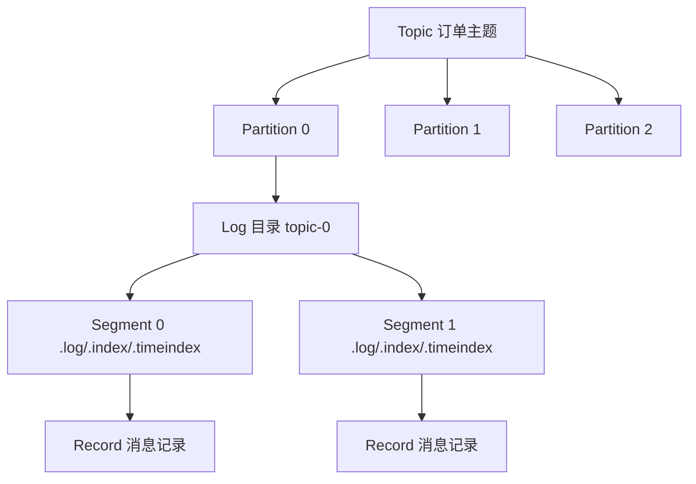
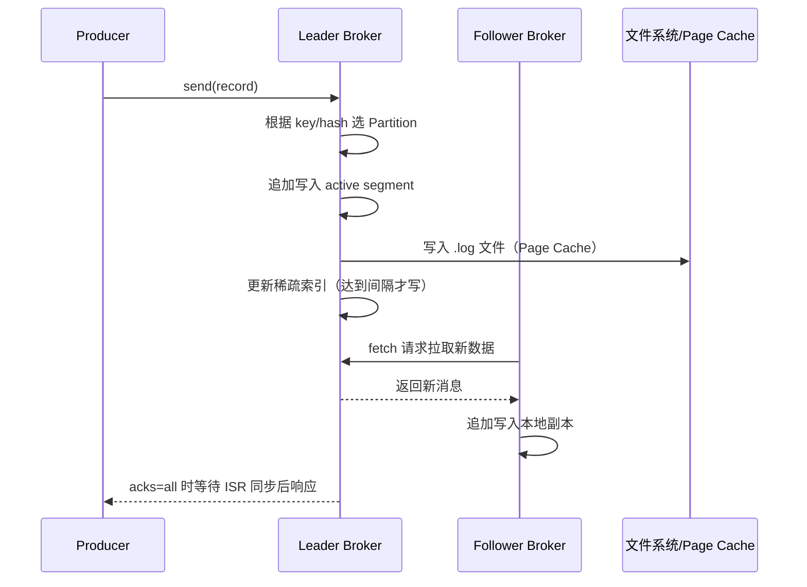

---
icon: logos:kafka-icon
title: Kafka 存储
date: 2021-04-29 08:17:17
categories:
  - 分布式
  - 分布式通信
  - MQ
  - Kafka
tags:
  - 分布式
  - 通信
  - MQ
  - Kafka
permalink: /pages/f31f25c0/
---

# Kafka 存储

> Kafka 是 Apache 的开源项目。**Kafka 既可以作为一个消息队列中间件，也可以作为一个分布式流处理平台**。
>
> **Kafka 用于构建实时数据管道和流应用。它具有水平可伸缩性，容错性，快速快速性**。

## 简介

Kafka 的存储子系统是其性能与可靠性的基石。作为一个分布式消息中间件与流处理平台，Kafka 需要在每秒数百万级消息写入的高并发场景下，仍然保证消息持久化、低延迟读取以及水平扩展能力。

Kafka 的存储设计完全有别于传统 MQ 的「消息落库」思路：它将消息以**追加写（append-only）**的方式写入分区日志文件，并借助操作系统的 `Page Cache`、顺序磁盘 I/O、稀疏索引以及零拷贝（`sendfile`）等技术，使得「磁盘存储 + 高吞吐」成为可能。同时，通过日志段（Log Segment）切分、基于保留策略的过期清理和日志压实（Log Compaction），Kafka 能够在海量数据场景下长期稳定运行。

理解 Kafka 的存储机制，对于排查消息丢失、磁盘告警、消费延迟（Consumer Lag）、副本同步异常等线上问题至关重要，也是进行容量规划与性能调优的前提。

## 特性

Kafka 存储子系统具有以下核心特性：

| 特性 | 说明 |
| --- | --- |
| 顺序写入 | 消息以追加方式写入日志文件，避免随机写，磁盘吞吐接近内存 |
| `Page Cache` 利用 | 数据写入即落入内核页缓存，由 OS 异步刷盘，读写性能高 |
| 零拷贝 | 消费者读取时使用 `sendfile`，避免用户态/内核态数据拷贝 |
| 日志段切分 | 单个 Partition 被切分为多个 Segment，便于索引、清理与过期 |
| 稀疏索引 | `.index` / `.timeindex` 采用稀疏索引，索引文件小且查找快 |
| 多副本冗余 | 每个 Partition 可配置多副本，保证单点故障下数据不丢失 |
| 保留策略 | 支持按时间（`retention.hours`）和按大小（`retention.bytes`）删除 |
| 日志压实 | 对相同 key 的消息只保留最新值，适合 KV 型长周期存储 |
| 压缩传输 | 支持 GZIP、Snappy、LZ4、Zstd，减少网络带宽与磁盘占用 |
| 磁盘故障转移 | 1.1+ 支持单盘故障后自动将数据迁移至其他盘，Broker 不下线 |

## 原理

### 存储整体架构

Kafka 的存储采用「`Topic` → `Partition` → `Log` → `Log Segment` → `Record`」五级结构，整体架构如下：



### 写入流程

生产者写入消息的存储流程如下：



### 读取流程

消费者读取消息时，Kafka 通过稀疏索引快速定位物理位置：

1. 根据请求的 `offset`，使用**二分查找**定位到目标 `Log Segment` 文件；
2. 在该 Segment 的 `.index` 文件中，通过二分查找找到**小于等于该 offset 的最大索引项**，得到物理 `position`；
3. 从 `.log` 文件的 `position` 处开始顺序扫描，直到找到目标 offset 的消息；
4. 通过 `sendfile` 零拷贝将数据从文件直接传输到网络 Socket。

## 逻辑存储


## 持久化

持久化是 Kafka 的一个重要特性。

**Kafka 集群持久化保存（使用可配置的保留期限）所有发布记录——无论它们是否被消费**。但是，Kafka 不会一直保留数据，也不会等待所有的消费者读取了消息才删除消息。**只要数据量达到上限（比如 1G）或者数据达到过期时间（比如 7 天），Kafka 就会删除旧消息**。Kafka 的性能和数据大小无关，所以长时间存储数据没有什么问题。

**Kafka 对消息的存储和缓存严重依赖于文件系统**。

- 顺序磁盘访问在某些情况下比随机内存访问还要快！在 Kafka 中，所有数据一开始就被写入到文件系统的持久化日志中，而不用在 cache 空间不足的时候 flush 到磁盘。实际上，这表明数据被转移到了内核的 pagecache 中。所以，**虽然 Kafka 数据存储在磁盘中，但其访问性能也不低**。

- Kafka 的协议是建立在一个 “消息块” 的抽象基础上，合理将消息分组。 这使得网络请求将多个消息打包成一组，而不是每次发送一条消息，从而使整组消息分担网络中往返的开销。Consumer 每次获取多个大型有序的消息块，并由服务端依次将消息块一次加载到它的日志中。这可以**有效减少大量的小型 I/O 操作**。
- 由于 Kafka 在 Producer、Broker 和 Consumer 都**共享标准化的二进制消息格式**，这样数据块不用修改就能在他们之间传递。这可以**避免字节拷贝带来的开销**。
- Kafka 以高效的批处理格式支持一批消息可以压缩在一起发送到服务器。这批消息将以压缩格式写入，并且在日志中保持压缩，只会在 Consumer 消费时解压缩。**压缩传输数据，可以有效减少网络带宽开销**。
  - Kafka 支持 GZIP，Snappy 和 LZ4 压缩协议。

所有这些优化都允许 Kafka 以接近网络速度传递消息。

## 物理存储

### Log

Kafka 的数据结构采用三级结构，即：主题（Topic）、分区（Partition）、消息（Record）。

在 Kafka 中，任意一个 Topic 维护了一组 Partition 日志，如下所示：

请注意：这里的主题只是一个逻辑上的抽象概念，实际上，**Kafka 的基本存储单元是 Partition**。Partition 无法在多个 Broker 间进行再细分，也无法在同一个 Broker 的多个磁盘上进行再细分。所以，分区的大小受到单个挂载点可用空间的限制。

Partiton 命名规则为 Topic 名称 + 有序序号，第一个 Partiton 序号从 0 开始，序号最大值为 Partition 数量减 1。

`Log` 是 Kafka 用于表示日志文件的组件。每个 Partiton 对应一个 `Log` 对象，在物理磁盘上则对应一个目录。如：创建一个双分区的主题 `test`，那么，Kafka 会在磁盘上创建两个子目录：`test-0` 和 `test-1`；而在服务器端，这就对应两个 `Log` 对象。

### Log Segment


因为在一个大文件中查找和删除消息是非常耗时且容易出错的。所以，Kafka 将每个 Partition 切割成若干个片段，即日志段（Log Segment）。**默认每个 Segment 大小不超过 1G，且只包含 7 天的数据**。如果 Segment 的消息量达到 1G，那么该 Segment 会关闭，同时打开一个新的 Segment 进行写入。

Broker 会为 Partition 里的每个 Segment 打开一个文件句柄（包括不活跃的 Segment），因此打开的文件句柄数通常会比较多，这个需要适度调整系统的进程文件句柄参数。**正在写入的分片称为活跃片段（active segment），活跃片段永远不会被删除**。

Segment 文件命名规则：Partition 全局的第一个 segment 从 0 开始，后续每个 segment 文件名为上一个 segment 文件最后一条消息的 offset 值。数值最大为 64 位 long 大小，19 位数字字符长度，没有数字用 0 填充。

Segment 文件可以分为两类：

- 索引文件
  - 偏移量索引文件（ `.index` ）
  - 时间戳索引文件（ `.timeindex` ）
  - 已终止事务的索引文件（`.txnindex`）：如果没有使用 Kafka 事务，则不会创建该文件
- 日志数据文件（`.log`）

【示例】存储结构

```
	topic-order-0/
        ├── 00000000000000000000.log  # 消息数据
        ├── 00000000000000000000.index # 位移索引
        └── 00000000000000000000.timeindex # 时间索引
```

## 文件格式

Kafka 的消息和偏移量保存在文件里。保存在磁盘上的数据格式和从生产者发送过来或消费者读取的数据格式是一样的。因为使用了相同的数据格式，使得 Kafka 可以进行零拷贝技术给消费者发送消息，同时避免了压缩和解压。

除了键、值和偏移量外，消息里还包含了消息大小、校验和（检测数据损坏）、魔数（标识消息格式版本）、压缩算法（Snappy、GZip 或者 LZ4）和时间戳（0.10.0 新增）。时间戳可以是生产者发送消息的时间，也可以是消息到达 Broker 的时间，这个是可配的。

如果生产者发送的是压缩的消息，那么批量发送的消息会压缩在一起，以“包装消息”（wrapper message）来发送，如下所示：


如果生产者使用了压缩功能，发送的批次越大，就意味着能获得更好的网络传输效率，并且节省磁盘存储空间。

Kafka 附带了一个叫 DumpLogSegment 的工具，可以用它查看片段的内容。它可以显示每个消息的偏移量、校验和、魔术数字节、消息大小和压缩算法。

## 索引

Kafka 允许消费者从任意有效的偏移量位置开始读取消息。Kafka 为每个 Partition 都维护了一个索引（即 `.index` 文件），该索引将偏移量映射到片段文件以及偏移量在文件里的位置。

索引也被分成片段，所以在删除消息时，也可以删除相应的索引。Kafka 不维护索引的校验和。如果索引出现损坏，Kafka 会通过重读消息并录制偏移量和位置来重新生成索引。如果有必要，管理员可以删除索引，这样做是绝对安全的，Kafka 会自动重新生成这些索引。

索引文件用于将偏移量映射成为消息在日志数据文件中的实际物理位置，每个索引条目由 offset 和 position 组成，每个索引条目可以唯一确定在各个分区数据文件的一条消息。其中，Kafka 采用稀疏索引存储的方式，每隔一定的字节数建立了一条索引，可以通过**“index.interval.bytes”**设置索引的跨度；

有了偏移量索引文件，通过它，Kafka 就能够根据指定的偏移量快速定位到消息的实际物理位置。具体的做法是，根据指定的偏移量，使用二分法查询定位出该偏移量对应的消息所在的分段索引文件和日志数据文件。然后通过二分查找法，继续查找出小于等于指定偏移量的最大偏移量，同时也得出了对应的 position（实际物理位置），根据该物理位置在分段的日志数据文件中顺序扫描查找偏移量与指定偏移量相等的消息。下面是 Kafka 中分段的日志数据文件和偏移量索引文件的对应映射关系图（其中也说明了如何按照起始偏移量来定位到日志数据文件中的具体消息）。


## 清理

每个日志片段可以分为以下两个部分：

- **干净的部分**：这部分消息之前已经被清理过，每个键只存在一个值。
- **污浊的部分**：在上一次清理后写入的新消息。


如果在 Kafka 启动时启用了清理功能（通过 `log.cleaner.enabled` 配置），每个 Broker 会启动一个清理管理器线程和若干个清理线程，每个线程负责一个 Partition。

清理线程会读取污浊的部分，并在内存里创建一个 map。map 的 key 是消息键的哈希吗，value 是消息的偏移量。对于相同的键，只保留最新的位移。其中 key 的哈希大小为 16 字节，位移大小为 8 个字节。也就是说，一个映射只有 24 字节，假设消息大小为 1KB，那么 1GB 的段有 1 百万条消息，建立这个段的映射只需要 24MB 的内存，映射的内存效率是非常高效的。

在配置 Kafka 时，管理员需要设置这些清理线程可以使用的总内存。如果设置 1GB 的总内存同时有 5 个清理线程，那么每个线程只有 200MB 的内存可用。在清理线程工作时，它不需要把所有脏的段文件都一起在内存中建立上述映射，但需要保证至少能够建立一个段的映射。如果不能同时处理所有脏的段，Kafka 会一次清理最老的几个脏段，然后在下一次再处理其他的脏段。

一旦建立完脏段的键与位移的映射后，清理线程会从最老的干净的段开始处理。如果发现段中的消息的键没有在映射中出现，那么可以知道这个消息是最新的，然后简单的复制到一个新的干净的段中；否则如果消息的键在映射中出现，这条消息需要抛弃，因为对于这个键，已经有新的消息写入。处理完会将产生的新段替代原始段，并处理下一个段。

对于一个段，清理前后的效果如下：


## 删除事件

对于只保留最新消息的清理策略来说，Kafka 还支持删除相应键的消息操作（而不仅仅是保留最新的消息内容）。这是通过生产者发送一条特殊的消息来实现的，该消息包含一个键以及一个 null 的消息内容。当清理线程发现这条消息时，它首先仍然进行一个正常的清理并且保留这个包含 null 的特殊消息一段时间，在这段时间内消费者消费者可以获取到这条消息并且知道消息内容已经被删除。过了这段时间，清理线程会删除这条消息，这个键会从 Partition 中消失。这段时间是必须的，因为它可以使得消费者有一定的时间余地来收到这条消息。

## 应用场景

Kafka 存储机制适用于以下典型场景：

- **消息队列 / 解耦**：上游系统将事件写入 Kafka，下游系统按需消费，存储层保证消息在保留期内不丢失。
- **日志收集与聚合**：作为统一日志管道，海量日志顺序写入磁盘，下游接入 ES、HDFS 等进行检索与归档。
- **事件溯源（Event Sourcing）**：利用日志压实（`compact`）策略，对同一 `key` 只保留最新状态，适合用户画像、账户余额等 KV 型长周期存储。
- **实时数仓 / 流处理**：Kafka 作为数据湖的「实时层」，Flink/Spark Streaming 从分区并发读取，写入延迟低至毫秒级。
- **CDC 数据同步**：Debezium、Canal 将数据库 binlog 写入 Kafka，存储层支持全量+增量回放，下游重建数据副本。
- **审计与回溯**：保留期内的消息可被重复消费，便于排查问题、回放历史事件、重建下游状态。

## 最佳实践

### 案例一：合理规划 Partition 数量与 Segment 大小

**场景**：某订单系统日均写入 50 亿条消息，单条消息约 1KB，要求消费延迟 < 1s。

**分析**：Partition 数量直接影响并发度，但过多 Partition 会导致文件句柄、索引、副本同步开销上升。一般建议单 Broker Partition 数不超过 4000。

```properties
# broker 级配置：单个 Segment 默认 1GB
log.segment.bytes=1073741824
# Segment 滚动时间（同时满足大小或时间任一即滚动）
log.roll.hours=168
# 单个 Partition 保留 7 天
log.retention.hours=168
# 单个 Partition 最大保留 50GB
log.retention.bytes=53687091200
```

```shell
# 创建主题时规划 12 个分区，3 副本
kafka-topics.sh --bootstrap-server localhost:9092 \
  --create --topic order-event \
  --partitions 12 \
  --replication-factor 3 \
  --config retention.ms=604800000 \
  --config segment.bytes=1073741824
```

**说明**：通过 `partitions=12` 提升并发，3 副本保证可靠性；按业务量估算单 Partition 日均约 4 亿条 ≈ 400GB，7 天保留期需 2.8TB，需提前规划磁盘容量。

### 案例二：使用日志压实（Log Compaction）存储 KV 状态

**场景**：用户画像服务需要长期保存每个用户的最新画像，历史版本可丢弃。

```shell
# 创建压实型主题
kafka-topics.sh --bootstrap-server localhost:9092 \
  --create --topic user-profile \
  --partitions 6 \
  --replication-factor 3 \
  --config cleanup.policy=compact \
  --config segment.ms=86400000 \
  --config min.cleanable.dirty.ratio=0.5 \
  --config delete.retention.ms=86400000
```

```java
import org.apache.kafka.clients.producer.*;

import java.util.Properties;

public class CompactProducer {
    public static void main(String[] args) {
        Properties props = new Properties();
        props.put(ProducerConfig.BOOTSTRAP_SERVERS_CONFIG, "localhost:9092");
        props.put(ProducerConfig.KEY_SERIALIZER_CLASS_CONFIG,
                "org.apache.kafka.common.serialization.StringSerializer");
        props.put(ProducerConfig.VALUE_SERIALIZER_CLASS_CONFIG,
                "org.apache.kafka.common.serialization.StringSerializer");
        props.put(ProducerConfig.ACKS_CONFIG, "all");

        try (KafkaProducer<String, String> producer = new KafkaProducer<>(props)) {
            // key 必须设置：压实策略基于 key 保留最新值
            ProducerRecord<String, String> record =
                    new ProducerRecord<>("user-profile", "user_1001", "{\"age\":28,\"city\":\"shanghai\"}");
            producer.send(record, (metadata, e) -> {
                if (e != null) {
                    e.printStackTrace();
                } else {
                    System.out.printf("offset=%d, partition=%d%n", metadata.offset(), metadata.partition());
                }
            });
        }
    }
}
```

**说明**：`cleanup.policy=compact` 启用压实；`min.cleanable.dirty.ratio=0.5` 表示脏数据占比超过 50% 时触发清理；`delete.retention.ms` 控制 tombstone（null 值）保留时长，需给消费者足够时间感知删除。

### 案例三：磁盘容量规划与多目录挂载

**场景**：生产集群单 Broker 日写入 200GB，保留 3 天，需规划磁盘。

```properties
# 多目录挂载到不同物理盘，提升吞吐并支持故障转移
log.dirs=/data/kafka1,/data/kafka2,/data/kafka3
# 单盘故障不退出 Broker（1.1+）
log.failure.recovery.interval.ms=300000
```

```java
// 容量估算工具示例
public class KafkaCapacityPlanner {
    public static void main(String[] args) {
        long dailyBytes = 200L * 1024 * 1024 * 1024; // 200GB/天
        int retentionDays = 3;
        int replicas = 3;
        int brokers = 6;
        // 总容量 = 日写入 × 保留天数 × 副本数
        long total = dailyBytes * retentionDays * replicas;
        // 单 Broker 容量
        long perBroker = total / brokers;
        // 预留 20% 余量
        long recommended = (long) (perBroker * 1.2);
        System.out.printf("单 Broker 推荐磁盘: %.2f GB%n", recommended / 1024.0 / 1024 / 1024);
        // 输出：单 Broker 推荐磁盘: 360.00 GB
    }
}
```

**说明**：通过 `log.dirs` 多目录挂载实现条带化写入；磁盘估算公式 `日写入 × 保留期 × 副本数 / Broker 数`，并预留 20% 余量应对索引、压缩等开销。

## 常见问题

### 问题一：磁盘占用持续增长，未按预期清理

**问题描述**：某主题配置 `retention.hours=24`，但运行 3 天后磁盘占用仍持续增长，未触发删除。

**原因分析**：
1. **活跃 Segment 不会被删除**：当前正在写入的 Segment（active segment）无论是否过期都不会被删除，只有滚动后才清理。如果写入量小，Segment 迟迟不达到 1GB，就不会滚动。
2. `segment.ms` 未设置或设置过大，导致时间维度上也不滚动。
3. 压实型主题（`cleanup.policy=compact`）不按时间删除，而是按 key 压实。
4. 存在未消费的消费者组且配置了保留策略，部分情况会延迟删除。

**解决方案**：

```properties
# 同时配置大小和时间两个滚动条件，确保及时滚动
log.segment.bytes=104857600        # 100MB，便于测试环境快速滚动
log.roll.hours=1                    # 1 小时强制滚动
log.retention.hours=24              # 保留 24 小时
log.cleanup.policy=delete           # 确认是删除策略而非 compact
```

```shell
# 查看主题当前 Segment 情况
kafka-log-dirs.sh --bootstrap-server localhost:9092 \
  --topic-list my-topic --describe

# 手动触发日志清理（仅测试环境）
kafka-topics.sh --bootstrap-server localhost:9092 \
  --alter --topic my-topic \
  --add-config segment.bytes=104857600
```

**说明**：调小 `segment.bytes` 或设置 `segment.ms` 让 Segment 及时滚动，是解决「数据不清理」最有效的手段。

### 问题二：消费延迟（Consumer Lag）突然飙升

**问题描述**：消费者组 `consumer-lag` 从几百突增到百万级，但生产速率并未明显变化。

**原因分析**：
1. 消费者实例 OOM 或 GC 停顿，处理速度骤降。
2. 消费者发生频繁 Rebalance，分区被反复分配，期间无法消费。
3. 消费逻辑存在慢查询（如同步调用外部 HTTP 接口），单条消息处理时间过长。
4. Partition 数过少，并发度不足以支撑生产速率。

**解决方案**：

```java
// 消费者侧：合理设置参数避免 Rebalance 与处理阻塞
import org.apache.kafka.clients.consumer.*;
import java.time.Duration;
import java.util.Collections;
import java.util.Properties;

public class LagOptimizedConsumer {
    public static void main(String[] args) {
        Properties props = new Properties();
        props.put(ConsumerConfig.BOOTSTRAP_SERVERS_CONFIG, "localhost:9092");
        props.put(ConsumerConfig.GROUP_ID_CONFIG, "order-consumer");
        props.put(ConsumerConfig.ENABLE_AUTO_COMMIT_CONFIG, "false");
        props.put(ConsumerConfig.MAX_POLL_RECORDS_CONFIG, "500");
        // 关键：max.poll.interval.ms 必须大于单批处理耗时，否则触发 Rebalance
        props.put(ConsumerConfig.MAX_POLL_INTERVAL_MS_CONFIG, "300000");
        props.put(ConsumerConfig.SESSION_TIMEOUT_MS_CONFIG, "30000");
        props.put(ConsumerConfig.KEY_DESERIALIZER_CLASS_CONFIG,
                "org.apache.kafka.common.serialization.StringDeserializer");
        props.put(ConsumerConfig.VALUE_DESERIALIZER_CLASS_CONFIG,
                "org.apache.kafka.common.serialization.StringDeserializer");

        try (KafkaConsumer<String, String> consumer = new KafkaConsumer<>(props)) {
            consumer.subscribe(Collections.singletonList("order-event"));
            while (true) {
                ConsumerRecords<String, String> records = consumer.poll(Duration.ofMillis(1000));
                // 批量处理 + 异步提交，避免单条阻塞
                for (ConsumerRecord<String, String> record : records) {
                    processAsync(record);
                }
                consumer.commitAsync();
            }
        }
    }

    private static void processAsync(ConsumerRecord<String, String> record) {
        // 实际业务：使用线程池异步处理，避免阻塞 poll 循环
    }
}
```

```shell
# 监控消费者组延迟
kafka-consumer-groups.sh --bootstrap-server localhost:9092 \
  --describe --group order-consumer
# 输出 LAG 列即为消费延迟
```

**说明**：`max.poll.interval.ms` 是最常见的 Rebalance 元凶，务必大于单批 `poll` 的最大处理耗时。

### 问题三：副本同步失败导致 ISR 缩减

**问题描述**：`kafka-topics --describe` 显示某分区 `Isr` 数量小于 `Replicas`，部分 Follower 长期脱离 ISR。

**原因分析**：
1. Follower 所在 Broker 磁盘 IO 瓶颈，无法跟上 Leader 写入速率。
2. 网络带宽不足或跨机房延迟过高，`replica.fetch.max.bytes` 不够。
3. `replica.lag.time.max.ms` 设置过小，瞬时抖动即被踢出 ISR。
4. Follower Broker 频繁 Full GC。

**解决方案**：

```properties
# Broker 级配置：调整副本同步参数
replica.fetch.max.bytes=1048576          # 单次拉取最大 1MB，根据消息大小调整
replica.fetch.wait.max.ms=500            # 等待 Leader 累积数据的最大时间
num.replica.fetchers=4                   # 增加 fetcher 线程数提升同步并发
replica.lag.time.max.ms=30000            # 超过 30s 未同步则踢出 ISR，根据网络调整
```

```shell
# 查看分区 ISR 状态
kafka-topics.sh --bootstrap-server localhost:9092 \
  --describe --topic order-event

# 查看 under-replicated 分区
kafka-topics.sh --bootstrap-server localhost:9092 \
  --describe --under-replicated-partitions
```

```java
// 通过 JMX 监控 ISR 缩减指标
// 指标名：kafka.server:type=ReplicaManager,name=UnderReplicatedPartitions
// 当该值 > 0 时告警
public class IsrMonitor {
    public static void main(String[] args) throws Exception {
        // 使用 JMX 客户端连接 Broker
        String jmxUrl = "service:jmx:rmi:///jndi/rmi://localhost:9999/jmxrmi";
        javax.management.remote.JMXConnector connector =
                javax.management.remote.JMXConnectorFactory.connect(
                        new javax.management.remote.JMXServiceURL(jmxUrl));
        javax.management.MBeanServerConnection mbsc = connector.getMBeanServerConnection();
        Object value = mbsc.getAttribute(
                new javax.management.ObjectName("kafka.server:type=ReplicaManager,name=UnderReplicatedPartitions"),
                "Value");
        System.out.println("UnderReplicatedPartitions: " + value);
        connector.close();
    }
}
```

**说明**：`UnderReplicatedPartitions` 是 Kafka 最重要的运维指标之一，建议接入 Prometheus + Grafana 持续监控，值持续大于 0 即告警。

## 参考资料

- **官方**
  - [Kafka 官网](http://kafka.apache.org/)
  - [Kafka Github](https://github.com/apache/kafka)
  - [Kafka 官方文档](https://kafka.apache.org/documentation/)
- **书籍**
  - [《Kafka 权威指南》](https://book.douban.com/subject/27665114/)
- **教程**
  - [Kafka 中文文档](https://github.com/apachecn/kafka-doc-zh)
  - [Kafka 核心技术与实战](https://time.geekbang.org/column/intro/100029201)
- **文章**
  - [Kafka 剖析（一）：Kafka 背景及架构介绍](http://www.infoq.com/cn/articles/kafka-analysis-part-1)
