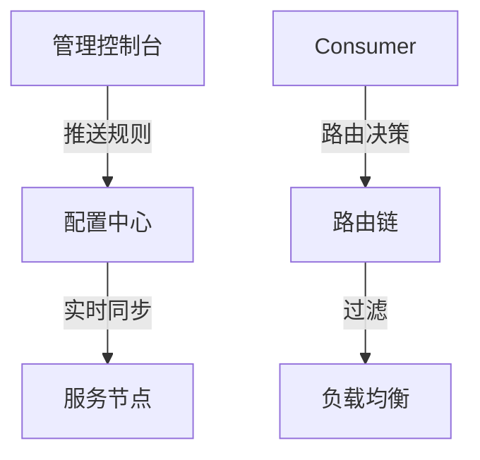

# Dubbo 面试之服务治理

## 服务注册和发现

### 【中等】什么是服务注册与发现？Dubbo 如何实现？⭐⭐⭐⭐

> 🎯 目标等级：L2 ｜ ⏱ 建议用时：12 min ｜ 🏷 标签：服务治理 / 注册发现

#### 💎 关键结论

Dubbo 的服务注册与发现是 **URL 驱动**的：Provider 启动时把自身地址 URL 上报注册中心，Consumer 订阅地址列表并构建本地 Invoker 缓存，注册中心实时推送变更、Consumer 据此重建列表。本质是维护 Directory（服务目录）的新鲜度——调用永远走本地缓存，注册中心只是控制面。

#### ⚡记忆卡片

- **口诀**：启动注册、订阅缓存、推送重建、调用走本地
- **关键词**：RegistryFactory SPI ／ RegistryDirectory ／ 订阅-通知 ／ 本地缓存 ／ CP vs AP
- **链路**：Provider 注册 URL → 注册中心存储并推送 → Consumer 订阅收到 notify → Directory 重建 Invoker 列表 → Router 过滤 + LoadBalance 选一个 → 直连 Provider 调用

#### 📖 核心知识

服务注册与发现的通用原理（角色、推拉模型、CP/AP 取舍）见《什么是服务注册和发现》，这里一句话带过：Provider 启动时把地址上报注册中心，Consumer 订阅地址列表并直连调用。本题聚焦 **Dubbo 的实现细节**。

Dubbo 通过 `registry` 配置指定注册中心，注册/订阅都是 URL 驱动：

::: details 示例：registry 配置

```xml
<!-- 服务提供者注册 -->
<dubbo:service interface="com.example.OrderService" ref="orderService" registry="zookeeper://127.0.0.1:2181"/>

<!-- 服务消费者发现 -->
<dubbo:reference id="orderService" interface="com.example.OrderService" registry="zookeeper://127.0.0.1:2181"/>
```

:::

**1. Registry SPI 扩展点**

Dubbo 把注册中心抽象为三层 SPI：

- **RegistryFactory**：注册中心的创建扩展点，`Adaptive` 扩展根据 URL 的协议头（`zookeeper://`、`nacos://`）分发到对应实现，并且**默认带缓存**（同一地址的注册中心只创建一次，连接复用）。新增一种注册中心只需实现该扩展，不改框架代码。
- **Registry**：提供 `register / unregister / subscribe / unsubscribe` 四个核心操作，ZK 实现映射为临时节点的创建删除 + Watch，Nacos 实现映射为实例注册 + 订阅推送。
- **NotifyListener**：Consumer 实现的回调接口，注册中心推送地址变更时由 `RegistryDirectory.notify()` 触发。

**2. 订阅推送流程**

1. Consumer 启动时，`RegistryDirectory` 先向注册中心**全量拉取**该接口的 Provider 列表，构建本地 Invoker 缓存；
2. 随后调用 `subscribe` 注册监听（ZK 上建立 Watch，Nacos 上注册推送订阅），Consumer 同时订阅 providers、configurators、routers 三类数据；
3. Provider 上下线时，注册中心通过 Watch / UDP 推送变更事件，回调 `RegistryDirectory.notify()`；
4. `notify()` 根据新地址列表**重建 Invoker 列表**，再叠加 Router 路由规则过滤、LoadBalance 负载均衡，得到最终可调用的 Invoker 集合。

**3. 服务目录 Directory**

`Directory` 是"服务所有可用 Invoker"的载体，分两种：`StaticDirectory`（固定列表，用于直连场景）和 `RegistryDirectory`（动态，订阅注册中心持续更新）。Consumer 每次 RPC 调用的路径是：**从 Directory 取 Invoker 全集 → Router 过滤（同机房、标签路由等）→ LoadBalance 选一个**。服务发现的本质就是维护这个 Directory 的新鲜度。

**4. 方案权衡：ZK vs Nacos 作为 Dubbo 注册中心**

| 维度       | ZooKeeper                                      | Nacos                                        |
| :--------- | :--------------------------------------------- | :------------------------------------------- |
| 一致性模型 | CP，选举期间不可读写                           | 临时实例默认 AP，可切换 CP                   |
| 存活性感知 | 临时节点 + session，连接断开自动删节点，感知快 | 客户端心跳上报，超时摘除，感知慢一拍（秒级） |
| 变更通知   | Watch 机制（一次性，触发后需重注册）           | UDP 推送 + 客户端轮询兜底                    |
| 附加能力   | 无                                             | 自带配置中心、控制台，与应用级服务发现配合好 |
| 适用边界   | 已有 ZK 技术栈、中小规模                       | 大规模实例、需控制台与配置一体化             |

#### 🔬 扩展知识

【L3】失效场景与量化数据

::: details

**失效场景**

- **注册中心全挂**：Dubbo Consumer 有本地缓存文件（`~/.dubbo/dubbo-registry-{appName}.cache`），**已有调用不受影响**；但新服务订阅失败，且冷启动的 Consumer 若无缓存会启动失败（可用 `check=false` 缓解）。
- **ZK session 过期**：网络抖动或 Provider Full GC 超过 sessionTimeout，临时节点被删，Consumer 收到地址缩减甚至空列表推送，依赖空列表保护与 Provider SDK 自动重注册恢复。
- **ZK Leader 选举**：选举期间（通常 200ms~数秒）对外拒绝读写，期间的注册、订阅全部阻塞排队。

**量化数据**

- **ZK session**：Dubbo 默认 session 超时 **60s**，客户端 SDK 每 **sessionTimeout/3**（约 20s）发一次 ping 保活；session 断开后临时节点立即删除，Consumer 感知时延约 1s 内。
- **Nacos 临时实例**：心跳间隔 **5s**，超过 **15s** 标记不健康，超过 **30s** 摘除（受 0.5 保护阈值约束），比 ZK 的断连感知慢一个心跳周期量级。
- **Dubbo Consumer**：默认 `check=true`，启动时找不到 Provider 直接启动失败（生产建议 `check=false`，避免启动顺序依赖）；地址变更推送延迟一般 **1s 以内**。
- **本地缓存**：`dubbo-registry-{appName}.cache` 在每次地址变更时同步写入，故障恢复时从文件加载为毫秒级。

:::

【L4】生产踩坑案例：ZK Leader 切换触发空列表推送

::: details

一次真实生产事故：凌晨高峰期大量 Consumer 报 `No provider available`，而 Provider 自身监控正常。排查发现，某台 ZooKeeper 节点网卡闪断约 5s，恰逢 ZK 集群 Leader 切换，大批 Provider 的 session 同时过期，Dubbo 临时节点被批量删除，Consumer 收到"空地址列表"通知，`RegistryDirectory` 直接清空了本地 Invoker 列表，流量全部断掉。**根因：`RegistryDirectory` 收到空推送时直接覆盖本地缓存，没有空列表保护**。**修复**：① 升级 Dubbo 版本开启空列表保护（收到空推送时保留旧列表并打告警日志，不再覆盖）；② ZK 的 sessionTimeout 从 30s 调大到 60s；③ 开启本地缓存文件，订阅失败时回退到最近一次已知地址。**教训：注册中心是控制面组件，它的数据异常不应直接击穿数据面调用**。

:::

【L4】场景推演：注册中心集群升级重启后一半 Consumer 报错

::: details

**注册中心集群升级重启后，约一半 Consumer 日志大量报 `No provider available`，另一半正常。如何排查和恢复？**

- **应急处理**：立即暂停一切 Consumer 的重启与发布；对关键服务通过配置中心下发直连地址（`-Ddubbo.reference.{service}.url=`）临时绕过注册中心；非关键服务等待注册中心数据自动恢复。
- **根因分析**："一半正常一半异常"是典型的**数据不一致 + 时序问题**：① 异常的那半 Consumer 恰好在升级窗口内重启，订阅时注册数据尚未同步完成，且 `check=true` 启动失败后反复重试；② ZK 集群重启后各节点数据恢复进度不一（快照 + 事务日志回放），不同节点对外暴露的数据不一致，连到不同节点的 Consumer 看到不同结果。
- **长期方案**：① 注册中心滚动升级，每批升级后校验数据一致性（Provider 节点数 diff）再继续；② Consumer 统一开启 `check=false` + 本地缓存容错，消除启动时序依赖；③ 升级窗口与业务发布窗口互斥；④ 监控"每个服务的 Provider 数量"，骤降立即告警。
- **权衡**：`check=false` 会让"配置错误、无 Provider"的应用也能启动，掩盖配置问题，需要用订阅失败告警来补偿——用启动可用性换配置严谨性，并通过监控补回。

:::

#### ⚠️ 常见误区

::: details

常见误区：

- ❌ "注册中心挂了，线上 RPC 调用就全断了" → 注册中心是控制面，Consumer 调用走本地 Invoker 缓存与已建立的长连接，注册中心故障只影响新订阅和地址更新，存量调用不受影响。
- ❌ "注册中心推送的地址列表一定是实时准确的" → 地址同步是最终一致的，推送有秒级延迟，且可能出现空推送、乱序推送，需要空列表保护与本地缓存兜底。
- ❌ "生产环境保持 check=true 更安全" → `check=true` 会造成 Consumer 对 Provider 的启动顺序依赖，注册中心或 Provider 未就绪就启动失败；生产建议 `check=false`，用订阅失败告警补偿配置严谨性。

:::

#### 🔀 发散问题

**Dubbo 为什么把注册中心抽象成 RegistryFactory SPI，而不是直接依赖 ZK/Nacos 客户端？**

这是 Dubbo "一切皆可替换"的设计哲学：注册中心只是一种 URL 协议，通过 SPI + Adaptive 扩展分发，新增 Etcd/Consul 只需增加一个 Factory 实现，框架核心零改动。这也天然支持**多注册中心**场景（不同服务注册到不同注册中心），本质只是 URL 上 registry 配置不同。

**ZK 的 Watch 机制是一次性的（触发即失效），Dubbo 如何防止地址变更丢失？**

三重兜底：① 每次收到事件后立即重新建立 Watch（重新订阅）；② `RegistryDirectory` 在订阅失败或事件异常时全量重拉兜底；③ 本地缓存文件作为最后一道防线。因此推送丢失最多造成秒级延迟，不会造成永久性数据不一致。

**Dubbo2 接口级与 Dubbo3 应用级服务发现，在数据规模与失效边界上有什么本质区别？**

接口级的数据量是"接口数 × 实例数"，大规模场景下注册中心存储与推送压力巨大（千实例应用可膨胀出数百万节点），且地址变更按接口逐个推送；应用级只按应用维度注册，数据量下降一个数量级，并能与 K8s Service 等云原生体系打通，但迁移期需要双注册双订阅，Consumer 要处理两份数据源的合并与兼容。详见本文档『Dubbo3 的应用级服务发现的工作原理是什么？』。

### 【简单】Dubbo 支持哪些注册中心？⭐⭐

> 🎯 目标等级：L2 ｜ ⏱ 建议用时：5 min ｜ 🏷 标签：服务治理 / 注册发现

#### 💎 关键结论

Dubbo 主流的注册中心实现有 ZooKeeper、Nacos、Redis、Consul、Etcd 等，且可通过 RegistryFactory SPI 自行扩展。注意 Dubbo3 定义了**三种中心**——注册中心、配置中心、元数据中心，后两者是高阶服务治理能力的依赖，通常可选配。

#### ⚡记忆卡片

- **口诀**：三种中心各司职，注册必配余可选
- **关键词**：注册中心 ／ 配置中心 ／ 元数据中心 ／ RegistryFactory SPI
- **链路**：应用启动读取三种中心配置 → RegistryFactory 按 URL 协议创建注册中心 → 注册中心存地址、配置中心存治理规则、元数据中心存接口定义

#### 📖 核心知识

不同于传统的 Dubbo2，Dubbo3 中定义了三种中心：注册中心、配置中心、元数据中心。配置中心、元数据中心是实现 Dubbo 高阶服务治理能力会依赖的组件，如流量管控规则等，相比于注册中心通常这两个组件的配置是可选的。

::: details 示例：三种中心配置方式

```yaml
dubbo
 registry
  address: nacos://localhost:8848
 config-center
  address: nacos://localhost:8848
 metadata-report
  address: nacos://localhost:8848
```

:::

需要注意的是，**对于部分注册中心类型（如 Zookeeper、Nacos 等），Dubbo 会默认同时将其用作元数据中心和配置中心（建议保持默认开启状态）。**

Dubbo 目前支持的主流注册中心实现包括：

- Zookeeper
- Nacos
- Redis
- Consul
- Etcd
- 更多实现

同时也支持 Kubernetes、Mesh 体系的服务发现，具体请参考 [使用教程 - kubernetes 部署](http://localhost:1313/zh-cn/overview/mannal/java-sdk/tasks/deploy/)

#### 🔀 发散问题

**为什么 ZooKeeper、Nacos 可以被默认复用为元数据中心和配置中心？**

因为它们本身具备持久化存储与监听推送能力，既能承载地址数据，也能承载配置与元数据，复用可以减少组件部署数量、降低运维成本；但在超大规模或对隔离性要求高的场景，建议拆分为独立部署。

**新增一种注册中心（如 etcd）需要改动 Dubbo 框架吗？**

不需要。实现 RegistryFactory SPI 扩展并按 SPI 规范声明即可，Dubbo 的 Adaptive 扩展会根据 URL 协议头自动分发，框架核心零改动。

### 【简单】注册中心挂了可以继续通信吗？⭐⭐

> 🎯 目标等级：L2 ｜ ⏱ 建议用时：3 min ｜ 🏷 标签：服务治理 / 注册发现

#### 💎 关键结论

可以。Dubbo Consumer 启动时会从注册中心拉取 Provider 地址并缓存在本地（内存 + 本地缓存文件），每次调用按本地缓存的地址直连 Provider。注册中心只参与地址的注册与分发（控制面），不在调用链路上（数据面），因此它挂掉后存量调用不受影响。

#### ⚡记忆卡片

- **口诀**：注册中心是控制面，调用链路不经过它
- **关键词**：本地缓存 ／ 控制面 vs 数据面 ／ check=false
- **链路**：启动时拉取地址 → 缓存到内存与本地文件 → 注册中心宕机 → 调用仍走本地缓存 → 仅地址更新与新订阅受影响

#### 📖 核心知识

可以。Dubbo 消费者在应用启动时会从注册中心拉取已注册的生产者的地址接口，并缓存在本地。每次调用时，按照本地存储的地址进行调用。

需要补充两个边界：

- **地址会短暂过期**：注册中心挂掉期间，Provider 上下线无法同步，Consumer 可能调到已下线节点，依靠集群容错（如 Failover 重试）兜底。
- **冷启动风险**：若 Consumer 在注册中心故障期间冷启动且无本地缓存文件，订阅会失败；默认 `check=true` 会直接启动失败，生产建议 `check=false`。Dubbo 还会把最近一次地址列表持久化到本地缓存文件（`~/.dubbo/dubbo-registry-{appName}.cache`），重启时可回退加载。

#### 🔀 发散问题

**注册中心挂掉后，新上线的 Provider 能被调用吗？**

短期内不能。新 Provider 无法完成注册，Consumer 的本地缓存里没有它的地址；要等注册中心恢复、地址同步后才能被发现。应急时可通过直连 URL 临时调用。

### 【中等】注册中心是选择 CP 还是 AP？⭐⭐

> 🎯 目标等级：L2 ｜ ⏱ 建议用时：10 min ｜ 🏷 标签：服务治理 / 注册发现

#### 💎 关键结论

取决于业务诉求：要求地址强一致、宁可短暂不可用选 CP（ZooKeeper、etcd、Consul）；要求任何时候都能拿到地址、容忍短暂过期选 AP（Eureka）。分区容错是既定事实，CAP 实际是在 C 和 A 之间取舍；Nacos 则支持按实例类型切换。

#### ⚡记忆卡片

- **口诀**：P 是前提，C、A 二选一；一致选 ZK，可用选 Eureka
- **关键词**：CAP 理论 ／ CP ／ AP ／ Leader 选举 ／ 最终一致性
- **链路**：网络分区发生 → CP 阵营保一致性拒绝服务（选举期不可用）→ AP 阵营保可用性返回旧数据 → Consumer 拿缓存地址继续调用

#### 📖 核心知识

**1. CAP 理论基础**

在分布式系统领域，有一个著名的 [CAP 理论](https://en.wikipedia.org/wiki/CAP_theorem)。CAP 定理提出：分布式系统有三个指标，这三个指标不能同时做到：

- **一致性（Consistency）** - 在任何给定时间，网络中的所有节点都具有完全相同（最近）的值。
- **可用性（Availability）** - 对网络的每个请求都会返回响应，但不能保证返回的数据是最新的。
- **分区容错性（Partition Tolerance）** - 即使任意数量的节点出现故障，网络仍会继续运行。

CAP 就是取 Consistency、Availability、Partition Tolerance 的首字母而命名。


在分布式系统中，分区容错性是一个既定的事实：因为分布式系统总会出现各种各样的问题，如由于网络原因而导致节点失联；发生机器故障；机器重启或升级等等。因此，**CAP 定理实际上是要在可用性（A）和一致性（C）之间做权衡**。

**2. 注册中心选 AP 还是 CP？**

注册中心作为服务提供者和服务消费者之间沟通的桥梁，它的重要性不言而喻。所以注册中心一般都是采用集群部署来保证高可用性，并通过分布式一致性协议来确保集群中不同节点之间的数据保持一致。

根据 [CAP 理论](https://en.wikipedia.org/wiki/CAP_theorem)，三种特性无法同时达成，必须在可用性和一致性之间做取舍。于是，根据不同侧重点，注册中心可以分为 CP 和 AP 两个阵营：

- **CP 型注册中心** - **牺牲可用性来换取数据强一致性**，最典型的例子就是 ZooKeeper，etcd，Consul 了。ZooKeeper 集群内只有一个 Leader，而且在 Leader 无法使用的时候通过算法选举出一个新的 Leader。这个 Leader 的目的就是保证写信息的时候只向这个 Leader 写入，Leader 会同步信息到 Followers，这个过程就可以保证数据的强一致性。但如果多个 ZooKeeper 之间网络出现问题，造成出现多个 Leader，发生脑裂的话，注册中心就不可用了。而 etcd 和 Consul 集群内都是通过 Raft 协议来保证强一致性，如果出现脑裂的话，注册中心也不可用。
- **AP 型注册中心** - **牺牲一致性（只保证最终一致性）来换取可用性**，最典型的例子就是 Eureka 了。Eureka 在设计的时候就是优先保证 A（可用性）。在 Eureka 中不存在什么 Leader 节点，每个节点都是一样的、平等的。因此 Eureka 不会像 ZooKeeper 那样出现选举过程中或者半数以上的机器不可用的时候服务就是不可用的情况。Eureka 保证即使大部分节点挂掉也不会影响正常提供服务，只要有一个节点是可用的就行了。只不过这个节点上的数据可能并不是最新的。
- **CP & AP 都支持型注册中心** - Nacos 的内在设计偏向于 CP，即在发生网络分区的情况下优先保证数据的一致性和分区容错性，牺牲一定的可用性。虽然 Nacos 的内在设计偏向于 CP，但通过合理的配置与实践，可以在一定程度上优化其可用性。例如：调整副本数、配置同步策略。

选择 CP 还是 AP，根据实际需要来定：如果业务场景要求强一致，优先选择 CP 型注册中心；如果业务场景强调可用性，优先选择 AP 型注册中心。

**3. 注册中心选型对比**

| 注册中心      | 特点                       | 适用场景                 |
| ------------- | -------------------------- | ------------------------ |
| **Zookeeper** | CP 系统，强一致性，高延迟  | 对一致性要求高的传统项目 |
| **Nacos**     | AP/CP 可切换，支持动态配置 | 云原生、微服务架构       |
| **Consul**    | 多数据中心，健康检查完善   | 跨机房服务发现           |

#### 🔬 扩展知识

【L3】CP/AP 取舍对服务调用时效性的具体影响

::: details

- **CP 注册中心的失效窗口**：ZooKeeper 在 Leader 选举期间（通常 200ms~数秒）拒绝读写，此时新的注册/订阅被阻塞，但 Consumer 已有本地缓存仍可继续调用；若 Consumer 恰好在此窗口冷启动且 `check=true`，会启动失败。
- **AP 注册中心的脏读窗口**：Eureka 类 AP 注册中心节点间靠异步复制同步，Consumer 从不同节点可能读到不同版本的地址列表，可能短暂调到已下线实例，需要依赖客户端容错（重试、剔除失效节点）兜底。
- **结论**：对 RPC 场景，AP 通常更友好——地址短暂过期可由客户端容错消化，而注册中心整体不可用会阻塞发布与扩容；但金融类强一致场景可选 CP。

:::

【L4】Nacos 的 AP/CP 切换机制

::: details

Nacos 支持按实例类型区分一致性协议：临时实例（ephemeral）默认使用 AP 协议（Distro），实例心跳由客户端上报，适合大规模微服务；持久实例（persistent）使用 CP 协议（Raft），数据写入需多数派确认，适合需要强一致记录的场景。Dubbo 默认注册临时实例，因此实际运行在 AP 模式。更多详情可以参考：[Nacos CAP](https://nacos.io/en/blog/faq/nacos-user-question-history10508/?spm=5238cd80.e9131ff.0.0.69845e2958zjvo&source=wuyi)

:::

> 📚 延伸阅读：[Nacos CAP](https://nacos.io/en/blog/faq/nacos-user-question-history10508/?spm=5238cd80.e9131ff.0.0.69845e2958zjvo&source=wuyi)、[CAP 理论 | Wikipedia](https://en.wikipedia.org/wiki/CAP_theorem)

#### ⚠️ 常见误区

::: details

常见误区：

- ❌ "AP 注册中心数据不一致，所以不能用于生产" → RPC 调用走 Consumer 本地缓存，地址短暂过期可由重试、失效节点剔除等客户端容错手段消化，AP 反而是大规模微服务的主流选择。
- ❌ "CP 注册中心任何时候都是一致的，绝对安全" → CP 的一致性以可用性为代价：选举窗口内注册中心整体不可读写，且脑裂场景下同样可能不可用。
- ❌ "选了 AP 就不用关心一致性了" → AP 只是最终一致，需要配合客户端的推空保护、缓存兜底和容错策略，否则脏地址可能引发调用失败。

:::

#### 🔀 发散问题

**注册中心选型和 Dubbo 注册中心数据同步方式有什么关系？**

一致性模型决定了同步机制：CP 型（ZK）靠临时节点 + Watch 推送变更，断连即感知；AP 型（Nacos）靠客户端心跳 + 服务端推送/轮询兜底，感知慢一拍。详见本文档『Dubbo 注册中心的数据是如何同步的？』。

**注册中心挂了调用还能继续，那 CP/AP 的选择还重要吗？**

重要。CP/AP 影响的是地址变更的生效时效与故障窗口行为：扩缩容、发布期间的地址一致性，以及注册中心自身分区时的可用性，都直接由选型决定。详见本文档『注册中心挂了可以继续通信吗？』。

### 【中等】Dubbo 的服务自动上线与下线机制是怎样的？⭐⭐

> 🎯 目标等级：L2 ｜ ⏱ 建议用时：10 min ｜ 🏷 标签：服务治理 / 注册发现

#### 💎 关键结论

上线靠**启动注册**：Provider 启动时解析服务配置并把元数据注册到注册中心，Consumer 拉取并订阅变更；下线分**主动**（Shutdown Hook 触发注销）和**被动**（心跳/会话超时由注册中心剔除）。配合优雅停机，可以做到先摘流量再停进程。

#### ⚡记忆卡片

- **口诀**：启动注册、钩子注销、心跳兜底、优雅停机
- **关键词**：Shutdown Hook ／ 临时节点 ／ 心跳检测 ／ 无损下线
- **链路**：Provider 启动解析配置 → 注册 URL 到注册中心 → Consumer 订阅感知上线 → Provider 关闭触发 Shutdown Hook 注销 → 注册中心删节点推送变更 → Consumer 剔除地址

#### 📖 核心知识

**1. 服务自动上线流程**

- **启动注册**：
  - 服务提供者启动时，解析配置文件（如 `dubbo:service` 或注解 `@Service`），获取服务接口、方法、版本、分组等信息。
  - 将服务元数据（如 IP、端口、接口名）注册到注册中心（如 Zookeeper/Nacos）。
  - 注册中心存储服务信息，形成服务目录（如 Zookeeper 的 `/dubbo/{service}/providers` 节点）。
- **消费者发现**：
  - 消费者启动时，从注册中心拉取服务提供者列表，并建立长连接。
  - 注册中心推送变更通知（如新服务上线），消费者动态更新本地服务列表。

**2. 服务自动下线流程**

- **主动下线**：
  - 服务提供者正常关闭时，触发 Shutdown Hook，向注册中心发送注销请求。
  - 注册中心删除对应节点，消费者通过事件监听感知服务下线。
- **被动下线**：
  - **心跳检测**：若提供者宕机，注册中心未收到心跳（如 Zookeeper 的 Session 超时），自动剔除故障节点。
  - **消费者容错**：已连接的消费者通过故障处理机制（如 Failover）切换至其他可用节点。

**3. 关键保障机制**

- **心跳保活**：默认心跳间隔 60 秒（可调），超时时间建议 3 倍心跳间隔。
- **重试容错**：消费者支持 `retries` 配置（如 Failover 策略），避免单点故障。
- **优雅停机**：通过 `ProtocolConfig.destroy()` 确保注销完成后再终止 JVM。

#### 🔬 扩展知识

【L3】高级治理能力：灰度、权重与无损下线

::: details

- **版本灰度**：通过 `version` 字段实现多版本共存，逐步下线旧版本。
- **权重调整**：动态修改服务权重（如 Nacos 控制台），实现平滑流量迁移。
- **无损下线**：结合 QOS 命令（`offline`）或 PreStop Hook，确保流量完全迁移后再下线。

:::

【L4】常见问题排查与最佳实践

::: details

**常见问题排查**

- **服务未注册**：
  - 检查注册中心地址、网络连通性。
  - 查看提供者日志是否有 `RegistryFailedException`。
- **僵尸节点**：
  - 手动清理注册中心残留节点（如 Zookeeper 的 `delete /dubbo/{service}/providers/xxx`）。
  - 调整心跳超时时间，避免因网络抖动误判。
- **消费者未感知下线**：
  - 确认注册中心支持事件推送（如 Nacos 的 `notify` 机制）。
  - 检查消费者是否配置了 `check=false`（禁用启动时强依赖检查）。

**最佳实践**

- **生产环境建议**：
  - 使用 Nacos 作为注册中心，兼顾可用性和动态配置能力。
  - 开启 Dubbo Admin 监控，实时查看服务状态。
- **停机操作**：先通过 `telnet 127.0.0.1 20880` 执行 `invoke offline()` 命令，再重启服务。
- **版本迭代**：采用 `version="1.0.0"` 和 `group="canary"` 分批次上线，降低风险。

:::

#### ⚠️ 常见误区

::: details

常见误区：

- ❌ "kill -9 停掉 Provider，Consumer 马上就不会调到它了" → kill -9 不会触发 Shutdown Hook，只能等注册中心心跳/会话超时（秒级甚至更久）才剔除，期间调用会失败并依赖容错兜底；应使用优雅停机。
- ❌ "下线 = 注销注册中心节点，一步就够了" → 还需要等待存量请求处理完（排空在途请求）、通知 Consumer 感知变更，否则注销瞬间仍会有请求打进来，这正是无损下线要解决的问题。
- ❌ "被动下线可以完全替代主动下线" → 被动下线依赖超时检测，感知慢且期间伴随调用失败；主动下线是主路径，被动下线只是宕机等异常场景的兜底。

:::

#### 🔀 发散问题

**优雅停机具体做了哪些事？**

核心是先摘流量再停进程：触发 Shutdown Hook 后，先从注册中心注销、通知对端关闭长连接、等待在途请求处理完成，最后再销毁协议与线程池资源，避免流量损失。

**为什么被动下线依赖心跳超时，感知会有延迟？**

注册中心无法实时知道进程是否宕机，只能通过心跳缺失推断：ZK 靠 session 超时（Dubbo 默认 60s 内断连即删临时节点），Nacos 靠心跳间隔（5s）+ 健康阈值（15s 标记不健康、30s 摘除），因此被动感知总是慢于主动注销。

### 【困难】Dubbo3 的应用级服务发现的工作原理是什么？⭐⭐

> 🎯 目标等级：L3 ｜ ⏱ 建议用时：15 min ｜ 🏷 标签：服务治理 / 注册发现

#### 💎 关键结论

应用级服务发现的核心是**注册与元数据分离**：注册中心只存"应用名 + 实例地址"，接口元数据上报到元数据中心，消费者按需拉取。注册数据量从 `O(接口数 × 实例数)` 降到 `O(实例数)`，解决大规模集群下注册中心容量瓶颈，并与云原生体系打通。

#### ⚡记忆卡片

- **口诀**：注册只报应用，元数据另存，按需拉取
- **关键词**：应用级服务发现 ／ 元数据中心 ／ 接口级 vs 应用级 ／ 双注册双订阅
- **链路**：Provider 元数据上报元数据中心 → 仅注册应用实例到注册中心 → Consumer 订阅应用实例列表 → 首次调用前按需拉取接口元数据 → 应用实例级负载均衡发起调用

#### 📖 核心知识

**【应用级服务发现】是 Dubbo3 引入的新特性**，旨在解决大规模微服务架构下 **注册中心压力大** 和 **服务治理效率低** 的问题。其核心思想是 **以应用为维度注册实例**，而非传统接口级注册。

应用级注册通过 **注册与元数据分离**，将注册中心的数据量降低至常数级，显著提升了大规模微服务架构的可扩展性。其核心创新在于：

- **注册中心只存应用实例**，元数据独立存储；
- **消费者按需加载接口信息**，减少网络开销；
- **完美兼容旧模式**，支持渐进式迁移。

**与传统接口级注册的对比**

| **维度**         | **Dubbo2（接口级）**                                 | **Dubbo3（应用级）**                                |
| ---------------- | ---------------------------------------------------- | --------------------------------------------------- |
| **注册单位**     | 每个服务接口单独注册（如 `com.example.UserService`） | 整个应用的所有接口统一注册（如 `user-service-app`） |
| **注册数据量**   | 随接口数量线性增长（100 接口=100 条注册记录）        | 恒定（1 个应用=1 条注册记录）                       |
| **服务发现粒度** | 接口级别                                             | 应用级别（消费者按需拉取接口元数据）                |

**1. 接口级服务发现工作原理（背景）**

Dubbo3 以前的版本采用的是接口级服务发现。


Provider 部署的应用中通常会有多个 Service，每个 service 都可能会有其独有的配置。Service 服务发布的过程，其实就是基于这个服务配置生成地址 URL 的过程，生成的地址数据如图所示。

注册中心的地址数据存储结构，以 Service 服务名为数据划分依据，将一个服务下的所有地址数据都作为子节点进行聚合，子节点的内容就是实际可访问的 ip 地址，也就是我们 Dubbo 中 URL，格式就是刚才 Provider 实例生成的。


这里把 URL 地址数据划分成了几份：

- **实例可访问地址**：主要信息包含 ip 和 port，消费端将基于这条数据生成 tcp 网络链接，作为后续 RPC 数据的传输载体。
- **RPC 元数据**：元数据用于定义和描述一次 RPC 请求。它可以分为两类：
  - **具体的 RPC 服务信息**：如版本号、分组以及方法相关信息；
  - **RPC 配置数据**：控制 RPC 调用的行为，同步 Provider 进程实例的状态（如超时时间、数据编码的序列化方式等）。
- **自定义元数据**：用户可任意扩展并添加自定义元数据。

综上，有以下结论：

1. 服务发现聚合的 key 就是 RPC 粒度的服务
2. 注册中心同步的数据不止包含地址，还包含了各种元数据以及配置
3. 得益于 1 与 2，Dubbo 实现了支持应用、RPC 服务、方法粒度的服务治理能力

这就是一直以来 Dubbo2 在易用性、服务治理功能性、可扩展性上强于很多服务框架的真正原因。


接口级注册的易用性是有代价的，它限制了整体架构的扩展性，在大规模 Dubbo 集群中尤为凸显。其突出问题如下：

- **注册中心集群容量会成为瓶颈**：由于所有的 URL 地址数据都被发送到注册中心，注册中心的存储容量达到上限，推送效率也随之下降。
- **消费端资源消耗较大**：在消费端，Dubbo2 框架常驻内存已超 40%，每次地址推送带来的 cpu 等资源消耗率也非常高，影响正常的业务调用。

为什么会出现这个问题？举例来说，假设有一个普通的 Dubbo Provider 应用，该应用内部定义有 10 个 RPC Service，应用被部署在 100 个机器实例上。这个应用在集群中产生的数据量将会是 `Service 数 * 机器实例数`，也就是 `10 * 100 = 1000` 条数据。数据会从两个维度放大：

- **从地址角度**。100 条唯一的实例地址，被放大 10 倍
- **从服务角度**。10 条唯一的服务元数据，被放大 100 倍

**2. 应用级服务发现工作原理**


**提供者服务注册**

- 启动时，应用（如 `user-service-app`）将所有服务接口的 **元数据**（方法列表、协议等）上报至 **元数据中心**（如 Nacos）。
- 仅将 **应用名+实例 IP+端口** 注册到 **注册中心**（如 ZooKeeper），**不包含接口信息**。

**消费者服务发现**

- **订阅目标应用**：
  - 消费者（如 `order-service-app`）从注册中心获取目标应用（如 `user-service-app`）的 **实例列表**（IP+端口）。
  - **不直接获取接口信息**，避免注册中心数据膨胀。
- **按需拉取元数据**：
  - 消费者首次调用前，从 **元数据中心** 拉取目标应用的接口元数据（如 `UserService` 的方法签名）。
  - 本地缓存元数据，后续调用直接使用。

**调用过程**

- 消费者通过 **应用名+接口名** 定位实例，发起 RPC 调用（协议兼容 Dubbo2）。
- 负载均衡在应用实例级别进行（如随机选择 `user-service-app` 的一个实例）。

**关键设计优势**

- **注册中心轻量化**：实例数从 `O（接口数×实例数）` 降至 `O（实例数）`，适合万级节点集群。
- **动态扩容高效**：新增接口无需重复注册，只需更新元数据中心。
- **兼容性保障**：支持与 Dubbo2 的接口级注册共存，平滑升级。

#### 🔬 扩展知识

【L3】迁移方案：双注册双订阅

::: details

从接口级迁移到应用级不能一刀切，Dubbo3 提供平滑迁移模式：Provider 同时向接口级与应用级双注册，Consumer 同时订阅两份数据源（可配置优先级与合并策略），待全集群升级完成后再关闭接口级注册与订阅。迁移期需要关注两份数据源的地址合并、治理规则的粒度差异（应用级治理以应用为粒度下发），以及元数据中心的可用性（应用级发现强依赖元数据中心）。

:::

【L4】与云原生体系的打通

::: details

应用级服务发现以"应用实例"为注册单位，与 K8s Service、Istio 等云原生服务发现的模型天然对齐：实例地址可直接复用 K8s 的 Endpoint 数据，服务发现可下沉到基础设施层，Dubbo 应用能更平滑地融入 Mesh 体系。这也是 Dubbo3 面向云原生重构的核心动机之一。

:::

> 📚 延伸阅读：[Dubbo3 应用级服务发现设计](https://cn.dubbo.apache.org/zh-cn/blog/2023/01/30/dubbo3-%E5%BA%94%E7%94%A8%E7%BA%A7%E6%9C%8D%E5%8A%A1%E5%8F%91%E7%8E%B0%E8%AE%BE%E8%AE%A1/)

#### ⚠️ 常见误区

::: details

常见误区：

- ❌ "应用级服务发现会丢失接口级、方法级的精细治理能力" → 治理能力通过元数据中心补齐：接口与方法元数据仍然存在，只是从注册中心搬到元数据中心按需拉取，治理规则可继续按服务粒度下发。
- ❌ "升级到 Dubbo3 就自动切换为应用级发现，无需任何操作" → 需要显式配置迁移模式（双注册双订阅），并确认元数据中心可用；直接切换会导致旧版 Consumer 找不到地址。
- ❌ "应用级注册只是省存储，对 Consumer 没有影响" → Consumer 侧收益同样显著：地址推送从按接口逐个推送变为按应用聚合推送，内存与 CPU 消耗大幅下降（接口级场景下 Dubbo2 框架常驻内存可超 40%）。

:::

#### 🔀 发散问题

**应用级服务发现为什么强依赖元数据中心？**

因为注册中心只存"应用名 + 地址"，Consumer 要发起调用必须知道目标应用提供了哪些接口、方法签名和调用配置，这些信息全部存在元数据中心，首次调用前按需拉取并本地缓存；元数据中心不可用时，只影响新订阅，已缓存的调用不受影响。

**接口级发现的数据膨胀是如何计算的？**

数据量 = 接口数 × 实例数。例如 10 个 Service、100 个实例的应用会产生 1000 条注册数据：100 条唯一实例地址被放大 10 倍，10 条唯一服务元数据被放大 100 倍；应用级模型下只剩 100 条实例数据。

**应用级发现和本文档『什么是服务注册与发现？Dubbo 如何实现？』中的 RegistryDirectory 是什么关系？**

服务目录仍是调用时的地址载体，应用级发现改变的是 Directory 数据的来源与聚合粒度：从按接口订阅注册中心，变为按应用订阅实例列表 + 从元数据中心补齐接口信息，最终同样汇聚为 Invoker 列表供路由与负载均衡使用。

## 负载均衡

### 【中等】Dubbo 支持哪些负载均衡方式？各有什么利弊？⭐⭐

> 🎯 目标等级：L2 ｜ ⏱ 建议用时：10 min ｜ 🏷 标签：服务治理 / 负载均衡

#### 💎 关键结论

Dubbo 提供的是**客户端负载均衡**：由 Consumer 本地基于 Directory 中的 Invoker 列表执行算法选点，默认策略是 `weighted random`（加权随机）。内置 7 种算法，可按静态属性（权重、哈希）或动态负载（活跃数、响应时间、P2C/Adaptive）选点，配置可细粒度到服务、方法级别。

#### ⚡记忆卡片

- **口诀**：默认加权随机，慢节点用最少活跃，有状态用一致性哈希
- **关键词**：客户端负载均衡 ／ Random ／ RoundRobin ／ LeastActive ／ ConsistentHash ／ P2C ／ Adaptive
- **链路**：Directory 提供全量 Invoker → Router 过滤出子集 → LoadBalance 按算法选一个 → 调用失败触发容错重选

#### 📖 核心知识

Dubbo 提供了多种均衡策略，缺省为 `weighted random` 基于权重的随机负载均衡策略。具体实现上，Dubbo 提供的是客户端负载均衡，即由 Consumer 通过负载均衡算法得出需要将请求提交到哪个 Provider 实例。

**1. 内置算法一览**

| 算法             | 算法类型                | 说明                                                 |
| :--------------- | :---------------------- | :--------------------------------------------------- |
| Random           | 加权随机                | 默认算法，默认权重相同                               |
| RoundRobin       | 加权轮询                | 借鉴于 Nginx 的平滑加权轮询算法，默认权重相同        |
| LeastActive      | 最少活跃优先 + 加权随机 | 背后是能者多劳的思想                                 |
| ShortestResponse | 最短响应优先 + 加权随机 | 更加关注响应速度                                     |
| ConsistentHash   | 一致性哈希              | 确定的入参，确定的提供者，适用于有状态请求           |
| P2C              | Power of Two Choice     | 随机选择两个节点后，继续选择“连接数”较小的那个节点。 |
| Adaptive         | 自适应负载均衡          | 在 P2C 算法基础上，选择二者中 load 最小的那个节点    |

Dubbo 的负载均衡配置可以细粒度到服务、方法级别，且 `dubbo:service` 和 `dubbo:reference` 均可配置。

::: details 示例：四级粒度的 loadbalance 配置

```xml
<!-- 服务端服务级别 -->
<dubbo:service interface="..." loadbalance="roundrobin" />
<!-- 客户端服务级别 -->
<dubbo:reference interface="..." loadbalance="roundrobin" />
<!-- 服务端方法级别 -->
<dubbo:service interface="...">
    <dubbo:method name="..." loadbalance="roundrobin"/>
</dubbo:service>
<!-- 客户端方法级别 -->
<dubbo:reference interface="...">
    <dubbo:method name="..." loadbalance="roundrobin"/>
</dubbo:reference>
```

:::

**2. 静态类算法详解**

- **Random（加权随机）**：按权重设置随机概率。在一个截面上碰撞的概率高，但调用量越大分布越均匀，而且按概率使用权重后也比较均匀，有利于动态调整提供者权重。缺点：存在慢的提供者累积请求的问题，比如：第二台机器很慢，但没挂，当请求调到第二台时就卡在那，久而久之，所有请求都卡在调到第二台上。
- **RoundRobin（加权轮询）**：按公约后的权重设置轮询比率，循环调用节点。缺点：同样存在慢的提供者累积请求的问题。
- **ConsistentHash（一致性 Hash）**：相同参数的请求总是发到同一提供者。当某一台提供者挂时，原本发往该提供者的请求，基于虚拟节点，平摊到其它提供者，不会引起剧烈变动。算法参见：[Consistent Hashing | WIKIPEDIA](http://en.wikipedia.org/wiki/Consistent_hashing)。缺省只对第一个参数 Hash，如果要修改，请配置 `<dubbo:parameter key="hash.arguments" value="0,1" />`；缺省用 160 份虚拟节点，如果要修改，请配置 `<dubbo:parameter key="hash.nodes" value="320" />`。

**3. 动态类算法详解**

- **LeastActive（最少活跃优先）**：加权最少活跃调用优先，活跃数越低，越优先调用，相同活跃数的进行加权随机。活跃数指调用前后计数差（针对特定提供者：请求发送数 - 响应返回数），表示特定提供者的任务堆积量，活跃数越低，代表该提供者处理能力越强。使慢的提供者收到更少请求，因为越慢的提供者的调用前后计数差会越大；相对的，处理能力越强的节点，处理更多的请求。
- **ShortestResponse（最短响应优先）**：加权最短响应优先，在最近一个滑动窗口中，响应时间越短，越优先调用。相同响应时间的进行加权随机。使得响应时间越快的提供者，处理更多的请求。缺点：可能会造成流量过于集中于高性能节点的问题。这里的响应时间 = 某个提供者在窗口时间内的平均响应时间，窗口时间默认是 30s。
- **P2C（Power of Two Choice）**：算法简单但是经典，主要思路：① 对于每次调用，从可用的 provider 列表中做两次随机选择，选出两个节点 providerA 和 providerB；② 比较 providerA 和 providerB 两个节点，选择其“当前正在处理的连接数”较小的那个节点。
- **Adaptive（自适应）**：能根据后端实例负载自动调整流量分布的算法实现，在 P2C 基础上，它总是尝试将请求转发到负载（load）最小的节点。

#### 🔬 扩展知识

【L3】慢节点累积问题的治理思路

::: details

Random/RoundRobin 都存在慢提供者累积请求的问题（慢节点没挂但请求卡住，越积越多）。治理路径：① 换用 LeastActive，慢节点活跃数自然偏高，分到更少请求；② 结合超时 + Failover，让卡在慢节点的请求尽快转移；③ 动态调低慢节点权重（注册中心控制台或动态配置），从源头减少分配。核心思想是**让负载反馈参与选点决策**，这正是动态类算法的价值。

:::

【L4】P2C 与 Adaptive 的启发式流控背景

::: details

P2C 与 Adaptive 属于 Dubbo 启发式流控（heuristic flow control）体系：不依赖全局中心化的负载信息，而是让每个 Consumer 基于本地可观测指标（连接数、负载）做近似最优决策，避免了中心化采集的开销与延迟。两者的实现细节与指标定义以官方提案为准：[Dubbo P2C 算法实现提案](https://cn.dubbo.apache.org/zh-cn/overview/reference/proposals/heuristic-flow-control/#p2c%20%E7%AE%97%E6%B3%95)、[Dubbo Adaptive 算法实现提案](https://cn.dubbo.apache.org/zh-cn/overview/reference/proposals/heuristic-flow-control/#adaptive%E7%AE%97%E6%B3%95)。

:::

> 📚 延伸阅读：[Dubbo 官方文档之负载均衡](https://cn.dubbo.apache.org/zh-cn/overview/what/core-features/load-balance/)、[负载均衡](https://dunwu.github.io/waterdrop/pages/23491030/)

#### ⚠️ 常见误区

::: details

常见误区：

- ❌ “一致性哈希能保证绝对的请求均匀粘滞” → 它只保证相同参数路由到同一提供者，且提供者下线时请求会基于虚拟节点重新平摊；哈希参数与虚拟节点数都可配置，默认只对第一个参数哈希。
- ❌ “权重相同的情况下 Random 和 RoundRobin 效果完全一样” → 单次截面上 Random 存在碰撞波动，RoundRobin 严格按比率轮转；调用量足够大时两者分布趋同，小流量下 RoundRobin 更均匀。
- ❌ “自适应负载均衡一定优于随机” → Adaptive 依赖本地负载指标的准确性，在节点极少或负载同质化的场景收益有限，且引入额外计算开销；默认 Random 在多数场景已足够。

:::

#### 🔀 发散问题

**Dubbo 为什么选择客户端负载均衡而不是服务端负载均衡？**

客户端负载均衡不需要额外的接入层组件，Consumer 直连 Provider，少一跳转发、无中心化瓶颈；且 Consumer 本地掌握全量地址列表与调用反馈（活跃数、RT），天然适合做动态选点。代价是每个 Consumer 都要维护地址与算法状态。

**负载均衡和服务路由是什么关系？**

调用链路上先路由后均衡：Router 先从全量 Invoker 中过滤出符合条件的子集（如标签、灰度），LoadBalance 再在子集内选一个节点。详见本文档『Dubbo 路由是怎样工作的？』。

**如何动态调整 Provider 权重实现流量迁移？**

通过注册中心控制台（如 Nacos）或动态配置修改实例权重，Consumer 收到地址/配置推送后，加权类算法（Random/RoundRobin/LeastActive）会按新权重分配流量，可实现不停机的平滑迁移。

### 【中等】Dubbo 如何进行服务路由控制？⭐⭐

> 🎯 目标等级：L2 ｜ ⏱ 建议用时：10 min ｜ 🏷 标签：服务治理 / 服务路由

#### 💎 关键结论

Dubbo 的服务路由控制以**规则驱动**：条件路由（DSL/IP 段匹配）、标签路由（实例分组隔离）、脚本路由（自定义逻辑）三类策略覆盖灰度、环境隔离、动态分流场景；规则存于配置中心/注册中心，通过长连接秒级推送到 Consumer 的路由链生效，并配合本地缓存兜底。

#### ⚡记忆卡片

- **口诀**：条件看参数，标签看分组，脚本看逻辑
- **关键词**：条件路由 ／ 标签路由 ／ 脚本路由 ／ 配置中心 ／ 路由链
- **链路**：控制台下发规则 → 配置中心存储推送 → Consumer 重建路由链 → 每次调用按上下文匹配 → 输出地址子集交给负载均衡

#### 📖 核心知识

**1. 路由规则类型**

| 策略类型     | 配置方式             | 匹配维度                 | 适用场景                |
| :----------- | :------------------- | :----------------------- | :---------------------- |
| **条件路由** | DSL 表达式/IP 段匹配 | 方法名、参数、来源 IP    | 灰度发布、环境隔离      |
| **标签路由** | 实例元数据标记       | 逻辑分组（如地域、版本） | 金丝雀发布、A/B 测试    |
| **脚本路由** | Groovy/JS 脚本       | 复杂业务逻辑             | 动态分流（如 VIP 用户） |

**2. 配置方案与动态生效**

::: details 示例：条件路由强化与标签路由进阶

```yaml
# 多条件组合路由（支持&&,||,! 运算符）
conditions:
  - 'method=createOrder && userLevel=VIP => 192.168.1.100'
  - 'headers.appVersion=3.2.* => region=hangzhou'
```

**动态生效技巧**：通过`force:false`实现软路由，当目标节点不可用时自动降级

```java
// 编程式打标（配合配置中心）
RpcContext.getContext().setAttachment("traffic-tag", "experimental");
```

**最佳实践**：建立标签命名规范（如`env=prod`、`version=2.0`）

:::

**3. 规则下发架构**



**4. 动态管控**

- **规则存储**：建议使用 Nacos/Apollo 替代 Zookeeper，支持规则版本回溯
- **实时生效**：消费者节点秒级感知（长连接推送）
- **兜底策略**：本地缓存最后有效规则，避免配置中心不可用

#### 🔬 扩展知识

【L3】生产级方案：跨机房流量调度与性能优化

::: details

```yaml
# 基于地域标签的路由
tags:
  - name: 'region=shanghai'
    addresses: ['10.1.1.1-10.1.1.20']
  - name: 'region=beijing'
    addresses: ['10.2.1.1-10.2.1.20']
rules:
  - '=> region=shanghai' # 默认路由
  - 'headers.forceZone=beijing => region=beijing'
```

**性能优化**：

- 路由缓存：本地缓存路由决策结果（TTL 5s）
- 预计算：在服务目录更新时提前生成路由快照

:::

【L4】异常处理、监控与治理联动

::: details

```java
// 自定义路由失败处理器
public class CustomRouterFailover implements RouterListener {
    @Override
    public void onRouteFail(Invoker<?> invoker) {
        Metrics.counter("route_fail").increment();
        // 自动切换备用集群。..
    }
}
```

**监控指标设计**

| 指标名称     | 采集方式            | 告警阈值         |
| ------------ | ------------------- | ---------------- |
| 路由命中率   | 采样统计（每 1min） | <95% 触发警告    |
| 规则变更频率 | 配置中心事件监听    | >5 次/分钟告警   |
| 跨域调用比例 | 标签路由计数器      | 超出预设范围报警 |

**与治理功能联动**

- **负载均衡**：路由结果作为 LB 的优先权重依据
- **限流**：按路由维度设置独立限流规则
- **熔断**：路由异常节点自动加入熔断黑名单

**实施建议**：

- 先通过`<dubbo:parameter key="router" value="tag" />`启用基础路由
- 使用 Arthas 的`watch`命令实时观察路由决策过程
- 在预发布环境进行规则压测（模拟 1000 次/秒规则变更）

:::

#### 🔀 发散问题

**路由规则失效或配置中心不可用时，调用会中断吗？**

不会。Consumer 本地缓存最后有效规则，配置中心不可用时继续使用旧规则；规则解析失败时通常回退到无路由（全量地址）并告警，保证调用可用。

**标签路由与条件路由怎么选？**

需要稳定的流量分组隔离（蓝绿、泳道）用标签路由，它是非此即彼的硬隔离；需要基于请求参数的灵活组合匹配用条件路由，它每次基于全量地址过滤。详见本文档『Dubbo 支持哪些路由方式？分别适用于什么场景？』。

## 服务路由

### 【中等】Dubbo 路由是怎样工作的？⭐⭐

> 🎯 目标等级：L2 ｜ ⏱ 建议用时：8 min ｜ 🏷 标签：服务治理 / 服务路由

#### 💎 关键结论

Dubbo 路由的工作模式是**地址集合过滤**：路由器接收服务的实例地址集合，基于请求上下文与路由规则进行匹配，匹配成功的实例组成地址子集输出，交给下一个路由器或负载均衡。多个路由器串成路由链，前一个的输出是后一个的输入，每个服务拥有独立的路由链。

#### ⚡记忆卡片

- **口诀**：进全量、出子集，链式过滤层层筛
- **关键词**：Router ／ 路由链 ／ 请求上下文 ／ 地址子集
- **链路**：Directory 输出全量地址 → 路由器按规则匹配 → 生成地址子集 → 路由链层层过滤 → 最终子集交给 LoadBalance

#### 📖 核心知识

**1. 单个路由器的工作过程**

路由器接收一个服务的实例地址集合作为输入，基于请求上下文（Request Context）和实际的路由规则定义（Router Rule）对输入地址进行匹配，所有匹配成功的实例组成一个地址子集，最终地址子集作为输出结果继续交给下一个路由器或者负载均衡组件处理。


**2. 路由链协作**

通常，在 Dubbo 中，多个路由器组成一条路由链共同协作，前一个路由器的输出作为另一个路由器的输入，经过层层路由规则筛选后，最终生成有效的地址集合。

- Dubbo 中的每个服务都有一条完全独立的路由链，每个服务的路由链组成可能不同，处理的规则各异，各个服务间互不影响。
- 对单条路由链而言，即使每次输入的地址集合相同，根据每次请求上下文的不同，生成的地址子集结果也可能不同。


#### 🔬 扩展知识

【L3】路由在调用链路中的位置

::: details

一次 RPC 调用的选点链路是：Directory（取 Invoker 全集）→ Router 链（过滤出子集）→ LoadBalance（选一个）。路由只负责筛选，不做选点；负载均衡只在路由输出的子集内选择。这意味着路由规则可以把流量限定到某个机房、某个标签分组，再由均衡策略在子集内打散。

:::

【L4】路由链的动态重建

::: details

路由规则通常由注册中心/配置中心动态下发：规则变更推送后，Dubbo 会重建对应服务的路由链，消费者秒级感知；同时 Consumer 本地缓存最后有效规则，规则源不可用时仍可按旧规则路由。由于路由依赖请求上下文，规则变更后无需重启即时生效。

:::

#### ⚠️ 常见误区

::: details

常见误区：

- ❌ “路由是在 Provider 端做的转发” → Dubbo 路由是 Consumer 端的本地地址过滤逻辑，不涉及服务端转发，请求仍然直连 Provider。
- ❌ “地址集合相同，每次路由结果就一定相同” → 路由结果还取决于请求上下文（方法、参数、attachment 等），同一地址集在不同请求下可产生不同子集。
- ❌ “一条路由规则对所有服务生效” → 每个服务拥有完全独立的路由链，规则按应用/服务粒度下发，互不影响。

:::

#### 🔀 发散问题

**路由链和集群容错是什么关系？**

路由只决定“哪些节点可去”，容错决定“失败后怎么办”：调用失败后 Failover 重试仍会在路由输出的子集内重新选点，不会突破路由约束。

**路由结果为空会发生什么？**

说明没有任何实例匹配当前请求的路由规则，调用会直接报“无可用提供者”类异常；这也是标签路由做灰度时需要兜底策略（如 force=false 软路由）的原因。详见本文档『Dubbo 如何进行服务路由控制？』。

### 【中等】Dubbo 支持哪些路由方式？分别适用于什么场景？⭐⭐

> 🎯 目标等级：L2 ｜ ⏱ 建议用时：12 min ｜ 🏷 标签：服务治理 / 服务路由

#### 💎 关键结论

Dubbo 支持四类路由规则：**标签路由**（实例分组硬隔离，蓝绿/灰度基础）、**条件路由**（按请求参数匹配全量地址过滤，最灵活）、**脚本路由**（脚本内自定义任意筛选逻辑）、**动态配置规则**（运行期参数热更新）。它们可基于应用、服务、方法、参数等粒度精准控制请求分发。

#### ⚡记忆卡片

- **口诀**：标签硬隔离，条件看参数，脚本最灵活，配置可热更
- **关键词**：标签路由 ／ 条件路由 ／ 脚本路由 ／ 动态配置规则
- **链路**：请求到达 → 按标签/条件/脚本匹配规则 → 筛选出地址子集 → 动态配置规则叠加运行期行为 → 发起调用

#### 📖 核心知识

Dubbo 的路由规则可以基于应用、服务、方法、参数等粒度精准的控制请求分发，根据请求的目标服务、方法以及请求体中的其他附加参数进行匹配，符合匹配条件的请求会进一步的按照特定规则转发到一个地址子集。Dubbo 支持以下路由规则：标签路由规则、条件路由规则、脚本路由规则、动态配置规则。

**1. 标签路由规则**

**标签路由**通过将某一个服务的实例划分到不同的**分组**，**约束具有特定标签的流量只能在指定分组中流转**，不同分组为不同的流量场景服务，从而实现流量隔离的目的。**标签路由可以作为蓝绿发布、灰度发布等场景能力的基础**。

标签路由规则是一个非此即彼的流量隔离方案，也就是匹配标签的请求会 100% 转发到有相同标签的实例，没有匹配标签的请求会 100% 转发到其余未匹配的实例。如果您需要按比例的流量调度方案，请参考示例 [基于权重的按比例流量路由](https://cn.dubbo.apache.org/zh-cn/overview/what/core-features/tasks/traffic-management/weight/)。

**标签主要是指对 Provider 端应用实例的分组**，目前有两种方式可以完成实例分组，分别是动态规则打标和静态规则打标。**动态规则打标**可以在运行时动态的圈住一组机器实例，而**静态规则打标**则需要实例重启后才能生效，其中，动态规则相较于静态规则优先级更高，而当两种规则同时存在且出现冲突时，将以动态规则为准。

**2. 条件路由规则**

条件路由与标签路由的工作模式非常相似，也是首先对请求中的参数进行匹配，**符合匹配条件的请求将被转发到包含特定实例地址列表的子集**。相比于标签路由，条件路由的匹配方式更灵活：

- 在标签路由中，一旦给某一台或几台机器实例打了标签，则这部分实例就会被立马从通用流量集合中移除，不同标签之间不会再有交集。地址集合在输入阶段就已经划分明确。


- 而从条件路由的视角，所有的实例都是一致的，路由过程中不存在分组隔离的问题，每次路由过滤都是基于全量地址中执行


条件路由规则的主体 `conditions` 主要包含两部分内容：

- => 之前的为请求参数匹配条件，指定的**匹配条件指定的参数**将与**消费者的请求上下文（URL）**、甚至**方法参数**进行对比，当消费者满足匹配条件时，对该消费者执行后面的地址子集过滤规则。
- => 之后的为地址子集过滤条件，指定的**过滤条件指定的参数**将与**提供者实例地址（URL）**进行对比，消费者最终只能拿到符合过滤条件的实例列表，从而确保流量只会发送到符合条件的地址子集。
  - 如果匹配条件为空，表示对所有请求生效，如：`=> status != staging`
  - 如果过滤条件为空，表示禁止来自相应请求的访问，如：`application = product =>`

**3. 脚本路由规则**

脚本路由是最直观的路由方式，同时它也是当前最灵活的路由规则，因为你可以在脚本中定义任意的地址筛选规则。如果我们为某个服务定义一条脚本规则，则后续所有请求都会先执行一遍这个脚本，脚本过滤出来的地址即为请求允许发送到的、有效的地址集合。

::: details 示例：JavaScript 脚本路由规则

```yaml
configVersion: v3.0
key: demo-provider
type: javascript
enabled: true
script: |
  (function route(invokers,invocation,context) {
      var result = new java.util.ArrayList(invokers.size());
      for (i = 0; i < invokers.size(); i ++) {
          if ("10.20.3.3".equals(invokers.get(i).getUrl().getHost())) {
              result.add(invokers.get(i));
          }
      }
      return result;
  } (invokers, invocation, context)); // 表示立即执行方法
```

:::

**4. 动态配置规则**

通过 Dubbo 提供的动态配置规则，可以动态的修改 Dubbo 服务进程的运行时行为，整个过程不需要重启，配置参数实时生效。基于这个强大的功能，基本上所有运行期参数都可以动态调整，比如超时时间、临时开启 Access Log、修改 Tracing 采样率、调整限流降级参数、负载均衡、线程池配置、日志等级、给机器实例动态打标签等。与上文讲到的流量管控规则类似，动态配置规则支持应用、服务两个粒度，也就是说一次可以选择只调整应用中的某一个或几个服务的参数配置。

当然，出于系统稳定性、安全性的考量，有些特定的参数是不允许动态修改的，但除此之外，基本上所有参数都允许动态修改，很多强大的运行态能力都可以通过这个规则实现。通常 URL 地址中的参数均可以修改，这在每个语言实现的参考手册里也记录了一些更详细的说明。

#### 🔬 扩展知识

【L3】标签路由与条件路由的本质差异

::: details

两者最大的差异在于地址集合是否预先分组：标签路由在输入阶段就把实例划入互斥分组，打标实例立即从通用流量中移除，是“非此即彼”的硬隔离；条件路由面对的是全量同质地址，每次调用实时匹配过滤，同一实例可以同时被多条规则命中。因此蓝绿/泳道等需要稳定隔离边界的场景选标签路由，参数级灵活分流选条件路由。

:::

【L4】脚本路由的性能与安全考量

::: details

脚本路由的脚本会在每次请求路由时执行，规则复杂度直接叠加到调用延迟上；同时脚本具备任意逻辑表达能力，需防范下发恶意脚本与执行超时风险。生产建议：优先用条件/标签路由表达规则，仅在确有必要时使用脚本路由，并对规则变更做灰度验证与耗时监控。

:::

#### ⚠️ 常见误区

::: details

常见误区：

- ❌ “标签路由可以按比例分流” → 标签路由是非此即彼的 100% 隔离方案，按比例流量调度需要基于权重的路由方案配合。
- ❌ “条件路由会把实例划入分组” → 条件路由不改变实例的归属，每次都在全量地址上执行过滤，实例可同时命中多条规则。
- ❌ “静态打标的优先级高于动态打标” → 恰好相反：动态规则优先级更高，与静态规则冲突时以动态规则为准。

:::

#### 🔀 发散问题

**动态配置规则和路由规则有什么分工？**

路由规则控制“流量去哪个地址子集”，动态配置规则控制“进程运行期参数怎么变”（超时、限流、日志等级等），两者可以配合：先用标签路由圈住灰度分组，再用动态配置规则单独调整该服务的超时与采样率。

**条件路由的 => 两侧分别匹配什么？**

=> 之前匹配消费者请求上下文（URL 参数甚至方法参数），=> 之后匹配提供者实例地址（URL）；匹配条件为空则对所有请求生效，过滤条件为空则禁止访问，常用于黑名单场景。

### 【中等】如何在 Dubbo 中使用直连提供者？⭐⭐

> 🎯 目标等级：L2 ｜ ⏱ 建议用时：8 min ｜ 🏷 标签：服务治理 / 服务路由

#### 💎 关键结论

直连提供者通过给 `dubbo:reference` 配置 `url` 属性实现，格式为 `dubbo://IP:PORT/接口全限定名`，此时 Consumer 绕过注册中心直接连接指定节点。它适用于开发调试、问题排查、单元测试，但会丧失服务发现、负载均衡与容错能力，生产环境慎用。

#### ⚡记忆卡片

- **口诀**：reference 配 url，绕过注册中心直连
- **关键词**：直连 ／ url 属性 ／ 绕过注册中心 ／ StaticDirectory
- **链路**：配置 url 属性 → 跳过注册中心订阅 → 构建固定地址的 Invoker → 直接发起调用

#### 📖 核心知识

**1. 核心配置方式**

::: details 示例：XML 与注解两种配置

- **XML 配置**

```xml
<dubbo:reference
    id="myService"
    interface="com.example.MyService"
    url="dubbo://192.168.1.100:20880/com.example.MyService"/>
```

- **注解配置**

```java
@Reference(url = "dubbo://192.168.1.100:20880/com.example.MyService")
private MyService myService;
```

:::

**2. 关键特性**

| 特性             | 说明                                     |
| ---------------- | ---------------------------------------- |
| **协议格式**     | `dubbo://IP:PORT/接口全限定名`           |
| **绕过注册中心** | 直接连接指定服务节点，避免注册中心复杂度 |
| **即时生效**     | 配置修改后无需重启服务                   |

**3. 适用场景**

- **开发调试**：快速连接本地/测试环境服务
- **问题排查**：临时绕过注册中心验证服务可用性
- **单元测试**：固定服务端点保证测试稳定性

#### 🔬 扩展知识

【L3】生产环境风险与安全建议

::: details

**生产环境风险**

- 丧失服务发现能力（无法自动感知节点上下线）
- 缺少负载均衡和熔断机制
- 配置维护成本高（需手动管理所有节点地址）

**安全建议**

- 限制直连 IP 白名单
- 避免在配置文件中硬编码地址（建议使用环境变量）

```xml
<dubbo:reference url="dubbo://${PROVIDER_IP}:20880/com.example.MyService"/>
```

:::

【L4】调试技巧：动态切换与组合使用

::: details

- **动态切换**：通过 JVM 参数临时启用直连

```
-Dcom.example.MyService.url=dubbo://127.0.0.1:20880
```

- **组合使用**：保留注册中心配置，通过`url`属性覆盖特定服务

```xml
<dubbo:registry address="nacos://localhost:8848"/>
<dubbo:reference url="dubbo://192.168.1.100:20880" interface="com.example.MyService"/>
```

:::

> **最佳实践**：建议仅在非生产环境使用直连模式，生产环境应通过注册中心实现服务发现和治理。

#### ⚠️ 常见误区

::: details

常见误区：

- ❌ “配置了直连 url，注册中心就完全没用了” → 可以保留注册中心配置，url 只覆盖特定服务；其他服务仍走正常服务发现。
- ❌ “直连模式也有负载均衡和容错” → 直连地址列表是固定的（静态目录），节点上下线无法感知，也缺少基于注册中心的治理能力，容错仅依赖集群策略对固定列表生效。
- ❌ “直连可以作为注册中心故障时的长期方案” → 只适合应急：地址需人工维护，节点变化无法感知，长期运行会积累配置漂移风险。

:::

#### 🔀 发散问题

**直连模式在框架内部是如何实现的？**

配置 url 后 Dubbo 不再走 RegistryDirectory 订阅流程，而是构建固定列表的服务目录（静态目录），后续路由、负载均衡仍在该固定列表上执行，调用链路与正常模式一致。

**注册中心故障时如何用直连应急？**

通过配置中心或 JVM 参数下发 `-Ddubbo.reference.{service}.url=` 让关键服务临时绕过注册中心，待注册中心恢复后再切回；这只是应急手段，恢复后应及时清理直连配置。

## 线程池模型

### 【中等】Dubbo 支持哪些线程池类型？⭐⭐

> 🎯 目标等级：L2 ｜ ⏱ 建议用时：10 min ｜ 🏷 标签：服务治理 / 线程池模型

#### 💎 关键结论

Dubbo 通过 `threadpool` 配置提供四种业务线程池：**fixed**（固定线程 + 无界队列，默认）、**cached**（弹性线程，空闲 60s 回收）、**limited**（弹性但有上限，不回收）、**eager**（优先建线程而非排队，低延迟）。选型核心是在“线程数可控”与“排队延迟”之间权衡。

#### ⚡记忆卡片

- **口诀**：固定用 fixed，突发用 cached，保护用 limited，低延迟用 eager
- **关键词**：fixed ／ cached ／ limited ／ eager ／ 无界队列 vs 有界队列
- **链路**：请求到达业务线程池 → 按策略决定建线程还是入队 → 队列满/线程满则拒绝 → 触发限流或异常

#### 📖 核心知识

Dubbo 提供了多种线程池类型，可通过 `threadpool` 配置切换，适配不同业务场景。

| 线程池类型  | 实现类            | 特点                                        | 适用场景               |
| ----------- | ----------------- | ------------------------------------------- | ---------------------- |
| **fixed**   | FixedThreadPool   | 固定线程数，无界队列（默认）                | 通用场景，资源可控     |
| **cached**  | CachedThreadPool  | 弹性线程数，空闲 60s 回收，SynchronousQueue | 短时高并发，突发流量   |
| **limited** | LimitedThreadPool | 弹性线程数，有界队列，不回收空闲线程        | 防止线程爆炸，保护系统 |
| **eager**   | EagerThreadPool   | 优先创建新线程而非排队，有界队列            | 高并发、低延迟要求     |

**1. FixedThreadPool（默认）**

- 核心线程数 = 最大线程数 = `threads`（默认 200）。
- 队列为无界 `LinkedBlockingQueue`。
- 优点：线程数固定，资源可控。
- 缺点：突发流量时请求堆积在队列，可能导致响应延迟。

::: details 示例：fixed 线程池配置

```xml
<dubbo:protocol threadpool="fixed" threads="200"/>
```

:::

**2. CachedThreadPool**

- 核心线程数为 0，最大线程数为 `Integer.MAX_VALUE`。
- 队列为 `SynchronousQueue`（无容量，直接传递）。
- 空闲线程 60s 后回收。
- 优点：突发流量可快速创建线程处理。
- 缺点：极端情况下可能创建大量线程导致 OOM。

**3. LimitedThreadPool**

- 核心线程数为 0，最大线程数为 `threads`。
- 队列为有界 `LinkedBlockingQueue`（容量 = `queues`）。
- 空闲线程不回收。
- 优点：防止线程爆炸，控制资源。
- 缺点：队列满后拒绝请求。

**4. EagerThreadPool**

- 核心线程数为 `corethreads`，最大线程数为 `threads`。
- 使用 `TaskQueue`（自定义有界队列），优先创建新线程。
- 当线程数达到最大且队列满时，才拒绝。
- 优点：低延迟，快速响应。
- 适用：对响应时间敏感的高并发场景。

**5. 线程池选择建议**

| 场景                     | 推荐线程池 |
| ------------------------ | ---------- |
| 通用业务                 | fixed      |
| 突发流量、短任务         | cached     |
| 需要保护系统不被压垮     | limited    |
| 低延迟、高并发（如网关） | eager      |

#### 🔬 扩展知识

【L3】线程池拒绝行为与参数调优

::: details

线程池的失效边界取决于队列与上限的组合：fixed 的无界队列不会拒绝但会无限堆积（延迟飙升、内存风险）；limited/eager 的有界队列在队满时拒绝请求并抛异常，把压力显式暴露出来。调优思路：① `threads` 按业务 RT 与目标 QPS 估算（线程数 ≈ QPS × RT）；② 有界队列容量不宜过大，避免拖长排队延迟；③ 结合线程池监控（活跃线程数、队列长度）设置告警。

:::

【L4】线程池与 Dispatcher 的配合

::: details

业务线程池只处理被派发过来的事件，哪些事件进业务线程池由 Dispatcher 决定（默认 all：所有消息都进业务线程池）。两者需要一起看：direct 派发策略下业务逻辑在 IO 线程执行，线程池配置形同虚设；而 all + fixed 是最常见的组合。详见本文档『Dubbo 的线程派发策略（Dispatcher）有哪些？』。

:::

#### ⚠️ 常见误区

::: details

常见误区：

- ❌ “fixed 的无界队列不会出问题” → 无界队列不拒绝但会堆积：下游变慢时请求排队时间越来越长，表现为 RT 飙升甚至 OOM，比快速拒绝更隐蔽。
- ❌ “cached 弹性扩容能扣住一切突发流量” → 突发持续时线程数会膨胀到很高，极端情况下线程本身成为资源瓶颈甚至 OOM，只适合短突发场景。
- ❌ “线程数设得越大吞吐越高” → 线程过多会带来上下文切换开销与内存压力，线程数应匹配业务 RT 与 CPU 资源，而非越大越好。

:::

#### 🔀 发散问题

**eager 和 JDK 原生 ThreadPoolExecutor 的行为差异在哪？**

JDK 原生行为是核心线程满后先入队、队列满才建非核心线程；eager 用自定义 TaskQueue 反转了这个顺序——优先创建新线程到上限，实在建不了才排队，因此更适合对排队延迟敏感的场景。

**线程池满了之后调用方会看到什么？**

Provider 端拒绝请求并返回异常，Consumer 侧表现为调用报错；若配置了 Failover 等容错策略，会在其他节点重试，但要注意重试可能放大上游压力。

### 【中等】Dubbo 的线程派发策略（Dispatcher）有哪些？⭐⭐

> 🎯 目标等级：L2 ｜ ⏱ 建议用时：8 min ｜ 🏷 标签：服务治理 / 线程池模型

#### 💎 关键结论

Dispatcher 决定哪些事件在 IO 线程执行、哪些转到业务线程池，核心目的是**避免业务逻辑阻塞 IO 线程**。Dubbo 提供 all（默认，全部进业务线程池）、direct（全部在 IO 线程）、message（仅请求/响应进业务池）、execution（仅请求进业务池）、connection（连接事件隔离）五种策略。

#### ⚡记忆卡片

- **口诀**：默认 all，全入业务池；direct 最险，connection 隔离建连
- **关键词**：all ／ direct ／ message ／ execution ／ connection
- **链路**：IO 线程收到事件 → Dispatcher 判断事件类型 → 派发到业务线程池或就地执行 → 业务逻辑不阻塞 IO

#### 📖 核心知识

Dispatcher 决定了哪些事件在 IO 线程执行，哪些在 Dubbo 业务线程池执行，避免业务逻辑阻塞 IO 线程。

| 派发策略        | 说明                                         | IO 线程执行          | 业务线程执行               |
| --------------- | -------------------------------------------- | -------------------- | -------------------------- |
| **all**（默认） | 所有消息都派发到业务线程池                   | sent、序列化响应     | received、connected 等     |
| **direct**      | 所有消息都在 IO 线程执行                     | 全部                 | 无                         |
| **message**     | 只有请求/响应消息派发到业务线程池            | 连接事件、心跳       | 请求/响应消息              |
| **execution**   | 只有请求消息派发到业务线程池                 | 响应、连接事件、心跳 | 请求消息                   |
| **connection**  | 连接事件（connected/disconnected）独立线程池 | sent、消息           | received、连接事件（隔离） |

**选择建议**：

- **默认 all**：通用场景，业务逻辑全部在业务线程池，避免阻塞 IO。
- **message**：连接事件少且快的场景，减少线程切换开销。
- **direct**：业务逻辑极轻量、要求极低延迟的场景（少用，易阻塞 IO）。

::: details 示例：dispatcher 与线程池联合配置

```xml
<dubbo:protocol dispatcher="all" threadpool="fixed" threads="200"/>
```

:::

#### 🔬 扩展知识

【L3】为什么默认是 all：Reactor 模型的分工

::: details

Dubbo 网络层基于 Reactor 模型：IO 线程（Netty 的 EventLoop）只应做读写与编解码，业务处理放到业务线程池。all 策略把 received、connected 等所有事件都派发出去，彻底隔离 IO 与业务，代价是多一次线程切换；由于业务逻辑耗时通常远大于切换开销，all 是默认且最安全的选择。direct 则把业务逻辑留在 IO 线程，一旦业务变慢会拖慢同一 IO 线程上的所有连接。

:::

【L4】连接风暴场景下的 connection 策略

::: details

大规模集群滚动发布或网络抖动恢复时，会瞬间产生大量 connected/disconnected 事件；若这些事件与请求消息共用业务线程池，建连事件可能挤占请求处理能力。connection 策略把连接事件隔离到独立线程池，避免连接风暴冲击正常请求处理，适合实例数多、发布频繁的场景。

:::

#### ⚠️ 常见误区

::: details

常见误区：

- ❌ “direct 延迟最低，所以最优” → direct 省了一次线程切换，但业务逻辑占用 IO 线程，一旦业务变慢会阻塞同一 IO 线程上的其他连接，只适合极轻量逻辑。
- ❌ “Dispatcher 和线程池是两个独立问题，各配各的” → 两者必须一起看：派发策略决定哪些事件进业务池，线程池决定进了之后怎么排队，direct 下线程池配置实际上不生效。
- ❌ “心跳事件也会占用业务线程池（all 策略下）” → all 策略下请求、连接事件进业务线程池，而心跳等轻量事件通常在 IO 线程就地处理，不会挤占业务资源。

:::

#### 🔀 发散问题

**execution 和 message 的差别适用在哪？**

execution 只把请求消息派发到业务线程池，响应消息在 IO 线程处理；message 则请求、响应都派发。客户端响应处理轻量的场景可用 execution 减少切换，服务端通常用 all 或 message。

**业务线程池被打满时，IO 线程会发生什么？**

默认 all 策略下，派发失败（队列满拒绝）不会影响 IO 线程本身，IO 线程继续处理网络事件，只是新请求被拒绝；这正体现了 IO 与业务隔离的价值。

## 注册中心数据同步

### 【困难】Dubbo 注册中心的数据是如何同步的？⭐⭐

> 🎯 目标等级：L3 ｜ ⏱ 建议用时：15 min ｜ 🏷 标签：服务治理 / 注册发现

#### 💎 关键结论

Dubbo 注册中心数据同步采用**发布-订阅模式**：Provider 把服务 URL 写入注册中心，Consumer 订阅并通过 Watcher/推送机制实时感知变更。ZK 靠临时节点 + Watch 实现秒级感知，Nacos 靠监听推送 + 推空保护；一致性是**最终一致**，Consumer 靠本地缓存与重试兜底。

#### ⚡记忆卡片

- **口诀**：临时节点存地址，Watch 一推全网知，缓存重试保兜底
- **关键词**：发布-订阅 ／ 临时节点 ／ Watcher ／ 推空保护 ／ 最终一致
- **链路**：Provider 创建临时节点 → 变更触发 Watcher → 注册中心推送 Consumer → Consumer 更新本地缓存 → 注册中心宕机时用缓存继续调用

#### 📖 核心知识

**核心结论**：Dubbo 注册中心数据同步采用**发布-订阅模式**，通过注册中心 Watcher 机制实现服务变更的实时推送。

**1. ZooKeeper 注册中心数据同步**

- **数据存储结构**：

```
/dubbo
  └── com.example.UserService   (持久节点)
      ├── providers              (持久节点)
      │   ├── dubbo://192.168.1.1:20880/...  (临时节点)
      │   └── dubbo://192.168.1.2:20880/...  (临时节点)
      ├── consumers              (持久节点)
      │   └── consumer://192.168.1.3/...    (临时节点)
      ├── routers                (持久节点，路由规则)
      └── configurators          (持久节点，动态配置)
```

- **Provider 注册**：启动时在 `providers` 下创建临时节点，存储服务 URL。
- **Consumer 订阅**：启动时在 `providers` 节点上注册 Watcher，并缓存地址列表到本地。
- **变更通知**：Provider 上下线时，临时节点创建/删除触发 Watcher，ZooKeeper 推送通知给 Consumer，Consumer 更新本地缓存。
- **临时节点**：Provider 宕机会话失效，临时节点自动删除，触发 Consumer 感知。

**2. Nacos 注册中心数据同步**

- 基于 Nacos 的配置变更监听机制（`addListener`）。
- Provider 注册时将实例信息写入 Nacos。
- Consumer 订阅服务，Nacos 主动推送实例变更。
- 支持推空保护（Push Empty Protection），避免注册中心误推空列表导致服务不可用。

**3. 数据一致性保障**

- **最终一致性**：注册中心保证最终一致，而非强一致。Consumer 本地缓存可能短暂过期。
- **本地缓存兜底**：Consumer 本地持久化缓存（`~/.dubbo/`），注册中心宕机时使用缓存继续调用。
- **重试机制**：注册失败、订阅失败时自动重试（基于时间轮）。

#### 🔬 扩展知识

【L3】ZK Watch 一次性问题与同步可靠性

::: details

ZK 的 Watch 是一次性的：触发后即失效，必须在收到事件后立即重新注册 Watch，否则后续变更会丢。Dubbo 的兜底链路是：① 收到事件立即重新订阅；② 订阅异常时全量重拉地址列表；③ 本地缓存文件作为最后防线。因此 Watch 丢失最多造成秒级感知延迟，不会造成永久性地址不一致。另外 ZK 的临时节点与会话绑定：Provider 网络抖动或 Full GC 超过 sessionTimeout 会误删节点，需要合理设置会话超时并依赖 SDK 自动重注册。

:::

【L4】推空保护与空列表场景

::: details

空列表推送是注册中心同步中最危险的异常：注册中心数据丢失或误判全部实例下线时，会把空地址列表推给 Consumer，直接清空本地 Invoker 导致流量全断。防护手段：① Nacos 侧的推空保护（阈值内拒绝推送空列表）；② Dubbo 客户端的空列表保护（收到空推送保留旧列表并告警）；③ 本地缓存回退。三者叠加才能把控制面异常拦在数据面之外。

:::

#### ⚠️ 常见误区

::: details

常见误区：

- ❌ “注册中心同步是强一致的，Consumer 拿到的永远是最新地址” → 同步是最终一致的：推送有秒级延迟，且可能出现推送丢失、乱序、空列表等异常，必须依赖重拉、缓存与容错兜底。
- ❌ “ZK 临时节点删除 = Provider 真的下线了” → 临时节点与会话绑定，网络抖动、长 GC 导致会话超时也会删节点，存在误判；需要结合重注册机制与合理 sessionTimeout 降低误报。
- ❌ “Nacos 是 AP 的，所以不会丢地址变更” → AP 只保证可用性，变更推送仍可能延迟或失败，Nacos 靠客户端轮询兜底补齐，同步模型同样是最终一致。

:::

#### 🔀 发散问题

**ZK 与 Nacos 的同步时延差异有多大？**

ZK 靠临时节点 + Watch，断连后临时节点立即删除，Consumer 感知时延约 1s 内；Nacos 临时实例靠心跳（默认 5s），超过 15s 标记不健康、30s 摘除，故障感知慢一个心跳周期量级。详见本文档『什么是服务注册与发现？Dubbo 如何实现？』中的量化数据。

**注册中心宕机期间，数据同步如何恢复？**

注册中心恢复后，Provider SDK 会自动重新注册（临时节点重建），Consumer 的订阅连接重建后先全量重拉再恢复监听；期间 Consumer 一直用本地缓存调用，恢复是无缝的。

**重试机制为什么基于时间轮？**

注册/订阅失败的重试需要大量定时任务，时间轮以 O(1) 的调度开销支持海量定时任务，比每次新建定时器更省资源；Dubbo 网络层的超时管理同样依赖时间轮机制。

## 流量控制

### 【中等】Dubbo 中的流量控制策略有哪些？⭐⭐

> 🎯 目标等级：L2 ｜ ⏱ 建议用时：5 min ｜ 🏷 标签：服务治理 / 流量控制

#### 💎 关键结论

Dubbo 的流量控制策略主要包括**限流、熔断、降级**三大类：可通过集成 Hystrix 或 Sentinel 实现，也可使用 Dubbo 内置的并发/连接/TPS 限制参数。限流保护 Provider 不被压垮，熔断防止故障扩散，降级保证核心链路可用。

#### ⚡记忆卡片

- **口诀**：限流控入口，熔断断故障，降级保核心
- **关键词**：限流 ／ 熔断 ／ 降级 ／ Sentinel ／ executes、actives
- **链路**：流量进入 → 限流拦截超阈值请求 → 下游异常率升高触发熔断 → 熔断窗口内直接降级返回兜底结果

#### 📖 核心知识

流量控制策略主要包括：限流、熔断、降级

Dubbo 中，可以通过集成 Hystrix 或 Sentinel 来实现限流、熔断、降级。

三者的分工：

- **限流**：控制请求速率/并发量，保护 Provider 不被瞬时流量压垮（如 Sentinel QPS 限流、Dubbo 内置 `executes`/`actives`）。
- **熔断**：当下游错误率/慢调用比例超过阈值时暂停调用，防止故障沿调用链扩散，熔断窗口结束后半开试探。
- **降级**：调用失败或被熔断时返回兜底结果（Mock 数据、默认值），保证核心链路可用。

#### 🔬 扩展知识

【L3】Dubbo 内置流控与第三方组件的分工

::: details

Dubbo 内置的 `executes`、`actives`、`connections` 等参数做的是并发/连接级隔离，规则静态、随配置下发；Sentinel/Hystrix 提供 QPS 级限流、熔断与规则动态下发能力。生产常见组合：内置参数做服务端并发保护（防止单服务占满线程池），Sentinel 做精细化的 QPS 限流与熔断降级。

:::

> 📚 延伸阅读：[Dubbo 官方文档](https://dubbo.apache.org/zh-cn/)

#### 🔀 发散问题

**限流和降级是一回事吗？**

不是。限流是入口拦截，控制“放多少流量进去”；降级是结果兜底，决定“失败时返回什么”。限流触发后通常伴随降级行为（被拒绝的请求返回兜底结果）。

**Dubbo 内置的限流参数有哪些？**

`executes`（服务端每方法并发数）、`actives`（消费端每方法并发数）、`connections`（连接数）、`accepts`（接受连接数）、`tps`（需配合 TPSLimitFilter）。详见本文档『Dubbo 如何集成 Sentinel 实现限流降级？』。

### 【中等】Dubbo 如何集成 Sentinel 实现限流降级？⭐⭐

> 🎯 目标等级：L2 ｜ ⏱ 建议用时：10 min ｜ 🏷 标签：服务治理 / 流量控制

#### 💎 关键结论

集成 Sentinel 只需引入对应 Dubbo 版本的 adapter 依赖（如 `sentinel-apache-dubbo3-adapter`），它以 Filter 形式自动拦截调用并按资源名（接口/方法）应用限流/熔断规则；规则可用代码加载，生产建议接入动态数据源。Dubbo 自身也提供 `executes`、`actives` 等内置限流参数作为轻量补充。

#### ⚡记忆卡片

- **口诀**：引 adapter 自动埋点，按资源配规则，内置参数做兜底
- **关键词**：sentinel-apache-dubbo3-adapter ／ FlowRule ／ DegradeRule ／ executes ／ actives
- **链路**：引入 adapter → 调用被 Sentinel Filter 拦截 → 按资源名匹配限流/熔断规则 → 超阈值抛 BlockException/触发降级

#### 📖 核心知识

**1. Sentinel 集成方式**

::: details 示例：依赖引入与规则配置

① 添加依赖：

```xml
<dependency>
    <groupId>com.alibaba.csp</groupId>
    <artifactId>sentinel-apache-dubbo3-adapter</artifactId>
    <version>1.8.6</version>
</dependency>
```

② 配置限流规则：

```java
// 基于 QPS 限流
FlowRule rule = new FlowRule();
rule.setResource("com.example.UserService:getUser(java.lang.Long)");
rule.setGrade(RuleConstant.FLOW_GRADE_QPS);
rule.setCount(100);  // 每秒 100 次
FlowRuleManager.loadRules(Collections.singletonList(rule));
```

③ 熔断降级规则：

```java
DegradeRule degradeRule = new DegradeRule();
degradeRule.setResource("com.example.UserService:getUser");
degradeRule.setGrade(RuleConstant.DEGRADE_GRADE_EXCEPTION_RATIO);
degradeRule.setCount(0.5);  // 异常率 > 50% 触发熔断
degradeRule.setTimeWindow(10);  // 熔断 10 秒
DegradeRuleManager.loadRules(Collections.singletonList(degradeRule));
```

:::

**2. Dubbo 内置限流机制**

Dubbo 自身也提供了一些限流能力，无需依赖第三方组件：

| 机制            | 配置参数           | 说明                                    |
| --------------- | ------------------ | --------------------------------------- |
| **executes**    | `executes="200"`   | 服务端每个方法最大并发执行数            |
| **actives**     | `actives="100"`    | 消费端每个方法最大并发调用数            |
| **connections** | `connections="10"` | 消费端每个服务最大连接数                |
| **accepts**     | `accepts="1000"`   | 服务端最大接受连接数                    |
| **tps**         | `tps="1000"`       | 每秒最大事务数（需配合 TPSLimitFilter） |

**3. 限流触发后的行为**

- 超过 `executes` 限制 → 抛出 `RpcException`（"Rejected execution..."）。
- 超过 `actives` 限制 → 阻塞等待或抛异常（取决于配置）。
- 结合集群容错策略，可自动切换到其他节点。

#### 🔬 扩展知识

【L3】规则动态化：从代码加载到数据源下发

::: details

示例中的 `FlowRuleManager.loadRules` 是硬编码方式，规则变更需要重新部署。生产环境建议接入 Sentinel 动态数据源（如 Nacos 数据源），规则存于配置中心，修改后实时推送到所有实例；配合 Sentinel 控制台还能实现规则可视化配置与实时监控。注意 adapter 版本需与 Dubbo 版本匹配（dubbo2 与 dubbo3 是不同 artifact）。

:::

【L4】Sentinel 与内置参数的配合边界

::: details

两者拦截位置与能力不同：内置 `executes`/`actives` 在 Dubbo 服务端/客户端并发层面拦截，防止单服务耗尽线程池或连接，是粗粒度隔离；Sentinel 以 Filter 形式在调用链入口按资源名做 QPS 限流与熔断，粒度更细且支持动态规则。典型组合：服务端用 `executes` 保护线程池，入口用 Sentinel 做业务级限流与熔断降级。

:::

#### ⚠️ 常见误区

::: details

常见误区：

- ❌ “引入 Sentinel 依赖就能限流，不需要配规则” → adapter 只负责埋点与拦截，没有规则时不会有任何限流行为，必须显式加载 FlowRule/DegradeRule。
- ❌ “超过 actives 一定会立即报错” → actives 超限后的行为取决于配置，可能是阻塞等待一段时间再抛异常，而非立即失败。
- ❌ “Sentinel 熔断等同于 Dubbo 的 Failover 重试” → 熔断是暂停调用并快速失败，Failover 是失败后换节点重试，两者方向相反；重试不当反而会放大故障，应在熔断保护下谨慎重试。

:::

#### 🔀 发散问题

**Sentinel 的资源名在 Dubbo 中是怎么定义的？**

默认以接口和方法为资源，如 `com.example.UserService:getUser(java.lang.Long)`，消费端与提供端分别埋点；因此可以对某个具体方法单独限流，也可以对整个接口限流。

**限流触发后，Consumer 端应如何处理？**

捕获限流异常后结合降级逻辑返回兜底结果（如 Mock 数据），或快速失败向上游传递；不建议对限流异常做重试，避免进一步放大压力。详见本文档『Dubbo 的服务降级有哪些方式？』。

### 【中等】Dubbo 的服务降级有哪些方式？⭐⭐

> 🎯 目标等级：L2 ｜ ⏱ 建议用时：8 min ｜ 🏷 标签：服务治理 / 流量控制

#### 💎 关键结论

Dubbo 服务降级主要通过 **Mock 机制**、**集群容错策略**、**第三方组件（Sentinel/Hystrix）** 实现：Mock 返回兜底结果，Failsafe/Failfast/Failback 等容错策略按场景处理失败，Sentinel 按错误率/RT 阈值触发熔断降级。选型看调用是否幂等、是否核心链路。

#### ⚡记忆卡片

- **口诀**：非核心用 Mock，写用 Failfast，日志用 Failsafe，通知用 Failback
- **关键词**：Mock ／ Failfast ／ Failsafe ／ Failback ／ Sentinel 降级
- **链路**：调用失败/熔断触发 → 按降级策略选择行为 → 返回兜底结果或忽略异常 → 核心链路不受影响

#### 📖 核心知识

**核心结论**：Dubbo 服务降级主要通过 **Mock 机制**、**集群容错策略**、**第三方组件（Sentinel/Hystrix）** 实现。

| 降级方式          | 实现机制                  | 触发条件           | 适用场景               |
| ----------------- | ------------------------- | ------------------ | ---------------------- |
| **Mock 降级**     | `mock` 配置返回默认值     | 调用失败/强制 Mock | 非核心服务兜底         |
| **Failfast**      | 快速失败，不重试          | 调用失败           | 写操作，避免重复       |
| **Failsafe**      | 忽略异常                  | 调用失败           | 日志、监控等非关键操作 |
| **Failback**      | 失败后台重试              | 调用失败           | 消息通知等异步场景     |
| **Sentinel 降级** | 异常率/慢调用比例触发熔断 | 错误率/RT 阈值     | 保护核心链路           |

::: details 示例：Mock 降级配置与自定义 Mock 实现

```xml
<!-- 强制降级，直接返回 Mock 结果，不发起远程调用 -->
<dubbo:reference interface="com.example.UserService" mock="force:return null"/>

<!-- 失败降级，调用失败后才返回 Mock 结果 -->
<dubbo:reference interface="com.example.UserService" mock="fail:return null"/>

<!-- 自定义 Mock 类 -->
<dubbo:reference interface="com.example.UserService" mock="com.example.UserServiceMock"/>
```

```java
// 自定义 Mock 实现
public class UserServiceMock implements UserService {
    @Override
    public User getUser(Long id) {
        return new User(id, "default", "降级返回");
    }
}
```

:::

#### 🔬 扩展知识

【L3】降级与集群容错的配合

::: details

集群容错策略决定失败后的重试/切换行为，Mock 决定最终兜底结果，两者叠加生效：例如 `cluster="failsafe"` + `mock="fail:return null"`，异常被忽略并返回兜底值；而 Failover 重试耗尽后才会触发 fail Mock。写操作应选 Failfast 避免重复提交，读操作可用 Failover + Mock 组合提升可用性。详见本文档『Dubbo 有哪些集群容错策略？』。

:::

【L4】降级能力的运营化：开关与演练

::: details

生产级降级不止是配置，还需要可运营：① 降级开关化，通过动态配置（而非重启）控制 force mock 的开闭，大促前预置降级预案；② 定期故障演练验证降级链路真实可用（Mock 类未随接口变更而编译失效）；③ 降级生效时打点告警，避免“降级了但没人知道”。

:::

#### ⚠️ 常见误区

::: details

常见误区：

- ❌ “force mock 和 fail mock 效果一样” → force 直接返回 Mock 结果不发起远程调用，fail 先调用、失败后才返回 Mock；前者是主动关闭依赖（如下游已完全宕机），后者是被动兜底。
- ❌ “写接口也可以用 Mock 降级” → 写操作 Mock 会造成业务数据丢失或假成功，写接口应快速失败并由上游决策补偿，而非静默降级。
- ❌ “降级配置后就一劳永逸” → Mock 实现会随接口签名变更而失效，需要纳入编译/测试保障，并通过演练验证降级链路真实可用。

:::

#### 🔀 发散问题

**Mock 和熔断降级什么关系？**

熔断是触发条件（错误率/RT 超阈值后暂停调用），Mock 是兜底手段（返回什么结果）；Sentinel 熔断后通常配合 Mock/降级逻辑返回兜底数据，两者是“什么时候降”和“降成什么”的关系。

**什么是 Dubbo 的 Mock 机制，具体怎么配置？**

Mock 是 Dubbo 原生的服务降级能力，支持 `return null`、`return empty`、自定义 Mock 类等形式，可按方法级配置。详见本文档『什么是 Dubbo 的 Mock 机制？如何使用？』。

### 【中等】什么是 Dubbo 的 Mock 机制？如何使用？⭐⭐

> 🎯 目标等级：L2 ｜ ⏱ 建议用时：8 min ｜ 🏷 标签：服务治理 / 流量控制

#### 💎 关键结论

Mock 机制是 Dubbo 原生的服务降级能力：当远程调用失败或不稳定时，返回预先定义的结果保证可用性。支持 `mock="true"` 默认兜底、`force:` 强制降级、`fail:` 失败降级、自定义 Mock 类等形式，可细到方法级，常与超时配置配合使用。

#### ⚡记忆卡片

- **口诀**：true 默认兜底，force 不发起调用，fail 失败才兜底
- **关键词**：Mock ／ force:return ／ fail:return ／ 自定义 Mock 类
- **链路**：配置 mock 参数 → 调用失败或强制触发 → 执行 Mock 逻辑 → 返回预设结果保障可用性

#### 📖 核心知识

Dubbo 的 Mock 机制是一种用于服务降级的功能。当远程调用失败或不稳定时，通过 Mock 机制可以返回预先定义的结果，从而保证服务的可用性。

除了 Dubbo，很多分布式框架和微服务架构都会提供类似的服务降级功能。比如 Spring Cloud 里面的 Hystrix，可以通过配置降级策略，在服务异常时返回降级数据。

**1. 配置方式**

| 类型            | 实现方式        | 示例                                                            |
| :-------------- | :-------------- | :-------------------------------------------------------------- |
| **全局配置**    | XML 配置        | `<dubbo:reference mock="true" interface="com.xx.DemoService"/>` |
| **注解配置**    | @Reference 注解 | `@Reference(mock = "true") private DemoService demoService;`    |
| **自定义 Mock** | 实现 Mock 类    | 略                                                              |

**2. 高级配置**

- **强制 Mock**：`mock="force:return empty"`（直接返回 Mock 结果）
- **失败 Mock**：`mock="fail:return null"`（仅调用失败时生效）
- **方法级 Mock**：`mock="return {methodName}"`（指定方法 Mock）

**3. 典型应用场景**

- **容灾场景**：网络故障/服务不可用时的兜底方案
- **开发测试**：解耦依赖服务，提升开发效率
- **性能保障**：非核心服务降级，保障核心链路

#### 🔬 扩展知识

【L3】生产使用注意事项

::: details

- **配合超时配置使用**：`<dubbo:reference timeout="3000" mock="true"/>`，没有超时配置的 fail mock 可能被慢调用拖死，降级永远等不到触发。
- **避免写操作接口使用 Mock**：写接口静默降级会造成数据不一致，应快速失败交由上游补偿。
- **Mock 类保持简单逻辑**：复杂 Mock 可能成为性能瓶颈，甚至 Mock 自身抛异常导致降级失效。

:::

【L4】Mock 与熔断器、限流的对比

::: details

| 方案           | 触发条件   | 粒度   | 实现复杂度 |
| -------------- | ---------- | ------ | ---------- |
| **Dubbo Mock** | 调用失败   | 方法级 | 低         |
| **熔断器**     | 错误率阈值 | 服务级 | 中         |
| **限流**       | 流量阈值   | 系统级 | 高         |

三者解决不同层面的问题：Mock 是被动兜底（失败后返回什么），熔断是主动止损（错误率超标后暂停调用），限流是入口拦截（控制流量总量）；生产通常组合使用：限流控入口、熔断断故障、Mock 保兜底。

:::

#### ⚠️ 常见误区

::: details

常见误区：

- ❌ “mock=true 后调用失败会自动重试再降级” → Mock 与重试是独立机制，是否重试由集群容错策略（如 Failover）决定；默认 Failover 会重试耗尽后才触发 fail mock。
- ❌ “Mock 只能返回 null 或空值” → 除内置表达式（return null/empty）外，可指定自定义 Mock 类实现任意兜底逻辑，如返回缓存数据、默认配置。
- ❌ “Mock 只用于生产容灾” → 开发测试环境常用 Mock 解耦未就绪的依赖服务，提升并行开发效率。

:::

#### 🔀 发散问题

**force mock 在什么场景下使用？**

下游服务完全宕机或主动关闭非核心依赖时（如大促前预案性降级），用 force 直接返回 Mock 结果，避免无意义的调用尝试与超时等待。

**Mock 与服务降级的其他方式如何配合？**

Mock 常作为熔断/限流触发后的兜底手段：Sentinel 熔断后返回 Mock 数据，或 Failover 重试耗尽后触发 fail mock。详见本文档『Dubbo 的服务降级有哪些方式？』。

## 故障处理

### 【中等】如何在 Dubbo 中使用健康检查？⭐⭐

> 🎯 目标等级：L2 ｜ ⏱ 建议用时：10 min ｜ 🏷 标签：服务治理 / 故障处理

#### 💎 关键结论

Dubbo 通过**多级健康检查机制**保障服务可用性：心跳探活（默认 60s 间隔）发现宕机节点，注册中心（如 ZooKeeper 长连接断开）自动剔除失效节点，还可通过自定义 HealthChecker 扩展接口级检查（如依赖 DB 连通性）。生产建议心跳检测 + 注册中心剔除组合，关键服务补充业务级检查。

#### ⚡记忆卡片

- **口诀**：心跳探活、注册中心剔除、接口级检查三层防护
- **关键词**：心跳检测 ／ 注册中心剔除 ／ HealthChecker ／ check=false
- **链路**：心跳定时探活 → 超时/断连触发剔除 → 注册中心推送地址变更 → Consumer 更新本地列表不再调用故障节点

#### 📖 核心知识

Dubbo 通过 **多级健康检查机制** 保障服务可用性，开发者可根据业务需求选择默认配置或扩展自定义检查逻辑。

**1. 健康检查方式**

| **类型**           | **触发条件**                         | **适用场景**                    | **配置示例**                                |
| ------------------ | ------------------------------------ | ------------------------------- | ------------------------------------------- |
| **服务提供者探活** | 定时心跳检测（Dubbo 默认 60s 间隔）  | 快速发现宕机节点                | `<dubbo:provider heartbeat="5000"/>`        |
| **注册中心剔除**   | 长连接断开后自动摘除（如 Zookeeper） | 防止调用失效节点                | 无需配置，依赖注册中心能力                  |
| **接口级检查**     | 自定义`HealthCheck`接口实现          | 精细化业务健康状态（如依赖 DB） | 实现`org.apache.dubbo.health.HealthChecker` |

**2. 关键配置参数**

::: details 示例：服务端与客户端检查配置

```xml
<!-- 服务端配置示例 -->
<dubbo:provider
    heartbeat="3000"                 <!-- 心跳间隔（毫秒） -->
    heartbeat-timeout="60000"        <!-- 超时剔除时间 -->
    checks="true"                    <!-- 开启消费者检查（默认 true） -->
/>

<!-- 客户端配置示例 -->
<dubbo:consumer
    check="false"                    <!-- 启动时不强制检查提供者（默认为 true 阻塞启动） -->
    stale-check="true"               <!-- 启用陈旧节点检查 -->
/>
```

注：超时剔除的具体时延与注册中心实现有关，如 ZooKeeper 依赖 session 超时（Dubbo 默认 60s）删除临时节点。

:::

**3. 自定义健康检查（高级）**

::: details 示例：实现 HealthChecker 并 SPI 注册

① 实现`HealthChecker`接口：

```java
public class DbHealthChecker implements HealthChecker {
    @Override
    public boolean isHealthy() {
        return checkDatabaseConnection(); // 自定义检查逻辑
    }
}
```

② SPI 注册（在`META-INF/dubbo/org.apache.dubbo.health.HealthChecker`文件添加）：

```properties
dbHealth=com.example.DbHealthChecker
```

:::

#### 🔬 扩展知识

【L3】监控与运维建议

::: details

- **日志监控**：关注`HeartbeatFailedEvent`告警日志
- **组合策略**：
  - 生产环境建议同时启用 **心跳检测** + **注册中心剔除**
  - 关键服务补充 **接口级检查**（如数据库/缓存连接）
- **压测注意**：高频心跳可能增加注册中心负载，需调整`heartbeat`参数平衡敏感度与性能

:::

【L4】健康检查与启动/就绪状态的关系

::: details

健康检查分两个层面：① 运行期探活（心跳、注册中心剔除）解决“活着但不可用”的问题；② 启动期检查（`check` 参数）解决“启动时依赖是否就绪”的问题，生产建议 `check=false` 消除启动顺序依赖。在容器化环境下，可将 Dubbo 健康状态接入 K8s 探针（就绪探针控制流量接入，存活探针控制重启），配合无损上下线实现发布零流量损失。新版 Dubbo 提供 QoS 端口与 Spring Boot Actuator 集成能力，便于对接外部探针。

:::

#### ⚠️ 常见误区

::: details

常见误区：

- ❌ “心跳能发现所有故障节点” → 心跳只能发现断连/宕机类故障，进程假死（如 Full GC、线程池打满）可能心跳仍正常，需要接口级检查或业务指标监控补充。
- ❌ “check=true 能保证启动时服务可用” → check 只检查启动瞬间是否存在 Provider 地址，不保证调用一定成功；且它会造成启动顺序依赖，生产建议 check=false 配合运行期探活。
- ❌ “心跳间隔越小越好” → 心跳过密会显著增加注册中心与网络负载，应在故障感知时延与系统开销之间平衡（如 ZK session 默认 60s 是折中值）。

:::

#### 🔀 发散问题

**心跳检测和注册中心剔除是什么关系？**

两者互补：心跳/长连接是探活手段，注册中心剔除是处置动作——ZooKeeper 靠 session 超时删除临时节点，Nacos 靠心跳超时标记不健康并摘除，最终都通过地址推送让 Consumer 感知。详见本文档『Dubbo 注册中心的数据是如何同步的？』。

**为什么要自定义 HealthChecker，内置检查不够吗？**

内置探活只确认“进程与网络存活”，但服务可能因依赖（数据库、缓存、下游）故障而不可用；自定义 HealthChecker 可以把业务依赖状态纳入健康判断，提前摘除半故障节点。

### 【中等】Dubbo 有哪些集群容错策略？⭐⭐

> 🎯 目标等级：L2 ｜ ⏱ 建议用时：10 min ｜ 🏷 标签：服务治理 / 故障处理

#### 💎 关键结论

集群调用失败时，Dubbo 提供 6 种容错策略，缺省为 **Failover 重试**：Failover（失败自动切换）、Failfast（快速失败）、Failsafe（忽略异常）、Failback（后台重发）、Forking（并行调用）、Broadcast（广播）。选型看操作幂等性与实时性：读用 Failover/Forking，非幂等写用 Failfast，日志用 Failsafe，通知用 Failback。

#### ⚡记忆卡片

- **口诀**：默认 Failover，写用 Failfast，日志 Failsafe，通知 Failback，实时 Forking，同步 Broadcast
- **关键词**：Failover ／ Failfast ／ Failsafe ／ Failback ／ Forking ／ Broadcast
- **链路**：Cluster 把多个 Invoker 伪装成一个 → 调用失败 → 按容错策略重试/忽略/后台重发 → 对上层透明

#### 📖 核心知识

在集群调用失败时，Dubbo 提供了多种容错方案，缺省为 failover 重试。


**1. 节点关系说明**

- 这里的 `Invoker` 是 `Provider` 的一个可调用 `Service` 的抽象，`Invoker` 封装了 `Provider` 地址及 `Service` 接口信息
- `Directory` 代表多个 `Invoker`，可以把它看成 `List<Invoker>` ，但与 `List` 不同的是，它的值可能是动态变化的，比如注册中心推送变更
- `Cluster` 将 `Directory` 中的多个 `Invoker` 伪装成一个 `Invoker`，对上层透明，伪装过程包含了容错逻辑，调用失败后，重试另一个
- `Router` 负责从多个 `Invoker` 中按路由规则选出子集，比如读写分离，应用隔离等
- `LoadBalance` 负责从多个 `Invoker` 中选出具体的一个用于本次调用，选的过程包含了负载均衡算法，调用失败后，需要重选

**2. 六种容错策略**

- **Failover** - **失败自动切换**。当出现失败，重试其它服务器。通常用于读操作，但重试会带来更长延迟。可通过 `retries="2"` 来设置重试次数（不含第一次）。
- **Failfast** - **快速失败**。只发起一次调用，失败立即报错。通常用于非幂等性的写操作，比如新增记录。
- **Failsafe** - **失败安全**。出现异常时，直接忽略。通常用于写入审计日志等操作。
- **Failback** - **失败自动恢复**。后台记录失败请求，定时重发。通常用于消息通知操作。
- **Forking** - **并行调用多个服务器**。只要一个成功即返回。通常用于实时性要求较高的读操作，但需要浪费更多服务资源。可通过 `forks="2"` 来设置最大并行数。
- **Broadcast** - **广播调用所有提供者**。逐个调用，任意一台报错则报错。通常用于通知所有提供者更新缓存或日志等本地资源信息。

::: details 示例：集群容错配置

```xml
<dubbo:service cluster="failsafe" />
<dubbo:reference cluster="failsafe" />
```

:::

#### 🔬 扩展知识

【L3】容错策略选型指南

::: details

按两个维度选型：① 幂等性——非幂等写操作必须 Failfast，避免重试造成重复写入；幂等读可用 Failover/Forking。② 实时性——实时性高的读用 Forking 以资源换时延，异步通知用 Failback 后台重发。另外 Broadcast 的失败语义是“任一失败即失败”，只适合本地资源同步类场景，不要用于普通业务调用。

:::

【L4】重试放大效应与防护

::: details

Failover 默认 retries=2，即一次调用最多发起 3 次请求：在下游过载时，重试会把流量放大最多 3 倍，加剧雪崩。防护手段：① 写接口改 Failfast；② 读接口调低 retries；③ 配合限流与熔断（错误率超标后不再重试而是快速失败）；④ 超时时间设置合理，避免重试叠加拖长整体 RT。

:::

#### ⚠️ 常见误区

::: details

常见误区：

- ❌ “Failover 重试对所有接口都安全” → 重试只对幂等操作安全；非幂等写操作重试会造成重复写入，必须用 Failfast。
- ❌ “retries 设大点可用性更高” → 重试次数越大，下游过载时流量放大越严重，且总耗时 = 单次超时 × 次数，反而拖垮调用方线程。
- ❌ “Failsafe 忽略异常等于没有风险” → 异常被静默吞掉会掩盖故障，审计日志、埋点类调用用 Failsafe 时必须有独立的失败监控，否则故障无法被发现。

:::

#### 🔀 发散问题

**Cluster、Router、LoadBalance 在调用链路上的顺序是什么？**

Directory 提供 Invoker 全集 → Router 过滤出子集 → LoadBalance 选一个 → Cluster 包裹容错逻辑对外伪装成单个 Invoker；失败后 Cluster 按策略决定是否重新走选点流程。

**容错策略和服务降级是什么关系？**

容错决定失败后“重试还是放弃”，降级决定放弃时“返回什么”：如 Failover 重试耗尽后触发 fail mock 返回兜底结果。详见本文档『Dubbo 的服务降级有哪些方式？』。

## 可观测

### 【中等】Dubbo 提供了哪些监控能力？⭐⭐

> 🎯 目标等级：L2 ｜ ⏱ 建议用时：5 min ｜ 🏷 标签：服务治理 / 可观测

#### 💎 关键结论

Dubbo 的可观测能力覆盖四个维度：**Admin**（控制台可视化与治理规则下发）、**Metrics**（QPS/RT/成功率等指标）、**Tracing**（适配 Skywalking/Zipkin/Jaeger）、**Logging**（多日志框架适配 + Access Log）。四者组合覆盖“看集群、看指标、看链路、看日志”的运维需求。

#### ⚡记忆卡片

- **口诀**：Admin 看全局，Metrics 看指标，Tracing 看链路，Logging 看日志
- **关键词**：Admin ／ Metrics ／ Tracing ／ Logging
- **链路**：框架埋点采集数据 → 按四个维度输出 → 对接控制台/Prometheus/链路系统/日志系统 → 可视化监测

#### 📖 核心知识

Dubbo 内部维护了多个纬度的可观测指标，并且支持多种方式的可视化监测。可观测性指标从总体上来说分为三个度量纬度：

- **Admin** - Admin 控制台可视化展示了集群中的应用、服务、实例及依赖关系，支持流量治理规则下发，同时还提供如服务测试、mock、文档管理等提升研发测试效率的工具。
- **Metrics** - Dubbo 统计了一系列的流量指标如 QPS、RT、成功请求数、失败请求数等，还包括一系列的内部组件状态如线程池数、服务健康状态等。
- **Tracing** - Dubbo 与业界主流的链路追踪工作做了适配，包括 Skywalking、Zipkin、Jaeger 都支持 Dubbo 服务的链路追踪。
- **Logging** - Dubbo 支持多种日志框架适配。以 Java 体系为例，支持包括 Slf4j、Log4j2、Log4j、Logback、Jcl 等，用户可以基于业务需要选择合适的框架；同时 Dubbo 还支持 Access Log 记录请求踪迹。

#### 🔬 扩展知识

【L3】Metrics 与主流监控体系的对接

::: details

Dubbo 的 Metrics 指标可以对接 Prometheus 等主流监控系统：框架内部采集 QPS、RT、成功/失败数以及线程池、服务健康等组件状态，通过 exporter 暴露后由监控平台拉取、存储与告警。新版 Dubbo 对 Micrometer 生态的支持简化了这一对接（具体以对应版本官方文档为准）。建议的核心告警指标：错误率、P99 RT、线程池活跃数、服务 Provider 数量骤降。

:::

【L4】Admin 从“看”到“治”

::: details

Admin 不只是监控面板，还是治理控制面：流量治理规则（路由、标签、动态配置）通过 Admin 下发到配置中心/注册中心，再推送到各 Consumer 生效；配合服务测试、Mock、文档管理等工具，形成“观测 → 决策 → 下发 → 验证”的治理闭环。详见本文档『Dubbo 如何进行服务路由控制？』。

:::

#### 🔀 发散问题

**Metrics 和 Monitor 是什么关系？**

Monitor 是 Dubbo 早期的调用统计上报机制（MonitorFilter 采集后上报监控中心），Metrics 是更体系化的指标采集能力，覆盖流量与组件状态两个层面；新版 Dubbo 主推 Metrics 体系。详见本文档『Dubbo 的 Monitor 是如何工作的？』。

**四大维度在故障排查中怎么配合？**

典型路径：Admin 发现服务异常范围 → Metrics 定位错误率/RT 骤变的时点与服务 → Tracing 找到具体慢调用/失败调用链路 → Logging 查单请求详细日志。

### 【中等】Dubbo 的 Monitor 是如何工作的？⭐⭐

> 🎯 目标等级：L2 ｜ ⏱ 建议用时：8 min ｜ 🏷 标签：服务治理 / 可观测

#### 💎 关键结论

Dubbo Monitor 的设计兼顾低侵入性、高性能、实时性：通过 `MonitorFilter` 拦截每次调用采集指标（次数、耗时、成败），经 `MonitorProtocol` 异步批量上报到监控中心（Dubbo 内置轻量实现或 Prometheus/Zabbix 等第三方），再存储、分析、可视化。

#### ⚡记忆卡片

- **口诀**：Filter 拦截采集，异步批量上报，中心存储展示
- **关键词**：MonitorFilter ／ MonitorProtocol ／ 异步上报 ／ 可视化
- **链路**：服务调用 → MonitorFilter 拦截记录指标 → 异步批量上报 → Monitor 中心存储 → 可视化展示

#### 📖 核心知识

**1. 核心职责**

- **数据采集**：通过`MonitorFilter`拦截每次服务调用，记录：调用次数、调用时间、耗时、成功数、失败数、异常等信息。
- **数据上报**：采用非阻塞方式上报统计信息到监控中心，避免影响业务性能。
- **存储和分析**：监控中心可以是第三方监控系统，如：Zabbix、Prometheus 或 Dubbo 内置的轻量级实现，持久化存储数据。
- **可视化**：可视化可以选择 Dubbo 提供的轻量级实现 Dubbo Admin，也可以集成第三方可视化 Dashboard。

**2. 关键组件**

- **MonitorFilter**
  - **调用前**：记录开始时间。
  - **调用后**：计算耗时，封装监控数据（成功/失败状态）。
  - **上报**：通过`MonitorProtocol`异步发送数据。
- **MonitorProtocol**：专为监控设计的轻量协议，支持批量上报，降低网络开销。

**3. 监控数据流**

```
服务调用 → MonitorFilter 拦截 → 记录指标 → 异步上报 → Monitor 中心 → 存储 → 可视化
```

#### 🔬 扩展知识

【L3】高可用与扩展

::: details

- **多实例部署**：监控中心集群化，避免单点故障。
- **弹性扩展**：采用分布式存储（如 ES、时序数据库）应对高流量。

监控数据链路与业务链路完全解耦：上报失败或监控中心宕机不应影响业务调用，这也是异步非阻塞上报的设计动机。

:::

【L4】Monitor 与现代可观测体系的关系

::: details

Monitor 是 Dubbo 早期的统计上报方案，维度集中于调用次数与耗时；现代实践更倾向 Metrics（Prometheus）+ Tracing + Logging 的组合：Metrics 提供更丰富的指标维度与告警能力，Tracing 提供跨服务调用链视角。新版 Dubbo 主推 Metrics 体系与 OpenTelemetry 生态对接，Monitor 可视为其演进前身。详见本文档『Dubbo 提供了哪些监控能力？』。

:::

#### ⚠️ 常见误区

::: details

常见误区：

- ❌ “Monitor 上报会拖慢业务调用” → 采集在 Filter 中完成，上报是异步非阻塞的，监控链路故障不会阻塞业务调用。
- ❌ “Monitor 能替代链路追踪” → Monitor 只有聚合统计（次数、耗时），没有单次调用的跨服务链路上下文，定位具体调用路径需要 Tracing。
- ❌ “监控中心挂了就完了” → 监控属于旁路系统，宕机只影响观测能力，业务调用不受影响；恢复后数据可能丢失一段，需接受这个边界。

:::

#### 🔀 发散问题

**为什么上报要批量异步而不是逐次同步？**

逐次同步上报会把监控的网络开销叠加到每次 RPC 的 RT 上，高 QPS 下不可接受；批量 + 异步把开销摄出关键路径，代价是数据有秒级延迟，监控场景可接受。

**Monitor 采集的数据能用来限流吗？**

不适合。Monitor 是旁路观测链路，数据有延迟且不参与调用决策；限流需要实现在调用关键路径上的 Filter（如 Sentinel adapter）。详见本文档『Dubbo 如何集成 Sentinel 实现限流降级？』。

### 【困难】如何在 Dubbo 中处理服务调用链路追踪？⭐⭐

> 🎯 目标等级：L3 ｜ ⏱ 建议用时：15 min ｜ 🏷 标签：服务治理 / 可观测

#### 💎 关键结论

Dubbo 链路追踪的核心是**Filter + 上下文传播**：通过自定义（或框架内置）Filter 在 Consumer/Provider 两端拦截调用，用 RpcContext Attachment 跨服务传递 TraceID/SpanID，异步批量上报追踪数据；主流方案有 SkyWalking（零侵入）、Zipkin（轻量）、Jaeger（大规模）。新版 Dubbo 已内置 Tracing 支持，优先用官方方案。

#### ⚡记忆卡片

- **口诀**：Filter 拦截埋点，Attachment 传上下文，异步上报控采样
- **关键词**：TraceID ／ SpanID ／ RpcContext Attachment ／ 采样 ／ SkyWalking、Zipkin、Jaeger
- **链路**：Consumer Filter 生成/传递 TraceID → Attachment 随请求跨服务传播 → Provider Filter 续接 Span → 异步上报 → 追踪系统存储可视化

#### 📖 核心知识

**1. 集成追踪框架（核心实现步骤）**

① 集成追踪框架：选择 SkyWalking/Zipkin/Jaeger 等工具，添加对应依赖（如`skywalking-agent.jar`）。

② 配置 Dubbo 过滤器：

③ 实现追踪过滤器：

::: details 示例：追踪过滤器配置与实现

```xml
<!-- 全局启用追踪过滤器 -->
<dubbo:provider filter="tracingFilter"/>
<dubbo:consumer filter="tracingFilter"/>
```

```java
@Activate(group = {PROVIDER, CONSUMER})
public class TracingFilter implements Filter {
    @Override
    public Result invoke(Invoker<?> invoker, Invocation inv) throws RpcException {
        // 1. 从 invocation 获取/生成 TraceID
        String traceId = getOrCreateTraceId(inv);

        // 2. 记录开始时间（RPC 上下文/ThreadLocal）
        long start = System.currentTimeMillis();

        try {
            // 3. 传递追踪上下文（通过 RpcContext）
            RpcContext.getContext().setAttachment("traceId", traceId);

            // 4. 执行实际调用
            return invoker.invoke(inv);
        } finally {
            // 5. 上报追踪数据
            report(traceId, inv, start);
        }
    }
}
```

:::

**2. 关键设计要点**

- **上下文传播**：通过`RpcContext`传递`TraceID`和`SpanID`；跨服务时自动携带 HTTP Headers/Dubbo Attachments。
- **异步上报**：

  ```java
  // 示例：使用异步线程池上报
  executor.submit(() -> {
      tracer.report(new Span(traceId, duration));
  });
  ```

- **采样控制**：

  ```properties
  # 在配置文件中控制采样率
  dubbo.tracing.sample-rate=0.1
  ```

**3. 主流方案对比**

| 框架       | 数据存储        | 可视化    | 特点                      |
| ---------- | --------------- | --------- | ------------------------- |
| SkyWalking | ES/H2           | 原生 UI   | 零侵入、APM 集成度高      |
| Zipkin     | Cassandra/ES    | Zipkin UI | 轻量级、部署简单          |
| Jaeger     | Cassandra/Kafka | Jaeger UI | Uber 开源、支持大规模集群 |

#### 🔬 扩展知识

【L3】生产建议：性能、异常与扩展

::: details

**性能优化**

- 采用异步批量上报（如 Jaeger 的 gRPC reporter）
- 对高频服务启用采样（1%~10%）

**异常处理**：失败调用也要上报并标记错误，否则故障链路恰恰追不到：

```java
try {
    return invoker.invoke(inv);
} catch (Exception e) {
    // 标记错误 span
    span.tag("error", e.getMessage());
    throw e;
}
```

**扩展功能**：

```java
// 添加自定义标签
span.tag("region", "north-1");
// 记录业务指标
span.log("order_amount", 100);
```

:::

【L4】新版 Dubbo 的内置 Tracing

::: details

新版 Dubbo 已内置 Tracing 支持，可通过`dubbo-spring-boot-starter`快速集成，推荐优先使用官方方案：框架统一处理上下文传播、采样与上报，避免自研 Filter 在异步调用、线程切换场景下丢失上下文的问题；选型上可将内置 Tracing 与 OpenTelemetry/主流后端（Zipkin、SkyWalking）对接。

:::

#### ⚠️ 常见误区

::: details

常见误区：

- ❌ “追踪上下文需要每个服务手动传递” → Dubbo 的 Attachment 会随请求自动跨服务传播，只需在 Filter 中生成/续接 Span，链路中间节点无需手写传递逻辑。
- ❌ “全量采样才能定位问题” → 全量采样在高 QPS 下会显著增加 CPU、内存与上报网络开销，生产通常 1%~10% 采样 + 异常链路全采的组合。
- ❌ “同步上报能保证数据不丢” → 同步上报会把追踪开销叠加到调用 RT 上，且上报后端故障时会反噬业务；异步上报配合本地缓冲队列才是正确姿势，少量丢失可接受。

:::

#### 🔀 发散问题

**链路追踪和 Monitor/Metrics 是什么关系？**

Metrics 看聚合指标（哪个服务错误率飙升），Tracing 看单次调用路径（具体慢在哪一跳），两者互补：先用 Metrics 发现异常时点与服务，再用 TraceID 拉出具体链路定位。详见本文档『Dubbo 的 Monitor 是如何工作的？』。

**异步调用场景下上下文为什么会丢，怎么解决？**

TraceID 常存于 ThreadLocal，异步切换线程后新线程拿不到上下文；解决方式是使用支持上下文传递的异步模型（如 CompletableFuture 包装、框架内置的异步上下文透传），在提交异步任务前显式捕获并恢复追踪上下文。

**SkyWalking 为什么说零侵入？**

SkyWalking 通过 Java Agent 字节码增强拦截 Dubbo 调用自动埋点，不需要修改代码或配置 Filter；而 Zipkin/Jaeger 通常需要引入 SDK 并配置过滤器，侵入性稍高。

## 参考资料

- [Dubbo Github](https://github.com/apache/dubbo)
- [Dubbo 官方文档](https://dubbo.apache.org/zh-cn/)
- [Dubbo 框架设计](https://cn.dubbo.apache.org/zh-cn/docsv2.7/dev/design/)
- [如何基于 Dubbo 进行服务治理、服务降级、失败重试以及超时重试？](https://github.com/doocs/advanced-java/blob/master/docs/distributed-system/dubbo-service-management.md)
