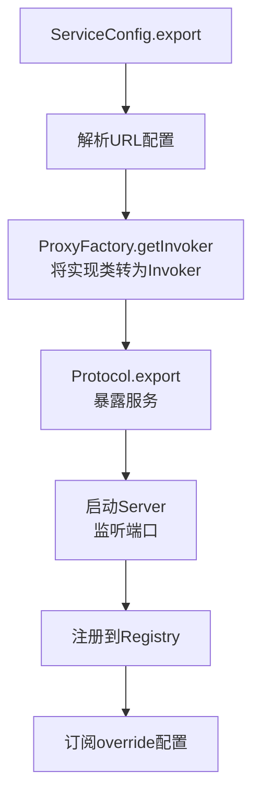
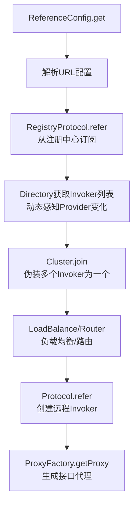
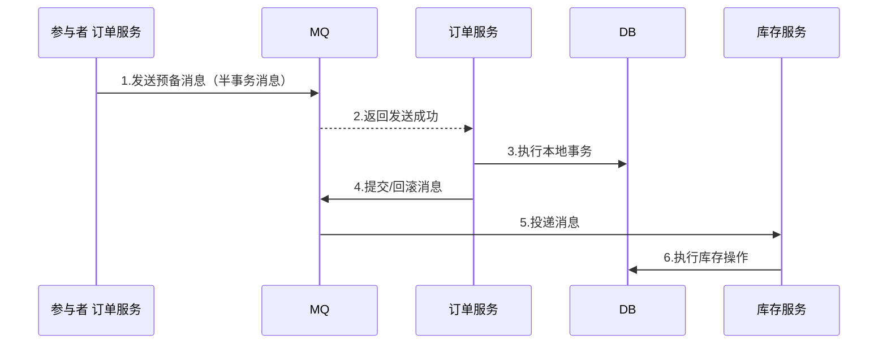
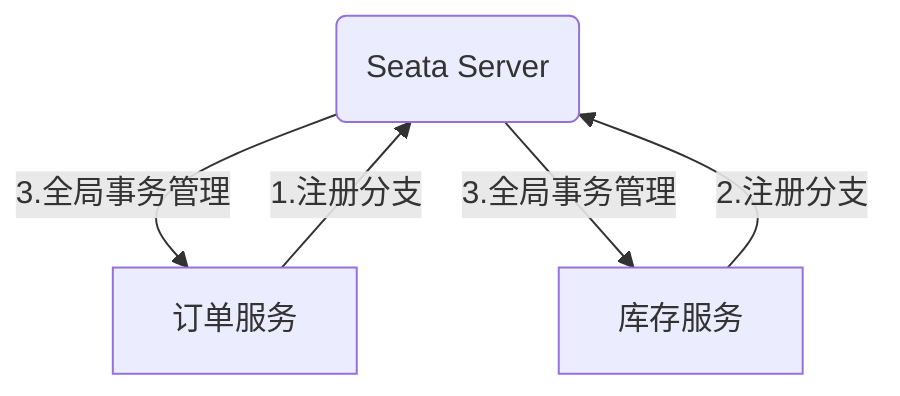

# Dubbo 面试之架构

## 协议与调用

### 【简单】Dubbo 支持哪些序列化方式？⭐⭐

> 🎯 目标等级：L3 ｜ ⏱ 建议用时：5 min ｜ 🏷 标签：Dubbo / 序列化

#### 💎 关键结论

Dubbo 默认用 Hessian2 序列化，跨语言场景选 Protobuf，纯 Java 追求极致性能选 Kryo/FST。因为序列化直接决定调用的性能与互通性，选型要看语言生态和性能诉求。

#### ⚡ 记忆卡片

- **口诀**：默认 Hessian，跨语言 Protobuf，极致性能选 Kryo
- **关键词**：Hessian2 ／ Protobuf ／ Kryo ／ FST ／ JSON ／ Java 原生
- **链路**：确定语言生态 → 选定序列化协议 → 配置 serialization 参数 → 发送端编码、接收端解码

#### 📖 核心知识

Dubbo 支持多种序列化协议，可通过协议上的 `serialization` 参数指定，常见选项如下：

- **Hessian（Hessian2，默认）**
  - **特点**：二进制格式，速度较快，体积较小
  - **适用场景**：通用 RPC 调用（Dubbo 默认方案）
  - **缺点**：对复杂对象支持有限
- **JSON**
  - **特点**：文本格式，可读性强，跨语言支持好
  - **适用场景**：前后端交互、多语言系统
  - **缺点**：性能较差，数据体积大
- **Java 原生序列化**
  - **特点**：JDK 内置，使用简单
  - **适用场景**：Java 单体应用调试
  - **缺点**：性能差，体积大，仅限 Java
- **Kryo**
  - **特点**：高性能二进制，速度极快，体积小
  - **适用场景**：高并发、低延迟场景
  - **缺点**：API 复杂，需注册类
- **Protobuf（推荐）**
  - **特点**：Google 出品，高效跨语言，可扩展
  - **适用场景**：微服务跨语言通信
  - **缺点**：需预定义 .proto 文件
- **FST**
  - **特点**：类似 Kryo，高性能二进制
  - **适用场景**：替代 Hessian 的高性能需求
  - **缺点**：兼容性较弱

::: details 序列化选型对比

**选型建议**

| 序列化方式   | 性能 | 体积 | 跨语言 | 易用性 | 适用场景              |
| ------------ | ---- | ---- | ------ | ------ | --------------------- |
| **Hessian**  | 中   | 小   | 部分   | 高     | 默认 RPC 调用         |
| **JSON**     | 低   | 大   | 是     | 高     | 前后端交互            |
| **Java**     | 低   | 大   | 否     | 高     | 调试/兼容旧系统       |
| **Kryo**     | 高   | 小   | 否     | 中     | 纯 Java 高性能场景    |
| **Protobuf** | 高   | 小   | 是     | 中     | 跨语言微服务（推荐）  |
| **FST**      | 高   | 小   | 否     | 中     | 替代 Hessian 优化性能 |

**推荐选择**

- **默认场景** → Hessian
- **跨语言微服务** → Protobuf
- **纯 Java 高性能** → Kryo/FST
- **调试/兼容** → Java 原生
- **前后端交互** → JSON

:::

#### 🔬 扩展知识

::: details

- 【L3】Hessian2 虽是 Dubbo2 默认，但短板明确：对 JDK 8 时间类型（`LocalDateTime`/`Instant`）需要额外适配、泛型擦除后集合元素类型易丢、
  枚举演进不友好（老版本消费端遇到新增枚举值会反序列化失败）。这也是 Dubbo 3 + Triple 更倾向 Protobuf 的原因之一。

- 【L3】Kryo / FST 是 Java 专用

  `Kryo` 实例**线程不安全**，必须用 `ThreadLocal` 持有或对象池复用，直接做成单例共享会在高并发下产生错乱的字节流；
  注册类（`register`）能明显减小体积并提速，但**两端的注册顺序必须完全一致**，否则按 ID 解出的类会错位。

- 【L4】Protobuf / Protostuff 的兼容性锚点是**字段编号**而非字段名

  删除字段必须用 `reserved` 保留编号，改字段类型等价于「删旧 + 加新」，否则跨版本混布时会静默解析出错误值——
  这类问题在灰度期最难定位。

- 【L4】JDK 原生序列化除性能差、体积大之外还有安全问题

  精心构造的 Gadget Chain 可在反序列化时触发任意代码执行（RCE）。JDK 9 起提供 JEP 290 反序列化过滤（`ObjectInputFilter`）；
  Dubbo 3.x 也在序列化层引入了类校验开关来缓解该风险。

> 序列化协议之间的横向深度对比（IDL 约束、兼容纪律、安全性）见《RPC 面试》『常见序列化协议的深度对比？』，本题只覆盖 Dubbo 侧的选型口径。

:::

#### ⚠️ 常见误区

::: details

- ❌ "协议头里带了序列化 ID，所以两端随便配" → 协议头 Flag 低 5 位确实逐包携带序列化 ID，解码端按 ID 查 `Serialization` SPI；但**前提是两端 classpath 上都加载了对应扩展**。灰度从 Hessian2 切 Kryo 时，若消费者先升级而提供者没有 Kryo 扩展，请求会直接解码失败。
- ❌ "Protobuf 一定优于 Hessian2" → Protobuf 需要 IDL 与字段编号纪律，存量 Java 接口改造成本高；Hessian2 免 IDL、对 Java 对象友好。选型看**跨语言诉求与接口演进纪律**，不看单一性能指标。
- ❌ "JSON 可读性好，内网 RPC 也可以用" → 文本编码的体积与 CPU 开销明显高于二进制，内网小报文高并发场景应优先 Hessian2 / Protobuf；JSON 更适合对外开放或前后端交互。

:::

#### 🔀 发散问题

**如何切换 Dubbo 的序列化协议？**
在协议配置上指定 `serialization` 参数，如 `<dubbo:protocol name="dubbo" serialization="kryo"/>`，提供者与消费者两端必须配置一致，否则反序列化失败。

**序列化与协议是什么关系？**
序列化只负责对象与字节流的转换，依附于通信协议存在；如 Dubbo2 协议默认基于 Hessian2 序列化，Triple 协议支持基于 Protocol Buffers 的数据传输。见本文档『Dubbo 支持哪些通信协议？』。

### 【简单】Dubbo 支持哪些通信协议？⭐⭐⭐

> 🎯 目标等级：L3 ｜ ⏱ 建议用时：5 min ｜ 🏷 标签：Dubbo / 通信协议

#### 💎 关键结论

Dubbo 不绑定任何通信协议：内置基于 HTTP/2 的 Triple 和基于 TCP 的 Dubbo2 两大协议，还能扩展 gRPC、REST 等第三方协议。因为微服务实践中多协议共存是常态，框架必须可插拔。

#### ⚡ 记忆卡片

- **口诀**：Triple 走 HTTP/2，Dubbo2 走 TCP，其余协议可插拔
- **关键词**：Triple ／ Dubbo2 ／ gRPC ／ REST ／ Hessian ／ Thrift
- **链路**：定义协议扩展点 → 应用内多协议共存 → 同一端口发布所有协议

#### 📖 核心知识

Dubbo 框架提供了自定义的高性能 RPC 通信协议：基于 HTTP/2 的 Triple 协议和基于 TCP 的 Dubbo2 协议。除此之外，Dubbo 框架支持任意第三方通信协议，如官方支持的 gRPC、Thrift、REST、JsonRPC、Hessian2 等，更多协议可以通过自定义扩展实现。这对于微服务实践中经常要处理的多协议通信场景非常有用。

**Dubbo 框架不绑定任何通信协议，在实现上 Dubbo 对多协议的支持也非常灵活，它可以让你在一个应用内发布多个使用不同协议的服务，并且支持用同一个 port 端口对外发布所有协议。**


Dubbo 官方支持的协议如下：

- **HTTP/2 (Triple)** - Dubbo3 新增，基于 HTTP/2 并且完全兼容 gRPC 协议，原生支持 Streaming 通信语义，Triple 可同时运行在 HTTP/1 和 HTTP/2 传输协议之上，让你可以直接使用 curl、浏览器访问后端 Dubbo 服务。自 Triple 协议开始，Dubbo 还支持基于 Protocol Buffers 的服务定义与数据传输，但 Triple 实现并不绑定 IDL。Triple 具备更好的网关、代理穿透性，因此非常适合于跨网关、代理通信的部署架构，如服务网格等。
- **Dubbo2** - Dubbo2 协议是基于 TCP 传输层协议之上构建的一套 RPC 通信协议，具有紧凑、灵活、高性能等特点。它是 Dubbo 的默认通信协议，采用单一长连接和 NIO 异步通信，基于 hessian 作为序列化协议。Dubbo2 协议适合于小数据量大并发的服务调用，以及服务消费者机器数远大于服务提供者机器数的情况。反之，Dubbo 缺省协议不适合传送大数据量的服务，比如传文件，传视频等，除非请求量很低。
- **gRPC** - gRPC 是谷歌开源的基于 HTTP/2 的通信协议。gRPC 的定位是通信协议与实现，是一款纯粹的 RPC 框架，而 Dubbo 定位是一款微服务框架，为微服务实践提供解决方案。在 Dubbo 体系下使用 gRPC 协议是一个非常高效和轻量的选择，它让你既能使用原生的 gRPC 协议通信，又避免了基于 gRPC 进行二次定制与开发的复杂度。
- **REST** - 微服务领域常用的一种通信模式是 HTTP + JSON，包括 Spring Cloud、Microprofile 等一些主流的微服务框架都默认使用的这种通信模式，Dubbo 同样提供了对基于 HTTP 的编程、通信模式的支持。
- **Hessian** - hessian 协议用于集成 Hessian 的服务，Hessian 底层采用 Http 通讯，采用 Servlet 暴露服务，Dubbo 缺省内嵌 Jetty 作为服务器实现。Dubbo 的 Hessian 协议可以和原生 Hessian 服务互操作，即：
  - 提供者用 Dubbo 的 Hessian 协议暴露服务，消费者直接用标准 Hessian 接口调用
  - 或者提供方用标准 Hessian 暴露服务，消费方用 Dubbo 的 Hessian 协议调用。
- **Thrift** - dubbo 支持的 thrift 协议是对 thrift 原生协议的扩展，在原生协议的基础上添加了一些额外的头信息，比如 service name，magic number 等。使用 dubbo thrift 协议同样需要使用 thrift 的 idl compiler 编译生成相应的 java 代码。

除上述协议外，Dubbo 还支持（部分为历史遗留，已不推荐）：

- **http / webservice** - 基于 HTTP 表单或 WebService（CXF）暴露服务，用于与遗留系统或非 Java 客户端互通，性能最低。
- **redis / memcached** - 把缓存集群当"协议"用：调用被翻译成对 Redis/Memcached 的读写，用于以缓存为数据源的高频读场景。**已属历史遗留方案，新架构不应选用**。
- **injvm** - 本地引用协议：同一 JVM 内的消费者直接调用提供者实现，**不走网络、不序列化**，是 Dubbo 3 对「同应用内自调用」的优化，也是单体拆分微服务过程中「先同进程、后跨进程」平滑迁移的基础。

#### 🔬 扩展知识

::: details

- 【L3】多协议发布时，Dubbo 通过 `Protocol` SPI 扩展点按 URL 的 protocol 参数分发到对应协议实现，一个 `ServiceConfig` 可遍历多个 `ProtocolConfig` 分别暴露。

- 【L3】**协议选型的三条判据**（P8 必答的决策部分，纯枚举不足以得分）：

- **内网 Java-to-Java、小报文、高并发** → `dubbo`（Dubbo2 协议）：紧凑二进制 + 单一长连接 + NIO 异步，头部仅 16 字节，是这一场景的最优解。

- **需要跨语言 / 流式（一元、客户端流、服务端流、双向流）/ 网关穿透 / Service Mesh 接入** → `tri`（Triple）：基于 HTTP/2 且兼容 gRPC，能被通用 HTTP 网关与 Mesh 边车识别。

- **对外开放接口、便于 curl/浏览器调试** → `rest`（HTTP + JSON，基于 JAX-RS）：可观测性与联调成本最低，但性能最差，不适合内部主链路。

- 【L4】**为什么 Dubbo2 协议穿不过网关**：

  它是私有二进制协议，靠魔数 `0xdabb` 定界、靠协议头里的序列化 ID 解码，HTTP 网关与 Mesh 边车无法解析其报文，也就无法做路由、鉴权、限流与协议转换。

  这不是"性能不够"的问题，而是**协议不在网关的语义空间内**——这正是 Dubbo3 推 Triple 的根本动因。

- 【L4】Dubbo3 起协议选择向 Triple 收敛：

  Triple 兼容 gRPC、支持 Streaming，且能穿透网关与 Mesh 边车，是从 Dubbo2 协议迁移的主要方向。

  但**收敛不等于默认**——Dubbo 3.x 的默认协议仍是 `dubbo`，启用 Triple 需显式配置 `dubbo.protocol.name=tri`；两者也可在同一应用内并行暴露以支撑渐进迁移。

> 📚 延伸阅读：

>
> - [Dubbo 官方文档之通信协议](https://cn.dubbo.apache.org/zh-cn/overview/what/core-features/protocols/)
> - [Triple 协议开发任务](https://cn.dubbo.apache.org/zh-cn/overview/what/tasks/protocols/triple/)
> - [Triple 设计思路与协议规范](https://cn.dubbo.apache.org/zh-cn/overview/reference/protocols/triple/)
> - [Dubbo2 协议开发任务](https://cn.dubbo.apache.org/zh-cn/overview/what/tasks/protocols/dubbo/)
> - [Dubbo2 设计思路与协议规范](https://cn.dubbo.apache.org/zh-cn/overview/reference/protocols/tcp/)
> - [gRPC over Dubbo 示例](https://cn.dubbo.apache.org/zh-cn/overview/what/tasks/protocols/grpc/)
> - [HTTP over Dubbo 示例](https://cn.dubbo.apache.org/zh-cn/overview/what/tasks/protocols/web/)
> - [Dubbo 与 Spring Cloud 体系互通](https://cn.dubbo.apache.org/zh-cn/overview/what/tasks/protocols/springcloud/)
> - [hessian 协议](http://dubbo.apache.org/zh-cn/docs/user/references/protocol/hessian.html)
> - [thrift 协议](http://dubbo.apache.org/zh-cn/docs/user/references/protocol/thrift.html)

:::

#### ⚠️ 常见误区

::: details

- ❌ "Triple 是 Dubbo3 的默认协议" → Triple 是 Dubbo3 **主推**的下一代协议，**默认协议仍是 `dubbo`（Dubbo2 协议）**，需要显式配置 `dubbo.protocol.name=tri` 才启用。混淆"主推"与"默认"会导致误判升级成本与回滚方案。
- ❌ "Dubbo2 协议也能挂在 HTTP 网关后面" → 私有二进制协议网关无法解析，必须改用 Triple 或在网关侧做协议转换（如网关以 Triple/REST 接入、再以 Dubbo2 协议回源）。
- ❌ "同进程内调用也要走网络协议" → 默认会优先命中 `injvm` 本地引用，不序列化不走网络；把它关掉（`scope=remote`）反而白白增加一跳。
- ❌ "多协议共存就是多开几个端口" → Dubbo3 支持同端口按报文特征识别协议归属，但生产中更常见的是**按协议分端口**，便于网关策略、防火墙与安全组按端口区分内外部流量。

:::

#### 🔀 发散问题

**Dubbo2 协议与 Triple 协议怎么选？**
存量 Dubbo2 体系、纯内网小数据量调用可继续用 Dubbo2；需要跨语言、Streaming、网关/Mesh 穿透或面向 HTTP 生态时用 Triple。

**同一个端口如何发布多个协议？**
Dubbo 支持用同一个 port 对外发布所有协议，由协议层按报文特征（如魔数、HTTP 语义）区分请求归属，避免多端口运维成本。

### 【困难】Dubbo2 协议的报文结构与连接策略是如何设计的？⭐⭐⭐⭐

> 🎯 目标等级：L4 ｜ ⏱ 建议用时：15 min ｜ 🏷 标签：Dubbo / 协议设计

#### 💎 关键结论

Dubbo2 协议 = 定长 16 字节协议头 + 不定长消息体，靠魔数 `0xdabb` 识别协议；连接策略采用单一长连接 + NIO 多路复用，是为"消费者远多于提供者、小数据量高并发"的典型微服务场景量身定做的。因为定长头能快速解析出请求 ID 与体长，天然支撑单连接多路复用与粘包处理；而连接数与提供者承受的压力成正比，少连接就是保护提供者。

#### ⚡ 记忆卡片

- **口诀**：魔数开头十六字节头，Request ID 关联请求响应，一条连接跑到底，NIO 复用撑并发
- **关键词**：0xdabb ／ Flag ／ Request ID ／ Data Length ／ 单一长连接 ／ NIO 多路复用
- **链路**：读魔数识别协议 → 读定长头取体长 → 读满消息体 → 按 Request ID 匹配响应 → 单连接异步收发

#### 📖 核心知识

**报文结构**

```
0     1     2     3     4     5     6     7     8     9     10    11    12    13    14    15    16
+-----+-----+-----+-----+-----+-----+-----+-----+-----+-----+-----+-----+-----+-----+-----+-----+
| Magic Number (0xdabb)  | Flag | Status |           Request ID                                |
+-----+-----+-----+-----+-----+-----+-----+-----+-----+-----+-----+-----+-----+-----+-----+-----+
|                      Data Length                       |             Body (变长)                |
+-----+-----+-----+-----+-----+-----+-----+-----+-----+-----+-----+-----+-----+-----+-----+-----+
```

**协议头各字段说明**

| 偏移量 | 长度   | 字段         | 说明                                                                                                                                                                                                                      |
| ------ | ------ | ------------ | ------------------------------------------------------------------------------------------------------------------------------------------------------------------------------------------------------------------------- |
| 0-1    | 2 字节 | Magic Number | 魔数 `0xdabb`，用于识别 Dubbo 协议                                                                                                                                                                                        |
| 2      | 1 字节 | Flag         | 标识位：最高位（0x80）标识请求/响应、0x40 标识是否双向调用、0x20 标识事件（心跳）、低 5 位为序列化 ID                                                                                                                     |
| 3      | 1 字节 | Status       | 响应状态码，**仅响应有效**：20=OK、30=CLIENT_TIMEOUT、31=SERVER_TIMEOUT、40=BAD_REQUEST、50=BAD_RESPONSE、60=SERVICE_NOT_FOUND、70=SERVICE_ERROR、80=SERVER_ERROR、90=CLIENT_ERROR、100=SERVER_THREADPOOL_EXHAUSTED_ERROR |
| 4-11   | 8 字节 | Request ID   | 请求 ID，用于关联请求与响应                                                                                                                                                                                               |
| 12-15  | 4 字节 | Data Length  | 消息体长度                                                                                                                                                                                                                |

**消息体（Body）**

- **请求消息体**：Dubbo 版本、接口名、版本号、方法名、参数类型列表、参数值列表、attachments 附加参数。
- **响应消息体**：结果类型（空/值/异常）、返回值或异常信息。

**设计要点**

- **Magic Number**：用于 TCP 流中识别协议起始位置，解决粘包问题。`0xdabb` 谐音 "Dubbo"。
- **定长协议头**：便于快速解析和路由，无需反序列化整个消息。
- **Request ID**：支持单连接上的多路复用，请求和响应通过 ID 关联。
- **序列化 ID**：协议头中携带序列化方式（Flag 低 5 位），支持逐包协商切换。

**单一长连接设计**

| 维度     | 单一长连接                           | 多连接                         |
| -------- | ------------------------------------ | ------------------------------ |
| 连接建立 | 一次建立，持续复用                   | 多次建立，开销大               |
| 资源占用 | 少（一个连接）                       | 多（N 个连接）                 |
| 并发能力 | 高（基于 NIO 多路复用）              | 更高（多连接并行）             |
| 适用场景 | 小数据量、高并发、消费者远多于提供者 | 大数据量、提供者消费者数量相当 |

**为什么适合 Dubbo 场景**

- **典型场景**：微服务架构中，消费者数量远大于提供者（如 100 个消费者调用 5 个提供者），单一长连接减少提供者连接压力。
- **NIO 多路复用**：基于 Netty 的 NIO，单连接可处理大量并发请求，通过 Request ID 区分不同请求。
- **不适合的场景**：传输大文件、视频等大数据量，建议使用多连接或换用其他协议。

#### 🔬 扩展知识

::: details

- 【L3】心跳在 Dubbo 协议中是一种特殊的 event 请求（Flag 置 0x20），共用同一报文结构，消费者/提供者按 `heartbeat` 参数周期互发，超过 `heartbeat.timeout` 未收到则触发重连或断开。

- 【L3】消费者到每个提供者地址默认建立 1 条连接，可用 `connections` 参数显式增加对单个提供者的连接数，适合大报文或需要更高吞吐的调用。

- 【L3】消息体有默认大小上限：

  `payload` 默认 8MB，编解码时校验，超限直接抛 `ExceededPayloadLimitException`。

  批量查询接口返回超大集合是常见触发场景——正确做法是分页或裁剪字段，而不是盲目调大 `payload`：大报文会长时间占用单一长连接的带宽，放大下面这条队头拥塞问题。

- 【L4】解码器依赖 Data Length 做完整性判断：

  先读满 16 字节头，再按体长读满 Body，未读满则等待后续字节，这是 TCP 粘包/拆包处理的标准做法。

- 【L4】单一长连接的代价是队头拥塞：

  单连接上的大响应会占用带宽，影响同连接其它请求的时延，这也是 Dubbo3 转向基于 HTTP/2 多路复用的 Triple 协议的动因之一。

:::

#### ⚠️ 常见误区

::: details

- ❌ "一条连接只能同时处理一个请求" → Dubbo 通过 Request ID 实现单连接多路复用，请求异步发出、响应按 ID 归位，并发度不受连接数限制。
- ❌ "协议头里的序列化方式是固定死的" → 序列化 ID 每包携带在 Flag 低 5 位中，理论上支持逐包协商，两端能力允许时可切换序列化协议。
- ❌ "Status 字段请求和响应都有意义" → Status 只在响应中有意义（如 20=OK、30=CLIENT_TIMEOUT、40=BAD_REQUEST、50=BAD_RESPONSE），请求包中该字节无业务含义。
- ❌ "长连接不需要心跳" → 长连接需靠心跳保活并检测半开连接，Dubbo 默认周期性发送心跳包。

:::

#### 🔀 发散问题

**连接断开后会发生什么？**
消费者检测到连接断开后会按重连策略周期性重连；期间该提供者地址上的调用会失败或由集群容错切换到其它节点。

**Dubbo2 协议与 Triple 协议怎么选？**
存量 Dubbo2 体系、纯内网小数据量调用可继续用 Dubbo2；需要跨语言、Streaming、网关/Mesh 穿透或面向 HTTP 生态时用 Triple。

### 【困难】Dubbo 的服务暴露（Export）与引用（Refer）流程是怎样的？⭐⭐⭐⭐

> 🎯 目标等级：L3 ｜ ⏱ 建议用时：15 min ｜ 🏷 标签：Dubbo / 服务暴露 / 服务引用

#### 💎 关键结论

服务暴露的本质是：把 `ServiceConfig` 转成可被远程调用的 `Invoker`，启动 Server 监听端口，再把服务 URL 注册到注册中心。服务引用的本质是：消费者从注册中心订阅地址列表，把多个远程 `Invoker` 经路由、集群容错伪装成一个 `Invoker`，再生成接口代理注入业务代码。因为暴露是 Provider 侧"生产 Invoker 并注册"，引用是 Consumer 侧"订阅并消费 Invoker 生成代理"，两者以注册中心为桥梁对称存在。

#### ⚡ 记忆卡片

- **口诀**：暴露——配置转 URL，实现转 Invoker，协议起端口，注册进中心；引用——订阅地址、路由过滤、集群伪装、代理注入
- **关键词**：ServiceConfig ／ ReferenceConfig ／ Invoker ／ RegistryProtocol ／ Directory ／ Cluster ／ ProxyFactory
- **链路**：暴露：解析配置 → ProxyFactory 包装 → Protocol.export → 注册 → 订阅 configurators；引用：解析配置 → 订阅注册中心 → Directory 维护列表 → Router 过滤 → Cluster.join → getProxy

#### 📖 核心知识

**Export 整体流程**



**Export 详细步骤**

1. **配置解析**：`ServiceConfig` 解析 `@DubboService` 或 XML 配置，生成服务的 URL（包含接口名、版本、分组、协议、端口等）。
2. **生成 Invoker**：通过 `ProxyFactory`（默认 JavassistProxyFactory）将服务实现类包装成 `Invoker` 对象。
3. **协议暴露**：`Protocol.export(Invoker)` 将 `Invoker` 导出为 `Exporter`：
   - **本地暴露**：如果消费者和提供者在同一 JVM，走 `injvm` 协议，避免网络开销。
   - **远程暴露**：通过 `DubboProtocol` 启动 Netty Server 监听端口，注册 `Exporter` 到 `Map<String, Exporter<?>>`。
4. **Filter 链组装**：`ProtocolFilterWrapper` 在 `Invoker` 外层包装一系列 Filter（如监控、日志、限流），形成责任链。
5. **注册中心注册**：`RegistryProtocol` 将服务 URL 注册到注册中心（如 ZooKeeper 的 `/dubbo/{interface}/providers` 节点）。
6. **订阅配置**：订阅注册中心的 `configurators` 节点，支持动态配置覆盖。

::: details Export 关键源码入口

```java
// ServiceConfig.java
public synchronized void export() {
    // ... 配置检查
    doExport();
}

private void doExport() {
    // ... 解析配置
    doExportUrls();
}

private void doExportUrls() {
    // 遍历所有注册中心和协议
    for (ProtocolConfig protocolConfig : protocols) {
        doExportUrlsFor1Protocol(protocolConfig, registryURL);
    }
}
```

:::

**Refer 整体流程**



**Refer 详细步骤**

1. **配置解析**：`ReferenceConfig` 解析 `@DubboReference` 或 XML 配置，生成引用 URL。
2. **注册中心订阅**：`RegistryProtocol.refer()` 从注册中心订阅提供者地址列表，`RegistryDirectory` 维护动态的 `List<Invoker>`。
3. **路由过滤**：`RouterChain` 根据路由规则（条件路由、标签路由）对 `Invoker` 列表进行过滤，生成地址子集。
4. **集群包装**：`Cluster.join()` 将多个 `Invoker` 伪装成一个容错 `Invoker`，内置 `FailoverCluster`、`FailfastCluster` 等策略。
5. **Filter 链组装**：`ProtocolFilterWrapper` 在 `Invoker` 外层包装 Filter 链。
6. **生成代理**：`ProxyFactory.getProxy(invoker)` 生成接口的动态代理对象（JDK 代理或 Javassist 代理），注入到消费者。

**Refer 关键特性**

- **延迟加载**：`ReferenceConfig` 支持 `lazy=true`，首次调用时才真正创建连接。
- **本地缓存**：消费者本地缓存提供者地址列表，注册中心宕机不影响已建立的调用。
- **check 机制**：`check=true`（默认）时，启动时检查提供者是否可用，不可用则抛异常阻止启动。

#### 🔬 扩展知识

::: details

- 【L3】暴露流程支持延迟暴露（`delay` 参数）与多注册中心、多协议遍历发布：

  `doExportUrls` 会对每个注册中心 × 每个协议组合各执行一次 `doExportUrlsFor1Protocol`。

- 【L3】`RegistryDirectory` 收到注册中心推送的地址变更通知后，会增量重建 `Invoker` 列表：新增地址创建新 Invoker，下线地址销毁对应 Invoker，实现无需重启的动态感知。

- 【L3】注册时机是无损发布的关键：

  Dubbo 在 Spring 容器 refresh 完成后（`ContextRefreshedEvent` 触发 `DubboBootstrap.start()`）才把服务 URL 注册到注册中心。

  若在容器就绪前注册，会出现"地址已可被感知但 Bean 依赖未装配完"的窗口，发布初期部分调用报 NPE 或找不到服务；暴露侧完整的预热与放量机制见《RPC 面试》『如何实现 RPC 优雅启动？』。

- 【L4】`ServiceConfig` 拿到的 `Protocol` 实际是一条 Wrapper 装饰链

  真正的 `DubboProtocol` 被 `ProtocolFilterWrapper`（组装 Filter 链）、
  `ProtocolListenerWrapper`（export/refer 回调）等包装类层层包裹，再由 `RegistryProtocol` 完成注册与 configurators 订阅后委托内层协议暴露。

  装饰链的包裹顺序决定了横切逻辑的执行顺序，其识别与包装机制见本文档『Dubbo 的 SPI 扩展机制是如何设计的？』。

- 【L4】`injvm` 本地暴露与远程暴露可同时存在：

  同一 JVM 内的消费者默认优先走本地 `InjvmInvoker`，避免不必要的网络开销。

- 【L4】直连模式（`url` 参数或 `-D` 参数指定地址）会跳过 Registry 层直接 `Protocol.refer`，常用于本地联调与测试环境。

:::

#### ⚠️ 常见误区

::: details

- ❌ "服务暴露就是启动一个端口" → 启动 Server 只是其中一步，完整流程还包括配置解析、Invoker 生成、Filter 链组装、注册中心注册与配置订阅。
- ❌ "注册中心挂了消费者就无法调用了" → 引用完成后地址列表已缓存在消费者本地，注册中心宕机不影响存量调用，只是无法感知新的地址变化。
- ❌ "每次调用都重新创建 Invoker" → Invoker 由 Directory 缓存并随推送增量更新，每次调用只是在现有列表中做路由与负载均衡选址。

:::

#### 🔀 发散问题

**`check=false` 有什么作用？**
关闭启动时可用性检查，提供者未就绪时消费者也能正常启动，首次真正调用时再失败或等待地址推送，适合发布顺序不可控的场景。

**路由过滤发生在负载均衡之前还是之后？**
之前：RouterChain 先按规则把全量地址裁剪成子集，再由 LoadBalance 在子集中选一台实例。见本文档『Dubbo 的 SPI 扩展机制是如何设计的？』。

**Filter 链在暴露/引用流程的哪一步组装？**
在 `Protocol.export` / `Protocol.refer` 阶段由 `ProtocolFilterWrapper` 装饰器完成，把激活的 Filter 包装在 Invoker 外层。见本文档『Dubbo 的 SPI 扩展机制是如何设计的？』。

## 架构设计

### 【困难】Dubbo 的整体架构与工作原理是怎样的？⭐⭐⭐⭐

> 🎯 目标等级：L3 ｜ ⏱ 建议用时：15 min ｜ 🏷 标签：Dubbo / 架构设计

#### 💎 关键结论

Dubbo 采用 Microkernel + Plugin 模式：内核只负责组装插件，所有功能都是扩展点，都能被用户替换；并用 URL 作为统一的配置载体。框架靠"注册中心解耦 + 动态代理透明化调用 + 集群容错保可用性"三招实现 RPC。因为服务发现、调用透明、故障兜底恰好是分布式调用的三大核心问题，而微内核让每个环节都可被替换。

#### ⚡ 记忆卡片

- **口诀**：微内核装插件，URL 传配置，十层单向依赖；注册解耦、代理透明、容错兜底
- **关键词**：Microkernel ／ Plugin ／ URL ／ SPI ／ 十层架构 ／ Invoker ／ Provider ／ Consumer ／ Registry
- **链路**：Provider 注册 → Registry 维护映射 → Consumer 订阅 → 代理发起调用 → 负载均衡选址 → 网络传输 → 结果返回

#### 📖 核心知识

**核心组件**


Dubbo 有**三个核心组件**和两个扩展组件：

- **Provider**：服务提供者。启动时向注册中心注册服务，接收 Consumer 的远程调用请求并返回结果。
- **Consumer**：服务消费者。启动时向注册中心订阅服务，获取 Provider 地址列表，通过负载均衡选择 Provider 发起远程调用。
- **Registry**：注册中心。负责服务的注册与发现（如 Zookeeper/Nacos），动态维护 Provider 和 Consumer 的映射关系。
- **Monitor**（扩展）：监控中心。统计服务调用次数、耗时、成功率等指标。
- **Container**（扩展）：服务容器。管理服务生命周期（如 Spring 容器）。

::: details 核心组件重要知识点

- 注册中心负责服务地址的注册与查找，服务提供者和消费者只在启动时与注册中心交互，注册中心不转发请求，压力较小。
- 注册中心、服务提供者、服务消费者之间均为长连接，监控中心除外。
- 注册中心通过长连接感知服务提供者的存在，服务提供者宕机，注册中心将立即推送事件通知消费者。
- 注册中心和监控中心全部宕机，不影响已运行的提供者和消费者，消费者在本地缓存了提供者列表。
- 服务提供者无状态，任意一台宕掉后不影响使用；全部宕掉后消费者将无法使用并无限次重连。

:::

**调用流程**

1. **服务注册**：Provider 启动 → 注册服务到 Registry
2. **服务发现**：Consumer 启动 → 从 Registry 订阅 Provider 列表
3. **远程调用**：Consumer 通过**动态代理**发起调用 → 经负载均衡选择 Provider → 网络传输（Netty/HTTP）
4. **结果返回**：Provider 处理请求 → 返回结果给 Consumer

**关键机制**

- **动态代理**：生成接口代理类，屏蔽远程调用细节
- **负载均衡**：内置随机/轮询/最少活跃调用等算法
- **集群容错**：Failover（失败自动切换）/ Failfast（快速失败）等策略
- **异步通信**：基于 Netty 的 NIO 长连接，支持异步调用
- **SPI 机制**：可插拔式扩展（如替换注册中心/协议）
- **Filter 链**：支持 AOP 式拦截（日志/限流/鉴权）

**整体框架设计**


Dubbo 的整体设计原则：

- 采用 Microkernel + Plugin 模式，Dubbo 自身的功能也是通过扩展点实现的，所有功能点都可被用户自定义扩展所替换。
- 采用 URL 作为配置信息的统一格式，所有扩展点都通过传递 URL 携带配置信息。

**分层架构**（从上至下，各层单向依赖）

- **service 接口层**：真实业务接口层（如 `XxxService`），是对外暴露的 Facade，没有扩展点
- **config 配置层**：对外配置接口，以 `ServiceConfig`、`ReferenceConfig` 为中心
- **proxy 服务代理层**：服务接口透明代理，扩展接口为 `ProxyFactory`
- **registry 注册中心层**：封装服务地址的注册与发现，扩展接口为 `RegistryFactory`
- **cluster 路由层**：封装多个提供者的路由及负载均衡，扩展接口为 `Cluster`、`Directory`、`Router`、`LoadBalance`
- **monitor 监控层**：RPC 调用次数和调用时间监控
- **protocol 远程调用层**：封装 RPC 调用，扩展接口为 `Protocol`、`Invoker`、`Exporter`
- **exchange 信息交换层**：封装请求响应模式，同步转异步
- **transport 网络传输层**：抽象 mina 和 netty 为统一接口
- **serialize 数据序列化层**：序列化工具

::: details 组件间的关系

- **`Protocol` 是核心层**：只要有 `Protocol` + `Invoker` + `Exporter` 就可以完成非透明的 RPC 调用，然后在 `Invoker` 的主过程上设置拦截点（Filter）。
- **Cluster 的目的是将多个 Invoker 伪装成一个 Invoker**，加上或去掉 Cluster 对其它层都不会造成影响。
- **Proxy 层封装了所有接口的透明化代理**。在其它层都以 `Invoker` 为中心，只有到了暴露给用户使用时，才用 `Proxy` 将 `Invoker` 转成接口。
- Remoting 实现是 Dubbo 协议的实现，内部再划为 Transport 传输层和 Exchange 信息交换层，**Transport 层只负责单向消息传输**，**Exchange 层在传输层之上封装了 Request-Response 语义**。

:::

**调用链路**


**核心组件交互**


**设计模式应用**

Dubbo 是设计模式的教科书，核心模式贯穿全框架：

| 模式         | 应用点                                                                |
| ------------ | --------------------------------------------------------------------- |
| **单例**     | `ExtensionLoader` 使用单例确保全局唯一                                |
| **责任链**   | Filter 调用链，`ProtocolFilterWrapper` 将所有 Filter 串联             |
| **装饰器**   | Wrapper 机制，如 `ProtocolFilterWrapper` 修饰 `Protocol`              |
| **策略**     | `LoadBalance` 接口多种实现（Random/RoundRobin/LeastActive 等）        |
| **抽象工厂** | `ProxyFactory` 按配置生产不同实现（Javassist/JDK）的 Invoker 与 Proxy |
| **代理**     | `ProxyFactory` 为服务创建代理对象，隐藏远程调用细节                   |
| **适配器**   | `RegistryProtocol` 将不同注册中心协议适配到统一接口                   |

::: details 设计模式代码示例

**单例模式**——`ExtensionLoader`：

```java
public class ExtensionLoader<T> {
    private static final ConcurrentMap<Class<?>, ExtensionLoader<?>> EXTENSION_LOADERS = new ConcurrentHashMap<>();

    public static <T> ExtensionLoader<T> getExtensionLoader(Class<T> type) {
        ExtensionLoader<T> loader = (ExtensionLoader<T>) EXTENSION_LOADERS.get(type);
        if (loader == null) {
            EXTENSION_LOADERS.putIfAbsent(type, new ExtensionLoader<T>(type));
        }
        return (ExtensionLoader<T>) EXTENSION_LOADERS.get(type);
    }
}
```

**策略模式**——`LoadBalance`：

```java
public interface LoadBalance {
    <T> Invoker<T> select(List<Invoker<T>> invokers, URL url, Invocation invocation) throws RpcException;
}
```

:::

#### 🔬 扩展知识

::: details

- 【L3】Monitor 是可选组件：

  统计先在内存汇总，再周期性上报，与调用链路解耦，不影响主流程可用性。

- 【L3】"每一层都可以剥离上层被复用"是 Dubbo 分层的关键收益：

  最小 RPC 只需 Protocol + Invoker + Exporter。

- 【L4】Dubbo3 引入了应用级服务发现：

  注册粒度从"接口级 URL"变为"应用 + 元数据"，大幅降低注册中心存储与推送压力。

- 【L4】Service 和 Config 层是 API，其余各层均为 SPI，这一区分决定了用户可见的编程界面与可替换的内部实现的边界。

- 【L4】一次远程调用自上而下穿越的完整层次是：

  Proxy（接口代理）→ Cluster（Router 裁剪地址 → LoadBalance 选址 → 容错包装）→ Filter 链 → Protocol → Exchange（封装 Request/Response、
  同步转异步）→ Transport → Serialize，响应沿原路对称返回，逐层解包后 complete 调用方 Future。

  能按这条路径逐层说出"每层职责 + 每层可替换的扩展点"，是「背过架构图」与「理解架构」的分水岭。

> 📚 延伸阅读：[Dubbo 框架设计](https://cn.dubbo.apache.org/zh-cn/docsv2.7/dev/design/)

:::

#### ⚠️ 常见误区

::: details

- ❌ "Dubbo 有十层，每层都必须用上" → 各层单向依赖且可剥离复用，Cluster、Proxy 都是可选的透明化/集群能力。
- ❌ "Registry 和 Monitor 是架构分层" → 二者是独立的部署拓扑节点，只是为了全局概览才用层的方式画在一起。

:::

#### 🔀 发散问题

**为什么说 URL 是 Dubbo 的"配置总线"？**
所有扩展点的创建与调用都以 URL 携带参数，微内核根据 URL 参数选择插件实现，用户改配置即改行为。

**注册中心宕机后调用还能继续吗？**
能。消费者本地缓存了提供者列表，注册中心宕机只影响地址变更的感知，存量调用不受影响。

**十层架构与 SPI 机制是什么关系？**
除 Service/Config 层外各层均为 SPI，分层定义了扩展边界，SPI 提供加载与组装能力。见本文档『Dubbo 的 SPI 扩展机制是如何设计的？』。

## 可用性设计

### 【困难】Dubbo 如何保证服务的高可用性？⭐⭐⭐

> 🎯 目标等级：L3 ｜ ⏱ 建议用时：15 min ｜ 🏷 标签：Dubbo / 高可用

#### 💎 关键结论

Dubbo 高可用是多级容错的叠加：注册中心容错保发现、集群容错保调用、通信容错保连接、限流降级保全局。因为单点手段都有盲区，只有层层冗余才能覆盖不同故障面。

#### ⚡ 记忆卡片

- **口诀**：冗余、检测、容错、限流、隔离
- **关键词**：多注册中心 ／ 心跳检测 ／ 本地缓存 ／ 集群容错 ／ 熔断降级
- **链路**：多节点冗余 → 心跳检测故障 → 集群容错切换 → 限流降级自保

#### 📖 核心知识

Dubbo 高可用设计核心思想：

- **冗余**：多注册中心、多服务节点
- **故障检测**：心跳检测 + 主动剔除
- **容错处理**：超时 + 重试 + 容错处理策略
- **流量控制**：限流 + 熔断 + 降级
- **隔离**：线程/协议/分组隔离避免连锁故障

实际生产中需结合 **压测** 和 **监控** 持续调优参数（如超时时间、重试次数）。

Dubbo 通过 **多级容错设计** 确保服务高可用，主要依赖以下机制：

**注册中心容错**

| **机制**       | **说明**                                                       | **配置示例**                                                         |
| -------------- | -------------------------------------------------------------- | -------------------------------------------------------------------- |
| **多注册中心** | 同时接入多个注册中心（如 Zookeeper + Nacos），避免单点故障。   | `<dubbo:registry address="zookeeper://ip1:2181,nacos://ip2:8848" />` |
| **心跳检测**   | 注册中心定时检测服务存活状态，自动剔除失效节点（默认 30 秒）。 | `<dubbo:provider heartbeat="60000" />`                               |
| **本地缓存**   | 消费者缓存服务列表，即使注册中心宕机仍能调用服务。             | 默认启用，无需配置                                                   |

**服务调用容错**

| **策略**             | **说明**                                                                                       | **适用场景**                                         |
| -------------------- | ---------------------------------------------------------------------------------------------- | ---------------------------------------------------- |
| **集群容错**         | - `failover`（默认）：失败自动切换其他节点<br>- `failfast`：快速失败<br>- `failsafe`：忽略异常 | `<dubbo:reference cluster="failover" retries="2" />` |
| **负载均衡**         | - `random`（默认随机）<br>- `roundrobin`（轮询）<br>- `leastactive`（最少活跃调用）            | `<dubbo:reference loadbalance="leastactive" />`      |
| **限流、熔断、降级** | 集成 Sentinel/Hystrix，在服务异常时触发熔断或返回降级结果。                                    | 需额外引入依赖并配置规则                             |

**通信容错**

| **机制**        | **说明**                                                                  |
| --------------- | ------------------------------------------------------------------------- |
| **长连接复用**  | 默认复用 TCP 长连接，减少握手开销，通过心跳保活（`heartbeat` 参数控制）。 |
| **多协议支持**  | 支持 Dubbo/HTTP/gRPC 等协议，根据网络环境选择最优协议。                   |
| **IO 线程隔离** | 业务逻辑与网络 IO 线程分离，避免阻塞导致雪崩。                            |

**运维级保障**

| **措施**     | **说明**                                                 |
| ------------ | -------------------------------------------------------- |
| **灰度发布** | 通过路由规则（如 `tag`）逐步切流，避免全量发布风险。     |
| **压力测试** | 使用 JMeter 模拟高并发，提前暴露性能瓶颈。               |
| **日志监控** | 对接 Prometheus + Grafana 监控 QPS/RT/错误率，实时告警。 |

::: details 典型配置示例

服务提供者（超时与重试）：

```xml
<dubbo:service interface="com.example.UserService"
               timeout="3000"
               retries="2"
               cluster="failover" />
```

服务消费者（熔断降级）：

```java
@Reference(version = "1.0.0",
           timeout = 2000,
           cluster = "failfast",
           mock = "com.example.UserServiceMock") // 降级实现类
private UserService userService;
```

:::

#### 🔬 扩展知识

::: details

- 【L3】除 failover/failfast/failsafe 外，Dubbo 还提供 failback（失败自动恢复重试）、forking（并行调用多个提供者）、broadcast（广播调用）等集群容错策略，
  可按接口读写特性分别配置。

- 【L4】Mock 降级（`mock` 参数）与 Cluster 容错是两层防线：

  容错决定"失败后怎么重试/切换"，Mock 决定"彻底失败后返回什么兜底结果"。

- 【L4】注册中心容错的最后一环是本地快照：

  Dubbo 会把订阅到的地址列表写入消费者本地缓存文件，进程重启时即使注册中心不可用，也能用快照启动并继续调用；极端场景还可用 `dubbo-resolve.properties` 指定直连地址。

  所以"注册中心全挂"不等于"调用不可用"，真正受损的是地址变更感知与新实例上线传播——这也是「注册中心选型应 AP 优先」的根本依据，详见《RPC 面试》『如何实现一个注册中心？』。

- 【L4】本题与服务治理侧的分工：

  本题给出架构级容错地图（冗余/检测/容错/限流/隔离五层）；限流、熔断、降级的规则体系与故障检测、集群容错的参数化落地，见《Dubbo 面试之服务治理》对应专题。

:::

#### ⚠️ 常见误区

::: details

- ❌ "重试次数设得越大越可靠" → 重试会放大下游压力且非幂等接口重试会产生脏数据，需结合接口幂等性和超时预算设置 retries。
- ❌ "注册中心高可用就够了" → 注册中心只解决服务发现，调用链路上的节点故障、网络抖动仍需集群容错与限流降级覆盖。

:::

#### 🔀 发散问题

**failover 和 failfast 怎么选？**
幂等的读请求适合 failover（失败切换重试）；非幂等写请求或敏感操作适合 failfast，快速失败避免重复执行。

**降级兜底结果怎么实现？**
通过 `mock` 参数指定降级实现类，异常时由本地 Mock 返回兜底数据，具体用法见《Dubbo 面试之服务治理》文档中的 Mock 相关题目。

## 性能优化设计

### 【困难】Dubbo 有哪些性能优化设计？⭐⭐⭐

> 🎯 目标等级：L3 ｜ ⏱ 建议用时：15 min ｜ 🏷 标签：Dubbo / 性能优化

#### 💎 关键结论

Dubbo 的性能设计集中在三处：Netty NIO 长连接把通信开销压到最低、IO 与业务线程分离把吞吐撑上去、序列化与代理优化把 CPU 省下来。因为 RPC 的性能瓶颈无非网络、线程、CPU 三者。

#### ⚡ 记忆卡片

- **口诀**：Netty 长连接、线程分离、序列化提速
- **关键词**：Netty NIO ／ 长连接 ／ Dispatcher ／ 线程池 ／ 负载均衡 ／ 服务预热
- **链路**：NIO 异步收发包 → IO 线程只编解码 → 业务线程池执行逻辑 → Future 异步归位

#### 📖 核心知识

Dubbo 作为一款高性能的 Java RPC 框架，在性能优化方面做了许多设计，主要包括以下几个方面：

**通信**

- **Netty NIO 异步通信**：默认使用 Netty 作为通信框架，基于 NIO 实现异步非阻塞通信。
- **长连接复用**：避免频繁建立和断开连接的开销。
- **支持多种协议**：（Dubbo2、Http2、Thrift等）
- **序列化优化**：
  - 支持多种高性能序列化协议（Hessian2、Kryo、FST、Protobuf等）
  - 提供序列化缓存机制

**线程模型**

- **Dispatcher 线程派发策略**：提供多种线程派发策略(all, direct, message, execution, connection)。
- **线程池配置**：可配置不同业务使用不同线程池，避免相互影响。
- **IO线程与业务线程分离**：Netty的IO线程只负责编解码，业务逻辑交给业务线程池。
- **异步调用**：使用`CompletableFuture`或回调避免线程阻塞，提升吞吐量。

**路由与负载均衡**

- **支持多种负载均衡算法**：随机(Random)、轮询(RoundRobin)、最少活跃(LeastActive)、一致性哈希(ConsistentHash)等，可以根据业务场景灵活选择。
- **服务路由、分组**：可以根据业务模块进行隔离
- **服务预热**：新上线的服务提供者逐步增加流量权重

**其他优化**

- **流量控制**：可以集成 Hystrix/Sentinel，实现限流、熔断、降级。
- **参数回调**：支持参数级别的回调，减少不必要的数据传输
- **本地存根**：客户端生成服务存根，部分逻辑可在本地执行
- **本地伪装**：服务降级时返回本地Mock数据
- **动态代理**：支持 JDK 动态代理和 CGLIB 动态代理
- **服务引用缓存**：避免重复创建代理对象
- **结果缓存**：支持方法级结果缓存，减少重复调用

#### 🔬 扩展知识

::: details

- 【L3】服务预热（warmup）

  记录提供者启动时间，按运行时长以**平方曲线**放大权重（`ww = (int)(Math.pow(uptime / (double) warmup, 2) * weight)`，
  并夹逼在 1 与配置权重之间），让刚启动、JIT 未热身的实例先只承接极少量流量，随运行时长平滑放量；

  `warmup` 默认 10 分钟。注意不是线性放大——线性曲线在启动初期放量过快，冷实例仍会被打穿；下限取 1 而非 0，是为了保留极少量流量触发 JIT 与缓存加载。

  同口径见《RPC 面试》『如何实现 RPC 优雅启动？』。

- 【L4】结果缓存（cache）提供 lru、threadlocal、jcache 等策略，适合读多写少且容忍短暂不一致的接口，但会引入内存与一致性代价，需按接口开启而非全局开启。

- 【L4】谈"优化"前先量化瓶颈分布：

  RPC 框架侧的 CPU 开销通常集中在序列化编解码、线程调度与上下文切换两处，压测时必须把编解码 CPU 占比与报文体积单独量出，而不是笼统观察"性能变好"；

  连接数则按「并发在途请求数 ÷ 单连接可承载并发」估算（单条 TCP 吞吐受带宽 × RTT 与 TCP 窗口限制，内网低 RTT 场景单连接通常够用）。完整的容量规划方法见《RPC 面试》『如何设计一个 RPC 框架？』。

:::

#### ⚠️ 常见误区

::: details

- ❌ "线程池越大吞吐越高" → 线程数超过 CPU 与下游承载能力后，上下文切换与排队反而拖垮吞吐，应结合压测确定拐点。
- ❌ "结果缓存可以全局开启" → 缓存有一致性与内存代价，应只对读多写少的幂等接口开启。

:::

#### 🔀 发散问题

**IO 线程和业务线程是怎么分工的？**
IO 线程只做编解码与事件分发，业务逻辑交给 Dispatcher 派发到的业务线程池，避免慢业务阻塞网络线程。见本文档『Dubbo 中的线程模型是如何设计的？』。

**异步调用对吞吐有什么影响？**
调用线程发出请求后立即拿 Future 继续处理其它逻辑，不再阻塞等待，适合长耗时与并行调用场景。见本文档『Dubbo 如何支持异步调用？』。

**这些性能设计如何在生产中调优落地？**
架构设计解决「为什么快」，具体的调优参数、检查清单与压测方法（序列化选型、线程池配置、超时重试、连接数规划）详见《Dubbo 面试之应用》『Dubbo 性能调优有哪些实战经验？』。

### 【中等】Dubbo 如何支持异步调用？⭐⭐⭐

> 🎯 目标等级：L3 ｜ ⏱ 建议用时：10 min ｜ 🏷 标签：Dubbo / 异步调用

#### 💎 关键结论

Dubbo 2.7 起的标准异步姿势是接口直接返回 `CompletableFuture`，调用端立即拿到 Future 不阻塞。因为底层 Netty 本就是 NIO 异步，同步只是 future.get() 的封装。

#### ⚡ 记忆卡片

- **口诀**：接口返 Future，调用不阻塞，回调接结果
- **关键词**：CompletableFuture ／ RpcContext ／ whenComplete ／ Netty NIO
- **链路**：发起调用立即返回 Future → 网络层异步收发 → 响应到达后 complete → 回调/获取结果

#### 📖 核心知识

建议对耗时超过 100ms 的接口采用异步调用，同时做好超时控制和异常处理。

**不关心返回值异步调用**

```java
// 服务接口声明
public interface UserService {
    CompletableFuture<User> getUserAsync(Long id);
}

// 消费者调用（自动识别Future返回类型）
UserService userService = ...;
CompletableFuture<User> future = userService.getUserAsync(1L);

// 不阻塞主线程，继续其他操作
```

**关心返回值异步调用**

```java
// 开启异步模式（需配置）
RpcContext.getContext().setAttachment("async", "true");

// 发起调用（立即返回null）
UserService userService = ...;
userService.getUser(1L);

// 获取Future对象
Future<User> future = RpcContext.getContext().getFuture();

// 异步回调
future.whenComplete((user, exception) -> {
    if (exception != null) {
        // 异常处理
    } else {
        // 使用结果
    }
});
```

**注解/接口声明方式**

Dubbo 2.7+ 推荐直接在接口上声明 `CompletableFuture` 返回类型，无需额外注解：

```java
// 服务提供方接口定义
@DubboService
public interface OrderService {
    CompletableFuture<Order> createOrderAsync(OrderReq req);
}
```

::: details 配置注意事项

服务端配置：

```xml
<dubbo:protocol name="dubbo" threadpool="cached" threads="200"/>
```

消费者配置（Dubbo 2.6 及之前版本的异步声明方式）：

```xml
<dubbo:reference interface="com.example.UserService">
    <dubbo:method name="getUser" async="true"/>
</dubbo:reference>
```

性能调优参数：

```properties
# 异步线程池配置
dubbo.consumer.threadpool=fixed
dubbo.consumer.threads=50
```

:::

**方式三：参数回调（Callback）**

除返回 Future 外，Dubbo 还支持把回调接口作为方法参数传入，提供端处理完成后反向回调消费端：

```java
// 定义回调接口
public interface Listener {
    void onEvent(String event);
}

// 服务接口：listener 参数标记为 callback
public interface NotifyService {
    void listen(String key, Listener listener);
}

// 消费端
notifyService.listen("topic1", new Listener() {
    @Override
    public void onEvent(String event) {
        System.out.println("收到回调: " + event);
    }
});
```

::: details 参数回调的配置与限制

```xml
<dubbo:reference interface="com.example.NotifyService">
    <dubbo:method name="listen">
        <dubbo:argument index="1" callback="true"/>
    </dubbo:method>
</dubbo:reference>
```

参数回调的本质是提供端持有消费端回调接口的代理并反向发起调用，因此 `callbacks` 参数会限制单个连接上的回调实例数，防止回调泄漏；回调依托 RPC 长连接，连接断开回调即失效，可靠的异步通知应使用消息队列。

:::

**关键特性对比**

| 特性         | 同步调用         | 异步调用             |
| ------------ | ---------------- | -------------------- |
| **调用方式** | 阻塞等待返回结果 | 立即返回 Future 对象 |
| **性能**     | 吞吐量较低       | 高吞吐量             |
| **适用场景** | 短耗时接口       | 长耗时/高并发接口    |

**实现原理**

- 基于 Netty 的 NIO 非阻塞通信
- 消费方发起请求后立即返回 Future
- 服务方处理完成后通过回调通知结果

**适用场景**

- 高并发且响应时间较长的服务
- 需要并行调用多个服务的场景
- 不要求严格顺序执行的业务逻辑

**注意事项**

- 异步方法需返回`CompletableFuture`类型
- 避免在回调中执行阻塞操作
- 超时时间需合理设置（建议比同步调用略长）

#### 🔬 扩展知识

::: details

- 【L3】`RpcContext.getFuture()` 是 Dubbo 2.6 及之前的旧式异步写法，2.7 起推荐接口返回 `CompletableFuture`；

  泛化调用可通过 `RpcContext.getServiceContext().getFuture()` 获取。

- 【L4】服务端也可用 `AsyncContext`（`RpcContext.startAsync()`）把同步接口实现转成异步处理，先释放 Dubbo 线程再自行 complete，适合服务端慢逻辑不阻塞业务线程池的场景。

- 【L4】`CompletableFuture` 回调默认在 IO 线程或公共线程池执行，回调逻辑中不应执行耗时阻塞操作，必要时应用 `thenApplyAsync` 等切换到自定义线程池。

- 【L4】异步调用的底座是 requestId → Future 的全局映射表：

  Dubbo 用 `DefaultFuture` 维护 `Map<Long, DefaultFuture>`，响应到达后按协议头 Request ID 找到 Future 并 complete；

  `TimeoutCheckTask` 周期扫描已超时的 Future，以超时异常 complete 并从表中摘除。若这套清理失效，映射表会单调增长直至 OOM——泄漏形态与排查手法详见《RPC 面试》『如何实现 RPC 异步调用？』。

- 【L4】客户端超时放弃后，服务端仍可能把迟到的响应写回：

  此时本地 Future 已被摘除，响应会被直接丢弃，日志中出现"找不到对应 Future"类记录多属正常现象，不要误判为故障；真正要排查的是服务端为什么处理得比超时还慢。

:::

#### ⚠️ 常见误区

::: details

- ❌ "异步调用就没有超时控制了" → 异步同样受 timeout 约束，超时后 Future 会以异常 complete，需对超时时间合理设置（建议比同步调用略长）。
- ❌ "回调里做什么都行" → 回调运行在网络/回调线程上，阻塞操作会拖慢整个处理链，耗时逻辑应转交业务线程池。
- ❌ "异步调用后单次调用就变快了" → 调用线程不阻塞，但响应仍需网络往返，整体 RT 不变；异步的收益在于线程复用与吞吐提升，而非单次调用变快。

:::

#### 🔀 发散问题

**异步调用与线程模型是什么关系？**
2.7.5+ 的消费端通过 ThreadlessExecutor 让业务线程自己处理响应，不再需要独立的消费者线程池。见本文档『Dubbo 中的线程模型是如何设计的？』。

**异步回调通知是怎么实现的？**
响应到达后由网络层根据 Request ID 找到对应的 Future 并 complete，触发 `whenComplete`/`thenApply` 回调；参数回调（Callback）则由提供端持有回调代理反向发起调用。

**异步调用和隐式传参配合要注意什么？**
`RpcContext` 基于 `ThreadLocal`，异步线程拿不到调用线程的上下文，attachment 需要显式传递。见《Dubbo 面试之应用》『Dubbo 如何实现隐式参数传递？』。

**CompletableFuture 方式相比旧版 async 好在哪？**
类型安全、组合能力强（链式编排多个异步任务），且与 JDK 标准 API 一致；旧版基于 attachment 开关的写法在 Dubbo 2.7+ 已不推荐。

### 【困难】Dubbo 中的线程模型是如何设计的？⭐⭐⭐⭐

> 🎯 目标等级：L4 ｜ ⏱ 建议用时：15 min ｜ 🏷 标签：Dubbo / 线程模型

#### 💎 关键结论

Dubbo 线程模型分两端：消费端用 ThreadlessExecutor 让业务线程自己处理响应，省去独立消费线程池；提供端用 Dispatcher 决定哪些事件进业务线程池。因为线程是 RPC 框架最贵的资源，模型设计本质是"少建线程、不阻塞 IO 线程"。

#### ⚡ 记忆卡片

- **口诀**：消费端业务线程自取自用，提供端 Dispatcher 分发
- **关键词**：ThreadlessExecutor ／ Dispatcher ／ IO 线程 ／ 业务线程池 ／ channel 五行为
- **链路**：IO 线程收包 → Dispatcher 决定派发目标 → 业务线程反序列化并执行 → 响应写回

#### 📖 核心知识

**Consumer 线程模型**

对 2.7.5 版本之前的 Dubbo 应用，尤其是一些消费端应用，当面临需要消费大量服务且并发数比较大的大流量场景时（典型如网关类场景），经常会出现消费端线程数分配过多的问题。

改进后的消费端线程池模型，通过复用业务端被阻塞的线程，很好的解决了这个问题。

**老的线程池模型**


我们重点关注 Consumer 部分：

1. 业务线程发出请求，拿到一个 `Future` 实例。
2. 业务线程紧接着调用 `future.get` 阻塞等待业务结果返回。
3. 当业务数据返回后，交由独立的 `Consumer` 端线程池进行反序列化等处理，并调用 `future.set` 将反序列化后的业务结果置回。
4. 业务线程拿到结果直接返回

**当前线程池模型**


1. 业务线程发出请求，拿到一个 `Future` 实例。
2. 在调用 `future.get()` 之前，先调用 `ThreadlessExecutor.wait()`，`wait` 会使业务线程在一个阻塞队列上等待，直到队列中被加入元素。
3. 当业务数据返回后，生成一个 `Runnable Task` 并放入 `ThreadlessExecutor` 队列
4. 业务线程将 `Task` 取出并在本线程中执行：反序列化业务数据并 `set` 到 `Future`。
5. 业务线程拿到结果直接返回

这样，相比于老的线程池模型，由业务线程自己负责监测并解析返回结果，免去了额外的消费端线程池开销。

**Provider 线程模型**

Dubbo 协议的和 Triple 协议目前的线程模型还并没有对齐。

Dubbo 对 channel 上的操作抽象成了五种行为：

- **建立连接（connected）** - 主要的职责是在 channel 记录 read、write 的时间，以及处理建立连接后的回调逻辑，比如 dubbo 支持在断开后自定义回调的 hook（onconnect），即在该操作中执行。
- **断开连接（disconnected）** - 主要的职责是在 channel 移除 read、write 的时间，以及处理断开连接后的回调逻辑，比如 dubbo 支持在断开后自定义回调的 hook（ondisconnect），即在该操作中执行。
- **发送消息（sent）** - 包括发送请求和发送响应。记录 write 的时间。
- **接收消息（received）** - 包括接收请求和接收响应。记录 read 的时间。
- **异常捕获（caught）** - 用于处理在 channel 上发生的各类异常。

Dubbo 框架的线程模型与以上这五种行为息息相关，Dubbo 协议 Provider 线程模型可以分为五类，也就是 AllDispatcher、DirectDispatcher、MessageOnlyDispatcher、ExecutionDispatcher、ConnectionOrderedDispatcher。

**All Dispatcher**

所有消息都派发到 Dubbo 线程池。


在 IO 线程中执行的操作有：

1. `sent` 操作在 IO 线程上执行。
2. 序列化响应在 IO 线程上执行。

在 Dubbo 线程中执行的操作有：

1. `received`、`connected`、`disconnected`、`caught` 都是在 Dubbo 线程上执行的。
2. 反序列化请求的行为在 Dubbo 中做的。

**Direct Dispatcher**

所有消息都不派发到 Dubbo 线程池，全部在 IO 线程上直接执行。


在 IO 线程中执行的操作有：

1. `received`、`connected`、`disconnected`、`caught`、`sent` 操作在 IO 线程上执行。
2. 反序列化请求和序列化响应在 IO 线程上执行。

并没有在 Dubbo 线程操作的行为。

**Execution Dispatcher**

只有请求消息派发到 Dubbo 线程池，不含响应，响应和其它连接断开事件，心跳等消息，直接在 IO 线程上执行。


在 IO 线程中执行的操作有：

1. `sent`、`connected`、`disconnected`、`caught` 操作在 IO 线程上执行。
2. 序列化响应在 IO 线程上执行。

在 Dubbo 线程中执行的操作有：

1. `received` 都是在 Dubbo 线程上执行的。
2. 反序列化请求的行为在 Dubbo 中做的。

**Message Only Dispatcher**

在 Provider 端，Message Only Dispatcher 和 Execution Dispatcher 的线程模型是一致的，所以下图和 Execution Dispatcher 的图一致，区别在 Consumer 端。


在 IO 线程中执行的操作有：

1. `sent`、`connected`、`disconnected`、`caught` 操作在 IO 线程上执行。
2. 序列化响应在 IO 线程上执行。

在 Dubbo 线程中执行的操作有：

1. `received` 都是在 Dubbo 线程上执行的。
2. 反序列化请求的行为在 Dubbo 中做的。

**Connection Ordered Dispatcher**


在 IO 线程中执行的操作有：

1. `sent` 操作在 IO 线程上执行。
2. 序列化响应在 IO 线程上执行。

在 Dubbo 线程中执行的操作有：

1. `received`、`connected`、`disconnected`、`caught` 都是在 Dubbo 线程上执行的。但是 `connected` 和 `disconnected` 两个行为是与其他两个行为通过线程池隔离开的。并且在 Dubbo connected thread pool 中提供了链接限制、告警灯能力。
2. 反序列化请求的行为在 Dubbo 中做的。

**Dispatcher 策略一览与选择建议**

| 派发策略        | 说明                                         | IO 线程执行          | 业务线程执行               |
| --------------- | -------------------------------------------- | -------------------- | -------------------------- |
| **all**（默认） | 所有消息都派发到业务线程池                   | sent、序列化响应     | received、connected 等     |
| **direct**      | 所有消息都在 IO 线程执行                     | 全部                 | 无                         |
| **message**     | 只有请求/响应消息派发到业务线程池            | 连接事件、心跳       | 请求/响应消息              |
| **execution**   | 只有请求消息派发到业务线程池                 | 响应、连接事件、心跳 | 请求消息                   |
| **connection**  | 连接事件（connected/disconnected）独立线程池 | sent、消息           | received、连接事件（隔离） |

选择建议：默认 **all** 适用通用场景，彻底隔离 IO 与业务；**message** 适合连接事件少且快的场景，减少线程切换开销；**direct** 仅适合业务逻辑极轻量、要求极低延迟的场景（少用，易阻塞 IO）。配置示例：`<dubbo:protocol dispatcher="all" threadpool="fixed" threads="200"/>`。

#### 🔬 扩展知识

::: details

- 【L3】默认 Dispatcher 是 all：

  除 sent 与响应序列化外全部进业务线程池，安全性最高；direct 适合极简处理逻辑（如网关转发），能省一次线程切换但业务必须非阻塞。

  其背后是 Reactor 分工：IO 线程（Netty EventLoop）只应做读写与编解码，业务处理放到业务线程池；由于业务逻辑耗时通常远大于切换开销，all 是默认且最安全的选择。

  EventLoop 与 Channel 的一对一固定绑定关系、以及"在 IO 线程做阻塞调用会拖垮该 EventLoop 名下全部连接"的雪崩机制，权威版本见《Netty 面试》。

- 【L4】业务线程池打满时的快速拒绝是防雪崩的最后一道闸：

  all 策略下线程与队列都满时，Dubbo 直接中止请求，返回 `SERVER_THREADPOOL_EXHAUSTED_ERROR`（协议头 Status=100）并附线程池状态快照，让调用方立刻感知过载、触发容错或限流。

  注意 Dubbo 默认 `fixed` 线程池（200 线程）的队列容量为 0（`SynchronousQueue`），这是刻意设计——无界队列会把过载伪装成不断增长的延迟，上游持续重试，最终把整条链路拖垮；

  正确做法是快速失败 + 调用方降级，而不是加大队列。

- 【L4】连接风暴场景下的 connection 策略：

  大规模集群滚动发布或网络抖动恢复时会瞬间产生大量 connected/disconnected 事件，若与请求消息共用业务线程池，建连事件可能挤占请求处理能力；

  connection 策略把连接事件隔离到独立线程池，适合实例数多、发布频繁的场景。

- 【L4】消费端老模型的问题本质是"同步等待 + 独立回调线程池"双重线程占用，网关类高并发场景下线程数爆炸；ThreadlessExecutor 通过"谁等待谁处理"消除了多余线程池，
  具体问题讨论参见 [Need a limited Threadpool in consumer side #2013](https://github.com/apache/dubbo/issues/2013)。

:::

#### ⚠️ 常见误区

::: details

- ❌ "IO 线程上可以做业务逻辑" → direct 模式下业务直接跑在 IO 线程上，一旦阻塞会影响同 EventLoop 上所有连接，只适合轻量逻辑。
- ❌ "消费端也需要大线程池" → 2.7.5+ 的消费端复用业务线程处理响应，不再需要独立消费线程池，盲目配大反而浪费。
- ❌ "Dispatcher 和线程池是两个独立问题，各配各的" → 两者必须一起看：派发策略决定哪些事件进业务池，线程池决定进了之后怎么排队，direct 下线程池配置实际上不生效。
- ❌ "心跳事件也会占用业务线程池（all 策略下）" → all 策略下请求、连接事件进业务线程池，而心跳等轻量事件通常在 IO 线程就地处理，不会挤占业务资源。

:::

#### 🔀 发散问题

**线程模型与线程池类型是什么关系？**
Dispatcher 决定"哪些事件进线程池"，线程池类型（fixed/cached/limited/eager）决定"池怎么管理线程"，两者正交配置。见《Dubbo 面试之服务治理》文档中的线程池类型题目。

**连接数过多和线程模型有关吗？**
有关：连接事件的处理方式由 Dispatcher 决定，connection 派发器还专门用独立线程池处理连接事件并限制连接数。见本文档『Dubbo 中的连接数过多如何处理？』。

**execution 和 message 的差别适用在哪？**
execution 只把请求消息派发到业务线程池，响应消息在 IO 线程处理；message 则请求、响应都派发。客户端响应处理轻量的场景可用 execution 减少切换，服务端通常用 all 或 message。

**业务线程池被打满时，IO 线程会发生什么？**
默认 all 策略下，派发失败（队列满拒绝）不会影响 IO 线程本身，IO 线程继续处理网络事件，只是新请求被拒绝；这正体现了 IO 与业务隔离的价值。

## 扩展性设计

### 【困难】Dubbo 的 SPI 扩展机制是如何设计的？⭐⭐⭐⭐

> 🎯 目标等级：L4 ｜ ⏱ 建议用时：20 min ｜ 🏷 标签：Dubbo / SPI / 扩展机制

#### 💎 关键结论

Dubbo SPI 是对 Java SPI 的增强：把"全量加载"改成"键值对按需加载"，再叠加 IOC 与 AOP（Wrapper）。框架采用 Microkernel + Plugin 模式，调用链路上几乎所有节点都是扩展点，用户可替换任意原生实现。因为框架需要运行时按配置动态替换任意扩展点，Java SPI 做不到。

#### ⚡ 记忆卡片

- **口诀**：接口定扩展，文件写实现，按名取实例；自适应读 URL，Wrapper 层层包，Activate 按条件
- **关键词**：SPI ／ META-INF/dubbo ／ ExtensionLoader ／ @Adaptive ／ Wrapper ／ @Activate ／ Filter ／ IOC ／ AOP
- **链路**：接口声明 @SPI → 配置文件登记 key=value → ExtensionLoader 按 key 加载 → @Adaptive 运行时选实现 → Wrapper 自动包装 → @Activate 条件激活

#### 📖 核心知识

**Java SPI 与 Dubbo SPI 对比**

| 维度     | Java SPI               | Dubbo SPI                      |
| -------- | ---------------------- | ------------------------------ |
| 配置位置 | `META-INF/services`    | `META-INF/dubbo`               |
| 配置格式 | 全限定类名（每行一个） | key=value 键值对               |
| 加载方式 | 全部加载并实例化       | 按需加载（通过 key 获取）      |
| IOC 支持 | 否                     | 是（支持 setter 注入）         |
| AOP 支持 | 否                     | 是（Wrapper 包装）             |
| 动态选择 | 不支持                 | 支持（@Adaptive）              |
| 并发安全 | 不安全                 | 安全（ConcurrentHashMap 缓存） |

Java SPI 的核心问题：不能按需加载（全部实例化浪费资源）、获取实现不灵活（只能 Iterator）、并发不安全。

**ExtensionLoader 核心机制**

Dubbo SPI 的相关逻辑封装在 `ExtensionLoader` 类中，配置格式：

```properties
# 文件位置：META-INF/dubbo/com.xxx.MyFilter
log=com.xxx.LogFilter
cache=com.xxx.CacheFilter
```

通过键值对配置，实现**按需加载**：

```java
MyFilter filter = ExtensionLoader
    .getExtensionLoader(MyFilter.class)
    .getExtension("log");  // 按 key 获取
```

::: details 加载目录

除 `META-INF/dubbo`（用户自定义扩展）外，Dubbo 还按加载策略扫描 `META-INF/dubbo/internal`（框架内部扩展）与 `META-INF/services`（兼容 JDK SPI 的目录）。同一个 key 被重复定义时，加载阶段会直接抛出重复扩展异常（`IllegalStateException`）而**不是静默覆盖**——排查"自定义扩展不生效"时应先检查同名 key 冲突。

:::

**自定义 SPI 扩展四步**

（1）定义 SPI 接口：

```java
@SPI("default")  // 指定默认实现
public interface MyFilter {
    Result filter(Invoker<?> invoker, Invocation invocation);
}
```

（2）实现扩展类：

```java
public class LogFilter implements MyFilter {
    @Override
    public Result filter(Invoker<?> invoker, Invocation invocation) {
        System.out.println("Before invocation");
        return invoker.invoke(invocation);
    }
}
```

（3）注册扩展实现（`META-INF/dubbo/com.xxx.MyFilter`）：

```properties
log=com.xxx.LogFilter
```

（4）加载使用：

```java
MyFilter filter = ExtensionLoader
    .getExtensionLoader(MyFilter.class)
    .getExtension("log");
```

::: details 示例项目结构

```
src
├── main
│   ├── java
│   │   └── com/xxx
│   │       ├── MyFilter.java
│   │       └── filter/
│   │           ├── LogFilter.java
│   │           └── CacheFilter.java
│   └── resources
│       └── META-INF/dubbo/
│           └── com.xxx.MyFilter
```

:::

**@Adaptive 自适应扩展**

自适应扩展让"选哪个实现"推迟到运行时：Dubbo 为 `@Adaptive` 方法动态生成代理类，代理从 URL 参数里读出扩展名再按名取实现。

两种用法：

1. **类级别 @Adaptive**：手动写在实现类上（如 `AdaptiveExtensionFactory`）
2. **方法级别 @Adaptive**：写在接口方法上，Dubbo 动态生成代理类

```java
@SPI("dubbo")
public interface Protocol {
    @Adaptive
    <T> Exporter<T> export(Invoker<T> invoker) throws RpcException;
}
```

Dubbo 动态生成的代理类（简化）：

```java
public class Protocol$Adaptive implements Protocol {
    public <T> Exporter<T> export(Invoker<T> invoker) throws RpcException {
        URL url = invoker.getUrl();
        String extName = url.getProtocol() == null ? "dubbo" : url.getProtocol();
        Protocol extension = ExtensionLoader.getExtensionLoader(Protocol.class)
                                            .getExtension(extName);
        return extension.export(invoker);
    }
}
```

工作原理：调用 `getAdaptiveExtension()` → 通过字符串拼接 + Javassist 编译生成 `Xxx$Adaptive` 类 → 代理方法根据 URL 参数调用 `getExtension(name)` 获取真实实现。

::: details @Adaptive 细节

- `@Adaptive` 的 value 可指定从 URL 取哪个参数决定扩展名，不指定时默认用扩展点接口名的点分小写形式。
- 若接口上没有任何方法标 `@Adaptive` 且没有类级实现，`getAdaptiveExtension()` 会抛出异常。
- 自适应代理类在首次调用时生成并缓存，不会重复编译。

:::

**Wrapper 机制（AOP）**

Wrapper 机制是 Dubbo SPI 的 AOP 实现：只要一个实现类的构造函数参数是扩展接口本身，它就会被识别为包装类，在真实实现外层层层套壳加功能。

```java
public class ProtocolFilterWrapper implements Protocol {
    private final Protocol protocol;  // 被包装的扩展

    public ProtocolFilterWrapper(Protocol protocol) {
        this.protocol = protocol;
    }

    @Override
    public <T> Exporter<T> export(Invoker<T> invoker) throws RpcException {
        return protocol.export(buildInvokerChain(invoker));
    }
}
```

加载流程：

1. `ExtensionLoader` 加载时识别 Wrapper 类（构造函数符合规则）
2. Wrapper 不作为普通扩展，缓存到 `Set<Class<?>> cachedWrapperClasses`
3. 获取扩展时层层包装：`extension = new WrapperN(...new Wrapper2(new Wrapper1(realImpl)))`

典型 Wrapper：`ProtocolFilterWrapper`（包装 Filter 链）、`ProtocolListenerWrapper`（添加监听器）。

::: details Wrapper 细节

- 包装顺序影响行为叠加：后包装的位于更外层，可用 `@Wrapper` 的 order（Dubbo 2.7.7+）控制。
- `@Wrapper(enable=false)` 或配置 `-` 前缀可禁用特定 Wrapper。

:::

**@Activate 条件激活**

`@Activate` 让扩展"按条件自动上岗"：指定 group、URL 参数等条件后，符合条件的扩展无需显式配置就会被激活，最常用于 Filter 的按需加载。

| 参数    | 说明                                |
| ------- | ----------------------------------- |
| `group` | 激活的分组（`provider`/`consumer`） |
| `value` | URL 中存在指定 key 时激活           |
| `order` | 排序值，越小优先级越高              |

```java
// 仅在消费者端、且 URL 含 cache 参数时激活
@Activate(group = Constants.CONSUMER, value = Constants.CACHE_KEY)
public class CacheFilter implements Filter { ... }

// 在提供者端自动激活
@Activate(group = Constants.PROVIDER, order = -110000)
public class ExceptionFilter implements Filter { ... }
```

加载方式：

```java
List<Filter> filters = ExtensionLoader.getExtensionLoader(Filter.class)
    .getActivateExtension(url, key, group);
```

::: details @Activate 细节

- `getActivateExtension` 支持配置值以 `-` 开头移除某个扩展（如 `filter="-monitor"`），实现默认链的定制裁剪。
- `before`/`after` 参数支持相对定位：不靠绝对 order 数值，而是相对其它已知扩展排序。

:::

**Filter 调用链**

Filter 是 Dubbo 在每次服务调用上的拦截链：实现 Filter 接口、用 SPI 注册、靠 @Activate 激活，即可在调用前后织入日志、鉴权、监控等横切逻辑。


::: details 自定义 Filter 开发示例

```java
@Activate(group = {Constants.PROVIDER, Constants.CONSUMER})
public class TraceIdFilter implements Filter {
    @Override
    public Result invoke(Invoker<?> invoker, Invocation invocation) throws RpcException {
        String traceId = UUID.randomUUID().toString();
        RpcContext.getContext().setAttachment("traceId", traceId);
        try {
            Result result = invoker.invoke(invocation);
            return result;
        } catch (Exception e) {
            throw e;
        }
    }
}
```

注册（SPI 配置文件）：

```properties
traceIdFilter=com.your.package.TraceIdFilter
```

:::

**典型应用场景**

| **场景**           | **实现方案**               | **相关 Filter**              |
| ------------------ | -------------------------- | ---------------------------- |
| **分布式链路追踪** | 透传 TraceID 和 SpanID     | 自定义 TraceIdFilter         |
| **接口鉴权**       | 校验 RpcContext 中的 Token | AuthFilter + TokenManager    |
| **限流熔断**       | 统计 QPS 并触发限流逻辑    | 结合 Sentinel/Dubbo 限流插件 |
| **参数校验**       | 使用 JSR-303 校验方法参数  | ValidationFilter             |

**三层扩展性架构**

Dubbo 调用链路中几乎所有核心节点都被定义为扩展点，从三个层次展开：

1. **协议通信层**：Protocol（通信协议）、Serialization（序列化协议）等扩展点
2. **流量管控层**：Filter（流量拦截）、Router（路由规则）、LoadBalance（负载均衡）等，用户可控制运行态的流量走向
3. **服务治理层**：注册中心（Registry）、配置中心（Config Center）、元数据中心（Metadata Center）构成服务治理核心

::: details 三中心说明

- **注册中心**：服务发现的基础，支持 Zookeeper、Nacos、Etcd、Consul、Eureka 等
- **配置中心**：动态控制 Dubbo 行为的关键组件，路由规则先下发到配置中心，实例监听变更后热加载
- **元数据中心**：只读，Dubbo 实例启动后将服务列表、配置、定义等上报，供服务测试、文档管理等使用

三中心是职责划分而非部署约束：同一个 Zookeeper/Nacos 集群可同时承担全部三个职责。

:::

#### 🔬 扩展知识

::: details

- 【L3】Dubbo SPI 的 IOC 通过 setter 注入实现：

  实例化扩展时检查 setter 方法，若参数是其它扩展点类型则自动从 ExtensionLoader 获取并注入。

- 【L4】IOC 的注入来源不止其它 SPI

  `ExtensionFactory` 本身就是扩展点，`SpiExtensionFactory` 负责注入其它扩展点实例，
  Spring 集成提供的 `SpringExtensionFactory` 负责把 Spring Bean 注入 Dubbo 扩展，`AdaptiveExtensionFactory` 在运行时自适应地在两者间委派——
  这就是"自定义 Filter 里为什么能直接拿到 Service/Mapper 等 Spring Bean"的答案。

- 【L3】扩展点的生效路径是"规则先落配置中心，实例监听变更后热加载"，因此改变流量走向无需重启应用，这也是灰度发布、流量隔离能力的技术基础。

- 【L4】Dubbo 3.x 中 Filter 体系演进为 ClusterFilter（集群层）与 Filter（协议层）两类扩展点，集群层拦截发生在重试/选址之外，协议层拦截发生在每次真实调用上。

- 【L4】跨文件分工：

  本题是 SPI 机制的权威深侧版本；Dubbo SPI 与 JDK SPI 在「自研框架 vs 用开源」决策论证中的角色，见《RPC 面试》『如何设计一个 RPC 框架？』与《组件与框架设计》RPC 框架题。

> 📚 延伸阅读：

>
> - [Dubbo SPI 概述](https://cn.dubbo.apache.org/zh-cn/overview/mannual/java-sdk/reference-manual/spi/overview/)
> - [Dubbo 官方文档之扩展适配](https://cn.dubbo.apache.org/zh-cn/overview/what/core-features/extensibility/)

:::

#### ⚠️ 常见误区

::: details

- ❌ "Dubbo SPI 就是 Java SPI 换了个目录" → 除目录不同外，核心增强是按需加载、IOC、AOP（Wrapper）、@Adaptive/@Activate 等，能力远超 Java SPI。
- ❌ "@Adaptive 是在启动时选定实现" → 恰恰相反，它把选择推迟到每次方法调用的运行时，依据当时的 URL 参数动态决定。
- ❌ "Wrapper 也是一种可按名获取的扩展" → Wrapper 不作为普通扩展注册，无法按名获取，只在加载其它扩展时被自动包装。
- ❌ "@Activate 标注的扩展永远生效" → 必须满足 group 匹配与 value 参数存在等条件才会被激活。
- ❌ "扩展 Dubbo 需要改框架源码" → 微内核模式下所有功能点都是扩展点，用户只需提供 SPI 实现并注册。
- ❌ "Filter 里可以做阻塞的重逻辑" → Filter 运行在调用链关键路径上，阻塞操作会直接拉长每次 RPC 的时延。
- ❌ "SPI 文件写错包名也能生效" → 2.7+ 的扩展点是 `org.apache.dubbo.rpc.Filter`，仍写成旧的 `com.alibaba` 包名会导致无法注册。

:::

#### 🔀 发散问题

**@Adaptive 和 @Activate 的区别是什么？**
前者解决"运行时按 URL 选单个实现"，后者解决"按条件批量激活一组扩展"（常用于 Filter）。

**Router、LoadBalance、Filter 的执行顺序是什么？**
请求先过 Filter 链做拦截，再经 Router 链裁剪地址子集，最后由 LoadBalance 在子集中选址。

**三中心必须部署三套独立集群吗？**
不必。三中心是架构职责划分，可用同一个 Zookeeper/Nacos 集群承担全部职责，小规模集群常这么部署。

**Dubbo3 Filter 体系有什么变化？**
演进为 ClusterFilter（集群层）与 Filter（协议层）两类扩展点，排查时需注意区分。

## 分布式特性

### 【困难】Dubbo 中如何实现分布式事务？⭐⭐

> 🎯 目标等级：L3 ｜ ⏱ 建议用时：15 min ｜ 🏷 标签：Dubbo / 分布式事务

#### 💎 关键结论

Dubbo 自身不提供事务能力，需借助外部方案：常规场景用 Seata AT，资金类用 TCC，异步解耦用事务消息，长流程用 SAGA。因为跨服务一致性本质是业务语义问题，框架只负责传递事务上下文。

#### ⚡ 记忆卡片

- **口诀**：常规 AT、资金 TCC、异步消息、长流程 SAGA
- **关键词**：Seata AT ／ TCC ／ 事务消息 ／ SAGA ／ @GlobalTransactional ／ 幂等
- **链路**：识别一致性级别 → 选择事务方案 → 集成事务中间件 → 接口幂等兜底重试

#### 📖 核心知识

在 Dubbo 分布式系统中实现事务，主要面临跨服务数据一致性问题。以下是主流解决方案：

**事务消息**

**适用场景**：异步解耦场景（如订单创建后通知库存）



**实现步骤**：

1. 集成 RocketMQ 事务消息

```java
// 订单服务
TransactionMQProducer producer = new TransactionMQProducer("order_group");
producer.setTransactionListener(new LocalTransactionListener() {
    @Override
    public LocalTransactionState executeLocalTransaction(Message msg, Object arg) {
        try {
            orderDao.createOrder(); // 本地事务
            return LocalTransactionState.COMMIT_MESSAGE;
        } catch (Exception e) {
            return LocalTransactionState.ROLLBACK_MESSAGE;
        }
    }
});
```

**Seata AT（推荐）**

**架构原理**：



**集成方式**：

1. 添加依赖

```xml
<dependency>
    <groupId>io.seata</groupId>
    <artifactId>seata-spring-boot-starter</artifactId>
    <version>1.6.1</version>
</dependency>
```

2. 配置全局事务

```java
@GlobalTransactional
public void createOrder(OrderDTO order) {
    orderService.create(order);  // 本地事务
    stockService.reduce(order.getProductId());  // 远程Dubbo调用
}
```

::: details 数据源代理配置

```yaml
seata:
  enabled: true
  application-id: order-service
  tx-service-group: my_tx_group
  service:
    vgroup-mapping:
      my_tx_group: default
```

:::

**TCC（两阶段提交）**

适用于复杂业务。

**阶段划分**：

1. Try：预留资源
2. Confirm：确认操作
3. Cancel：取消预留

**Dubbo 服务定义**：

```java
public interface StockService {
    @TwoPhaseBusinessAction(name = "reduceStock", commitMethod = "confirm", rollbackMethod = "cancel")
    boolean tryReduceStock(BusinessActionContext context, Long productId, int count);

    boolean confirm(BusinessActionContext context);

    boolean cancel(BusinessActionContext context);
}
```

**SAGA（长事务）**

**适用场景**：跨多服务的业务流程（如旅行订票）


**实现方案**：

1. 使用 Apache ServiceComb Saga
2. 定义补偿方法：

```java
@SagaStart
public void bookTravel(TravelOrder order) {
    flightService.book(order);
    hotelService.reserve(order);
}

@Compensate
public void cancelFlight(TravelOrder order) {
    flightService.cancel(order);
}
```

::: details 方案对比与生产建议

**方案对比**

| 方案     | 一致性                                 | 性能 | 复杂度 | 适用场景         |
| -------- | -------------------------------------- | ---- | ------ | ---------------- |
| 事务消息 | 最终一致                               | 高   | 低     | 异步通知场景     |
| Seata AT | 准强一致（全局锁保障写隔离，柔性事务） | 中   | 中     | 常规分布式事务   |
| TCC      | 最终一致（资源预留 + 业务补偿保障）    | 较高 | 高     | 资金类高敏感业务 |
| SAGA     | 最终一致                               | 低   | 高     | 跨多服务长流程   |

**生产建议**

1. **Seata AT 模式**作为默认选择，平衡易用性与一致性
2. 重要资金操作采用 **TCC 模式**，如支付、转账
3. 配合 Dubbo 的 **集群容错** 策略：

```xml
<dubbo:reference cluster="failover" retries="2"/>
```

4. 必须实现 **幂等接口** 应对重试场景

**监控配置**：

```yaml
seata:
  metrics:
    enabled: true
    registry-type: compact
    exporter-list: prometheus
```

通过以上方案，Dubbo 系统可在保证性能的同时实现不同级别的事务一致性。实际选型需根据业务特点权衡。

:::

#### 🔬 扩展知识

::: details

- 【L3】Seata 通过 Dubbo Filter 在调用链上传播 XID，分支事务由数据源代理拦截 SQL 自动生成 undo log，因此 Dubbo 集成 Seata 对业务代码几乎零侵入。

- 【L3】事务消息除了两阶段提交还有**回查机制**

  若 MQ 长时间未收到半事务消息的 commit/rollback（如生产者宕机），会周期性回调 `checkLocalTransaction` 查询本地事务状态，
  决定消息投递还是丢弃——回查逻辑必须基于持久化的业务状态判断，不能依赖内存变量。

- 【L4】TCC 的空回滚、防悬挂、幂等是三大必答题：

  Cancel 可能在 Try 之前到达（空回滚）、超时重试可能导致 Confirm/Cancel 重复执行（幂等）、迟到的一阶段请求可能覆盖已回滚状态（防悬挂），均需用事务记录表兑现。

- 【L4】AT 模式的全局锁是吞吐的隐形天花板：

  分支事务提交前须先拿到对应行的全局锁，热点行更新（如爆款商品扣库存）会让大量请求在同一行上排队甚至回滚重试，吞吐急剧退化——热点场景应改用 TCC 或在业务侧做请求合并/分桶。

  AT vs TCC 的资金场景选型（一致性强度 vs 侵入性 vs 性能）与 Seata 三阶段细节，权威版本见《分布式协同面试》。

:::

#### ⚠️ 常见误区

::: details

- ❌ "Dubbo 自带分布式事务能力" → Dubbo 只提供调用与治理，事务需靠 Seata/MQ 等外部方案，Dubbo 的角色是传播事务上下文（如 XID）。
- ❌ "用了 Seata 就不用管幂等了" → 全局事务失败重试、分支回滚重试都要求接口幂等，幂等是事务方案生效的前提而非替代品。
- ❌ "Seata AT/TCC 是强一致的刚性事务" → 两者都属柔性事务：AT 靠全局锁实现写隔离，但全局隔离级别默认是读未提交（可能读到未提交的全局事务中间态，需要读隔离时要用 `SELECT ... FOR UPDATE` 走代理）；TCC 的一致性完全依赖业务 Try/Confirm/Cancel 的补偿正确性。刚性强一致是 XA 类方案，而其同步阻塞带来的性能与可用性代价，正是大厂核心交易多用 TCC/事务消息而少用 XA 的原因。

:::

#### 🔀 发散问题

**集群容错策略和事务有什么冲突风险？**
failover 重试在非幂等写接口上可能造成重复提交，事务场景应结合幂等设计或改用 failfast。见本文档『Dubbo 如何保证服务的高可用性？』。

**事务消息和 SAGA 都提供最终一致性，怎么选？**
单步异步通知用事务消息更轻；多步骤长流程且每步需补偿能力时用 SAGA。

## 参考资料

- [Dubbo Github](https://github.com/apache/dubbo)
- [Dubbo 官方文档](https://dubbo.apache.org/zh-cn/)
- [Dubbo 框架设计](https://cn.dubbo.apache.org/zh-cn/docsv2.7/dev/design/)
- [如何基于 Dubbo 进行服务治理、服务降级、失败重试以及超时重试？](https://github.com/doocs/advanced-java/blob/master/docs/distributed-system/dubbo-service-management.md)
