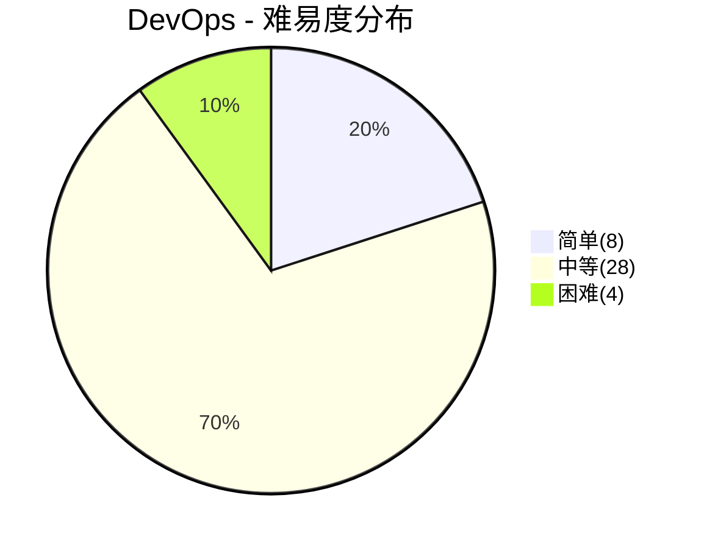
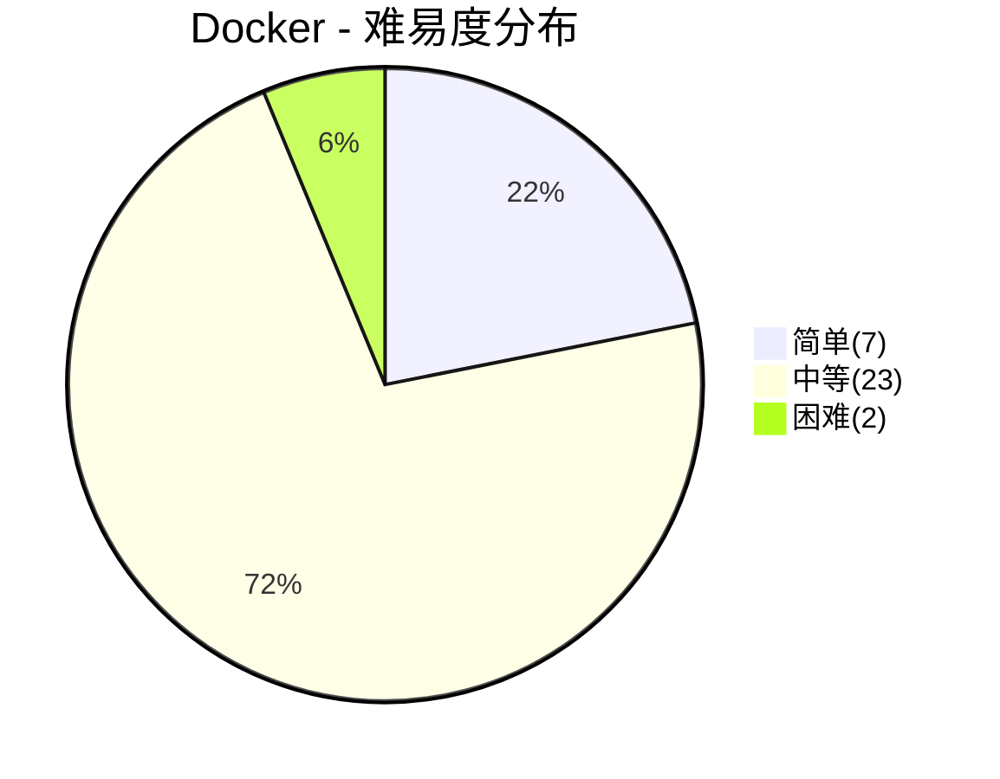
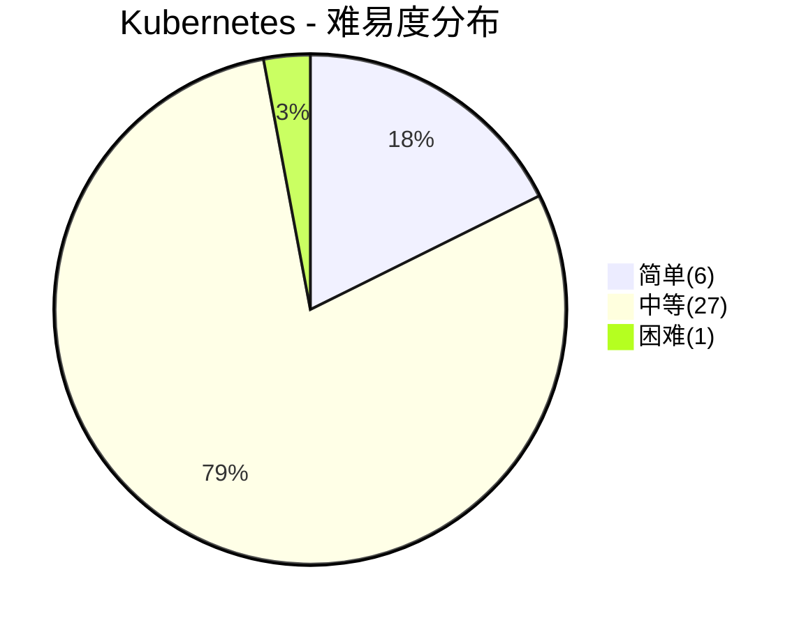
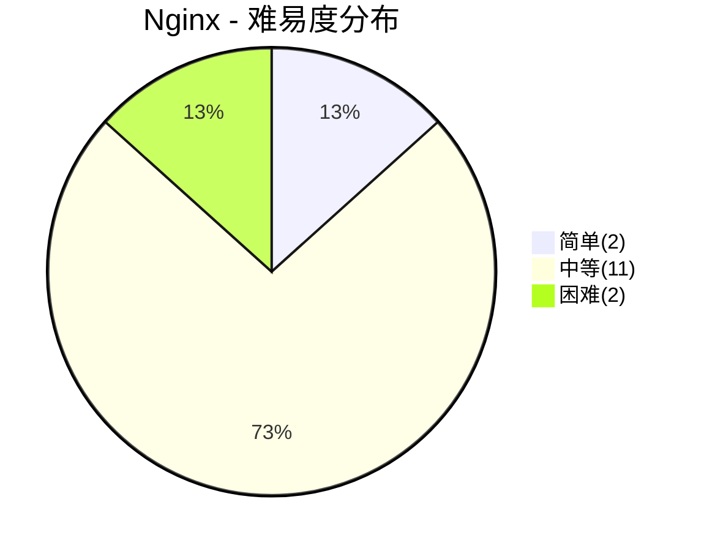

# DevOps面试

> **题库统计**：共收录 **121** 道面试题，覆盖 DevOps / Docker / Kubernetes / Nginx 四大板块。其中简单题 **23** 道（19.0%），中等题 **89** 道（73.6%），困难题 **9** 道（7.4%）。整体以中等难度为主，困难题集中在 CI/CD 流水线设计、容器安全与 Nginx 调优，适合中高级岗位深度考察。

## 📖 内容

### DevOps

> - [DevOps 面试](../04.DevOps/[DevOps]面试.md)

::: note **统计**：共 **40** 题

- 难易度：| 简单 **8** 题 | 中等 **28** 题 | 困难 **4** 题 |
- 重要度：| 一星 **4** 题 | 二星 **13** 题 | 三星 **12** 题 | 四星 **11** 题 |

:::

| 分类           | 题目                                                        | 难易度 | 重要度   | 掌握度 | 评估 |
| :------------- | :---------------------------------------------------------- | :----- | :------- | :----: | ---- |
| DevOps         | 什么是 DevOps？                                             | 简单   | ⭐⭐⭐   |        |      |
| DevOps         | 列举一下 DevOps 各环节的主流工具？                          | 简单   | ⭐⭐⭐   |        |      |
| DevOps         | DevOps 和传统瀑布/敏捷有什么区别？                          | 中等   | ⭐⭐     |        |      |
| DevOps         | Git 中 fork、clone、branch 有什么区别？                     | 中等   | ⭐⭐     |        |      |
| DevOps         | 什么是 Git 的 rebase？和 merge 有什么区别？                 | 中等   | ⭐⭐⭐⭐ |        |      |
| DevOps         | 什么是 Git 的 cherry-pick？适用什么场景？                   | 中等   | ⭐⭐     |        |      |
| DevOps         | Git 的 stash 怎么用？                                       | 中等   | ⭐⭐     |        |      |
| DevOps         | 常见的 Git 分支策略有哪些？                                 | 中等   | ⭐⭐⭐   |        |      |
| DevOps         | Git 中 reflog 有什么用？                                    | 简单   | ⭐       |        |      |
| DevOps         | 什么是 Git Hook？有哪些常见用途？                           | 中等   | ⭐       |        |      |
| DevOps         | 如何管理大型 Git 仓库？                                     | 中等   | ⭐       |        |      |
| DevOps         | Git 中 revert 和 reset 有什么区别？                         | 中等   | ⭐⭐⭐⭐ |        |      |
| DevOps         | Git 的子模块（submodule）是什么？怎么使用？                 | 中等   | ⭐⭐     |        |      |
| DevOps         | Linux 的权限模型是什么？chmod 755 是什么意思？              | 简单   | ⭐⭐     |        |      |
| DevOps         | 什么是 CC 攻击、DDoS 攻击和 SQL 注入？                      | 中等   | ⭐⭐     |        |      |
| DevOps         | 如何在 Linux 中查看系统资源使用情况？                       | 中等   | ⭐⭐     |        |      |
| DevOps         | Linux 中 systemd 是什么？如何管理服务？                     | 中等   | ⭐⭐     |        |      |
| DevOps         | Linux 中 crontab 怎么用？                                   | 简单   | ⭐⭐     |        |      |
| DevOps         | Linux 文本处理三剑客是什么？                                | 中等   | ⭐⭐⭐   |        |      |
| DevOps         | 什么是 lsof？strace 怎么用？                                | 中等   | ⭐       |        |      |
| DevOps         | Linux 中 nohup 和 & 有什么区别？如何让进程后台持久运行？    | 简单   | ⭐⭐     |        |      |
| DevOps         | 线上服务器 CPU 飙高，如何排查？                             | 中等   | ⭐⭐⭐   |        |      |
| DevOps         | 什么是 CI/CD？CI 和 CD 有什么区别？                         | 简单   | ⭐⭐⭐⭐ |        |      |
| DevOps         | Jenkins Pipeline 和 GitLab CI/CD 有什么区别？               | 中等   | ⭐⭐⭐   |        |      |
| DevOps         | 如何设计一个可靠的 CI/CD 流水线？                           | 困难   | ⭐⭐⭐⭐ |        |      |
| DevOps         | 什么是蓝绿部署和金丝雀发布？如何落地？                      | 中等   | ⭐⭐⭐⭐ |        |      |
| DevOps         | 什么是 IaC？Terraform 和 Ansible 有什么区别？               | 中等   | ⭐⭐     |        |      |
| DevOps         | 什么是容器化？容器和虚拟机有什么区别？                      | 简单   | ⭐⭐⭐⭐ |        |      |
| DevOps         | 什么是可观测性？监控和可观测性有什么区别？                  | 中等   | ⭐⭐⭐   |        |      |
| DevOps         | Prometheus 的监控原理是什么？                               | 中等   | ⭐⭐⭐   |        |      |
| 监控与可观测性 | 可观测性的三大支柱是什么？Metrics、Logs、Traces 如何协同？  | 中等   | ⭐⭐⭐⭐ |        |      |
| 监控与可观测性 | 如何设计一个日志收集与存储架构？                            | 困难   | ⭐⭐⭐⭐ |        |      |
| 监控与可观测性 | 分布式链路追踪的原理是什么？Jaeger 和 SkyWalking 如何选型？ | 中等   | ⭐⭐⭐⭐ |        |      |
| 监控与可观测性 | OpenTelemetry 解决了什么问题？                              | 中等   | ⭐⭐⭐   |        |      |
| 监控与可观测性 | 如何治理告警？如何避免告警风暴和告警疲劳？                  | 困难   | ⭐⭐⭐⭐ |        |      |
| 监控与可观测性 | 什么是 SLO、SLI 和错误预算？如何用它们驱动发布决策？        | 困难   | ⭐⭐⭐⭐ |        |      |
| 监控与可观测性 | 日志规范应该怎么设计？traceId 如何全链路透传？              | 中等   | ⭐⭐⭐   |        |      |
| 监控与可观测性 | 监控系统自身的高可用如何保障？                              | 中等   | ⭐⭐⭐   |        |      |
| DevOps         | 什么是 GitOps？和传统 CI/CD 有什么区别？                    | 中等   | ⭐⭐⭐   |        |      |
| DevOps         | Linux 中的硬链接和软连接是什么，二者有什么区别？            | 中等   | ⭐⭐     |        |      |

### Docker

> - [Docker 面试](../04.DevOps/工具/Docker/[Docker]面试.md)

::: note **统计**：共 **32** 题

- 难易度：| 简单 **7** 题 | 中等 **23** 题 | 困难 **2** 题 |
- 重要度：| 一星 **6** 题 | 二星 **14** 题 | 三星 **8** 题 | 四星 **3** 题 | 五星 **1** 题 |

:::

| 分类   | 题目                                                      | 难易度 | 重要度     | 掌握度 | 评估 |
| :----- | :-------------------------------------------------------- | :----- | :--------- | :----: | ---- |
| Docker | 什么是 Docker？为什么需要 Docker？                        | 简单   | ⭐⭐⭐     |        |      |
| Docker | Docker 有哪些核心概念和组件？                             | 简单   | ⭐⭐       |        |      |
| Docker | Docker 有哪些核心组件？                                   | 简单   | ⭐⭐       |        |      |
| Docker | Docker 的工作原理是什么？                                 | 中等   | ⭐⭐⭐     |        |      |
| Docker | 如何保证 Docker 沙箱执行时的安全性？                      | 困难   | ⭐⭐       |        |      |
| Docker | 什么是容器逃逸？常见的逃逸途径和防御手段有哪些？          | 困难   | ⭐⭐⭐⭐⭐ |        |      |
| Docker | Docker 中的镜像和容器有什么区别？                         | 简单   | ⭐⭐       |        |      |
| Docker | Docker 中如何实现镜像的推送和拉取？                       | 简单   | ⭐         |        |      |
| Docker | Docker 容器如何实现资源限制（如 CPU 和内存）？            | 中等   | ⭐⭐       |        |      |
| Docker | Docker 镜像的多层结构是如何实现的？                       | 中等   | ⭐⭐⭐⭐   |        |      |
| Docker | 如何构建 Docker 镜像？                                    | 简单   | ⭐⭐       |        |      |
| Docker | Docker 中的多阶段构建有什么优势？                         | 中等   | ⭐⭐⭐     |        |      |
| Docker | 在 Docker 中，如何构建多阶段镜像以减少镜像体积？          | 中等   | ⭐⭐⭐     |        |      |
| Docker | COPY 和 ADD 有什么区别？CMD 和 ENTRYPOINT 有什么区别？    | 中等   | ⭐⭐⭐     |        |      |
| Docker | Dockerfile 有哪些最佳实践？                               | 中等   | ⭐⭐⭐⭐   |        |      |
| Docker | 在 Docker 中，如何管理和查看容器日志？                    | 简单   | ⭐         |        |      |
| Docker | 在 Docker 中，如何进行数据卷管理？                        | 中等   | ⭐⭐⭐     |        |      |
| Docker | 如何在 Docker 中实现数据卷（volume）的持久化存储？        | 中等   | ⭐⭐       |        |      |
| Docker | 在 Docker 中，如何优化容器启动时间？                      | 中等   | ⭐         |        |      |
| Docker | 在 Docker 中，如何实现容器之间的通信？                    | 中等   | ⭐⭐       |        |      |
| Docker | 在 Docker 中，如何配置和管理环境变量？                    | 中等   | ⭐         |        |      |
| Docker | Docker Compose 的主要作用是什么？                         | 中等   | ⭐⭐⭐     |        |      |
| Docker | 在 CI/CD 流程中，如何使用 Jenkins 与 Docker 集成？        | 中等   | ⭐⭐       |        |      |
| Docker | Docker 支持哪些网络模型？                                 | 中等   | ⭐⭐⭐⭐   |        |      |
| Docker | 在 Docker 中，如何配置容器的网络？                        | 中等   | ⭐⭐       |        |      |
| Docker | Docker 的 bridge 网络模式如何配置和使用？                 | 中等   | ⭐⭐       |        |      |
| Docker | Docker 中的 overlay 网络模式如何配置和使用？              | 中等   | ⭐⭐       |        |      |
| Docker | Docker 的容器编排有哪些常见工具？                         | 中等   | ⭐⭐       |        |      |
| Docker | 什么是 Docker Swarm？                                     | 中等   | ⭐         |        |      |
| Docker | 如何使用 Docker Swarm 部署一个高可用集群？                | 中等   | ⭐         |        |      |
| Docker | Docker Swarm 和 Kubernetes 在集群管理上的主要区别是什么？ | 中等   | ⭐⭐       |        |      |
| Docker | 如何减小 Docker 镜像体积？                                | 中等   | ⭐⭐⭐     |        |      |

### Kubernetes

> - [Kubernetes 面试](../04.DevOps/工具/Kubernetes/[K8S]面试.md)

::: note **统计**：共 **34** 题

- 难易度：| 简单 **6** 题 | 中等 **27** 题 | 困难 **1** 题 |
- 重要度：| 一星 **1** 题 | 二星 **15** 题 | 三星 **15** 题 | 四星 **2** 题 | 五星 **1** 题 |

:::

| 分类       | 题目                                                                      | 难易度 | 重要度     | 掌握度 | 评估 |
| :--------- | :------------------------------------------------------------------------ | :----- | :--------- | :----: | ---- |
| Kubernetes | 什么是 Kubernetes，并描述其主要组件及其作用。                             | 中等   | ⭐⭐⭐     |        |      |
| Kubernetes | Kubernetes 中的 Pod 是什么？其作用是什么？                                | 简单   | ⭐⭐⭐     |        |      |
| Kubernetes | 如何在 Kubernetes 中创建一个 Pod？                                        | 中等   | ⭐⭐       |        |      |
| Kubernetes | Service（服务）：内部稳定端点                                             | 简单   | ⭐⭐       |        |      |
| Kubernetes | Ingress（入口）：外部流量网关                                             | 简单   | ⭐⭐       |        |      |
| Kubernetes | Kubernetes 中的 Service 和 Ingress 有什么区别？                           | 中等   | ⭐⭐⭐     |        |      |
| Kubernetes | 滚动更新                                                                  | 中等   | ⭐⭐       |        |      |
| Kubernetes | 回滚操作                                                                  | 中等   | ⭐⭐       |        |      |
| Kubernetes | Kubernetes 中如何进行滚动更新和回滚？                                     | 中等   | ⭐⭐⭐     |        |      |
| Kubernetes | ConfigMap（配置映射）                                                     | 简单   | ⭐⭐       |        |      |
| Kubernetes | Secret（密钥）                                                            | 简单   | ⭐⭐       |        |      |
| Kubernetes | Kubernetes 中的 ConfigMap 和 Secret 有什么作用？                          | 中等   | ⭐⭐⭐     |        |      |
| Kubernetes | Kubernetes 中如何配置资源配额？                                           | 中等   | ⭐⭐       |        |      |
| Kubernetes | Kubernetes 中的 Namespace 有什么作用？                                    | 简单   | ⭐⭐       |        |      |
| Kubernetes | Kubernetes 中如何进行日志管理？                                           | 中等   | ⭐⭐       |        |      |
| Kubernetes | Kubernetes 中如何实现持久化存储？                                         | 中等   | ⭐⭐⭐     |        |      |
| Kubernetes | Kubernetes 中的 Helm 有什么作用？                                         | 中等   | ⭐⭐       |        |      |
| Kubernetes | 如何在 Kubernetes 中使用 Helm 部署应用？                                  | 中等   | ⭐⭐       |        |      |
| Kubernetes | Kubernetes 中如何进行安全配置？                                           | 中等   | ⭐⭐⭐     |        |      |
| Kubernetes | Kubernetes 中如何实现服务的自动伸缩？                                     | 中等   | ⭐⭐⭐     |        |      |
| Kubernetes | Kubernetes 中的 Deployment 和 StatefulSet 有什么区别？                    | 中等   | ⭐⭐⭐⭐   |        |      |
| Kubernetes | Kubernetes 中的 Ingress 资源有什么作用？如何配置？                        | 中等   | ⭐⭐⭐     |        |      |
| Kubernetes | Kubernetes 中的 DaemonSet 有什么作用？                                    | 中等   | ⭐⭐       |        |      |
| Kubernetes | Kubernetes 中的 ReplicaSet 和 ReplicationController 有什么区别？          | 中等   | ⭐         |        |      |
| Kubernetes | Kubernetes 中的 Service 有哪几种类型？                                    | 中等   | ⭐⭐⭐     |        |      |
| Kubernetes | Kubernetes 的 Helm Charts 如何实现应用的版本控制？                        | 中等   | ⭐⭐       |        |      |
| Kubernetes | Kubernetes 中的 Job 和 CronJob 有什么区别？                               | 中等   | ⭐⭐       |        |      |
| Kubernetes | Kubernetes 中的 Persistent Volume 和 Persistent Volume Claim 有什么区别？ | 中等   | ⭐⭐⭐     |        |      |
| Kubernetes | Kubernetes 中的网络策略如何实现？                                         | 中等   | ⭐⭐⭐     |        |      |
| Kubernetes | Kubernetes 中的探针有哪些类型？各有什么作用？                             | 中等   | ⭐⭐⭐     |        |      |
| Kubernetes | Kubernetes 中 Pod 的调度策略有哪些？                                      | 困难   | ⭐⭐⭐⭐⭐ |        |      |
| Kubernetes | 什么是 Kubernetes 中的 RBAC？                                             | 中等   | ⭐⭐⭐⭐   |        |      |
| Kubernetes | Kubernetes 中 Pod 的 QoS 等级是什么？节点资源不足时如何驱逐 Pod？         | 中等   | ⭐⭐⭐     |        |      |
| Kubernetes | Pod 一直处于 CrashLoopBackOff，如何排查？                                 | 中等   | ⭐⭐⭐     |        |      |

### Nginx

> - [Nginx 面试](../04.DevOps/工具/Nginx/[Nginx]面试.md)

::: note **统计**：共 **15** 题

- 难易度：| 简单 **2** 题 | 中等 **11** 题 | 困难 **2** 题 |
- 重要度：| 一星 **2** 题 | 二星 **3** 题 | 三星 **7** 题 | 四星 **3** 题 |

:::

| 分类  | 题目                                       | 难易度 | 重要度   | 掌握度 | 评估 |
| :---- | :----------------------------------------- | :----- | :------- | :----: | ---- |
| Nginx | 什么是 Nginx？                             | 简单   | ⭐⭐⭐   |        |      |
| Nginx | Nginx 的架构是什么？为什么性能高？         | 困难   | ⭐⭐⭐⭐ |        |      |
| Nginx | 什么是正向代理和反向代理？                 | 中等   | ⭐⭐⭐   |        |      |
| Nginx | Nginx 的 location 匹配规则是什么？         | 中等   | ⭐⭐⭐   |        |      |
| Nginx | Nginx 中 rewrite 和 return 有什么区别？    | 中等   | ⭐⭐     |        |      |
| Nginx | 如何用 Nginx 实现负载均衡？有哪些策略？    | 中等   | ⭐⭐⭐⭐ |        |      |
| Nginx | 如何用 Nginx 做限流？                      | 中等   | ⭐⭐⭐   |        |      |
| Nginx | Nginx 性能调优有哪些关键参数？             | 困难   | ⭐⭐⭐⭐ |        |      |
| Nginx | 如何限制上传文件大小？                     | 中等   | ⭐       |        |      |
| Nginx | 如何用 Nginx 配置 HTTPS？                  | 中等   | ⭐⭐⭐   |        |      |
| Nginx | Nginx 如何做缓存？                         | 中等   | ⭐⭐     |        |      |
| Nginx | 如何实现 Nginx 高可用？                    | 中等   | ⭐⭐⭐   |        |      |
| Nginx | Nginx 的热重载原理是什么？常用命令有哪些？ | 中等   | ⭐⭐⭐   |        |      |
| Nginx | 如何用 Nginx 实现防盗链？                  | 简单   | ⭐       |        |      |
| Nginx | Nginx 如何实现动静分离？                   | 中等   | ⭐⭐     |        |      |
