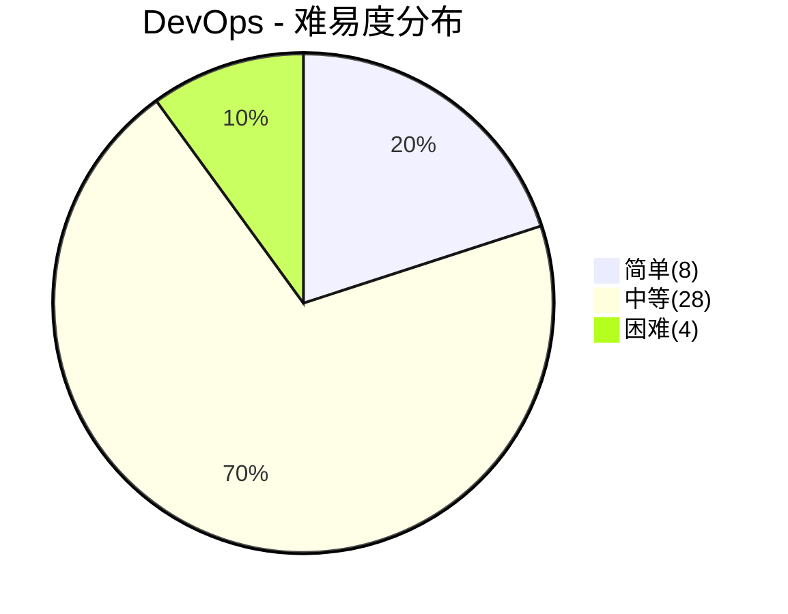
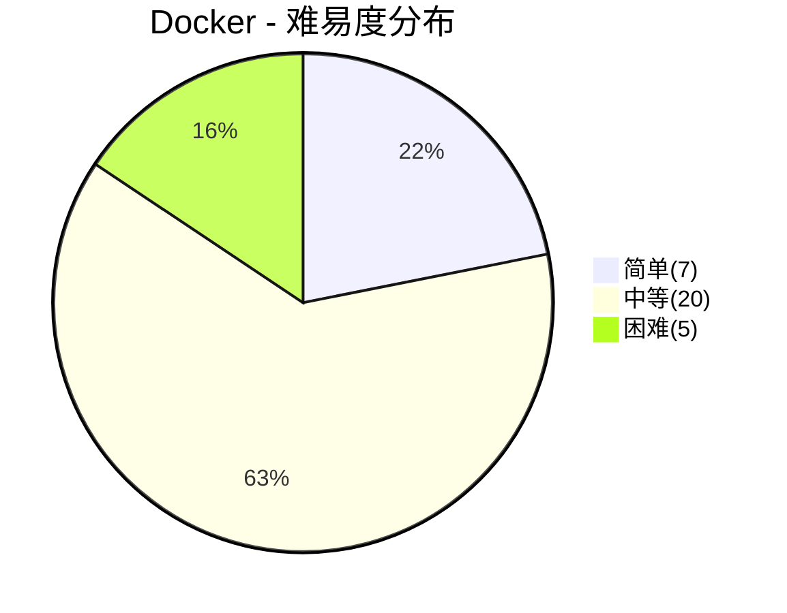
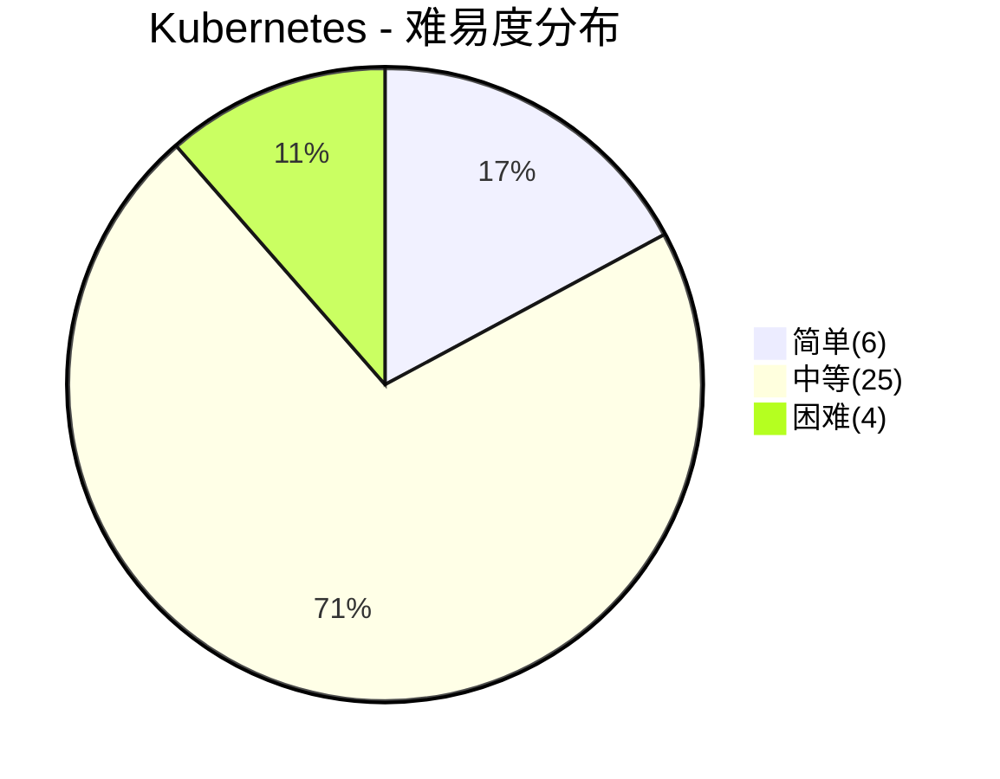
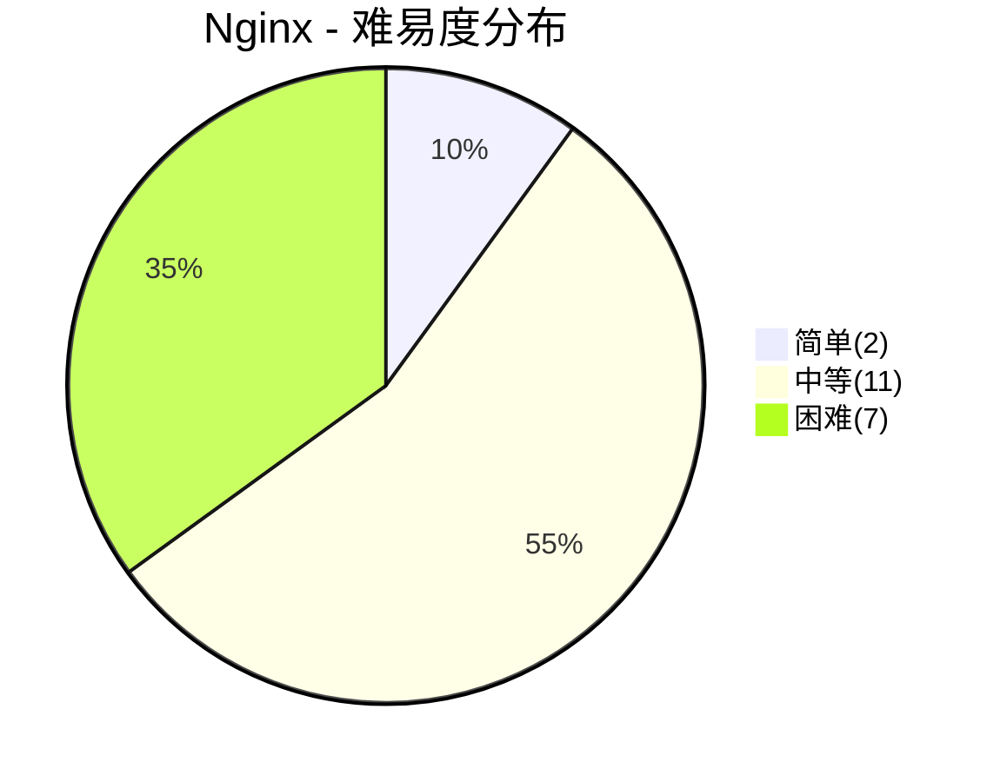
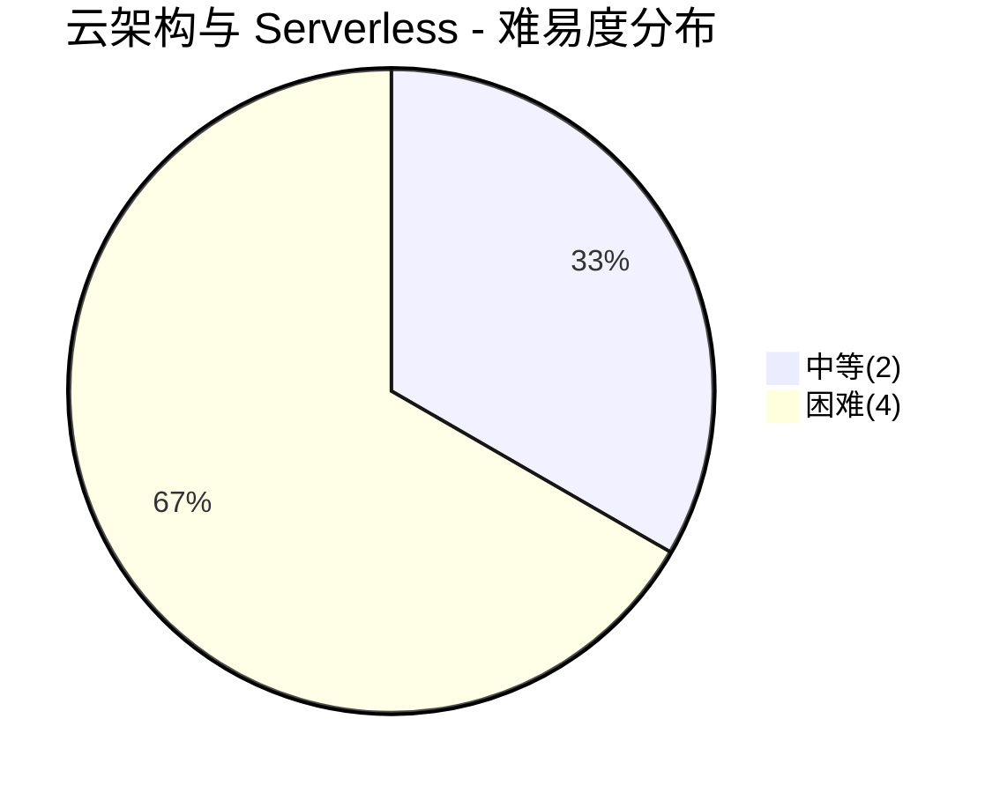

# DevOps面试

> **题库统计**：共收录 **133** 道面试题，覆盖 DevOps / Docker / Kubernetes / Nginx / 云架构与 Serverless 五大板块。其中简单题 **23** 道（17.3%），中等题 **86** 道（64.7%），困难题 **24** 道（18.0%）。整体以中等难度为主，困难题集中在 CI/CD 流水线设计、容器安全、Nginx 调优、协议演进与云架构设计，适合中高级岗位深度考察。

## 📖 内容

### DevOps

> - [DevOps 面试](../04.DevOps/[DevOps]面试.md)

::: note **统计**：共 **40** 题

- 难易度：| 简单 **8** 题 | 中等 **28** 题 | 困难 **4** 题 |
- 重要度：| 一星 **4** 题 | 二星 **13** 题 | 三星 **12** 题 | 四星 **11** 题 |

:::

```mermaid
pie title DevOps - 难易度分布
    "简单(8)" : 8
    "中等(28)" : 28
    "困难(4)" : 4
```

| 分类           | 题目                                                        | 难易度 | 重要度   | 掌握度 | 评估 |
| :------------- | :---------------------------------------------------------- | :----- | :------- | :----: | ---- |
| DevOps基础     | 什么是 DevOps？                                             | 简单   | ⭐⭐⭐   |        |      |
| DevOps基础     | 列举一下 DevOps 各环节的主流工具？                          | 简单   | ⭐⭐⭐   |        |      |
| DevOps基础     | DevOps 和传统瀑布/敏捷有什么区别？                          | 中等   | ⭐⭐     |        |      |
| Git            | Git 中 fork、clone、branch 有什么区别？                     | 中等   | ⭐⭐     |        |      |
| Git            | 什么是 Git 的 rebase？和 merge 有什么区别？                 | 中等   | ⭐⭐⭐⭐ |        |      |
| Git            | 什么是 Git 的 cherry-pick？适用什么场景？                   | 中等   | ⭐⭐     |        |      |
| Git            | Git 的 stash 怎么用？                                       | 中等   | ⭐⭐     |        |      |
| Git            | 常见的 Git 分支策略有哪些？                                 | 中等   | ⭐⭐⭐   |        |      |
| Git            | Git 中 reflog 有什么用？                                    | 简单   | ⭐       |        |      |
| Git            | 什么是 Git Hook？有哪些常见用途？                           | 中等   | ⭐       |        |      |
| Git            | 如何管理大型 Git 仓库？                                     | 中等   | ⭐       |        |      |
| Git            | Git 中 revert 和 reset 有什么区别？                         | 中等   | ⭐⭐⭐⭐ |        |      |
| Git            | Git 的子模块（submodule）是什么？怎么使用？                 | 中等   | ⭐⭐     |        |      |
| Linux          | Linux 的权限模型是什么？chmod 755 是什么意思？              | 简单   | ⭐⭐     |        |      |
| Linux          | 什么是 CC 攻击、DDoS 攻击和 SQL 注入？                      | 中等   | ⭐⭐     |        |      |
| Linux          | 如何在 Linux 中查看系统资源使用情况？                       | 中等   | ⭐⭐     |        |      |
| Linux          | Linux 中 systemd 是什么？如何管理服务？                     | 中等   | ⭐⭐     |        |      |
| Linux          | Linux 中 crontab 怎么用？                                   | 简单   | ⭐⭐     |        |      |
| Linux          | Linux 文本处理三剑客是什么？                                | 中等   | ⭐⭐⭐   |        |      |
| Linux          | 什么是 lsof？strace 怎么用？                                | 中等   | ⭐       |        |      |
| Linux          | Linux 中 nohup 和 & 有什么区别？如何让进程后台持久运行？    | 简单   | ⭐⭐     |        |      |
| Linux          | 线上服务器 CPU 飙高，如何排查？                             | 中等   | ⭐⭐⭐   |        |      |
| CI/CD          | 什么是 CI/CD？CI 和 CD 有什么区别？                         | 简单   | ⭐⭐⭐⭐ |        |      |
| CI/CD          | Jenkins Pipeline 和 GitLab CI/CD 有什么区别？               | 中等   | ⭐⭐⭐   |        |      |
| CI/CD          | 如何设计一个可靠的 CI/CD 流水线？                           | 困难   | ⭐⭐⭐⭐ |        |      |
| 部署与IaC      | 什么是蓝绿部署和金丝雀发布？如何落地？                      | 中等   | ⭐⭐⭐⭐ |        |      |
| 部署与IaC      | 什么是 IaC？Terraform 和 Ansible 有什么区别？               | 中等   | ⭐⭐     |        |      |
| 部署与IaC      | 什么是容器化？容器和虚拟机有什么区别？                      | 简单   | ⭐⭐⭐⭐ |        |      |
| 监控与可观测性 | 什么是可观测性？监控和可观测性有什么区别？                  | 中等   | ⭐⭐⭐   |        |      |
| 监控与可观测性 | Prometheus 的监控原理是什么？                               | 中等   | ⭐⭐⭐   |        |      |
| 监控与可观测性 | 可观测性的三大支柱是什么？Metrics、Logs、Traces 如何协同？  | 中等   | ⭐⭐⭐⭐ |        |      |
| 监控与可观测性 | 如何设计一个日志收集与存储架构？                            | 困难   | ⭐⭐⭐⭐ |        |      |
| 监控与可观测性 | 分布式链路追踪的原理是什么？Jaeger 和 SkyWalking 如何选型？ | 中等   | ⭐⭐⭐⭐ |        |      |
| 监控与可观测性 | OpenTelemetry 解决了什么问题？                              | 中等   | ⭐⭐⭐   |        |      |
| 监控与可观测性 | 如何治理告警？如何避免告警风暴和告警疲劳？                  | 困难   | ⭐⭐⭐⭐ |        |      |
| 监控与可观测性 | 什么是 SLO、SLI 和错误预算？如何用它们驱动发布决策？        | 困难   | ⭐⭐⭐⭐ |        |      |
| 监控与可观测性 | 日志规范应该怎么设计？traceId 如何全链路透传？              | 中等   | ⭐⭐⭐   |        |      |
| 监控与可观测性 | 监控系统自身的高可用如何保障？                              | 中等   | ⭐⭐⭐   |        |      |
| GitOps         | 什么是 GitOps？和传统 CI/CD 有什么区别？                    | 中等   | ⭐⭐⭐   |        |      |
| Linux          | Linux 中的硬链接和软连接是什么，二者有什么区别？            | 中等   | ⭐⭐     |        |      |

### Docker

> - [Docker 面试](../04.DevOps/工具/Docker/[Docker]面试.md)

::: note **统计**：共 **32** 题

- 难易度：| 简单 **7** 题 | 中等 **20** 题 | 困难 **5** 题 |
- 重要度：| 一星 **6** 题 | 二星 **14** 题 | 三星 **8** 题 | 四星 **3** 题 | 五星 **1** 题 |

:::

```mermaid
pie title Docker - 难易度分布
    "简单(7)" : 7
    "中等(20)" : 20
    "困难(5)" : 5
```

| 分类        | 题目                                                      | 难易度 | 重要度     | 掌握度 | 评估 |
| :---------- | :-------------------------------------------------------- | :----- | :--------- | :----: | ---- |
| 基础概念    | 什么是 Docker？为什么需要 Docker？                        | 简单   | ⭐⭐⭐     |        |      |
| 基础概念    | Docker 有哪些核心概念和组件？                             | 简单   | ⭐⭐       |        |      |
| 基础概念    | Docker 有哪些核心组件？                                   | 简单   | ⭐⭐       |        |      |
| 基础概念    | Docker 的工作原理是什么？                                 | 中等   | ⭐⭐⭐     |        |      |
| 安全        | 如何保证 Docker 沙箱执行时的安全性？                      | 困难   | ⭐⭐       |        |      |
| 安全        | 什么是容器逃逸？常见的逃逸途径和防御手段有哪些？          | 困难   | ⭐⭐⭐⭐⭐ |        |      |
| 基础概念    | Docker 中的镜像和容器有什么区别？                         | 简单   | ⭐⭐       |        |      |
| 镜像构建    | Docker 中如何实现镜像的推送和拉取？                       | 简单   | ⭐         |        |      |
| 容器运维    | Docker 容器如何实现资源限制（如 CPU 和内存）？            | 中等   | ⭐⭐       |        |      |
| 镜像构建    | Docker 镜像的多层结构是如何实现的？                       | 中等   | ⭐⭐⭐⭐   |        |      |
| 镜像构建    | 如何构建 Docker 镜像？                                    | 简单   | ⭐⭐       |        |      |
| 镜像构建    | Docker 中的多阶段构建有什么优势？                         | 中等   | ⭐⭐⭐     |        |      |
| 镜像构建    | 在 Docker 中，如何构建多阶段镜像以减少镜像体积？          | 中等   | ⭐⭐⭐     |        |      |
| 镜像构建    | COPY 和 ADD 有什么区别？CMD 和 ENTRYPOINT 有什么区别？    | 中等   | ⭐⭐⭐     |        |      |
| 镜像构建    | Dockerfile 有哪些最佳实践？                               | 困难   | ⭐⭐⭐⭐   |        |      |
| 容器运维    | 在 Docker 中，如何管理和查看容器日志？                    | 简单   | ⭐         |        |      |
| 数据与日志  | 在 Docker 中，如何进行数据卷管理？                        | 中等   | ⭐⭐⭐     |        |      |
| 数据与日志  | 如何在 Docker 中实现数据卷（volume）的持久化存储？        | 中等   | ⭐⭐       |        |      |
| 容器运维    | 在 Docker 中，如何优化容器启动时间？                      | 中等   | ⭐         |        |      |
| 网络        | 在 Docker 中，如何实现容器之间的通信？                    | 中等   | ⭐⭐       |        |      |
| 容器运维    | 在 Docker 中，如何配置和管理环境变量？                    | 中等   | ⭐         |        |      |
| 编排与Swarm | Docker Compose 的主要作用是什么？                         | 中等   | ⭐⭐⭐     |        |      |
| 容器运维    | 在 CI/CD 流程中，如何使用 Jenkins 与 Docker 集成？        | 中等   | ⭐⭐       |        |      |
| 网络        | Docker 支持哪些网络模型？                                 | 困难   | ⭐⭐⭐⭐   |        |      |
| 网络        | 在 Docker 中，如何配置容器的网络？                        | 中等   | ⭐⭐       |        |      |
| 网络        | Docker 的 bridge 网络模式如何配置和使用？                 | 中等   | ⭐⭐       |        |      |
| 网络        | Docker 中的 overlay 网络模式如何配置和使用？              | 中等   | ⭐⭐       |        |      |
| 编排与Swarm | Docker 的容器编排有哪些常见工具？                         | 中等   | ⭐⭐       |        |      |
| 编排与Swarm | 什么是 Docker Swarm？                                     | 中等   | ⭐         |        |      |
| 编排与Swarm | 如何使用 Docker Swarm 部署一个高可用集群？                | 中等   | ⭐         |        |      |
| 编排与Swarm | Docker Swarm 和 Kubernetes 在集群管理上的主要区别是什么？ | 中等   | ⭐⭐       |        |      |
| 镜像构建    | 如何减小 Docker 镜像体积？                                | 困难   | ⭐⭐⭐     |        |      |

### Kubernetes

> - [Kubernetes 面试](../04.DevOps/工具/Kubernetes/[K8S]面试.md)

::: note **统计**：共 **35** 题

- 难易度：| 简单 **6** 题 | 中等 **25** 题 | 困难 **4** 题 |
- 重要度：| 一星 **1** 题 | 二星 **15** 题 | 三星 **15** 题 | 四星 **3** 题 | 五星 **1** 题 |

:::

```mermaid
pie title Kubernetes - 难易度分布
    "简单(6)" : 6
    "中等(25)" : 25
    "困难(4)" : 4
```

| 分类       | 题目                                                                      | 难易度 | 重要度     | 掌握度 | 评估 |
| :--------- | :------------------------------------------------------------------------ | :----- | :--------- | :----: | ---- |
| 核心概念   | 什么是 Kubernetes，并描述其主要组件及其作用。                             | 中等   | ⭐⭐⭐     |        |      |
| 核心概念   | Kubernetes 中的 Pod 是什么？其作用是什么？                                | 简单   | ⭐⭐⭐     |        |      |
| 核心概念   | 如何在 Kubernetes 中创建一个 Pod？                                        | 中等   | ⭐⭐       |        |      |
| 网络与调度 | Service（服务）：内部稳定端点                                             | 简单   | ⭐⭐       |        |      |
| 网络与调度 | Ingress（入口）：外部流量网关                                             | 简单   | ⭐⭐       |        |      |
| 网络与调度 | Kubernetes 中的 Service 和 Ingress 有什么区别？                           | 中等   | ⭐⭐⭐     |        |      |
| 部署与更新 | 滚动更新                                                                  | 中等   | ⭐⭐       |        |      |
| 部署与更新 | 回滚操作                                                                  | 中等   | ⭐⭐       |        |      |
| 部署与更新 | Kubernetes 中如何进行滚动更新和回滚？                                     | 中等   | ⭐⭐⭐     |        |      |
| 配置管理   | ConfigMap（配置映射）                                                     | 简单   | ⭐⭐       |        |      |
| 配置管理   | Secret（密钥）                                                            | 简单   | ⭐⭐       |        |      |
| 配置管理   | Kubernetes 中的 ConfigMap 和 Secret 有什么作用？                          | 中等   | ⭐⭐⭐     |        |      |
| 安全与伸缩 | Kubernetes 中如何配置资源配额？                                           | 中等   | ⭐⭐       |        |      |
| 核心概念   | Kubernetes 中的 Namespace 有什么作用？                                    | 简单   | ⭐⭐       |        |      |
| 运维排障   | Kubernetes 中如何进行日志管理？                                           | 中等   | ⭐⭐       |        |      |
| 存储       | Kubernetes 中如何实现持久化存储？                                         | 中等   | ⭐⭐⭐     |        |      |
| Helm       | Kubernetes 中的 Helm 有什么作用？                                         | 中等   | ⭐⭐       |        |      |
| Helm       | 如何在 Kubernetes 中使用 Helm 部署应用？                                  | 中等   | ⭐⭐       |        |      |
| 安全与伸缩 | Kubernetes 中如何进行安全配置？                                           | 中等   | ⭐⭐⭐     |        |      |
| 安全与伸缩 | Kubernetes 中如何实现服务的自动伸缩？                                     | 中等   | ⭐⭐⭐     |        |      |
| 工作负载   | Kubernetes 中的 Deployment 和 StatefulSet 有什么区别？                    | 困难   | ⭐⭐⭐⭐   |        |      |
| 网络与调度 | Kubernetes 中的 Ingress 资源有什么作用？如何配置？                        | 中等   | ⭐⭐⭐     |        |      |
| 工作负载   | Kubernetes 中的 DaemonSet 有什么作用？                                    | 中等   | ⭐⭐       |        |      |
| 工作负载   | Kubernetes 中的 ReplicaSet 和 ReplicationController 有什么区别？          | 中等   | ⭐         |        |      |
| 网络与调度 | Kubernetes 中的 Service 有哪几种类型？                                    | 中等   | ⭐⭐⭐     |        |      |
| Helm       | Kubernetes 的 Helm Charts 如何实现应用的版本控制？                        | 中等   | ⭐⭐       |        |      |
| 工作负载   | Kubernetes 中的 Job 和 CronJob 有什么区别？                               | 中等   | ⭐⭐       |        |      |
| 存储       | Kubernetes 中的 Persistent Volume 和 Persistent Volume Claim 有什么区别？ | 中等   | ⭐⭐⭐     |        |      |
| 网络与调度 | Kubernetes 中的网络策略如何实现？                                         | 中等   | ⭐⭐⭐     |        |      |
| 运维排障   | Kubernetes 中的探针有哪些类型？各有什么作用？                             | 中等   | ⭐⭐⭐     |        |      |
| 网络与调度 | Kubernetes 中 Pod 的调度策略有哪些？                                      | 困难   | ⭐⭐⭐⭐⭐ |        |      |
| 安全与伸缩 | 什么是 Kubernetes 中的 RBAC？                                             | 困难   | ⭐⭐⭐⭐   |        |      |
| 运维排障   | Kubernetes 中 Pod 的 QoS 等级是什么？节点资源不足时如何驱逐 Pod？         | 中等   | ⭐⭐⭐     |        |      |
| 运维排障   | Pod 一直处于 CrashLoopBackOff，如何排查？                                 | 中等   | ⭐⭐⭐     |        |      |
| 核心概念   | Kubernetes 的 List-Watch 与 Informer 机制是什么？                         | 困难   | ⭐⭐⭐⭐   |        |      |

### Nginx

> - [Nginx 面试](../04.DevOps/工具/Nginx/[Nginx]面试.md)

::: note **统计**：共 **20** 题

- 难易度：| 简单 **2** 题 | 中等 **11** 题 | 困难 **7** 题 |
- 重要度：| 一星 **2** 题 | 二星 **3** 题 | 三星 **7** 题 | 四星 **7** 题 | 五星 **1** 题 |

:::

```mermaid
pie title Nginx - 难易度分布
    "简单(2)" : 2
    "中等(11)" : 11
    "困难(7)" : 7
```

| 分类           | 题目                                                                          | 难易度 | 重要度     | 掌握度 | 评估 |
| :------------- | :---------------------------------------------------------------------------- | :----- | :--------- | :----: | ---- |
| 基础与架构     | 什么是 Nginx？                                                                | 简单   | ⭐⭐⭐     |        |      |
| 基础与架构     | Nginx 的架构是什么？为什么性能高？                                            | 困难   | ⭐⭐⭐⭐   |        |      |
| 代理与路由     | 什么是正向代理和反向代理？                                                    | 中等   | ⭐⭐⭐     |        |      |
| 代理与路由     | Nginx 的 location 匹配规则是什么？                                            | 中等   | ⭐⭐⭐     |        |      |
| 代理与路由     | Nginx 中 rewrite 和 return 有什么区别？                                       | 中等   | ⭐⭐       |        |      |
| 负载均衡与限流 | 如何用 Nginx 实现负载均衡？有哪些策略？                                       | 中等   | ⭐⭐⭐⭐   |        |      |
| 负载均衡与限流 | 如何用 Nginx 做限流？                                                         | 中等   | ⭐⭐⭐     |        |      |
| 性能调优       | Nginx 性能调优有哪些关键参数？                                                | 困难   | ⭐⭐⭐⭐   |        |      |
| 安全与配置     | 如何限制上传文件大小？                                                        | 中等   | ⭐         |        |      |
| 安全与配置     | 如何用 Nginx 配置 HTTPS？                                                     | 中等   | ⭐⭐⭐     |        |      |
| 性能调优       | Nginx 如何做缓存？                                                            | 中等   | ⭐⭐       |        |      |
| 性能调优       | 如何实现 Nginx 高可用？                                                       | 中等   | ⭐⭐⭐     |        |      |
| 基础与架构     | Nginx 的热重载原理是什么？常用命令有哪些？                                    | 中等   | ⭐⭐⭐     |        |      |
| 安全与配置     | 如何用 Nginx 实现防盗链？                                                     | 简单   | ⭐         |        |      |
| 代理与路由     | Nginx 如何实现动静分离？                                                      | 中等   | ⭐⭐       |        |      |
| 性能调优       | 高并发场景下 Nginx 的 TCP 内核参数与 worker 配置如何协同调优？                | 困难   | ⭐⭐⭐⭐   |        |      |
| 性能调优       | Nginx 在百万级长连接场景下的性能瓶颈有哪些？如何排查与优化？                  | 困难   | ⭐⭐⭐⭐⭐ |        |      |
| 协议演进       | Nginx 如何支持 HTTP/2 与 HTTP/3（QUIC）？协议演进对性能的实际影响与配置要点。 | 困难   | ⭐⭐⭐⭐   |        |      |
| 架构设计       | 基于 Nginx 如何设计 CDN 架构？包括回源策略、缓存分层、边缘计算与动静分离。    | 困难   | ⭐⭐⭐⭐   |        |      |
| 负载均衡       | L4（四层）与 L7（七层）负载均衡的本质区别是什么？如何选型与协同部署？         | 困难   | ⭐⭐⭐⭐   |        |      |

### 云架构与 Serverless

> - [云架构与 Serverless 面试](../04.DevOps/云架构/[云架构与Serverless]面试.md)

::: note **统计**：共 **6** 题

- 难易度：| 中等 **2** 题 | 困难 **4** 题 |
- 重要度：| 三星 **2** 题 | 四星 **3** 题 | 五星 **1** 题 |

:::

```mermaid
pie title 云架构与 Serverless - 难易度分布
    "中等(2)" : 2
    "困难(4)" : 4
```

| 分类       | 题目                                                                            | 难易度 | 重要度     | 掌握度 | 评估 |
| :--------- | :------------------------------------------------------------------------------ | :----- | :--------- | :----: | ---- |
| 混合云     | 混合云架构中如何解决跨云数据一致性与网络延迟问题？                              | 困难   | ⭐⭐⭐⭐   |        |      |
| Serverless | Serverless 架构的冷启动问题如何优化？适用边界在哪里？                           | 中等   | ⭐⭐⭐     |        |      |
| 云原生迁移 | 传统应用迁移到 Serverless 架构的核心挑战与渐进策略？                            | 困难   | ⭐⭐⭐⭐⭐ |        |      |
| Serverless | Serverless 事件驱动架构如何设计？包括事件路由、编排模式、错误处理与幂等性保障。 | 中等   | ⭐⭐⭐     |        |      |
| 选型决策   | FaaS（Lambda）与容器化（K8s）如何选型？成本、冷启动、运行时约束的量化对比框架？ | 困难   | ⭐⭐⭐⭐   |        |      |
| 云原生     | 多云架构如何设计？包括工作负载分布、数据同步、统一治理与避免供应商锁定的策略。  | 困难   | ⭐⭐⭐⭐   |        |      |

### 跨域关联

- [分布式治理与容错](分布式面试.md#分布式治理)
- [分布式通信与 RPC](分布式面试.md#分布式通信)
- [MySQL 高可用](数据库面试.md#mysql)
- [大数据数据工程](大数据面试.md#数据工程)
