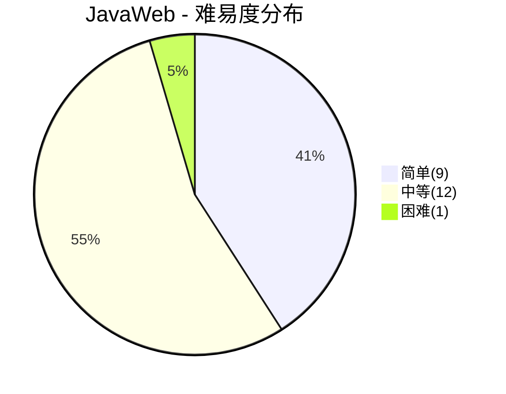
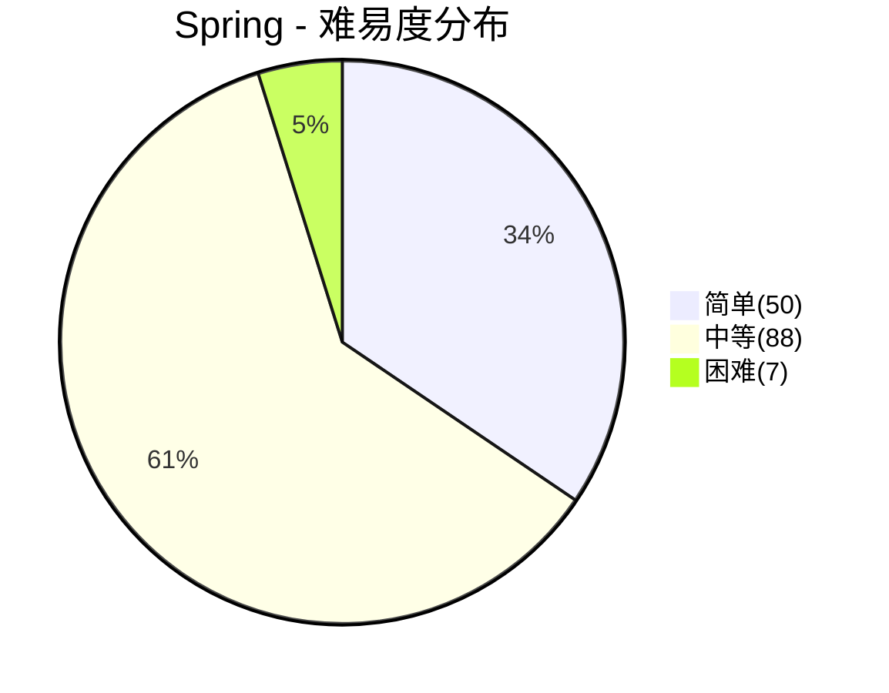
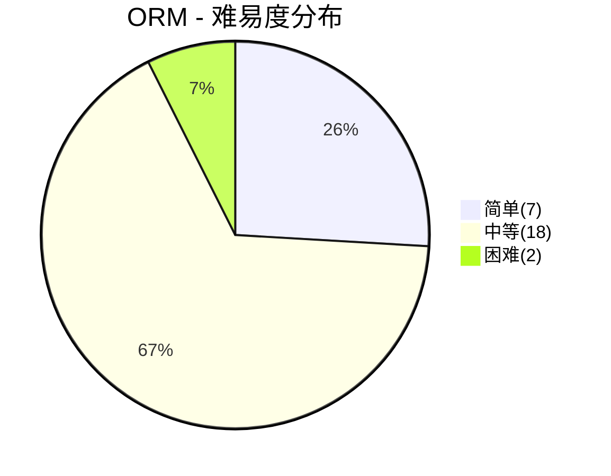
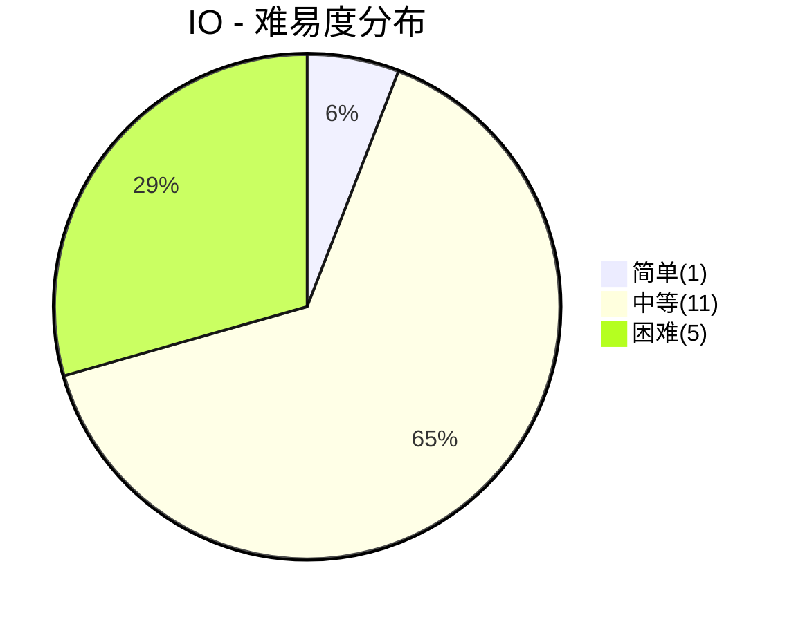

# Java框架面试

> **题库统计**：共收录 **211** 道面试题，覆盖 JavaWeb / Spring / ORM / IO 四大板块。其中简单题 **67** 道（31.8%），中等题 **129** 道（61.1%），困难题 **15** 道（7.1%）。整体以中等难度为主，简单题集中在 Spring 注解类基础题，困难题集中在 Spring 核心原理与 Netty 模块，适合中高级岗位深度考察。

## 📖 内容

### JavaWeb

> - [JavaWeb 面试](../01.Java/JavaWeb/[JavaWeb]面试.md)

::: note **统计**：共 **22** 题

- 难易度：| 简单 **9** 题 | 中等 **12** 题 | 困难 **1** 题 |
- 重要度：| 一星 **5** 题 | 二星 **5** 题 | 三星 **8** 题 | 四星 **4** 题 |

:::

| 分类    | 题目                                               | 难易度 | 重要度   | 掌握度 | 评估 |
| :------ | :------------------------------------------------- | :----- | :------- | :----: | ---- |
| JavaWeb | 什么是 Servlet？                                   | 简单   | ⭐⭐     |        |      |
| JavaWeb | Servlet 和 JSP 的区别？                            | 简单   | ⭐       |        |      |
| JavaWeb | 简述 Servlet 生命周期                              | 中等   | ⭐⭐⭐   |        |      |
| JavaWeb | GET 请求和 POST 请求的区别？                       | 简单   | ⭐⭐     |        |      |
| JavaWeb | 请求转发(forward)和重定向(redirect)的区别？        | 中等   | ⭐⭐⭐   |        |      |
| JavaWeb | HTTP 常见状态码有哪些？                            | 简单   | ⭐⭐     |        |      |
| JavaWeb | Cookie 和 Session 的区别是什么？                   | 中等   | ⭐⭐⭐⭐ |        |      |
| JavaWeb | Cookie / Session / Token / JWT 如何选型？          | 困难   | ⭐⭐⭐⭐ |        |      |
| JavaWeb | 什么是 XSS 攻击？如何防御？                        | 中等   | ⭐⭐⭐   |        |      |
| JavaWeb | 什么是 CSRF 攻击？如何防御？                       | 中等   | ⭐⭐⭐   |        |      |
| JavaWeb | 什么是 CORS 跨域？如何解决？                       | 中等   | ⭐⭐⭐   |        |      |
| JavaWeb | 过滤器(Filter)、拦截器(Interceptor)、AOP 的区别？  | 中等   | ⭐⭐⭐⭐ |        |      |
| JavaWeb | HTTP 缓存机制是如何工作的？                        | 中等   | ⭐⭐⭐   |        |      |
| JavaWeb | 什么是 WebSocket？与 HTTP 的区别？                 | 中等   | ⭐⭐     |        |      |
| JavaWeb | 什么是 RESTful API？设计原则？                     | 中等   | ⭐⭐     |        |      |
| JavaWeb | Servlet 中如何获取用户提交的查询参数或表单数据？   | 简单   | ⭐       |        |      |
| JavaWeb | request 和 response 的常用方法？                   | 简单   | ⭐       |        |      |
| JavaWeb | 用户在浏览器中输入 URL 后发生了什么？              | 简单   | ⭐⭐⭐   |        |      |
| JavaWeb | JSP 的内置对象和作用域？                           | 简单   | ⭐       |        |      |
| JavaWeb | JSP 中动态 INCLUDE 和静态 INCLUDE 的区别？         | 简单   | ⭐       |        |      |
| JavaWeb | JWT 如何实现刷新与主动失效？                       | 中等   | ⭐⭐⭐⭐ |        |      |
| JavaWeb | OAuth 2.0 有哪些授权模式？授权码模式流程是怎样的？ | 中等   | ⭐⭐⭐   |        |      |

### Spring

> - [Spring 面试](../01.Java/框架/Spring/Spring面试.md)
> - [SpringBoot 面试](../01.Java/框架/Spring/SpringBoot面试.md)
> - [SpringCloud 面试](../01.Java/框架/Spring/SpringCloud面试.md)

::: note **统计**：共 **145** 题

- 难易度：| 简单 **50** 题 | 中等 **88** 题 | 困难 **7** 题 |
- 重要度：| 一星 **25** 题 | 二星 **94** 题 | 三星 **11** 题 | 四星 **11** 题 | 五星 **4** 题 |

:::

| 分类   | 题目                                                          | 难易度 | 重要度     | 掌握度 | 评估 |
| :----- | :------------------------------------------------------------ | :----- | :--------- | :----: | ---- |
| Spring | 什么是 Spring？                                               | 简单   | ⭐⭐       |        |      |
| Spring | Spring 有哪些优点？                                           | 简单   | ⭐⭐       |        |      |
| Spring | Spring 有哪些模块？                                           | 简单   | ⭐         |        |      |
| Spring | Spring 有哪些里程碑版本？                                     | 简单   | ⭐         |        |      |
| Spring | Spring 和 Spring MVC 之间是什么关系？                         | 简单   | ⭐⭐       |        |      |
| Spring | Spring、SpringBoot、SpringCloud 之间是什么关系？              | 简单   | ⭐⭐       |        |      |
| Spring | Spring 中用到了哪些设计模式？                                 | 中等   | ⭐⭐⭐⭐   |        |      |
| Spring | Spring 通知有哪些类型？                                       | 中等   | ⭐⭐       |        |      |
| Spring | 什么是 Spring Bean？                                          | 简单   | ⭐⭐       |        |      |
| Spring | Spring Bean 注册有几种方式？                                  | 简单   | ⭐         |        |      |
| Spring | Spring Bean 支持哪些作用域？                                  | 简单   | ⭐⭐       |        |      |
| Spring | Spring Bean 的生命周期是怎样的？                              | 中等   | ⭐⭐⭐⭐⭐ |        |      |
| Spring | Spring 的单例 Bean 是否有并发安全问题？                       | 中等   | ⭐⭐       |        |      |
| Spring | Spring 是如何启动的？                                         | 中等   | ⭐⭐       |        |      |
| Spring | 什么是自动装配？                                              | 中等   | ⭐⭐       |        |      |
| Spring | 什么是 IoC？什么是依赖注入？什么是 Spring IoC？               | 简单   | ⭐⭐⭐⭐   |        |      |
| Spring | Spring 一共有几种注入方式？                                   | 中等   | ⭐⭐       |        |      |
| Spring | 构造器注入、Setter 注入、字段注入有什么区别？                 | 中等   | ⭐⭐       |        |      |
| Spring | Spring IOC 容器如何初始化？                                   | 中等   | ⭐⭐       |        |      |
| Spring | Spring 自动装配的方式有哪些？                                 | 中等   | ⭐         |        |      |
| Spring | Spring 中的 ObjectFactory 是什么？                            | 中等   | ⭐⭐       |        |      |
| Spring | BeanFactory 和 ApplicationContext 有什么区别？                | 简单   | ⭐⭐⭐     |        |      |
| Spring | BeanFactory 和 FactoryBean 有什么区别？                       | 简单   | ⭐         |        |      |
| Spring | @Autowired、@Resource、@Inject 有什么区别？                   | 中等   | ⭐⭐⭐     |        |      |
| Spring | @Configuration 和 @Component 有什么区别？                     | 中等   | ⭐⭐       |        |      |
| Spring | Spring 如何解决循环依赖？                                     | 困难   | ⭐⭐⭐⭐⭐ |        |      |
| Spring | Spring 解决循环依赖为什么一定要用三级缓存？                   | 困难   | ⭐⭐⭐⭐⭐ |        |      |
| Spring | 什么是 AOP？                                                  | 简单   | ⭐⭐⭐⭐   |        |      |
| Spring | Spring AOP 有哪些实现方式？                                   | 中等   | ⭐⭐⭐⭐   |        |      |
| Spring | Spring AOP 和 AspectJ 有什么区别？                            | 中等   | ⭐⭐       |        |      |
| Spring | Spring 拦截链如何实现？                                       | 中等   | ⭐⭐       |        |      |
| Spring | Spring 事件机制是什么？                                       | 中等   | ⭐⭐       |        |      |
| Spring | @EventListener 和 ApplicationListener 有什么区别？            | 中等   | ⭐         |        |      |
| Spring | Spring 有哪些核心扩展点？                                     | 困难   | ⭐⭐⭐     |        |      |
| Spring | BeanFactoryPostProcessor 和 BeanPostProcessor 有什么区别？    | 中等   | ⭐⭐⭐     |        |      |
| Spring | InitializingBean 和 init-method 有什么区别？                  | 中等   | ⭐         |        |      |
| Spring | Spring DAO 有哪些异常？                                       | 中等   | ⭐⭐       |        |      |
| Spring | 什么是 Spring 的事务管理？                                    | 中等   | ⭐⭐       |        |      |
| Spring | Spring 事务支持哪些隔离级别？                                 | 中等   | ⭐         |        |      |
| Spring | Spring 事务支持哪些传播行为？                                 | 中等   | ⭐⭐⭐⭐⭐ |        |      |
| Spring | Spring 事务传播行为有什么用？                                 | 中等   | ⭐⭐⭐⭐   |        |      |
| Spring | Spring 事务在什么情况下会失效？                               | 中等   | ⭐⭐⭐⭐   |        |      |
| Spring | @Transactional 的实现原理是什么？                             | 中等   | ⭐⭐⭐⭐   |        |      |
| Spring | 声明式事务和编程式事务有什么区别？                            | 中等   | ⭐         |        |      |
| Spring | Spring 中的 JPA 和 Hibernate 有什么区别？                     | 中等   | ⭐⭐       |        |      |
| Spring | 说下对 Spring MVC 的理解？                                    | 中等   | ⭐⭐       |        |      |
| Spring | Spring MVC 如何工作？                                         | 中等   | ⭐⭐⭐⭐   |        |      |
| Spring | Spring MVC 有哪些核心组件？                                   | 中等   | ⭐⭐       |        |      |
| Spring | Spring MVC 中的 Controller 是什么？                           | 简单   | ⭐⭐       |        |      |
| Spring | Spring MVC 中如何处理表单提交？                               | 中等   | ⭐⭐       |        |      |
| Spring | Spring MVC 中的视图解析器有什么作用？                         | 中等   | ⭐⭐       |        |      |
| Spring | Spring MVC 中的拦截器是什么？如何定义一个拦截器？             | 中等   | ⭐⭐       |        |      |
| Spring | Spring MVC 中的国际化是如何实现？                             | 中等   | ⭐⭐       |        |      |
| Spring | Spring MVC 如何处理异常？                                     | 中等   | ⭐⭐       |        |      |
| Spring | Spring MVC 父子容器是什么知道吗？                             | 中等   | ⭐⭐       |        |      |
| Spring | Spring WebFlux 是什么？它与 Spring MVC 有何不同？             | 中等   | ⭐⭐       |        |      |
| Spring | 什么是 Restful 风格的接口？                                   | 中等   | ⭐⭐       |        |      |
| Spring | 你用过哪些重要的 Spring 注解？                                | 中等   | ⭐⭐       |        |      |
| Spring | @Bean 和@Component 有什么区别？                               | 简单   | ⭐⭐       |        |      |
| Spring | @Component, @Controller, @Repository, @Service 有何区别？     | 简单   | ⭐⭐       |        |      |
| Spring | @Autowired 注解有什么用？                                     | 简单   | ⭐⭐       |        |      |
| Spring | @Qualifier 注解有什么作用                                     | 简单   | ⭐⭐       |        |      |
| Spring | Spring 中的 @Primary 注解的作用是什么？                       | 简单   | ⭐⭐       |        |      |
| Spring | Spring 中的 @Value 注解的作用是什么？                         | 简单   | ⭐⭐       |        |      |
| Spring | Spring 中的 @Profile 注解的作用是什么？                       | 简单   | ⭐⭐       |        |      |
| Spring | Spring 中的 @PostConstruct 和 @PreDestroy 注解的作用是什么？  | 简单   | ⭐⭐       |        |      |
| Spring | Spring 中的 @RequestBody 和 @ResponseBody 注解的作用是什么？  | 简单   | ⭐⭐⭐     |        |      |
| Spring | Spring 中的 @PathVariable 注解的作用是什么？                  | 简单   | ⭐⭐       |        |      |
| Spring | Spring 中的 @ModelAttribute 注解的作用是什么？                | 简单   | ⭐⭐       |        |      |
| Spring | Spring 中的 @ExceptionHandler 注解的作用是什么？              | 简单   | ⭐⭐       |        |      |
| Spring | Spring 中的 @ResponseStatus 注解的作用是什么？                | 简单   | ⭐⭐       |        |      |
| Spring | Spring 中的 @RequestHeader 和 @CookieValue 注解的作用是什么？ | 简单   | ⭐⭐       |        |      |
| Spring | Spring 中的 @SessionAttribute 注解的作用是什么？              | 简单   | ⭐⭐       |        |      |
| Spring | Spring 中的 @Validated 和 @Valid 注解有什么区别？             | 简单   | ⭐⭐       |        |      |
| Spring | Spring 中的 @Conditional 注解的作用是什么？                   | 简单   | ⭐⭐       |        |      |
| Spring | Spring 中的 @Cacheable 和 @CacheEvict 注解的作用是什么？      | 简单   | ⭐⭐       |        |      |
| Spring | Spring 中的 @Lazy 注解的作用是什么？                          | 简单   | ⭐⭐       |        |      |
| Spring | Spring 中的 @PropertySource 注解的作用是什么？                | 简单   | ⭐⭐       |        |      |
| Spring | Spring 中的 @EventListener 注解的作用是什么？                 | 简单   | ⭐⭐       |        |      |
| Spring | Spring 中的 @Scheduled 注解的作用是什么？                     | 简单   | ⭐⭐       |        |      |
| Spring | @Async 注解的原理是什么？                                     | 中等   | ⭐⭐       |        |      |
| Spring | @Async 什么时候会失效？                                       | 中等   | ⭐⭐       |        |      |
| Spring | @Async 如何避免内部调用失效？                                 | 中等   | ⭐⭐       |        |      |
| Spring | 什么是 SpringBoot？                                           | 简单   | ⭐⭐       |        |      |
| Spring | SpringBoot 是如何实现自动配置的？                             | 中等   | ⭐⭐⭐⭐   |        |      |
| Spring | SpringBoot 是如何通过 main 方法启动 web 项目的？              | 中等   | ⭐         |        |      |
| Spring | SpringBoot 的启动流程是如何设计的？                           | 困难   | ⭐⭐⭐⭐   |        |      |
| Spring | 如何自定义一个 starter 包？                                   | 困难   | ⭐⭐⭐     |        |      |
| Spring | SpringBoot 有哪些条件注解？                                   | 中等   | ⭐         |        |      |
| Spring | SpringBoot 支持哪些内嵌 Web 容器？如何切换？                  | 中等   | ⭐         |        |      |
| Spring | SpringBoot 是如何内嵌 Tomcat 的？                             | 中等   | ⭐⭐       |        |      |
| Spring | SpringBoot 的配置文件优先级是怎样的？                         | 中等   | ⭐⭐       |        |      |
| Spring | @ConfigurationProperties 和 @Value 有什么区别？               | 中等   | ⭐         |        |      |
| Spring | SpringBoot Actuator 是什么？有哪些核心端点？                  | 中等   | ⭐         |        |      |
| Spring | SpringBoot 3.x 有哪些重要新特性？                             | 中等   | ⭐⭐       |        |      |
| Spring | SpringBoot 启动慢的原因有哪些？如何优化？                     | 中等   | ⭐         |        |      |
| Spring | SpringBoot 如何解决 jar 包冲突？                              | 中等   | ⭐         |        |      |
| Spring | Spring Cloud 有哪些核心组件？                                 | 中等   | ⭐⭐       |        |      |
| Spring | Spring Cloud 的优缺点有哪些？                                 | 中等   | ⭐⭐       |        |      |
| Spring | Spring Boot 和 Spring Cloud 之间的区别？                      | 中等   | ⭐⭐       |        |      |
| Spring | 什么是 Seata？                                                | 简单   | ⭐⭐       |        |      |
| Spring | Seata 支持哪些模式的分布式事务？                              | 中等   | ⭐⭐       |        |      |
| Spring | 了解 Seata 的实现原理吗？                                     | 中等   | ⭐⭐       |        |      |
| Spring | Seata 的事务回滚是怎么实现的？                                | 中等   | ⭐⭐       |        |      |
| Spring | Spring Cloud 有哪些注册中心？                                 | 简单   | ⭐⭐       |        |      |
| Spring | 什么是 Eureka？                                               | 简单   | ⭐⭐       |        |      |
| Spring | Eureka 的实现原理说一下？                                     | 中等   | ⭐⭐       |        |      |
| Spring | Spring Cloud 如何实现服务注册？                               | 中等   | ⭐⭐       |        |      |
| Spring | Consul 是什么？                                               | 简单   | ⭐⭐       |        |      |
| Spring | Nacos 中的 Namespace 是什么？                                 | 简单   | ⭐⭐       |        |      |
| Spring | 什么是 Hystrix？                                              | 简单   | ⭐⭐       |        |      |
| Spring | Sentinel 是怎么实现限流的？                                   | 中等   | ⭐⭐       |        |      |
| Spring | Sentinel 是怎么实现集群限流的？                               | 中等   | ⭐⭐       |        |      |
| Spring | Sentinel 与 Hystrix 的区别是什么？                            | 中等   | ⭐⭐       |        |      |
| Spring | Spring Cloud 可以选择哪些 API 网关？                          | 简单   | ⭐⭐       |        |      |
| Spring | 什么是 Spring Cloud Gateway？                                 | 简单   | ⭐⭐       |        |      |
| Spring | 你项目里为什么选择 Gateway 作为网关？                         | 中等   | ⭐⭐       |        |      |
| Spring | Dubbo 和 Spring Cloud Gateway 有什么区别？                    | 中等   | ⭐⭐       |        |      |
| Spring | 什么是 Spring Cloud Zuul？                                    | 简单   | ⭐⭐       |        |      |
| Spring | 你知道 Nacos 配置中心的实现原理吗？                           | 中等   | ⭐⭐⭐     |        |      |
| Spring | Spring Cloud Config 是什么？                                  | 简单   | ⭐⭐       |        |      |
| Spring | Spring Cloud 支持哪些链路追踪方案？                           | 中等   | ⭐⭐       |        |      |
| Spring | 什么是 Feign？                                                | 简单   | ⭐⭐       |        |      |
| Spring | Feign 是如何实现负载均衡的？                                  | 中等   | ⭐⭐       |        |      |
| Spring | 为什么 Feign 第一次调用耗时很长？                             | 中等   | ⭐⭐       |        |      |
| Spring | Feign 和 OpenFeign 有什么区别？                               | 中等   | ⭐⭐       |        |      |
| Spring | Feign 和 Dubbo 有什么区别？                                   | 简单   | ⭐⭐       |        |      |
| Spring | HTTP 与 RPC 有什么区别？                                      | 简单   | ⭐⭐⭐     |        |      |
| Spring | 单体架构和微服务架构有什么区别？                              | 中等   | ⭐         |        |      |
| Spring | 微服务如何拆分？                                              | 中等   | ⭐         |        |      |
| Spring | SpringCloud 和 SpringCloud Alibaba 有什么区别？               | 中等   | ⭐         |        |      |
| Spring | Eureka 的自我保护机制是什么？                                 | 中等   | ⭐         |        |      |
| Spring | Nacos 的 AP 和 CP 模式如何切换？                              | 中等   | ⭐         |        |      |
| Spring | OpenFeign 的工作原理是什么？                                  | 困难   | ⭐⭐       |        |      |
| Spring | OpenFeign 如何配置超时和重试？                                | 中等   | ⭐         |        |      |
| Spring | Spring Cloud Gateway 的工作原理是什么？                       | 困难   | ⭐⭐       |        |      |
| Spring | Gateway 如何实现动态路由？                                    | 中等   | ⭐         |        |      |
| Spring | Sleuth + Zipkin 的工作原理是什么？                            | 中等   | ⭐         |        |      |
| Spring | SkyWalking 和 Zipkin 有什么区别？                             | 中等   | ⭐         |        |      |
| Spring | Spring AOP 在哪些场景下会失效？                               | 中等   | ⭐⭐⭐     |        |      |
| Spring | 什么是 SpEL？在 Spring 中有哪些常见应用？                     | 中等   | ⭐⭐       |        |      |
| Spring | SpringBoot 如何实现优雅停机？                                 | 中等   | ⭐⭐⭐     |        |      |
| Spring | Sentinel 是如何实现熔断降级的？                               | 中等   | ⭐⭐⭐     |        |      |
| Spring | 什么是服务雪崩？如何做全链路防护？                            | 中等   | ⭐⭐⭐⭐   |        |      |
| Spring | Gateway 过滤器链的执行顺序是怎样的？                          | 中等   | ⭐⭐       |        |      |

### ORM

> - [MyBatis 面试](../01.Java/框架/ORM/MyBatis面试.md)

::: note **统计**：共 **27** 题

- 难易度：| 简单 **7** 题 | 中等 **18** 题 | 困难 **2** 题 |
- 重要度：| 一星 **7** 题 | 二星 **14** 题 | 三星 **2** 题 | 四星 **4** 题 |

:::

| 分类 | 题目                                                        | 难易度 | 重要度   | 掌握度 | 评估 |
| :--- | :---------------------------------------------------------- | :----- | :------- | :----: | ---- |
| ORM  | MyBatis 有什么优缺点？                                      | 简单   | ⭐⭐     |        |      |
| ORM  | MyBatis 和 Hibernate 有什么差异？                           | 简单   | ⭐⭐     |        |      |
| ORM  | 什么是 MyBatis Plus？MyBatis Plus 对 MyBatis 做了哪些增强？ | 简单   | ⭐⭐     |        |      |
| ORM  | MyBatis、MyBatis-Plus 和 JPA 如何选型？                     | 中等   | ⭐       |        |      |
| ORM  | MyBatis 中 `#{}` 和 `${}` 的区别是什么？                    | 简单   | ⭐⭐⭐⭐ |        |      |
| ORM  | MyBatis 如何实现一对一、一对多的关联查询？                  | 简单   | ⭐       |        |      |
| ORM  | 使用 MyBatis 的 mapper 接口调用时有哪些要求？               | 简单   | ⭐       |        |      |
| ORM  | JDBC 编程有哪些不足之处，MyBatis 是如何解决的？             | 中等   | ⭐       |        |      |
| ORM  | MyBatis 都有哪些 Executor 执行器？它们之间的区别是什么？    | 中等   | ⭐⭐     |        |      |
| ORM  | MyBatis 如何实现数据库类型和 Java 类型的转换的？            | 中等   | ⭐⭐     |        |      |
| ORM  | 为什么需要设置 `rewriteBatchedStatements=true`？            | 困难   | ⭐⭐     |        |      |
| ORM  | MyBatis 如何实现分页？PageHelper 的原理是什么？             | 中等   | ⭐⭐     |        |      |
| ORM  | MyBatis 接口绑定的两种方式是什么？                          | 中等   | ⭐       |        |      |
| ORM  | MyBatis 自带的连接池有了解过吗？                            | 简单   | ⭐       |        |      |
| ORM  | MyBatis 有哪些核心组件？                                    | 中等   | ⭐⭐⭐   |        |      |
| ORM  | MyBatis 的四大核心处理器是什么？                            | 中等   | ⭐⭐     |        |      |
| ORM  | MyBatis 的执行流程是怎样的？                                | 中等   | ⭐⭐⭐⭐ |        |      |
| ORM  | MyBatis 的架构是如何设计的？                                | 困难   | ⭐⭐     |        |      |
| ORM  | MyBatis Mapper 接口与 XML 映射文件的绑定原理是什么？        | 中等   | ⭐⭐     |        |      |
| ORM  | MyBatis 动态 sql 有什么用？执行原理？有哪些动态 sql？       | 中等   | ⭐⭐     |        |      |
| ORM  | MyBatis 延迟加载机制原理是什么？                            | 中等   | ⭐⭐     |        |      |
| ORM  | MyBatis 的缓存机制是如何设计的？                            | 中等   | ⭐⭐⭐⭐ |        |      |
| ORM  | MyBatis 一级缓存和二级缓存的区别是什么？                    | 中等   | ⭐⭐⭐⭐ |        |      |
| ORM  | MyBatis 的插件机制是如何设计的？                            | 中等   | ⭐       |        |      |
| ORM  | MyBatis-Spring 的工作原理是什么？                           | 中等   | ⭐⭐     |        |      |
| ORM  | `@MapperScan` 和 `@Mapper` 注解的区别是什么？               | 中等   | ⭐⭐     |        |      |
| ORM  | MyBatis 批量插入如何优化？                                  | 中等   | ⭐⭐⭐   |        |      |

### IO

> - [Netty 面试](../01.Java/框架/IO/Netty面试.md)

::: note **统计**：共 **17** 题

- 难易度：| 简单 **1** 题 | 中等 **11** 题 | 困难 **5** 题 |
- 重要度：| 一星 **1** 题 | 二星 **7** 题 | 三星 **9** 题 |

:::

| 分类 | 题目                                         | 难易度 | 重要度 | 掌握度 | 评估 |
| :--- | :------------------------------------------- | :----- | :----- | :----: | ---- |
| IO   | 什么是 BIO、NIO、AIO？三者有什么区别？       | 中等   | ⭐⭐⭐ |        |      |
| IO   | 什么是 Netty？                               | 简单   | ⭐⭐   |        |      |
| IO   | Netty 有哪些应用场景？                       | 中等   | ⭐     |        |      |
| IO   | 为什么选择 Netty 替代 NIO？                  | 中等   | ⭐⭐   |        |      |
| IO   | Netty 的核心组件有哪些？                     | 中等   | ⭐⭐⭐ |        |      |
| IO   | 什么是 Reactor 线程模型？Netty 支持哪种？    | 中等   | ⭐⭐⭐ |        |      |
| IO   | ByteBuf 与 NIO ByteBuffer 有什么区别？       | 中等   | ⭐⭐   |        |      |
| IO   | ByteBuf 的引用计数与内存泄漏检测机制是什么？ | 困难   | ⭐⭐   |        |      |
| IO   | Netty 性能为什么高？                         | 中等   | ⭐⭐   |        |      |
| IO   | Netty 的零拷贝机制是如何设计的？             | 困难   | ⭐⭐⭐ |        |      |
| IO   | Netty 如何解决 NIO 中的空轮询 Bug？          | 困难   | ⭐⭐   |        |      |
| IO   | Netty 是如何解决粘包和拆包问题的？           | 困难   | ⭐⭐⭐ |        |      |
| IO   | Netty 的心跳机制是如何实现的？               | 中等   | ⭐⭐⭐ |        |      |
| IO   | Netty 采用了哪些设计模式？                   | 中等   | ⭐⭐   |        |      |
| IO   | Netty 常见的高频问题有哪些？如何解决？       | 中等   | ⭐⭐⭐ |        |      |
| IO   | Netty 的 EventLoop 是如何工作的？            | 中等   | ⭐⭐⭐ |        |      |
| IO   | ByteBuf 的内存池化原理是什么？               | 困难   | ⭐⭐⭐ |        |      |
