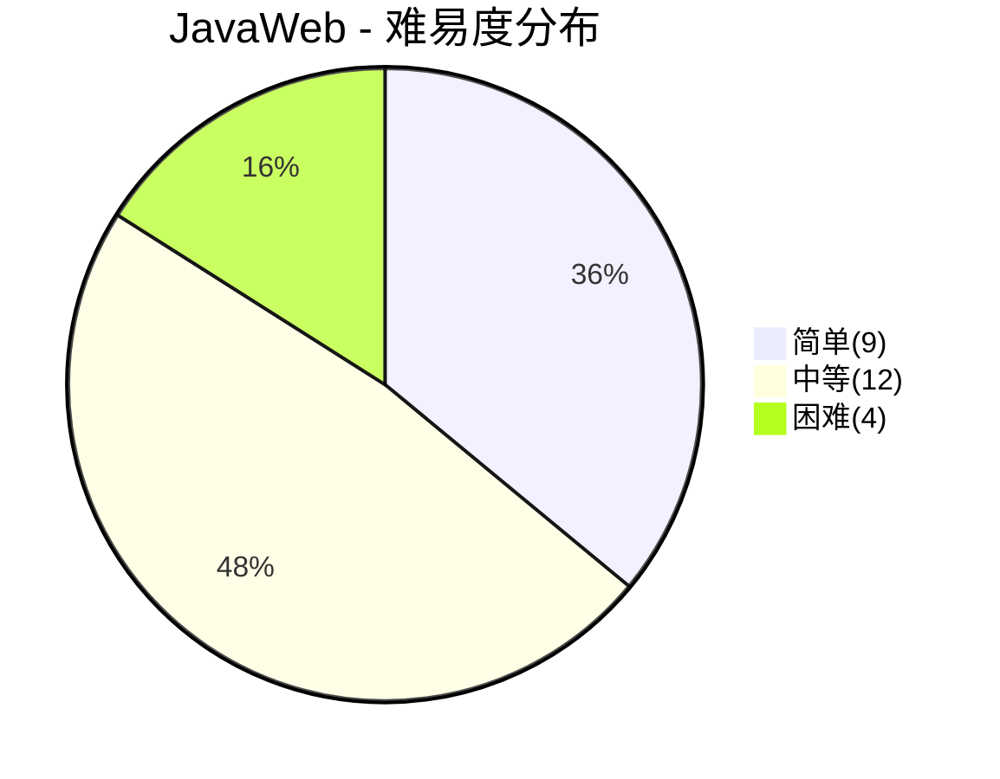
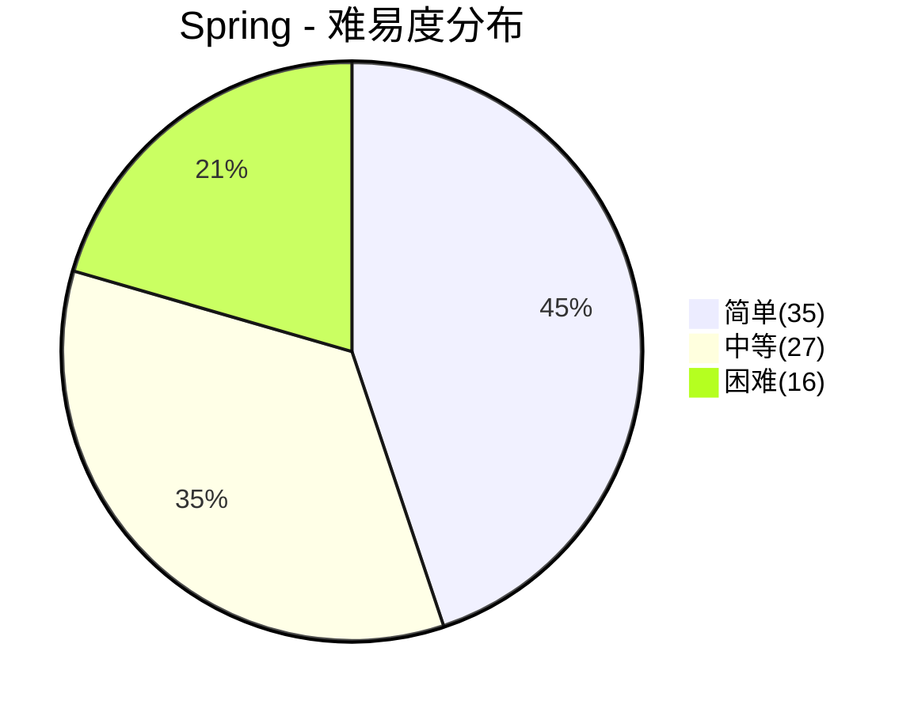
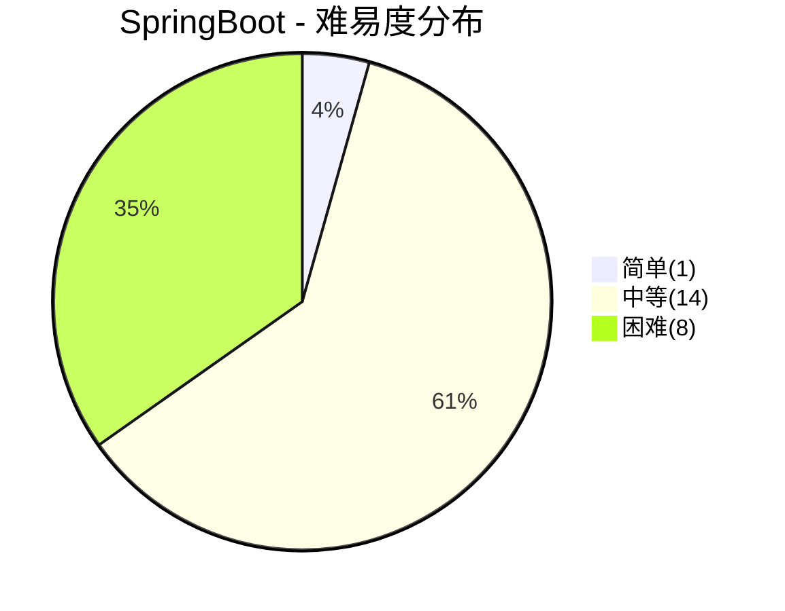
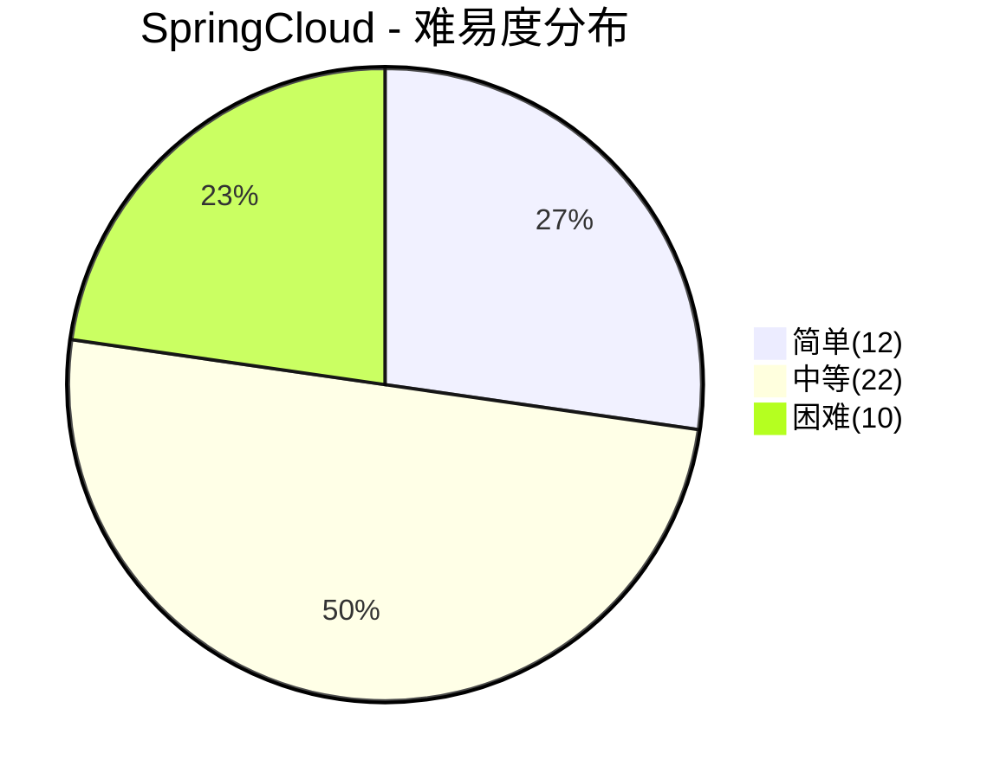
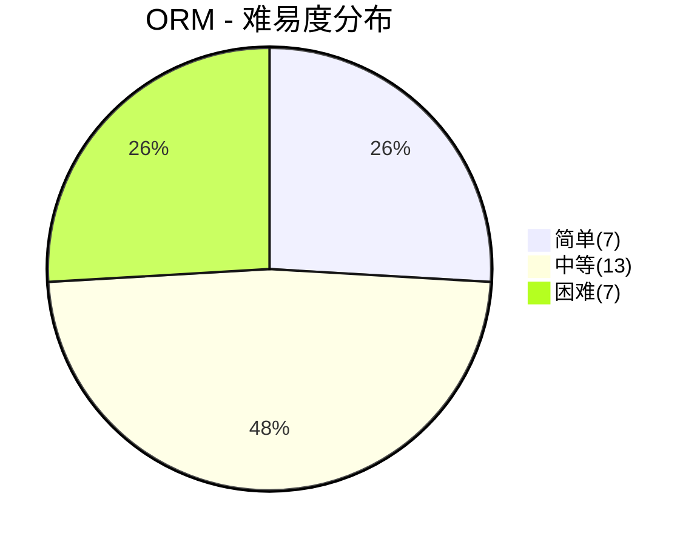
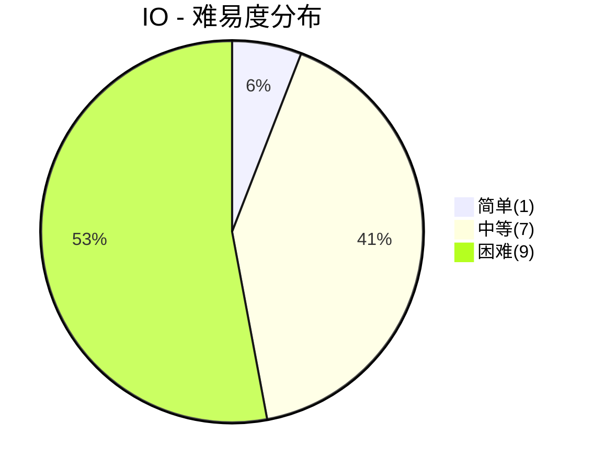

# Java框架面试

> **题库统计**：共收录 **214** 道面试题，覆盖 JavaWeb / Spring / SpringBoot / SpringCloud / MyBatis / Netty 六大板块。其中简单题 **65** 道（30.4%），中等题 **95** 道（44.4%），困难题 **54** 道（25.2%）。困难题占比近三成，Spring 核心原理、SpringCloud 分布式组件与 MyBatis 架构模块深度考察比重显著提升，适合中高级岗位系统备战。

## 📖 内容

### JavaWeb

> - [JavaWeb 面试](../01.Java/JavaWeb/[JavaWeb]面试.md)

::: note **统计**：共 **25** 题

- 难易度：| 简单 **9** 题 | 中等 **12** 题 | 困难 **4** 题 |
- 重要度：| 一星 **5** 题 | 二星 **8** 题 | 三星 **7** 题 | 四星 **5** 题 |

:::

```mermaid
pie title JavaWeb - 难易度分布
    "简单(9)" : 9
    "中等(12)" : 12
    "困难(4)" : 4
```

| 分类      | 题目                                              | 难易度 | 重要度   | 掌握度 | 评估 |
| :-------- | :------------------------------------------------ | :----- | :------- | :----: | ---- |
| Web       | 用户在浏览器中输入 URL 后发生了什么？             | 简单   | ⭐⭐⭐   |   ⚠️   |      |
| Web       | GET 请求和 POST 请求的区别？                      | 简单   | ⭐⭐     |        |      |
| Web       | HTTP 常见状态码有哪些？                           | 简单   | ⭐⭐     |        |      |
| Web       | HTTP 缓存机制是如何工作的？                       | 中等   | ⭐⭐⭐   |   ❌   |      |
| Web       | 什么是 RESTful API？设计原则？                    | 中等   | ⭐⭐     |        |      |
| Servlet   | 什么是 Servlet？                                  | 简单   | ⭐⭐     |        |      |
| Servlet   | 简述 Servlet 生命周期                             | 中等   | ⭐⭐     |   ⚠️   |      |
| Servlet   | 转发(forward)和重定向(redirect)有什么区别？       | 中等   | ⭐⭐     |   ❌   |      |
| Servlet   | Servlet 中如何获取用户提交的查询参数或表单数据？  | 简单   | ⭐       |        |      |
| Servlet   | Request 和 Response 的常用方法？                  | 简单   | ⭐       |        |      |
| Servlet   | Servlet 和 JSP 的区别？                           | 简单   | ⭐       |        |      |
| Servlet   | JSP 的内置对象和作用域？                          | 简单   | ⭐       |        |      |
| Servlet   | JSP 中动态 INCLUDE 和静态 INCLUDE 的区别？        | 简单   | ⭐       |        |      |
| Servlet   | 过滤器(Filter)、拦截器(Interceptor)、AOP 的区别？ | 困难   | ⭐⭐⭐⭐ |   ⚠️   |      |
| Web 会话  | Cookie 和 Session 的区别是什么？                  | 中等   | ⭐⭐⭐   |   ⚠️   |      |
| Web 会话  | 如果禁用了 Cookie 怎么办？                        | 中等   | ⭐⭐     |        |      |
| Web 会话  | 分布式 Session 有哪些实现方案？                   | 困难   | ⭐⭐⭐⭐ |        |      |
| Web 会话  | 什么是 JWT？JWT 的原理和结构是什么？              | 中等   | ⭐⭐⭐   |   ✅   |      |
| Web 会话  | JWT Token 如何续签？如何解决无法主动失效的问题？  | 困难   | ⭐⭐⭐⭐ |        |      |
| Web 会话  | JWT 如何实现刷新与主动失效？                      | 中等   | ⭐⭐⭐⭐ |   ⚠️   |      |
| Web 会话  | Cookie / Session / Token / JWT 如何选型？         | 困难   | ⭐⭐⭐⭐ |   ⚠️   |      |
| Web 安全  | 什么是 XSS 攻击？如何防御？                       | 中等   | ⭐⭐⭐   |   ❌   |      |
| Web 安全  | 什么是 CSRF 攻击？如何防御？                      | 中等   | ⭐⭐⭐   |   ❌   |      |
| Web 安全  | 什么是 CORS 跨域？如何解决？                      | 中等   | ⭐⭐⭐   |   ⚠️   |      |
| WebSocket | 什么是 WebSocket？与 HTTP 的区别？                | 中等   | ⭐⭐     |        |      |

### Spring

> - [Spring 面试](../01.Java/框架/Spring/Spring面试.md)

::: note **统计**：共 **78** 题

- 难易度：| 简单 **35** 题 | 中等 **27** 题 | 困难 **16** 题 |
- 重要度：| 一星 **4** 题 | 二星 **51** 题 | 三星 **11** 题 | 四星 **7** 题 | 五星 **5** 题 |

:::

```mermaid
pie title Spring - 难易度分布
    "简单(35)" : 35
    "中等(27)" : 27
    "困难(16)" : 16
```

| 分类       | 题目                                                          | 难易度 | 重要度     | 掌握度 | 评估 |
| :--------- | :------------------------------------------------------------ | :----- | :--------- | :----: | ---- |
| Spring概述 | 什么是 Spring？                                               | 简单   | ⭐⭐       |        |      |
| Spring概述 | Spring 有哪些优点？                                           | 简单   | ⭐⭐       |        |      |
| Spring概述 | Spring 有哪些模块？                                           | 简单   | ⭐         |        |      |
| Spring概述 | Spring 有哪些里程碑版本？                                     | 简单   | ⭐         |        |      |
| Spring概述 | Spring 和 Spring MVC 之间是什么关系？                         | 简单   | ⭐⭐       |   ⚠️   |      |
| Spring概述 | Spring、SpringBoot、SpringCloud 之间是什么关系？              | 简单   | ⭐⭐       |        |      |
| Spring概述 | Spring 中用到了哪些设计模式？                                 | 困难   | ⭐⭐⭐     |   ⚠️   |      |
| Bean管理   | Spring 通知有哪些类型？                                       | 中等   | ⭐⭐       |        |      |
| Bean管理   | 什么是 Spring Bean？                                          | 简单   | ⭐⭐       |        |      |
| Bean管理   | Spring Bean 注册有几种方式？                                  | 简单   | ⭐         |        |      |
| Bean管理   | Spring Bean 支持哪些作用域？                                  | 简单   | ⭐⭐       |        |      |
| Bean管理   | Spring Bean 的生命周期是怎样的？                              | 困难   | ⭐⭐⭐⭐⭐ |   ❌   |      |
| Bean管理   | Spring 的单例 Bean 是否有并发安全问题？                       | 中等   | ⭐⭐       |        |      |
| IoC容器    | Spring 是如何启动的？                                         | 困难   | ⭐⭐⭐     |   ❌   |      |
| IoC容器    | 什么是自动装配？                                              | 中等   | ⭐⭐       |        |      |
| IoC容器    | 什么是 IoC？什么是依赖注入？什么是 Spring IoC？               | 简单   | ⭐⭐⭐⭐   |   ⚠️   |      |
| IoC容器    | Spring IOC 容器如何初始化？                                   | 中等   | ⭐⭐       |        |      |
| IoC容器    | Spring 中的 ObjectFactory 是什么？                            | 困难   | ⭐⭐       |        |      |
| IoC容器    | BeanFactory 和 ApplicationContext 有什么区别？                | 简单   | ⭐⭐⭐     |   ⚠️   |      |
| IoC容器    | BeanFactory 和 FactoryBean 有什么区别？                       | 简单   | ⭐⭐       |        |      |
| IoC容器    | @Autowired、@Resource、@Inject 有什么区别？                   | 中等   | ⭐⭐       |   ⚠️   |      |
| IoC容器    | @Configuration 和 @Component 有什么区别？                     | 困难   | ⭐⭐       |        |      |
| IoC容器    | Spring 如何解决循环依赖？                                     | 困难   | ⭐⭐⭐⭐⭐ |   ⚠️   |      |
| IoC容器    | Spring 解决循环依赖为什么一定要用三级缓存？                   | 困难   | ⭐⭐⭐⭐⭐ |   ❌   |      |
| AOP        | 什么是 AOP？                                                  | 简单   | ⭐⭐⭐     |   ⚠️   |      |
| AOP        | Spring AOP 有哪些实现方式？                                   | 困难   | ⭐⭐⭐⭐   |   ⚠️   |      |
| AOP        | Spring AOP 和 AspectJ 有什么区别？                            | 中等   | ⭐⭐⭐     |   ⚠️   |      |
| AOP        | Spring AOP 在哪些场景下会失效？                               | 中等   | ⭐⭐⭐⭐   |   ⚠️   |      |
| AOP        | Spring 拦截链如何实现？                                       | 困难   | ⭐⭐⭐     |        |      |
| 事件与扩展 | Spring 事件机制是什么？                                       | 困难   | ⭐⭐⭐     |   ❌   |      |
| 事件与扩展 | Spring 有哪些核心扩展点？                                     | 困难   | ⭐⭐⭐⭐   |   ❌   |      |
| 事件与扩展 | BeanFactoryPostProcessor 和 BeanPostProcessor 有什么区别？    | 中等   | ⭐⭐⭐     |   ❌   |      |
| 事件与扩展 | InitializingBean 和 init-method 有什么区别？                  | 中等   | ⭐⭐       |        |      |
| 事件与扩展 | Spring DAO 有哪些异常？                                       | 中等   | ⭐⭐       |        |      |
| 事务管理   | 什么是 Spring 的事务管理？                                    | 中等   | ⭐⭐       |        |      |
| 事务管理   | Spring 事务支持哪些隔离级别？                                 | 中等   | ⭐         |        |      |
| 事务管理   | Spring 事务支持哪些传播行为？                                 | 困难   | ⭐⭐⭐⭐⭐ |   ❌   |      |
| 事务管理   | Spring 事务在什么情况下会失效？                               | 困难   | ⭐⭐⭐⭐⭐ |   ❌   |      |
| 事务管理   | @Transactional 的实现原理是什么？                             | 困难   | ⭐⭐⭐⭐   |   ❌   |      |
| 事务管理   | 声明式事务和编程式事务有什么区别？                            | 中等   | ⭐⭐       |        |      |
| 事务管理   | Spring 中的 JPA 和 Hibernate 有什么区别？                     | 中等   | ⭐⭐       |        |      |
| Spring MVC | 说下对 Spring MVC 的理解？                                    | 中等   | ⭐⭐       |        |      |
| Spring MVC | Spring MVC 如何工作？                                         | 困难   | ⭐⭐⭐⭐   |   ⚠️   |      |
| Spring MVC | Spring MVC 有哪些核心组件？                                   | 中等   | ⭐⭐       |        |      |
| Spring MVC | Spring MVC 中的 Controller 是什么？                           | 中等   | ⭐⭐       |        |      |
| Spring MVC | Spring MVC 中如何处理表单提交？                               | 中等   | ⭐⭐       |        |      |
| Spring MVC | Spring MVC 中的视图解析器有什么作用？                         | 中等   | ⭐⭐       |        |      |
| Spring MVC | Spring MVC 中的拦截器是什么？如何定义一个拦截器？             | 中等   | ⭐⭐       |        |      |
| Spring MVC | Spring MVC 中的国际化是如何实现？                             | 中等   | ⭐⭐       |        |      |
| Spring MVC | Spring MVC 如何处理异常？                                     | 中等   | ⭐⭐       |        |      |
| Spring MVC | Spring MVC 父子容器是什么知道吗？                             | 困难   | ⭐⭐       |        |      |
| Spring MVC | Spring WebFlux 是什么？它与 Spring MVC 有何不同？             | 中等   | ⭐⭐⭐⭐   |        |      |
| 常用注解   | 什么是 Restful 风格的接口？                                   | 中等   | ⭐⭐⭐     |        |      |
| 常用注解   | 你用过哪些重要的 Spring 注解？                                | 简单   | ⭐⭐       |        |      |
| 常用注解   | @Bean 和@Component 有什么区别？                               | 简单   | ⭐⭐       |        |      |
| 常用注解   | @Component, @Controller, @Repository, @Service 有何区别？     | 简单   | ⭐⭐       |        |      |
| 常用注解   | @Autowired 注解有什么用？                                     | 简单   | ⭐⭐       |        |      |
| 常用注解   | @Qualifier 注解有什么作用                                     | 简单   | ⭐⭐       |        |      |
| 常用注解   | Spring 中的 @Primary 注解的作用是什么？                       | 简单   | ⭐⭐       |        |      |
| 常用注解   | Spring 中的 @Value 注解的作用是什么？                         | 简单   | ⭐⭐       |        |      |
| 常用注解   | 什么是 SpEL？在 Spring 中有哪些常见应用？                     | 中等   | ⭐⭐       |        |      |
| 常用注解   | Spring 中的 @Profile 注解的作用是什么？                       | 简单   | ⭐⭐       |        |      |
| 常用注解   | Spring 中的 @PostConstruct 和 @PreDestroy 注解的作用是什么？  | 简单   | ⭐⭐       |        |      |
| 常用注解   | Spring 中的 @RequestBody 和 @ResponseBody 注解的作用是什么？  | 简单   | ⭐⭐       |   ✅   |      |
| 常用注解   | Spring 中的 @PathVariable 注解的作用是什么？                  | 简单   | ⭐⭐       |        |      |
| 常用注解   | Spring 中的 @ModelAttribute 注解的作用是什么？                | 简单   | ⭐⭐       |        |      |
| 常用注解   | Spring 中的 @ExceptionHandler 注解的作用是什么？              | 简单   | ⭐⭐       |        |      |
| 常用注解   | Spring 中的 @ResponseStatus 注解的作用是什么？                | 简单   | ⭐⭐       |        |      |
| 常用注解   | Spring 中的 @RequestHeader 和 @CookieValue 注解的作用是什么？ | 简单   | ⭐⭐       |        |      |
| 常用注解   | Spring 中的 @SessionAttribute 注解的作用是什么？              | 简单   | ⭐⭐       |        |      |
| 常用注解   | Spring 中的 @Validated 和 @Valid 注解有什么区别？             | 简单   | ⭐⭐       |        |      |
| 常用注解   | Spring 中的 @Conditional 注解的作用是什么？                   | 简单   | ⭐⭐       |        |      |
| 常用注解   | Spring 中的 @Cacheable 和 @CacheEvict 注解的作用是什么？      | 简单   | ⭐⭐       |        |      |
| 常用注解   | Spring 中的 @Lazy 注解的作用是什么？                          | 简单   | ⭐⭐       |        |      |
| 常用注解   | Spring 中的 @PropertySource 注解的作用是什么？                | 简单   | ⭐⭐       |        |      |
| 常用注解   | Spring 中的 @Scheduled 注解的作用是什么？                     | 简单   | ⭐⭐       |        |      |
| 常用注解   | @Async 注解的原理是什么？                                     | 中等   | ⭐⭐⭐     |        |      |
| 常用注解   | @Async 什么时候会失效？如何解决？                             | 中等   | ⭐⭐⭐     |        |      |

### SpringBoot

> - [SpringBoot 面试](../01.Java/框架/Spring/SpringBoot面试.md)

::: note **统计**：共 **23** 题

- 难易度：| 简单 **1** 题 | 中等 **14** 题 | 困难 **8** 题 |
- 重要度：| 二星 **9** 题 | 三星 **3** 题 | 四星 **10** 题 | 五星 **1** 题 |

:::

```mermaid
pie title SpringBoot - 难易度分布
    "简单(1)" : 1
    "中等(14)" : 14
    "困难(8)" : 8
```

| 分类       | 题目                                                                                   | 难易度 | 重要度     | 掌握度 | 评估 |
| :--------- | :------------------------------------------------------------------------------------- | :----- | :--------- | :----: | ---- |
| 基础概念   | 什么是 SpringBoot？                                                                    | 简单   | ⭐⭐       |        |      |
| 自动配置   | SpringBoot 是如何实现自动配置的？                                                      | 中等   | ⭐⭐⭐⭐⭐ |   ❌   |      |
| 启动流程   | SpringBoot 是如何通过 main 方法启动 web 项目的？                                       | 中等   | ⭐⭐       |        |      |
| 自动配置   | SpringBoot 的启动流程是如何设计的？                                                    | 困难   | ⭐⭐⭐⭐   |   ❌   |      |
| 自动配置   | 如何自定义一个 starter 包？                                                            | 困难   | ⭐⭐⭐⭐   |   ❌   |      |
| 自动配置   | SpringBoot 有哪些条件注解？                                                            | 中等   | ⭐⭐       |        |      |
| 内嵌容器   | SpringBoot 支持哪些内嵌 Web 容器？如何切换？                                           | 中等   | ⭐⭐       |        |      |
| 内嵌容器   | SpringBoot 是如何内嵌 Tomcat 的？                                                      | 中等   | ⭐⭐       |        |      |
| 配置管理   | SpringBoot 的配置文件优先级是怎样的？                                                  | 中等   | ⭐⭐       |        |      |
| 配置管理   | @ConfigurationProperties 和 @Value 有什么区别？                                        | 中等   | ⭐⭐       |        |      |
| 运维与调优 | SpringBoot Actuator 是什么？有哪些核心端点？                                           | 中等   | ⭐⭐       |        |      |
| 运维与调优 | SpringBoot 3.x 有哪些重要新特性？                                                      | 中等   | ⭐⭐⭐     |        |      |
| 运维与调优 | SpringBoot 启动慢的原因有哪些？如何优化？                                              | 中等   | ⭐⭐⭐     |        |      |
| 运维与调优 | SpringBoot 如何解决 jar 包冲突？                                                       | 中等   | ⭐⭐       |        |      |
| 运维与调优 | SpringBoot 如何实现优雅停机？                                                          | 中等   | ⭐⭐⭐⭐   |   ❌   |      |
| 自动配置   | SpringBoot 自动配置的 SPI 扩展点有哪些？如何实现插件化？                               | 困难   | ⭐⭐⭐⭐   |        |      |
| 内嵌容器   | 内嵌 Tomcat/Undertow/Jetty 的性能差异与选型依据？                                      | 中等   | ⭐⭐⭐     |        |      |
| 运维与调优 | SpringBoot 应用的生产级健康检查与就绪探针如何设计？                                    | 中等   | ⭐⭐⭐⭐   |        |      |
| 安全与认证 | SpringBoot 3.x 如何集成 OAuth2 资源服务器？                                            | 困难   | ⭐⭐⭐⭐   |        |      |
| 架构设计   | 微服务场景下 SpringBoot 应用如何做灰度发布与路由？                                     | 困难   | ⭐⭐⭐⭐   |        |      |
| 集成测试   | SpringBoot 项目如何使用 TestContainers 实现集成测试？与 Mock 测试的取舍与最佳实践。    | 困难   | ⭐⭐⭐⭐   |        |      |
| 原生编译   | SpringBoot 3.x 如何支持 GraalVM Native Image？启动速度、内存占用与功能限制的量化评估。 | 困难   | ⭐⭐⭐⭐   |        |      |
| 响应式编程 | SpringBoot 中 WebFlux 响应式编程的适用场景与陷阱？与 Servlet 栈的性能对比与迁移策略。  | 困难   | ⭐⭐⭐⭐   |        |      |

### SpringCloud

> - [SpringCloud 面试](../01.Java/框架/Spring/SpringCloud面试.md)

::: note **统计**：共 **44** 题

- 难易度：| 简单 **12** 题 | 中等 **22** 题 | 困难 **10** 题 |
- 重要度：| 二星 **18** 题 | 三星 **18** 题 | 四星 **8** 题 |

:::

```mermaid
pie title SpringCloud - 难易度分布
    "简单(12)" : 12
    "中等(22)" : 22
    "困难(10)" : 10
```

| 分类       | 题目                                            | 难易度 | 重要度   | 掌握度 | 评估 |
| :--------- | :---------------------------------------------- | :----- | :------- | :----: | ---- |
| 概述       | Spring Cloud 有哪些核心组件？                   | 中等   | ⭐⭐     |        |      |
| 概述       | Spring Cloud 的优缺点有哪些？                   | 中等   | ⭐⭐⭐   |        |      |
| 概述       | Spring Boot 和 Spring Cloud 之间的区别？        | 中等   | ⭐⭐     |        |      |
| Seata      | 什么是 Seata？                                  | 简单   | ⭐⭐     |        |      |
| Seata      | Seata 支持哪些模式的分布式事务？                | 中等   | ⭐⭐⭐   |        |      |
| Seata      | 了解 Seata 的实现原理吗？                       | 困难   | ⭐⭐⭐⭐ |        |      |
| Seata      | Seata 的事务回滚是怎么实现的？                  | 中等   | ⭐⭐⭐   |        |      |
| 注册中心   | Spring Cloud 有哪些注册中心？                   | 简单   | ⭐⭐⭐   |        |      |
| 注册中心   | 什么是 Eureka？                                 | 简单   | ⭐⭐     |        |      |
| 注册中心   | Eureka 的实现原理说一下？                       | 中等   | ⭐⭐⭐   |        |      |
| 注册中心   | Spring Cloud 如何实现服务注册？                 | 中等   | ⭐⭐⭐   |        |      |
| 注册中心   | Consul 是什么？                                 | 简单   | ⭐⭐     |        |      |
| 注册中心   | Nacos 中的 Namespace 是什么？                   | 简单   | ⭐⭐     |        |      |
| 熔断限流   | 什么是 Hystrix？                                | 简单   | ⭐⭐     |        |      |
| 熔断限流   | Sentinel 是怎么实现限流的？                     | 困难   | ⭐⭐⭐⭐ |        |      |
| 熔断限流   | Sentinel 是怎么实现集群限流的？                 | 困难   | ⭐⭐⭐   |        |      |
| 熔断限流   | Sentinel 是如何实现熔断降级的？                 | 困难   | ⭐⭐⭐⭐ |   ❌   |      |
| 熔断限流   | Sentinel 与 Hystrix 的区别是什么？              | 中等   | ⭐⭐⭐   |        |      |
| 熔断限流   | 什么是服务雪崩？如何做全链路防护？              | 困难   | ⭐⭐⭐⭐ |   ❌   |      |
| 网关       | Spring Cloud 可以选择哪些 API 网关？            | 简单   | ⭐⭐⭐   |        |      |
| 网关       | 什么是 Spring Cloud Gateway？                   | 简单   | ⭐⭐⭐   |        |      |
| 网关       | 你项目里为什么选择 Gateway 作为网关？           | 中等   | ⭐⭐⭐   |        |      |
| 网关       | Dubbo 和 Spring Cloud Gateway 有什么区别？      | 中等   | ⭐⭐     |        |      |
| 网关       | 什么是 Spring Cloud Zuul？                      | 简单   | ⭐⭐     |        |      |
| 配置中心   | 你知道 Nacos 配置中心的实现原理吗？             | 困难   | ⭐⭐⭐⭐ |   ❌   |      |
| 配置中心   | Spring Cloud Config 是什么？                    | 简单   | ⭐⭐     |        |      |
| 链路追踪   | Spring Cloud 支持哪些链路追踪方案？             | 中等   | ⭐⭐     |        |      |
| Feign      | 什么是 Feign？                                  | 简单   | ⭐⭐⭐   |        |      |
| Feign      | Feign 是如何实现负载均衡的？                    | 中等   | ⭐⭐     |        |      |
| Feign      | 为什么 Feign 第一次调用耗时很长？               | 中等   | ⭐⭐⭐   |        |      |
| Feign      | Feign 和 OpenFeign 有什么区别？                 | 中等   | ⭐⭐     |        |      |
| Feign      | Feign 和 Dubbo 有什么区别？                     | 简单   | ⭐⭐     |        |      |
| 微服务架构 | 单体架构和微服务架构有什么区别？                | 中等   | ⭐⭐⭐   |        |      |
| 微服务架构 | 微服务如何拆分？                                | 中等   | ⭐⭐⭐⭐ |        |      |
| 微服务架构 | SpringCloud 和 SpringCloud Alibaba 有什么区别？ | 中等   | ⭐⭐⭐   |        |      |
| 注册中心   | Eureka 的自我保护机制是什么？                   | 困难   | ⭐⭐     |        |      |
| 注册中心   | Nacos 的 AP 和 CP 模式如何切换？                | 中等   | ⭐⭐⭐   |        |      |
| Feign      | OpenFeign 的工作原理是什么？                    | 困难   | ⭐⭐⭐⭐ |        |      |
| Feign      | OpenFeign 如何配置超时和重试？                  | 中等   | ⭐⭐⭐   |        |      |
| 链路追踪   | Spring Cloud Gateway 的工作原理是什么？         | 困难   | ⭐⭐⭐⭐ |        |      |
| 链路追踪   | Gateway 如何实现动态路由？                      | 困难   | ⭐⭐⭐   |        |      |
| 链路追踪   | Gateway 过滤器链的执行顺序是怎样的？            | 中等   | ⭐⭐     |        |      |
| 链路追踪   | Sleuth + Zipkin 的工作原理是什么？              | 中等   | ⭐⭐     |        |      |
| 链路追踪   | SkyWalking 和 Zipkin 有什么区别？               | 中等   | ⭐⭐     |        |      |

### MyBatis

> - [MyBatis 面试](../01.Java/框架/ORM/MyBatis面试.md)

::: note **统计**：共 **27** 题

- 难易度：| 简单 **7** 题 | 中等 **13** 题 | 困难 **7** 题 |
- 重要度：| 一星 **6** 题 | 二星 **10** 题 | 三星 **8** 题 | 四星 **3** 题 |

:::

```mermaid
pie title ORM - 难易度分布
    "简单(7)" : 7
    "中等(13)" : 13
    "困难(7)" : 7
```

| 分类       | 题目                                                        | 难易度 | 重要度   | 掌握度 | 评估 |
| :--------- | :---------------------------------------------------------- | :----- | :------- | :----: | ---- |
| 基础       | MyBatis 有什么优缺点？                                      | 简单   | ⭐⭐     |        |      |
| 基础       | MyBatis 和 Hibernate 有什么差异？                           | 简单   | ⭐⭐     |        |      |
| 基础       | 什么是 MyBatis Plus？MyBatis Plus 对 MyBatis 做了哪些增强？ | 简单   | ⭐⭐     |        |      |
| 基础       | MyBatis、MyBatis-Plus 和 JPA 如何选型？                     | 中等   | ⭐⭐     |        |      |
| SQL映射    | MyBatis 中 `#{}` 和 `${}` 的区别是什么？                    | 简单   | ⭐⭐⭐   |   ⚠️   |      |
| SQL映射    | MyBatis 如何实现一对一、一对多的关联查询？                  | 简单   | ⭐       |        |      |
| SQL映射    | 使用 MyBatis 的 mapper 接口调用时有哪些要求？               | 简单   | ⭐       |        |      |
| 基础       | JDBC 编程有哪些不足之处，MyBatis 是如何解决的？             | 中等   | ⭐       |        |      |
| 执行与组件 | MyBatis 都有哪些 Executor 执行器？它们之间的区别是什么？    | 中等   | ⭐⭐     |        |      |
| 执行与组件 | MyBatis 如何实现数据库类型和 Java 类型的转换的？            | 中等   | ⭐⭐     |        |      |
| 执行与组件 | 为什么需要设置 `rewriteBatchedStatements=true`？            | 困难   | ⭐⭐⭐   |        |      |
| 高级特性   | MyBatis 如何实现分页？PageHelper 的原理是什么？             | 中等   | ⭐⭐⭐   |        |      |
| 架构与流程 | MyBatis 接口绑定的两种方式是什么？                          | 中等   | ⭐       |        |      |
| 架构与流程 | MyBatis 自带的连接池有了解过吗？                            | 简单   | ⭐       |        |      |
| 架构与流程 | MyBatis 有哪些核心组件？                                    | 中等   | ⭐⭐⭐   |   ❌   |      |
| 架构与流程 | MyBatis 的四大核心处理器是什么？                            | 中等   | ⭐⭐     |        |      |
| 架构与流程 | MyBatis 的执行流程是怎样的？                                | 困难   | ⭐⭐⭐   |   ❌   |      |
| 架构与流程 | MyBatis 的架构是如何设计的？                                | 困难   | ⭐⭐     |        |      |
| 高级特性   | MyBatis Mapper 接口与 XML 映射文件的绑定原理是什么？        | 中等   | ⭐⭐     |        |      |
| 高级特性   | MyBatis 动态 sql 有什么用？执行原理？有哪些动态 sql？       | 困难   | ⭐⭐⭐   |        |      |
| 高级特性   | MyBatis 延迟加载机制原理是什么？                            | 中等   | ⭐⭐     |        |      |
| 高级特性   | MyBatis 的缓存机制是如何设计的？                            | 困难   | ⭐⭐⭐⭐ |   ❌   |      |
| 高级特性   | MyBatis 一级缓存和二级缓存的区别是什么？                    | 中等   | ⭐⭐⭐   |   ❌   |      |
| 高级特性   | MyBatis 的插件机制是如何设计的？                            | 困难   | ⭐⭐⭐   |        |      |
| 高级特性   | MyBatis-Spring 的工作原理是什么？                           | 困难   | ⭐⭐⭐⭐ |        |      |
| 高级特性   | `@MapperScan` 和 `@Mapper` 注解的区别是什么？               | 中等   | ⭐       |        |      |
| 高级特性   | MyBatis 批量插入如何优化？                                  | 中等   | ⭐⭐⭐⭐ |   ❌   |      |

### Netty

> - [Netty 面试](../01.Java/框架/IO/Netty面试.md)

::: note **统计**：共 **17** 题

- 难易度：| 简单 **1** 题 | 中等 **7** 题 | 困难 **9** 题 |
- 重要度：| 二星 **3** 题 | 三星 **7** 题 | 四星 **6** 题 | 五星 **1** 题 |

:::

```mermaid
pie title IO - 难易度分布
    "简单(1)" : 1
    "中等(7)" : 7
    "困难(9)" : 9
```

| 分类       | 题目                                                       | 难易度 | 重要度     | 掌握度 | 评估 |
| :--------- | :--------------------------------------------------------- | :----- | :--------- | :----: | ---- |
| Netty 简介 | 什么是 Netty？                                             | 简单   | ⭐⭐       |        |      |
| Netty 简介 | Netty 有哪些应用场景？                                     | 中等   | ⭐⭐       |        |      |
| Netty 简介 | 为什么选择 Netty 替代 NIO？                                | 中等   | ⭐⭐⭐     |        |      |
| Netty 组件 | Netty 的核心组件有哪些？                                   | 中等   | ⭐⭐⭐     |   ⚠️   |      |
| Netty 组件 | 什么是 Reactor 线程模型？Netty 支持哪种？                  | 困难   | ⭐⭐⭐⭐⭐ |   ❌   |      |
| Netty 组件 | ByteBuf 与 NIO ByteBuffer 有什么区别？                     | 中等   | ⭐⭐⭐     |        |      |
| Netty 组件 | ByteBuf 的引用计数与内存泄漏检测机制是什么？               | 困难   | ⭐⭐⭐⭐   |        |      |
| Netty 架构 | Netty 性能为什么高？                                       | 困难   | ⭐⭐⭐     |        |      |
| Netty 架构 | Netty 的零拷贝机制是如何设计的？                           | 困难   | ⭐⭐⭐⭐   |   ⚠️   |      |
| Netty 架构 | Netty 如何解决 NIO 中的空轮询 Bug？                        | 困难   | ⭐⭐⭐     |        |      |
| Netty 架构 | Netty 是如何解决粘包和拆包问题的？                         | 困难   | ⭐⭐⭐⭐   |   ❌   |      |
| Netty 架构 | Netty 的心跳机制是如何实现的？                             | 中等   | ⭐⭐⭐     |   ❌   |      |
| Netty 架构 | Netty 采用了哪些设计模式？                                 | 中等   | ⭐⭐       |        |      |
| Netty FAQ  | Netty 常见的高频问题有哪些？如何解决？                     | 中等   | ⭐⭐⭐     |   ❌   |      |
| Netty 组件 | Netty 的 EventLoop 是如何工作的？                          | 困难   | ⭐⭐⭐⭐   |   ❌   |      |
| Netty 组件 | ByteBuf 的内存池化原理是什么？                             | 困难   | ⭐⭐⭐⭐   |   ❌   |      |
| Netty 架构 | Netty 的写高水位与背压机制（WriteBufferWaterMark）是什么？ | 困难   | ⭐⭐⭐⭐   |        |      |

### 跨域关联

- [Java 并发编程](JavaCore面试.md#java-并发)
- [Java 虚拟机](JavaCore面试.md#java-虚拟机)
- [MySQL 事务与锁](数据库面试.md#mysql)
- [Redis 数据结构与应用](数据库面试.md#redis)
- [分布式治理与容错](分布式面试.md#分布式治理)
