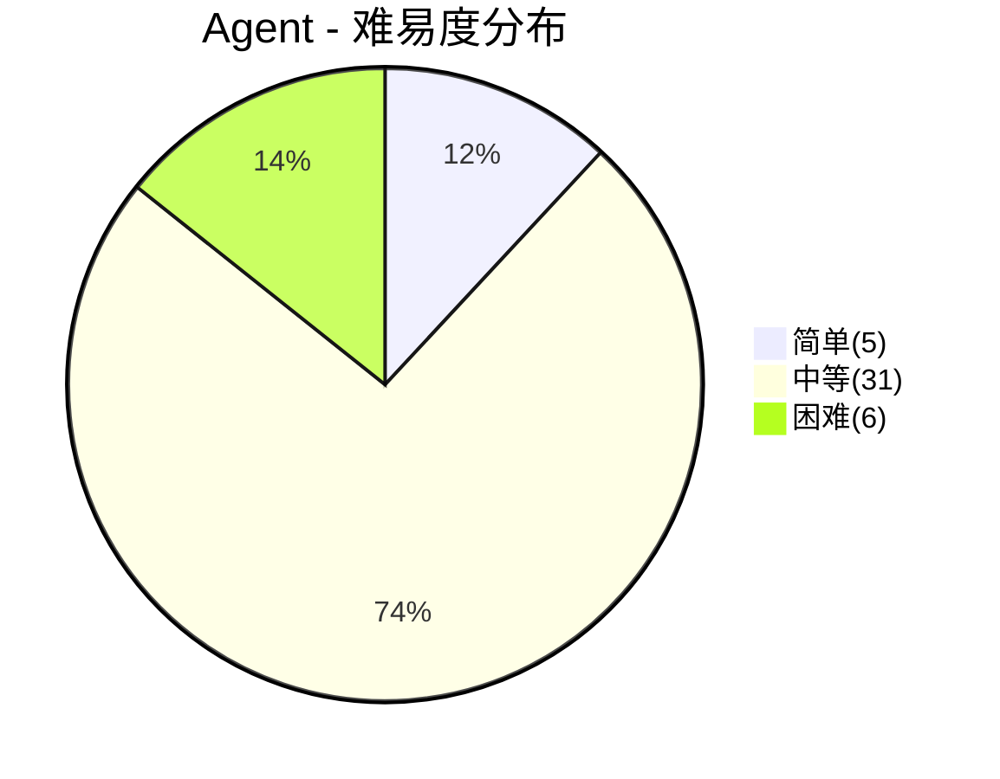
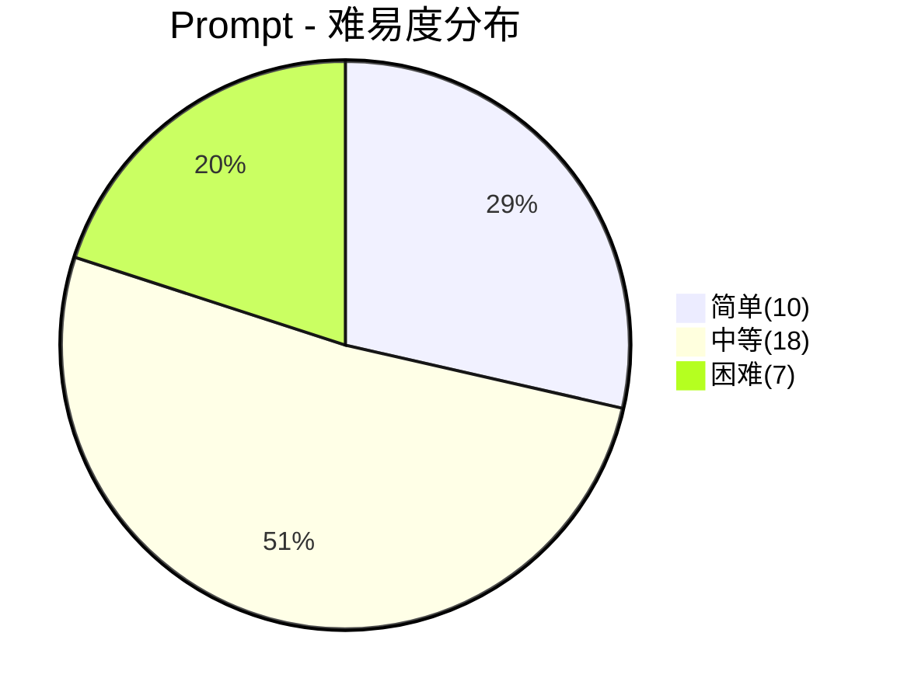
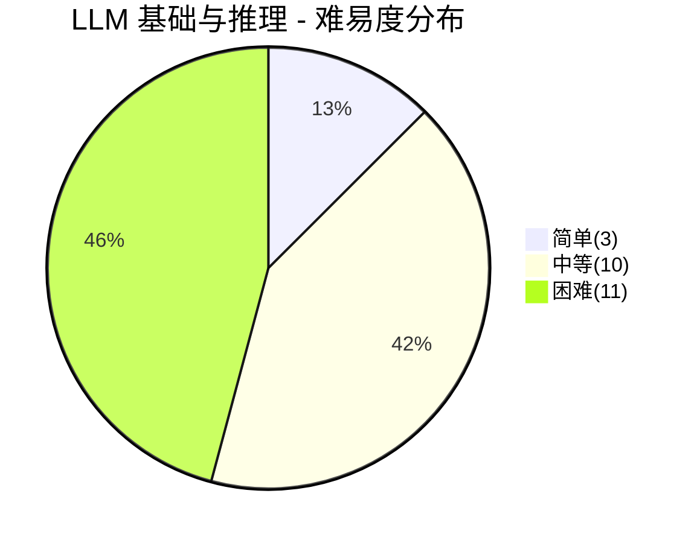
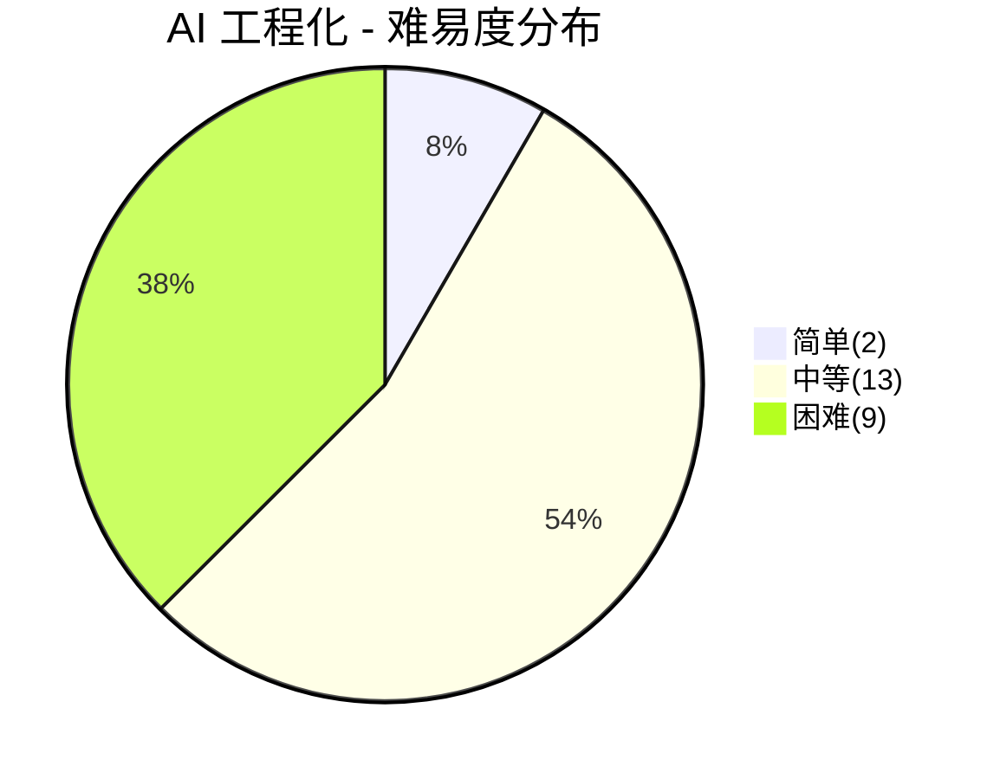

# 人工智能面试

> **题库统计**：共收录 **125** 道面试题，覆盖 Agent / Prompt / LLM 基础与推理 / AI 工程化 四大板块。其中简单题 **20** 道（16.0%），中等题 **72** 道（57.6%），困难题 **33** 道（26.4%）。整体以中等难度为主，困难题集中在 RAG 评估、Agent 规划、LLM 推理优化与 AI 工程化架构设计，适合中高级岗位深度考察。

## 📖 内容

### Agent

> - [Agent 面试](../17.人工智能/Agent面试.md)

::: note **统计**：共 **42** 题

- 难易度：| 简单 **5** 题 | 中等 **31** 题 | 困难 **6** 题 |
- 重要度：| 二星 **10** 题 | 三星 **15** 题 | 四星 **14** 题 | 五星 **3** 题 |

:::

| 分类       | 题目                                                                        | 难易度 | 重要度     | 掌握度 | 评估 |
| :--------- | :-------------------------------------------------------------------------- | :----- | :--------- | :----: | ---- |
| 基础概念   | 什么是 AI Agent？它和直接调用大模型 API 有什么区别？                        | 简单   | ⭐⭐⭐⭐⭐ |        |      |
| 基础概念   | AI Agent 的核心架构有哪些组成部分？                                         | 中等   | ⭐⭐⭐⭐   |        |      |
| 基础概念   | 市面上有哪些主流的 LLM Agent 框架？各自的特点是什么？                       | 中等   | ⭐⭐⭐⭐   |        |      |
| RAG        | 什么是 RAG（检索增强生成）？它在 Agent 中扮演什么角色？                     | 中等   | ⭐⭐⭐⭐⭐ |        |      |
| RAG        | RAG 的分块策略（Chunking）有哪些？如何选择合适的分块方式？                  | 中等   | ⭐⭐⭐⭐   |        |      |
| RAG        | RAG 中的混合检索（Hybrid Search）和重排序（Rerank）是什么？为什么需要它们？ | 中等   | ⭐⭐⭐⭐   |        |      |
| RAG        | RAG 系统如何评估？有哪些核心指标？                                          | 困难   | ⭐⭐⭐⭐   |        |      |
| RAG        | 什么是 GraphRAG？它和传统向量 RAG 有什么区别？                              | 中等   | ⭐⭐⭐     |        |      |
| 基础概念   | 什么是 LLM 的幻觉问题？Agent 如何缓解幻觉？                                 | 简单   | ⭐⭐⭐⭐   |        |      |
| 上下文管理 | AI Agent 的记忆机制有哪些类型？如何实现长短期记忆？                         | 困难   | ⭐⭐⭐⭐   |        |      |
| 工具调用   | 什么是 AI Agent 中的工具调用（Tool Calling）？它的基本流程是怎样的？        | 中等   | ⭐⭐⭐⭐   |        |      |
| 任务规划   | Agent 的任务规划有哪些常见策略？Plan-and-Solve 和 ReAct 各自适合什么场景？  | 困难   | ⭐⭐⭐⭐⭐ |        |      |
| Agent Loop | 什么是 Reflexion？它和 ReAct 有什么区别？                                   | 中等   | ⭐⭐       |        |      |
| Agent Loop | AutoGPT 如何实现自主决策？                                                  | 简单   | ⭐⭐       |        |      |
| 基础概念   | LLM Agent 在多模态任务中如何执行推理？                                      | 中等   | ⭐⭐       |        |      |
| 上下文管理 | 什么是 Agent 的上下文窗口？为什么它是 Agent 工程中最核心的约束？            | 中等   | ⭐⭐⭐⭐   |        |      |
| 上下文管理 | 当对话历史超出上下文窗口时，有哪些上下文压缩策略？                          | 中等   | ⭐⭐⭐     |        |      |
| 工具调用   | AI Agent 如何处理工具调用返回超大结果的问题？                               | 中等   | ⭐⭐       |        |      |
| 工程化     | 什么是 Agent 的 Guardrails（护栏）？如何设计安全边界？                      | 中等   | ⭐⭐⭐     |        |      |
| MCP        | MCP 协议是什么？它在 AI Agent 系统中解决了什么问题？                        | 中等   | ⭐⭐⭐⭐   |        |      |
| MCP        | MCP 协议的架构包含哪些核心组件？                                            | 中等   | ⭐⭐⭐     |        |      |
| MCP        | MCP 的工作流程是什么？                                                      | 简单   | ⭐⭐       |        |      |
| MCP        | MCP 协议安全性设计包含哪些层面？                                            | 中等   | ⭐⭐       |        |      |
| MCP        | 如何将已有的应用转换成 MCP 服务？                                           | 中等   | ⭐⭐⭐     |        |      |
| A2A        | 什么是 A2A 协议？它和 MCP 协议有什么区别？                                  | 中等   | ⭐⭐⭐⭐   |        |      |
| A2A        | A2A 协议中的 Agent Card 是什么？                                            | 中等   | ⭐⭐⭐     |        |      |
| A2A        | A2A 协议的核心架构及主要组件有哪些？                                        | 中等   | ⭐⭐⭐     |        |      |
| A2A        | A2A 协议有哪五大设计原则？                                                  | 简单   | ⭐⭐       |        |      |
| A2A        | A2A 协议的工作流程是怎样的？                                                | 中等   | ⭐⭐       |        |      |
| A2A        | A2A 协议与 MCP 协议如何协同工作？                                           | 中等   | ⭐⭐⭐     |        |      |
| Agent Loop | 什么是 Agent Loop（智能体循环）？Agent 的工作过程是怎样的？                 | 中等   | ⭐⭐⭐     |        |      |
| Agent Loop | Agent 系统中如何设计终止条件？如何解决死循环问题？                          | 中等   | ⭐⭐⭐     |        |      |
| 多Agent    | 多 Agent 协作有哪些常见的编排模式？                                         | 中等   | ⭐⭐⭐     |        |      |
| 多Agent    | 子 Agent（Subagent）模式有什么优势和挑战？                                  | 中等   | ⭐⭐       |        |      |
| 工具调用   | Agent 系统中的 Function Calling 和 MCP 有什么区别？                         | 中等   | ⭐⭐⭐     |        |      |
| 工具调用   | 如何设计 AI Agent 的工具权限控制？                                          | 困难   | ⭐⭐⭐     |        |      |
| 工程化     | 如何评估 Agent 系统的效果？有哪些评估指标和框架？                           | 困难   | ⭐⭐⭐⭐   |        |      |
| 工程化     | Agent 系统上线后面临哪些工程化挑战？                                        | 中等   | ⭐⭐⭐⭐   |        |      |
| 工程化     | Agent 系统的可观测性如何建设？如何调试 Agent 的异常行为？                   | 困难   | ⭐⭐⭐⭐   |        |      |
| 工程化     | 如何控制 Agent 的运行成本？有哪些 Token 优化手段？                          | 中等   | ⭐⭐⭐     |        |      |
| 工程化     | Agent 执行代码等高风险操作时，沙箱（Sandbox）安全如何设计？                 | 中等   | ⭐⭐⭐     |        |      |
| 多Agent    | 多 Agent 系统中如何管理 Agent 间的上下文传递？                              | 中等   | ⭐⭐       |        |      |

### Prompt

> - [Prompt 面试](../17.人工智能/Prompt面试.md)

::: note **统计**：共 **35** 题

- 难易度：| 简单 **10** 题 | 中等 **18** 题 | 困难 **7** 题 |
- 重要度：| 二星 **2** 题 | 三星 **18** 题 | 四星 **11** 题 | 五星 **4** 题 |

:::

| 分类          | 题目                                                                    | 难易度 | 重要度     | 掌握度 | 评估 |
| :------------ | :---------------------------------------------------------------------- | :----- | :--------- | :----: | ---- |
| 基础          | 什么是 Prompt Engineering 提示词工程？它的核心价值是什么？              | 简单   | ⭐⭐⭐⭐⭐ |        |      |
| 基础          | Token 是什么？如何计算和控制 Token 数量？                               | 简单   | ⭐⭐⭐⭐   |        |      |
| 基础          | 什么是上下文窗口 Context Window？它有什么限制？                         | 简单   | ⭐⭐⭐⭐   |        |      |
| 基础          | Prompt 提示词的基本结构包括哪些部分？                                   | 简单   | ⭐⭐⭐     |        |      |
| 基础          | 什么是角色扮演 Role Playing？如何在提示词中使用？                       | 简单   | ⭐⭐⭐     |        |      |
| 基础          | 提示词中的分隔符有什么作用？如何使用？                                  | 简单   | ⭐⭐⭐     |        |      |
| 基础          | 如何在提示词中设置约束条件和输出要求？                                  | 简单   | ⭐⭐⭐     |        |      |
| 基础          | 如何让 AI 输出指定格式的内容，比如 JSON、表格、Markdown？               | 简单   | ⭐⭐⭐⭐   |        |      |
| 基础          | 什么是系统提示词 System Prompt？它和用户提示词有什么区别？              | 简单   | ⭐⭐⭐⭐   |        |      |
| Few-shot与CoT | 什么是 Few-shot Learning？Zero-shot、One-shot、Few-shot 有什么区别？    | 中等   | ⭐⭐⭐⭐⭐ |        |      |
| Few-shot与CoT | 如何选择和设计 Few-shot 示例以提升效果？                                | 中等   | ⭐⭐⭐     |        |      |
| Few-shot与CoT | 什么是 CoT 思维链？如何利用它提升 AI 的推理能力？                       | 中等   | ⭐⭐⭐⭐⭐ |        |      |
| 高级技术      | 什么是自洽性 Self-Consistency？如何应用？                               | 中等   | ⭐⭐⭐     |        |      |
| 调优          | 如何设计提示词来减少 AI 的幻觉问题？                                    | 中等   | ⭐⭐⭐⭐   |        |      |
| 调优          | temperature 和 top_p 参数有什么作用？如何选择合适的值？                 | 中等   | ⭐⭐⭐⭐⭐ |        |      |
| 调优          | 什么是负面提示词 Negative Prompt？在什么场景下使用？                    | 中等   | ⭐⭐⭐     |        |      |
| 调优          | 什么是提示词链接 Prompt Chaining？如何实现？                            | 中等   | ⭐⭐⭐     |        |      |
| 调优          | 如何为不同领域设计专用提示词？比如编程、创作、数据分析                  | 中等   | ⭐⭐       |        |      |
| 调优          | 什么是结构化输出 Structured Output？如何确保 LLM 输出符合 JSON Schema？ | 中等   | ⭐⭐⭐⭐   |        |      |
| 评估与安全    | 什么是 Guardrails 护栏？如何在 Prompt 层实现安全防护？                  | 中等   | ⭐⭐⭐     |        |      |
| 调优          | 有哪些设计和优化 Prompt 的通用技巧？                                    | 中等   | ⭐⭐⭐     |        |      |
| 调优          | 如何优化过长的提示词？提示词压缩有哪些技巧？                            | 中等   | ⭐⭐⭐     |        |      |
| 评估与安全    | 如何系统地评估和优化提示词的效果？                                      | 困难   | ⭐⭐⭐     |        |      |
| 评估与安全    | 提示词注入攻击 Prompt Injection 是什么？如何防范？                      | 困难   | ⭐⭐⭐⭐   |        |      |
| 评估与安全    | 什么是 System Prompt 的"越狱"（Jailbreak）？常见攻击手法有哪些？        | 简单   | ⭐⭐⭐⭐   |        |      |
| 评估与安全    | 在实际项目中如何进行提示词的 AB 测试和迭代？                            | 困难   | ⭐⭐⭐     |        |      |
| 评估与安全    | 生产环境中如何进行提示词的版本管理与回归测试？                          | 中等   | ⭐⭐⭐     |        |      |
| 高级技术      | 什么是上下文工程（Context Engineering）？它和提示词工程有什么区别？     | 中等   | ⭐⭐⭐⭐   |        |      |
| 高级技术      | 长对话和长文档场景下，如何管理长上下文？有哪些压缩与摘要策略？          | 困难   | ⭐⭐⭐     |        |      |
| 评估与安全    | 如何检测和缓解 LLM 应用的幻觉问题？有哪些工程化手段？                   | 困难   | ⭐⭐⭐⭐   |        |      |
| 高级技术      | 什么是思维树 Tree of Thoughts？它相比 CoT 有什么优势？                  | 中等   | ⭐⭐⭐     |        |      |
| 高级技术      | 如何结合 RAG 和 Fine-tuning 来提升提示词效果？                          | 困难   | ⭐⭐⭐⭐   |        |      |
| 高级技术      | 什么是 DSPy 框架？它如何革新提示词工程？                                | 困难   | ⭐⭐⭐     |        |      |
| 高级技术      | 什么是 Meta-prompting？如何让 LLM 自动生成和优化提示词？                | 中等   | ⭐⭐⭐     |        |      |
| 评估与安全    | 如何处理提示词优化中的常见问题？比如输出不准确、不完整、格式错误        | 中等   | ⭐⭐       |        |      |

### LLM 基础与推理

> - [LLM 基础与推理面试](../17.人工智能/LLM面试.md)

::: note **统计**：共 **24** 题

- 难易度：| 简单 **3** 题 | 中等 **10** 题 | 困难 **11** 题 |
- 重要度：| 三星 **1** 题 | 四星 **17** 题 | 五星 **6** 题 |

:::

| 分类        | 题目                                                                                 | 难易度 | 重要度     | 掌握度 | 评估 |
| :---------- | :----------------------------------------------------------------------------------- | :----- | :--------- | :----: | ---- |
| Transformer | Transformer 架构的核心组件有哪些？Self-Attention 的计算过程是怎样的？                | 困难   | ⭐⭐⭐⭐   |        |      |
| Transformer | Transformer 中 Multi-Head Attention 的作用是什么？为什么需要多个头？                 | 中等   | ⭐⭐⭐⭐   |        |      |
| 模型        | 主流的大语言模型有哪些？GPT、LLaMA、Claude、Qwen 等有什么区别？                      | 中等   | ⭐⭐⭐⭐   |        |      |
| 模型        | 什么是 Tokenizer？BPE、WordPiece、SentencePiece 有什么区别？                         | 简单   | ⭐⭐⭐     |        |      |
| 训练        | LLM 的预训练过程是怎样的？预训练数据如何准备？                                       | 中等   | ⭐⭐⭐⭐   |        |      |
| 训练        | 什么是 LLM 的对齐（Alignment）？SFT、RLHF、DPO 各自解决什么问题？                    | 困难   | ⭐⭐⭐⭐⭐ |        |      |
| 训练        | 什么是大模型微调（Fine-tuning）？全量微调和参数高效微调（PEFT）有什么区别？          | 中等   | ⭐⭐⭐⭐   |        |      |
| 训练        | LoRA 的原理是什么？它如何实现参数高效微调？                                          | 困难   | ⭐⭐⭐⭐⭐ |        |      |
| 训练        | 什么是 QLoRA？它和 LoRA 有什么区别？                                                 | 简单   | ⭐⭐⭐⭐   |        |      |
| 训练        | 微调数据集如何准备？数据质量对微调效果有什么影响？                                   | 中等   | ⭐⭐⭐⭐   |        |      |
| 训练        | 什么是灾难性遗忘（Catastrophic Forgetting）？微调中如何避免？                        | 困难   | ⭐⭐⭐⭐   |        |      |
| 训练        | 什么是 Direct Preference Optimization（DPO）？它相比 RLHF 有什么优势和局限？         | 困难   | ⭐⭐⭐⭐   |        |      |
| 推理优化    | 什么是 KV Cache？它在 LLM 推理中起什么作用？                                         | 困难   | ⭐⭐⭐⭐⭐ |        |      |
| 推理优化    | LLM 量化（Quantization）是什么？INT8、INT4 量化对效果有什么影响？                    | 中等   | ⭐⭐⭐⭐   |        |      |
| 推理优化    | 什么是推测性解码（Speculative Decoding）？它如何加速推理？                           | 困难   | ⭐⭐⭐⭐   |        |      |
| 推理优化    | Continuous Batching 和 Static Batching 有什么区别？为什么 Continuous Batching 更优？ | 中等   | ⭐⭐⭐⭐   |        |      |
| 推理优化    | 什么是模型蒸馏（Knowledge Distillation）？它在 LLM 场景下如何应用？                  | 简单   | ⭐⭐⭐⭐   |        |      |
| 推理优化    | FlashAttention 的核心思想是什么？它如何解决 Attention 的内存瓶颈？                   | 困难   | ⭐⭐⭐⭐   |        |      |
| 评估        | 如何评估一个大语言模型（LLM）的效果？有哪些评估方法和维度？                          | 中等   | ⭐⭐⭐⭐⭐ |        |      |
| 评估        | Embedding 模型的效果如何评估？有哪些核心指标？                                       | 中等   | ⭐⭐⭐⭐   |        |      |
| 评估        | RAG 系统的端到端评估如何设计？有哪些关键指标？                                       | 困难   | ⭐⭐⭐⭐⭐ |        |      |
| 评估        | 什么是 LLM-as-Judge？它的可靠性和局限性是什么？                                      | 困难   | ⭐⭐⭐⭐   |        |      |
| 评估        | 什么是 LLM 基准测试（Benchmark）？MMLU、HumanEval、MT-Bench 分别评估什么？           | 中等   | ⭐⭐⭐⭐   |        |      |
| 评估        | 如何设计一个面向业务的 LLM 评估体系？Golden Dataset 如何构建和维护？                 | 困难   | ⭐⭐⭐⭐⭐ |        |      |

### AI 工程化

> - [AI 工程化面试](../17.人工智能/AI工程化面试.md)

::: note **统计**：共 **24** 题

- 难易度：| 简单 **2** 题 | 中等 **13** 题 | 困难 **9** 题 |
- 重要度：| 三星 **1** 题 | 四星 **12** 题 | 五星 **11** 题 |

:::

| 分类           | 题目                                                                                      | 难易度 | 重要度     | 掌握度 | 评估 |
| :------------- | :---------------------------------------------------------------------------------------- | :----- | :--------- | :----: | ---- |
| 推理与部署     | 主流的 LLM 推理框架有哪些？vLLM、TGI、Ollama、llama.cpp 各自的特点是什么？                | 中等   | ⭐⭐⭐⭐   |        |      |
| 推理与部署     | 模型部署时，GPU 显存如何计算和优化？                                                      | 困难   | ⭐⭐⭐⭐⭐ |        |      |
| 推理与部署     | 模型部署的冷启动问题如何解决？                                                            | 中等   | ⭐⭐⭐⭐   |        |      |
| 推理与部署     | 多模型共部署时如何进行资源隔离和调度？                                                    | 困难   | ⭐⭐⭐⭐   |        |      |
| 推理与部署     | 推理服务的性能指标有哪些？如何优化吞吐量（Throughput）和延迟（Latency）？                 | 中等   | ⭐⭐⭐⭐⭐ |        |      |
| 推理与部署     | 什么是 PagedAttention？vLLM 如何实现高吞吐推理？                                          | 困难   | ⭐⭐⭐⭐   |        |      |
| 推理与部署     | 模型权重的分布式加载策略有哪些？Tensor Parallelism 和 Pipeline Parallelism 的区别是什么？ | 困难   | ⭐⭐⭐⭐   |        |      |
| 推理与部署     | 模型推理是否可以在 CPU 上运行？性能差异有多大？                                           | 简单   | ⭐⭐⭐     |        |      |
| AI网关         | 什么是 AI 网关（AI Gateway）？它的核心功能有哪些？                                        | 中等   | ⭐⭐⭐⭐⭐ |        |      |
| AI网关         | AI 网关如何实现多模型提供商的统一接入？                                                   | 中等   | ⭐⭐⭐⭐   |        |      |
| AI网关         | AI 网关的智能路由策略有哪些？如何根据场景选择最优模型？                                   | 困难   | ⭐⭐⭐⭐   |        |      |
| AI网关         | AI 网关如何设计 Fallback 和降级机制？                                                     | 中等   | ⭐⭐⭐⭐⭐ |        |      |
| AI网关         | AI 网关如何实现限流和 Token 配额管理？                                                    | 中等   | ⭐⭐⭐⭐   |        |      |
| AI网关         | AI 网关与传统 API 网关有什么区别？                                                        | 简单   | ⭐⭐⭐⭐   |        |      |
| 安全与可观测性 | LLM 应用的输入安全如何保障？有哪些输入验证和过滤策略？                                    | 中等   | ⭐⭐⭐⭐⭐ |        |      |
| 安全与可观测性 | LLM 应用的输出安全如何保障？有哪些内容过滤和脱敏策略？                                    | 中等   | ⭐⭐⭐⭐⭐ |        |      |
| 安全与可观测性 | LLM 应用的 Trace 和可观测性如何建设？                                                     | 困难   | ⭐⭐⭐⭐⭐ |        |      |
| 安全与可观测性 | AI 应用的成本优化有哪些策略？Token 成本如何管控？                                         | 中等   | ⭐⭐⭐⭐⭐ |        |      |
| 发布与测试     | AI 应用的灰度发布和模型版本管理如何设计？                                                 | 困难   | ⭐⭐⭐⭐   |        |      |
| 发布与测试     | LLM 应用上线前需要哪些评估环节？如何构建评估流水线？                                      | 中等   | ⭐⭐⭐⭐⭐ |        |      |
| 发布与测试     | 如何构建和维护面向业务的 Golden Dataset？                                                 | 困难   | ⭐⭐⭐⭐⭐ |        |      |
| 发布与测试     | AI 应用如何设计自动化回归测试？                                                           | 中等   | ⭐⭐⭐⭐   |        |      |
| 发布与测试     | AI 应用的 SLA 如何定义？与传统系统有什么区别？                                            | 困难   | ⭐⭐⭐⭐   |        |      |
| 发布与测试     | AI 应用的监控告警体系如何设计？需要监控哪些关键指标？                                     | 中等   | ⭐⭐⭐⭐⭐ |        |      |

### 跨域关联

- [大数据数据工程](大数据面试.md#数据工程)
- [跨域场景设计](设计面试.md#跨域场景设计)
- [分布式调度](分布式面试.md#分布式调度)
