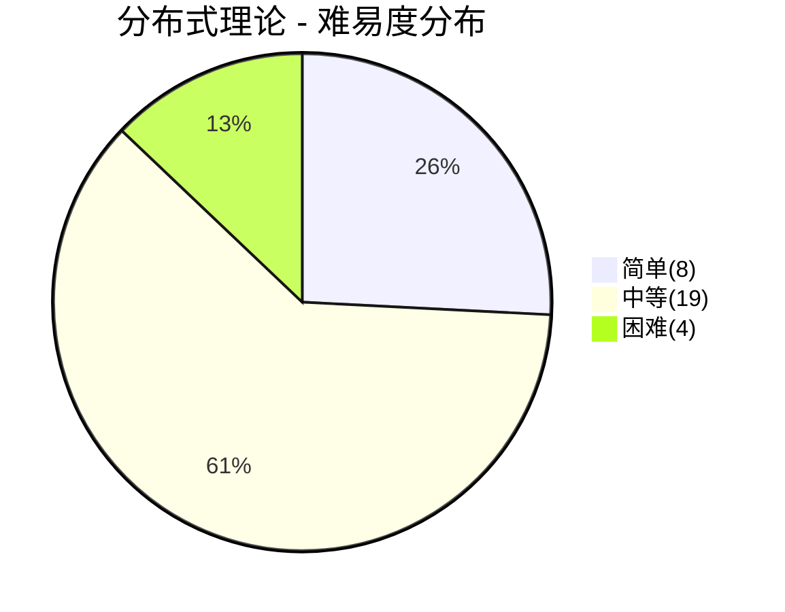
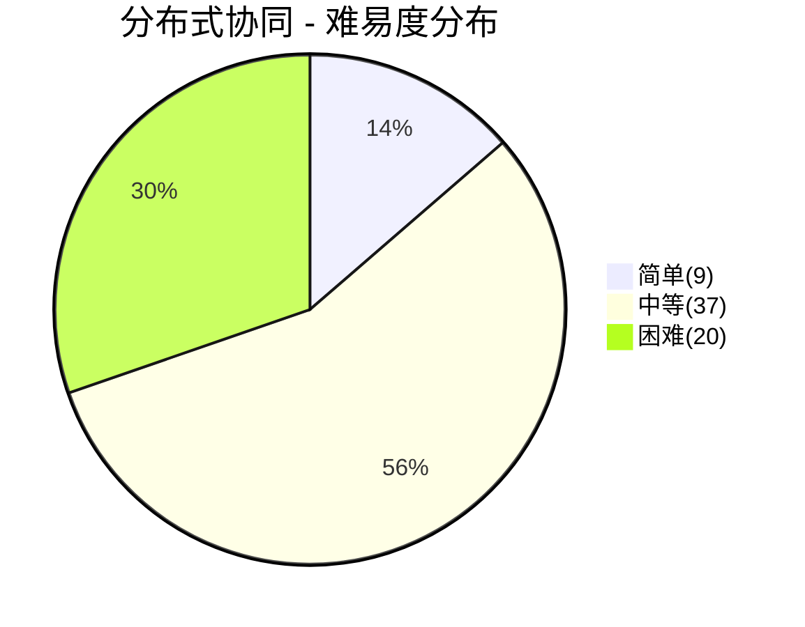
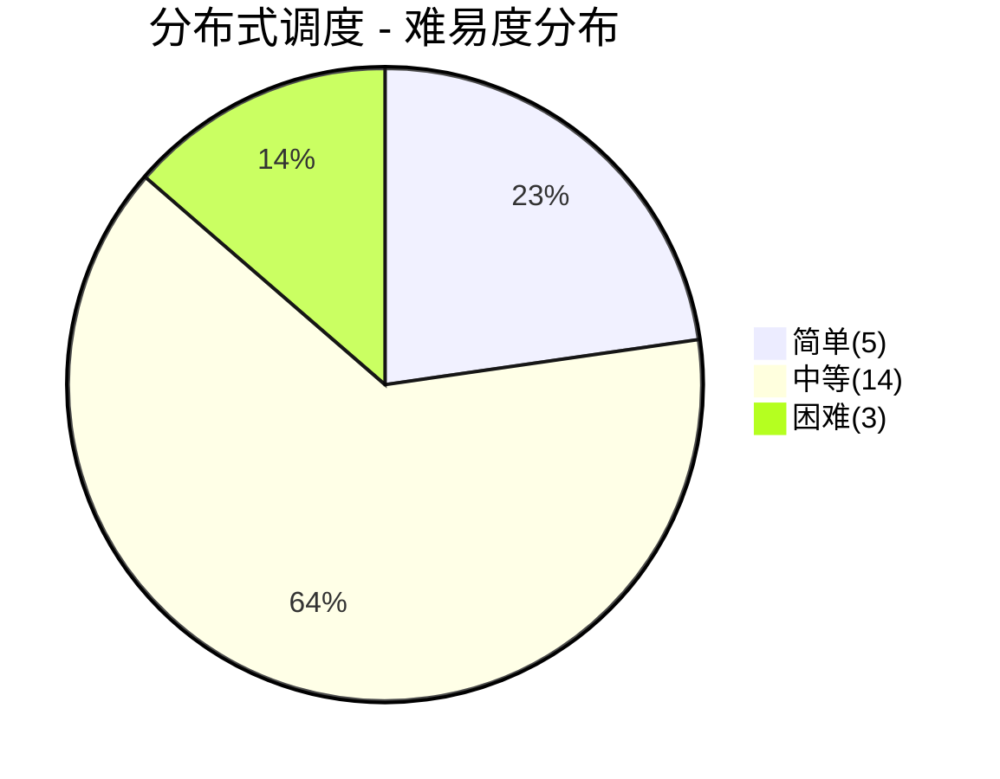
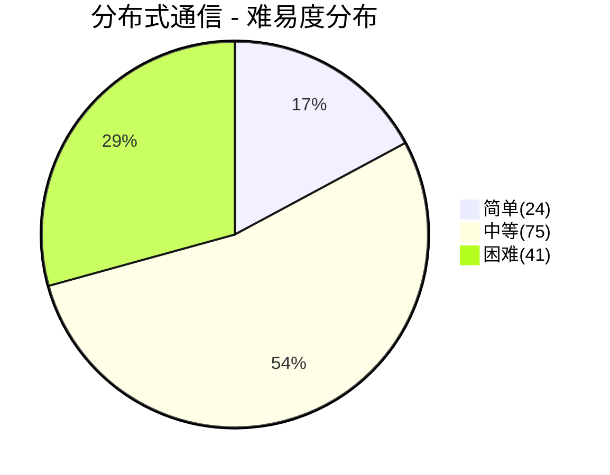
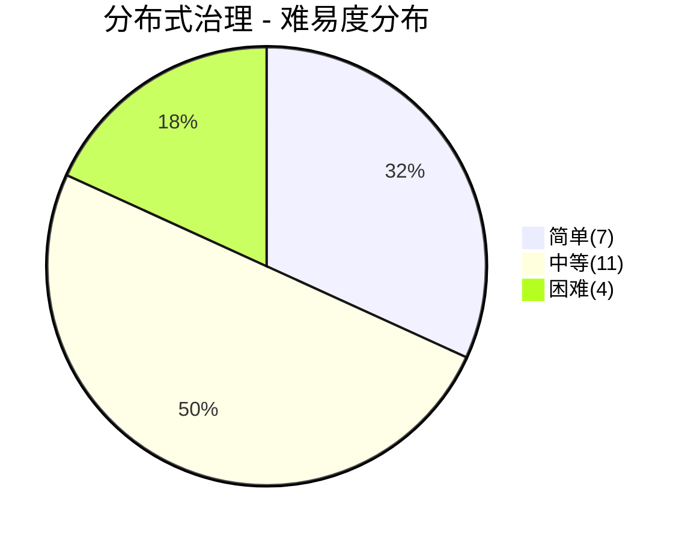
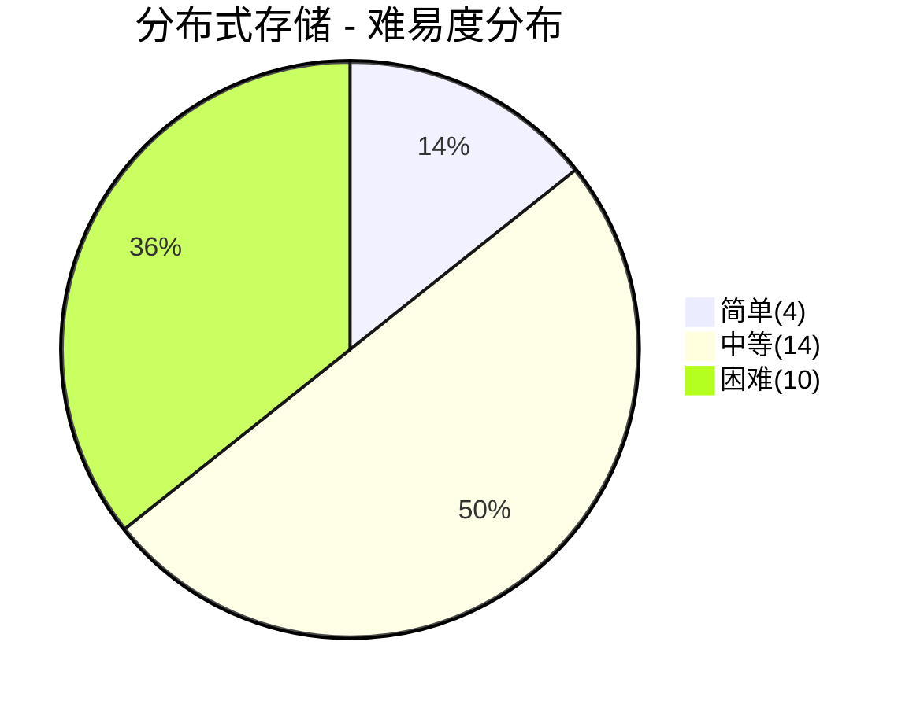

# 分布式面试

> **题库统计**：共收录 **309** 道面试题。简单 **57** 题（18.4%），中等 **170** 题（55.0%），困难 **82** 题（26.5%）

## 📖 内容

### 分布式理论

::: tip **题库**

- [分布式理论面试](../15.分布式/分布式理论/分布式理论面试.md)

:::

::: note **统计**：共 **31** 题

- 难易度：| 简单 **8** 题 | 中等 **19** 题 | 困难 **4** 题 |
- 重要度：| 一星 **6** 题 | 二星 **12** 题 | 三星 **7** 题 | 四星 **4** 题 | 五星 **2** 题 |

:::

```mermaid
pie title 分布式理论 - 难易度分布
    "简单(8)" : 8
    "中等(19)" : 19
    "困难(4)" : 4
```

| 分类         | 题目                                               | 难易度 | 重要度     | 掌握度 | 评估 |
| :----------- | :------------------------------------------------- | :----- | :--------- | :----: | ---- |
| 系统基础     | 什么是分布式系统？它和集中式系统有什么区别？       | 简单   | ⭐         |        |      |
| 系统基础     | 分布式系统有哪些核心特征？                         | 简单   | ⭐         |        |      |
| 系统基础     | 分布式系统面临哪些核心挑战？                       | 中等   | ⭐⭐       |        |      |
| 系统基础     | 什么是分布式计算的八大谬误？                       | 中等   | ⭐         |        |      |
| 时钟与排序   | 为什么需要逻辑时钟？                               | 简单   | ⭐         |        |      |
| 时钟与排序   | 什么是偏序？什么是全序？                           | 中等   | ⭐         |        |      |
| 时钟与排序   | 什么是逻辑时钟？                                   | 中等   | ⭐⭐       |        |      |
| 时钟与排序   | 什么是向量时钟？                                   | 中等   | ⭐⭐       |        |      |
| 时钟与排序   | 什么是版本向量时钟？                               | 中等   | ⭐⭐       |        |      |
| 时钟与排序   | 逻辑时钟、向量时钟、版本向量时钟有什么差异？       | 中等   | ⭐⭐       |        |      |
| 时钟与排序   | 什么是混合逻辑时钟（HLC）？                        | 中等   | ⭐⭐       |        |      |
| 一致性模型   | 什么是强一致性？什么是弱一致性？什么是最终一致性？ | 简单   | ⭐⭐⭐     |   ⚠️   |      |
| 一致性模型   | 什么是线性一致性、顺序一致性、因果一致性？         | 中等   | ⭐⭐⭐⭐   |        |      |
| 一致性模型   | 什么是 ACID？                                      | 简单   | ⭐⭐⭐     |   ✅   |      |
| 一致性模型   | 什么是 CAP 定理？                                  | 简单   | ⭐⭐⭐⭐⭐ |   ✅   |      |
| 一致性模型   | 什么是 BASE 定理？                                 | 简单   | ⭐⭐⭐⭐   |   ⚠️   |      |
| 共识算法     | 什么是分布式共识？共识和一致性有什么区别？         | 简单   | ⭐⭐⭐     |   ✅   |      |
| 共识算法     | 什么是 FLP 不可能定理？它对分布式系统有什么影响？  | 中等   | ⭐⭐       |        |      |
| 共识算法     | 什么是 Quorum 机制？为什么多数派能保证一致性？     | 中等   | ⭐⭐⭐     |        |      |
| 共识算法     | Paxos 的工作原理是什么？                           | 困难   | ⭐⭐⭐⭐   |        |      |
| 共识算法     | Raft 的工作原理是什么？                            | 困难   | ⭐⭐⭐⭐⭐ |   ✅   |      |
| 共识算法     | Paxos、Raft、ZAB 有什么区别与联系？                | 中等   | ⭐⭐⭐⭐   |   ✅   |      |
| 共识算法     | 什么是全序广播？它与共识有什么关系？               | 困难   | ⭐⭐⭐     |        |      |
| 共识算法     | 共识算法的局限性有哪些？                           | 中等   | ⭐⭐       |        |      |
| 拜占庭共识   | 什么是拜占庭将军问题？它与普通共识问题有什么区别？ | 中等   | ⭐⭐       |        |      |
| 拜占庭共识   | PBFT 算法的工作原理是什么？                        | 困难   | ⭐⭐       |        |      |
| 拜占庭共识   | PoW 和 PoS 如何解决拜占庭共识问题？                | 中等   | ⭐         |        |      |
| Gossip与复制 | Gossip 的工作原理是什么？收敛性如何？              | 中等   | ⭐⭐⭐     |        |      |
| Gossip与复制 | 无主复制中的 NWR Quorum 是什么？                   | 中等   | ⭐⭐⭐     |        |      |
| Gossip与复制 | 什么是 Read Repair（读修复）？                     | 中等   | ⭐⭐       |        |      |
| Gossip与复制 | 什么是 Hinted Handoff（提示移交）？                | 中等   | ⭐⭐       |        |      |

### 分布式协同

::: tip **题库**

- [分布式协同面试](../15.分布式/分布式协同/分布式协同面试.md)
- [ZooKeeper 面试](../15.分布式/分布式协同/ZooKeeper/[ZooKeeper]面试.md)

:::

::: note **统计**：共 **66** 题

- 难易度：| 简单 **9** 题 | 中等 **37** 题 | 困难 **20** 题 |
- 重要度：| 一星 **1** 题 | 二星 **15** 题 | 三星 **22** 题 | 四星 **27** 题 | 五星 **1** 题 |

:::

```mermaid
pie title 分布式协同 - 难易度分布
    "简单(9)" : 9
    "中等(37)" : 37
    "困难(20)" : 20
```

| 分类       | 题目                                                                   | 难易度 | 重要度     | 掌握度 | 评估 |
| :--------- | :--------------------------------------------------------------------- | :----- | :--------- | :----: | ---- |
| 复制       | 什么是复制？复制有什么作用？                                           | 简单   | ⭐⭐       |        |      |
| 复制       | 复制有哪些模式？                                                       | 中等   | ⭐⭐⭐     |        |      |
| 复制       | 主从复制的工作原理是什么？                                             | 中等   | ⭐⭐⭐⭐   |   ⚠️   |      |
| 复制       | 同步复制、半同步复制、异步复制有什么差异？                             | 中等   | ⭐⭐⭐⭐   |        |      |
| 复制       | 新的从节点如何复制主节点数据？                                         | 中等   | ⭐⭐       |        |      |
| 复制       | 如何通过主从复制技术来实现系统高可用呢？                               | 困难   | ⭐⭐⭐⭐   |        |      |
| 复制       | 复制日志的工作原理是什么？                                             | 困难   | ⭐⭐⭐     |        |      |
| 复制       | 多主复制的工作原理是什么？                                             | 困难   | ⭐⭐⭐     |        |      |
| 复制       | 无主复制的工作原理是什么？                                             | 困难   | ⭐⭐⭐⭐   |        |      |
| 复制       | 什么是复制延迟问题？有哪些常见的解决思路？                             | 中等   | ⭐⭐⭐     |        |      |
| 复制       | 无主复制中如何解决并发写冲突？                                         | 困难   | ⭐⭐⭐     |        |      |
| 分区       | 什么是分区？为什么要分区？                                             | 简单   | ⭐⭐       |        |      |
| 分区       | 分区有哪些模式？                                                       | 中等   | ⭐⭐⭐     |        |      |
| 分区       | 二级索引如何分区？                                                     | 困难   | ⭐⭐       |        |      |
| 分区       | 什么是分区再均衡？                                                     | 简单   | ⭐⭐       |        |      |
| 分区       | 分区再均衡有哪些策略？                                                 | 中等   | ⭐⭐⭐⭐   |        |      |
| 分区       | 如何确定读写请求发往哪个节点？                                         | 困难   | ⭐⭐⭐     |        |      |
| 分区       | 如何解决分区热点问题？                                                 | 中等   | ⭐⭐⭐⭐   |        |      |
| 分区       | 分区再均衡过程中如何保证服务不中断？                                   | 中等   | ⭐⭐⭐⭐   |        |      |
| 分布式事务 | 什么是事务？什么是分布式事务？                                         | 简单   | ⭐⭐⭐⭐   |   ⚠️   |      |
| 分布式事务 | 分布式事务有哪些解决方案？各有什么利弊？                               | 中等   | ⭐⭐⭐⭐⭐ |   ⚠️   |      |
| 分布式事务 | 2PC 的工作原理是什么？                                                 | 中等   | ⭐⭐⭐     |   ✅   |      |
| 分布式事务 | 3PC 的工作原理是什么？                                                 | 中等   | ⭐⭐       |        |      |
| 分布式事务 | TCC 的工作原理是什么？                                                 | 中等   | ⭐⭐⭐⭐   |   ⚠️   |      |
| 分布式事务 | 什么是 TCC 事务的空回滚、防悬挂？                                      | 困难   | ⭐⭐⭐⭐   |        |      |
| 分布式事务 | SAGA 事务的工作原理是什么？                                            | 困难   | ⭐⭐⭐⭐   |   ⚠️   |      |
| 分布式事务 | 本地消息表的工作原理是什么？                                           | 中等   | ⭐⭐⭐     |   ⚠️   |      |
| 分布式事务 | 什么是最大努力通知？它和本地消息表有什么区别？                         | 中等   | ⭐⭐       |        |      |
| 分布式事务 | Seata 的工作原理是什么？支持哪些事务模式？                             | 困难   | ⭐⭐⭐⭐   |        |      |
| 分布式事务 | 什么是幂等性？分布式幂等如何实现？                                     | 中等   | ⭐⭐⭐⭐   |   ✅   |      |
| 分布式锁   | 什么是分布式锁？为什么需要分布式锁？                                   | 简单   | ⭐⭐⭐⭐   |   ✅   |      |
| 分布式锁   | 实现分布式锁有哪些要点？                                               | 困难   | ⭐⭐⭐⭐   |        |      |
| 分布式锁   | 数据库分布式锁的工作原理是什么？                                       | 中等   | ⭐⭐       |        |      |
| 分布式锁   | ZooKeeper 分布式锁的工作原理是什么？                                   | 困难   | ⭐⭐⭐⭐   |        |      |
| 分布式锁   | Redis 分布式锁的工作原理是什么？                                       | 困难   | ⭐⭐⭐⭐   |   ✅   |      |
| 分布式锁   | RedLock 分布式锁的工作原理是什么？                                     | 中等   | ⭐⭐⭐     |   ✅   |      |
| 分布式锁   | Redssion 分布式锁的工作原理是什么？                                    | 中等   | ⭐⭐⭐     |   ✅   |      |
| 分布式锁   | 分布式锁如何进行技术选型？                                             | 困难   | ⭐⭐⭐⭐   |   ✅   |      |
| 分布式锁   | RedLock 算法有什么争议？Martin Kleppmann 和 Antirez 的争论核心是什么？ | 困难   | ⭐⭐⭐⭐   |        |      |
| 分布式锁   | Redis 分布式锁如何实现可重入？                                         | 中等   | ⭐⭐       |        |      |
| 分布式ID   | 有哪些生成分布式 ID 的方式？                                           | 中等   | ⭐⭐⭐⭐   |   ✅   |      |
| 分布式ID   | 雪花算法的原理是什么？时钟回拨如何处理？                               | 困难   | ⭐⭐⭐⭐   |   ✅   |      |
| 分布式ID   | Leaf 和 Tinyid 的原理是什么？各有什么特点？                            | 中等   | ⭐⭐       |        |      |
| ZooKeeper  | 什么是 ZooKeeper？                                                     | 简单   | ⭐⭐⭐     |   ✅   |      |
| ZooKeeper  | ZooKeeper 中有哪些应用场景？                                           | 简单   | ⭐⭐       |        |      |
| ZooKeeper  | ZooKeeper 如何存储数据？                                               | 简单   | ⭐⭐       |        |      |
| ZooKeeper  | ZooKeeper 有几种节点类型？                                             | 简单   | ⭐⭐       |        |      |
| ZooKeeper  | ZooKeeper 的设计目标是什么？                                           | 中等   | ⭐⭐       |        |      |
| ZooKeeper  | ZooKeeper 集群有几种角色？                                             | 中等   | ⭐⭐⭐     |        |      |
| ZooKeeper  | ZooKeeper 的权限控制如何设计的？                                       | 中等   | ⭐         |        |      |
| ZooKeeper  | ZooKeeper 的架构有什么缺点？                                           | 困难   | ⭐⭐⭐⭐   |        |      |
| ZooKeeper  | ZooKeeper 的读写操作工作流程是怎样的？                                 | 中等   | ⭐⭐⭐     |        |      |
| ZooKeeper  | ZooKeeper 事务机制是怎样的？                                           | 中等   | ⭐⭐⭐     |        |      |
| ZooKeeper  | ZooKeeper 监听机制是怎样的？                                           | 中等   | ⭐⭐⭐⭐   |   ⚠️   |      |
| ZooKeeper  | ZooKeeper 会话机制是怎样的？                                           | 中等   | ⭐⭐⭐     |        |      |
| ZooKeeper  | ZAB 的工作原理是什么？                                                 | 中等   | ⭐⭐⭐⭐   |        |      |
| ZooKeeper  | Zab 协议中故障恢复的流程是怎样的？                                     | 困难   | ⭐⭐⭐     |        |      |
| ZooKeeper  | Zab 协议中原子广播的流程是怎样的？                                     | 困难   | ⭐⭐⭐     |        |      |
| ZooKeeper  | ZooKeeper 提供了怎样的一致性保证？                                     | 困难   | ⭐⭐⭐⭐   |        |      |
| ZooKeeper  | ZooKeeper 是 CP 还是 AP？                                              | 中等   | ⭐⭐⭐⭐   |   ✅   |      |
| ZooKeeper  | FastLeaderElection 算法的核心原理是什么？                              | 中等   | ⭐⭐⭐     |        |      |
| ZooKeeper  | ZooKeeper vs etcd vs Consul 有什么区别？                               | 中等   | ⭐⭐⭐     |        |      |
| ZooKeeper  | ZooKeeper 如何应对脑裂问题？                                           | 中等   | ⭐⭐⭐⭐   |        |      |
| ZooKeeper  | ZooKeeper Session 过期会导致什么问题？如何处理？                       | 中等   | ⭐⭐⭐     |        |      |
| ZooKeeper  | ZooKeeper 的 Watch 丢失问题是什么？如何解决？                          | 中等   | ⭐⭐⭐     |        |      |
| ZooKeeper  | ZooKeeper 集群为什么推荐奇数节点？                                     | 中等   | ⭐⭐       |        |      |

### 分布式调度

::: tip **题库**

- [分布式调度面试](../15.分布式/分布式调度/分布式调度面试.md)

:::

::: note **统计**：共 **22** 题

- 难易度：| 简单 **5** 题 | 中等 **14** 题 | 困难 **3** 题 |
- 重要度：| 二星 **10** 题 | 三星 **5** 题 | 四星 **7** 题 |

:::

```mermaid
pie title 分布式调度 - 难易度分布
    "简单(5)" : 5
    "中等(14)" : 14
    "困难(3)" : 3
```

| 分类           | 题目                                             | 难易度 | 重要度   | 掌握度 | 评估 |
| :------------- | :----------------------------------------------- | :----- | :------- | :----: | ---- |
| 服务注册与发现 | 什么是服务注册和发现？                           | 简单   | ⭐⭐⭐⭐ |   ✅   |      |
| 服务注册与发现 | 注册中心有哪些基本功能？                         | 中等   | ⭐⭐     |        |      |
| 服务注册与发现 | 注册中心有哪些扩展功能？                         | 困难   | ⭐⭐     |        |      |
| 服务注册与发现 | 主流注册中心对比有什么区别？                     | 中等   | ⭐⭐⭐⭐ |   ✅   |      |
| 负载均衡       | 什么是负载均衡？为什么需要负载均衡？             | 简单   | ⭐⭐     |        |      |
| 负载均衡       | 负载均衡技术有哪些分类？                         | 中等   | ⭐⭐     |        |      |
| 负载均衡       | 负载均衡有哪些算法？                             | 中等   | ⭐⭐⭐⭐ |   ✅   |      |
| 负载均衡       | 同机房优先调用有哪些常见策略？                   | 中等   | ⭐⭐     |        |      |
| 流量控制       | 什么是流量控制？为什么需要流量控制？             | 简单   | ⭐⭐     |        |      |
| 流量控制       | 流量控制有哪些衡量指标？                         | 简单   | ⭐⭐     |        |      |
| 流量控制       | 流量控制有哪些保护机制？                         | 中等   | ⭐⭐⭐   |   ✅   |      |
| 流量控制       | 流量控制有哪些隔离模式？                         | 中等   | ⭐⭐⭐   |        |      |
| 流量控制       | 有哪些限流算法？                                 | 困难   | ⭐⭐⭐⭐ |   ✅   |      |
| 流量控制       | 如何实现集群限流？限流方案实战如何选型？         | 困难   | ⭐⭐⭐⭐ |   ✅   |      |
| 熔断与容错     | 熔断器的工作原理是什么？有哪些状态？             | 中等   | ⭐⭐⭐   |        |      |
| 熔断与容错     | 超时和重试策略如何设计？                         | 中等   | ⭐⭐⭐⭐ |        |      |
| 熔断与容错     | Sentinel vs Hystrix vs Resilience4j 有什么区别？ | 中等   | ⭐⭐⭐   |   ✅   |      |
| 服务路由       | 什么是服务路由？路由有什么用？                   | 简单   | ⭐⭐     |        |      |
| 服务路由       | 服务路由有哪些常见规则？                         | 中等   | ⭐⭐     |        |      |
| 服务路由       | 路由规则有哪些获取方式？                         | 中等   | ⭐⭐     |        |      |
| 定时任务       | 在 Java 中，实现一个进程内定时任务有哪些方案？   | 中等   | ⭐⭐⭐   |        |      |
| 定时任务       | 分布式定时任务有哪些方案？                       | 中等   | ⭐⭐⭐⭐ |        |      |

### 分布式通信

::: tip **题库**

- [RPC 面试](../15.分布式/分布式通信/RPC/RPC面试.md)
- [Dubbo 面试之服务治理](../15.分布式/分布式通信/RPC/[Dubbo][面试]服务治理.md)
- [Dubbo 面试之架构](../15.分布式/分布式通信/RPC/[Dubbo][面试]架构.md)
- [Dubbo 面试之应用](../15.分布式/分布式通信/RPC/[Dubbo][面试]应用.md)
- [MQ 面试](../15.分布式/分布式通信/MQ/MQ面试.md)
- [Kafka 面试](../15.分布式/分布式通信/MQ/Kafka/[Kafka]面试.md)
- [RocketMQ 面试](../15.分布式/分布式通信/MQ/RocketMQ/[RocketMQ]面试.md)
- [RabbitMQ 面试](../15.分布式/分布式通信/MQ/RabbitMQ面试.md)

:::

::: note **统计**：共 **140** 题

- 难易度：| 简单 **24** 题 | 中等 **75** 题 | 困难 **41** 题 |
- 重要度：| 一星 **4** 题 | 二星 **40** 题 | 三星 **38** 题 | 四星 **52** 题 | 五星 **6** 题 |

:::

```mermaid
pie title 分布式通信 - 难易度分布
    "简单(24)" : 24
    "中等(75)" : 75
    "困难(41)" : 41
```

| 分类          | 题目                                                                                 | 难易度 | 重要度     | 掌握度 | 评估 |
| :------------ | :----------------------------------------------------------------------------------- | :----- | :--------- | :----: | ---- |
| RPC           | 什么是 RPC？RPC 有什么用？                                                           | 简单   | ⭐⭐       |   ✅   |      |
| RPC           | RPC 是怎样工作的？                                                                   | 中等   | ⭐⭐⭐⭐   |        |      |
| RPC           | 主流 RPC 框架有哪些？它们有什么区别？                                                | 中等   | ⭐⭐⭐     |        |      |
| RPC           | 为何需要 RPC 协议？                                                                  | 中等   | ⭐⭐       |        |      |
| RPC           | 设计一个 RPC 协议的要点？                                                            | 中等   | ⭐⭐⭐     |        |      |
| RPC           | 什么是序列化？有哪些常见的序列化方式？                                               | 简单   | ⭐⭐⭐     |        |      |
| RPC           | 常见序列化协议的深度对比？                                                           | 中等   | ⭐⭐⭐⭐   |        |      |
| RPC           | 序列化的使用中需要注意哪些问题？                                                     | 简单   | ⭐⭐       |        |      |
| RPC           | HTTP 与 RPC 有什么区别？                                                             | 简单   | ⭐⭐       |   ❌   |      |
| RPC           | RPC 通信应该选择 TCP 还是 HTTP？                                                     | 中等   | ⭐⭐⭐⭐   |        |      |
| RPC           | 长连接 vs 短连接？                                                                   | 中等   | ⭐⭐⭐     |        |      |
| RPC           | 什么是 Triple 协议？                                                                 | 中等   | ⭐⭐       |        |      |
| RPC           | RPC 在网络通信上倾向选择哪种网络 IO 模型？                                           | 中等   | ⭐⭐⭐⭐   |        |      |
| RPC           | 什么是零拷贝？                                                                       | 中等   | ⭐⭐⭐     |        |      |
| RPC           | RPC 如何将远程调用转为本地调用的？                                                   | 中等   | ⭐⭐⭐⭐   |        |      |
| RPC           | 如何实现一个注册中心？                                                               | 中等   | ⭐⭐⭐⭐   |   ✅   |      |
| RPC           | 负载均衡有哪些策略？                                                                 | 中等   | ⭐⭐⭐     |        |      |
| RPC           | 如何设计自适应的负载均衡？                                                           | 中等   | ⭐⭐       |        |      |
| RPC           | 如何实现 RPC 的健康检查？                                                            | 中等   | ⭐⭐⭐⭐   |        |      |
| RPC           | 如何实现 RPC 优雅关闭？                                                              | 中等   | ⭐⭐⭐⭐   |        |      |
| RPC           | 如何实现 RPC 优雅启动？                                                              | 中等   | ⭐⭐⭐     |        |      |
| RPC           | 如何设计一个 RPC 框架？                                                              | 困难   | ⭐⭐⭐⭐   |   ✅   |      |
| RPC           | 如何实现 RPC 异步调用？                                                              | 困难   | ⭐⭐⭐⭐   |        |      |
| RPC           | 什么是 RPC 流式调用？有哪些模式？                                                    | 困难   | ⭐⭐⭐     |        |      |
| RPC           | RPC 如何实现泛化调用？                                                               | 中等   | ⭐⭐       |        |      |
| Dubbo基础     | Dubbo 支持哪些序列化方式？                                                           | 简单   | ⭐⭐       |        |      |
| Dubbo基础     | Dubbo 支持哪些通信协议？                                                             | 简单   | ⭐⭐⭐     |        |      |
| Dubbo架构     | Dubbo2 协议的报文结构与连接策略是如何设计的？                                        | 困难   | ⭐⭐⭐⭐   |        |      |
| Dubbo架构     | Dubbo 的服务暴露（Export）与引用（Refer）流程是怎样的？                              | 困难   | ⭐⭐⭐⭐   |        |      |
| Dubbo架构     | Dubbo 的整体架构与工作原理是怎样的？                                                 | 困难   | ⭐⭐⭐⭐   |        |      |
| Dubbo架构     | Dubbo 如何保证服务的高可用性？                                                       | 困难   | ⭐⭐⭐     |        |      |
| Dubbo架构     | Dubbo 有哪些性能优化设计？                                                           | 困难   | ⭐⭐⭐     |        |      |
| Dubbo架构     | Dubbo 如何支持异步调用？                                                             | 中等   | ⭐⭐⭐     |        |      |
| Dubbo架构     | Dubbo 中的线程模型是如何设计的？                                                     | 困难   | ⭐⭐⭐⭐   |        |      |
| Dubbo架构     | Dubbo 的 SPI 扩展机制是如何设计的？                                                  | 困难   | ⭐⭐⭐⭐   |        |      |
| Dubbo架构     | Dubbo 中如何实现分布式事务？                                                         | 困难   | ⭐⭐       |        |      |
| Dubbo服务治理 | 什么是服务注册与发现？Dubbo 如何实现？                                               | 困难   | ⭐⭐⭐⭐   |   ⚠️   |      |
| Dubbo服务治理 | Dubbo3 的应用级服务发现的工作原理是什么？                                            | 困难   | ⭐⭐⭐⭐   |        |      |
| Dubbo服务治理 | Dubbo 支持哪些负载均衡方式？各有什么利弊？                                           | 困难   | ⭐⭐⭐⭐   |        |      |
| Dubbo服务治理 | Dubbo 路由机制与配置方式                                                             | 中等   | ⭐⭐⭐     |        |      |
| Dubbo服务治理 | Dubbo 支持哪些线程池类型？                                                           | 中等   | ⭐⭐⭐     |        |      |
| Dubbo服务治理 | Dubbo 注册中心的数据是如何同步的？                                                   | 困难   | ⭐⭐⭐⭐   |        |      |
| Dubbo服务治理 | Dubbo 的流量控制与降级策略有哪些？                                                   | 中等   | ⭐⭐⭐⭐   |        |      |
| Dubbo服务治理 | Dubbo 的故障检测与容错处理机制                                                       | 中等   | ⭐⭐⭐⭐   |        |      |
| Dubbo服务治理 | Dubbo 的可观测体系与 Monitor 原理                                                    | 中等   | ⭐⭐⭐     |        |      |
| Dubbo服务治理 | 如何在 Dubbo 中处理服务调用链路追踪？                                                | 困难   | ⭐⭐⭐     |        |      |
| Dubbo基础     | Dubbo 是什么？为什么使用 Dubbo？                                                     | 简单   | ⭐⭐       |        |      |
| Dubbo基础     | Dubbo3 有什么新特性？                                                                | 简单   | ⭐⭐⭐     |        |      |
| Dubbo应用     | Dubbo 的配置方式有哪些？                                                             | 简单   | ⭐⭐       |        |      |
| Dubbo应用     | Dubbo 与 Spring 的集成原理是什么？                                                   | 困难   | ⭐⭐⭐⭐   |        |      |
| Dubbo应用     | Dubbo 如何实现隐式参数传递？                                                         | 中等   | ⭐⭐       |        |      |
| Dubbo应用     | Dubbo 的本地存根（Stub）是什么？如何使用？                                           | 中等   | ⭐⭐       |        |      |
| Dubbo应用     | Dubbo 中如何实现服务端与客户端的版本兼容？                                           | 中等   | ⭐⭐⭐⭐   |        |      |
| Dubbo应用     | Dubbo 中如何配置多协议？                                                             | 中等   | ⭐⭐       |        |      |
| Dubbo应用     | Dubbo 中如何配置多注册中心？                                                         | 中等   | ⭐⭐       |        |      |
| Dubbo应用     | Dubbo 的泛化调用如何使用？                                                           | 中等   | ⭐⭐⭐⭐   |        |      |
| Dubbo应用     | Dubbo 性能调优有哪些实战经验？                                                       | 中等   | ⭐⭐⭐⭐   |        |      |
| Dubbo应用     | Dubbo 的超时问题如何排查与调优？                                                     | 中等   | ⭐⭐⭐⭐   |        |      |
| Dubbo应用     | Dubbo 的序列化异常如何解决？                                                         | 中等   | ⭐⭐       |        |      |
| Dubbo应用     | Dubbo 的服务无法发现，可能的原因有哪些？                                             | 中等   | ⭐⭐⭐     |        |      |
| MQ            | MQ 是什么？                                                                          | 简单   | ⭐⭐       |   ❌   |      |
| MQ            | MQ 有哪些应用场景？                                                                  | 简单   | ⭐⭐⭐     |   ⚠️   |      |
| MQ            | MQ 存在哪些挑战？                                                                    | 中等   | ⭐⭐⭐     |        |      |
| MQ            | Kafka、RocketMQ、RabbitMQ 如何存储数据与持久化？                                     | 中等   | ⭐⭐⭐⭐   |        |      |
| MQ            | MQ 数据传输有哪些模式？                                                              | 中等   | ⭐⭐       |        |      |
| MQ            | MQ 有哪些通信模型？                                                                  | 中等   | ⭐⭐       |        |      |
| MQ            | MQ 如何实现延迟消息？                                                                | 中等   | ⭐⭐⭐⭐   |   ❌   |      |
| MQ            | Kafka、RocketMQ、RabbitMQ 生产消费有什么相同和不同之处？                             | 困难   | ⭐⭐⭐⭐   |   ❌   |      |
| MQ            | Kafka、RocketMQ、RabbitMQ 副本机制有什么不同之处？                                   | 困难   | ⭐⭐⭐⭐   |   ❌   |      |
| MQ            | Kafka、RocketMQ、RabbitMQ 分区机制有什么不同之处？                                   | 困难   | ⭐⭐⭐⭐   |   ❌   |      |
| MQ            | Kafka、RocketMQ、RabbitMQ 有什么区别？如何选型？                                     | 困难   | ⭐⭐⭐⭐⭐ |        |      |
| MQ            | 如何保证 MQ 消息不丢失？                                                             | 困难   | ⭐⭐⭐⭐⭐ |   ✅   |      |
| MQ            | 如何保证 MQ 消息不重复？                                                             | 困难   | ⭐⭐⭐⭐⭐ |   ✅   |      |
| MQ            | 如何保证 MQ 消息的顺序性？                                                           | 困难   | ⭐⭐⭐⭐⭐ |   ✅   |      |
| MQ            | 如何处理 MQ 消息积压？                                                               | 困难   | ⭐⭐⭐⭐   |   ✅   |      |
| MQ            | MQ 如何实现消息重放（重新消费）？                                                    | 中等   | ⭐⭐       |        |      |
| MQ            | 什么是死信队列？各 MQ 如何实现死信处理机制？                                         | 中等   | ⭐⭐⭐⭐   |        |      |
| MQ            | MQ 如何实现分布式事务？                                                              | 困难   | ⭐⭐⭐⭐   |   ❌   |      |
| MQ            | 什么是 Exactly-Once 语义？MQ 如何实现？                                              | 中等   | ⭐⭐⭐⭐   |        |      |
| MQ            | 什么是 JMS？                                                                         | 简单   | ⭐         |        |      |
| MQ            | 什么是 AMQP？                                                                        | 简单   | ⭐⭐       |        |      |
| Kafka         | Kafka 是什么？                                                                       | 简单   | ⭐⭐       |   ⚠️   |      |
| Kafka         | Kafka 有哪些核心组件？                                                               | 简单   | ⭐⭐       |        |      |
| Kafka         | Kafka 有哪些应用场景？                                                               | 简单   | ⭐⭐       |        |      |
| Kafka         | Kafka 如何清理数据？日志删除与压缩如何工作？                                         | 中等   | ⭐⭐       |        |      |
| Kafka         | Kafka 如何通过分段与索引检索数据？                                                   | 中等   | ⭐⭐⭐⭐   |        |      |
| Kafka         | Kafka 发送消息的工作流程是怎样的？                                                   | 中等   | ⭐⭐⭐     |   ✅   |      |
| Kafka         | Kafka 为什么要支持消费者群组？                                                       | 简单   | ⭐⭐⭐     |   ✅   |      |
| Kafka         | Kafka 消费消息的工作流程是怎样的？                                                   | 中等   | ⭐⭐⭐     |        |      |
| Kafka         | Kafka 如何实现分区机制？                                                             | 中等   | ⭐⭐⭐⭐   |   ❌   |      |
| Kafka         | Kafka 支持哪些分区策略？                                                             | 中等   | ⭐⭐⭐     |        |      |
| Kafka         | Kafka 分区再均衡如何工作？如何减少触发与影响？                                       | 困难   | ⭐⭐⭐⭐   |        |      |
| Kafka         | Kafka 的 ISR 在什么场景下收缩？ISR 收缩有什么影响？                                  | 困难   | ⭐⭐⭐⭐   |        |      |
| Kafka         | 在 Kafka 中，如何实现多集群的数据同步？跨集群复制的实现原理是什么？                  | 困难   | ⭐⭐⭐     |        |      |
| Kafka         | Kafka Controller 如何工作并完成故障恢复？                                            | 困难   | ⭐⭐⭐⭐   |        |      |
| Kafka         | Kafka 如何实现高可用？                                                               | 困难   | ⭐⭐⭐⭐   |        |      |
| Kafka         | ZooKeeper 在 Kafka 中的作用是什么？                                                  | 中等   | ⭐⭐       |        |      |
| Kafka         | Kafka 为什么弃用 ZooKeeper？KRaft 如何工作与迁移？                                   | 中等   | ⭐⭐⭐⭐   |        |      |
| Kafka         | 在 Kafka 中，如何通过 Acks 配置提高数据可靠性？Acks 的值如何影响性能？               | 中等   | ⭐⭐⭐⭐   |        |      |
| Kafka         | 在 Kafka 中，如何实现幂等性 Producer？它对消息处理的意义是什么？                     | 困难   | ⭐⭐⭐⭐   |        |      |
| Kafka         | Kafka 为什么性能高？                                                                 | 困难   | ⭐⭐⭐⭐⭐ |        |      |
| Kafka         | Kafka 如何实现流量控制？                                                             | 困难   | ⭐⭐       |        |      |
| Kafka         | Kafka 如何处理数据倾斜问题？                                                         | 困难   | ⭐⭐⭐     |        |      |
| Kafka         | Kafka 处理请求的全流程？                                                             | 困难   | ⭐⭐⭐⭐   |        |      |
| Kafka         | Kafka 中如何实现时间轮？                                                             | 中等   | ⭐⭐       |        |      |
| Kafka         | Kafka 各组件如何进行优化？                                                           | 中等   | ⭐⭐⭐     |        |      |
| Kafka         | Kafka 与 Flink 的集成是如何实现的？如何优化 Flink 与 Kafka 之间的数据流动？          | 困难   | ⭐⭐       |        |      |
| Kafka         | Kafka 的 Stream 和 Table 是如何相互转换的？它们在 Kafka Streams 中的应用场景是什么？ | 困难   | ⭐         |        |      |
| Kafka         | 什么是 ksqlDB？它与 Kafka Streams 有什么区别？                                       | 中等   | ⭐         |        |      |
| Kafka         | Kafka 事务的核心机制是什么？                                                         | 中等   | ⭐⭐⭐⭐   |        |      |
| Kafka         | Kafka 如何处理大消息？                                                               | 简单   | ⭐⭐⭐     |        |      |
| RocketMQ      | RocketMQ 是什么？                                                                    | 简单   | ⭐⭐       |        |      |
| RocketMQ      | RocketMQ 有哪些核心组件？                                                            | 简单   | ⭐⭐       |        |      |
| RocketMQ      | RocketMQ 如何实现内存映射机制？                                                      | 困难   | ⭐⭐⭐⭐   |        |      |
| RocketMQ      | RocketMQ 的发送流程是什么？如何选择发送方式？                                        | 中等   | ⭐⭐⭐     |        |      |
| RocketMQ      | RocketMQ 的消费流程、消费模式与负载均衡如何工作？                                    | 中等   | ⭐⭐⭐⭐   |        |      |
| RocketMQ      | RocketMQ 如何实现批量消息？                                                          | 简单   | ⭐⭐       |        |      |
| RocketMQ      | RocketMQ 如何部署集群并实现高可用？                                                  | 中等   | ⭐⭐⭐⭐   |        |      |
| RocketMQ      | NameServer 如何实现服务发现？为什么不用 ZooKeeper？                                  | 中等   | ⭐⭐⭐⭐   |        |      |
| RocketMQ      | RocketMQ 5.0 有哪些新特性？                                                          | 中等   | ⭐⭐⭐     |        |      |
| RocketMQ      | RocketMQ 中如何配置并发消费和顺序消费？                                              | 中等   | ⭐⭐⭐     |        |      |
| RocketMQ      | RocketMQ 如何实现消息过滤？                                                          | 简单   | ⭐⭐⭐     |        |      |
| RocketMQ      | RocketMQ 的消息轨迹如何启用？                                                        | 中等   | ⭐         |        |      |
| RocketMQ      | RocketMQ 事务消息如何工作？回查接口如何设计？                                        | 困难   | ⭐⭐⭐⭐⭐ |        |      |
| RocketMQ      | RocketMQ 如何优化性能？有哪些调优策略？                                              | 中等   | ⭐⭐       |        |      |
| RabbitMQ      | RabbitMQ 是什么？                                                                    | 简单   | ⭐⭐       |        |      |
| RabbitMQ      | RabbitMQ 有哪些核心组件？                                                            | 简单   | ⭐⭐       |        |      |
| RabbitMQ      | RabbitMQ 如何通过交换机与绑定实现消息路由？                                          | 中等   | ⭐⭐⭐     |        |      |
| RabbitMQ      | RabbitMQ 中 Connection 和 Channel 有什么区别？                                       | 中等   | ⭐⭐⭐     |        |      |
| RabbitMQ      | RabbitMQ 如何声明队列并配置持久化、容量与消息过期策略？                              | 中等   | ⭐⭐⭐     |        |      |
| RabbitMQ      | 什么是 RabbitMQ 中的虚拟主机（vhost）？有什么作用？                                  | 中等   | ⭐⭐       |        |      |
| RabbitMQ      | RabbitMQ 中无法路由的消息会去到哪里？                                                | 中等   | ⭐⭐⭐     |        |      |
| RabbitMQ      | RabbitMQ 如何确认消息并处理未确认投递？                                              | 中等   | ⭐⭐⭐⭐   |        |      |
| RabbitMQ      | RabbitMQ 如何实现消息的批量消费？                                                    | 中等   | ⭐⭐       |        |      |
| RabbitMQ      | RabbitMQ 有哪些工作模式？                                                            | 中等   | ⭐⭐       |        |      |
| RabbitMQ      | RabbitMQ 集群与队列高可用如何设计和配置？                                            | 困难   | ⭐⭐⭐⭐   |        |      |
| RabbitMQ      | RabbitMQ 如何实现背压机制？                                                          | 中等   | ⭐⭐⭐     |        |      |
| RabbitMQ      | RabbitMQ 为什么使用 Erlang 语言？有什么优势和劣势？                                  | 中等   | ⭐⭐       |        |      |
| RabbitMQ      | RabbitMQ 的 prefetch_count 有什么作用？如何设置？                                    | 中等   | ⭐⭐⭐     |        |      |
| RabbitMQ      | RabbitMQ 如何通过插件扩展功能？常用的插件有哪些？                                    | 中等   | ⭐⭐       |        |      |

### 分布式治理

::: tip **题库**

- [分布式治理面试](../15.分布式/分布式治理/[分布式治理]面试.md)

:::

::: note **统计**：共 **22** 题

- 难易度：| 简单 **7** 题 | 中等 **11** 题 | 困难 **4** 题 |
- 重要度：| 二星 **7** 题 | 三星 **9** 题 | 四星 **6** 题 |

:::

```mermaid
pie title 分布式治理 - 难易度分布
    "简单(7)" : 7
    "中等(11)" : 11
    "困难(4)" : 4
```

| 分类     | 题目                                     | 难易度 | 重要度   | 掌握度 | 评估 |
| :------- | :--------------------------------------- | :----- | :------- | :----: | ---- |
| 可观测性 | 什么是可观测性？它包含哪三大支柱？       | 简单   | ⭐⭐⭐   |        |      |
| 可观测性 | OpenTelemetry 是什么？为什么重要？       | 中等   | ⭐⭐     |        |      |
| 可观测性 | Dapper 论文的核心思想是什么？            | 中等   | ⭐⭐     |        |      |
| 可观测性 | 如何实现链路追踪？                       | 中等   | ⭐⭐⭐   |        |      |
| 配置中心 | 什么是配置中心？                         | 简单   | ⭐⭐     |   ⚠️   |      |
| 配置中心 | 如何实现一个配置中心？                   | 困难   | ⭐⭐     |        |      |
| 配置中心 | 配置中心如何选型？                       | 中等   | ⭐⭐⭐   |        |      |
| 灰度发布 | 什么是灰度发布、金丝雀部署以及蓝绿部署？ | 简单   | ⭐⭐⭐   |        |      |
| 灰度发布 | 如何设计全链路灰度发布体系？             | 困难   | ⭐⭐⭐⭐ |   ⚠️   |      |
| 灰度发布 | 微服务如何实现无损上下线？               | 中等   | ⭐⭐⭐⭐ |   ✅   |      |
| 灰度发布 | 什么是单元化架构？如何实现多机房多活？   | 困难   | ⭐⭐⭐⭐ |        |      |
| 网关     | 什么是网关？                             | 简单   | ⭐⭐     |        |      |
| 网关     | 网关如何技术选型？                       | 中等   | ⭐⭐⭐   |        |      |
| 网关     | 网关如何实现 API 版本管理？              | 中等   | ⭐⭐⭐   |        |      |
| 服务网格 | 什么是服务网格？                         | 简单   | ⭐⭐⭐   |        |      |
| 服务网格 | 什么是 Sidecar？                         | 简单   | ⭐⭐     |        |      |
| 服务网格 | 服务网格 vs. 网关？                      | 中等   | ⭐⭐⭐⭐ |        |      |
| 服务网格 | Istio vs Linkerd 有什么区别？            | 中等   | ⭐⭐     |        |      |
| 容错     | 什么是服务容错？包含哪些手段？           | 简单   | ⭐⭐⭐   |        |      |
| 容错     | 服务降级有哪些策略？                     | 中等   | ⭐⭐⭐   |        |      |
| 容错     | 如何设计一个高可用的微服务容错方案？     | 中等   | ⭐⭐⭐⭐ |   ✅   |      |
| 容错     | 熔断器的关键参数如何设计与调优？         | 困难   | ⭐⭐⭐⭐ |        |      |

### 分布式存储

::: tip **题库**

- [分布式存储面试](../15.分布式/分布式存储/分布式存储面试.md)

:::

::: note **统计**：共 **28** 题

- 难易度：| 简单 **4** 题 | 中等 **14** 题 | 困难 **10** 题 |
- 重要度：| 二星 **9** 题 | 三星 **9** 题 | 四星 **9** 题 | 五星 **1** 题 |

:::

```mermaid
pie title 分布式存储 - 难易度分布
    "简单(4)" : 4
    "中等(14)" : 14
    "困难(10)" : 10
```

| 分类     | 题目                                      | 难易度 | 重要度     | 掌握度 | 评估 |
| :------- | :---------------------------------------- | :----- | :--------- | :----: | ---- |
| 缓存基础 | 什么是缓存？为什么以及何时需要缓存？      | 简单   | ⭐⭐       |        |      |
| 缓存基础 | 缓存有哪些分类？                          | 中等   | ⭐⭐       |        |      |
| 缓存基础 | 什么是 CDN？CDN 的工作原理是什么？        | 中等   | ⭐⭐       |        |      |
| 缓存基础 | 反向代理缓存的工作原理是什么？            | 中等   | ⭐⭐       |        |      |
| 缓存基础 | 缓存有哪些淘汰算法？                      | 中等   | ⭐⭐⭐     |   ⚠️   |      |
| 缓存基础 | 缓存更新有哪些策略？                      | 困难   | ⭐⭐⭐⭐   |   ⚠️   |      |
| 缓存基础 | 多级缓存架构如何设计？                    | 困难   | ⭐⭐⭐     |        |      |
| 缓存异常 | 什么是缓存雪崩？如何应对？                | 中等   | ⭐⭐⭐⭐   |   ✅   |      |
| 缓存异常 | 什么是缓存穿透？如何应对？                | 中等   | ⭐⭐⭐⭐   |   ✅   |      |
| 缓存异常 | 什么是缓存击穿？如何应对？                | 中等   | ⭐⭐⭐⭐   |   ✅   |      |
| 缓存异常 | 如何保证 Redis 中始终是热点数据？         | 中等   | ⭐⭐       |        |      |
| 缓存异常 | Redis 集群模式的工作原理是什么？          | 困难   | ⭐⭐⭐⭐   |        |      |
| 缓存异常 | 如何发现并解决热点 Key 问题？             | 困难   | ⭐⭐⭐     |        |      |
| 缓存异常 | 如何发现并解决大 Key 问题？               | 困难   | ⭐⭐⭐     |        |      |
| 缓存异常 | 什么是缓存预热？什么是缓存降级？          | 中等   | ⭐⭐       |        |      |
| 读写分离 | 什么是读写分离？为什么需要读写分离？      | 简单   | ⭐⭐       |        |      |
| 读写分离 | 如何实现读写分离？                        | 中等   | ⭐⭐       |        |      |
| 读写分离 | 如何应对主从复制延迟？                    | 中等   | ⭐⭐⭐     |   ✅   |      |
| 读写分离 | MySQL 主从复制的原理是什么？              | 中等   | ⭐⭐⭐     |   ✅   |      |
| 读写分离 | MySQL 半同步复制和异步复制的区别是什么？  | 中等   | ⭐⭐⭐     |        |      |
| 分库分表 | 什么是分库分表？为什么需要分库分表？      | 简单   | ⭐⭐⭐     |   ✅   |      |
| 分库分表 | 如何实现分库分表？                        | 困难   | ⭐⭐⭐⭐   |   ✅   |      |
| 分库分表 | 分库分表存在哪些问题？                    | 困难   | ⭐⭐⭐     |   ⚠️   |      |
| 分库分表 | 如何实现迁库和扩容？                      | 困难   | ⭐⭐⭐⭐   |        |      |
| 分库分表 | 如何选择分片键（Sharding Key）？          | 中等   | ⭐⭐⭐⭐   |        |      |
| 分库分表 | 垂直拆分和水平拆分有什么区别？            | 简单   | ⭐⭐       |        |      |
| 存储架构 | 如何保证缓存与数据库的一致性？            | 困难   | ⭐⭐⭐⭐⭐ |   ✅   |      |
| 存储架构 | 纠删码、TiDB 架构与冷热分层存储如何设计？ | 困难   | ⭐⭐⭐⭐   |        |      |

### 跨域关联

- [MySQL 索引与事务](数据库面试.md#mysql)
- [Redis 缓存与一致性](数据库面试.md#redis)
- [Java 并发编程](JavaCore面试.md#java-并发)
- [SpringCloud 微服务](Java框架面试.md#springcloud)
- [Spark 大数据计算](大数据面试.md#spark)
- [Flink 流式计算](大数据面试.md#flink)
- [Kubernetes 容器编排](DevOps面试.md#kubernetes)
