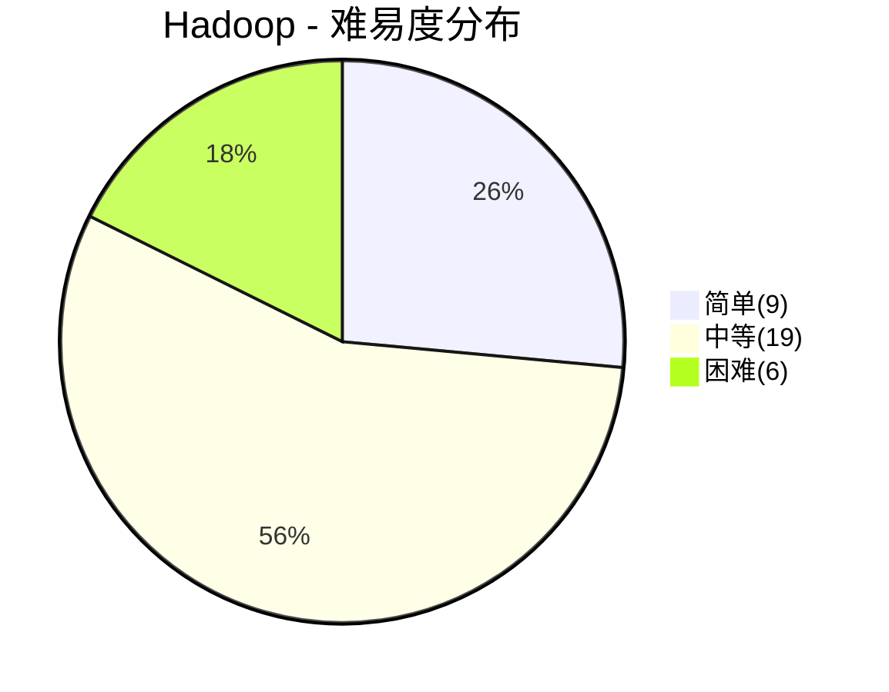
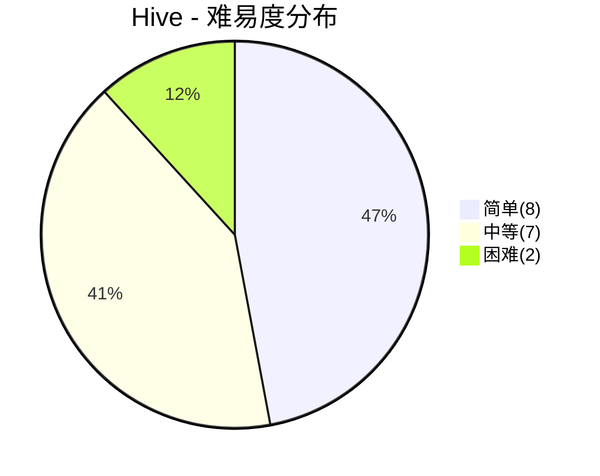

# 大数据面试

> **题库统计**：共收录 **51** 道面试题，覆盖 Hadoop / Hive 两大板块。其中简单题 **17** 道（33.3%），中等题 **26** 道（51.0%），困难题 **8** 道（15.7%）。整体以中等难度为主，困难题集中在 HDFS 高可用与数据倾斜调优，适合中高级岗位深度考察。

## 📖 内容

### Hadoop

> - [Hadoop 面试](../16.大数据/Hadoop/Hadoop面试.md)

::: note **统计**：共 **34** 题

- 难易度：| 简单 **9** 题 | 中等 **19** 题 | 困难 **6** 题 |
- 重要度：| 一星 **3** 题 | 二星 **16** 题 | 三星 **4** 题 | 四星 **7** 题 | 五星 **4** 题 |

:::

| 分类   | 题目                                             | 难易度 | 重要度     | 掌握度 | 评估 |
| :----- | :----------------------------------------------- | :----- | :--------- | :----: | ---- |
| Hadoop | 简介一下大数据技术生态？                         | 简单   | ⭐         |        |      |
| Hadoop | 什么是 HDFS？                                    | 简单   | ⭐⭐       |        |      |
| Hadoop | HDFS 有什么特性（优缺点）？                      | 简单   | ⭐⭐       |        |      |
| Hadoop | 什么是 YARN？                                    | 简单   | ⭐⭐       |        |      |
| Hadoop | 什么是 MapReduce？                               | 简单   | ⭐⭐       |        |      |
| Hadoop | MapReduce 有什么特性（优缺点）？                 | 简单   | ⭐         |        |      |
| Hadoop | HDFS 的架构是怎样设计的？                        | 中等   | ⭐⭐⭐⭐   |        |      |
| Hadoop | HDFS 使用 NameNode 的好处？                      | 中等   | ⭐⭐       |        |      |
| Hadoop | HDFS 使用 Block 的好处？                         | 中等   | ⭐⭐       |        |      |
| Hadoop | NameNode 与 SecondaryNameNode 的区别与联系？     | 中等   | ⭐⭐⭐⭐   |        |      |
| Hadoop | 什么是 FsImage 和 EditLog？                      | 中等   | ⭐⭐       |        |      |
| Hadoop | YARN 有哪些核心组件？                            | 简单   | ⭐⭐⭐⭐   |        |      |
| Hadoop | MapReduce 有哪些核心组件？                       | 简单   | ⭐⭐       |        |      |
| Hadoop | HDFS 的写数据流程是怎样的？                      | 中等   | ⭐⭐⭐⭐⭐ |        |      |
| Hadoop | HDFS 的读数据流程是怎样的？                      | 中等   | ⭐⭐⭐⭐⭐ |        |      |
| Hadoop | MapReduce 是如何工作的？                         | 中等   | ⭐⭐⭐⭐⭐ |        |      |
| Hadoop | YARN 是如何工作的？                              | 中等   | ⭐⭐⭐⭐   |        |      |
| Hadoop | HDFS 的副本机制是怎样的？                        | 中等   | ⭐⭐       |        |      |
| Hadoop | HDFS 如何保证数据一致性？                        | 中等   | ⭐⭐       |        |      |
| Hadoop | HDFS 有哪些故障类型？如何检测故障？              | 中等   | ⭐⭐       |        |      |
| Hadoop | HDFS 读写故障如何处理？                          | 中等   | ⭐⭐       |        |      |
| Hadoop | DataNode 故障如何处理？                          | 中等   | ⭐⭐       |        |      |
| Hadoop | NameNode 故障如何处理？                          | 中等   | ⭐⭐⭐     |        |      |
| Hadoop | HDFS 安全模式有什么作用？                        | 简单   | ⭐         |        |      |
| Hadoop | HDFS 如何实现高可用？                            | 困难   | ⭐⭐⭐     |        |      |
| Hadoop | NameNode 如何实现主备切换？                      | 困难   | ⭐⭐       |        |      |
| Hadoop | 如何应对 HDFS 脑裂问题？                         | 困难   | ⭐⭐       |        |      |
| Hadoop | YARN 如何实现高可用？                            | 困难   | ⭐⭐       |        |      |
| Hadoop | HDFS 大量小文件会带来什么问题？如何解决？        | 中等   | ⭐⭐⭐⭐   |        |      |
| Hadoop | 什么是 HDFS Federation？                         | 困难   | ⭐⭐⭐     |        |      |
| Hadoop | MapReduce Shuffle 阶段的排序与合并细节是怎样的？ | 中等   | ⭐⭐⭐⭐⭐ |        |      |
| Hadoop | 什么是 MapReduce 推测执行？                      | 中等   | ⭐⭐⭐     |        |      |
| Hadoop | MapReduce 中如何定位和解决数据倾斜？             | 困难   | ⭐⭐⭐⭐   |        |      |
| Hadoop | YARN 有哪些资源调度器？它们有什么区别？          | 中等   | ⭐⭐⭐⭐   |        |      |

### Hive

> - [Hive 面试](../16.大数据/Hive/[Hive]面试.md)

::: note **统计**：共 **17** 题

- 难易度：| 简单 **8** 题 | 中等 **7** 题 | 困难 **2** 题 |
- 重要度：| 一星 **3** 题 | 二星 **4** 题 | 三星 **3** 题 | 四星 **4** 题 | 五星 **3** 题 |

:::

| 分类 | 题目                                  | 难易度 | 重要度     | 掌握度 | 评估 |
| :--- | :------------------------------------ | :----- | :--------- | :----: | ---- |
| Hive | 什么是 Hive？                         | 简单   | ⭐⭐       |        |      |
| Hive | 什么是 HMS？                          | 简单   | ⭐⭐       |        |      |
| Hive | Hive 支持哪些数据类型？               | 简单   | ⭐         |        |      |
| Hive | Hive 支持哪些存储格式？               | 简单   | ⭐⭐       |        |      |
| Hive | Hive 中的内部表和外部表有什么区别？   | 简单   | ⭐⭐⭐⭐   |        |      |
| Hive | 什么是分区表？                        | 简单   | ⭐⭐⭐⭐⭐ |        |      |
| Hive | 什么是分桶表？                        | 简单   | ⭐⭐⭐     |        |      |
| Hive | 分区和分桶可以一起使用吗？            | 简单   | ⭐         |        |      |
| Hive | Hive 的索引是如何工作的？             | 中等   | ⭐⭐       |        |      |
| Hive | Hive 索引有什么缺陷？                 | 中等   | ⭐         |        |      |
| Hive | Hive SQL 如何执行的？                 | 中等   | ⭐⭐⭐⭐   |        |      |
| Hive | Hive 有哪些高频窗口函数？如何使用？   | 中等   | ⭐⭐⭐⭐⭐ |        |      |
| Hive | Hive 如何实现行转列和列转行？         | 中等   | ⭐⭐⭐⭐   |        |      |
| Hive | Hive 的执行引擎有哪些？有什么区别？   | 中等   | ⭐⭐⭐     |        |      |
| Hive | Hive 支持事务吗？ACID 是如何实现的？  | 困难   | ⭐⭐⭐     |        |      |
| Hive | ORC 与 Parquet 列式存储的原理是什么？ | 中等   | ⭐⭐⭐⭐   |        |      |
| Hive | Hive 中如何定位和调优数据倾斜？       | 困难   | ⭐⭐⭐⭐⭐ |        |      |
