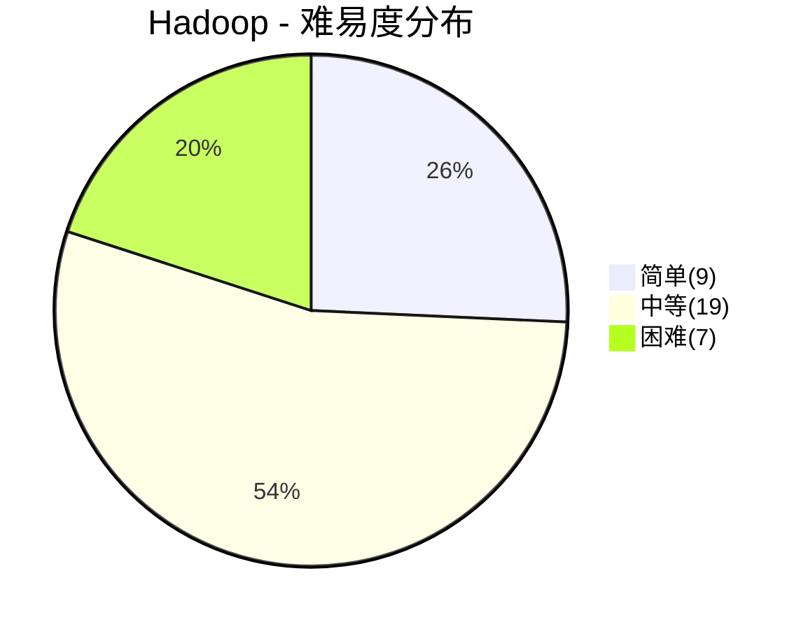
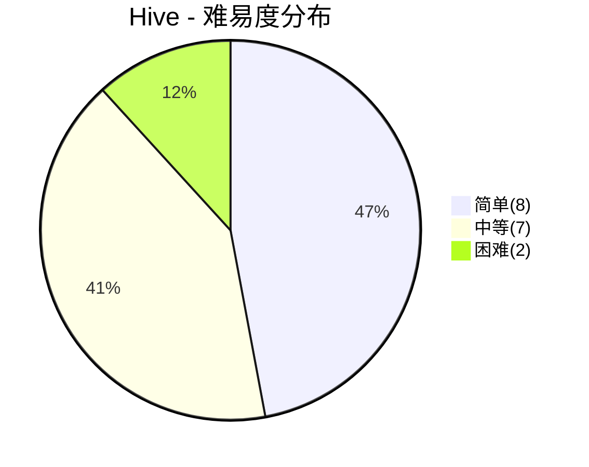
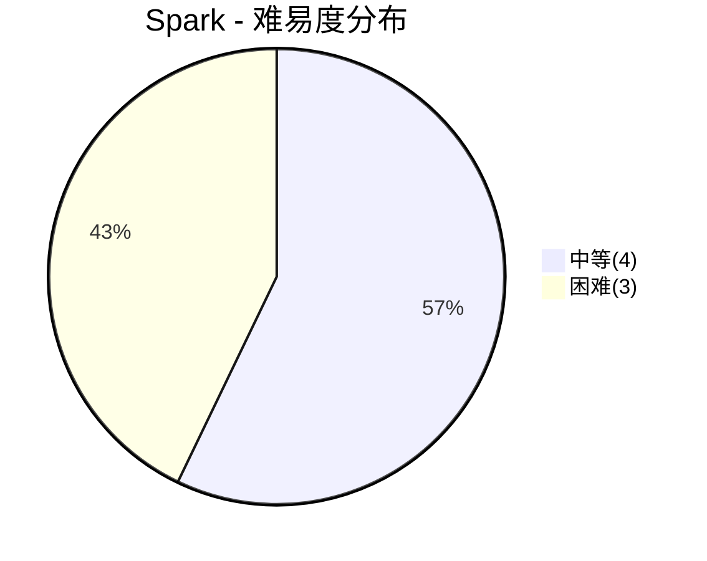
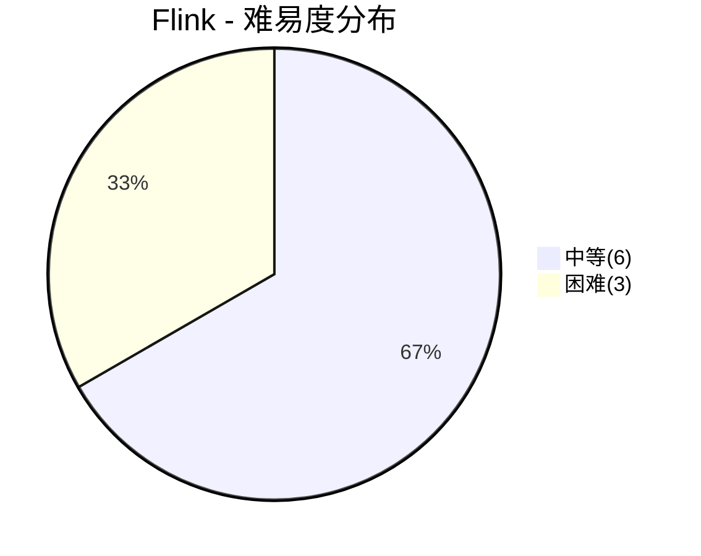
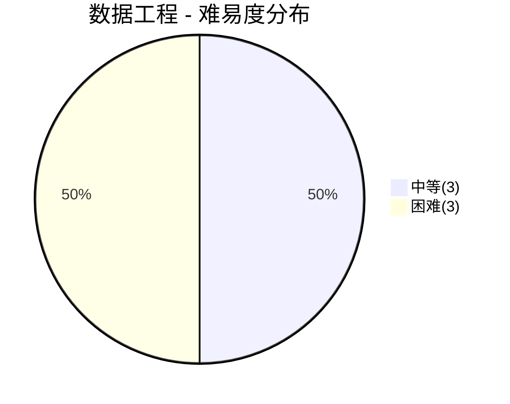

# 大数据面试

> **题库统计**：共收录 **74** 道面试题，覆盖 Hadoop / Hive / Spark / Flink / 数据工程 五大板块。其中简单题 **17** 道（23.0%），中等题 **39** 道（52.7%），困难题 **18** 道（24.3%）。整体以中等难度为主，困难题集中在 HDFS 高可用、数据倾斜调优、Spark 核心机制、Flink 状态容错与数据工程架构设计，适合中高级岗位深度考察。

## 📖 内容

### Hadoop

> - [Hadoop 面试](../16.大数据/Hadoop/Hadoop面试.md)

::: note **统计**：共 **35** 题

- 难易度：| 简单 **9** 题 | 中等 **19** 题 | 困难 **7** 题 |
- 重要度：| 一星 **3** 题 | 二星 **15** 题 | 三星 **7** 题 | 四星 **10** 题 |

:::

```mermaid
pie title Hadoop - 难易度分布
    "简单(9)" : 9
    "中等(19)" : 19
    "困难(7)" : 7
```

| 分类        | 题目                                             | 难易度 | 重要度   | 掌握度 | 评估 |
| :---------- | :----------------------------------------------- | :----- | :------- | :----: | ---- |
| HDFS        | 简介一下大数据技术生态？                         | 简单   | ⭐       |        |      |
| HDFS        | 什么是 HDFS？                                    | 简单   | ⭐⭐     |        |      |
| HDFS        | HDFS 有什么特性（优缺点）？                      | 简单   | ⭐⭐     |        |      |
| YARN        | 什么是 YARN？                                    | 简单   | ⭐⭐     |        |      |
| MapReduce   | 什么是 MapReduce？                               | 简单   | ⭐⭐     |        |      |
| MapReduce   | MapReduce 有什么特性（优缺点）？                 | 简单   | ⭐       |        |      |
| HDFS        | HDFS 的架构是怎样设计的？                        | 中等   | ⭐⭐⭐⭐ |        |      |
| HDFS        | HDFS 使用 NameNode 的好处？                      | 中等   | ⭐⭐     |        |      |
| HDFS        | HDFS 使用 Block 的好处？                         | 中等   | ⭐⭐     |        |      |
| HDFS        | NameNode 与 SecondaryNameNode 的区别与联系？     | 中等   | ⭐⭐⭐⭐ |        |      |
| HDFS        | 什么是 FsImage 和 EditLog？                      | 中等   | ⭐⭐     |        |      |
| YARN        | YARN 有哪些核心组件？                            | 简单   | ⭐⭐⭐   |        |      |
| MapReduce   | MapReduce 有哪些核心组件？                       | 简单   | ⭐⭐     |        |      |
| HDFS        | HDFS 的写数据流程是怎样的？                      | 中等   | ⭐⭐⭐⭐ |        |      |
| HDFS        | HDFS 的读数据流程是怎样的？                      | 中等   | ⭐⭐⭐⭐ |        |      |
| MapReduce   | MapReduce 是如何工作的？                         | 中等   | ⭐⭐⭐⭐ |        |      |
| YARN        | YARN 是如何工作的？                              | 中等   | ⭐⭐⭐⭐ |        |      |
| HDFS        | HDFS 的副本机制是怎样的？                        | 中等   | ⭐⭐     |        |      |
| HDFS        | HDFS 如何保证数据一致性？                        | 中等   | ⭐⭐     |        |      |
| HDFS        | HDFS 有哪些故障类型？如何检测故障？              | 中等   | ⭐⭐     |        |      |
| HDFS        | HDFS 读写故障如何处理？                          | 中等   | ⭐⭐     |        |      |
| HDFS        | DataNode 故障如何处理？                          | 中等   | ⭐⭐     |        |      |
| HDFS        | NameNode 故障如何处理？                          | 中等   | ⭐⭐⭐   |        |      |
| HDFS        | HDFS 安全模式有什么作用？                        | 简单   | ⭐       |        |      |
| 高可用      | HDFS 如何实现高可用？                            | 困难   | ⭐⭐⭐   |        |      |
| 高可用      | NameNode 如何实现主备切换？                      | 困难   | ⭐⭐     |        |      |
| 高可用      | 如何应对 HDFS 脑裂问题？                         | 困难   | ⭐⭐⭐⭐ |        |      |
| 高可用      | YARN 如何实现高可用？                            | 困难   | ⭐⭐     |        |      |
| HDFS        | HDFS 大量小文件会带来什么问题？如何解决？        | 中等   | ⭐⭐⭐⭐ |        |      |
| 高可用      | 什么是 HDFS Federation？                         | 困难   | ⭐⭐⭐   |        |      |
| MapReduce   | MapReduce Shuffle 阶段的排序与合并细节是怎样的？ | 中等   | ⭐⭐⭐⭐ |        |      |
| MapReduce   | 什么是 MapReduce 推测执行？                      | 中等   | ⭐⭐⭐   |        |      |
| MapReduce   | MapReduce 中如何定位和解决数据倾斜？             | 困难   | ⭐⭐⭐⭐ |        |      |
| YARN        | YARN 有哪些资源调度器？它们有什么区别？          | 中等   | ⭐⭐⭐   |        |      |
| Hadoop 安全 | Hadoop 生态的 Kerberos 认证体系如何工作？        | 困难   | ⭐⭐⭐   |        |      |

### Hive

> - [Hive 面试](../16.大数据/Hive/[Hive]面试.md)

::: note **统计**：共 **17** 题

- 难易度：| 简单 **8** 题 | 中等 **7** 题 | 困难 **2** 题 |
- 重要度：| 一星 **3** 题 | 二星 **4** 题 | 三星 **2** 题 | 四星 **5** 题 | 五星 **3** 题 |

:::

```mermaid
pie title Hive - 难易度分布
    "简单(8)" : 8
    "中等(7)" : 7
    "困难(2)" : 2
```

| 分类       | 题目                                  | 难易度 | 重要度     | 掌握度 | 评估 |
| :--------- | :------------------------------------ | :----- | :--------- | :----: | ---- |
| 基础概念   | 什么是 Hive？                         | 简单   | ⭐⭐       |        |      |
| 基础概念   | 什么是 HMS？                          | 简单   | ⭐⭐       |        |      |
| 基础概念   | Hive 支持哪些数据类型？               | 简单   | ⭐         |        |      |
| 执行与优化 | Hive 支持哪些存储格式？               | 简单   | ⭐⭐       |        |      |
| 基础概念   | Hive 中的内部表和外部表有什么区别？   | 简单   | ⭐⭐⭐⭐   |        |      |
| 数据组织   | 什么是分区表？                        | 简单   | ⭐⭐⭐⭐⭐ |        |      |
| 数据组织   | 什么是分桶表？                        | 简单   | ⭐⭐⭐⭐   |        |      |
| 数据组织   | 分区和分桶可以一起使用吗？            | 简单   | ⭐         |        |      |
| 数据组织   | Hive 的索引是如何工作的？             | 中等   | ⭐⭐       |        |      |
| 数据组织   | Hive 索引有什么缺陷？                 | 中等   | ⭐         |        |      |
| 执行与优化 | Hive SQL 如何执行的？                 | 中等   | ⭐⭐⭐⭐   |        |      |
| 执行与优化 | Hive 有哪些高频窗口函数？如何使用？   | 中等   | ⭐⭐⭐⭐⭐ |        |      |
| 执行与优化 | Hive 如何实现行转列和列转行？         | 中等   | ⭐⭐⭐⭐   |        |      |
| 执行与优化 | Hive 的执行引擎有哪些？有什么区别？   | 中等   | ⭐⭐⭐     |        |      |
| 执行与优化 | Hive 支持事务吗？ACID 是如何实现的？  | 困难   | ⭐⭐⭐     |        |      |
| 执行与优化 | ORC 与 Parquet 列式存储的原理是什么？ | 中等   | ⭐⭐⭐⭐   |        |      |
| 执行与优化 | Hive 中如何定位和调优数据倾斜？       | 困难   | ⭐⭐⭐⭐⭐ |        |      |

### Spark

> - [Spark 面试](../16.大数据/Spark/[Spark]面试.md)

::: note **统计**：共 **7** 题

- 难易度：| 中等 **4** 题 | 困难 **3** 题 |
- 重要度：| 四星 **4** 题 | 五星 **3** 题 |

:::

```mermaid
pie title Spark - 难易度分布
    "中等(4)" : 4
    "困难(3)" : 3
```

| 分类      | 题目                                                 | 难易度 | 重要度     | 掌握度 | 评估 |
| :-------- | :--------------------------------------------------- | :----- | :--------- | :----: | ---- |
| Spark核心 | RDD、DataFrame 和 Dataset 有什么区别？               | 中等   | ⭐⭐⭐⭐   |        |      |
| Spark核心 | Spark 的架构设计是怎样的？                           | 中等   | ⭐⭐⭐⭐   |        |      |
| Spark核心 | Spark Shuffle 机制是如何工作的？                     | 困难   | ⭐⭐⭐⭐⭐ |        |      |
| Spark核心 | Spark 如何定位和解决数据倾斜？                       | 困难   | ⭐⭐⭐⭐⭐ |        |      |
| Spark核心 | Spark 的内存管理模型是怎样的？                       | 困难   | ⭐⭐⭐⭐⭐ |        |      |
| Spark生态 | Spark SQL 的 Catalyst 优化器是如何工作的？           | 中等   | ⭐⭐⭐⭐   |        |      |
| Spark生态 | Spark Streaming 和 Structured Streaming 有什么区别？ | 中等   | ⭐⭐⭐⭐   |        |      |

### Flink

> - [Flink 面试](../16.大数据/Flink/[Flink]面试.md)

::: note **统计**：共 **9** 题

- 难易度：| 中等 **6** 题 | 困难 **3** 题 |
- 重要度：| 四星 **6** 题 | 五星 **3** 题 |

:::

```mermaid
pie title Flink - 难易度分布
    "中等(6)" : 6
    "困难(3)" : 3
```

| 分类            | 题目                                           | 难易度 | 重要度     | 掌握度 | 评估 |
| :-------------- | :--------------------------------------------- | :----- | :--------- | :----: | ---- |
| Flink基础       | Flink 的架构设计是怎样的？                     | 中等   | ⭐⭐⭐⭐   |        |      |
| Flink基础       | Flink 的部署模式有哪些？有什么区别？           | 中等   | ⭐⭐⭐⭐   |        |      |
| Flink状态与容错 | Flink 的 Checkpoint 机制是如何工作的？         | 困难   | ⭐⭐⭐⭐⭐ |        |      |
| Flink状态与容错 | Flink 的状态管理有哪些方式？状态后端如何选型？ | 困难   | ⭐⭐⭐⭐⭐ |        |      |
| Flink状态与容错 | Flink 如何保证 Exactly-Once 语义？             | 困难   | ⭐⭐⭐⭐⭐ |        |      |
| Flink窗口与水印 | Flink 的 Watermark 机制是什么？                | 中等   | ⭐⭐⭐⭐   |        |      |
| Flink窗口与水印 | Flink 的 Window 机制有哪些类型？               | 中等   | ⭐⭐⭐⭐   |        |      |
| Flink基础       | Flink 的 API 层次结构是怎样的？                | 中等   | ⭐⭐⭐⭐   |        |      |
| Flink基础       | Flink 的背压机制是如何工作的？                 | 中等   | ⭐⭐⭐⭐   |        |      |

### 数据工程

> - [数据工程 面试](../16.大数据/数据工程/[数据工程]面试.md)

::: note **统计**：共 **6** 题

- 难易度：| 中等 **3** 题 | 困难 **3** 题 |
- 重要度：| 三星 **3** 题 | 四星 **3** 题 |

:::

```mermaid
pie title 数据工程 - 难易度分布
    "中等(3)" : 3
    "困难(3)" : 3
```

| 分类     | 题目                                                                                                    | 难易度 | 重要度   | 掌握度 | 评估 |
| :------- | :------------------------------------------------------------------------------------------------------ | :----- | :------- | :----: | ---- |
| 湖仓一体 | 如何设计现代数据湖仓（Lakehouse）架构？Iceberg / Hudi / Delta Lake 的选型依据与 schema evolution 机制？ | 困难   | ⭐⭐⭐⭐ |        |      |
| CDC      | CDC（变更数据捕获）如何实现？Debezium / Canal 的架构差异与适用场景，以及如何保障端到端数据一致性？      | 困难   | ⭐⭐⭐⭐ |        |      |
| 数据架构 | 数据网格（Data Mesh）的核心理念是什么？如何从单体数据平台演进到领域驱动的去中心化数据架构？             | 中等   | ⭐⭐⭐   |        |      |
| 数据治理 | 数据治理体系如何设计？数据标准、元数据管理、数据权限与安全合规的核心框架与落地路径？                    | 中等   | ⭐⭐⭐   |        |      |
| 数据质量 | 数据质量管理的核心维度有哪些？如何构建数据质量监控体系与问题修复闭环？                                  | 中等   | ⭐⭐⭐   |        |      |
| 数据血缘 | 数据血缘（Data Lineage）如何自动采集与可视化？元数据管理平台如何支撑影响分析与合规审计？                | 困难   | ⭐⭐⭐⭐ |        |      |

### 跨域关联

- [数据库迁移与演进](数据库面试.md#数据库迁移与演进)
- [分布式通信与 RPC](分布式面试.md#分布式通信)
- [云架构与 Serverless](DevOps面试.md#云架构与-serverless)
- [AI Agent 框架](人工智能面试.md#agent)
