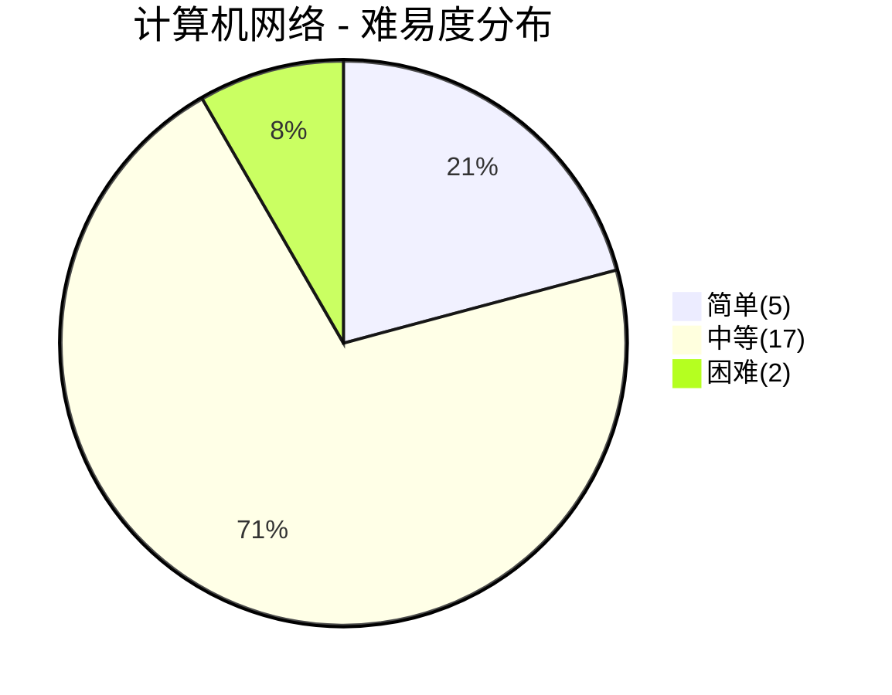
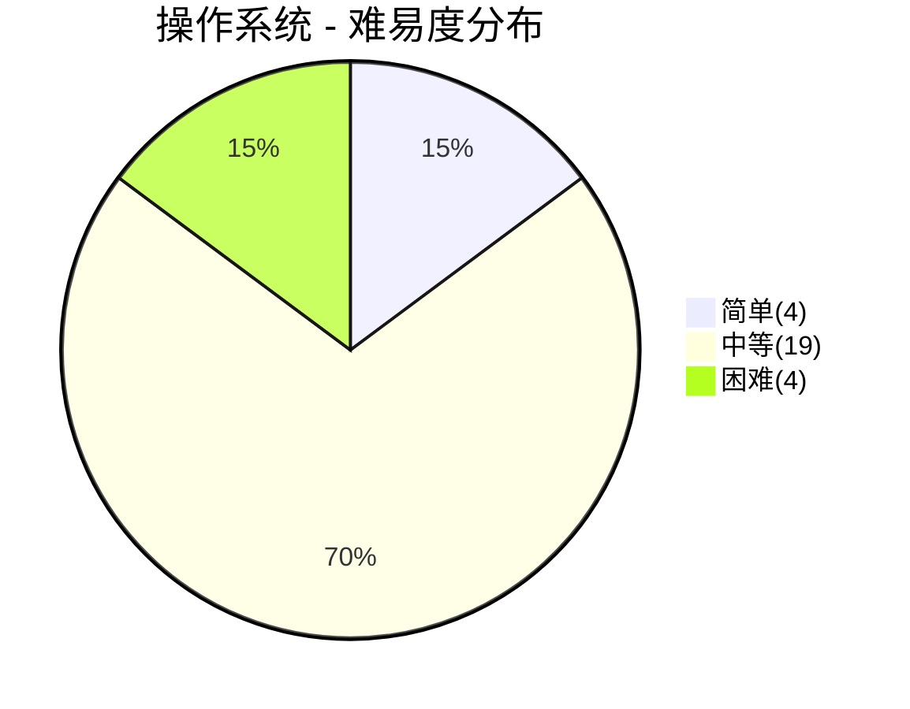

# 计算机基础面试

> **题库统计**：共收录 **51** 道面试题，覆盖 计算机网络 / 操作系统 两大板块。其中简单题 **9** 道（17.6%），中等题 **36** 道（70.6%），困难题 **6** 道（11.8%）。整体以中等难度为主，困难题集中在 TCP 深度原理与 I/O 模型，适合中高级岗位深度考察。

## 📖 内容

### 计算机网络

> - [计算机网络面试](../13.网络/计算机网络面试.md)

::: note **统计**：共 **24** 题

- 难易度：| 简单 **5** 题 | 中等 **17** 题 | 困难 **2** 题 |
- 重要度：| 二星 **7** 题 | 三星 **6** 题 | 四星 **9** 题 | 五星 **2** 题 |

:::

| 分类       | 题目                                                    | 难易度 | 重要度     | 掌握度 | 评估 |
| :--------- | :------------------------------------------------------ | :----- | :--------- | :----: | ---- |
| 网络分层   | 计算机网络如何分层？                                    | 简单   | ⭐⭐       |        |      |
| 网络分层   | 从输入网址到网页显示，期间发生了什么？                  | 困难   | ⭐⭐⭐⭐   |        |      |
| HTTP       | HTTP 1.0 和 2.0 有什么区别？                            | 中等   | ⭐⭐⭐⭐   |        |      |
| HTTP       | HTTP 2.0 和 3.0 有什么区别？                            | 中等   | ⭐⭐⭐     |        |      |
| HTTP       | HTTP 和 HTTPS 有什么区别？                              | 中等   | ⭐⭐⭐⭐   |        |      |
| HTTP       | HTTPS 的加密过程是怎样的？                              | 中等   | ⭐⭐⭐⭐   |        |      |
| HTTP       | HTTP 与 RPC 之间的区别？                                | 中等   | ⭐⭐       |        |      |
| HTTP       | 正向代理和反向代理有什么区别？                          | 中等   | ⭐⭐       |        |      |
| HTTP       | WebSocket 的握手过程是怎样的？                          | 中等   | ⭐⭐⭐     |        |      |
| HTTP       | HTTPS 的证书链验证过程是怎样的？                        | 中等   | ⭐⭐⭐     |        |      |
| TCP        | 什么是 TCP 协议？                                       | 简单   | ⭐⭐       |        |      |
| TCP        | TCP 三次握手的过程是怎样的？                            | 中等   | ⭐⭐⭐⭐⭐ |        |      |
| TCP        | TCP 四次挥手的过程是怎样的？                            | 中等   | ⭐⭐⭐⭐⭐ |        |      |
| TCP        | TCP 滑动窗口原理是什么？                                | 中等   | ⭐⭐⭐⭐   |        |      |
| TCP        | TCP 重传机制是什么？                                    | 中等   | ⭐⭐⭐⭐   |        |      |
| TCP        | TCP 的粘包和拆包能说说吗？                              | 困难   | ⭐⭐⭐     |        |      |
| TCP        | TCP 和 UDP 有什么区别？                                 | 中等   | ⭐⭐⭐⭐   |        |      |
| TCP        | TCP TIME_WAIT 过多是什么原因？如何解决？                | 中等   | ⭐⭐⭐⭐   |        |      |
| DNS        | DNS 解析过程是怎样的？                                  | 简单   | ⭐⭐⭐     |        |      |
| DNS        | DNS 递归查询和迭代查询有什么区别？                      | 简单   | ⭐⭐       |        |      |
| DNS        | 什么是 CDN？                                            | 简单   | ⭐⭐       |        |      |
| 跨域与缓存 | 浏览器的跨域问题是如何产生的？CORS 预检请求是怎么回事？ | 中等   | ⭐⭐       |        |      |
| 跨域与缓存 | HTTP 缓存机制是如何工作的？                             | 中等   | ⭐⭐⭐⭐   |        |      |
| 网络安全   | XSS、CSRF 的攻击原理与 CSP 防御机制是什么？             | 中等   | ⭐⭐⭐     |        |      |

### 操作系统

> - [操作系统面试](../14.操作系统/操作系统面试.md)

::: note **统计**：共 **27** 题

- 难易度：| 简单 **4** 题 | 中等 **19** 题 | 困难 **4** 题 |
- 重要度：| 一星 **1** 题 | 二星 **7** 题 | 三星 **12** 题 | 四星 **7** 题 |

:::

| 分类       | 题目                                                  | 难易度 | 重要度   | 掌握度 | 评估 |
| :--------- | :---------------------------------------------------- | :----- | :------- | :----: | ---- |
| 系统基础   | 什么是操作系统？操作系统有哪些核心功能？              | 简单   | ⭐⭐     |        |      |
| 系统基础   | 什么是用户态和内核态？为什么要区分？                  | 简单   | ⭐⭐⭐   |        |      |
| 系统基础   | 什么是中断和系统调用？它们有什么区别？                | 中等   | ⭐⭐⭐   |        |      |
| 进程与线程 | 什么是进程和线程？二者有什么区别？                    | 中等   | ⭐⭐⭐⭐ |        |      |
| 进程与线程 | 什么是僵尸进程和孤儿进程？如何避免？                  | 中等   | ⭐⭐     |        |      |
| 进程与线程 | 进程有哪些状态？状态之间如何转换？                    | 中等   | ⭐⭐     |        |      |
| 进程与线程 | 进程间通信（IPC）有哪些方式？                         | 中等   | ⭐⭐⭐   |        |      |
| 进程与线程 | 线程间有哪些通信方式？                                | 中等   | ⭐⭐     |        |      |
| 进程与线程 | 常见的线程同步机制有哪些？互斥锁和自旋锁有什么区别？  | 中等   | ⭐⭐⭐   |        |      |
| 进程与线程 | 什么是协程？协程和线程有什么区别？                    | 困难   | ⭐⭐⭐⭐ |        |      |
| 调度       | 常见的进程调度算法有哪些？                            | 中等   | ⭐⭐⭐   |        |      |
| 调度       | Linux 的 CFS 调度算法是如何工作的？                   | 中等   | ⭐⭐⭐   |        |      |
| 调度       | 什么是上下文切换？为什么开销大？                      | 中等   | ⭐⭐⭐   |        |      |
| 死锁       | 什么是死锁？死锁产生的四个必要条件是什么？            | 中等   | ⭐⭐⭐⭐ |        |      |
| 死锁       | 如何预防、避免和处理死锁？                            | 困难   | ⭐⭐⭐   |        |      |
| 内存管理   | 什么是虚拟内存？为什么需要虚拟内存？                  | 中等   | ⭐⭐⭐⭐ |        |      |
| 内存管理   | 缺页中断的处理流程是怎样的？                          | 中等   | ⭐⭐⭐   |        |      |
| 内存管理   | 什么是写时复制（COW）？                               | 中等   | ⭐⭐⭐   |        |      |
| 内存管理   | 分页和分段有什么区别？                                | 中等   | ⭐⭐     |        |      |
| 内存管理   | 什么是页面置换算法？有哪些常见的算法？                | 中等   | ⭐⭐⭐   |        |      |
| I/O模型    | 什么是 I/O 多路复用？select、poll、epoll 有什么区别？ | 困难   | ⭐⭐⭐⭐ |        |      |
| I/O模型    | 什么是零拷贝？mmap 和 sendfile 有什么区别？           | 困难   | ⭐⭐⭐⭐ |        |      |
| I/O模型    | 什么是阻塞 I/O、非阻塞 I/O、同步 I/O、异步 I/O？      | 中等   | ⭐⭐⭐   |        |      |
| Linux      | Linux 的文件系统层次结构是什么？                      | 简单   | ⭐       |        |      |
| Linux      | Linux 中的硬链接和软链接有什么区别？                  | 简单   | ⭐⭐     |        |      |
| Linux      | 如何在 Linux 中排查性能问题？常用哪些命令？           | 中等   | ⭐⭐⭐⭐ |        |      |
| Linux      | 什么是 CC 攻击、DDoS 攻击和 SQL 注入？                | 中等   | ⭐⭐     |        |      |

### 跨域关联

- [Java 基础](JavaCore面试.md#java-基础)
- [Java 并发编程](JavaCore面试.md#java-并发)
- [MySQL 基础](数据库面试.md#mysql)
- [Kubernetes 容器编排](DevOps面试.md#kubernetes)
