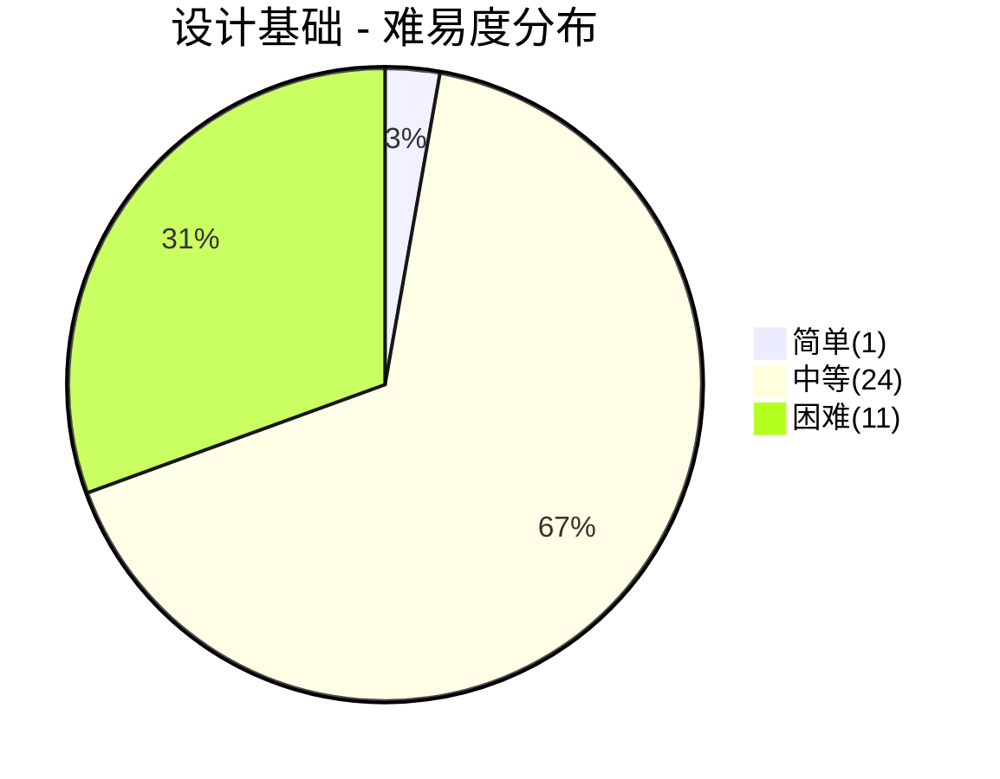
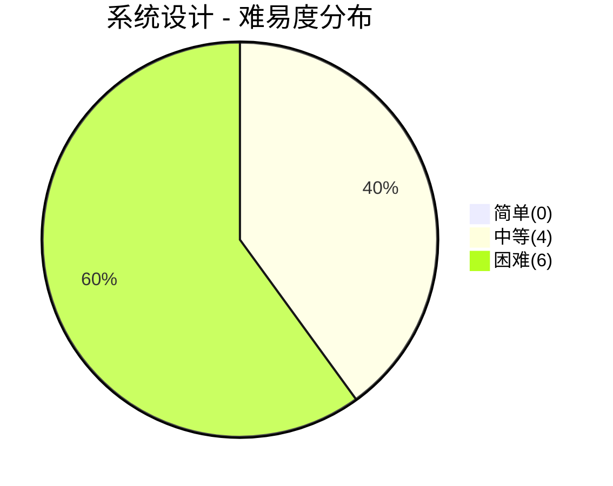
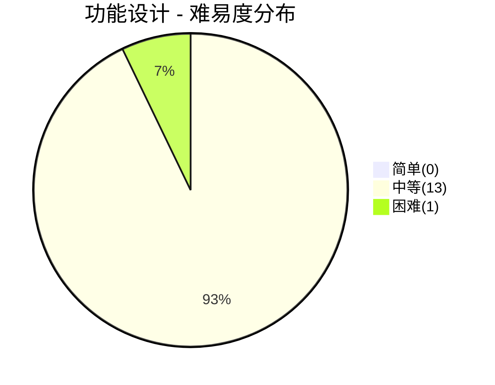
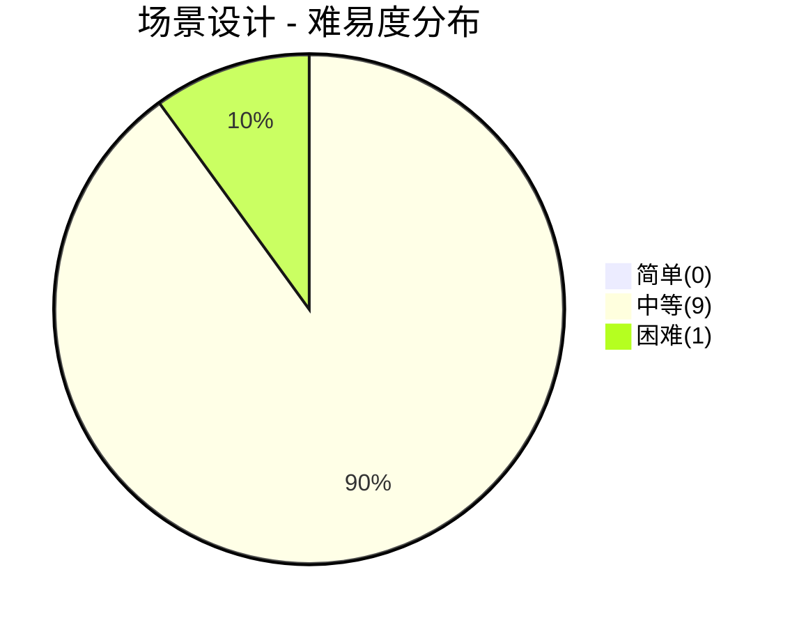
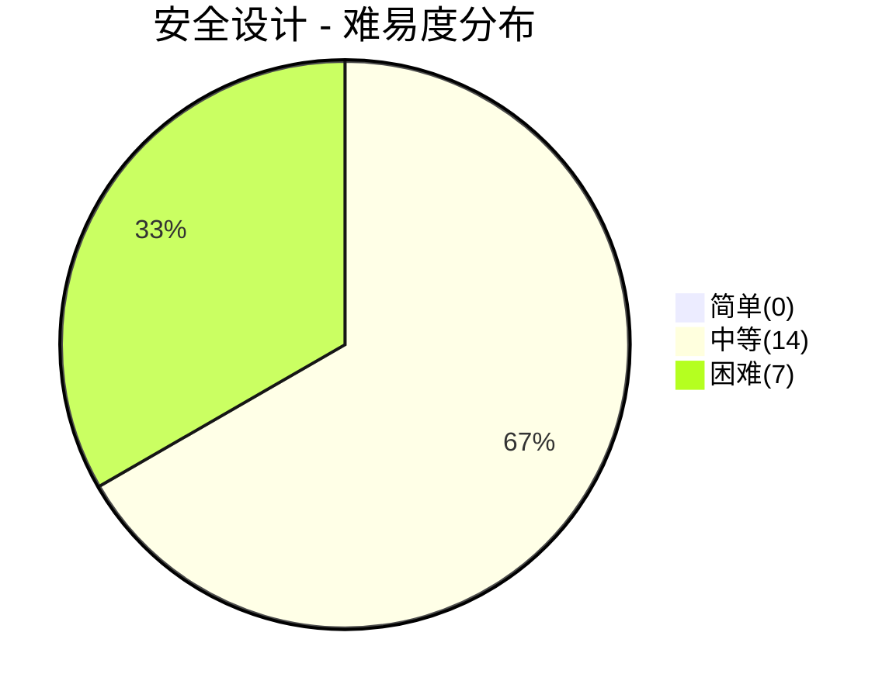
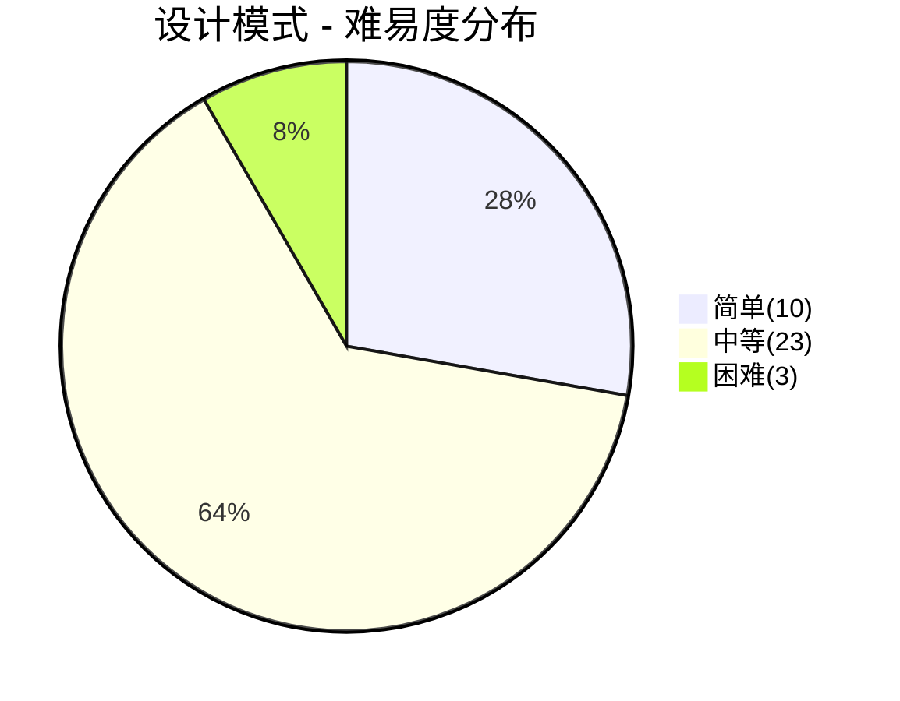

# 设计面试

> **题库统计**：共收录 **127** 道面试题，覆盖 设计基础 / 系统设计 / 功能设计 / 场景设计 / 安全设计 / 设计模式 六大板块。其中简单题 **11** 道（8.7%），中等题 **87** 道（68.5%），困难题 **29** 道（22.8%）。整体以中等难度为主，困难题集中在安全设计和系统设计板块，适合高级岗位深度考察。

## 📖 内容

### 设计基础

> - [设计基础面试](../03.设计/面试/[设计][面试]基础.md)

::: note **统计**：共 **36** 题

- 难易度：| 简单 **1** 题 | 中等 **24** 题 | 困难 **11** 题 |
- 重要度：| 二星 **3** 题 | 三星 **9** 题 | 四星 **22** 题 | 五星 **2** 题 |

:::

| 分类         | 题目                                                     | 难易度 | 重要度     | 掌握度 | 评估 |
| :----------- | :------------------------------------------------------- | :----- | :--------- | :----: | ---- |
| 架构设计     | 一个单体项目整体吞吐达到 1 万 QPS，要微服务化拆分吗？    | 中等   | ⭐⭐⭐⭐   |   ✅   | ✅   |
| 架构设计     | 项目上线后，一般要关注哪些指标？                         | 中等   | ⭐⭐⭐     |   ✅   | ✅   |
| 架构设计     | 跨海外业务请求延迟大怎么办？                             | 中等   | ⭐⭐       |        |      |
| 架构设计     | 如何设计一个高并发系统？                                 | 困难   | ⭐⭐⭐⭐⭐ |   ✅   | ✅   |
| 架构设计     | 如何设计异地多活/容灾架构？                              | 困难   | ⭐⭐⭐⭐⭐ |   ✅   | ✅   |
| 架构设计     | 如何做系统容量评估与压测？                               | 中等   | ⭐⭐⭐⭐   |   ⚠️   | ⚠️   |
| 架构设计     | 如何估算一个技术方案的资源成本？                         | 中等   | ⭐⭐⭐⭐   |   ✅   | ✅   |
| 架构设计     | 系统设计中有哪些常见的成本优化手段？                     | 中等   | ⭐⭐⭐     |   ⚠️   | ⚠️   |
| 架构设计     | 如何在架构演进中做成本治理（FinOps）？                   | 困难   | ⭐⭐⭐     |   ❌   | ❌   |
| 架构设计     | 如何用 DDD 指导系统设计与微服务拆分？                    | 中等   | ⭐⭐⭐⭐   |   ⚠️   | ⚠️   |
| 架构设计     | 什么是贫血模型与充血模型？为什么 DDD 推荐充血模型？      | 中等   | ⭐⭐⭐⭐   |   ❌   | ❌   |
| 架构设计     | 如何设计聚合与聚合根？有哪些原则？                       | 困难   | ⭐⭐⭐⭐   |   ❌   | ❌   |
| 架构设计     | 什么是防腐层（ACL）？什么场景需要它？                    | 中等   | ⭐⭐⭐     |   ❌   | ❌   |
| 架构设计     | 什么是 CQRS 与事件溯源？什么场景适用？                   | 困难   | ⭐⭐⭐⭐   |   ❌   | ❌   |
| 架构设计     | 如何设计领域事件与事件驱动架构？                         | 中等   | ⭐⭐⭐⭐   |   ❌   | ❌   |
| 架构设计     | 架构如何演进：从单体、SOA、微服务到云原生？              | 中等   | ⭐⭐⭐⭐   |   ❌   | ❌   |
| 架构设计     | 什么是六边形架构？与分层架构、整洁架构有何区别？         | 中等   | ⭐⭐⭐     |   ❌   | ❌   |
| 架构设计     | 架构师需要掌握哪些延迟数量级？                           | 中等   | ⭐⭐⭐⭐   |        |      |
| UML 与重构   | UML 有哪些图？类图中有哪些关系？                         | 简单   | ⭐⭐       |   ⚠️   | ⚠️   |
| UML 与重构   | 什么是代码坏味道？何时重构、有哪些常用手法？             | 中等   | ⭐⭐⭐⭐   |   ❌   | ❌   |
| 分布式设计   | 如何设计一个网关？                                       | 中等   | ⭐⭐⭐⭐   |   ⚠️   | ⚠️   |
| 分布式设计   | 如何设计一个 RPC 框架？                                  | 困难   | ⭐⭐⭐⭐   |   ✅   | ✅   |
| 分布式设计   | 如何设计一个 MQ？                                        | 困难   | ⭐⭐⭐⭐   |        |      |
| 分布式设计   | 如何设计一个分布式锁？                                   | 困难   | ⭐⭐⭐⭐   |        |      |
| 分布式设计   | 如何设计一个分布式 ID 发号器？                           | 中等   | ⭐⭐⭐⭐   |        |      |
| 分布式设计   | 如何设计一个配置中心？                                   | 中等   | ⭐⭐⭐     |        |      |
| 分布式设计   | 如何实现链路追踪？                                       | 中等   | ⭐⭐⭐     |        |      |
| 分布式设计   | 如何实现分布式事务？                                     | 困难   | ⭐⭐⭐⭐   |        |      |
| 分布式设计   | 如何实现流量控制？                                       | 困难   | ⭐⭐⭐⭐   |        |      |
| 分布式设计   | 服务重启时，如何避免客户端重连引发的流量洪峰？           | 中等   | ⭐⭐       |        |      |
| 分布式设计   | 如何设计一个高可用系统？                                 | 困难   | ⭐⭐⭐⭐   |        |      |
| 问题排查解决 | 接口响应慢如何排查？                                     | 中等   | ⭐⭐⭐⭐   |        |      |
| 问题排查解决 | 系统每天晚上都会有一小时左右的时间瘫痪，可能原因是什么？ | 中等   | ⭐⭐⭐     |        |      |
| 问题排查解决 | 线上服务器 CPU 飙升如何排查？                            | 中等   | ⭐⭐⭐⭐   |        |      |
| 问题排查解决 | 线上数据库连接池打满如何排查？                           | 中等   | ⭐⭐⭐     |        |      |
| 问题排查解决 | 线上 OOM 和频繁 Full GC 如何排查？                       | 中等   | ⭐⭐⭐⭐   |        |      |

### 系统设计

> - [系统设计面试](../03.设计/面试/[设计][面试]系统.md)

::: note **统计**：共 **10** 题

- 难易度：| 简单 **0** 题 | 中等 **4** 题 | 困难 **6** 题 |
- 重要度：| 三星 **2** 题 | 四星 **5** 题 | 五星 **3** 题 |

:::

| 分类     | 题目                                      | 难易度 | 重要度     | 掌握度 | 评估 |
| :------- | :---------------------------------------- | :----- | :--------- | :----: | ---- |
| 系统设计 | 如何设计一个秒杀系统？                    | 困难   | ⭐⭐⭐⭐⭐ |        |      |
| 系统设计 | 如何设计一个文件上传系统？                | 中等   | ⭐⭐⭐     |        |      |
| 系统设计 | 如何设计一个单点登录系统（SSO）？         | 中等   | ⭐⭐⭐⭐   |        |      |
| 系统设计 | 如何实现微信扫码登录？                    | 中等   | ⭐⭐⭐     |        |      |
| 系统设计 | 如何设计一个短链服务？                    | 中等   | ⭐⭐⭐⭐⭐ |        |      |
| 系统设计 | 如何设计一个 Feed 流系统（朋友圈/微博）？ | 困难   | ⭐⭐⭐⭐   |        |      |
| 系统设计 | 如何设计一个 IM 即时通讯系统？            | 困难   | ⭐⭐⭐⭐   |        |      |
| 系统设计 | 如何设计一个订单系统？                    | 困难   | ⭐⭐⭐⭐⭐ |        |      |
| 系统设计 | 如何设计一个营销/优惠券系统？             | 困难   | ⭐⭐⭐⭐   |        |      |
| 系统设计 | 如何设计一个支付系统？                    | 困难   | ⭐⭐⭐⭐   |        |      |

### 功能设计

> - [功能设计面试](../03.设计/面试/[设计][面试]功能.md)

::: note **统计**：共 **14** 题

- 难易度：| 简单 **0** 题 | 中等 **13** 题 | 困难 **1** 题 |
- 重要度：| 一星 **0** 题 | 二星 **5** 题 | 三星 **4** 题 | 四星 **4** 题 | 五星 **1** 题 |

:::

| 分类     | 题目                                               | 难易度 | 重要度     | 掌握度 | 评估 |
| :------- | :------------------------------------------------- | :----- | :--------- | :----: | ---- |
| 功能设计 | 如何设计一个排行榜功能？                           | 中等   | ⭐⭐⭐     |        |      |
| 功能设计 | 如何设计一个点赞功能？                             | 中等   | ⭐⭐       |        |      |
| 功能设计 | 如何实现一个订单超时取消功能？                     | 中等   | ⭐⭐⭐⭐   |        |      |
| 功能设计 | 如何解决订单重复支付情况？                         | 中等   | ⭐⭐⭐     |        |      |
| 功能设计 | 如何实现一个分布式单例对象？                       | 中等   | ⭐⭐       |        |      |
| 功能设计 | 如何实现接口每分钟调用统计功能？                   | 中等   | ⭐⭐       |        |      |
| 功能设计 | 如何设计一个购物车功能？                           | 中等   | ⭐⭐       |        |      |
| 功能设计 | 如何设计一个抢红包功能？                           | 中等   | ⭐⭐⭐⭐⭐ |        |      |
| 功能设计 | 如何设计一个取消订单功能？                         | 中等   | ⭐⭐       |        |      |
| 功能设计 | 如何避免用户重复下单（多次下单为支持，占用库存）？ | 中等   | ⭐⭐⭐⭐   |        |      |
| 功能设计 | 如何设计数据同步方案（同步到数仓）？               | 困难   | ⭐⭐⭐⭐   |        |      |
| 功能设计 | 如何实现数据的不停服迁移？                         | 中等   | ⭐⭐⭐     |        |      |
| 功能设计 | 如何快速找到附近距离用户最近的 N 家商户？          | 中等   | ⭐⭐⭐     |        |      |
| 功能设计 | 调用第三方接口应注意哪些问题？                     | 中等   | ⭐⭐⭐⭐   |        |      |

### 场景设计

> - [场景设计面试](../03.设计/面试/[设计][面试]场景.md)

::: note **统计**：共 **10** 题

- 难易度：| 简单 **0** 题 | 中等 **9** 题 | 困难 **1** 题 |
- 重要度：| 二星 **2** 题 | 三星 **7** 题 | 四星 **1** 题 |

:::

| 分类     | 题目                                                                                                   | 难易度 | 重要度   | 掌握度 | 评估 |
| :------- | :----------------------------------------------------------------------------------------------------- | :----- | :------- | :----: | ---- |
| 场景设计 | 如何在 10 亿个数据中找到最大的 1 万个？                                                                | 中等   | ⭐⭐⭐   |        |      |
| 场景设计 | 有几台机器存储着几亿的淘宝搜索日志，假设你只有一台 2g 的电脑，如何选出搜索热度最高的十个关键词？       | 中等   | ⭐⭐⭐   |        |      |
| 场景设计 | 一张表里有三个字段（id，开始时间，结束时间），表中数据量为 5000W，如何统计流量最大的时候有多少条数据？ | 中等   | ⭐⭐     |        |      |
| 场景设计 | 有 40 亿个 ID，在 1G 内存中进行去重，如何实现？                                                        | 中等   | ⭐⭐⭐   |        |      |
| 场景设计 | 如果有 500G 数据需要排序，但是只有 4G 内存，如何实现？                                                 | 中等   | ⭐⭐⭐   |        |      |
| 场景设计 | 如何导入百万数据量级的 Excel 到数据库？                                                                | 中等   | ⭐⭐⭐   |        |      |
| 场景设计 | Excel 导出场景很慢，如何优化？                                                                         | 中等   | ⭐⭐⭐   |        |      |
| 场景设计 | 假设生产者-消费者模型中有 200 万个生产者，只有 1 个消费者，如何实现？                                  | 中等   | ⭐⭐     |        |      |
| 场景设计 | 如何对 500 万会员提前 7 天进行过期提醒？                                                               | 中等   | ⭐⭐⭐   |        |      |
| 场景设计 | 如何设计一个消息推送系统（千万级用户）？                                                               | 困难   | ⭐⭐⭐⭐ |        |      |

### 安全设计

> - [安全设计面试](../03.设计/面试/[设计][面试]安全.md)

::: note **统计**：共 **21** 题

- 难易度：| 简单 **0** 题 | 中等 **14** 题 | 困难 **7** 题 |
- 重要度：| 二星 **3** 题 | 三星 **12** 题 | 四星 **5** 题 | 五星 **1** 题 |

:::

| 分类     | 题目                                                                                     | 难易度 | 重要度     | 掌握度 | 评估 |
| :------- | :--------------------------------------------------------------------------------------- | :----- | :--------- | :----: | ---- |
| 安全设计 | 如何设计一个接口签名验证机制？                                                           | 中等   | ⭐⭐⭐     |        |      |
| 安全设计 | 如何实现敏感词过滤功能？                                                                 | 中等   | ⭐⭐⭐     |        |      |
| 安全设计 | 接口中的敏感数据（如身份证号、手机号）应该如何保护？                                     | 中等   | ⭐⭐⭐     |        |      |
| 安全设计 | 加密后的数据怎么支持模糊搜索？                                                           | 中等   | ⭐⭐       |        |      |
| 安全设计 | 如何防止接口被恶意刷量？                                                                 | 中等   | ⭐⭐⭐     |        |      |
| 安全设计 | 如何设计缓存与数据库的一致性方案？                                                       | 困难   | ⭐⭐⭐⭐   |        |      |
| 安全设计 | 如何实现一个滑动验证码功能？如何防止被机器识别破解？                                     | 中等   | ⭐⭐⭐     |        |      |
| 安全设计 | 短信验证码如何防止被恶意轰炸？                                                           | 中等   | ⭐⭐       |        |      |
| 安全设计 | 如何在涉及金钱的场景，避免因人为配置失误（如折扣粒度配错、优惠金额配错），导致资金损失？ | 中等   | ⭐⭐⭐     |        |      |
| 安全设计 | 如何保证 JWT 安全？                                                                      | 中等   | ⭐⭐⭐⭐   |        |      |
| 安全设计 | 如何防止 CDN 链接被盗刷？                                                                | 中等   | ⭐⭐       |        |      |
| 安全设计 | 有哪些常见的安全漏洞？什么原因导致的，有什么样的危害，如何应对？                         | 困难   | ⭐⭐⭐⭐   |        |      |
| 安全设计 | 如何设计一个 OAuth 2.0 服务？                                                            | 困难   | ⭐⭐⭐⭐   |        |      |
| 安全设计 | 如何设计防越权体系？水平越权和垂直越权分别如何防护？                                     | 困难   | ⭐⭐⭐⭐⭐ |        |      |
| 安全设计 | 如何设计密钥管理体系？密钥如何存储、分发与轮换？                                         | 困难   | ⭐⭐⭐⭐   |        |      |
| 安全设计 | 数据脱敏有哪些方案？静态脱敏与动态脱敏如何选型？                                         | 中等   | ⭐⭐⭐     |        |      |
| 安全设计 | 什么是零信任架构？如何在企业内落地？                                                     | 困难   | ⭐⭐⭐     |        |      |
| 安全设计 | 如何保障软件供应链安全？                                                                 | 中等   | ⭐⭐⭐     |        |      |
| 安全设计 | 如何设计安全审计日志？哪些操作必须留痕？                                                 | 中等   | ⭐⭐⭐     |        |      |
| 安全设计 | 证书与 mTLS 如何管理？大规模服务的证书轮换如何自动化？                                   | 困难   | ⭐⭐⭐     |        |      |
| 安全设计 | SSRF、XXE、文件上传漏洞的原理与防御？                                                    | 中等   | ⭐⭐⭐     |        |      |

### 设计模式

> - [设计模式面试](../03.设计/面试/[设计][面试]设计模式.md)

::: note **统计**：共 **36** 题

- 难易度：| 简单 **10** 题 | 中等 **23** 题 | 困难 **3** 题 |
- 重要度：| 一星 **1** 题 | 二星 **15** 题 | 三星 **6** 题 | 四星 **11** 题 | 五星 **3** 题 |

:::

| 分类       | 题目                                                 | 难易度 | 重要度     | 掌握度 | 评估 |
| :--------- | :--------------------------------------------------- | :----- | :--------- | :----: | ---- |
| 综述       | 什么是设计模式？                                     | 简单   | ⭐⭐       |        |      |
| 综述       | 有哪些经典的设计模式？                               | 简单   | ⭐⭐       |        |      |
| 综述       | 什么是面向对象五大原则（SOLID）？                    | 简单   | ⭐⭐⭐⭐   |        |      |
| 综述       | 如何识别代码中违反 SOLID 原则的案例？                | 中等   | ⭐⭐⭐⭐   |        |      |
| 综述       | 什么是迪米特法则？                                   | 简单   | ⭐         |        |      |
| 综述       | 什么是合成复用原则？                                 | 简单   | ⭐⭐       |        |      |
| 创建型模式 | 什么是单例模式？                                     | 简单   | ⭐⭐⭐⭐   |        |      |
| 创建型模式 | 单例模式有哪几种实现？如何保证线程安全？             | 困难   | ⭐⭐⭐⭐⭐ |        |      |
| 创建型模式 | 什么是简单工厂模式？                                 | 中等   | ⭐⭐       |        |      |
| 创建型模式 | 什么是工厂方法模式？                                 | 中等   | ⭐⭐⭐⭐   |        |      |
| 创建型模式 | 什么是抽象工厂模式？                                 | 中等   | ⭐⭐       |        |      |
| 创建型模式 | 工厂模式和抽象工厂模式有什么区别？                   | 中等   | ⭐⭐⭐     |        |      |
| 创建型模式 | 什么是建造者模式？                                   | 中等   | ⭐⭐⭐     |        |      |
| 创建型模式 | 什么是原型模式？                                     | 中等   | ⭐⭐       |        |      |
| 结构型模式 | 什么是适配器模式？                                   | 中等   | ⭐⭐⭐     |        |      |
| 结构型模式 | 什么是桥接模式？                                     | 简单   | ⭐⭐       |        |      |
| 结构型模式 | 什么是组合模式？                                     | 简单   | ⭐⭐       |        |      |
| 结构型模式 | 什么是装饰器模式？                                   | 中等   | ⭐⭐⭐⭐   |        |      |
| 结构型模式 | 什么是外观模式？                                     | 中等   | ⭐⭐       |        |      |
| 结构型模式 | 什么是享元模式？                                     | 中等   | ⭐⭐       |        |      |
| 结构型模式 | 什么是代理模式？                                     | 中等   | ⭐⭐⭐⭐   |        |      |
| 结构型模式 | 装饰器、适配器、代理、桥接这四种设计模式有什么区别？ | 中等   | ⭐⭐⭐     |        |      |
| 行为型模式 | 什么是模板方法模式？                                 | 中等   | ⭐⭐⭐⭐   |        |      |
| 行为型模式 | 什么是策略模式？                                     | 中等   | ⭐⭐⭐⭐   |        |      |
| 行为型模式 | 什么是观察者模式？                                   | 中等   | ⭐⭐⭐⭐   |        |      |
| 行为型模式 | 什么是状态模式？                                     | 中等   | ⭐⭐⭐     |        |      |
| 行为型模式 | 什么是职责链模式？                                   | 中等   | ⭐⭐⭐⭐   |        |      |
| 行为型模式 | 什么是命令模式？                                     | 中等   | ⭐⭐⭐     |        |      |
| 行为型模式 | 什么是迭代器模式？                                   | 简单   | ⭐⭐       |        |      |
| 行为型模式 | 什么是中介者模式？                                   | 简单   | ⭐⭐       |        |      |
| 行为型模式 | 什么是访问者模式？                                   | 困难   | ⭐⭐       |        |      |
| 行为型模式 | 什么是备忘录模式？                                   | 中等   | ⭐⭐       |        |      |
| 行为型模式 | 什么是解释器模式？                                   | 中等   | ⭐⭐       |        |      |
| 综合       | 说说 JDK 和 Spring 源码中用到了哪些设计模式？        | 困难   | ⭐⭐⭐⭐   |        |      |
| 综合       | 实际业务场景中如何选型设计模式？                     | 中等   | ⭐⭐⭐⭐⭐ |        |      |
| 综合       | 如何用设计模式消除大量 if-else 硬编码？              | 中等   | ⭐⭐⭐⭐⭐ |        |      |
