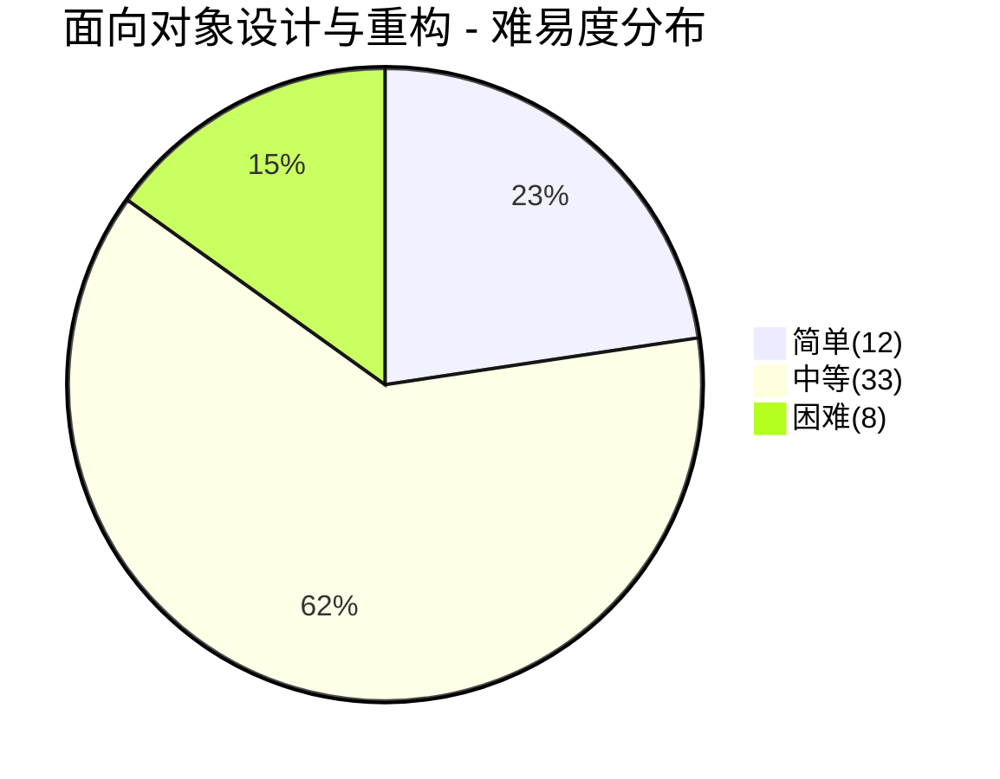
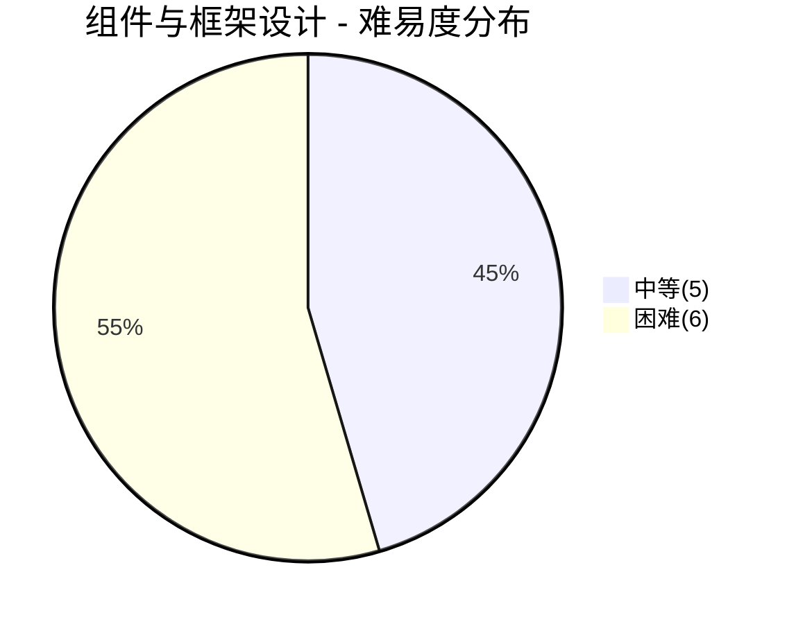
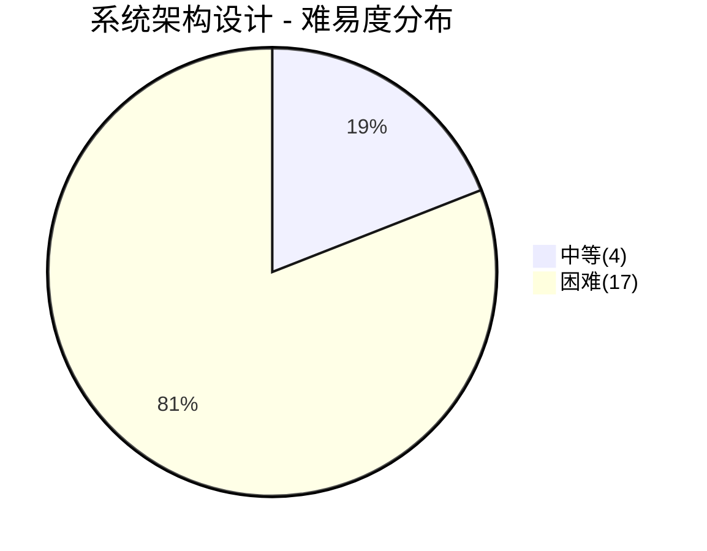
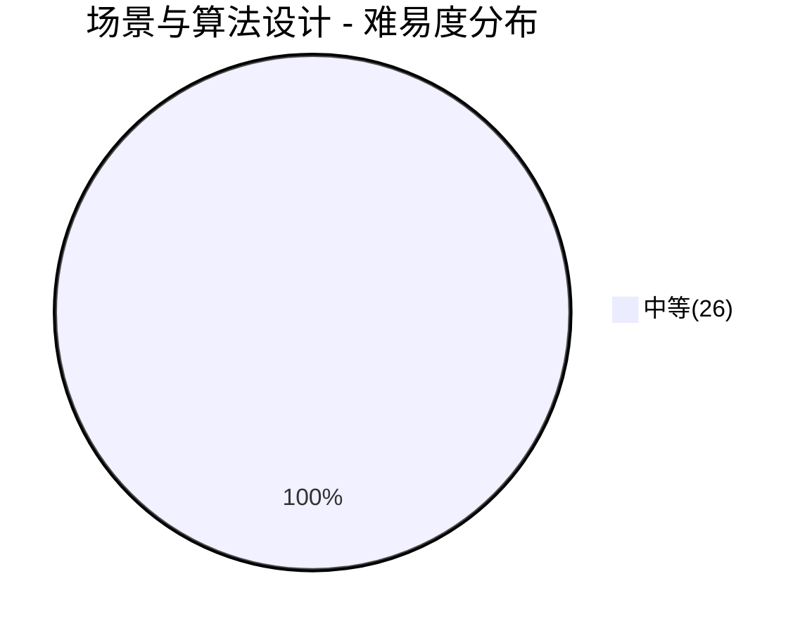
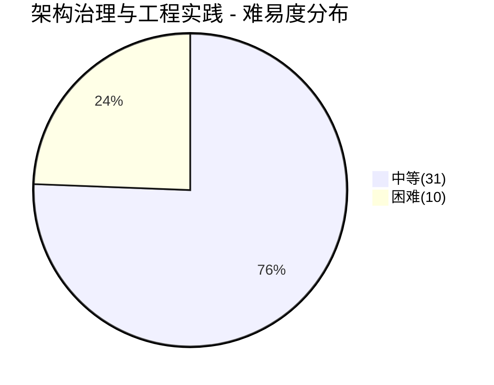

# 设计面试

> **题库统计**：共收录 **152** 道面试题，覆盖 面向对象设计与重构 / 组件与框架设计 / 系统架构设计 / 场景与算法设计 / 架构治理与工程实践 五大板块。其中简单题 **12** 道（7.9%），中等题 **99** 道（65.1%），困难题 **41** 道（27.0%）。按知识粒度从微观到宏观排列：类级建模→组件设计→系统架构→场景解题→工程治理，覆盖大厂设计面试完整能力梯度。

## 📖 内容

### 面向对象设计与重构

> **考察能力**：类级建模与代码组织能力——能否用 SOLID 原则指导设计、用 GoF 模式解决特定问题、用 UML 表达设计意图、在约束条件下完成从需求到类图的 LLD 推演。本板块覆盖从原则（为什么）→ 模式（用什么）→ 实战（怎么用）的完整链路，是初级到中级工程师的核心考察区。

::: tip **题库**

- [面向对象设计与重构面试](../03.设计/面试/[设计][面试]面向对象设计与重构.md)

:::

::: note **统计**：共 **53** 题

- 难易度：| 简单 **12** 题 | 中等 **33** 题 | 困难 **8** 题 |
- 重要度：| 一星 **1** 题 | 二星 **17** 题 | 三星 **13** 题 | 四星 **18** 题 | 五星 **4** 题 |

:::

| 分类                 | 题目                                                     | 难易度 | 重要度     | 掌握度 | 评估 |
| :------------------- | :------------------------------------------------------- | :----- | :--------- | :----: | ---- |
| UML 与重构           | UML 有哪些图？类图中有哪些关系？                         | 简单   | ⭐⭐       |   ⚠️   | ⚠️   |
| UML 与重构           | 什么是代码坏味道？何时重构、有哪些常用手法？             | 中等   | ⭐⭐⭐⭐   |   ❌   | ❌   |
| 设计模式导论         | 什么是设计模式？                                         | 简单   | ⭐⭐       |        |      |
| 设计模式导论         | 有哪些经典的设计模式？                                   | 简单   | ⭐⭐       |        |      |
| 面向对象设计原则     | 什么是面向对象五大原则（SOLID）？                        | 简单   | ⭐⭐⭐⭐   |        |      |
| 面向对象设计原则     | 如何识别代码中违反 SOLID 原则的案例？                    | 中等   | ⭐⭐⭐⭐   |        |      |
| 面向对象设计原则     | 什么是迪米特法则？                                       | 简单   | ⭐         |        |      |
| 面向对象设计原则     | 什么是合成复用原则？                                     | 简单   | ⭐⭐       |        |      |
| 设计模式             | 什么是单例模式？                                         | 简单   | ⭐⭐⭐⭐   |        |      |
| 设计模式             | 单例模式有哪几种实现？如何保证线程安全？                 | 困难   | ⭐⭐⭐⭐⭐ |        |      |
| 设计模式             | 什么是简单工厂模式？                                     | 中等   | ⭐⭐       |        |      |
| 设计模式             | 什么是工厂方法模式？                                     | 中等   | ⭐⭐⭐⭐   |        |      |
| 设计模式             | 什么是抽象工厂模式？                                     | 中等   | ⭐⭐       |        |      |
| 设计模式             | 工厂模式和抽象工厂模式有什么区别？                       | 中等   | ⭐⭐⭐     |        |      |
| 设计模式             | 什么是建造者模式？                                       | 中等   | ⭐⭐⭐     |        |      |
| 设计模式             | 什么是原型模式？                                         | 中等   | ⭐⭐       |        |      |
| 设计模式             | 什么是适配器模式？                                       | 中等   | ⭐⭐⭐     |        |      |
| 设计模式             | 什么是桥接模式？                                         | 简单   | ⭐⭐       |        |      |
| 设计模式             | 什么是组合模式？                                         | 简单   | ⭐⭐       |        |      |
| 设计模式             | 什么是装饰器模式？                                       | 中等   | ⭐⭐⭐⭐   |        |      |
| 设计模式             | 什么是外观模式？                                         | 中等   | ⭐⭐       |        |      |
| 设计模式             | 什么是享元模式？                                         | 中等   | ⭐⭐       |        |      |
| 设计模式             | 什么是代理模式？                                         | 中等   | ⭐⭐⭐⭐   |        |      |
| 设计模式             | 装饰器、适配器、代理、桥接这四种设计模式有什么区别？     | 中等   | ⭐⭐⭐     |        |      |
| 设计模式             | 什么是模板方法模式？                                     | 中等   | ⭐⭐⭐⭐   |        |      |
| 设计模式             | 什么是策略模式？                                         | 中等   | ⭐⭐⭐⭐   |        |      |
| 设计模式             | 什么是观察者模式？                                       | 中等   | ⭐⭐⭐⭐   |        |      |
| 设计模式             | 什么是状态模式？                                         | 中等   | ⭐⭐⭐     |        |      |
| 设计模式             | 什么是职责链模式？                                       | 中等   | ⭐⭐⭐⭐   |        |      |
| 设计模式             | 什么是命令模式？                                         | 中等   | ⭐⭐⭐     |        |      |
| 设计模式             | 什么是迭代器模式？                                       | 简单   | ⭐⭐       |        |      |
| 设计模式             | 什么是中介者模式？                                       | 简单   | ⭐⭐       |        |      |
| 设计模式             | 什么是访问者模式？                                       | 困难   | ⭐⭐       |        |      |
| 设计模式             | 什么是备忘录模式？                                       | 中等   | ⭐⭐       |        |      |
| 设计模式             | 什么是解释器模式？                                       | 中等   | ⭐⭐       |        |      |
| 模式选型与源码实战   | 说说 JDK 和 Spring 源码中用到了哪些设计模式？            | 困难   | ⭐⭐⭐⭐   |        |      |
| 模式选型与源码实战   | 实际业务场景中如何选型设计模式？                         | 中等   | ⭐⭐⭐⭐⭐ |        |      |
| 模式选型与源码实战   | 如何用设计模式消除大量 if-else 硬编码？                  | 中等   | ⭐⭐⭐⭐⭐ |        |      |
| LLD 设计             | 如何设计一个电梯系统？                                   | 困难   | ⭐⭐⭐⭐   |        |      |
| LLD 设计             | 如何设计一个停车场系统？                                 | 中等   | ⭐⭐⭐     |        |      |
| LLD 设计             | 如何设计一个 ATM 系统？                                  | 中等   | ⭐⭐⭐⭐   |        |      |
| LLD 设计             | 如何设计一个电影订票系统？                               | 困难   | ⭐⭐⭐⭐   |        |      |
| LLD 设计             | 如何设计一个 LRU Cache？                                 | 中等   | ⭐⭐⭐⭐⭐ |        |      |
| LLD 设计             | 如何设计一个酒店房间预订系统？                           | 中等   | ⭐⭐⭐     |        |      |
| LLD 设计             | 如何设计一个状态机驱动的自动售货机？                     | 困难   | ⭐⭐⭐     |        |      |
| LLD 设计             | 如何设计一个棋盘游戏（如国际象棋）？                     | 中等   | ⭐⭐⭐     |        |      |
| LLD 设计             | 如何设计一个 HashMap？                                   | 中等   | ⭐⭐⭐⭐   |        |      |
| LLD 设计             | 如何设计一个物流追踪系统？                               | 困难   | ⭐⭐⭐     |        |      |
| LLD 设计             | 如何设计一个学生成绩管理系统？                           | 简单   | ⭐⭐       |        |      |
| LLD 设计             | 如何实现生产者-消费者模型？                              | 中等   | ⭐⭐⭐     |        |      |
| LLD 设计             | 如何设计一个限流器？                                     | 中等   | ⭐⭐⭐⭐   |        |      |
| LLD 设计             | 如何设计一个任务调度系统？                               | 中等   | ⭐⭐⭐⭐   |        |      |
| LLD 设计             | 如何设计一个文件存储系统？                               | 困难   | ⭐⭐⭐     |        |      |

### 组件与框架设计

> **考察能力**：单组件级的技术深度与方案选型能力——能否从零设计一个基础设施组件（网关、RPC、MQ、分布式锁、限流器、配置中心），讲清核心原理、关键取舍与工程实现细节。区别于端到端系统设计，本板块聚焦**一个组件的内部架构**，考察的是"钻得够不够深"，是中级到高级工程师的分水岭。

::: tip **题库**

- [组件与框架设计面试](../03.设计/面试/[设计][面试]组件与框架设计.md)

:::

::: note **统计**：共 **11** 题

- 难易度：| 简单 **0** 题 | 中等 **5** 题 | 困难 **6** 题 |
- 重要度：| 二星 **1** 题 | 三星 **2** 题 | 四星 **8** 题 |

:::

| 分类     | 题目                                           | 难易度 | 重要度   | 掌握度 | 评估 |
| :------- | :--------------------------------------------- | :----- | :------- | :----: | ---- |
| 中间件   | 如何设计一个网关？                             | 中等   | ⭐⭐⭐⭐ |   ⚠️   | ⚠️   |
| 中间件   | 如何设计一个 RPC 框架？                        | 困难   | ⭐⭐⭐⭐ |   ✅   | ✅   |
| 中间件   | 如何设计一个 MQ？                              | 困难   | ⭐⭐⭐⭐ |        |      |
| 分布式组件 | 如何设计一个分布式锁？                       | 困难   | ⭐⭐⭐⭐ |        |      |
| 分布式组件 | 如何设计一个分布式 ID 发号器？                 | 中等   | ⭐⭐⭐⭐ |        |      |
| 分布式组件 | 如何设计一个配置中心？                         | 中等   | ⭐⭐⭐   |        |      |
| 可观测性 | 如何实现链路追踪？                             | 中等   | ⭐⭐⭐   |        |      |
| 可靠性   | 如何实现分布式事务？                           | 困难   | ⭐⭐⭐⭐ |        |      |
| 可靠性   | 如何实现流量控制？                             | 困难   | ⭐⭐⭐⭐ |        |      |
| 可靠性   | 服务重启时，如何避免客户端重连引发的流量洪峰？ | 中等   | ⭐⭐     |        |      |
| 可靠性   | 如何设计一个高可用系统？                       | 困难   | ⭐⭐⭐⭐ |        |      |

### 系统架构设计

> **考察能力**：端到端的大系统设计能力——能否在模糊需求下完成从需求分析→容量估算→高层架构→组件编排→瓶颈识别→演进方案的全链路设计。本板块包含两类题：**业务系统设计**（秒杀/IM/支付/订单）和**数据密集系统**（搜索引擎/推荐/实时计算），考察的是"站得够不够高、想得够不够全"，是高级到资深工程师的必考题。

::: tip **题库**

- [系统架构设计面试](../03.设计/面试/[设计][面试]系统架构设计.md)

:::

::: note **统计**：共 **21** 题

- 难易度：| 中等 **4** 题 | 困难 **17** 题 |
- 重要度：| 三星 **3** 题 | 四星 **11** 题 | 五星 **7** 题 |

:::

| 分类     | 题目                                           | 难易度 | 重要度     | 掌握度 | 评估 |
| :------- | :--------------------------------------------- | :----- | :--------- | :----: | ---- |
| 业务系统 | 如何设计一个秒杀系统？                         | 困难   | ⭐⭐⭐⭐⭐ |        |      |
| 业务系统 | 如何设计一个短链服务？                         | 中等   | ⭐⭐⭐⭐⭐ |        |      |
| 业务系统 | 如何设计一个 Feed 流系统（朋友圈/微博）？      | 困难   | ⭐⭐⭐⭐   |        |      |
| 业务系统 | 如何设计一个 IM 即时通讯系统？                 | 困难   | ⭐⭐⭐⭐   |        |      |
| 业务系统 | 如何设计一个订单系统？                         | 困难   | ⭐⭐⭐⭐⭐ |        |      |
| 业务系统 | 如何设计一个支付系统？                         | 困难   | ⭐⭐⭐⭐   |        |      |
| 业务系统 | 如何设计一个营销/优惠券系统？                  | 困难   | ⭐⭐⭐⭐   |        |      |
| 业务系统 | 如何设计一个文件上传系统？                     | 中等   | ⭐⭐⭐     |        |      |
| 业务系统 | 如何设计一个单点登录系统（SSO）？              | 中等   | ⭐⭐⭐⭐   |        |      |
| 业务系统 | 如何实现微信扫码登录？                         | 中等   | ⭐⭐⭐     |        |      |
| 业务系统 | 如何设计一个消息推送系统（千万级用户）？       | 困难   | ⭐⭐⭐⭐   |        |      |
| 架构模式 | 如何设计一个高并发系统？                       | 困难   | ⭐⭐⭐⭐⭐ |   ✅   | ✅   |
| 架构模式 | 如何设计异地多活/容灾架构？                    | 困难   | ⭐⭐⭐⭐⭐ |   ✅   | ✅   |
| 数据密集 | 如何设计一个搜索引擎？                         | 困难   | ⭐⭐⭐⭐⭐ |        |      |
| 数据密集 | 如何设计一个自动补全系统？                     | 困难   | ⭐⭐⭐⭐   |        |      |
| 数据密集 | 如何设计一个推荐系统？                         | 困难   | ⭐⭐⭐⭐⭐ |        |      |
| 数据密集 | 如何设计一个搜索结果排序系统？                 | 困难   | ⭐⭐⭐⭐   |        |      |
| 数据密集 | 如何实现分布式搜索？                           | 困难   | ⭐⭐⭐⭐   |        |      |
| 数据密集 | 如何设计一个实时热搜/趋势系统？                | 困难   | ⭐⭐⭐     |        |      |
| 数据密集 | 如何设计一个内容安全审核系统？                 | 困难   | ⭐⭐⭐⭐   |        |      |
| 数据密集 | 如何设计数据同步方案（同步到数仓）？           | 困难   | ⭐⭐⭐⭐   |        |      |

### 场景与算法设计

> **考察能力**：受限资源下的工程解题思维——能否在明确约束（内存有限、数据量巨大、实时性要求）下设计出时间/空间可接受的解决方案。本板块横跨功能设计（排行榜/购物车/红包）与数据规模场景（外部排序/布隆过滤器/分治），是国内大厂（字节/阿里/腾讯）的高频考察形式，考察的是"给约束能不能解"。

::: tip **题库**

- [场景与算法设计面试](../03.设计/面试/[设计][面试]场景与算法设计.md)

:::

::: note **统计**：共 **26** 题

- 难易度：| 中等 **26** 题 |
- 重要度：| 二星 **8** 题 | 三星 **13** 题 | 四星 **4** 题 | 五星 **1** 题 |

:::

| 分类     | 题目                                                                                                   | 难易度 | 重要度     | 掌握度 | 评估 |
| :------- | :----------------------------------------------------------------------------------------------------- | :----- | :--------- | :----: | ---- |
| 功能场景 | 如何设计一个排行榜功能？                                                                               | 中等   | ⭐⭐⭐     |        |      |
| 功能场景 | 如何设计一个点赞功能？                                                                                 | 中等   | ⭐⭐       |        |      |
| 功能场景 | 如何设计一个购物车功能？                                                                               | 中等   | ⭐⭐       |        |      |
| 功能场景 | 如何设计一个抢红包功能？                                                                               | 中等   | ⭐⭐⭐⭐⭐ |        |      |
| 功能场景 | 如何实现一个订单超时取消功能？                                                                         | 中等   | ⭐⭐⭐⭐   |        |      |
| 功能场景 | 如何解决订单重复支付情况？                                                                             | 中等   | ⭐⭐⭐     |        |      |
| 功能场景 | 如何设计一个取消订单功能？                                                                             | 中等   | ⭐⭐       |        |      |
| 功能场景 | 如何避免用户重复下单（多次下单为支持，占用库存）？                                                     | 中等   | ⭐⭐⭐⭐   |        |      |
| 功能场景 | 如何实现一个分布式单例对象？                                                                           | 中等   | ⭐⭐       |        |      |
| 功能场景 | 如何实现接口每分钟调用统计功能？                                                                       | 中等   | ⭐⭐       |        |      |
| 功能场景 | 调用第三方接口应注意哪些问题？                                                                         | 中等   | ⭐⭐⭐⭐   |        |      |
| 数据场景 | 如何在 10 亿个数据中找到最大的 1 万个？                                                                | 中等   | ⭐⭐⭐     |        |      |
| 数据场景 | 有几台机器存储着几亿的淘宝搜索日志，假设你只有一台 2g 的电脑，如何选出搜索热度最高的十个关键词？       | 中等   | ⭐⭐⭐     |        |      |
| 数据场景 | 一张表里有三个字段（id，开始时间，结束时间），表中数据量为 5000W，如何统计流量最大的时候有多少条数据？ | 中等   | ⭐⭐       |        |      |
| 数据场景 | 有 40 亿个 ID，在 1G 内存中进行去重，如何实现？                                                        | 中等   | ⭐⭐⭐     |        |      |
| 数据场景 | 如果有 500G 数据需要排序，但是只有 4G 内存，如何实现？                                                 | 中等   | ⭐⭐⭐     |        |      |
| 数据场景 | 如何导入百万数据量级的 Excel 到数据库？                                                                | 中等   | ⭐⭐⭐     |        |      |
| 数据场景 | Excel 导出场景很慢，如何优化？                                                                         | 中等   | ⭐⭐⭐     |        |      |
| 数据场景 | 假设生产者-消费者模型中有 200 万个生产者，只有 1 个消费者，如何实现？                                  | 中等   | ⭐⭐       |        |      |
| 数据场景 | 如何对 500 万会员提前 7 天进行过期提醒？                                                               | 中等   | ⭐⭐⭐     |        |      |
| 数据场景 | 如何实现数据的不停服迁移？                                                                             | 中等   | ⭐⭐⭐     |        |      |
| 地理搜索 | 如何快速找到附近距离用户最近的 N 家商户？                                                              | 中等   | ⭐⭐⭐     |        |      |
| 地理搜索 | 如何实现 Nearby 搜索（附近的人/商户）？                                                                | 中等   | ⭐⭐⭐⭐   |        |      |
| 搜索算法 | 如何实现分面搜索（Faceted Search）？                                                                   | 中等   | ⭐⭐⭐     |        |      |
| 搜索算法 | 如何实现拼写检查与模糊搜索？                                                                           | 中等   | ⭐⭐⭐     |        |      |
| 安全算法 | 加密后的数据怎么支持模糊搜索？                                                                         | 中等   | ⭐⭐       |        |      |

### 架构治理与工程实践

> **考察能力**：系统上线后的全生命周期治理能力——能否驾驭架构演进（DDD/微服务拆分）、保障生产稳定性（容量评估/问题排查/性能调优）、守住安全底线（认证/加密/防刷/审计）、控制成本（FinOps/延迟优化）。本板块覆盖面最广（架构演进 + DDD + 安全 + 排查 + 成本），是资深/专家级岗位区分"能写代码"和"能 own 系统"的核心考察区。

::: tip **题库**

- [架构治理与工程实践面试](../03.设计/面试/[设计][面试]架构治理与工程实践.md)

:::

::: note **统计**：共 **41** 题

- 难易度：| 中等 **31** 题 | 困难 **10** 题 |
- 重要度：| 二星 **3** 题 | 三星 **19** 题 | 四星 **18** 题 | 五星 **1** 题 |

:::

| 分类     | 题目                                                     | 难易度 | 重要度     | 掌握度 | 评估 |
| :------- | :------------------------------------------------------- | :----- | :--------- | :----: | ---- |
| 架构演进 | 一个单体项目整体吞吐达到 1 万 QPS，要微服务化拆分吗？    | 中等   | ⭐⭐⭐⭐   |   ✅   | ✅   |
| 架构演进 | 架构如何演进：从单体、SOA、微服务到云原生？              | 中等   | ⭐⭐⭐⭐   |   ❌   | ❌   |
| 架构演进 | 什么是六边形架构？与分层架构、整洁架构有何区别？         | 中等   | ⭐⭐⭐     |   ❌   | ❌   |
| DDD      | 如何用 DDD 指导系统设计与微服务拆分？                    | 中等   | ⭐⭐⭐⭐   |   ⚠️   | ⚠️   |
| DDD      | 什么是贫血模型与充血模型？为什么 DDD 推荐充血模型？      | 中等   | ⭐⭐⭐⭐   |   ❌   | ❌   |
| DDD      | 如何设计聚合与聚合根？有哪些原则？                       | 困难   | ⭐⭐⭐⭐   |   ❌   | ❌   |
| DDD      | 什么是防腐层（ACL）？什么场景需要它？                    | 中等   | ⭐⭐⭐     |   ❌   | ❌   |
| DDD      | 什么是 CQRS 与事件溯源？什么场景适用？                   | 困难   | ⭐⭐⭐⭐   |   ❌   | ❌   |
| DDD      | 如何设计领域事件与事件驱动架构？                         | 中等   | ⭐⭐⭐⭐   |   ❌   | ❌   |
| 容量与成本 | 项目上线后，一般要关注哪些指标？                       | 中等   | ⭐⭐⭐     |   ✅   | ✅   |
| 容量与成本 | 如何做系统容量评估与压测？                               | 中等   | ⭐⭐⭐⭐   |   ⚠️   | ⚠️   |
| 容量与成本 | 如何估算一个技术方案的资源成本？                         | 中等   | ⭐⭐⭐⭐   |   ✅   | ✅   |
| 容量与成本 | 系统设计中有哪些常见的成本优化手段？                     | 中等   | ⭐⭐⭐     |   ⚠️   | ⚠️   |
| 容量与成本 | 如何在架构演进中做成本治理（FinOps）？                   | 困难   | ⭐⭐⭐     |   ❌   | ❌   |
| 容量与成本 | 跨海外业务请求延迟大怎么办？                             | 中等   | ⭐⭐       |        |      |
| 容量与成本 | 架构师需要掌握哪些延迟数量级？                           | 中等   | ⭐⭐⭐⭐   |        |      |
| 问题排查 | 接口响应慢如何排查？                                     | 中等   | ⭐⭐⭐⭐   |        |      |
| 问题排查 | 系统每天晚上都会有一小时左右的时间瘫痪，可能原因是什么？ | 中等   | ⭐⭐⭐     |        |      |
| 问题排查 | 线上服务器 CPU 飙升如何排查？                            | 中等   | ⭐⭐⭐⭐   |        |      |
| 问题排查 | 线上数据库连接池打满如何排查？                           | 中等   | ⭐⭐⭐     |        |      |
| 问题排查 | 线上 OOM 和频繁 Full GC 如何排查？                       | 中等   | ⭐⭐⭐⭐   |        |      |
| 接口安全 | 如何设计一个接口签名验证机制？                           | 中等   | ⭐⭐⭐     |        |      |
| 接口安全 | 如何防止接口被恶意刷量？                                 | 中等   | ⭐⭐⭐     |        |      |
| 接口安全 | 如何保证 JWT 安全？                                      | 中等   | ⭐⭐⭐⭐   |        |      |
| 接口安全 | 如何防止 CDN 链接被盗刷？                                | 中等   | ⭐⭐       |        |      |
| 接口安全 | 如何实现一个滑动验证码功能？如何防止被机器识别破解？     | 中等   | ⭐⭐⭐     |        |      |
| 接口安全 | 短信验证码如何防止被恶意轰炸？                           | 中等   | ⭐⭐       |        |      |
| 数据安全 | 如何实现敏感词过滤功能？                                 | 中等   | ⭐⭐⭐     |        |      |
| 数据安全 | 接口中的敏感数据（如身份证号、手机号）应该如何保护？     | 中等   | ⭐⭐⭐     |        |      |
| 数据安全 | 数据脱敏有哪些方案？静态脱敏与动态脱敏如何选型？         | 中等   | ⭐⭐⭐     |        |      |
| 数据安全 | 如何设计安全审计日志？哪些操作必须留痕？                 | 中等   | ⭐⭐⭐     |        |      |
| 认证授权 | 如何设计一个 OAuth 2.0 服务？                            | 困难   | ⭐⭐⭐⭐   |        |      |
| 认证授权 | 如何设计防越权体系？水平越权和垂直越权分别如何防护？     | 困难   | ⭐⭐⭐⭐⭐ |        |      |
| 认证授权 | 如何设计密钥管理体系？密钥如何存储、分发与轮换？         | 困难   | ⭐⭐⭐⭐   |        |      |
| 安全架构 | 有哪些常见的安全漏洞？什么原因导致的，有什么样的危害，如何应对？ | 困难 | ⭐⭐⭐⭐ |        |      |
| 安全架构 | 什么是零信任架构？如何在企业内落地？                     | 困难   | ⭐⭐⭐     |        |      |
| 安全架构 | 如何保障软件供应链安全？                                 | 中等   | ⭐⭐⭐     |        |      |
| 安全架构 | 证书与 mTLS 如何管理？大规模服务的证书轮换如何自动化？   | 困难   | ⭐⭐⭐     |        |      |
| 安全架构 | SSRF、XXE、文件上传漏洞的原理与防御？                    | 中等   | ⭐⭐⭐     |        |      |
| 资金安全 | 如何在涉及金钱的场景，避免因人为配置失误导致资金损失？   | 中等   | ⭐⭐⭐     |        |      |
| 一致性   | 如何设计缓存与数据库的一致性方案？                       | 困难   | ⭐⭐⭐⭐   |        |      |
